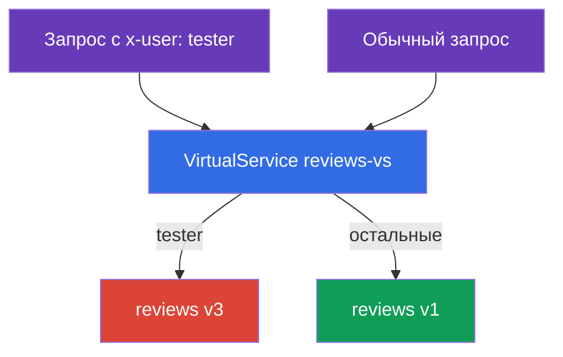
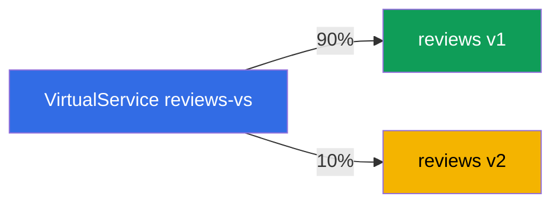
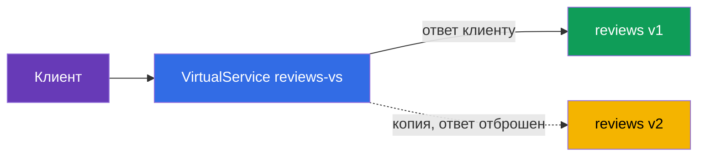

# Глава 6. Релизные стратегии: canary, header-routing, traffic mirroring

> **Что дальше.** В главе 5 мы разобрали базовые ресурсы: Gateway, VirtualService,
> DestinationRule. Теперь применим их к главной практической задаче - безопасному
> выкату новых версий. Разберём три приёма: маршрутизацию по заголовкам (скрытый
> запуск для тестировщиков), взвешенное распределение (canary) и зеркалирование
> трафика (проверка новой версии на боевом трафике без риска).

## 6.1. Deployment против release

Сначала важная идея, которая объясняет, зачем всё это нужно. В Kubernetes «выкатить
новую версию» обычно значит обновить Deployment - и все пользователи сразу идут на
новый код. Если в нём баг, его увидят все и сразу.

Istio позволяет разделить два события:

- **Deployment (развёртывание)** - новая версия просто запущена в кластере, поды
  работают, но боевого трафика на них нет.
- **Release (релиз)** - вы осознанно направляете на новую версию трафик: сначала
  чуть-чуть, потом больше.

Смысл в том, что развернуть новую версию и пустить на неё пользователей - это теперь
два независимых шага. Между ними можно проверить новую версию и в любой момент
откатить трафик, не трогая сами поды. На этом и строятся все релизные стратегии ниже.

Технически все три приёма это правила в `VirtualService` поверх subsets из
`DestinationRule` (глава 5). Предполагаем, что у сервиса `reviews` есть subsets `v1`,
`v2`, `v3`, описанные в DestinationRule.

## 6.2. Маршрутизация по заголовкам (dark launch)

Задача: новая экспериментальная версия `v3` ещё сырая, обычные пользователи не должны
её видеть. Но тестировщики должны на неё попадать, чтобы проверить на боевом кластере.
Тестировщиков отличаем по HTTP-заголовку `x-user: tester`.

Решение - правило `match` по заголовку в VirtualService:

```yaml
apiVersion: networking.istio.io/v1
kind: VirtualService
metadata:
  name: reviews-vs
spec:
  hosts:
  - reviews
  http:
  - match:                    # ПРАВИЛО 1: есть заголовок x-user: tester
    - headers:
        x-user:
          exact: tester
    route:
    - destination:
        host: reviews
        subset: v3            # тестировщиков на v3
  - route:                    # ПРАВИЛО 2: все остальные
    - destination:
        host: reviews
        subset: v1            # обычных пользователей на v1
```



Как это работает:

- Правила `http` проверяются сверху вниз, срабатывает первое подходящее.
- Если в запросе есть заголовок `x-user: tester` - срабатывает первое правило, трафик
  идёт на `v3`.
- Все остальные запросы не подходят под `match` и попадают во второе правило
  (без `match`, оно дефолтное) - идут на `v1`.

Это называют dark launch (скрытый запуск): новая версия работает на проде, но видна
только тем, кто знает «пароль» (нужный заголовок). Матчить можно не только заголовки,
но и путь URI, метод, query-параметры.

## 6.3. Взвешенное распределение (canary)

Задача: постепенно перевести пользователей со стабильной `v1` на новую `v2`. Начинаем
с малой доли, чтобы поймать проблемы на небольшом проценте трафика.

Решение - несколько destination с полем `weight`:

```yaml
  http:
  - route:
    - destination:
        host: reviews
        subset: v1
      weight: 90        # 90% трафика на стабильную v1
    - destination:
        host: reviews
        subset: v2
      weight: 10        # 10% на новую v2
```



Сумма весов должна давать 100. Дальше выкат идёт постепенно: меняете веса на 70/30,
потом 50/50, потом 0/100 - и новая версия принимает весь трафик. Если на каком-то шаге
заметили проблему, возвращаете веса назад. Пользователи при этом не трогаются, меняется
только распределение.

Это классический **canary release**: небольшая «канарейка» трафика проверяет новую
версию, прежде чем на неё пойдут все. Автоматизировать этот процесс (с анализом метрик
и автооткатом) помогает Flagger - о нём глава 24.

## 6.4. Traffic mirroring (теневой трафик)

И canary, и header-routing всё же отправляют часть **реальных** пользователей на новую
версию. А если хочется проверить новую версию на боевом трафике, вообще не рискуя
пользователями? Для этого есть зеркалирование.

Идея: 100% реальных запросов по-прежнему обслуживает `v1`, но Envoy дополнительно
отправляет **копию** каждого запроса на `v2`. Ответ от `v2` отбрасывается - клиент его
никогда не видит.

```yaml
  http:
  - route:
    - destination:
        host: reviews
        subset: v1        # 100% ответов клиенту от v1
    mirror:
      host: reviews
      subset: v2          # копия каждого запроса уходит на v2
    mirrorPercentage:
      value: 100          # какую долю трафика зеркалить
```



Разберём поля:

- **`route`** - основной маршрут. Клиент получает ответ только отсюда (subset `v1`).
- **`mirror`** - куда слать копию запроса (subset `v2`). Это «выстрелил и забыл»: Envoy
  не ждёт и не использует ответ зеркала.
- **`mirrorPercentage`** - какую долю трафика дублировать. Можно поставить, например,
  `25`, чтобы зеркалить только четверть боевых запросов.

Зачем это нужно: вы гоняете реальную нагрузку через `v2` и смотрите её метрики, логи и
ошибки, но без всякого риска для пользователей. Если `v2` упадёт или начнёт ошибаться,
клиенты этого не заметят - им отвечает `v1`.

Одно предупреждение: зеркалируемые запросы реально доходят до `v2`. Если это не GET, а,
например, POST, который что-то записывает, копия тоже выполнит запись. Для сервисов с
побочными эффектами (запись в БД, отправка писем) зеркалирование надо применять
осторожно.

## 6.5. Как это комбинируют

На практике приёмы складываются в общую стратегию выката:

1. Развернули `v2` рядом с `v1` (deployment), трафика на неё нет.
2. **Зеркалирование**: пустили тень боевого трафика на `v2`, посмотрели метрики и
   ошибки, ничем не рискуя.
3. **Header-routing**: пустили на `v2` только внутренних тестировщиков по заголовку.
4. **Canary**: начали переводить реальных пользователей - 10%, 30%, 50%, 100%.
5. Если на любом шаге плохо - откатили (вернули веса или маршрут на `v1`).

Все шаги это правки одного `VirtualService`, поды при этом не трогаются. В этом и сила
подхода: релиз стал управляемым и обратимым.

## 6.6. Итоги главы

- Istio разделяет deployment (версия просто запущена) и release (на неё направлен
  трафик) - это основа безопасных выкатов.
- **Header-routing (dark launch)**: правило `match` по заголовку направляет отдельную
  аудиторию (например, тестировщиков) на новую версию, остальных на стабильную.
- **Canary**: поле `weight` распределяет трафик между версиями по процентам;
  постепенно меняя веса, вы переводите пользователей на новую версию.
- **Traffic mirroring**: `mirror` + `mirrorPercentage` шлют копию трафика на новую
  версию, ответ отбрасывается - проверка на боевом трафике без риска.
- Зеркалирование опасно для запросов с побочными эффектами (запись данных).
- Все приёмы это правила в VirtualService поверх subsets; выкат управляемый и
  обратимый, поды не трогаются.

## 6.7. Вопросы для самопроверки

1. В чём разница между deployment и release и почему это важно для безопасных выкатов?
2. Как направить на новую версию только тех, у кого в запросе есть определённый
   заголовок?
3. Как устроен canary через веса и как выглядит постепенный выкат?
4. Чем зеркалирование отличается от canary? Видит ли клиент ответ от зеркала?
5. Почему зеркалирование опасно для POST-запросов, которые пишут данные?

## Практика

Отработайте маршрутизацию по заголовкам и canary:

🧪 Лаба 02: [tasks/ica/labs/02](../../labs/02/README_RU.MD)

Отработайте зеркалирование трафика (и балансировку - тема главы 7):

🧪 Лаба 06: [tasks/ica/labs/06](../../labs/06/README_RU.MD)

---
[Оглавление](../README.md) · [Глава 5](../05/ru.md) · [Глава 7](../07/ru.md)
