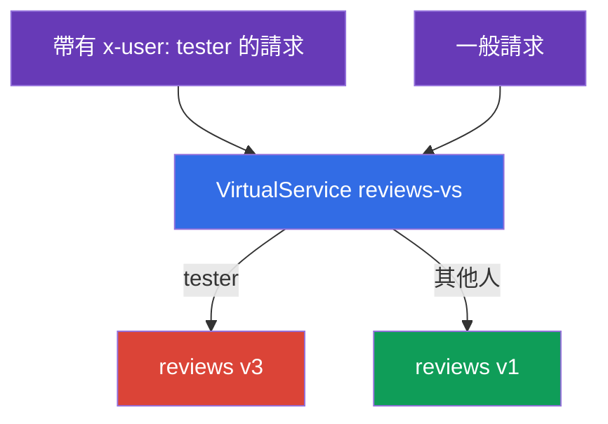
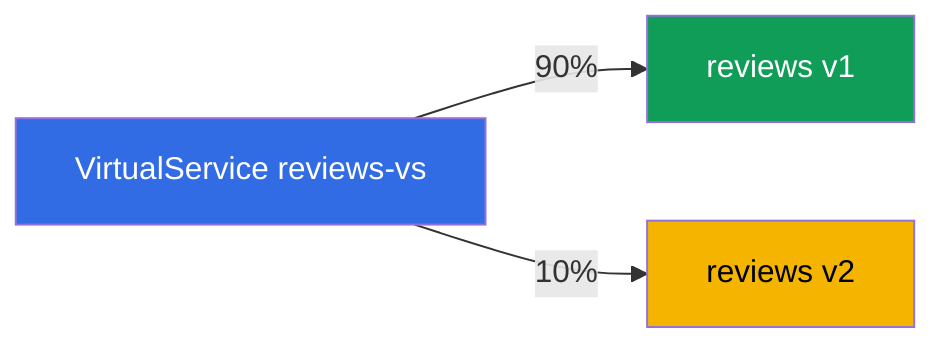
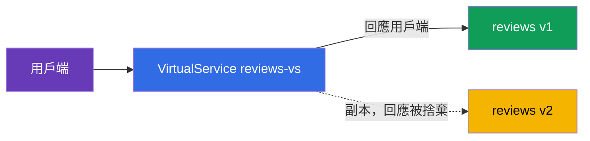

[Русская версия](ru.md) · [Eng version](en.md) · [Versión en español](es.md) · [Version française](fr.md) · [Deutsche Version](de.md) · [ქართული ვერსია](ge.md) · [日本語版](jp.md)

# 第 6 章。發布策略：canary、header-routing、traffic mirroring

> **接下來。** 在第 5 章中，我們介紹了基本資源：Gateway、VirtualService、
> DestinationRule。現在將它們應用於最重要的實務任務--安全地發布新版本。
> 我們將介紹三種技巧：依標頭路由（供測試人員進行隱藏啟動）、加權分配
> （canary）和流量鏡像（在不承擔風險下，以正式環境流量檢查新版本）。

## 6.1. Deployment 與 release

首先是一個重要概念，它說明了為何需要這一切。在 Kubernetes 中，「發布
新版本」通常意指更新 Deployment--所有使用者立即開始使用新程式碼。
如果其中有 bug，所有人會立即看到它。

Istio 讓您能將兩個事件分開：

- **Deployment（部署）**--新版本僅在叢集中啟動，pods 正在執行，
  但沒有正式流量流向它們。
- **Release（發布）**--您有意識地將流量導向新版本：起初少量，
  隨後逐漸增加。

重點在於，部署新版本與讓使用者使用它，現在是兩個獨立的步驟。兩者之間，
您可以檢查新版本，並隨時回退流量，而無需動到 pods 本身。以下所有發布策略
皆以此為基礎。

從技術上來說，這三種技巧都是 `VirtualService` 中、建構於
`DestinationRule`（第 5 章）subsets 之上的規則。我們假設服務 `reviews`
具有在 DestinationRule 中定義的 subsets `v1`、`v2`、`v3`。

## 6.2. 依標頭路由（dark launch）

任務：新的實驗版本 `v3` 尚未成熟，一般使用者不應該看到它。但測試人員應能
存取它，以便在正式叢集上測試。我們透過 HTTP 標頭 `x-user: tester` 識別
測試人員。

解決方案是在 VirtualService 中使用依標頭判斷的 `match` 規則：

```yaml
apiVersion: networking.istio.io/v1
kind: VirtualService
metadata:
  name: reviews-vs
spec:
  hosts:
  - reviews
  http:
  - match:                    # 規則 1：帶有標頭 x-user: tester
    - headers:
        x-user:
          exact: tester
    route:
    - destination:
        host: reviews
        subset: v3            # 測試人員導向 v3
  - route:                    # 規則 2：其他所有請求
    - destination:
        host: reviews
        subset: v1            # 一般使用者導向 v1
```



運作方式：

- `http` 規則由上而下檢查，第一個符合的規則會生效。
- 若請求帶有標頭 `x-user: tester`，第一個規則生效，流量會前往 `v3`。
- 其他所有請求都不符合 `match`，會進入第二個規則（沒有 `match`，它是預設
  規則）並前往 `v1`。

這稱為 dark launch（隱藏啟動）：新版本在正式環境中執行，但只有知道「密碼」
（所需標頭）的人能看到它。不僅能比對標頭，也能比對 URI 路徑、方法和
query 參數。

## 6.3. 加權分配（canary）

任務：逐步將使用者從穩定的 `v1` 轉移至新的 `v2`。我們從小比例開始，以便在
少量流量中發現問題。

解決方案是設定多個帶有 `weight` 欄位的 destination：

```yaml
  http:
  - route:
    - destination:
        host: reviews
        subset: v1
      weight: 90        # 90% 流量導向穩定的 v1
    - destination:
        host: reviews
        subset: v2
      weight: 10        # 10% 導向新的 v2
```



權重總和必須為 100。接下來發布會逐步進行：將權重改為 70/30，然後 50/50，
接著 0/100--新版本接收全部流量。若在任一階段發現問題，就將權重改回去。
此時不會動到使用者，只改變流量分配。

這是經典的 **canary release**：少量「金絲雀」流量在所有人都使用新版本前，
先驗證它。Flagger 可協助自動化此流程（包含指標分析與自動回退）--第 24 章
將介紹它。

## 6.4. Traffic mirroring（影子流量）

canary 和 header-routing 都還是會將部分**真實**使用者導向新版本。那麼，如果
想在完全不讓使用者承擔風險的情況下，以正式環境流量檢查新版本呢？這時可使用
鏡像。

概念是：100% 的真實請求仍由 `v1` 處理，但 Envoy 會額外將每個請求的**副本**
傳送至 `v2`。來自 `v2` 的回應會被捨棄--用戶端永遠不會看到它。

```yaml
  http:
  - route:
    - destination:
        host: reviews
        subset: v1        # 用戶端 100% 的回應來自 v1
    mirror:
      host: reviews
      subset: v2          # 每個請求的副本傳送至 v2
    mirrorPercentage:
      value: 100          # 要鏡像多少比例的流量
```



讓我們逐一說明欄位：

- **`route`**--主要路由。用戶端僅從此處收到回應（subset `v1`）。
- **`mirror`**--傳送請求副本的目的地（subset `v2`）。這是「發送後不管」：
  Envoy 不會等待或使用鏡像的回應。
- **`mirrorPercentage`**--要複製的流量比例。例如可設為 `25`，僅鏡像四分之
  一的正式請求。

用途：您可以讓真實負載通過 `v2`，並查看其指標、日誌與錯誤，同時完全不讓
使用者承擔風險。即使 `v2` 當機或開始發生錯誤，用戶端也不會察覺--它們收到的
是 `v1` 的回應。

一項警告：鏡像請求確實會抵達 `v2`。如果它不是 GET，而是例如會寫入內容的
POST，副本同樣會執行寫入。對具有副作用的服務（寫入資料庫、寄送電子郵件），
必須謹慎使用鏡像。

## 6.5. 如何組合使用

實務上，這些技巧可整合成一個完整的發布策略：

1. 在 `v1` 旁部署 `v2`（deployment），尚未有流量導向它。
2. **鏡像**：將正式流量的影子導向 `v2`，檢查指標與錯誤，且不承擔任何風險。
3. **Header-routing**：僅透過標頭將內部測試人員導向 `v2`。
4. **Canary**：開始轉移真實使用者--10%、30%、50%、100%。
5. 若任一階段出現問題--回退（將權重或路由恢復為 `v1`）。

所有步驟都是對單一 `VirtualService` 的修改，pods 不會受到影響。這正是此方法
的強大之處：發布變得可控且可逆。

## 6.6. 本章總結

- Istio 將 deployment（版本僅啟動）和 release（流量被導向它）分開--這是
  安全發布的基礎。
- **Header-routing（dark launch）**：依標頭設定的 `match` 規則，會將特定
  受眾（例如測試人員）導向新版本，其他人則導向穩定版本。
- **Canary**：`weight` 欄位依百分比分配各版本之間的流量；透過逐步變更權重，
  您可將使用者轉移至新版本。
- **Traffic mirroring**：`mirror` + `mirrorPercentage` 將流量副本傳送至新
  版本，回應會被捨棄--在無風險下以正式環境流量進行檢查。
- 鏡像對於具有副作用的請求（資料寫入）很危險。
- 所有技巧都是建構於 subsets 上的 VirtualService 規則；發布可控且可逆，
  pods 不會受到影響。

## 6.7. 自我檢查問題

1. deployment 和 release 有何差異？為何這對安全發布很重要？
2. 如何只將請求中帶有特定標頭的人導向新版本？
3. 如何透過權重實作 canary？逐步發布看起來是什麼樣子？
4. 鏡像與 canary 有何不同？用戶端會看到鏡像的回應嗎？
5. 為什麼鏡像對會寫入資料的 POST 請求有危險？

## 實作練習

練習依標頭路由與 canary：

🧪 實驗 02：[tasks/ica/labs/02](../../labs/02/README_TW.MD)

練習流量鏡像（以及負載平衡--第 7 章的主題）：

🧪 實驗 06：[tasks/ica/labs/06](../../labs/06/README_TW.MD)

---
[目錄](../README_TW.md) · [第 5 章](../05/tw.md) · [第 7 章](../07/tw.md)
