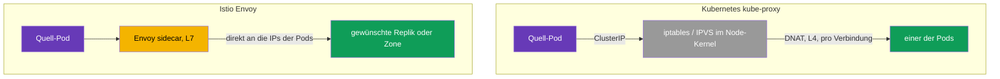
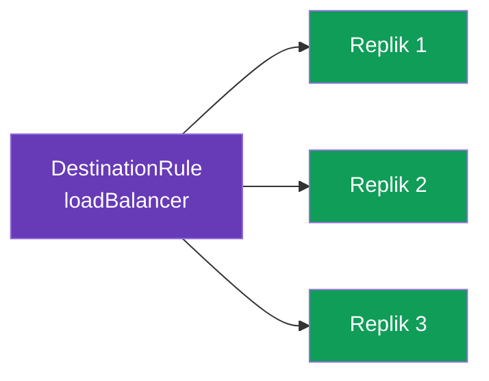
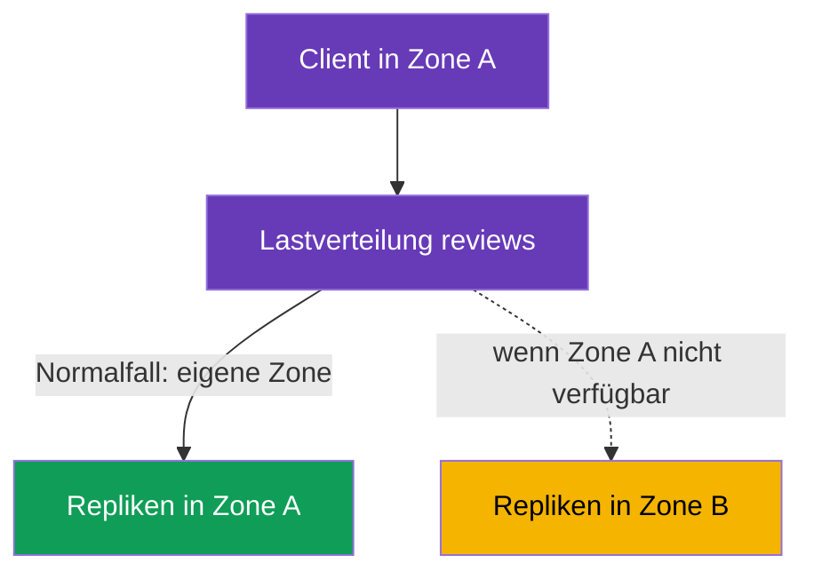

[RU version](ru.md) · [Eng version](en.md) · [Versión en español](es.md) · [Version française](fr.md)

# Kapitel 7. Lastverteilung und Locality-aware Failover

> **Was kommt als Nächstes.** In den Kapiteln 5 und 6 haben wir entschieden, auf welche
> Version eines Dienstes der Datenverkehr geleitet wird. Jetzt steigen wir eine Ebene
> tiefer: Ist die Version gewählt, müssen die Anfragen irgendwie zwischen deren Repliken
> (Pods) verteilt werden. Das ist die Lastverteilung. Außerdem sehen wir uns an, wie man
> den Datenverkehr in die nächstgelegene Zone leitet und bei einem Ausfall automatisch auf
> eine andere umschaltet - Locality-aware Load Balancing und Failover.

## 7.1. Wo in Istio die Lastverteilung lebt

Ein wichtiger Unterschied zum gewöhnlichen Kubernetes ist, **wo** und **wie** die
Entscheidung über die Lastverteilung getroffen wird.

**Gewöhnliches Kubernetes: kube-proxy auf den Nodes.** `kube-proxy` läuft als DaemonSet -
eine Instanz pro **jeder Node**. Wichtig: Es leitet den Datenverkehr nicht selbst durch sich
hindurch. Seine Aufgabe ist es, die Objekte Service/EndpointSlice über den API-Server zu
beobachten und **Regeln im Kernel der Node zu programmieren** (iptables oder IPVS). Wenn ein
Pod die ClusterIP eines Dienstes anspricht, fangen diese Regeln das Paket direkt im
Netzwerk-Stack der **Sender-Node** ab und ersetzen per DNAT die Zieladresse durch die IP eines
der Backend-Pods. Es balanciert also nicht der Prozess kube-proxy, sondern der **Kernel der
Node** anhand der zuvor abgelegten Regeln. Daraus ergeben sich Einschränkungen:

- Die Entscheidung wird **auf Verbindungsebene (L4)** getroffen, nicht pro Anfrage: Bei
  HTTP/2 und gRPC „klebt“ der gesamte Datenverkehr an einer Replik (ausführlich in
  Kapitel 10);
- kein Verständnis von HTTP: kein „10 % auf v2“, kein Routing nach Header, keine
  Retries/Timeouts;
- der Algorithmus ist kaum konfigurierbar - es ist iptables (pseudozufällig) oder IPVS
  (einfaches Round-Robin und ein paar Varianten), keine flexible Anwendungs-Policy;
- Lastverteilung **auf der Quellseite**: Die Regeln greifen auf der Node, wo der aufrufende
  Pod lebt.

**Istio: Envoy im Pod.** Im Mesh fängt der Sidecar den ausgehenden Datenverkehr ab (Kapitel 4)
und balanciert ihn selbst, auf Ebene **L7**, indem er sich **direkt an die IPs der Pods**
wendet - unter Umgehung der ClusterIP-Lastverteilung von kube-proxy. Sie steuern das über die
`DestinationRule` - dieselbe Ressource, in der wir in Kapitel 5 die Subsets beschrieben haben.
Die Lastverteilung in Istio ist also eine weitere Policy zum Empfänger des Datenverkehrs, und
sie lässt sich fein einstellen: Algorithmen, Lokalität, Session Affinity - darum geht es im
ganzen Rest des Kapitels.



## 7.2. Lastverteilungs-Algorithmen

Der Algorithmus wird in `trafficPolicy.loadBalancer.simple` festgelegt:

```yaml
apiVersion: networking.istio.io/v1
kind: DestinationRule
metadata:
  name: reviews-dr
spec:
  host: reviews
  trafficPolicy:
    loadBalancer:
      simple: ROUND_ROBIN     # Lastverteilungs-Algorithmus
```

Die wichtigsten Varianten:

| Algorithmus | Wie er funktioniert | Wann verwenden |
|----------|--------------|--------------------|
| `ROUND_ROBIN` | reihum im Kreis | einfacher Standard |
| `LEAST_REQUEST` | auf die Replik mit den wenigsten aktiven Anfragen | oft effizienter als Round-Robin |
| `RANDOM` | zufällige Wahl einer Replik | wenn eine einfache gleichmäßige Streuung nötig ist |
| `PASSTHROUGH` | ohne Lastverteilung, an die ursprüngliche Adresse | Sonderfälle, meist nicht nötig |



In der Praxis ist `LEAST_REQUEST` oft besser als `ROUND_ROBIN`: Er schaut auf die aktuelle
Auslastung der Repliken und schickt keine Anfrage an eine bereits beschäftigte. `ROUND_ROBIN`
wechselt dagegen stur ab, ohne auf die Last zu schauen.

### Consistent Hash: „klebrige“ Sitzungen (Session Affinity)

Die obigen Werte werden über `simple` gesetzt. Es gibt aber auch einen eigenen Modus
`consistentHash` - wenn die Anfragen eines Clients immer auf **dieselbe Replik** treffen
sollen (wegen eines In-Memory-Caches im Pod, einer Sitzung, lokalen Zustands). Envoy wählt die
Replik anhand eines Hashes des Schlüssels, und derselbe Schlüssel geht auf dieselbe Replik
(solange sich der Satz der Repliken nicht ändert).

Der Schlüssel wird aus einem HTTP-Header, Cookie, Query-Parameter oder der Source-IP
genommen:

```yaml
spec:
  host: reviews
  trafficPolicy:
    loadBalancer:
      consistentHash:
        httpHeaderName: x-user            # Hash über den Header x-user
        # httpCookie: { name: session, ttl: 3600s }  # oder über Cookie
        # useSourceIp: true                           # oder über die Client-IP
        # httpQueryParameterName: user                # oder über den Query-Parameter
```

Wichtig zu verstehen: Bei `consistentHash` geht es um **Kleben**, nicht um
Gleichmäßigkeit. Sind die Schlüssel wenige oder „schief“ (ein aktiver Benutzer), verteilt
sich die Last ungleichmäßig. Und ändert sich die Anzahl der Repliken, wandert unvermeidlich
ein Teil der Schlüssel auf andere Pods (das ist der Preis jedes Hash-Rings). Für eine faire,
gleichmäßige Lastverteilung ohne Sitzungen nehmen Sie `LEAST_REQUEST`, und `consistentHash`
nur dann, wenn das Kleben wirklich nötig ist.

## 7.3. Überschreiben auf Portebene

Manchmal hat ein Dienst mehrere Ports mit unterschiedlichen Anforderungen.
`portLevelSettings` erlaubt es, für einen konkreten Port einen eigenen Algorithmus
festzulegen und den allgemeinen für die übrigen zu belassen.

```yaml
spec:
  host: reviews
  trafficPolicy:
    loadBalancer:
      simple: ROUND_ROBIN         # allgemeiner Algorithmus für alle Ports
    portLevelSettings:
    - port:
        number: 8080
      loadBalancer:
        simple: LEAST_REQUEST     # aber für Port 8080 ein anderer
```

Hier wird der gesamte Datenverkehr per `ROUND_ROBIN` balanciert, und für Port `8080` gilt
`LEAST_REQUEST`. Das ist praktisch, wenn zum Beispiel auf einem Port eine REST-API läuft und
auf einem anderen gRPC oder Metriken, und sie einen unterschiedlichen Lastcharakter haben.

## 7.4. Locality-aware Load Balancing

Nun eine interessantere Aufgabe. Stellen Sie sich vor, ein Dienst läuft in zwei
Verfügbarkeitszonen (`eu-central-1a` und `eu-central-1b`). Standardmäßig verteilt Envoy den
Datenverkehr gleichmäßig auf alle Repliken, ohne auf die Zonen zu schauen. Das ist schlecht:
Eine Anfrage aus Zone A kann in Zone B landen und Latenz sowie zonenübergreifenden
Datenverkehr (für den man in der Cloud auch noch zahlt) hinzufügen.

**Locality-aware Load Balancing** löst das: Der Datenverkehr bleibt nach Möglichkeit in seiner
eigenen Zone (Region / Zone / Node). Istio bestimmt den Standort der Pods automatisch anhand
der Standard-Labels von Kubernetes (`topology.kubernetes.io/region`,
`topology.kubernetes.io/zone`), die Cloud-Provider auf den Nodes setzen.



Standardmäßig schaltet sich, wenn es Pods mit Sidecar in mehreren Zonen gibt, die Priorität
der eigenen Zone von selbst ein. Die Feineinstellung erfolgt über `localityLbSetting`.

### Und wenn die Zonalität schon im Kubernetes Service selbst konfiguriert ist?

Kubernetes hat einen eigenen Mechanismus, „den Datenverkehr in der eigenen Zone zu halten“,
der nichts mit Istio zu tun hat:

- **`spec.trafficDistribution: PreferClose`** am Service (stabil ab k8s 1.31);
- älter - die Annotation `service.kubernetes.io/topology-mode: Auto` (Topology Aware
  Routing).

Beide funktionieren über **kube-proxy** auf Ebene L4: kube-proxy bevorzugt Endpoints in
derselben Zone.

Der Kernpunkt: **im Mesh läuft der Datenverkehr nicht über kube-proxy, sondern über Envoy**.
Der Sidecar fängt den ausgehenden Datenverkehr ab und balanciert selbst direkt über die IPs
der Pods, unter Umgehung von kube-proxy. Deshalb leben die beiden Mechanismen auf
verschiedenen Schichten:

| | Nativ in Kubernetes | In Istio |
|---|---|---|
| Wer balanciert | kube-proxy (L4) | Envoy sidecar (L7) |
| Wie aktivieren | `trafficDistribution: PreferClose` (oder `topology-mode: Auto`) am Service | `localityLbSetting` in der DestinationRule |
| Auf welchen Datenverkehr wirkt es | Pods **ohne** Sidecar / Datenverkehr an Envoy vorbei | Datenverkehr **im Mesh** (über den Sidecar) |
| Failover bei Zonenausfall | automatisch, einfach (ohne explizite Regeln) | explizit über `failover`, nur zusammen mit `outlierDetection` |
| Flexibilität | eigene Zone bevorzugen (an/aus) | Zonen-Priorität + Gewichte (`distribute`) + `failover`-Regeln + Hierarchie region/zone/subzone |

Praktisches Fazit:

- Für Datenverkehr **innerhalb des Mesh** konfiguriert man die Zonalität in Istio
  (`localityLbSetting`). Die Annotation `trafficDistribution` am Service **wirkt auf diesen
  Datenverkehr nicht** - kube-proxy ist nicht im Pfad.
- Die Annotation am Service bleibt relevant für **Nicht-Mesh**-Datenverkehr: Pods ohne
  Sidecar und Aufrufe, die nicht durch Envoy laufen.
- Beide Mechanismen „vorsichtshalber“ zu setzen, ergibt keinen Sinn - sie liegen auf
  verschiedenen Schichten. Wählen Sie den, durch den Ihr Datenverkehr tatsächlich läuft: Ist
  der Dienst komplett im Mesh - genügt Istio; ist ein Teil der Clients außerhalb des Mesh -
  dort greift der k8s-Mechanismus.

> Istio hat auch eine „vereinfachte“ Variante im Stil von Kubernetes - die Annotation
> `networking.istio.io/traffic-distribution: PreferClose` am Service: ein einfacheres
> Pendant zu `localityLbSetting`, wenn keine feinen Regeln für Failover/Gewichte nötig sind
> (und der Hauptweg für den ambient-Modus, wo es keinen Sidecar gibt - Kapitel 22).

## 7.5. Failover zwischen Zonen

Die Priorität der eigenen Zone ist im Normalbetrieb gut. Aber was, wenn alle Repliken in
Zone A ausgefallen sind? Dann muss der Datenverkehr automatisch in Zone B ausweichen. Genau
das ist **Failover**.

Ein Kernpunkt, der oft übersehen wird: Damit Failover greift, muss Istio **verstehen, dass
die lokalen Repliken ungesund sind**. Dafür ist `outlierDetection` zuständig (wir behandeln
es ausführlich in Kapitel 8 über circuit breaking). Ohne es schließt Istio die kranken
Endpoints nicht aus, und Failover startet nicht.

```yaml
apiVersion: networking.istio.io/v1
kind: DestinationRule
metadata:
  name: reviews-dr
spec:
  host: reviews
  trafficPolicy:
    loadBalancer:
      localityLbSetting:
        enabled: true
        failover:
        - from: eu-central-1a     # wenn in Zone A etwas kaputtgeht
          to: eu-central-1b       # weichen wir nach Zone B aus
    outlierDetection:             # PFLICHT für Failover
      consecutive5xxErrors: 3     # 3 Fehler in Folge
      interval: 10s               # wie oft prüfen
      baseEjectionTime: 30s       # für wie lange den kranken Endpoint ausschließen
```

Die Logik ist so: `outlierDetection` beobachtet die Antworten der Repliken. Beginnen die
Repliken in Zone A, Fehler zu produzieren, schließt Envoy sie aus der Lastverteilung aus.
Bleiben in der lokalen Zone keine gesunden Repliken übrig, greift `failover`, und der
Datenverkehr weicht nach Zone B aus. Sobald sich Zone A erholt, kehrt der Datenverkehr zu ihr
zurück.

## 7.6. Gewichtete Verteilung nach Zonen

Manchmal braucht man keine harte Priorität der eigenen Zone, sondern eine weichere Verteilung:
zum Beispiel 80 % des Datenverkehrs lokal halten und 20 % dennoch in die Nachbarzone schicken
(zum Aufwärmen oder für Gleichmäßigkeit). Das erfolgt über `distribute`:

```yaml
    loadBalancer:
      localityLbSetting:
        enabled: true
        distribute:
        - from: eu-central-1a/*
          to:
            "eu-central-1a/*": 80    # 80% bleibt in der eigenen Zone
            "eu-central-1b/*": 20    # 20% geht in die Nachbarzone
```

`distribute` und `failover` lösen unterschiedliche Aufgaben: `distribute` legt die normale
Verteilung nach Zonen in Prozent fest, und `failover` beschreibt, wohin bei einem Ausfall
auszuweichen ist. Man kann sie zusammen verwenden.

## 7.7. Best Practices

- **`LEAST_REQUEST` als Standardwahl.** In den meisten Fällen ist er besser als
  `ROUND_ROBIN`: Er berücksichtigt die aktuelle Auslastung der Repliken. `ROUND_ROBIN` ist
  gerechtfertigt, wenn die Repliken gleich und die Anfragen homogen sind.
- **Session Affinity - nur wenn nötig.** `consistentHash` ist für Caches und Sitzungen
  nützlich, verschlechtert aber die Gleichmäßigkeit und erschwert das Skalieren (beim
  Hinzufügen einer Replik wandert ein Teil der Schlüssel). Verwenden Sie ihn nicht als
  „Standard-Lastverteilung“.
- **Failover = Locality + `outlierDetection`.** Die Priorität der eigenen Zone ist ohne
  `outlierDetection` für die Ausfallsicherheit nutzlos: Istio versteht nicht, dass die
  lokalen Repliken krank sind, und schaltet den Datenverkehr nicht um (siehe 7.5).
- **Halten Sie Repliken in jeder Zone.** Locality-aware ergibt nur dann Sinn, wenn es in den
  Zonen gesunde Repliken gibt. Planen Sie mindestens 2 Repliken pro Zone - sonst weicht der
  Datenverkehr beim Verlust der einzigen Replik ohnehin in die Nachbarzone aus, und die
  Lokalität hilft nicht.
- **Cross-Zone-Datenverkehr ist die Ausnahme, nicht die Norm.** Zonenübergreifender
  Datenverkehr ist langsamer und kostet. Halten Sie ihn lokal (`localityLbSetting`) und setzen
  Sie `distribute`/`failover` bewusst ein.
- **Vorsicht mit dem Panic Threshold.** Schließt `outlierDetection` zu viele Endpoints aus
  (standardmäßig, wenn weniger als ~50 % gesund sind), aktiviert Envoy den „Panic Mode“ und
  schickt den Datenverkehr wieder auf alle Repliken, **unter Missachtung der Gesundheit** - um
  nicht komplett auszufallen. Das ist ein Schutz gegen „alles abschalten“, kann aber bei
  aggressivem `outlierDetection` das Problem verschleiern. Der Schwellenwert wird über
  `outlierDetection.minHealthPercent` geregelt.
- **Slow Start für neue Repliken.** Damit ein gerade hochgefahrener Pod nicht sofort die
  Spitzenlast erhält (kalter Cache, JIT-Aufwärmen), aktivieren Sie ein sanftes Hochfahren:

  ```yaml
      loadBalancer:
        simple: LEAST_REQUEST
        warmupDurationSecs: 60     # Datenverkehr auf die neue Replik über 60 s sanft hochfahren
  ```

- **Eine Schicht der Zonalität.** Vermischen Sie k8s `trafficDistribution` und Istio
  `localityLbSetting` nicht für denselben Mesh-Datenverkehr (siehe 7.4) - konfigurieren Sie
  dort, wo der Datenverkehr tatsächlich läuft.

## 7.8. Zusammenfassung des Kapitels

- Im gewöhnlichen Kubernetes balanciert nicht kube-proxy selbst, sondern der **Kernel der
  Node** anhand der iptables-/IPVS-Regeln, die kube-proxy (DaemonSet auf jeder Node) abgelegt
  hat - das ist L4, pro Verbindung. In Istio übernimmt die Lastverteilung Envoy (L7), indem
  er sich direkt an die IPs der Pods wendet, und sie wird in der `DestinationRule`
  konfiguriert.
- Der Algorithmus wird in `loadBalancer.simple` festgelegt: `ROUND_ROBIN`, `LEAST_REQUEST`,
  `RANDOM`, `PASSTHROUGH`. `LEAST_REQUEST` ist oft effizienter als Round-Robin.
- Für „klebrige“ Sitzungen gibt es den eigenen Modus `consistentHash` (über Header, Cookie,
  Query-Parameter oder Source-IP) - Kleben an eine Replik, aber auf Kosten der
  Gleichmäßigkeit.
- Best Practices: `LEAST_REQUEST` als Standard, `consistentHash` nur bei Bedarf, Failover
  immer mit `outlierDetection`, Repliken in jeder Zone, Cross-Zone als Ausnahme,
  `warmupDurationSecs` zum Aufwärmen neuer Pods, an den Panic Threshold denken.
- `portLevelSettings` erlaubt es, für einen einzelnen Port einen eigenen Algorithmus
  festzulegen.
- Locality-aware Load Balancing hält den Datenverkehr in seiner eigenen Zone; den Standort
  nimmt Istio aus den Topologie-Labels der Nodes.
- Die native k8s-Zonalität (`trafficDistribution: PreferClose` / `topology-mode: Auto`)
  funktioniert über kube-proxy (L4) und **wirkt auf Mesh-Datenverkehr nicht** (im Pfad ist
  Envoy, nicht kube-proxy); für Datenverkehr im Mesh konfiguriert man die Zonen in Istio
  (`localityLbSetting`), für Nicht-Mesh - mit dem Kubernetes-Mechanismus.
- `failover` schaltet den Datenverkehr bei einem Ausfall in eine andere Zone, funktioniert
  aber nur zusammen mit `outlierDetection` (sonst versteht Istio nicht, dass die Repliken
  krank sind).
- `distribute` legt eine weiche Verteilung nach Zonen in Prozent fest.

## 7.9. Fragen zur Selbstüberprüfung

1. Wo in Istio wird der Lastverteilungs-Algorithmus konfiguriert und wodurch unterscheidet
   sich das von kube-proxy?
2. Wodurch unterscheidet sich `LEAST_REQUEST` von `ROUND_ROBIN`?
3. Wozu braucht man `portLevelSettings`?
4. Was ist Locality-aware Load Balancing und woher erfährt Istio die Zone eines Pods?
5. Warum ist `outlierDetection` für Failover zwingend?
6. Wodurch unterscheidet sich `distribute` von `failover`?
7. Wenn am Kubernetes Service bereits `trafficDistribution: PreferClose` steht, wirkt sich das
   auf den Datenverkehr innerhalb des Mesh aus? Warum? Wo konfiguriert man dann die Zonalität
   fürs Mesh?
8. Wann sollte man `consistentHash` statt `LEAST_REQUEST` verwenden? Worin liegen seine
   Nachteile?
9. Was ist der Panic Threshold und wozu braucht man ihn? Wie hilft `warmupDurationSecs` neuen
   Repliken?

## Praxis

Üben Sie die Lastverteilungs-Algorithmen und das Überschreiben auf Portebene:

🧪 Lab 06: [tasks/ica/labs/06](../../labs/06/README_DE.MD)

Üben Sie Locality-aware Failover zwischen Zonen:

🧪 Lab 14: [tasks/ica/labs/14](../../labs/14/README_DE.MD)

---
[Inhaltsverzeichnis](../README_DE.md) · [Kapitel 6](../06/de.md) · [Kapitel 8](../08/de.md)
