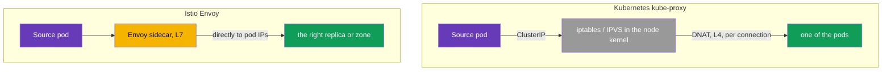
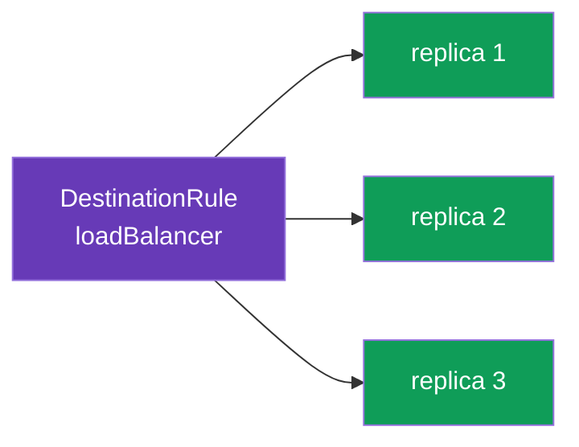
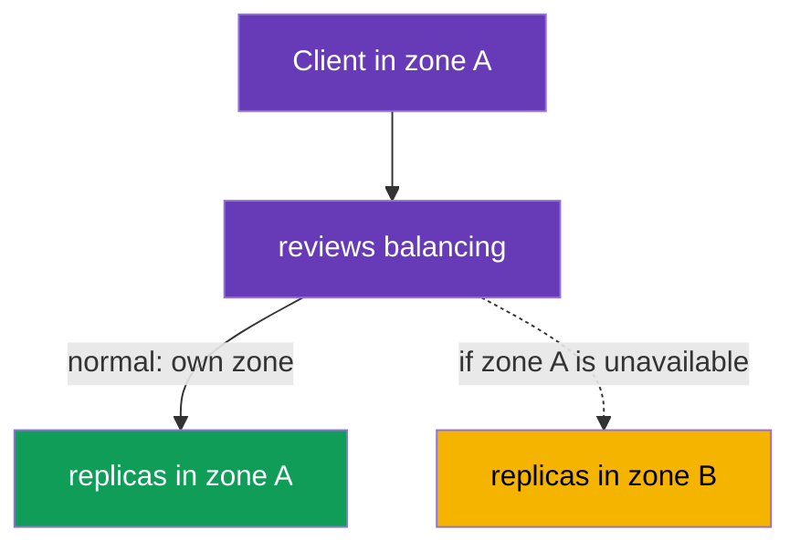

[RU version](ru.md) · [Versión en español](es.md) · [Version française](fr.md) · [Deutsche Version](de.md)

# Chapter 7. Load balancing and locality-aware failover

> **What's next.** In chapters 5 and 6 we decided which version of a service to send traffic
> to. Now we go one level lower: once the version is chosen, the requests still have to be
> distributed among its replicas (pods). That is load balancing. We will also cover how to
> make traffic go to the nearest zone and automatically switch to another one on failure -
> locality-aware load balancing and failover.

## 7.1. Where load balancing lives in Istio

An important difference from ordinary Kubernetes is **where** and **how** the balancing
decision is made.

**Ordinary Kubernetes: kube-proxy on the nodes.** `kube-proxy` runs as a DaemonSet - one
instance on **every node**. Importantly: it does not pass traffic through itself. Its job is
to watch Service/EndpointSlice objects via the API server and **program rules in the node's
kernel** (iptables or IPVS). When a pod calls a Service ClusterIP, the packet is intercepted
by these rules right in the network stack of the **source node** and DNAT'd to the IP of one
of the backend pods. That is, balancing is done not by the kube-proxy process but by the
**node's kernel** using pre-laid-out rules. Hence the limitations:

- the decision is made **at the connection level (L4)**, not the request level: for HTTP/2
  and gRPC all the traffic "sticks" to one replica (in detail - in chapter 10);
- no HTTP awareness: you cannot do "10% to v2", cannot route by header, no retries/timeouts;
- the algorithm is barely configurable - it is iptables (pseudo-random) or IPVS (simple
  round-robin and a couple of variants), not a flexible application-level policy;
- balancing is **on the source side**: the rules run on the node where the calling pod lives.

**Istio: Envoy in the pod.** In the mesh the sidecar intercepts outbound traffic (chapter 4)
and balances it itself, at **L7**, talking **directly to pod IPs** - bypassing the ClusterIP
balancing of kube-proxy. You control it via a `DestinationRule` - the same resource where we
described subsets in chapter 5. So balancing in Istio is one more policy toward the traffic
recipient, and it can be finely tuned: algorithms, locality, session affinity - which is what
the rest of the chapter is about.



## 7.2. Load balancing algorithms

The algorithm is set in `trafficPolicy.loadBalancer.simple`:

```yaml
apiVersion: networking.istio.io/v1
kind: DestinationRule
metadata:
  name: reviews-dr
spec:
  host: reviews
  trafficPolicy:
    loadBalancer:
      simple: ROUND_ROBIN     # the load balancing algorithm
```

The main options:

| Algorithm | How it works | When to use |
|-----------|--------------|-------------|
| `ROUND_ROBIN` | one after another in a circle | a simple default |
| `LEAST_REQUEST` | to the replica with the fewest active requests | often more efficient than round-robin |
| `RANDOM` | random choice of replica | when you need a simple even spread |
| `PASSTHROUGH` | no balancing, to the original address | special cases, usually not needed |



In practice `LEAST_REQUEST` is often better than `ROUND_ROBIN`: it looks at the current load
of the replicas and does not send a request to an already busy one. `ROUND_ROBIN` just
alternates blindly, without looking at load.

### Consistent hash: sticky sessions (session affinity)

The values above are set via `simple`. But there is also a separate `consistentHash` mode -
for when requests from one client must always land on the **same replica** (for an in-pod
cache, a session, local state). Envoy picks a replica by a hash of a key, and the same key
goes to the same replica (as long as the set of replicas does not change).

The key is taken from an HTTP header, a cookie, a query parameter, or the source IP:

```yaml
spec:
  host: reviews
  trafficPolicy:
    loadBalancer:
      consistentHash:
        httpHeaderName: x-user            # hash by the x-user header
        # httpCookie: { name: session, ttl: 3600s }  # or by a cookie
        # useSourceIp: true                           # or by the client IP
        # httpQueryParameterName: user                # or by a query parameter
```

Important to understand: `consistentHash` is about **stickiness**, not about evenness. If
there are few keys or they are "skewed" (one very active user), the load will be uneven. And
when the number of replicas changes, some keys will inevitably move to other pods (the price
of any hash ring). For fair, even balancing without sessions use `LEAST_REQUEST`, and
`consistentHash` only when stickiness is really needed.

## 7.3. Overriding at the port level

Sometimes a service has several ports with different requirements. `portLevelSettings` lets
you set your own algorithm for a specific port while keeping a common one for the rest.

```yaml
spec:
  host: reviews
  trafficPolicy:
    loadBalancer:
      simple: ROUND_ROBIN         # the common algorithm for all ports
    portLevelSettings:
    - port:
        number: 8080
      loadBalancer:
        simple: LEAST_REQUEST     # but a different one for port 8080
```

Here all traffic is balanced with `ROUND_ROBIN`, while port `8080` uses `LEAST_REQUEST`. This
is handy when, for example, one port has a REST API and another has gRPC or metrics, and they
have a different load profile.

## 7.4. Locality-aware load balancing

Now a more interesting task. Imagine a service runs in two availability zones
(`eu-central-1a` and `eu-central-1b`). By default Envoy spreads traffic across all replicas
equally, without regard to zones. This is bad: a request from zone A may go to zone B, adding
latency and cross-zone traffic (which the cloud also charges you for).

**Locality-aware load balancing** solves this: traffic stays in its own locality where
possible (region / zone / node). Istio determines pod locality automatically from the
standard Kubernetes labels (`topology.kubernetes.io/region`, `topology.kubernetes.io/zone`)
that cloud providers put on the nodes.



By default, if there are pods with a sidecar in several zones, the own-zone priority turns on
by itself. Fine tuning is done via `localityLbSetting`.

### What if zone-awareness is already configured in the Kubernetes Service?

Kubernetes has its own mechanism for "keeping traffic in its own zone", unrelated to Istio:

- **`spec.trafficDistribution: PreferClose`** on a Service (stable since k8s 1.31);
- the older annotation `service.kubernetes.io/topology-mode: Auto` (Topology Aware Routing).

Both work through **kube-proxy** at L4: kube-proxy prefers endpoints in the same zone.

The key point: **in the mesh traffic goes not through kube-proxy but through Envoy**. The
sidecar intercepts outbound traffic and balances it itself directly to pod IPs, bypassing
kube-proxy. So the two mechanisms live at different layers:

| | Natively in Kubernetes | In Istio |
|---|---|---|
| Who balances | kube-proxy (L4) | Envoy sidecar (L7) |
| How to enable | `trafficDistribution: PreferClose` (or `topology-mode: Auto`) on the Service | `localityLbSetting` in a DestinationRule |
| Which traffic it affects | pods **without** a sidecar / traffic bypassing Envoy | traffic **in the mesh** (via the sidecar) |
| Failover on zone failure | automatic, simple (no explicit rules) | explicit via `failover`, only together with `outlierDetection` |
| Flexibility | prefer own zone (on/off) | zone priority + weights (`distribute`) + `failover` rules + region/zone/subzone hierarchy |

The practical conclusion:

- For traffic **inside the mesh** you configure zone-awareness in Istio (`localityLbSetting`).
  The `trafficDistribution` annotation on the Service **does not affect** this traffic -
  kube-proxy is not in the path.
- The annotation on the Service is still relevant for **non-mesh** traffic: pods without a
  sidecar and calls that do not go through Envoy.
- Setting both mechanisms "just in case" makes no sense - they are at different layers. Pick
  the one your traffic actually goes through: a fully-meshed service - Istio is enough; some
  clients outside the mesh - the Kubernetes mechanism works there.

> Istio also has a "simplified" variant in the spirit of Kubernetes - the
> `networking.istio.io/traffic-distribution: PreferClose` annotation on a Service: a simpler
> analog of `localityLbSetting` for when you do not need fine failover/weight rules (and the
> main way for ambient mode, where there is no sidecar - chapter 22).

## 7.5. Failover between zones

Own-zone priority is good in the normal case. But what if all the replicas in zone A have
failed? Then traffic must automatically go to zone B. This is **failover**.

A key point often missed: for failover to work, Istio must **understand that the local
replicas are unhealthy**. This is handled by `outlierDetection` (we cover it in detail in
chapter 8 on circuit breaking). Without it Istio will not eject the sick endpoints, and
failover will not kick in.

```yaml
apiVersion: networking.istio.io/v1
kind: DestinationRule
metadata:
  name: reviews-dr
spec:
  host: reviews
  trafficPolicy:
    loadBalancer:
      localityLbSetting:
        enabled: true
        failover:
        - from: eu-central-1a     # if it broke in zone A
          to: eu-central-1b       # move to zone B
    outlierDetection:             # REQUIRED for failover
      consecutive5xxErrors: 3     # 3 errors in a row
      interval: 10s               # how often to check
      baseEjectionTime: 30s       # for how long to eject a sick endpoint
```

The logic is this: `outlierDetection` watches the replicas' responses. If the replicas in
zone A start throwing errors, Envoy ejects them from balancing. When there are no healthy
replicas left in the local zone, `failover` kicks in and traffic goes to zone B. As soon as
zone A recovers, traffic returns to it.

## 7.6. Weighted distribution across zones

Sometimes you want not a hard own-zone priority but a softer distribution: for example, keep
80% of traffic local but still send 20% to the neighboring zone (for warm-up or evenness).
This is done via `distribute`:

```yaml
    loadBalancer:
      localityLbSetting:
        enabled: true
        distribute:
        - from: eu-central-1a/*
          to:
            "eu-central-1a/*": 80    # 80% stays in its own zone
            "eu-central-1b/*": 20    # 20% goes to the neighbor
```

`distribute` and `failover` solve different tasks: `distribute` sets the normal
percentage distribution across zones, while `failover` describes where to go on a failure.
They can be used together.

## 7.7. Best practices

- **`LEAST_REQUEST` as the default choice.** In most cases it is better than `ROUND_ROBIN`:
  it accounts for the current replica load. `ROUND_ROBIN` is justified when the replicas are
  identical and the requests are uniform.
- **Session affinity only when needed.** `consistentHash` is useful for caches and sessions,
  but it worsens evenness and complicates scaling (when a replica is added, some keys move).
  Do not use it as the "default balancing".
- **Failover = locality + `outlierDetection`.** Own-zone priority without `outlierDetection`
  is useless for fault tolerance: Istio will not understand that the local replicas are sick
  and will not switch traffic (see 7.5).
- **Keep replicas in every zone.** Locality-awareness only makes sense if there are healthy
  replicas in the zones. Plan for at least 2 replicas per zone - otherwise, losing the single
  replica sends traffic to the neighboring zone anyway, and locality does not help.
- **Cross-zone traffic is the exception, not the norm.** Cross-zone traffic is slower and
  paid. Keep it local (`localityLbSetting`), and apply `distribute`/`failover` deliberately.
- **Beware of the panic threshold.** If `outlierDetection` ejects too many endpoints (by
  default, when fewer than ~50% are healthy), Envoy enters "panic mode" and again sends
  traffic to all replicas, **ignoring health** - so as not to fail completely. This is a
  safeguard against "shutting everything off", but with an aggressive `outlierDetection` it
  can mask a problem. The threshold is tuned via `outlierDetection.minHealthPercent`.
- **Slow start for new replicas.** So that a just-started pod does not immediately get a peak
  of traffic (cold cache, JIT warm-up), enable gradual ramp-up:

  ```yaml
      loadBalancer:
        simple: LEAST_REQUEST
        warmupDurationSecs: 60     # gradually ramp traffic to a new replica over 60s
  ```

- **One layer of zone-awareness.** Do not mix k8s `trafficDistribution` and Istio
  `localityLbSetting` for the same mesh traffic (see 7.4) - configure it where the traffic
  actually flows.

## 7.8. Chapter summary

- In ordinary Kubernetes it is not kube-proxy itself that balances, but the **node's kernel**
  using the iptables/IPVS rules that kube-proxy (a DaemonSet on every node) laid out - this is
  L4, per connection. In Istio balancing is done by Envoy (L7), talking directly to pod IPs,
  and it is configured in a `DestinationRule`.
- The algorithm is set in `loadBalancer.simple`: `ROUND_ROBIN`, `LEAST_REQUEST`, `RANDOM`,
  `PASSTHROUGH`. `LEAST_REQUEST` is often more efficient than round-robin.
- For sticky sessions there is a separate `consistentHash` mode (by header, cookie, query
  parameter, or source IP) - stickiness to a replica, but at the cost of evenness.
- Best practices: `LEAST_REQUEST` by default, `consistentHash` only when needed, failover
  always with `outlierDetection`, replicas in every zone, cross-zone as the exception,
  `warmupDurationSecs` to warm up new pods, remember the panic threshold.
- `portLevelSettings` lets you set your own algorithm for an individual port.
- Locality-aware balancing keeps traffic in its own zone; Istio takes the locality from the
  topology labels on the nodes.
- The native k8s zone-awareness (`trafficDistribution: PreferClose` / `topology-mode: Auto`)
  works through kube-proxy (L4) and **does not affect** mesh traffic (Envoy, not kube-proxy,
  is in the path); for mesh traffic configure zones in Istio (`localityLbSetting`), for
  non-mesh - with the Kubernetes mechanism.
- `failover` switches traffic to another zone on failure, but works only together with
  `outlierDetection` (otherwise Istio will not know the replicas are sick).
- `distribute` sets a soft percentage distribution across zones.

## 7.9. Self-check questions

1. Where is the load balancing algorithm configured in Istio, and how does it differ from
   kube-proxy?
2. How does `LEAST_REQUEST` differ from `ROUND_ROBIN`?
3. What is `portLevelSettings` for?
4. What is locality-aware balancing, and how does Istio learn a pod's zone?
5. Why is `outlierDetection` required for failover?
6. How does `distribute` differ from `failover`?
7. If a Kubernetes Service already has `trafficDistribution: PreferClose`, will it affect
   traffic inside the mesh? Why? Where should zone-awareness then be configured for the mesh?
8. When should you use `consistentHash` instead of `LEAST_REQUEST`? What are its downsides?
9. What is the panic threshold and why is it needed? How does `warmupDurationSecs` help new
   replicas?

## Practice

Practice the load balancing algorithms and the per-port override:

🧪 Lab 06: [tasks/ica/labs/06](../../labs/06/README.MD)

Practice locality-aware failover between zones:

🧪 Lab 14: [tasks/ica/labs/14](../../labs/14/README.MD)

---
[Contents](../README.md) · [Chapter 6](../06/en.md) · [Chapter 8](../08/en.md)
