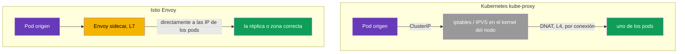
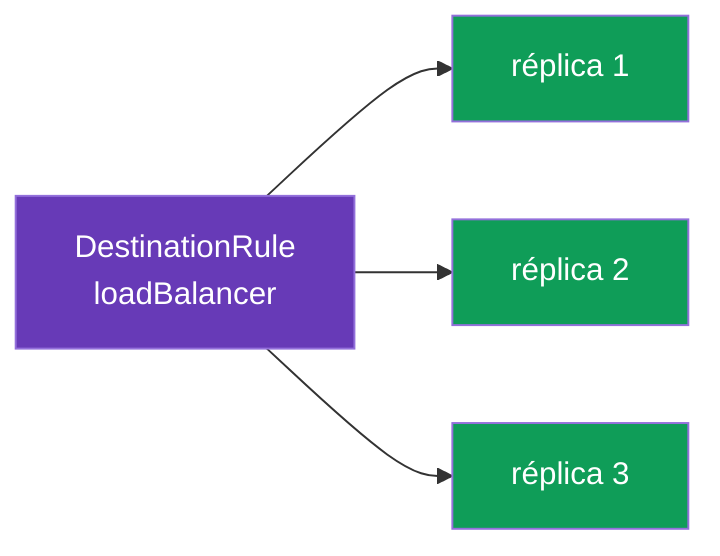
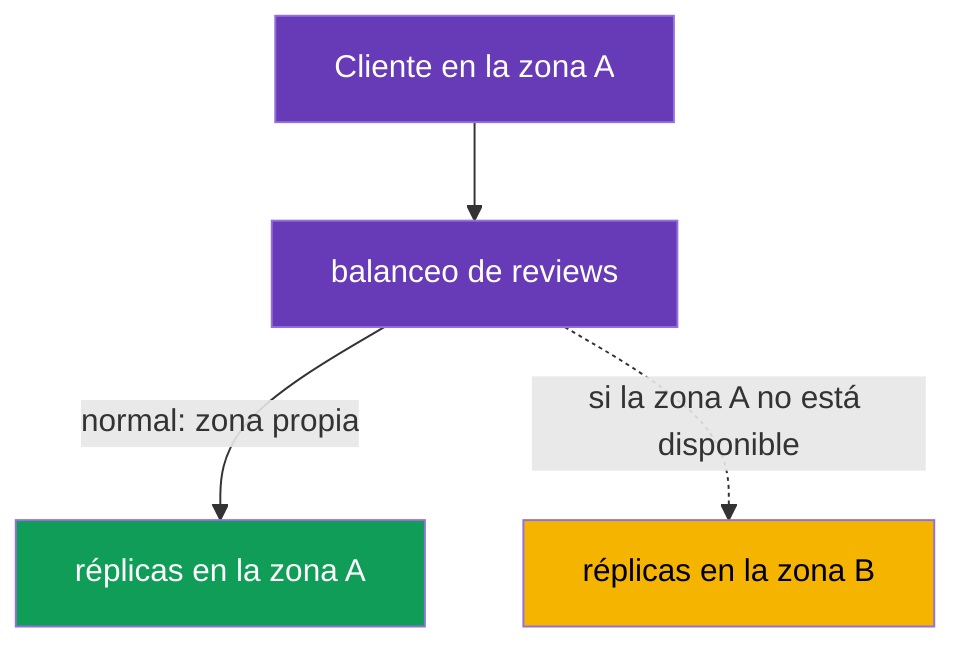

[RU version](ru.md) · [Eng version](en.md) · [Version française](fr.md) · [Deutsche Version](de.md)

# Capítulo 7. Balanceo de carga y failover consciente de la localidad

> **Qué sigue.** En los capítulos 5 y 6 decidimos a qué versión de un servicio enviar el
> tráfico. Ahora bajamos un nivel: una vez elegida la versión, las peticiones todavía tienen
> que distribuirse entre sus réplicas (pods). Eso es el balanceo de carga. También cubriremos
> cómo hacer que el tráfico vaya a la zona más cercana y cambie automáticamente a otra en caso
> de fallo: balanceo de carga y failover conscientes de la localidad.

## 7.1. Dónde vive el balanceo de carga en Istio

Una diferencia importante respecto a Kubernetes normal es **dónde** y **cómo** se toma la
decisión de balanceo.

**Kubernetes normal: kube-proxy en los nodos.** `kube-proxy` corre como un DaemonSet: una
instancia en **cada nodo**. Importante: no hace pasar el tráfico por sí mismo. Su trabajo es
observar los objetos Service/EndpointSlice a través del API server y **programar reglas en el
kernel del nodo** (iptables o IPVS). Cuando un pod llama a un ClusterIP de un Service, el
paquete es interceptado por estas reglas justo en la pila de red del **nodo origen** y se le
hace DNAT hacia la IP de uno de los pods de backend. Es decir, el balanceo no lo hace el
proceso kube-proxy sino el **kernel del nodo** usando reglas dispuestas de antemano. De ahí
las limitaciones:

- la decisión se toma **a nivel de conexión (L4)**, no de petición: para HTTP/2 y gRPC todo el
  tráfico "se pega" a una réplica (en detalle, en el capítulo 10);
- sin conciencia de HTTP: no puedes hacer "10% a v2", no puedes enrutar por cabecera, no hay
  reintentos/timeouts;
- el algoritmo apenas es configurable: es iptables (pseudoaleatorio) o IPVS (round-robin
  simple y un par de variantes), no una política flexible a nivel de aplicación;
- el balanceo está **en el lado del origen**: las reglas corren en el nodo donde vive el pod
  que llama.

**Istio: Envoy en el pod.** En la malla el sidecar intercepta el tráfico saliente (capítulo 4)
y lo balancea él mismo, en **L7**, hablando **directamente con las IP de los pods**, saltándose
el balanceo por ClusterIP de kube-proxy. Lo controlas mediante un `DestinationRule`, el mismo
recurso donde describimos los subsets en el capítulo 5. Así que el balanceo en Istio es una
política más hacia el receptor del tráfico, y se puede afinar en detalle: algoritmos,
localidad, afinidad de sesión, que es de lo que trata el resto del capítulo.



## 7.2. Algoritmos de balanceo de carga

El algoritmo se define en `trafficPolicy.loadBalancer.simple`:

```yaml
apiVersion: networking.istio.io/v1
kind: DestinationRule
metadata:
  name: reviews-dr
spec:
  host: reviews
  trafficPolicy:
    loadBalancer:
      simple: ROUND_ROBIN     # el algoritmo de balanceo de carga
```

Las opciones principales:

| Algoritmo | Cómo funciona | Cuándo usarlo |
|-----------|---------------|---------------|
| `ROUND_ROBIN` | uno tras otro en círculo | un simple valor por defecto |
| `LEAST_REQUEST` | a la réplica con menos peticiones activas | a menudo más eficiente que round-robin |
| `RANDOM` | elección aleatoria de réplica | cuando necesitas un reparto uniforme y sencillo |
| `PASSTHROUGH` | sin balanceo, a la dirección original | casos especiales, normalmente no hace falta |



En la práctica `LEAST_REQUEST` suele ser mejor que `ROUND_ROBIN`: mira la carga actual de las
réplicas y no envía una petición a una que ya está ocupada. `ROUND_ROBIN` simplemente alterna a
ciegas, sin mirar la carga.

### Consistent hash: sesiones pegajosas (afinidad de sesión)

Los valores de arriba se definen mediante `simple`. Pero también hay un modo aparte
`consistentHash`, para cuando las peticiones de un cliente deben caer siempre en la **misma
réplica** (para una caché en el pod, una sesión, estado local). Envoy elige una réplica por un
hash de una clave, y la misma clave va a la misma réplica (mientras el conjunto de réplicas no
cambie).

La clave se toma de una cabecera HTTP, una cookie, un parámetro de consulta o la IP de origen:

```yaml
spec:
  host: reviews
  trafficPolicy:
    loadBalancer:
      consistentHash:
        httpHeaderName: x-user            # hash por la cabecera x-user
        # httpCookie: { name: session, ttl: 3600s }  # o por una cookie
        # useSourceIp: true                           # o por la IP del cliente
        # httpQueryParameterName: user                # o por un parámetro de consulta
```

Importante entenderlo: `consistentHash` va sobre la **adherencia (stickiness)**, no sobre la
uniformidad. Si hay pocas claves o están "sesgadas" (un usuario muy activo), la carga será
dispareja. Y cuando cambia el número de réplicas, algunas claves inevitablemente se moverán a
otros pods (el precio de cualquier anillo de hash). Para un balanceo justo y uniforme sin
sesiones usa `LEAST_REQUEST`, y `consistentHash` solo cuando la adherencia sea realmente
necesaria.

## 7.3. Sobrescribir a nivel de puerto

A veces un servicio tiene varios puertos con requisitos distintos. `portLevelSettings` te
permite fijar tu propio algoritmo para un puerto concreto manteniendo uno común para el resto.

```yaml
spec:
  host: reviews
  trafficPolicy:
    loadBalancer:
      simple: ROUND_ROBIN         # el algoritmo común para todos los puertos
    portLevelSettings:
    - port:
        number: 8080
      loadBalancer:
        simple: LEAST_REQUEST     # pero uno distinto para el puerto 8080
```

Aquí todo el tráfico se balancea con `ROUND_ROBIN`, mientras que el puerto `8080` usa
`LEAST_REQUEST`. Esto es útil cuando, por ejemplo, un puerto tiene una API REST y otro tiene
gRPC o métricas, y tienen un perfil de carga distinto.

## 7.4. Balanceo de carga consciente de la localidad

Ahora una tarea más interesante. Imagina que un servicio corre en dos zonas de disponibilidad
(`eu-central-1a` y `eu-central-1b`). Por defecto Envoy reparte el tráfico entre todas las
réplicas por igual, sin tener en cuenta las zonas. Esto es malo: una petición de la zona A
puede ir a la zona B, añadiendo latencia y tráfico entre zonas (que la nube además te cobra).

El **balanceo de carga consciente de la localidad** resuelve esto: el tráfico se queda en su
propia localidad cuando es posible (región / zona / nodo). Istio determina la localidad de los
pods automáticamente a partir de las etiquetas estándar de Kubernetes
(`topology.kubernetes.io/region`, `topology.kubernetes.io/zone`) que los proveedores de nube
ponen en los nodos.



Por defecto, si hay pods con sidecar en varias zonas, la prioridad de la zona propia se activa
por sí sola. El ajuste fino se hace mediante `localityLbSetting`.

### ¿Y si la conciencia de zona ya está configurada en el Service de Kubernetes?

Kubernetes tiene su propio mecanismo para "mantener el tráfico en su propia zona", no
relacionado con Istio:

- **`spec.trafficDistribution: PreferClose`** en un Service (estable desde k8s 1.31);
- la anotación más antigua `service.kubernetes.io/topology-mode: Auto` (Topology Aware
  Routing).

Ambos funcionan a través de **kube-proxy** en L4: kube-proxy prefiere los endpoints de la misma
zona.

El punto clave: **en la malla el tráfico no va a través de kube-proxy sino a través de Envoy**.
El sidecar intercepta el tráfico saliente y lo balancea él mismo directamente a las IP de los
pods, saltándose kube-proxy. Así que los dos mecanismos viven en capas distintas:

| | De forma nativa en Kubernetes | En Istio |
|---|---|---|
| Quién balancea | kube-proxy (L4) | Envoy sidecar (L7) |
| Cómo se habilita | `trafficDistribution: PreferClose` (o `topology-mode: Auto`) en el Service | `localityLbSetting` en un DestinationRule |
| A qué tráfico afecta | pods **sin** sidecar / tráfico que se salta Envoy | tráfico **en la malla** (vía el sidecar) |
| Failover ante fallo de zona | automático, simple (sin reglas explícitas) | explícito vía `failover`, solo junto con `outlierDetection` |
| Flexibilidad | preferir la zona propia (on/off) | prioridad de zona + pesos (`distribute`) + reglas de `failover` + jerarquía región/zona/subzona |

La conclusión práctica:

- Para el tráfico **dentro de la malla** configuras la conciencia de zona en Istio
  (`localityLbSetting`). La anotación `trafficDistribution` en el Service **no afecta** a este
  tráfico: kube-proxy no está en el camino.
- La anotación en el Service sigue siendo relevante para el tráfico **fuera de la malla**: pods
  sin sidecar y llamadas que no pasan por Envoy.
- Configurar ambos mecanismos "por si acaso" no tiene sentido: están en capas distintas. Elige
  aquel por el que realmente pasa tu tráfico: un servicio totalmente en la malla, Istio basta;
  algunos clientes fuera de la malla, ahí funciona el mecanismo de Kubernetes.

> Istio también tiene una variante "simplificada" al estilo de Kubernetes: la anotación
> `networking.istio.io/traffic-distribution: PreferClose` en un Service: un análogo más
> sencillo de `localityLbSetting` para cuando no necesitas reglas finas de failover/peso (y la
> forma principal para el modo ambient, donde no hay sidecar, capítulo 22).

## 7.5. Failover entre zonas

La prioridad de la zona propia es buena en el caso normal. Pero ¿y si todas las réplicas de la
zona A han fallado? Entonces el tráfico debe ir automáticamente a la zona B. Esto es
**failover**.

Un punto clave que a menudo se pasa por alto: para que el failover funcione, Istio debe
**entender que las réplicas locales están enfermas**. De esto se ocupa `outlierDetection` (lo
cubrimos en detalle en el capítulo 8 sobre circuit breaking). Sin él Istio no expulsará los
endpoints enfermos, y el failover no se activará.

```yaml
apiVersion: networking.istio.io/v1
kind: DestinationRule
metadata:
  name: reviews-dr
spec:
  host: reviews
  trafficPolicy:
    loadBalancer:
      localityLbSetting:
        enabled: true
        failover:
        - from: eu-central-1a     # si se rompió en la zona A
          to: eu-central-1b       # mover a la zona B
    outlierDetection:             # OBLIGATORIO para el failover
      consecutive5xxErrors: 3     # 3 errores seguidos
      interval: 10s               # cada cuánto comprobar
      baseEjectionTime: 30s       # durante cuánto expulsar un endpoint enfermo
```

La lógica es esta: `outlierDetection` observa las respuestas de las réplicas. Si las réplicas
de la zona A empiezan a lanzar errores, Envoy las expulsa del balanceo. Cuando no quedan
réplicas sanas en la zona local, se activa `failover` y el tráfico va a la zona B. En cuanto la
zona A se recupera, el tráfico vuelve a ella.

## 7.6. Distribución ponderada entre zonas

A veces no quieres una prioridad estricta de la zona propia sino una distribución más suave:
por ejemplo, mantener el 80% del tráfico local pero enviar aun así el 20% a la zona vecina
(para calentamiento o uniformidad). Esto se hace mediante `distribute`:

```yaml
    loadBalancer:
      localityLbSetting:
        enabled: true
        distribute:
        - from: eu-central-1a/*
          to:
            "eu-central-1a/*": 80    # el 80% se queda en su propia zona
            "eu-central-1b/*": 20    # el 20% va a la vecina
```

`distribute` y `failover` resuelven tareas distintas: `distribute` fija la distribución
porcentual normal entre zonas, mientras que `failover` describe adónde ir en caso de fallo. Se
pueden usar juntos.

## 7.7. Buenas prácticas

- **`LEAST_REQUEST` como elección por defecto.** En la mayoría de los casos es mejor que
  `ROUND_ROBIN`: tiene en cuenta la carga actual de las réplicas. `ROUND_ROBIN` se justifica
  cuando las réplicas son idénticas y las peticiones uniformes.
- **Afinidad de sesión solo cuando haga falta.** `consistentHash` es útil para cachés y
  sesiones, pero empeora la uniformidad y complica el escalado (cuando se añade una réplica,
  algunas claves se mueven). No lo uses como el "balanceo por defecto".
- **Failover = localidad + `outlierDetection`.** La prioridad de la zona propia sin
  `outlierDetection` es inútil para la tolerancia a fallos: Istio no entenderá que las réplicas
  locales están enfermas y no cambiará el tráfico (ver 7.5).
- **Mantén réplicas en cada zona.** La conciencia de localidad solo tiene sentido si hay
  réplicas sanas en las zonas. Planifica al menos 2 réplicas por zona; de lo contrario, perder
  la única réplica envía el tráfico a la zona vecina de todos modos, y la localidad no ayuda.
- **El tráfico entre zonas es la excepción, no la norma.** El tráfico entre zonas es más lento
  y de pago. Mantenlo local (`localityLbSetting`) y aplica `distribute`/`failover` de forma
  deliberada.
- **Cuidado con el umbral de pánico.** Si `outlierDetection` expulsa demasiados endpoints (por
  defecto, cuando quedan sanas menos de ~50%), Envoy entra en "modo pánico" y vuelve a enviar
  tráfico a todas las réplicas, **ignorando la salud**, para no fallar por completo. Es una
  salvaguarda contra "apagarlo todo", pero con un `outlierDetection` agresivo puede enmascarar
  un problema. El umbral se ajusta mediante `outlierDetection.minHealthPercent`.
- **Arranque lento para réplicas nuevas.** Para que un pod recién arrancado no reciba de
  inmediato un pico de tráfico (caché fría, calentamiento del JIT), habilita una rampa gradual:

  ```yaml
      loadBalancer:
        simple: LEAST_REQUEST
        warmupDurationSecs: 60     # sube el tráfico gradualmente a una réplica nueva durante 60s
  ```

- **Una sola capa de conciencia de zona.** No mezcles el `trafficDistribution` de k8s con el
  `localityLbSetting` de Istio para el mismo tráfico de malla (ver 7.4): configúralo donde el
  tráfico realmente fluye.

## 7.8. Resumen del capítulo

- En Kubernetes normal no es kube-proxy mismo quien balancea, sino el **kernel del nodo**
  usando las reglas de iptables/IPVS que kube-proxy (un DaemonSet en cada nodo) dispuso: esto
  es L4, por conexión. En Istio el balanceo lo hace Envoy (L7), hablando directamente con las
  IP de los pods, y se configura en un `DestinationRule`.
- El algoritmo se define en `loadBalancer.simple`: `ROUND_ROBIN`, `LEAST_REQUEST`, `RANDOM`,
  `PASSTHROUGH`. `LEAST_REQUEST` suele ser más eficiente que round-robin.
- Para sesiones pegajosas hay un modo aparte `consistentHash` (por cabecera, cookie, parámetro
  de consulta o IP de origen): adherencia a una réplica, pero a costa de la uniformidad.
- Buenas prácticas: `LEAST_REQUEST` por defecto, `consistentHash` solo cuando haga falta,
  failover siempre con `outlierDetection`, réplicas en cada zona, entre zonas como excepción,
  `warmupDurationSecs` para calentar pods nuevos, recordar el umbral de pánico.
- `portLevelSettings` te permite fijar tu propio algoritmo para un puerto individual.
- El balanceo consciente de la localidad mantiene el tráfico en su propia zona; Istio toma la
  localidad de las etiquetas de topología en los nodos.
- La conciencia de zona nativa de k8s (`trafficDistribution: PreferClose` / `topology-mode:
  Auto`) funciona a través de kube-proxy (L4) y **no afecta** al tráfico de malla (en el camino
  está Envoy, no kube-proxy); para el tráfico de malla configura las zonas en Istio
  (`localityLbSetting`), para el tráfico fuera de la malla, con el mecanismo de Kubernetes.
- `failover` cambia el tráfico a otra zona en caso de fallo, pero solo funciona junto con
  `outlierDetection` (de lo contrario Istio no sabrá que las réplicas están enfermas).
- `distribute` fija una distribución porcentual suave entre zonas.

## 7.9. Preguntas de autoevaluación

1. ¿Dónde se configura el algoritmo de balanceo de carga en Istio, y en qué se diferencia de
   kube-proxy?
2. ¿En qué se diferencia `LEAST_REQUEST` de `ROUND_ROBIN`?
3. ¿Para qué sirve `portLevelSettings`?
4. ¿Qué es el balanceo consciente de la localidad, y cómo averigua Istio la zona de un pod?
5. ¿Por qué `outlierDetection` es obligatorio para el failover?
6. ¿En qué se diferencia `distribute` de `failover`?
7. Si un Service de Kubernetes ya tiene `trafficDistribution: PreferClose`, ¿afectará al
   tráfico dentro de la malla? ¿Por qué? ¿Dónde debería configurarse entonces la conciencia de
   zona para la malla?
8. ¿Cuándo deberías usar `consistentHash` en lugar de `LEAST_REQUEST`? ¿Cuáles son sus
   inconvenientes?
9. ¿Qué es el umbral de pánico y por qué hace falta? ¿Cómo ayuda `warmupDurationSecs` a las
   réplicas nuevas?

## Práctica

Practica los algoritmos de balanceo de carga y la sobrescritura por puerto:

🧪 Laboratorio 06: [tasks/ica/labs/06](../../labs/06/README_ES.MD)

Practica el failover consciente de la localidad entre zonas:

🧪 Laboratorio 14: [tasks/ica/labs/14](../../labs/14/README_ES.MD)

---
[Índice](../README_ES.md) · [Capítulo 6](../06/es.md) · [Capítulo 8](../08/es.md)
