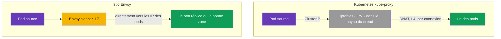
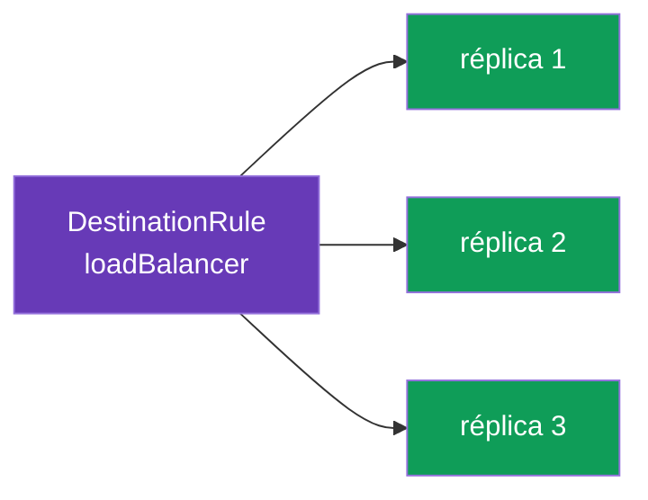
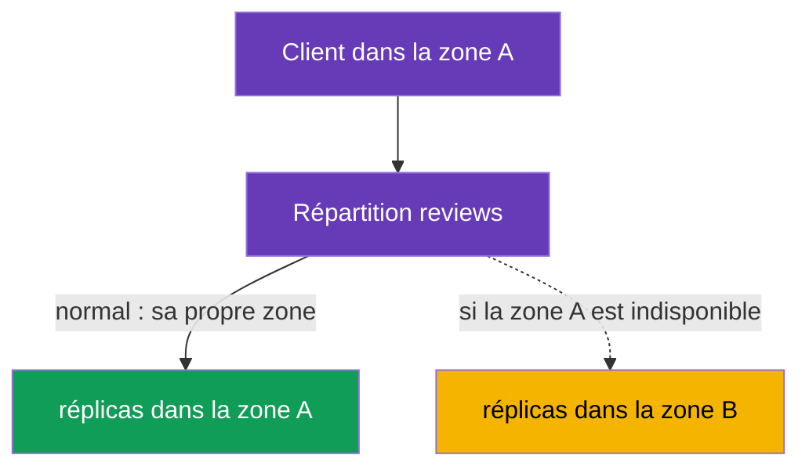

[RU version](ru.md) · [Eng version](en.md) · [Versión en español](es.md) · [Deutsche Version](de.md)

# Chapitre 7. Répartition de charge et locality-aware failover

> **Ce qui suit.** Aux chapitres 5 et 6, nous décidions vers quelle version de service
> envoyer le trafic. Descendons maintenant d'un niveau : une fois la version choisie, il
> faut répartir les requêtes entre ses réplicas (pods). C'est la répartition de charge.
> Nous verrons aussi comment faire circuler le trafic vers la zone la plus proche et
> basculer automatiquement vers une autre en cas de panne - locality-aware load balancing
> et failover.

## 7.1. Où vit la répartition de charge dans Istio

Différence importante avec le Kubernetes ordinaire - **où** et **comment** la décision de
répartition est prise.

**Kubernetes ordinaire : kube-proxy sur les nœuds.** `kube-proxy` fonctionne comme un
DaemonSet - une instance sur **chaque nœud**. Important : il ne fait pas transiter le
trafic par lui-même. Sa tâche est de surveiller les objets Service/EndpointSlice via
l'API-server et de **programmer des règles dans le noyau du nœud** (iptables ou IPVS).
Quand un pod s'adresse à la ClusterIP d'un service, le paquet est intercepté par ces règles
directement dans la pile réseau du **nœud émetteur** et, via DNAT, l'adresse de destination
est remplacée par l'IP de l'un des pods-backends. Autrement dit, ce n'est pas le processus
kube-proxy qui répartit, mais le **noyau du nœud** selon des règles préétablies. D'où des
limitations :

- la décision est prise **au niveau de la connexion (L4)**, et non de la requête : pour
  HTTP/2 et gRPC, tout le trafic « colle » à un seul réplica (en détail - au chapitre 10) ;
- pas de compréhension du HTTP : impossible de faire « 10 % vers v2 », impossible par
  en-tête, pas de retries/timeouts ;
- l'algorithme n'est presque pas configurable - c'est iptables (pseudo-aléatoire) ou IPVS
  (simple round-robin et quelques variantes), et non une politique applicative souple ;
- répartition **côté source** : les règles s'exécutent sur le nœud où vit le pod appelant.

**Istio : Envoy dans le pod.** Dans le mesh, le trafic sortant est intercepté par le
sidecar (chapitre 4) qui le répartit lui-même, au niveau **L7**, en s'adressant
**directement aux IP des pods** - en contournant la répartition ClusterIP de kube-proxy.
Vous gérez cela via la `DestinationRule` - la ressource même où, au chapitre 5, on décrivait
les subsets. Autrement dit, la répartition de charge dans Istio est une politique de plus
vers le destinataire du trafic, et elle peut se régler finement : algorithmes, localité,
session affinity - c'est le sujet de tout le reste du chapitre.



## 7.2. Algorithmes de répartition de charge

L'algorithme se définit dans `trafficPolicy.loadBalancer.simple` :

```yaml
apiVersion: networking.istio.io/v1
kind: DestinationRule
metadata:
  name: reviews-dr
spec:
  host: reviews
  trafficPolicy:
    loadBalancer:
      simple: ROUND_ROBIN     # algorithme de répartition de charge
```

Principales variantes :

| Algorithme | Fonctionnement | Quand l'utiliser |
|----------|--------------|--------------------|
| `ROUND_ROBIN` | tour à tour, en boucle | valeur par défaut simple |
| `LEAST_REQUEST` | vers le réplica ayant le moins de requêtes actives | souvent plus efficace que round-robin |
| `RANDOM` | choix aléatoire du réplica | quand on veut une répartition uniforme simple |
| `PASSTHROUGH` | sans répartition, vers l'adresse d'origine | cas particuliers, généralement inutile |



En pratique, `LEAST_REQUEST` est souvent meilleur que `ROUND_ROBIN` : il regarde la charge
actuelle des réplicas et n'envoie pas de requête vers un réplica déjà occupé.
`ROUND_ROBIN`, lui, alterne bêtement, sans regarder la charge.

### Consistent hash : sessions « collantes » (session affinity)

Les valeurs ci-dessus se définissent via `simple`. Mais il existe aussi un mode distinct
`consistentHash` - lorsque les requêtes d'un même client doivent toujours atterrir sur
**le même réplica** (pour le cache en mémoire du pod, la session, l'état local). Envoy
choisit le réplica par hachage d'une clé, et une même clé va vers le même réplica (tant que
l'ensemble des réplicas ne change pas).

La clé est tirée d'un en-tête HTTP, d'un cookie, d'un paramètre de query ou de l'IP source :

```yaml
spec:
  host: reviews
  trafficPolicy:
    loadBalancer:
      consistentHash:
        httpHeaderName: x-user            # hachage par l'en-tête x-user
        # httpCookie: { name: session, ttl: 3600s }  # ou par cookie
        # useSourceIp: true                           # ou par IP client
        # httpQueryParameterName: user                # ou par paramètre de query
```

Point important à comprendre : `consistentHash`, c'est le **collage**, pas l'uniformité. Si
les clés sont peu nombreuses ou « déséquilibrées » (un seul utilisateur actif), la charge
sera inégale. Et lors d'un changement du nombre de réplicas, une partie des clés migre
inévitablement vers d'autres pods (c'est le prix de tout anneau de hachage). Pour une
répartition uniforme et équitable sans sessions, prenez `LEAST_REQUEST`, et
`consistentHash` - seulement quand le collage est réellement nécessaire.

## 7.3. Surcharge au niveau du port

Parfois, un service a plusieurs ports avec des exigences différentes. `portLevelSettings`
permet de définir un algorithme propre à un port donné, en laissant le commun pour les
autres.

```yaml
spec:
  host: reviews
  trafficPolicy:
    loadBalancer:
      simple: ROUND_ROBIN         # algorithme commun pour tous les ports
    portLevelSettings:
    - port:
        number: 8080
      loadBalancer:
        simple: LEAST_REQUEST     # mais pour le port 8080 - un autre
```

Ici, tout le trafic est réparti par `ROUND_ROBIN`, tandis que pour le port `8080` c'est
`LEAST_REQUEST` qui s'applique. C'est pratique quand, par exemple, un port porte une API
REST et un autre du gRPC ou des métriques, avec des profils de charge différents.

## 7.4. Locality-aware load balancing

Voici maintenant une tâche plus intéressante. Imaginez qu'un service tourne dans deux zones
de disponibilité (`eu-central-1a` et `eu-central-1b`). Par défaut, Envoy répartit le trafic
uniformément entre tous les réplicas, sans regarder les zones. C'est mauvais : une requête
de la zone A peut partir vers la zone B, ajoutant de la latence et du trafic inter-zones
(que le cloud fait d'ailleurs payer).

Le **locality-aware load balancing** résout cela : le trafic reste autant que possible dans
sa propre zone (région / zone / nœud). Istio détermine automatiquement la localisation des
pods à partir des labels Kubernetes standard (`topology.kubernetes.io/region`,
`topology.kubernetes.io/zone`), que les fournisseurs cloud posent sur les nœuds.



Par défaut, s'il existe des pods avec sidecar dans plusieurs zones, la priorité à sa propre
zone s'active d'elle-même. Le réglage fin se fait via `localityLbSetting`.

### Et si la zonalité est déjà configurée dans le Kubernetes Service lui-même ?

Kubernetes a son propre mécanisme pour « garder le trafic dans sa zone », indépendant
d'Istio :

- **`spec.trafficDistribution: PreferClose`** sur le Service (stable depuis k8s 1.31) ;
- plus ancien - l'annotation `service.kubernetes.io/topology-mode: Auto` (Topology Aware
  Routing).

Les deux fonctionnent via **kube-proxy** au niveau L4 : kube-proxy préfère les endpoints de
la même zone.

Point clé : **dans le mesh, le trafic ne passe pas par kube-proxy, mais par Envoy**. Le
sidecar intercepte le trafic sortant et le répartit lui-même directement vers les IP des
pods, en contournant kube-proxy. C'est pourquoi les deux mécanismes vivent sur des couches
différentes :

| | Nativement dans Kubernetes | Dans Istio |
|---|---|---|
| Qui répartit | kube-proxy (L4) | Envoy sidecar (L7) |
| Comment l'activer | `trafficDistribution: PreferClose` (ou `topology-mode: Auto`) sur le Service | `localityLbSetting` dans la DestinationRule |
| Quel trafic est concerné | pods **sans** sidecar / trafic contournant Envoy | trafic **dans le mesh** (via le sidecar) |
| Failover en cas de panne de zone | automatique, simple (sans règles explicites) | explicite via `failover`, uniquement avec `outlierDetection` |
| Souplesse | préférer sa propre zone (on/off) | priorité des zones + poids (`distribute`) + règles `failover` + hiérarchie region/zone/subzone |

Conclusion pratique :

- Pour le trafic **à l'intérieur du mesh**, la zonalité se configure dans Istio
  (`localityLbSetting`). L'annotation `trafficDistribution` sur le Service **n'influe pas**
  sur ce trafic - kube-proxy n'est pas sur le chemin.
- L'annotation sur le Service reste pertinente pour le trafic **hors mesh** : pods sans
  sidecar et appels qui ne passent pas par Envoy.
- Mettre les deux mécanismes « au cas où » n'a pas de sens - ils sont sur des couches
  différentes. Choisissez celui par lequel passe réellement votre trafic : service
  entièrement dans le mesh - Istio suffit ; une partie des clients hors mesh - c'est là que
  le mécanisme k8s s'appliquera.

> Istio propose aussi une variante « simplifiée » dans l'esprit de Kubernetes -
> l'annotation `networking.istio.io/traffic-distribution: PreferClose` sur le Service : un
> équivalent plus simple de `localityLbSetting`, quand on n'a pas besoin de règles fines de
> failover/poids (et le moyen principal pour le mode ambient, où il n'y a pas de sidecar -
> chapitre 22).

## 7.5. Failover entre zones

La priorité à sa propre zone, c'est bien en régime normal. Mais que se passe-t-il si tous
les réplicas de la zone A sont en panne ? Alors le trafic doit basculer automatiquement
vers la zone B. C'est précisément le **failover**.

Point clé souvent négligé : pour que le failover se déclenche, Istio doit **comprendre que
les réplicas locaux ne sont pas sains**. C'est `outlierDetection` qui s'en charge (nous
l'étudierons en détail au chapitre 8 sur le circuit breaking). Sans lui, Istio n'exclura
pas les endpoints malades, et le failover ne démarrera pas.

```yaml
apiVersion: networking.istio.io/v1
kind: DestinationRule
metadata:
  name: reviews-dr
spec:
  host: reviews
  trafficPolicy:
    loadBalancer:
      localityLbSetting:
        enabled: true
        failover:
        - from: eu-central-1a     # si ça casse dans la zone A
          to: eu-central-1b       # on redirige vers la zone B
    outlierDetection:             # OBLIGATOIRE pour le failover
      consecutive5xxErrors: 3     # 3 erreurs d'affilée
      interval: 10s               # à quelle fréquence vérifier
      baseEjectionTime: 30s       # pour combien de temps exclure l'endpoint malade
```

La logique est la suivante : `outlierDetection` surveille les réponses des réplicas. Si les
réplicas de la zone A se mettent à cracher des erreurs, Envoy les exclut de la répartition.
Quand il ne reste plus de réplicas sains dans la zone locale, le `failover` se déclenche, et
le trafic part vers la zone B. Dès que la zone A se rétablit, le trafic y revient.

## 7.6. Répartition pondérée entre zones

Parfois, on ne veut pas une priorité stricte à sa propre zone, mais une répartition plus
souple : par exemple, garder 80 % du trafic en local, et envoyer tout de même 20 % vers la
zone voisine (pour la préchauffer ou pour l'uniformité). Cela se fait via `distribute` :

```yaml
    loadBalancer:
      localityLbSetting:
        enabled: true
        distribute:
        - from: eu-central-1a/*
          to:
            "eu-central-1a/*": 80    # 80% reste dans sa propre zone
            "eu-central-1b/*": 20    # 20% part vers la voisine
```

`distribute` et `failover` résolvent des problèmes différents : `distribute` définit la
répartition normale entre zones en pourcentages, tandis que `failover` décrit où aller en
cas de panne. On peut les utiliser ensemble.

## 7.7. Bonnes pratiques

- **`LEAST_REQUEST` comme choix par défaut.** Dans la plupart des cas, il est meilleur que
  `ROUND_ROBIN` : il tient compte de la charge actuelle des réplicas. `ROUND_ROBIN` se
  justifie quand les réplicas sont identiques et les requêtes homogènes.
- **Session affinity - seulement quand c'est nécessaire.** `consistentHash` est utile pour
  les caches et les sessions, mais dégrade l'uniformité et complique la mise à l'échelle
  (à l'ajout d'un réplica, une partie des clés migre). Ne l'utilisez pas comme
  « répartition par défaut ».
- **Failover = locality + `outlierDetection`.** La priorité à sa propre zone sans
  `outlierDetection` est inutile pour la tolérance aux pannes : Istio ne comprendra pas que
  les réplicas locaux sont malades, et ne basculera pas le trafic (voir 7.5).
- **Gardez des réplicas dans chaque zone.** Le locality-aware n'a de sens que s'il y a des
  réplicas sains dans les zones. Prévoyez au minimum 2 réplicas par zone - sinon, en cas de
  perte de l'unique réplica, le trafic partira quand même vers la zone voisine, et la
  localité n'aidera pas.
- **Le trafic cross-zone est l'exception, pas la norme.** Le trafic inter-zones est plus
  lent et payant. Gardez-le en local (`localityLbSetting`), et appliquez
  `distribute`/`failover` de manière réfléchie.
- **Attention au panic threshold.** Si `outlierDetection` exclut trop d'endpoints (par
  défaut, quand il reste moins d'environ 50 % de sains), Envoy active le « panic mode » et
  renvoie de nouveau du trafic vers tous les réplicas, **en ignorant leur santé**, pour ne
  pas tomber complètement. C'est une protection contre le « tout éteindre », mais avec un
  `outlierDetection` agressif elle peut masquer le problème. Le seuil se règle via
  `outlierDetection.minHealthPercent`.
- **Slow start pour les nouveaux réplicas.** Pour qu'un pod tout juste démarré ne reçoive
  pas d'emblée un pic de trafic (cache froid, préchauffage JIT), activez une montée en
  charge progressive :

  ```yaml
      loadBalancer:
        simple: LEAST_REQUEST
        warmupDurationSecs: 60     # monter le trafic en douceur sur le nouveau réplica pendant 60 s
  ```

- **Une seule couche de zonalité.** Ne mélangez pas le `trafficDistribution` de k8s et le
  `localityLbSetting` d'Istio pour le même trafic mesh (voir 7.4) - configurez là où le
  trafic passe réellement.

## 7.8. Résumé du chapitre

- Dans Kubernetes ordinaire, ce n'est pas kube-proxy lui-même qui répartit, mais le **noyau
  du nœud** selon les règles iptables/IPVS que kube-proxy (DaemonSet sur chaque nœud) a
  posées - c'est du L4, par connexions. Dans Istio, la répartition est assurée par Envoy
  (L7), en s'adressant directement aux IP des pods, et elle se configure dans la
  `DestinationRule`.
- L'algorithme se définit dans `loadBalancer.simple` : `ROUND_ROBIN`, `LEAST_REQUEST`,
  `RANDOM`, `PASSTHROUGH`. `LEAST_REQUEST` est souvent plus efficace que le round-robin.
- Pour les sessions « collantes », il y a le mode distinct `consistentHash` (par en-tête,
  cookie, paramètre de query ou IP source) - collage à un réplica, mais au détriment de
  l'uniformité.
- Bonnes pratiques : `LEAST_REQUEST` par défaut, `consistentHash` seulement si nécessaire,
  failover toujours avec `outlierDetection`, des réplicas dans chaque zone, le cross-zone
  comme exception, `warmupDurationSecs` pour préchauffer les nouveaux pods, se souvenir du
  panic threshold.
- `portLevelSettings` permet de définir un algorithme propre à un port distinct.
- La répartition locality-aware garde le trafic dans sa propre zone ; Istio tire la
  localisation des labels de topologie sur les nœuds.
- La zonalité native de k8s (`trafficDistribution: PreferClose` / `topology-mode: Auto`)
  fonctionne via kube-proxy (L4) et **n'influe pas** sur le trafic mesh (sur le chemin il y
  a Envoy, pas kube-proxy) ; pour le trafic dans le mesh, les zones se configurent dans
  Istio (`localityLbSetting`), pour le hors-mesh - par le mécanisme Kubernetes.
- `failover` bascule le trafic vers une autre zone en cas de panne, mais ne fonctionne
  qu'avec `outlierDetection` (sinon Istio ne comprend pas que les réplicas sont malades).
- `distribute` définit une répartition souple entre zones en pourcentages.

## 7.9. Questions d'auto-évaluation

1. Où se configure l'algorithme de répartition de charge dans Istio et en quoi est-ce
   différent de kube-proxy ?
2. En quoi `LEAST_REQUEST` diffère-t-il de `ROUND_ROBIN` ?
3. À quoi sert `portLevelSettings` ?
4. Qu'est-ce que la répartition locality-aware et d'où Istio apprend-il la zone d'un pod ?
5. Pourquoi `outlierDetection` est-il obligatoire pour le failover ?
6. En quoi `distribute` diffère-t-il de `failover` ?
7. Si un Kubernetes Service porte déjà `trafficDistribution: PreferClose`, cela
   influencera-t-il le trafic à l'intérieur du mesh ? Pourquoi ? Où configurer alors la
   zonalité pour le mesh ?
8. Quand faut-il utiliser `consistentHash` plutôt que `LEAST_REQUEST` ? Quels sont ses
   inconvénients ?
9. Qu'est-ce que le panic threshold et à quoi sert-il ? Comment `warmupDurationSecs`
   aide-t-il les nouveaux réplicas ?

## Pratique

Entraînez-vous aux algorithmes de répartition de charge et à la surcharge au niveau du port :

🧪 Lab 06 : [tasks/ica/labs/06](../../labs/06/README_FR.MD)

Entraînez-vous au locality-aware failover entre zones :

🧪 Lab 14 : [tasks/ica/labs/14](../../labs/14/README_FR.MD)

---
[Table des matières](../README_FR.md) · [Chapitre 6](../06/fr.md) · [Chapitre 8](../08/fr.md)
