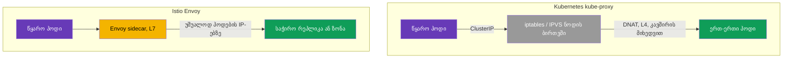
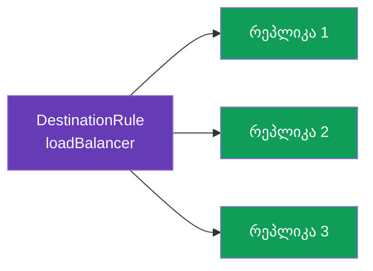
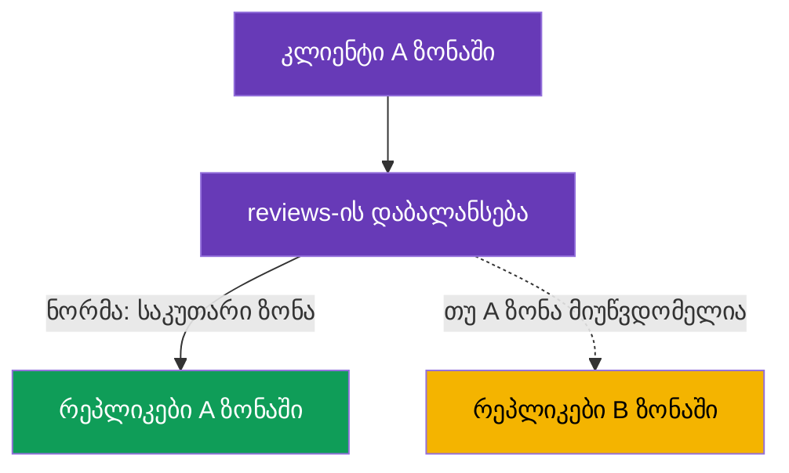

[Русская версия](ru.md) · [Eng version](en.md) · [Versión en español](es.md) · [Version française](fr.md) · [Deutsche Version](de.md) · [繁體中文版](tw.md) · [日本語版](jp.md)

# თავი 7. დატვირთვის დაბალანსება და locality-aware failover

> **რა არის შემდეგ.** მე-5 და მე-6 თავებში ვწყვეტდით, სერვისის რომელ ვერსიაზე გაგვეგზავნა ტრაფიკი.
> ახლა ერთი დონით ქვემოთ ჩავიდეთ: როცა ვერსია არჩეულია, მოთხოვნები მის რეპლიკებს (პოდებს)
> შორის როგორღაც უნდა განაწილდეს. ეს არის დატვირთვის დაბალანსება. ასევე განვიხილავთ, როგორ
> ვაიძულოთ ტრაფიკს უახლოეს ზონაში გადაადგილება და გაუმართაობისას ავტომატურად სხვა ზონაზე
> გადართვა - locality-aware load balancing და failover.

## 7.1. სად ხდება Istio-ში დატვირთვის დაბალანსება

ჩვეულებრივი Kubernetes-ისგან მნიშვნელოვანი განსხვავებაა, **სად** და **როგორ** მიიღება
დაბალანსების გადაწყვეტილება.

**ჩვეულებრივი Kubernetes: kube-proxy ნოდებზე.** `kube-proxy` მუშაობს როგორც DaemonSet -
თითო ეგზემპლარი **თითოეულ ნოდზე**. მნიშვნელოვანია: თვითონ ის ტრაფიკს საკუთარ თავში არ
ატარებს. მისი ამოცანაა API-სერვერის მეშვეობით Service/EndpointSlice ობიექტებს თვალყური
ადევნოს და **ნოდის ბირთვში წესები დააპროგრამოს** (iptables ან IPVS). როცა პოდი სერვისის
ClusterIP-ს მიმართავს, ამ წესებს პაკეტი უშუალოდ **გამგზავნი ნოდის** ქსელურ სტეკში
იჭერენ და DNAT-ის მეშვეობით დანიშნულების მისამართს ერთ-ერთი backend-პოდის IP-ით ცვლიან.
ანუ დაბალანსებას kube-proxy პროცესი კი არა, წინასწარ განაწილებული წესების მიხედვით
**ნოდის ბირთვი** ასრულებს. აქედან გამომდინარეობს შეზღუდვები:

- გადაწყვეტილება მიიღება **კავშირის დონეზე (L4)** და არა მოთხოვნის დონეზე: HTTP/2-ისა და gRPC-ის შემთხვევაში მთელი
  ტრაფიკი ერთ რეპლიკას „ეკვრის“ (დეტალურად - მე-10 თავში);
- HTTP-ის გააზრება არ არსებობს: შეუძლებელია „10% v2-ზე“, header-ის მიხედვით განაწილება,
  retry-ები/timeout-ები;
- ალგორითმი თითქმის არ კონფიგურირდება - ეს არის iptables (ფსევდოშემთხვევითად) ან IPVS
  (მარტივი round-robin და რამდენიმე ვარიანტი), და არა აპლიკაციის მოქნილი პოლიტიკა;
- დაბალანსება ხდება **წყაროს მხარეს**: წესები სრულდება იმ ნოდზე, სადაც გამომძახებელი
  პოდი მდებარეობს.

**Istio: Envoy პოდში.** mesh-ში გამავალ ტრაფიკს sidecar იჭერს (თავი 4) და თავად
აბალანსებს **L7** დონეზე, უშუალოდ **პოდების IP-ებს** მიმართავს და kube-proxy-ის
ClusterIP დაბალანსებას გვერდს უვლის. ამას `DestinationRule`-ის მეშვეობით მართავთ - იმავე
რესურსით, რომელშიც მე-5 თავში subsets აღვწერეთ. ანუ Istio-ში დაბალანსება ტრაფიკის
მიმღების მიმართ კიდევ ერთი პოლიტიკაა და მისი დეტალურად მორგება შეიძლება: ალგორითმები,
ლოკაცია, session affinity - თავის დარჩენილი ნაწილი სწორედ ამას ეძღვნება.



## 7.2. დაბალანსების ალგორითმები

ალგორითმი განისაზღვრება `trafficPolicy.loadBalancer.simple`-ში:

```yaml
apiVersion: networking.istio.io/v1
kind: DestinationRule
metadata:
  name: reviews-dr
spec:
  host: reviews
  trafficPolicy:
    loadBalancer:
      simple: ROUND_ROBIN     # ბალანსირების ალგორითმი
```

ძირითადი ვარიანტები:

| ალგორითმი | როგორ მუშაობს | როდის გამოვიყენოთ |
|----------|--------------|--------------------|
| `ROUND_ROBIN` | მორიგეობით, წრიულად | მარტივი ნაგულისხმევი არჩევანი |
| `LEAST_REQUEST` | ყველაზე ნაკლები აქტიური მოთხოვნის მქონე რეპლიკაზე | ხშირად round-robin-ზე ეფექტურია |
| `RANDOM` | რეპლიკის შემთხვევითი არჩევა | როცა მარტივი, თანაბარი განაწილებაა საჭირო |
| `PASSTHROUGH` | დაბალანსების გარეშე, საწყის მისამართზე | განსაკუთრებული შემთხვევები, ჩვეულებრივ არ არის საჭირო |



პრაქტიკაში `LEAST_REQUEST` ხშირად `ROUND_ROBIN`-ზე უკეთესია: ის რეპლიკების მიმდინარე
დატვირთვას აკვირდება და მოთხოვნას უკვე დაკავებულ რეპლიკაზე არ აგზავნის. `ROUND_ROBIN`
კი დატვირთვის გაუთვალისწინებლად უბრალოდ მორიგეობით ანაწილებს.

### Consistent hash: „წებოვანი“ სესიები (session affinity)

ზემოთ მოცემული მნიშვნელობები `simple`-ის მეშვეობით განისაზღვრება. თუმცა არსებობს ცალკე
რეჟიმი `consistentHash` - როცა ერთი კლიენტის მოთხოვნები ყოველთვის **ერთსა და იმავე
რეპლიკაზე** უნდა მოხვდეს (პოდის მეხსიერებაში არსებული cache-ის, სესიის ან ლოკალური
მდგომარეობის გამო). Envoy რეპლიკას გასაღების hash-ის მიხედვით ირჩევს და ერთი და იგივე
გასაღები იმავე რეპლიკაზე მიდის (სანამ რეპლიკების ნაკრები არ იცვლება).

გასაღები აიღება HTTP header-იდან, cookie-დან, query-პარამეტრიდან ან source IP-დან:

```yaml
spec:
  host: reviews
  trafficPolicy:
    loadBalancer:
      consistentHash:
        httpHeaderName: x-user            # ჰეში x-user სათაურის მიხედვით
        # httpCookie: { name: session, ttl: 3600s }  # ან cookie-ს მიხედვით
        # useSourceIp: true                           # ან კლიენტის IP-ის მიხედვით
        # httpQueryParameterName: user                # ან query-პარამეტრის მიხედვით
```

მნიშვნელოვანია გვესმოდეს: `consistentHash` **მიკვრას** ეხება და არა თანაბარ განაწილებას.
თუ გასაღებები ცოტაა ან ისინი „გადახრილია“ (ერთი აქტიური მომხმარებელი), დატვირთვა
არათანაბრად გადანაწილდება. რეპლიკების რაოდენობის ცვლილებისას კი გასაღებების ნაწილი
აუცილებლად სხვა პოდებზე გადავა (ეს ნებისმიერი hash-ring-ის ფასია). სესიების გარეშე
ნამდვილად თანაბარი დაბალანსებისთვის აირჩიეთ `LEAST_REQUEST`, ხოლო `consistentHash` -
მხოლოდ მაშინ, როცა მიკვრა ნამდვილად საჭიროა.

## 7.3. პორტის დონეზე გადაფარვა

ზოგჯერ სერვისს სხვადასხვა მოთხოვნის მქონე რამდენიმე პორტი აქვს. `portLevelSettings`
საშუალებას გაძლევთ, კონკრეტული პორტისთვის საკუთარი ალგორითმი განსაზღვროთ, დანარჩენებისთვის
კი საერთო დატოვოთ.

```yaml
spec:
  host: reviews
  trafficPolicy:
    loadBalancer:
      simple: ROUND_ROBIN         # საერთო ალგორითმი ყველა პორტისთვის
    portLevelSettings:
    - port:
        number: 8080
      loadBalancer:
        simple: LEAST_REQUEST     # მაგრამ 8080 პორტისთვის - სხვა
```

აქ მთელი ტრაფიკი `ROUND_ROBIN`-ით ბალანსდება, ხოლო `8080` პორტისთვის
`LEAST_REQUEST` მოქმედებს. ეს მოსახერხებელია, როცა, მაგალითად, ერთ პორტზე REST API-ა,
მეორეზე კი gRPC ან metrics, და მათ დატვირთვის განსხვავებული ხასიათი აქვთ.

## 7.4. Locality-aware load balancing

ახლა უფრო საინტერესო ამოცანა განვიხილოთ. წარმოიდგინეთ, რომ სერვისი ხელმისაწვდომობის ორ
ზონაში (`eu-central-1a` და `eu-central-1b`) მუშაობს. ნაგულისხმევად Envoy ტრაფიკს ყველა
რეპლიკაზე თანაბრად ანაწილებს და ზონებს არ ითვალისწინებს. ეს ცუდია: A ზონიდან მოთხოვნა
შეიძლება B ზონაში წავიდეს, რაც დაყოვნებას და ზონათაშორის ტრაფიკს ზრდის (რომელიც cloud-ში
ფასიანიცაა).

**Locality-aware load balancing** ამ პრობლემას აგვარებს: შესაძლებლობის ფარგლებში ტრაფიკი
საკუთარ ზონაში რჩება (region / zone / node). Istio პოდების ლოკაციას ავტომატურად
განსაზღვრავს Kubernetes-ის სტანდარტული labels-ით (`topology.kubernetes.io/region`,
`topology.kubernetes.io/zone`), რომლებსაც cloud provider-ები ნოდებს ანიჭებენ.



ნაგულისხმევად, თუ sidecar-იანი პოდები რამდენიმე ზონაშია, საკუთარი ზონის პრიორიტეტი
ავტომატურად ირთვება. დეტალური კონფიგურაცია `localityLbSetting`-ის მეშვეობით ხდება.

### რა მოხდება, თუ ზონალურობა უკვე თავად Kubernetes Service-შია კონფიგურირებული?

Kubernetes-ს აქვს საკუთარი, Istio-სგან დამოუკიდებელი მექანიზმი „ტრაფიკის საკუთარ ზონაში
შესანარჩუნებლად“:

- **`spec.trafficDistribution: PreferClose`** Service-ზე (სტაბილურია k8s 1.31-იდან);
- უფრო ძველი - annotation `service.kubernetes.io/topology-mode: Auto` (Topology Aware Routing).

ორივე **kube-proxy**-ის მეშვეობით L4 დონეზე მუშაობს: kube-proxy იმავე ზონაში არსებულ
endpoint-ებს ანიჭებს უპირატესობას.

მთავარი მომენტი: **mesh-ში ტრაფიკი kube-proxy-ის გავლით კი არა, Envoy-ის გავლით მიდის**.
Sidecar გამავალ ტრაფიკს იჭერს და kube-proxy-ის გვერდის ავლით, უშუალოდ პოდების IP-ების
მიხედვით თავად აბალანსებს. ამიტომ ეს ორი მექანიზმი სხვადასხვა შრეზე მუშაობს:

| | Kubernetes-ში ნატიურად | Istio-ში |
|---|---|---|
| ვინ აბალანსებს | kube-proxy (L4) | Envoy sidecar (L7) |
| როგორ ჩავრთოთ | `trafficDistribution: PreferClose` (ან `topology-mode: Auto`) Service-ზე | `localityLbSetting` DestinationRule-ში |
| რომელ ტრაფიკზე მოქმედებს | sidecar-ის **გარეშე** პოდები / Envoy-ის გვერდის ავლით მიმავალი ტრაფიკი | ტრაფიკი **mesh-ში** (sidecar-ის გავლით) |
| Failover ზონის მწყობრიდან გამოსვლისას | ავტომატური, მარტივი (ცხადი წესების გარეშე) | ცხადად `failover`-ის მეშვეობით, მხოლოდ `outlierDetection`-თან ერთად |
| მოქნილობა | საკუთარი ზონის არჩევა (ჩართვა/გამორთვა) | ზონების პრიორიტეტი + weights (`distribute`) + `failover` წესები + region/zone/subzone იერარქია |

პრაქტიკული დასკვნა:

- **mesh-ის შიგნით** ტრაფიკისთვის ზონალურობა Istio-ში (`localityLbSetting`) კონფიგურირდება.
  Service-ზე `trafficDistribution` annotation ამ ტრაფიკზე **არ მოქმედებს** - გზაზე kube-proxy
  არ არის.
- Service-ის annotation კვლავ აქტუალურია **არა-mesh** ტრაფიკისთვის: sidecar-ის გარეშე
  პოდებისა და იმ მიმართვებისთვის, რომლებიც Envoy-ის გავლით არ გადის.
- ორივე მექანიზმის „ყოველი შემთხვევისთვის“ დაყენებას აზრი არ აქვს - ისინი სხვადასხვა
  შრეზეა. აირჩიეთ ის, რომლის გავლითაც თქვენი ტრაფიკი რეალურად მიდის: თუ სერვისი მთლიანად
  mesh-შია, Istio საკმარისია; mesh-ის გარეთ მყოფი კლიენტებისთვის k8s-ის მექანიზმი იმუშავებს.

> Istio-ში არსებობს Kubernetes-ის მსგავსი „გამარტივებული“ ვარიანტიც - annotation
> `networking.istio.io/traffic-distribution: PreferClose` Service-ზე: `localityLbSetting`-ის
> უფრო მარტივი ანალოგი, როცა failover/weights-ის დეტალური წესები საჭირო არ არის (და მთავარი
> გზა ambient-რეჟიმისთვის, სადაც sidecar არ არსებობს - თავი 22).

## 7.5. Failover ზონებს შორის

ნორმალურ რეჟიმში საკუთარი ზონის პრიორიტეტი კარგია. მაგრამ რა მოხდება, თუ A ზონაში ყველა
რეპლიკა მწყობრიდან გამოვიდა? მაშინ ტრაფიკი ავტომატურად B ზონაში უნდა გადავიდეს. სწორედ
ეს არის **failover**.

მთავარი მომენტი, რომელიც ხშირად გამორჩებათ: failover-ის ასამუშავებლად Istio-მ უნდა
**გაიგოს, რომ ლოკალური რეპლიკები არაჯანსაღია**. ამაზე `outlierDetection` აგებს პასუხს
(მას დეტალურად მე-8 თავში, circuit breaking-ის განხილვისას გავეცნობით). მის გარეშე
Istio არაჯანსაღ endpoint-ებს არ გამორიცხავს და failover არ ამუშავდება.

```yaml
apiVersion: networking.istio.io/v1
kind: DestinationRule
metadata:
  name: reviews-dr
spec:
  host: reviews
  trafficPolicy:
    loadBalancer:
      localityLbSetting:
        enabled: true
        failover:
        - from: eu-central-1a     # თუ A ზონაში გაფუჭდა
          to: eu-central-1b       # გადავყავართ B ზონაში
    outlierDetection:             # აუცილებელია failover-ისთვის
      consecutive5xxErrors: 3     # 3 შეცდომა ზედიზედ
      interval: 10s               # რამდენად ხშირად შემოწმდეს
      baseEjectionTime: 30s       # რამდენი ხნით ამოირიცხოს დაზიანებული endpoint
```

ლოგიკა ასეთია: `outlierDetection` რეპლიკების პასუხებს აკვირდება. თუ A ზონის რეპლიკები
შეცდომების დაბრუნებას იწყებენ, Envoy მათ დაბალანსებიდან გამორიცხავს. როცა ლოკალურ
ზონაში ჯანსაღი რეპლიკა აღარ რჩება, `failover` ამოქმედდება და ტრაფიკი B ზონაში გადავა.
როგორც კი A ზონა აღდგება, ტრაფიკი მას დაუბრუნდება.

## 7.6. ზონების მიხედვით წონიანი განაწილება

ზოგჯერ საკუთარი ზონის ხისტი პრიორიტეტის ნაცვლად უფრო რბილი განაწილებაა საჭირო:
მაგალითად, ტრაფიკის 80% ლოკალურად დავტოვოთ, 20% კი მაინც მეზობელ ზონაში გავგზავნოთ
(გასათბობად ან თანაბრობისთვის). ეს `distribute`-ის მეშვეობით კეთდება:

```yaml
    loadBalancer:
      localityLbSetting:
        enabled: true
        distribute:
        - from: eu-central-1a/*
          to:
            "eu-central-1a/*": 80    # 80% რჩება საკუთარ ზონაში
            "eu-central-1b/*": 20    # 20% მიდის მეზობელში
```

`distribute` და `failover` სხვადასხვა ამოცანას წყვეტს: `distribute` ზონების მიხედვით
ნორმალურ პროცენტულ განაწილებას განსაზღვრავს, `failover` კი აღწერს, გაუმართაობისას სად
უნდა გადავიდეს ტრაფიკი. მათი ერთად გამოყენებაც შეიძლება.

## 7.7. საუკეთესო პრაქტიკები

- **`LEAST_REQUEST` როგორც ნაგულისხმევი არჩევანი.** უმეტეს შემთხვევაში ის
  `ROUND_ROBIN`-ზე უკეთესია: რეპლიკების მიმდინარე დატვირთვას ითვალისწინებს.
  `ROUND_ROBIN` გამართლებულია, როცა რეპლიკები ერთნაირია და მოთხოვნები ერთგვაროვანია.
- **Session affinity - მხოლოდ საჭიროებისას.** `consistentHash` cache-ებისა და სესიებისთვის
  სასარგებლოა, მაგრამ თანაბარ განაწილებას აუარესებს და მასშტაბირებას ართულებს (რეპლიკის
  დამატებისას გასაღებების ნაწილი გადავა). ნუ გამოიყენებთ მას როგორც „ნაგულისხმევ
  დაბალანსებას“.
- **Failover = locality + `outlierDetection`.** `outlierDetection`-ის გარეშე საკუთარი
  ზონის პრიორიტეტი fault tolerance-ისთვის უსარგებლოა: Istio ვერ გაიგებს, რომ ლოკალური
  რეპლიკები არაჯანსაღია და ტრაფიკს ვერ გადართავს (იხ. 7.5).
- **თითოეულ ზონაში იქონიეთ რეპლიკები.** Locality-aware-ს აზრი მხოლოდ მაშინ აქვს, თუ
  ზონებში ჯანსაღი რეპლიკებია. თითო ზონაზე მინიმუმ 2 რეპლიკა დაგეგმეთ - წინააღმდეგ
  შემთხვევაში ერთადერთი რეპლიკის დაკარგვისას ტრაფიკი მაინც მეზობელ ზონაში გადავა და
  ლოკალურობა ვერ დაგეხმარებათ.
- **Cross-zone ტრაფიკი გამონაკლისია და არა ნორმა.** ზონათაშორისი ტრაფიკი უფრო ნელია და
  ფასიანია. შეინარჩუნეთ ის ლოკალურად (`localityLbSetting`), ხოლო `distribute`/`failover`
  გააზრებულად გამოიყენეთ.
- **სიფრთხილე გამოიჩინეთ panic threshold-თან.** თუ `outlierDetection` ზედმეტად ბევრ
  endpoint-ს გამორიცხავს (ნაგულისხმევად, როცა ჯანსაღი endpoint-ები ~50%-ზე ნაკლებია),
  Envoy „panic mode“-ს რთავს და ტრაფიკს კვლავ ყველა რეპლიკაზე აგზავნის, **ჯანმრთელობის
  იგნორირებით**, რათა სრული გათიშვა თავიდან აიცილოს. ეს „ყველაფრის გათიშვისგან“ დამცავი
  მექანიზმია, მაგრამ აგრესიული `outlierDetection`-ისას მან შეიძლება პრობლემა შენიღბოს.
  ზღვარი `outlierDetection.minHealthPercent`-ის მეშვეობით რეგულირდება.
- **Slow start ახალი რეპლიკებისთვის.** რათა ახლად გაშვებულმა პოდმა ტრაფიკის პიკი მაშინვე
  არ მიიღოს (ცივი cache, JIT-გახურება), ჩართეთ დატვირთვის თანდათან გაზრდა:

  ```yaml
      loadBalancer:
        simple: LEAST_REQUEST
        warmupDurationSecs: 60     # ტრაფიკის თანდათანობით ზრდა ახალ replica-ზე 60 წმ
  ```

- **ზონალურობის ერთი შრე.** ერთი და იმავე mesh-ტრაფიკისთვის k8s-ის
  `trafficDistribution` და Istio-ს `localityLbSetting` არ აურიოთ (იხ. 7.4) -
  კონფიგურაცია იქ გააკეთეთ, სადაც ტრაფიკი რეალურად გადის.

## 7.8. თავის შეჯამება

- ჩვეულებრივ Kubernetes-ში დაბალანსებას თავად kube-proxy კი არა, kube-proxy-ის მიერ
  (თითოეულ ნოდზე DaemonSet) განაწილებული iptables/IPVS წესების მიხედვით **ნოდის ბირთვი**
  ასრულებს - ეს L4-ია, კავშირების მიხედვით. Istio-ში დაბალანსებას Envoy (L7) ასრულებს,
  რომელიც უშუალოდ პოდების IP-ებს მიმართავს, ხოლო კონფიგურაცია `DestinationRule`-ში ხდება.
- ალგორითმი `loadBalancer.simple`-ში განისაზღვრება: `ROUND_ROBIN`, `LEAST_REQUEST`,
  `RANDOM`, `PASSTHROUGH`. `LEAST_REQUEST` ხშირად round-robin-ზე ეფექტურია.
- „წებოვანი“ სესიებისთვის არსებობს ცალკე რეჟიმი `consistentHash` (header-ის, cookie-ის,
  query-პარამეტრის ან source IP-ის მიხედვით) - რეპლიკაზე მიკვრა, თუმცა თანაბარი განაწილების
  ხარჯზე.
- საუკეთესო პრაქტიკები: ნაგულისხმევად `LEAST_REQUEST`, `consistentHash` მხოლოდ საჭიროებისას,
  failover ყოველთვის `outlierDetection`-თან ერთად, რეპლიკები თითოეულ ზონაში, cross-zone
  როგორც გამონაკლისი, `warmupDurationSecs` ახალი პოდების გასათბობად და panic threshold-ის
  გათვალისწინება.
- `portLevelSettings` ცალკეული პორტისთვის საკუთარი ალგორითმის განსაზღვრის საშუალებას იძლევა.
- Locality-aware დაბალანსება ტრაფიკს საკუთარ ზონაში ინარჩუნებს; Istio ლოკაციას ნოდების
  topology labels-იდან იღებს.
- k8s-ის ნატიური ზონალურობა (`trafficDistribution: PreferClose` / `topology-mode: Auto`)
  kube-proxy-ის (L4) მეშვეობით მუშაობს და mesh-ტრაფიკზე **არ მოქმედებს** (გზაზე Envoy-ია და
  არა kube-proxy); mesh-ში ტრაფიკის ზონები Istio-ში (`localityLbSetting`) კონფიგურირდება,
  არა-mesh ტრაფიკისთვის კი - Kubernetes-ის მექანიზმით.
- `failover` გაუმართაობისას ტრაფიკს სხვა ზონაში გადართავს, მაგრამ მხოლოდ
  `outlierDetection`-თან ერთად მუშაობს (წინააღმდეგ შემთხვევაში Istio ვერ გაიგებს, რომ
  რეპლიკები არაჯანსაღია).
- `distribute` ზონების მიხედვით რბილ პროცენტულ განაწილებას განსაზღვრავს.

## 7.9. თვითშემოწმების კითხვები

1. სად კონფიგურირდება Istio-ში დაბალანსების ალგორითმი და რით განსხვავდება ეს kube-proxy-ისგან?
2. რით განსხვავდება `LEAST_REQUEST` `ROUND_ROBIN`-ისგან?
3. რისთვის არის საჭირო `portLevelSettings`?
4. რა არის locality-aware დაბალანსება და საიდან იგებს Istio პოდის ზონას?
5. რატომ არის `outlierDetection` აუცილებელი failover-ისთვის?
6. რით განსხვავდება `distribute` `failover`-ისგან?
7. თუ Kubernetes Service-ზე უკვე დაყენებულია `trafficDistribution: PreferClose`, მოახდენს
   თუ არა ეს გავლენას mesh-ის შიგნით ტრაფიკზე? რატომ? მაშინ სად უნდა დაკონფიგურირდეს ზონალურობა mesh-ისთვის?
8. როდის უნდა გამოვიყენოთ `consistentHash` `LEAST_REQUEST`-ის ნაცვლად? რა ნაკლოვანებები აქვს მას?
9. რა არის panic threshold და რისთვისაა საჭირო? როგორ ეხმარება `warmupDurationSecs` ახალ
   რეპლიკებს?

## პრაქტიკა

ივარჯიშეთ დაბალანსების ალგორითმებსა და პორტის დონეზე გადაფარვაში:

🧪 ლაბორატორია 06: [tasks/ica/labs/06](../../labs/06/README_GE.MD)

ივარჯიშეთ ზონებს შორის locality-aware failover-ში:

🧪 ლაბორატორია 14: [tasks/ica/labs/14](../../labs/14/README_GE.MD)

---
[სარჩევი](../README_GE.md) · [თავი 6](../06/ge.md) · [თავი 8](../08/ge.md)