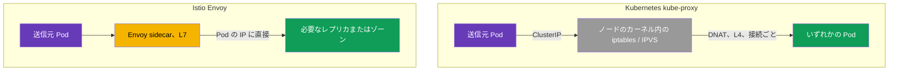
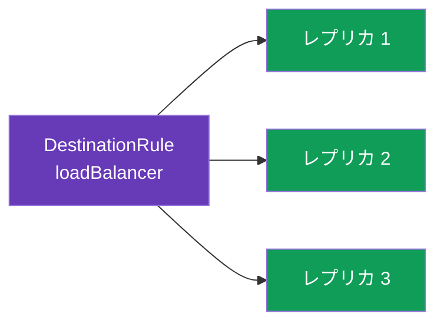
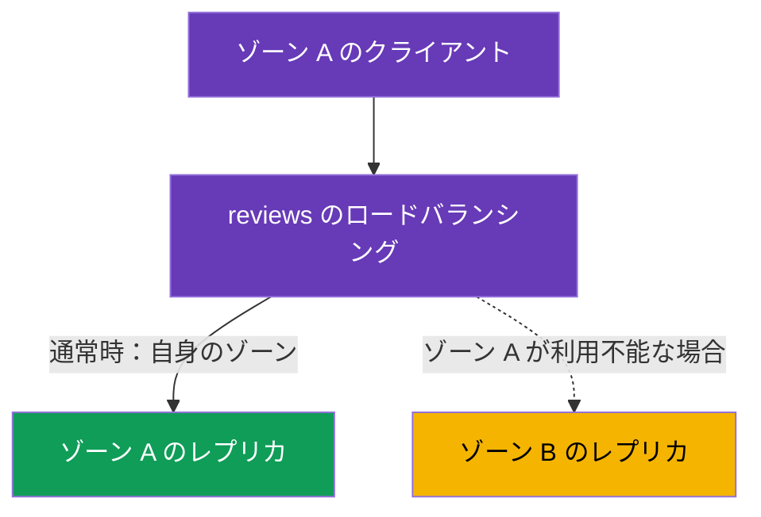

[Русская версия](ru.md) · [Eng version](en.md) · [Versión en español](es.md) · [Version française](fr.md) · [Deutsche Version](de.md) · [ქართული ვერსია](ge.md) · [繁體中文版](tw.md)

# 第7章：ロードバランシングと locality-aware フェイルオーバー

> **この次に扱うこと。** 第5章と第6章では、トラフィックをサービスのどのバージョンに送るかを扱いました。
> ここでは一段階下がり、バージョン選択後にそのレプリカ（Pod）間でリクエストをどのように
> 分配するかを見ます。これがロードバランシングです。さらに、トラフィックを最も近いゾーンに流し、
> 障害時に別のゾーンへ自動的に切り替える方法、すなわち locality-aware ロードバランシングと
> フェイルオーバーも扱います。

## 7.1. Istio におけるロードバランシングの位置

通常の Kubernetes との重要な違いは、ロードバランシングの判断を **どこで**、**どのように**
行うかです。

**通常の Kubernetes：ノード上の kube-proxy。** `kube-proxy` は DaemonSet として、**各ノード**
に1つずつ動作します。重要なのは、kube-proxy 自体はトラフィックを通過させないことです。その役割は、
API サーバー経由で Service/EndpointSlice オブジェクトを監視し、**ノードのカーネルにルールを
プログラムすること**です（iptables または IPVS）。Pod が Service の ClusterIP に接続すると、
これらのルールが**送信元ノード**のネットワークスタック内でパケットを捕捉し、DNAT により宛先アドレスを
バックエンド Pod のいずれかの IP に置き換えます。つまり、ロードバランシングを行うのは kube-proxy
プロセスではなく、事前に展開されたルールに従う**ノードのカーネル**です。そのため次の制約があります。

- 判断はリクエストではなく**接続レベル（L4）**で行われます。HTTP/2 と gRPC では全トラフィックが
  1つのレプリカに「固定」されます（詳細は第10章）。
- HTTP を理解しません。つまり「v2 に 10%」やヘッダーによる振り分け、リトライ/タイムアウトはできません。
- アルゴリズムはほぼ設定できません。iptables（疑似ランダム）または IPVS（単純な
  round-robin と数種類の選択肢）であり、柔軟なアプリケーションポリシーではありません。
- ロードバランシングは**送信元側**で行われます。ルールは呼び出し元 Pod が存在するノード上で実行されます。

**Istio：Pod 内の Envoy。** mesh では、送信トラフィックを sidecar（第4章）が捕捉し、自ら
**L7** レベルでロードバランシングします。kube-proxy による ClusterIP のロードバランシングを迂回し、
**Pod の IP に直接**接続します。これは第5章で subsets を説明したリソースと同じ `DestinationRule`
から制御します。つまり Istio のロードバランシングはトラフィックの宛先に対するもう1つのポリシーであり、
アルゴリズム、ローカリティ、session affinity まで細かく設定できます。以降の章ではこれらを扱います。



## 7.2. ロードバランシングアルゴリズム

アルゴリズムは `trafficPolicy.loadBalancer.simple` で指定します。

```yaml
apiVersion: networking.istio.io/v1
kind: DestinationRule
metadata:
  name: reviews-dr
spec:
  host: reviews
  trafficPolicy:
    loadBalancer:
      simple: ROUND_ROBIN     # ロードバランシングアルゴリズム
```

主な選択肢は次のとおりです。

| アルゴリズム | 動作 | 使用する場面 |
|----------|--------------|--------------------|
| `ROUND_ROBIN` | 順番に循環して振り分ける | シンプルなデフォルト |
| `LEAST_REQUEST` | アクティブなリクエスト数が最も少ないレプリカへ送る | round-robin より効率的なことが多い |
| `RANDOM` | レプリカをランダムに選択する | 単純に均等に分散したい場合 |
| `PASSTHROUGH` | ロードバランシングせず、元のアドレスへ送る | 特殊なケース。通常は不要 |



実際には `LEAST_REQUEST` のほうが `ROUND_ROBIN` より優れていることが多いです。これは
レプリカの現在の負荷を見て、すでにビジーなレプリカにリクエストを送らないためです。一方、
`ROUND_ROBIN` は負荷を見ずに機械的に交互に振り分けます。

### Consistent hash：スティッキーセッション（session affinity）

上記の値は `simple` で設定します。しかし別のモードとして `consistentHash` もあります。これは、
同じクライアントからのリクエストを常に**同じレプリカ**に送る必要がある場合に使います（Pod メモリ内の
キャッシュ、セッション、ローカル状態のため）。Envoy はキーのハッシュでレプリカを選択するため、同じキーは
レプリカ集合が変化しない限り同じレプリカに送られます。

キーは HTTP ヘッダー、cookie、query パラメーター、または source IP から取得します。

```yaml
spec:
  host: reviews
  trafficPolicy:
    loadBalancer:
      consistentHash:
        httpHeaderName: x-user            # x-user ヘッダーによるハッシュ
        # httpCookie: { name: session, ttl: 3600s }  # または cookie による
        # useSourceIp: true                           # またはクライアント IP による
        # httpQueryParameterName: user                # または query パラメーターによる
```

理解すべき重要な点は、`consistentHash` は**固定性**のためのものであり、均等性のためではないことです。
キーが少ない、または偏っている場合（アクティブなユーザーが1人だけの場合など）、負荷は不均等になります。
またレプリカ数を変更すると、一部のキーは必然的に別の Pod へ移動します（これはあらゆるハッシュリングの
代償です）。セッションなしで公平に均等なロードバランシングをしたいなら `LEAST_REQUEST` を使い、
`consistentHash` は本当に固定性が必要な場合だけ使用してください。

## 7.3. ポートレベルでのオーバーライド

サービスに異なる要件を持つ複数のポートがある場合があります。`portLevelSettings` を使うと、
ほかのポートには共通設定を残したまま、特定ポートに独自のアルゴリズムを指定できます。

```yaml
spec:
  host: reviews
  trafficPolicy:
    loadBalancer:
      simple: ROUND_ROBIN         # すべてのポート共通のアルゴリズム
    portLevelSettings:
    - port:
        number: 8080
      loadBalancer:
        simple: LEAST_REQUEST     # ただしポート 8080 には別のものを
```

ここでは全トラフィックは `ROUND_ROBIN` でロードバランシングされますが、ポート `8080` には
`LEAST_REQUEST` が適用されます。たとえば一方のポートが REST API、もう一方が gRPC またはメトリクスで、
負荷の特性が異なる場合に便利です。

## 7.4. Locality-aware ロードバランシング

次はより興味深い課題です。サービスが2つの可用性ゾーン（`eu-central-1a` と `eu-central-1b`）で
動作しているとします。デフォルトでは Envoy はゾーンを考慮せず、すべてのレプリカへ均等にトラフィックを
分配します。これは望ましくありません。ゾーン A からのリクエストがゾーン B に送られると、レイテンシーと
ゾーン間トラフィックが増え、クラウドではその料金も発生するためです。

**Locality-aware ロードバランシング**はこれを解決します。可能な限り、トラフィックを自身のゾーン
（リージョン / ゾーン / ノード）内に留めます。Istio は、クラウドプロバイダーがノードに付与する標準的な
Kubernetes ラベル（`topology.kubernetes.io/region`、`topology.kubernetes.io/zone`）から Pod の
ロケーションを自動判定します。



デフォルトでは、sidecar を持つ Pod が複数ゾーンにある場合、自ゾーンの優先は自動的に有効になります。
詳細な設定は `localityLbSetting` で行います。

### Kubernetes Service 自体でゾーン性がすでに設定されている場合は？

Kubernetes には Istio とは無関係に、「トラフィックを自ゾーン内に留める」独自の仕組みがあります。

- Service の **`spec.trafficDistribution: PreferClose`**（k8s 1.31 から安定版）。
- それ以前はアノテーション `service.kubernetes.io/topology-mode: Auto`（Topology Aware Routing）。

どちらも **kube-proxy** により L4 で動作します。kube-proxy が同じゾーンのエンドポイントを優先します。

重要な点は、**mesh ではトラフィックは kube-proxy ではなく Envoy を通る**ことです。sidecar が送信トラフィックを
捕捉し、kube-proxy を経由せずに Pod IP へ直接ロードバランシングします。したがって、この2つの仕組みは
異なるレイヤーで動作します。

| | Kubernetes ネイティブ | Istio |
|---|---|---|
| ロードバランシングするもの | kube-proxy（L4） | Envoy sidecar（L7） |
| 有効化方法 | Service に `trafficDistribution: PreferClose`（または `topology-mode: Auto`） | DestinationRule に `localityLbSetting` |
| 影響するトラフィック | sidecar **なし**の Pod / Envoy を迂回するトラフィック | **mesh 内**のトラフィック（sidecar 経由） |
| ゾーン障害時のフェイルオーバー | 自動的かつ単純（明示的なルールなし） | `failover` で明示的に設定。`outlierDetection` と組み合わせてのみ機能 |
| 柔軟性 | 自ゾーンを優先（オン/オフ） | ゾーン優先度 + 重み（`distribute`）+ `failover` ルール + region/zone/subzone 階層 |

実践上の結論は次のとおりです。

- **mesh 内**のトラフィックでは、ゾーン性を Istio（`localityLbSetting`）で設定します。Service の
  `trafficDistribution` アノテーションはこのトラフィックに**影響しません**。パスに kube-proxy がないためです。
- Service のアノテーションは**非 mesh**トラフィック、つまり sidecar のない Pod と Envoy を通らない接続に対しては
  引き続き有効です。
- 念のために両方の仕組みを設定しても意味はありません。異なるレイヤーで動くためです。実際にトラフィックが通る
  方を選んでください。サービス全体が mesh 内なら Istio で十分です。mesh 外のクライアントが一部いるなら、そこでは
  k8s の仕組みが働きます。

> Istio には Kubernetes 流の「簡易版」もあります。Service のアノテーション
> `networking.istio.io/traffic-distribution: PreferClose` です。これは、細かな failover/重みのルールが
> 不要な場合の `localityLbSetting` より単純な代替手段であり、sidecar がない ambient モードの主要な方法でもあります
> （第22章）。

## 7.5. ゾーン間フェイルオーバー

通常時には自ゾーンを優先するとよいでしょう。しかしゾーン A のすべてのレプリカが障害を起こした場合はどうでしょうか。
その場合、トラフィックは自動的にゾーン B へ移る必要があります。これが **failover** です。

しばしば見落とされる重要な点があります。failover を機能させるには、Istio が**ローカルレプリカが異常であることを
検出**しなければなりません。これを担うのが `outlierDetection` です（circuit breaking を扱う第8章で詳しく説明します）。
これがなければ Istio は異常なエンドポイントを除外しないため、failover は開始されません。

```yaml
apiVersion: networking.istio.io/v1
kind: DestinationRule
metadata:
  name: reviews-dr
spec:
  host: reviews
  trafficPolicy:
    loadBalancer:
      localityLbSetting:
        enabled: true
        failover:
        - from: eu-central-1a     # ゾーン A で障害が起きた場合
          to: eu-central-1b       # ゾーン B へ退避する
    outlierDetection:             # failover には必須
      consecutive5xxErrors: 3     # 連続3回のエラー
      interval: 10s               # 確認する頻度
      baseEjectionTime: 30s       # 異常なエンドポイントを除外する時間
```

動作は次のとおりです。`outlierDetection` はレプリカからの応答を監視します。ゾーン A のレプリカが
エラーを返し始めると、Envoy はそれらをロードバランシングから除外します。ローカルゾーンに正常なレプリカが
残らなくなると、`failover` が発動してトラフィックはゾーン B に移ります。ゾーン A が復旧すれば、トラフィックは
再びそちらに戻ります。

## 7.6. ゾーン別の重み付き分配

自ゾーンを厳密に優先するのではなく、より緩やかに分配したい場合があります。たとえばトラフィックの 80% は
ローカルに保ちつつ、20% はウォームアップまたは均等化のため隣接ゾーンへ送る場合です。これは `distribute` で行います。

```yaml
    loadBalancer:
      localityLbSetting:
        enabled: true
        distribute:
        - from: eu-central-1a/*
          to:
            "eu-central-1a/*": 80    # 80% は自ゾーンに残す
            "eu-central-1b/*": 20    # 20% は隣接ゾーンへ
```

`distribute` と `failover` は異なる課題を解決します。`distribute` は通常時のゾーン間分配を割合で設定し、
`failover` は障害時の退避先を定義します。両方を併用できます。

## 7.7. ベストプラクティス

- **デフォルトの選択は `LEAST_REQUEST`。** ほとんどの場合、現在のレプリカ負荷を考慮するため
  `ROUND_ROBIN` より優れています。レプリカが同一で、リクエストが均質な場合には `ROUND_ROBIN` も妥当です。
- **Session affinity は必要な場合だけ。** `consistentHash` はキャッシュやセッションに有用ですが、均等性を
  損ない、スケーリングを複雑にします（レプリカ追加時に一部のキーが移動します）。「デフォルトのロードバランシング」
  として使わないでください。
- **Failover = locality + `outlierDetection`。** `outlierDetection` なしの自ゾーン優先は、耐障害性には
  役立ちません。Istio はローカルレプリカが異常であると判断できず、トラフィックを切り替えないためです（7.5 節）。
- **各ゾーンにレプリカを置く。** Locality-aware が意味を持つのは、ゾーン内に正常なレプリカがある場合だけです。
  ゾーンあたり最低2レプリカを計画してください。唯一のレプリカを失えば、トラフィックは隣接ゾーンへ移り、
  ローカリティの利点は失われます。
- **ゾーン間トラフィックは例外であり、通常ではない。** ゾーン間トラフィックは低速で料金がかかります。
  これをローカルに保ち（`localityLbSetting`）、`distribute`/`failover` は意図して使用してください。
- **panic threshold に注意する。** `outlierDetection` が除外するエンドポイントが多すぎると（デフォルトでは、
  正常なものが約50%未満になると）、Envoy は「panic mode」に入り、完全な障害を防ぐため、**健全性を無視して**
  再びすべてのレプリカにトラフィックを送ります。これは「すべてを停止する」ことへの保護ですが、積極的な
  `outlierDetection` では問題を隠す可能性があります。しきい値は `outlierDetection.minHealthPercent` で調整します。
- **新しいレプリカには slow start を。** 起動直後の Pod がトラフィックのピークをすぐに受けないようにするには
  （コールドキャッシュ、JIT ウォームアップ）、段階的な増加を有効にします。

  ```yaml
      loadBalancer:
        simple: LEAST_REQUEST
        warmupDurationSecs: 60     # 新しいレプリカへ 60 秒かけて緩やかにトラフィックを増やす
  ```

- **ゾーン性は1レイヤーにする。** 同じ mesh トラフィックに対して k8s の `trafficDistribution` と Istio の
  `localityLbSetting` を混在させないでください（7.4 節）。実際にトラフィックが通る場所で設定します。

## 7.8. 章のまとめ

- 通常の Kubernetes でロードバランシングするのは kube-proxy 自体ではなく、kube-proxy（各ノード上の DaemonSet）が
  展開した iptables/IPVS ルールに基づく**ノードのカーネル**です。これは接続単位の L4 です。Istio では Envoy（L7）が
  Pod IP に直接接続してロードバランシングし、設定は `DestinationRule` で行います。
- アルゴリズムは `loadBalancer.simple` で指定します。`ROUND_ROBIN`、`LEAST_REQUEST`、`RANDOM`、
  `PASSTHROUGH` です。`LEAST_REQUEST` は round-robin より効率的なことが多いです。
- スティッキーセッションには、`consistentHash` という別モードがあります（ヘッダー、cookie、query パラメーター、
  source IP に基づく）。これはレプリカへの固定性を得ますが、均等性を犠牲にします。
- ベストプラクティス：デフォルトは `LEAST_REQUEST`、`consistentHash` は必要なときだけ、failover には常に
  `outlierDetection` を併用、各ゾーンにレプリカを置く、ゾーン間は例外とする、新しい Pod のウォームアップには
  `warmupDurationSecs` を使う、panic threshold を意識する。
- `portLevelSettings` では、特定ポートに独自のアルゴリズムを指定できます。
- Locality-aware ロードバランシングはトラフィックを自ゾーン内に保ちます。Istio はノード上のトポロジーラベルから
  ロケーションを取得します。
- Kubernetes ネイティブのゾーン性（`trafficDistribution: PreferClose` / `topology-mode: Auto`）は kube-proxy（L4）を
  通して動作し、mesh トラフィックには**影響しません**（パスにあるのは kube-proxy ではなく Envoy です）。mesh 内の
  トラフィックではゾーンを Istio（`localityLbSetting`）で設定し、非 mesh では Kubernetes の仕組みを使います。
- `failover` は障害時にトラフィックを別のゾーンへ切り替えますが、`outlierDetection` と組み合わせた場合にのみ機能します
  （そうでなければ Istio はレプリカの異常を検出できません）。
- `distribute` はゾーン間の緩やかな割合分配を設定します。

## 7.9. 自己確認の質問

1. Istio ではロードバランシングアルゴリズムをどこで設定しますか。また kube-proxy とどう違いますか？
2. `LEAST_REQUEST` と `ROUND_ROBIN` の違いは何ですか？
3. `portLevelSettings` はなぜ必要ですか？
4. locality-aware ロードバランシングとは何ですか？ また Istio は Pod のゾーンをどのように知りますか？
5. failover に `outlierDetection` が必須なのはなぜですか？
6. `distribute` と `failover` の違いは何ですか？
7. Kubernetes Service にすでに `trafficDistribution: PreferClose` が設定されている場合、これは mesh 内の
   トラフィックに影響しますか？ なぜですか？ その場合、mesh のゾーン性はどこで設定しますか？
8. `LEAST_REQUEST` ではなく `consistentHash` を使うべきなのはいつですか？ その欠点は何ですか？
9. panic threshold とは何ですか？ なぜ必要ですか？ `warmupDurationSecs` は新しいレプリカにどのように役立ちますか？

## 演習

ロードバランシングアルゴリズムとポートレベルのオーバーライドを練習します。

🧪 ラボ 06： [tasks/ica/labs/06](../../labs/06/README_JP.MD)

ゾーン間の locality-aware failover を練習します。

🧪 ラボ 14： [tasks/ica/labs/14](../../labs/14/README_JP.MD)

---
[目次](../README_JP.md) · [第6章](../06/jp.md) · [第8章](../08/jp.md)
