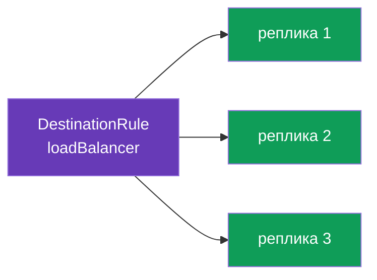
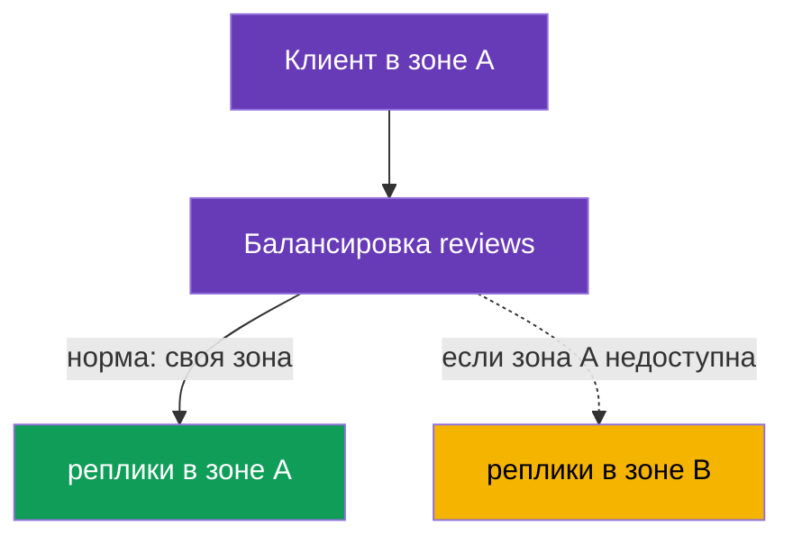

# Глава 7. Балансировка нагрузки и locality-aware failover

> **Что дальше.** В главах 5 и 6 мы решали, на какую версию сервиса отправить трафик.
> Теперь спустимся на уровень ниже: когда версия выбрана, между её репликами (подами)
> надо как-то распределить запросы. Это балансировка нагрузки. А ещё разберём, как
> заставить трафик ходить в ближайшую зону и автоматически переключаться на другую при
> отказе - locality-aware load balancing и failover.

## 7.1. Где в Istio живёт балансировка

Важное отличие от обычного Kubernetes. Там балансировкой занимается kube-proxy на
уровне L4: он раскидывает соединения по подам примерно поровну, и повлиять на алгоритм
почти нельзя.

В Istio балансировку делает Envoy на уровне L7, и вы управляете ею через
`DestinationRule` - тот самый ресурс, где мы описывали subsets в главе 5. То есть
балансировка это ещё одна политика к получателю трафика.

## 7.2. Алгоритмы балансировки

Алгоритм задаётся в `trafficPolicy.loadBalancer.simple`:

```yaml
apiVersion: networking.istio.io/v1
kind: DestinationRule
metadata:
  name: reviews-dr
spec:
  host: reviews
  trafficPolicy:
    loadBalancer:
      simple: ROUND_ROBIN     # алгоритм балансировки
```

Основные варианты:

| Алгоритм | Как работает | Когда использовать |
|----------|--------------|--------------------|
| `ROUND_ROBIN` | по очереди по кругу | простой дефолт |
| `LEAST_REQUEST` | на реплику с наименьшим числом активных запросов | часто эффективнее round-robin |
| `RANDOM` | случайный выбор реплики | когда нужен простой равномерный разброс |
| `PASSTHROUGH` | без балансировки, на исходный адрес | особые случаи, обычно не нужно |



На практике `LEAST_REQUEST` часто лучше `ROUND_ROBIN`: он смотрит на текущую загрузку
реплик и не шлёт запрос на уже занятую. `ROUND_ROBIN` же тупо чередует, не глядя на
нагрузку.

## 7.3. Переопределение на уровне порта

Иногда у сервиса несколько портов с разными требованиями. `portLevelSettings`
позволяет задать свой алгоритм для конкретного порта, оставив общий для остальных.

```yaml
spec:
  host: reviews
  trafficPolicy:
    loadBalancer:
      simple: ROUND_ROBIN         # общий алгоритм для всех портов
    portLevelSettings:
    - port:
        number: 8080
      loadBalancer:
        simple: LEAST_REQUEST     # но для порта 8080 - другой
```

Здесь весь трафик балансируется по `ROUND_ROBIN`, а для порта `8080` действует
`LEAST_REQUEST`. Это удобно, когда, например, на одном порту REST API, а на другом
gRPC или метрики, и у них разный характер нагрузки.

## 7.4. Locality-aware load balancing

Теперь более интересная задача. Представьте, что сервис работает в двух зонах
доступности (`eu-central-1a` и `eu-central-1b`). По умолчанию Envoy раскидывает трафик
по всем репликам одинаково, не глядя на зоны. Это плохо: запрос из зоны A может уйти в
зону B, добавив задержку и трафик между зонами (за который в облаке ещё и платят).

**Locality-aware load balancing** решает это: трафик по возможности остаётся в своей
зоне (регион / зона / нода). Istio определяет локацию подов автоматически по стандартным
меткам Kubernetes (`topology.kubernetes.io/region`, `topology.kubernetes.io/zone`),
которые облачные провайдеры проставляют на ноды.



По умолчанию, если поды с sidecar есть в нескольких зонах, приоритет своей зоны
включается сам. Тонкая настройка делается через `localityLbSetting`.

## 7.5. Failover между зонами

Приоритет своей зоны это хорошо в нормальном режиме. Но что, если все реплики в зоне A
отказали? Тогда трафик должен автоматически уйти в зону B. Это и есть **failover**.

Ключевой момент, который часто упускают: чтобы failover сработал, Istio должен **понять,
что локальные реплики нездоровы**. За это отвечает `outlierDetection` (мы подробно
разберём его в главе 8 про circuit breaking). Без него Istio не будет исключать больные
эндпоинты, и failover не запустится.

```yaml
apiVersion: networking.istio.io/v1
kind: DestinationRule
metadata:
  name: reviews-dr
spec:
  host: reviews
  trafficPolicy:
    loadBalancer:
      localityLbSetting:
        enabled: true
        failover:
        - from: eu-central-1a     # если сломалось в зоне A
          to: eu-central-1b       # уводим в зону B
    outlierDetection:             # ОБЯЗАТЕЛЬНО для failover
      consecutive5xxErrors: 3     # 3 ошибки подряд
      interval: 10s               # как часто проверять
      baseEjectionTime: 30s       # на сколько исключить больной эндпоинт
```

Логика такая: `outlierDetection` следит за ответами реплик. Если реплики в зоне A
начинают сыпать ошибками, Envoy исключает их из балансировки. Когда в локальной зоне
не остаётся здоровых реплик, срабатывает `failover`, и трафик уходит в зону B. Как
только зона A восстановится, трафик вернётся к ней.

## 7.6. Взвешенное распределение по зонам

Иногда нужен не жёсткий приоритет своей зоны, а более мягкое распределение: например,
80% трафика держать локально, а 20% всё же слать в соседнюю зону (для прогрева или
равномерности). Это делается через `distribute`:

```yaml
    loadBalancer:
      localityLbSetting:
        enabled: true
        distribute:
        - from: eu-central-1a/*
          to:
            "eu-central-1a/*": 80    # 80% остаётся в своей зоне
            "eu-central-1b/*": 20    # 20% уходит в соседнюю
```

`distribute` и `failover` решают разные задачи: `distribute` задаёт нормальное
распределение по зонам в процентах, а `failover` описывает, куда уходить при отказе.
Их можно использовать вместе.

## 7.7. Итоги главы

- Балансировкой между репликами в Istio управляет Envoy (L7), а настраивается она в
  `DestinationRule`, а не в kube-proxy.
- Алгоритм задаётся в `loadBalancer.simple`: `ROUND_ROBIN`, `LEAST_REQUEST`, `RANDOM`,
  `PASSTHROUGH`. `LEAST_REQUEST` часто эффективнее round-robin.
- `portLevelSettings` позволяет задать свой алгоритм для отдельного порта.
- Locality-aware балансировка держит трафик в своей зоне; локацию Istio берёт из меток
  топологии на нодах.
- `failover` переключает трафик в другую зону при отказе, но работает только вместе с
  `outlierDetection` (иначе Istio не поймёт, что реплики больны).
- `distribute` задаёт мягкое распределение по зонам в процентах.

## 7.8. Вопросы для самопроверки

1. Где в Istio настраивается алгоритм балансировки и чем это отличается от kube-proxy?
2. Чем `LEAST_REQUEST` отличается от `ROUND_ROBIN`?
3. Зачем нужен `portLevelSettings`?
4. Что такое locality-aware балансировка и откуда Istio узнаёт зону пода?
5. Почему для failover обязателен `outlierDetection`?
6. Чем `distribute` отличается от `failover`?

## Практика

Отработайте алгоритмы балансировки и переопределение на уровне порта:

🧪 Лаба 06: [tasks/ica/labs/06](../../labs/06/README_RU.MD)

Отработайте locality-aware failover между зонами:

🧪 Лаба 14: [tasks/ica/labs/14](../../labs/14/README_RU.MD)

---
[Оглавление](../README.md) · [Глава 6](../06/ru.md) · [Глава 8](../08/ru.md)
