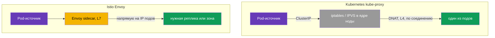
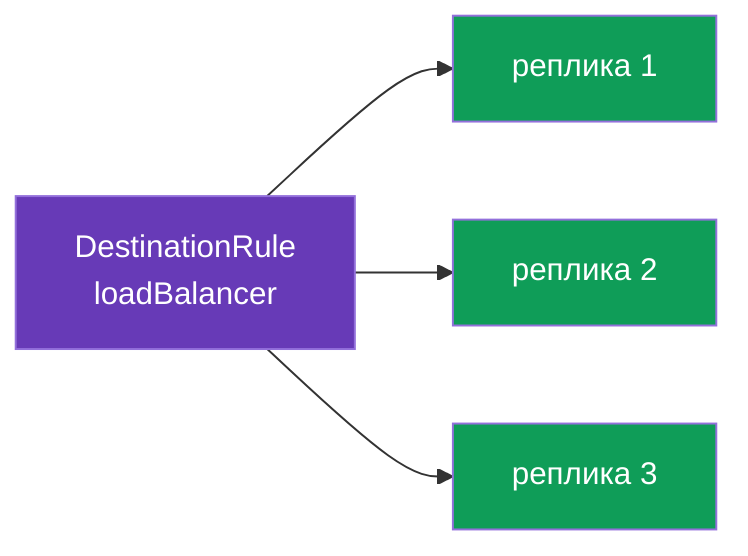
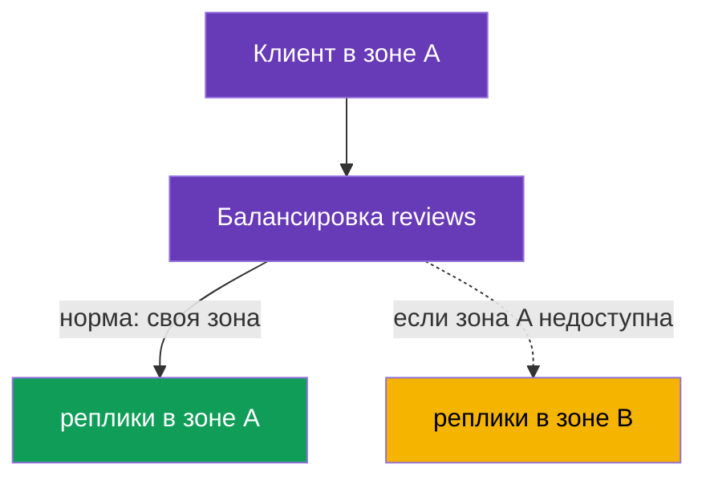

[Eng version](en.md) · [Versión en español](es.md)

# Глава 7. Балансировка нагрузки и locality-aware failover

> **Что дальше.** В главах 5 и 6 мы решали, на какую версию сервиса отправить трафик.
> Теперь спустимся на уровень ниже: когда версия выбрана, между её репликами (подами)
> надо как-то распределить запросы. Это балансировка нагрузки. А ещё разберём, как
> заставить трафик ходить в ближайшую зону и автоматически переключаться на другую при
> отказе - locality-aware load balancing и failover.

## 7.1. Где в Istio живёт балансировка

Важное отличие от обычного Kubernetes - **где** и **как** принимается решение о
балансировке.

**Обычный Kubernetes: kube-proxy на нодах.** `kube-proxy` работает как DaemonSet - по
одному экземпляру на **каждой ноде**. Важно: сам он трафик через себя не пропускает. Его
задача - следить за объектами Service/EndpointSlice через API-сервер и **программировать
правила в ядре ноды** (iptables или IPVS). Когда под обращается к ClusterIP сервиса,
пакет перехватывают эти правила прямо в сетевом стеке **ноды-отправителя** и через DNAT
подменяют адрес назначения на IP одного из подов-бэкендов. То есть балансирует не
процесс kube-proxy, а **ядро ноды** по заранее разложенным правилам. Отсюда ограничения:

- решение принимается **на уровне соединения (L4)**, а не запроса: для HTTP/2 и gRPC весь
  трафик «прилипает» к одной реплике (подробно - в главе 10);
- нет понимания HTTP: нельзя «10% на v2», нельзя по заголовку, нет ретраев/таймаутов;
- алгоритм почти не настраивается - это iptables (псевдослучайно) или IPVS (простой
  round-robin и пара вариантов), а не гибкая политика приложения;
- балансировка **на стороне источника**: правила отрабатывают на ноде, где живёт
  вызывающий под.

**Istio: Envoy в поде.** В mesh исходящий трафик перехватывает sidecar (глава 4) и
балансирует его сам, на уровне **L7**, обращаясь **напрямую к IP подов** - минуя
балансировку ClusterIP от kube-proxy. Управляете вы этим через `DestinationRule` - тот
самый ресурс, где в главе 5 описывали subsets. То есть балансировка в Istio это ещё одна
политика к получателю трафика, и её можно тонко настраивать: алгоритмы, локальность,
session affinity - об этом весь остаток главы.



## 7.2. Алгоритмы балансировки

Алгоритм задаётся в `trafficPolicy.loadBalancer.simple`:

```yaml
apiVersion: networking.istio.io/v1
kind: DestinationRule
metadata:
  name: reviews-dr
spec:
  host: reviews
  trafficPolicy:
    loadBalancer:
      simple: ROUND_ROBIN     # алгоритм балансировки
```

Основные варианты:

| Алгоритм | Как работает | Когда использовать |
|----------|--------------|--------------------|
| `ROUND_ROBIN` | по очереди по кругу | простой дефолт |
| `LEAST_REQUEST` | на реплику с наименьшим числом активных запросов | часто эффективнее round-robin |
| `RANDOM` | случайный выбор реплики | когда нужен простой равномерный разброс |
| `PASSTHROUGH` | без балансировки, на исходный адрес | особые случаи, обычно не нужно |



На практике `LEAST_REQUEST` часто лучше `ROUND_ROBIN`: он смотрит на текущую загрузку
реплик и не шлёт запрос на уже занятую. `ROUND_ROBIN` же тупо чередует, не глядя на
нагрузку.

### Consistent hash: «липкие» сессии (session affinity)

Значения выше задаются через `simple`. Но есть и отдельный режим `consistentHash` -
когда запросы одного клиента должны всегда попадать на **одну и ту же реплику** (ради
кэша в памяти пода, сессии, локального состояния). Envoy выбирает реплику по хэшу от
ключа, и один и тот же ключ идёт на ту же реплику (пока набор реплик не меняется).

Ключ берут из HTTP-заголовка, cookie, query-параметра или source IP:

```yaml
spec:
  host: reviews
  trafficPolicy:
    loadBalancer:
      consistentHash:
        httpHeaderName: x-user            # хэш по заголовку x-user
        # httpCookie: { name: session, ttl: 3600s }  # или по cookie
        # useSourceIp: true                           # или по IP клиента
        # httpQueryParameterName: user                # или по query-параметру
```

Важно понимать: `consistentHash` - это про **прилипание**, а не про равномерность. Если
ключей мало или они «перекошены» (один активный пользователь), нагрузка ляжет неровно. А
при изменении числа реплик часть ключей неизбежно переедет на другие поды (это цена
любого хэш-кольца). Для честной равномерной балансировки без сессий берите
`LEAST_REQUEST`, а `consistentHash` - только когда прилипание действительно нужно.

## 7.3. Переопределение на уровне порта

Иногда у сервиса несколько портов с разными требованиями. `portLevelSettings`
позволяет задать свой алгоритм для конкретного порта, оставив общий для остальных.

```yaml
spec:
  host: reviews
  trafficPolicy:
    loadBalancer:
      simple: ROUND_ROBIN         # общий алгоритм для всех портов
    portLevelSettings:
    - port:
        number: 8080
      loadBalancer:
        simple: LEAST_REQUEST     # но для порта 8080 - другой
```

Здесь весь трафик балансируется по `ROUND_ROBIN`, а для порта `8080` действует
`LEAST_REQUEST`. Это удобно, когда, например, на одном порту REST API, а на другом
gRPC или метрики, и у них разный характер нагрузки.

## 7.4. Locality-aware load balancing

Теперь более интересная задача. Представьте, что сервис работает в двух зонах
доступности (`eu-central-1a` и `eu-central-1b`). По умолчанию Envoy раскидывает трафик
по всем репликам одинаково, не глядя на зоны. Это плохо: запрос из зоны A может уйти в
зону B, добавив задержку и трафик между зонами (за который в облаке ещё и платят).

**Locality-aware load balancing** решает это: трафик по возможности остаётся в своей
зоне (регион / зона / нода). Istio определяет локацию подов автоматически по стандартным
меткам Kubernetes (`topology.kubernetes.io/region`, `topology.kubernetes.io/zone`),
которые облачные провайдеры проставляют на ноды.



По умолчанию, если поды с sidecar есть в нескольких зонах, приоритет своей зоны
включается сам. Тонкая настройка делается через `localityLbSetting`.

### А если зональность уже настроена в самом Kubernetes Service?

В Kubernetes есть свой механизм «держать трафик в своей зоне», не связанный с Istio:

- **`spec.trafficDistribution: PreferClose`** на Service (стабильно с k8s 1.31);
- старее - аннотация `service.kubernetes.io/topology-mode: Auto` (Topology Aware Routing).

Оба работают через **kube-proxy** на уровне L4: kube-proxy предпочитает эндпоинты в той
же зоне.

Ключевой момент: **в mesh трафик идёт не через kube-proxy, а через Envoy**. Sidecar
перехватывает исходящий трафик и сам балансирует прямо по IP подов, минуя kube-proxy.
Поэтому два механизма живут на разных слоях:

| | Нативно в Kubernetes | В Istio |
|---|---|---|
| Кто балансирует | kube-proxy (L4) | Envoy sidecar (L7) |
| Как включить | `trafficDistribution: PreferClose` (или `topology-mode: Auto`) на Service | `localityLbSetting` в DestinationRule |
| На какой трафик влияет | поды **без** sidecar / трафик мимо Envoy | трафик **в mesh** (через sidecar) |
| Failover при отказе зоны | автоматический, простой (без явных правил) | явно через `failover`, только вместе с `outlierDetection` |
| Гибкость | предпочесть свою зону (вкл/выкл) | приоритет зон + веса (`distribute`) + правила `failover` + иерархия region/zone/subzone |

Практический вывод:

- Для трафика **внутри mesh** зональность настраивают в Istio (`localityLbSetting`).
  Аннотация `trafficDistribution` на Service на этот трафик **не влияет** - kube-proxy в
  пути нет.
- Аннотация на Service остаётся актуальной для **не-mesh** трафика: поды без sidecar и
  обращения, которые не проходят через Envoy.
- Ставить оба механизма «на всякий случай» смысла нет - они на разных слоях. Выбирайте
  тот, через который реально идёт ваш трафик: сервис целиком в mesh - достаточно Istio;
  часть клиентов вне mesh - там сработает k8s-механизм.

> В Istio есть и «упрощённый» вариант в духе Kubernetes - аннотация
> `networking.istio.io/traffic-distribution: PreferClose` на Service: более простой
> аналог `localityLbSetting`, когда не нужны тонкие правила failover/весов (и основной
> способ для ambient-режима, где sidecar'а нет, - глава 22).

## 7.5. Failover между зонами

Приоритет своей зоны это хорошо в нормальном режиме. Но что, если все реплики в зоне A
отказали? Тогда трафик должен автоматически уйти в зону B. Это и есть **failover**.

Ключевой момент, который часто упускают: чтобы failover сработал, Istio должен **понять,
что локальные реплики нездоровы**. За это отвечает `outlierDetection` (мы подробно
разберём его в главе 8 про circuit breaking). Без него Istio не будет исключать больные
эндпоинты, и failover не запустится.

```yaml
apiVersion: networking.istio.io/v1
kind: DestinationRule
metadata:
  name: reviews-dr
spec:
  host: reviews
  trafficPolicy:
    loadBalancer:
      localityLbSetting:
        enabled: true
        failover:
        - from: eu-central-1a     # если сломалось в зоне A
          to: eu-central-1b       # уводим в зону B
    outlierDetection:             # ОБЯЗАТЕЛЬНО для failover
      consecutive5xxErrors: 3     # 3 ошибки подряд
      interval: 10s               # как часто проверять
      baseEjectionTime: 30s       # на сколько исключить больной эндпоинт
```

Логика такая: `outlierDetection` следит за ответами реплик. Если реплики в зоне A
начинают сыпать ошибками, Envoy исключает их из балансировки. Когда в локальной зоне
не остаётся здоровых реплик, срабатывает `failover`, и трафик уходит в зону B. Как
только зона A восстановится, трафик вернётся к ней.

## 7.6. Взвешенное распределение по зонам

Иногда нужен не жёсткий приоритет своей зоны, а более мягкое распределение: например,
80% трафика держать локально, а 20% всё же слать в соседнюю зону (для прогрева или
равномерности). Это делается через `distribute`:

```yaml
    loadBalancer:
      localityLbSetting:
        enabled: true
        distribute:
        - from: eu-central-1a/*
          to:
            "eu-central-1a/*": 80    # 80% остаётся в своей зоне
            "eu-central-1b/*": 20    # 20% уходит в соседнюю
```

`distribute` и `failover` решают разные задачи: `distribute` задаёт нормальное
распределение по зонам в процентах, а `failover` описывает, куда уходить при отказе.
Их можно использовать вместе.

## 7.7. Best practices

- **`LEAST_REQUEST` как выбор по умолчанию.** В большинстве случаев он лучше
  `ROUND_ROBIN`: учитывает текущую загрузку реплик. `ROUND_ROBIN` оправдан, когда реплики
  одинаковы и запросы однородны.
- **Session affinity - только когда нужно.** `consistentHash` полезен для кэшей и сессий,
  но ухудшает равномерность и усложняет масштабирование (при добавлении реплики часть
  ключей переедет). Не используйте его как «балансировку по умолчанию».
- **Failover = locality + `outlierDetection`.** Приоритет своей зоны без `outlierDetection`
  бесполезен для отказоустойчивости: Istio не поймёт, что локальные реплики больны, и не
  переключит трафик (см. 7.5).
- **Держите реплики в каждой зоне.** Locality-aware имеет смысл, только если в зонах есть
  здоровые реплики. Планируйте минимум 2 реплики на зону - иначе при потере единственной
  реплики трафик всё равно уйдёт в соседнюю зону, и локальность не поможет.
- **Cross-zone трафик - исключение, а не норма.** Межзональный трафик медленнее и платный.
  Держите его локально (`localityLbSetting`), а `distribute`/`failover` применяйте
  осознанно.
- **Осторожно с panic threshold.** Если `outlierDetection` исключит слишком много
  эндпоинтов (по умолчанию, когда здоровых меньше ~50%), Envoy включает «panic mode» и
  снова шлёт трафик на все реплики, **игнорируя здоровье**, - чтобы не отказать полностью.
  Это защита от «выключить всё», но при агрессивном `outlierDetection` она может
  маскировать проблему. Порог регулируется через `outlierDetection.minHealthPercent`.
- **Slow start для новых реплик.** Чтобы только что поднявшийся под не получил сразу пик
  трафика (холодный кэш, JIT-прогрев), включайте плавное наращивание:

  ```yaml
      loadBalancer:
        simple: LEAST_REQUEST
        warmupDurationSecs: 60     # плавно наращивать трафик на новую реплику 60 с
  ```

- **Один слой зональности.** Не смешивайте k8s `trafficDistribution` и Istio
  `localityLbSetting` для одного и того же mesh-трафика (см. 7.4) - настраивайте там, где
  реально проходит трафик.

## 7.8. Итоги главы

- В обычном Kubernetes балансирует не сам kube-proxy, а **ядро ноды** по правилам
  iptables/IPVS, которые kube-proxy (DaemonSet на каждой ноде) разложил, - это L4, по
  соединениям. В Istio балансировкой занимается Envoy (L7), обращаясь напрямую к IP
  подов, а настраивается она в `DestinationRule`.
- Алгоритм задаётся в `loadBalancer.simple`: `ROUND_ROBIN`, `LEAST_REQUEST`, `RANDOM`,
  `PASSTHROUGH`. `LEAST_REQUEST` часто эффективнее round-robin.
- Для «липких» сессий есть отдельный режим `consistentHash` (по заголовку, cookie,
  query-параметру или source IP) - прилипание к реплике, но в ущерб равномерности.
- Best practices: `LEAST_REQUEST` по умолчанию, `consistentHash` только при
  необходимости, failover всегда с `outlierDetection`, реплики в каждой зоне, cross-zone
  как исключение, `warmupDurationSecs` для прогрева новых подов, помнить про panic
  threshold.
- `portLevelSettings` позволяет задать свой алгоритм для отдельного порта.
- Locality-aware балансировка держит трафик в своей зоне; локацию Istio берёт из меток
  топологии на нодах.
- Нативная k8s-зональность (`trafficDistribution: PreferClose` / `topology-mode: Auto`)
  работает через kube-proxy (L4) и на mesh-трафик **не влияет** (в пути Envoy, а не
  kube-proxy); для трафика в mesh зоны настраивают в Istio (`localityLbSetting`), для
  не-mesh - механизмом Kubernetes.
- `failover` переключает трафик в другую зону при отказе, но работает только вместе с
  `outlierDetection` (иначе Istio не поймёт, что реплики больны).
- `distribute` задаёт мягкое распределение по зонам в процентах.

## 7.9. Вопросы для самопроверки

1. Где в Istio настраивается алгоритм балансировки и чем это отличается от kube-proxy?
2. Чем `LEAST_REQUEST` отличается от `ROUND_ROBIN`?
3. Зачем нужен `portLevelSettings`?
4. Что такое locality-aware балансировка и откуда Istio узнаёт зону пода?
5. Почему для failover обязателен `outlierDetection`?
6. Чем `distribute` отличается от `failover`?
7. Если на Kubernetes Service уже стоит `trafficDistribution: PreferClose`, повлияет ли
   это на трафик внутри mesh? Почему? Где тогда настраивать зональность для mesh?
8. Когда стоит использовать `consistentHash` вместо `LEAST_REQUEST`? В чём его минусы?
9. Что такое panic threshold и зачем он нужен? Как `warmupDurationSecs` помогает новым
   репликам?

## Практика

Отработайте алгоритмы балансировки и переопределение на уровне порта:

🧪 Лаба 06: [tasks/ica/labs/06](../../labs/06/README_RU.MD)

Отработайте locality-aware failover между зонами:

🧪 Лаба 14: [tasks/ica/labs/14](../../labs/14/README_RU.MD)

---
[Оглавление](../README.md) · [Глава 6](../06/ru.md) · [Глава 8](../08/ru.md)
