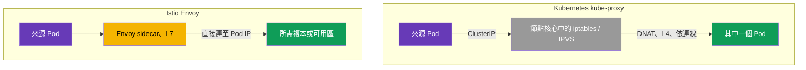
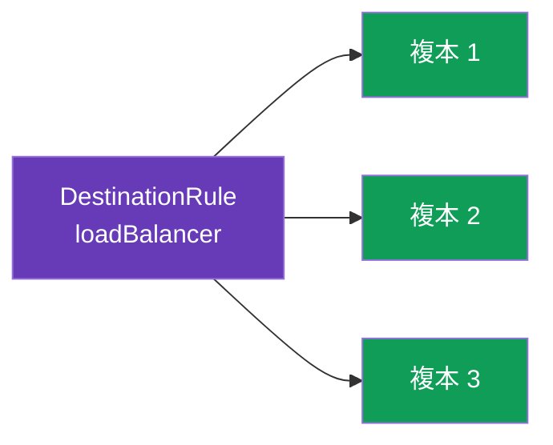
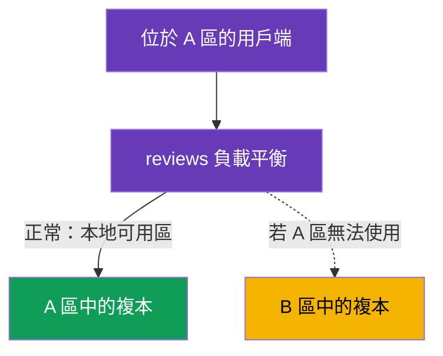

[Русская версия](ru.md) · [Eng version](en.md) · [Versión en español](es.md) · [Version française](fr.md) · [Deutsche Version](de.md) · [ქართული ვერსია](ge.md) · [日本語版](jp.md)

# 第 7 章：負載平衡與 locality-aware 容錯移轉

> **接下來。** 在第 5 與第 6 章中，我們決定將流量傳送至服務的哪個版本。
> 現在往下一層：選定版本後，請求必須在其各個複本（Pod）間進行分配。
> 這就是負載平衡。我們也會了解如何讓流量走向最近的可用區，並在故障時自動切換至另一個可用區--locality-aware 負載平衡與容錯移轉。

## 7.1. Istio 中的負載平衡位置

與一般 Kubernetes 的重要差異在於：負載平衡決策是**在哪裡**、又是**如何**作出的。

**一般 Kubernetes：節點上的 kube-proxy。** `kube-proxy` 以 DaemonSet 運作--**每個節點**各有一個執行個體。重要的是：它本身不會讓流量經過自己。它的職責是透過 API server 監看 Service/EndpointSlice 物件，並在**節點核心**中**設定規則**（iptables 或 IPVS）。當 Pod 存取 Service 的 ClusterIP 時，這些規則會直接在**來源節點**的網路堆疊中攔截封包，並透過 DNAT 將目的位址替換為某個後端 Pod 的 IP。也就是說，進行平衡的不是 kube-proxy 程序，而是依預先部署之規則運作的**節點核心**。這帶來下列限制：

- 決策是在**連線層級（L4）**而非請求層級作出：對 HTTP/2 與 gRPC 而言，所有流量會「黏」在同一個複本上（詳見第 10 章）；
- 不理解 HTTP：不能做到「10% 到 v2」、不能依標頭路由，也沒有重試／逾時；
- 演算法幾乎無法設定--是 iptables（偽隨機）或 IPVS（簡單的 round-robin 與少數幾種選項），而非彈性的應用程式策略；
- 平衡在**來源端**執行：規則在呼叫端 Pod 所在的節點上生效。

**Istio：Pod 中的 Envoy。** 在 mesh 中，sidecar（第 4 章）會攔截輸出流量，並以 **L7** 層級自行平衡，**直接連至 Pod 的 IP**--繞過 kube-proxy 的 ClusterIP 平衡。您透過 `DestinationRule` 加以管理--正是第 5 章中描述 subsets 的那個資源。因此，Istio 的負載平衡是另一項面向流量接收端的策略，且可精細設定：演算法、locality、session affinity--本章其餘部分都會說明這些內容。



## 7.2. 負載平衡演算法

演算法在 `trafficPolicy.loadBalancer.simple` 中設定：

```yaml
apiVersion: networking.istio.io/v1
kind: DestinationRule
metadata:
  name: reviews-dr
spec:
  host: reviews
  trafficPolicy:
    loadBalancer:
      simple: ROUND_ROBIN     # 負載平衡演算法
```

主要選項：

| 演算法 | 運作方式 | 何時使用 |
|----------|--------------|--------------------|
| `ROUND_ROBIN` | 依序循環選取 | 簡單的預設值 |
| `LEAST_REQUEST` | 選擇活躍請求數最少的複本 | 通常比 round-robin 更有效 |
| `RANDOM` | 隨機選擇複本 | 需要簡單且均勻的分散時 |
| `PASSTHROUGH` | 不進行平衡，使用原始位址 | 特殊情況，通常不需要 |



實務上，`LEAST_REQUEST` 通常優於 `ROUND_ROBIN`：它會查看複本目前的負載，不會把請求送到已忙碌的複本。`ROUND_ROBIN` 則不考慮負載，只是機械式地輪流選取。

### Consistent hash：「黏性」工作階段（session affinity）

上述值透過 `simple` 設定。但還有獨立的 `consistentHash` 模式--當同一用戶端的請求必須始終到達**同一個複本**時（為了 Pod 記憶體中的快取、工作階段或本機狀態）。Envoy 依鍵的雜湊選擇複本；相同的鍵會前往相同複本（只要複本集合未變更）。

鍵可取自 HTTP 標頭、cookie、query 參數或 source IP：

```yaml
spec:
  host: reviews
  trafficPolicy:
    loadBalancer:
      consistentHash:
        httpHeaderName: x-user            # 依標頭 x-user 計算雜湊
        # httpCookie: { name: session, ttl: 3600s }  # 或依 cookie
        # useSourceIp: true                           # 或依用戶端 IP
        # httpQueryParameterName: user                # 或依 query 參數
```

務必理解：`consistentHash` 關於的是**黏著性**，而非均勻性。若鍵很少或其分布「偏斜」（例如一名活躍使用者），負載就會不均。而當複本數量變化時，部分鍵必然會轉移到其他 Pod（這是所有 hash ring 的代價）。若要在不使用工作階段的情況下進行真正均勻的平衡，請使用 `LEAST_REQUEST`；僅在確實需要黏著性時才使用 `consistentHash`。

## 7.3. 在連接埠層級覆寫

有時一個服務有多個連接埠，且需求各異。`portLevelSettings` 可為特定連接埠設定專屬演算法，同時保留其他連接埠的通用設定。

```yaml
spec:
  host: reviews
  trafficPolicy:
    loadBalancer:
      simple: ROUND_ROBIN         # 所有連接埠的通用演算法
    portLevelSettings:
    - port:
        number: 8080
      loadBalancer:
        simple: LEAST_REQUEST     # 但連接埠 8080 使用不同演算法
```

此處所有流量都依 `ROUND_ROBIN` 平衡，而連接埠 `8080` 使用 `LEAST_REQUEST`。例如，當一個連接埠提供 REST API、另一個提供 gRPC 或指標，而其負載特性不同時，這會很方便。

## 7.4. Locality-aware 負載平衡

現在來看一個更有意思的問題。假設服務執行於兩個可用區（`eu-central-1a` 與 `eu-central-1b`）。預設情況下，Envoy 會在所有複本之間平均分散流量，而不考慮可用區。這並不好：來自 A 區的請求可能前往 B 區，增加延遲與跨區流量（而雲端環境還會對此收費）。

**Locality-aware 負載平衡**可解決此問題：流量會盡可能留在自己的可用區（region / zone / node）。Istio 會根據標準 Kubernetes 標籤（`topology.kubernetes.io/region`、`topology.kubernetes.io/zone`）自動判定 Pod 的位置，雲端供應商會將這些標籤設定於節點上。



預設情況下，若多個可用區中都有使用 sidecar 的 Pod，系統會自動優先選擇本地可用區。精細設定則透過 `localityLbSetting` 完成。

### 如果 Kubernetes Service 本身已設定可用區感知呢？

Kubernetes 有自己的「讓流量留在本地可用區」機制，與 Istio 無關：

- Service 上的 **`spec.trafficDistribution: PreferClose`**（自 k8s 1.31 起穩定）；
- 較舊的方式--註解 `service.kubernetes.io/topology-mode: Auto`（Topology Aware Routing）。

兩者都透過 **kube-proxy** 在 L4 層運作：kube-proxy 會優先使用同一可用區的 endpoint。

關鍵在於：**在 mesh 中，流量不會經過 kube-proxy，而是經過 Envoy**。Sidecar 會攔截輸出流量，直接依 Pod IP 自行平衡，繞過 kube-proxy。因此這兩個機制存在於不同層級：

| | 原生 Kubernetes | Istio |
|---|---|---|
| 誰進行平衡 | kube-proxy (L4) | Envoy sidecar (L7) |
| 如何啟用 | Service 上的 `trafficDistribution: PreferClose`（或 `topology-mode: Auto`） | DestinationRule 中的 `localityLbSetting` |
| 影響哪些流量 | **沒有** sidecar 的 Pod／繞過 Envoy 的流量 | **在 mesh 內**的流量（透過 sidecar） |
| 可用區故障時的 Failover | 自動且簡單（不需明確規則） | 透過 `failover` 明確設定，且僅能搭配 `outlierDetection` |
| 彈性 | 優先使用本地可用區（開／關） | 可用區優先序 + 權重（`distribute`）+ `failover` 規則 + region/zone/subzone 階層 |

實務結論：

- 對於 **mesh 內**流量，應在 Istio 中設定可用區感知（`localityLbSetting`）。Service 上的 `trafficDistribution` 註解**不會影響**此流量--因為路徑中沒有 kube-proxy。
- Service 註解對**非 mesh**流量仍然適用：未使用 sidecar 的 Pod，以及未經過 Envoy 的呼叫。
- 沒有必要為了「以防萬一」同時設定兩種機制--它們位於不同層級。請選擇流量實際經過的機制：整個服務都在 mesh 中時，Istio 就足夠；若部分用戶端在 mesh 之外，則該部分會由 k8s 機制處理。

> Istio 也有類似 Kubernetes 的「簡化」選項--Service 上的註解
> `networking.istio.io/traffic-distribution: PreferClose`：當不需要精細的 failover／權重規則時，它是較簡單的 `localityLbSetting` 類似物（也是 ambient 模式的主要方式，因為該模式沒有 sidecar--第 22 章）。

## 7.5. 可用區之間的 Failover

正常運作時，優先使用本地可用區很好。但若 A 區中的所有複本都故障了呢？此時流量必須自動前往 B 區。這就是 **failover**。

一個常被忽略的關鍵點是：要讓 failover 生效，Istio 必須**知道本地複本不健康**。這由 `outlierDetection` 負責（我們會在第 8 章關於 circuit breaking 的內容中詳細討論）。沒有它，Istio 不會將有問題的 endpoint 排除，也不會啟動 failover。

```yaml
apiVersion: networking.istio.io/v1
kind: DestinationRule
metadata:
  name: reviews-dr
spec:
  host: reviews
  trafficPolicy:
    loadBalancer:
      localityLbSetting:
        enabled: true
        failover:
        - from: eu-central-1a     # 若 A 區故障
          to: eu-central-1b       # 導向 B 區
    outlierDetection:             # failover 必備
      consecutive5xxErrors: 3     # 連續 3 次錯誤
      interval: 10s               # 檢查頻率
      baseEjectionTime: 30s       # 將異常 endpoint 排除多久
```

其邏輯如下：`outlierDetection` 監看複本的回應。若 A 區中的複本開始持續回傳錯誤，Envoy 會將其從負載平衡中排除。當本地可用區已沒有健康複本時，`failover` 便會觸發，流量前往 B 區。A 區一恢復，流量就會回到該區。

## 7.6. 跨可用區加權分配

有時不需要本地可用區的硬性優先順序，而是需要較柔和的分配方式：例如讓 80% 流量留在本地，但仍將 20% 傳送至相鄰可用區（用於預熱或均勻性）。這可透過 `distribute` 達成：

```yaml
    loadBalancer:
      localityLbSetting:
        enabled: true
        distribute:
        - from: eu-central-1a/*
          to:
            "eu-central-1a/*": 80    # 80% 留在自己的可用區
            "eu-central-1b/*": 20    # 20% 導向相鄰可用區
```

`distribute` 與 `failover` 解決不同問題：`distribute` 以百分比設定正常情況下跨可用區的分配，`failover` 則描述故障時應前往何處。兩者可以一起使用。

## 7.7. 最佳實務

- **預設選擇 `LEAST_REQUEST`。** 多數情況下它優於 `ROUND_ROBIN`：會考慮複本目前的負載。當複本相同且請求同質時，`ROUND_ROBIN` 才合理。
- **只在需要時使用 session affinity。** `consistentHash` 對快取與工作階段有用，但會降低均勻性並讓擴展更複雜（加入複本時，部分鍵會轉移）。請勿將它當成「預設負載平衡」。
- **Failover = locality + `outlierDetection`。** 沒有 `outlierDetection` 的本地可用區優先順序對容錯沒有用：Istio 不會知道本地複本已不健康，也不會切換流量（見 7.5）。
- **在每個可用區保有複本。** Locality-aware 只有在各可用區存在健康複本時才有意義。請規劃每區至少 2 個複本--否則唯一複本遺失時，流量仍會前往相鄰可用區，locality 無法提供幫助。
- **Cross-zone 流量應是例外，而非常態。** 跨區流量較慢且需付費。請讓流量留在本地（`localityLbSetting`），並有意識地使用 `distribute`／`failover`。
- **謹慎處理 panic threshold。** 若 `outlierDetection` 排除太多 endpoint（預設在健康數量低於約 50% 時），Envoy 會啟用「panic mode」，再度將流量傳至所有複本，**忽略健康狀態**--以避免完全拒絕服務。這是防止「全部關閉」的保護機制，但在激進的 `outlierDetection` 下可能掩蓋問題。可透過 `outlierDetection.minHealthPercent` 調整門檻。
- **新複本使用 slow start。** 為避免剛啟動的 Pod 立刻收到流量尖峰（冷快取、JIT 預熱），請啟用平滑遞增：

  ```yaml
      loadBalancer:
        simple: LEAST_REQUEST
        warmupDurationSecs: 60     # 於 60 秒內平滑地將流量導向新複本
  ```

- **單一可用區感知層。** 請勿針對同一 mesh 流量混用 k8s `trafficDistribution` 與 Istio `localityLbSetting`（見 7.4）--在流量實際經過的地方設定即可。

## 7.8. 本章總結

- 在一般 Kubernetes 中，進行平衡的不是 kube-proxy 本身，而是依 kube-proxy（每個節點上的 DaemonSet）部署規則運作的**節點核心** iptables/IPVS--這是依連線運作的 L4。Istio 則由 Envoy（L7）直接連至 Pod IP 來進行平衡，並在 `DestinationRule` 中設定。
- 演算法於 `loadBalancer.simple` 設定：`ROUND_ROBIN`、`LEAST_REQUEST`、`RANDOM`、`PASSTHROUGH`。`LEAST_REQUEST` 通常比 round-robin 更有效。
- 「黏性」工作階段可使用獨立的 `consistentHash` 模式（依標頭、cookie、query 參數或 source IP）--可黏著至複本，但犧牲均勻性。
- 最佳實務：預設使用 `LEAST_REQUEST`、僅在需要時使用 `consistentHash`、failover 一律搭配 `outlierDetection`、每個可用區都有複本、cross-zone 作為例外、使用 `warmupDurationSecs` 預熱新 Pod，並記住 panic threshold。
- `portLevelSettings` 可為個別連接埠設定專屬演算法。
- Locality-aware 平衡讓流量留在本地可用區；Istio 從節點上的拓撲標籤取得位置。
- 原生 k8s 可用區感知（`trafficDistribution: PreferClose` / `topology-mode: Auto`）透過 kube-proxy（L4）運作，**不會影響** mesh 流量（路徑中是 Envoy，而非 kube-proxy）；mesh 內流量的可用區應在 Istio（`localityLbSetting`）設定，非 mesh 流量則透過 Kubernetes 機制設定。
- `failover` 會在故障時將流量切換至其他可用區，但僅能搭配 `outlierDetection` 運作（否則 Istio 不會知道複本已不健康）。
- `distribute` 以百分比設定跨可用區的柔性分配。

## 7.9. 自我檢查問題

1. Istio 在哪裡設定負載平衡演算法？這與 kube-proxy 有何不同？
2. `LEAST_REQUEST` 與 `ROUND_ROBIN` 有何不同？
3. `portLevelSettings` 的用途是什麼？
4. 什麼是 locality-aware 平衡？Istio 從哪裡得知 Pod 的可用區？
5. 為什麼 failover 必須使用 `outlierDetection`？
6. `distribute` 與 `failover` 有何不同？
7. 若 Kubernetes Service 已設定 `trafficDistribution: PreferClose`，它會影響 mesh 內流量嗎？為什麼？那麼應在哪裡設定 mesh 的可用區感知？
8. 何時應使用 `consistentHash` 而非 `LEAST_REQUEST`？它有哪些缺點？
9. 什麼是 panic threshold？它為何需要存在？`warmupDurationSecs` 如何協助新複本？

## 實作練習

練習負載平衡演算法與連接埠層級覆寫：

🧪 實驗 06：[tasks/ica/labs/06](../../labs/06/README_TW.MD)

練習可用區之間的 locality-aware failover：

🧪 實驗 14：[tasks/ica/labs/14](../../labs/14/README_TW.MD)

---
[目錄](../README_TW.md) · [第 6 章](../06/tw.md) · [第 8 章](../08/tw.md)
