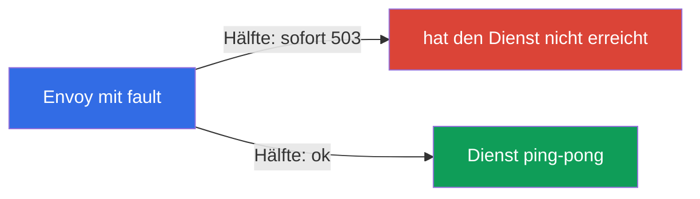
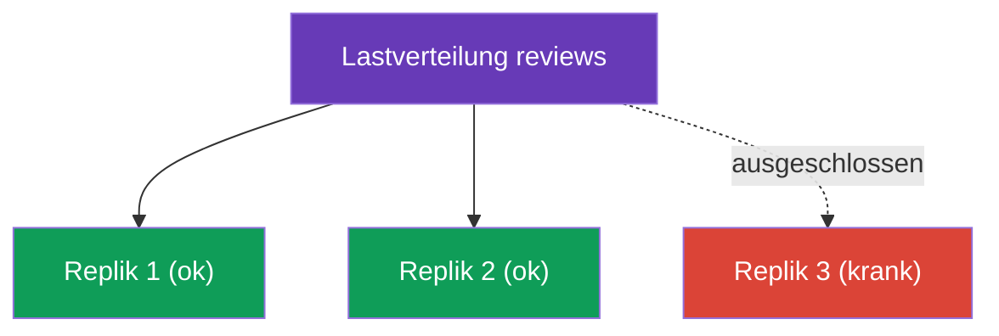

[RU version](ru.md) · [Eng version](en.md) · [Versión en español](es.md) · [Version française](fr.md)

# Kapitel 8. Resilienz: Fault Injection, Timeouts, Retries, Circuit Breaking

> **Was kommt als Nächstes.** Das Netz ist unzuverlässig: Dienste hängen, starten neu, geben
> Fehler zurück. In diesem Kapitel sehen wir uns an, wie Istio eine Anwendung gegen solche
> Störungen widerstandsfähig macht - und das alles auf Infrastruktur-Ebene, ohne Änderung
> des Codes. Zuerst lernen wir, einen Dienst absichtlich zu stören (Fault Injection), um die
> Resilienz zu prüfen, und dann zu reparieren: Timeouts, Retries und circuit breaking.

## 8.1. Das Problem: Störungen und kaskadierende Ausfälle

Wenn ein Dienst einen anderen über das Netz anspricht, kann alles schiefgehen: Der Empfänger
hängt, gibt 503 zurück oder ist gar nicht erreichbar. Wird das nicht behandelt, breitet sich
das Unheil aus: Ein langsamer Dienst hält den Aufrufer auf, bei diesem stauen sich die
Verbindungen, und schließlich fällt die ganze Kette aus. Das nennt man **kaskadierenden
Ausfall** (cascading failure).

Istio bietet dagegen eine Reihe von Werkzeugen, und sie alle werden in bereits bekannten
Ressourcen konfiguriert:

| Werkzeug | Wo konfiguriert | Was es tut |
|------------|-------------------|------------|
| Fault Injection | VirtualService | fügt absichtlich Verzögerungen und Fehler zum Testen ein |
| Timeout | VirtualService | bricht eine zu lange Anfrage ab |
| Retry | VirtualService | wiederholt eine fehlgeschlagene Anfrage |
| Circuit Breaking | DestinationRule | begrenzt die Last und trennt kranke Repliken ab |

## 8.2. Fault Injection: absichtlich kaputt machen

Bevor man sich gegen Störungen schützt, muss man sie reproduzieren können. Fault Injection ist
das kontrollierte Einbringen von Fehlern, um zu prüfen, wie sich das System verhält. Es gibt
zwei Arten.

Fault Injection wird im **`VirtualService`** für den Dienst festgelegt, den wir „stören“
wollen (in den Beispielen unten - `ping-pong`): Im Feld `hosts` geben wir diesen Dienst an und
in `http.fault` - welche Störung einzubringen ist.

**Verzögerung (delay)** - wir simulieren einen langsamen Dienst:

```yaml
apiVersion: networking.istio.io/v1
kind: VirtualService
metadata:
  name: ping-pong
spec:
  hosts:
  - ping-pong               # auf welchen Dienst wir es anwenden
  http:
  - fault:
      delay:
        fixedDelay: 5s
        percentage:
          value: 100        # allen Anfragen 5 s Verzögerung hinzufügen
    route:
    - destination:
        host: ping-pong
```

**Abbruch (abort)** - wir simulieren einen Fehler:

```yaml
apiVersion: networking.istio.io/v1
kind: VirtualService
metadata:
  name: ping-pong
spec:
  hosts:
  - ping-pong
  http:
  - fault:
      abort:
        httpStatus: 503
        percentage:
          value: 50         # der Hälfte der Anfragen sofort 503 zurückgeben
    route:
    - destination:
        host: ping-pong
```



Ein wichtiger Punkt: Bei `abort` erzeugt **Envoy selbst** den Fehler, die Anfrage erreicht den
echten Dienst gar nicht. Das ist praktisch und sicher: Sie testen die Resilienz der
aufrufenden Seite, ohne den Code anzufassen und ohne den Dienst selbst wirklich kaputt zu
machen.

## 8.3. Timeout: eine lange Anfrage abbrechen

Antwortet ein Dienst zu lange, ist es besser, die Anfrage abzubrechen, als endlos zu warten
und eine Verbindung belegt zu halten. Der Timeout wird im `VirtualService` für den gewünschten
Dienst festgelegt (unten ist nur der `http`-Block gezeigt, die vollständige Struktur - wie im
Beispiel aus 8.2):

```yaml
http:
- timeout: 3s           # nicht länger als 3 Sekunden auf die Antwort warten
  route:
  - destination:
      host: reviews
```

Hat `reviews` nicht innerhalb von 3 Sekunden geantwortet, bricht Envoy die Anfrage ab und gibt
dem Aufrufer einen Fehler zurück (`504`). Ohne Timeout kann ein einzelner langsamer Dienst die
ganze Kette „aufhängen“.

## 8.4. Retry: eine fehlgeschlagene Anfrage wiederholen

Viele Störungen sind vorübergehend: Ein Pod hat neu gestartet, es gab ein sekundenlanges
Netzwerkproblem. In solchen Fällen löst eine einfache Wiederholung der Anfrage das Problem.
Retries werden ebenfalls im `VirtualService` festgelegt (unten - nur der `http`-Block):

```yaml
http:
- retries:
    attempts: 3               # bis zu 3 Wiederholungsversuche
    perTryTimeout: 2s         # Timeout für jeden Versuch
    retryOn: 5xx,connect-failure   # bei welchen Fehlern wiederholen
  route:
  - destination:
      host: reviews
```


Sehen wir uns die Felder an:

- **`attempts`** - wie oft nach dem ersten Fehlschlag wiederholt wird.
- **`perTryTimeout`** - Timeout für jeden einzelnen Versuch.
- **`retryOn`** - unter welchen Bedingungen wiederholt wird: `5xx` (jede 5xx-Antwort),
  `connect-failure`, `gateway-error`, `retriable-4xx` und andere, durch Komma getrennt.

Retries erhöhen die Zuverlässigkeit deutlich. Einfache Mathematik: Wenn ein Dienst in 50 % der
Fälle Fehler macht, ist bei 3 Retries die Wahrscheinlichkeit, dass alle 4 Versuche
fehlschlagen, gleich 0,5 hoch 4 = ~6 %. Der Erfolg steigt also von 50 % auf ~94 %, und das
alles unbemerkt für die Anwendung.

### Fallstricke der Retries

Retries sind mächtig, aber sie haben Feinheiten, an die man denken sollte.

- **Istio retryt standardmäßig bereits.** Auch ohne `retries`-Block wendet Istio auf
  HTTP-Anfragen Standard-Retries an (üblicherweise `attempts: 2` bei „sicheren“ Störungen wie
  `connect-failure`, `refused-stream`, `unavailable`). Ein explizites `retries` überschreibt
  das. „Es gibt keine Retries“ ist also ein Mythos; die Frage ist nur, ob es Ihre
  Einstellungen sind oder die Standardwerte.
- **Retryen darf man nur idempotente Operationen.** Die Wiederholung eines `GET` ist sicher.
  Die Wiederholung eines `POST`, das eine Bestellung anlegt oder Geld abbucht, wird bei
  Retries zweimal ausgeführt. Retries für nicht-idempotente Anfragen aktivieren Sie bewusst
  (oder nicht) - das ist dasselbe Problem wie beim Mirroring aus Kapitel 6.
- **Vorsicht mit dem Retry Storm (Lawine von Retries).** Fällt die ganze Kette aus, beginnt
  jede Schicht zu retryen - und die Last vervielfacht sich, was den bereits überlasteten
  Dienst vollends erledigt. Halten Sie `attempts` klein (2-3) und begrenzen Sie gleichzeitige
  Retries über `connectionPool.http.maxRetries` in der DestinationRule.
- **Der Timeout muss alle Versuche fassen.** Der Gesamt-`timeout` der Anfrage wird für alle
  Retries zusammen gezählt. Ist `timeout: 3s`, aber `perTryTimeout: 2s` bei `attempts: 3`, so
  bleibt für den zweiten und dritten Versuch keine Zeit mehr. Stimmen Sie ab: `timeout ≈
  attempts × perTryTimeout` (plus Reserve).

## 8.5. Wo Retries platziert werden: eine wichtige Feinheit

Retries konfiguriert man auf der Seite des Dienstes, der die **Anfrage stellt** (des
Clients), nicht auf der Seite des Dienstes, der mit einem Fehler antwortet. Der Grund ist
einfach: Die Anfrage wiederholt jener Envoy, der den ausgehenden Aufruf macht.

Erinnern Sie sich an das Beispiel aus Lab 03: `frontend` spricht `ping-pong` an, und auf
`ping-pong` ist Fault Injection aktiviert (50 % Fehler). Die Retries muss man im
VirtualService für `frontend` setzen - dann wiederholt dessen Envoy die ausgehenden Aufrufe an
`ping-pong`.

Retries im VirtualService für `ping-pong` zu setzen wäre sinnlos: Dort sitzt die Fault
Injection selbst, und Envoy würde den von ihm selbst erzeugten Fehler wiederholen - eine
endlose, sinnlose Schleife.

Dass Retries tatsächlich stattfinden, lässt sich anhand der Envoy-Metriken des aufrufenden
Pods prüfen:

```bash
kubectl exec -it <frontend-pod> -c istio-proxy -- \
  pilot-agent request GET stats | grep upstream_rq_retry
```

## 8.6. Circuit Breaking: der Connection Pool

Retries und Timeouts arbeiten mit einer einzelnen Anfrage. Circuit Breaking (die Sicherung)
arbeitet auf Dienst-Ebene: Es begrenzt, wie viele Anfragen und Verbindungen an den Empfänger
gesendet werden dürfen. Konfiguriert wird es in der DestinationRule über `connectionPool`.

```yaml
apiVersion: networking.istio.io/v1
kind: DestinationRule
metadata:
  name: reviews-dr
spec:
  host: reviews
  trafficPolicy:
    connectionPool:
      tcp:
        maxConnections: 100          # maximale Anzahl TCP-Verbindungen
      http:
        http1MaxPendingRequests: 10  # maximale Anzahl Anfragen in der Warteschlange
        maxRequestsPerConnection: 10
```

Der Sinn ist, einen überlasteten Dienst nicht „zu erschlagen“. Sind die Limits überschritten,
lehnt Envoy die überzähligen Anfragen sofort ab (`503`), ohne sie in eine endlose
Warteschlange zu stellen. Das gibt dem Dienst die Chance, sich zu erholen, und dem Aufrufer -
schnell eine Antwort zu erhalten (wenn auch einen Fehler) statt zu hängen. Besser schnell
absagen, als langsam mit der ganzen Kette sterben.

Nützliche Felder von `connectionPool`:

- `tcp.maxConnections` - Obergrenze der TCP-Verbindungen zum Dienst;
- `http.http1MaxPendingRequests` - wie viele Anfragen in der Warteschlange warten dürfen;
- `http.http2MaxRequests` - maximale Anzahl gleichzeitiger Anfragen (relevant für HTTP/2 und
  gRPC, wo alles über eine Verbindung läuft - Kapitel 10);
- `http.maxRequestsPerConnection` - nach wie vielen Anfragen die Verbindung neu geöffnet wird;
- `http.maxRetries` - Obergrenze gleichzeitiger Retries zum gesamten Dienst (Schutz vor Retry
  Storm);
- `tcp.connectTimeout` / `http.idleTimeout` - Timeouts für Verbindungsaufbau und Leerlauf.

## 8.7. Outlier Detection: kranke Repliken abtrennen

Der zweite Teil des Circuit Breaking ist `outlierDetection`. Sie beobachtet einzelne Repliken
und schließt vorübergehend jene aus der Lastverteilung aus, die Fehler produzieren.

```yaml
  trafficPolicy:
    outlierDetection:
      consecutive5xxErrors: 5    # 5 5xx-Fehler in Folge
      interval: 10s              # wie oft prüfen
      baseEjectionTime: 30s      # für wie lange die Replik ausschließen
      maxEjectionPercent: 50     # aber nicht mehr als 50% der Repliken auf einmal
```



Die Logik: Hat eine Replik `consecutive5xxErrors` Fehler in Folge geliefert, entfernt Envoy
sie für `baseEjectionTime` aus dem Pool und schickt den Datenverkehr nur auf gesunde. Nach
dieser Zeit wird die Replik zurückgeholt und erneut geprüft. `maxEjectionPercent` verhindert,
dass zu viele Repliken auf einmal ausgeschlossen werden, um nicht ohne arbeitsfähige
dazustehen.

Erinnern Sie sich zusätzlich an Kapitel 7: Genau `outlierDetection` ist für das Locality
Failover nötig - ohne es versteht Istio nicht, dass die Repliken in einer Zone krank sind, und
schaltet den Datenverkehr nicht um.

### Wie sich das mit Liveness-/Readiness-Probes verträgt

Outlier Detection lässt sich leicht mit den Probes von Kubernetes verwechseln, aber das sind
verschiedene Mechanismen auf verschiedenen Ebenen - und sie ergänzen einander.

| | Readiness- / Liveness-Probes | Outlier Detection |
|---|---|---|
| Wer prüft | kubelet auf der Node | Envoy des aufrufenden Pods |
| Wie | fragt **aktiv** den Health-Endpoint des Pods ab | schaut **passiv** auf die realen Antworten (5xx, Timeouts, Abbrüche) |
| Auf welcher Grundlage | was die Anwendung selbst über sich meldet | was auf produktive Anfragen tatsächlich zurückkam |
| Wirkungsbereich | global: Readiness entfernt den Pod aus den Endpoints - niemand sieht ihn | lokal: jeder aufrufende Envoy entscheidet für sich selbst |
| Geschwindigkeit | Prüfintervall + Verteilung der Endpoints | sofort bei Auftreten der Fehler |
| Aktion | Readiness - aus den Endpoints entfernen; Liveness - den Container neu starten | den Endpoint vorübergehend aus dem eigenen Pool ausschließen |

Wie sie zusammenarbeiten:

- **Readiness** - die erste Linie: Erklärt sich ein Pod selbst als nicht bereit, entfernt
  kubelet ihn aus den Endpoints des Dienstes, istiod verteilt ihn nicht mehr als Endpoint, und
  es geht überhaupt kein Datenverkehr an ihn - Outlier Detection „sieht“ ihn gar nicht.
- **Liveness** - hängt der Container, startet kubelet ihn neu; während des Neustarts fällt der
  Pod ohnehin durch die Readiness und fällt aus den Endpoints.
- **Outlier Detection** deckt ab, was die Probes verpassen: Der Pod **besteht die Readiness**
  (sagt „ich bin gesund“), produziert aber in Wirklichkeit Fehler - zum Beispiel wegen einer
  ausgefallenen Abhängigkeit oder eines Bugs, den der Health-Endpoint nicht erfasst. Envoy
  sieht die realen 5xx und schließt eine solche Replik vorübergehend aus der Lastverteilung
  aus, ohne zu warten, bis die Anwendung es „zugibt“.

Praktisches Fazit: Probes und Outlier Detection ersetzen einander nicht, sondern **ergänzen**
sich. Readiness/Liveness ist „bin ich nach eigener Einschätzung gesund“, und Outlier Detection
ist „wie antworte ich tatsächlich auf produktiven Datenverkehr“. Für die Ausfallsicherheit
(und für das Locality Failover aus Kapitel 7) braucht man beides: korrekte Probes **plus**
`outlierDetection`.

> Feinheit bei Istio: Bei einem Pod im Mesh wird die Readiness-Probe der Anwendung mit der
> Bereitschaft des Sidecars selbst (`istio-proxy`, Port `15021`) kombiniert. Ist der Sidecar
> nicht bereit, ist auch der Pod nicht bereit und fällt aus den Endpoints (siehe Kapitel 4).

## 8.8. Best Practices

- **Schichten Sie den Schutz.** Timeout + Retries + Circuit Breaking arbeiten zusammen: Der
  Timeout verhindert das Hängen, Retries verbergen vorübergehende Störungen, Circuit Breaking
  schützt einen überlasteten Dienst. Einzeln ist jeder schwächer.
- **Setzen Sie überall Timeouts.** Standardmäßig hat Istio keinen Anfrage-Timeout - eine
  Anfrage kann beliebig lange warten. Setzen Sie einen sinnvollen `timeout` für jeden Aufruf,
  sonst hängt ein langsamer Dienst die ganze Kette auf.
- **Retryen Sie nur Idempotentes.** `GET` - ja; `POST`/`PUT` mit Seiteneffekten - nur wenn die
  Operation idempotent ist (oder über einen Idempotenz-Schlüssel auf Anwendungsseite).
- **Kleines `attempts` + `maxRetries`.** 2-3 Versuche genügen; begrenzen Sie gleichzeitige
  Retries über `connectionPool.http.maxRetries`, um keinen Retry Storm auszulösen.
- **Stimmen Sie Timeout und Retries ab.** Der Gesamt-`timeout` muss `attempts × perTryTimeout`
  fassen, sonst schaffen es einige Versuche nicht.
- **Circuit Breaking - konservativ und nach Last.** Wählen Sie die `connectionPool`-Limits
  passend zur realen Kapazität des Dienstes; besser schnell ein 503 liefern, als eine
  Warteschlange anzuhäufen.
- **`outlierDetection` mit `maxEjectionPercent`.** Schließen Sie kranke Repliken aus, aber
  nicht alle auf einmal - sonst geht Envoy in den Panic Mode (Kapitel 7) und schickt wieder
  Datenverkehr an alle.
- **Prüfen Sie die Resilienz mit Fault Injection.** Glauben Sie nicht, dass die
  Resilienz-Konfiguration funktioniert, solange Sie den Dienst nicht absichtlich gestört
  (`delay`/`abort`) und gesehen haben, dass Retries, Timeouts und Sicherungen tatsächlich
  greifen.

## 8.9. Zusammenfassung des Kapitels

- Ein unzuverlässiges Netz führt zu kaskadierenden Ausfällen; Istio schützt davor auf
  Infrastruktur-Ebene.
- **Fault Injection** (`fault.delay`, `fault.abort`) im VirtualService bringt absichtlich
  Verzögerungen und Fehler ein, um die Resilienz zu prüfen; den Fehler erzeugt Envoy selbst.
- **Timeout** im VirtualService bricht eine zu lange Anfrage ab (gibt 504 zurück).
- **Retry** im VirtualService wiederholt eine fehlgeschlagene Anfrage (`attempts`,
  `perTryTimeout`, `retryOn`); erhöht die Zuverlässigkeit deutlich.
- Retries konfiguriert man auf der Seite des Client-Dienstes (der die Anfrage stellt), nicht
  auf der Seite des Dienstes, der mit einem Fehler antwortet.
- Fallstricke der Retries: Istio retryt standardmäßig (attempts 2), sicher retryen darf man
  nur Idempotentes, Risiko eines Retry Storms (`attempts` und `maxRetries` begrenzen), der
  Gesamt-`timeout` muss alle Versuche fassen.
- **Circuit Breaking** in der DestinationRule: `connectionPool` begrenzt die Last,
  `outlierDetection` schließt kranke Repliken aus.
- `outlierDetection` ist außerdem für das Locality Failover nötig (Kapitel 7).
- Outlier Detection (passive Prüfung durch Envoy anhand realer Antworten) und die Probes von
  kubelet (aktive Prüfung des Health-Endpoints) ergänzen einander: Probes entfernen den Pod
  global aus den Endpoints, Outlier Detection fängt eine Replik ab, die die Readiness besteht,
  aber tatsächlich mit Fehlern antwortet.

## 8.10. Fragen zur Selbstüberprüfung

1. Was ist ein kaskadierender Ausfall und wie hilft Istio, ihn zu verhindern?
2. Wodurch unterscheidet sich `fault.delay` von `fault.abort`? Wer erzeugt den Fehler bei
   abort?
3. In welcher Ressource werden Timeouts und Retries festgelegt?
4. Warum konfiguriert man Retries auf der Seite des Client-Dienstes (der die Anfrage stellt)
   und nicht auf der Seite des Dienstes, der mit einem Fehler antwortet?
5. Wofür sind `connectionPool` und `outlierDetection` im Circuit Breaking zuständig?
6. Welcher Zusammenhang besteht zwischen `outlierDetection` und dem Locality Failover aus
   Kapitel 7?
7. Warum ist es gefährlich, POST-Anfragen zu retryen? Was ist ein Retry Storm und womit
   begrenzt man ihn?
8. Was passiert, wenn `timeout` kleiner ist als `attempts × perTryTimeout`? Hat Istio
   standardmäßig Retries?
9. Wodurch unterscheidet sich `outlierDetection` von Readiness-/Liveness-Probes und wie
   ergänzen sie einander? Welchen Fall fängt Outlier Detection ab, die Readiness aber nicht?

## Praxis

Üben Sie Fault Injection und Retries (das Backend stören und mit Retries reparieren):

🧪 Lab 03: [tasks/ica/labs/03](../../labs/03/README_DE.MD)

Üben Sie Timeouts und Circuit Breaking:

🧪 Lab 10: [tasks/ica/labs/10](../../labs/10/README_DE.MD)

---
[Inhaltsverzeichnis](../README_DE.md) · [Kapitel 7](../07/de.md) · [Kapitel 9](../09/de.md)
