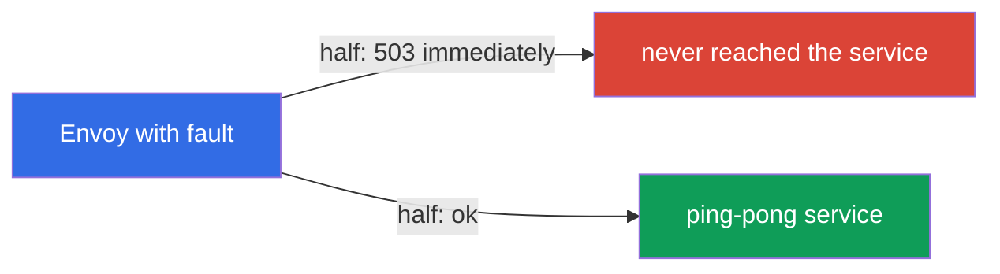
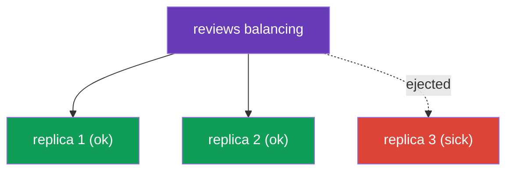

[RU version](ru.md) · [Versión en español](es.md)

# Chapter 8. Resilience: fault injection, timeouts, retries, circuit breaking

> **What's next.** The network is unreliable: services slow down, restart, return errors. In
> this chapter we cover how Istio makes an application resilient to such failures - all at
> the infrastructure level, without changing code. First we learn to break a service on
> purpose (fault injection) to test resilience, and then to fix it: timeouts, retries and
> circuit breaking.

## 8.1. The problem: failures and cascading outages

When one service calls another over the network, things can go wrong: the recipient slows
down, returns 503, or is unavailable entirely. If this is not handled, the trouble spreads: a
slow service holds up its caller, connections pile up there, and eventually the whole chain
falls over. This is called a **cascading failure**.

Istio provides a set of tools against this, and all of them are configured in resources you
already know:

| Tool | Where it is configured | What it does |
|------|------------------------|--------------|
| Fault injection | VirtualService | deliberately injects delays and errors for testing |
| Timeout | VirtualService | aborts a request that takes too long |
| Retry | VirtualService | repeats a failed request |
| Circuit breaking | DestinationRule | limits load and cuts off sick replicas |

## 8.2. Fault injection: breaking on purpose

Before defending against failures, you must be able to reproduce them. Fault injection is the
controlled introduction of errors to check how the system behaves. There are two kinds.

Fault injection is configured in a **`VirtualService`** for the service we want to "break"
(in the examples below - `ping-pong`): in the `hosts` field we name that service, and in
`http.fault` - what failure to inject.

**Delay** - simulate a slow service:

```yaml
apiVersion: networking.istio.io/v1
kind: VirtualService
metadata:
  name: ping-pong
spec:
  hosts:
  - ping-pong               # which service we apply it to
  http:
  - fault:
      delay:
        fixedDelay: 5s
        percentage:
          value: 100        # add a 5s delay to all requests
    route:
    - destination:
        host: ping-pong
```

**Abort** - simulate an error:

```yaml
apiVersion: networking.istio.io/v1
kind: VirtualService
metadata:
  name: ping-pong
spec:
  hosts:
  - ping-pong
  http:
  - fault:
      abort:
        httpStatus: 503
        percentage:
          value: 50         # return 503 immediately for half the requests
    route:
    - destination:
        host: ping-pong
```



An important point: with `abort` the error is generated by **Envoy itself**, the request does
not even reach the real service. This is convenient and safe: you test the resilience of the
calling side without touching code and without really breaking the service.

## 8.3. Timeout: aborting a long request

If a service responds too slowly, it is better to abort the request than to wait forever and
keep a connection busy. The timeout is set in a `VirtualService` for the target service (only
the `http` block is shown below; the full structure is like in the 8.2 example):

```yaml
http:
- timeout: 3s           # wait for a response no longer than 3 seconds
  route:
  - destination:
      host: reviews
```

If `reviews` did not answer within 3 seconds, Envoy aborts the request and returns an error
(`504`) to the caller. Without a timeout a single slow service can "hang" the whole chain.

## 8.4. Retry: repeating a failed request

Many failures are transient: a pod restarted, there was a momentary network glitch. In such
cases a simple retry solves the problem. Retries are also set in a `VirtualService` (only the
`http` block below):

```yaml
http:
- retries:
    attempts: 3               # up to 3 retry attempts
    perTryTimeout: 2s         # timeout for each attempt
    retryOn: 5xx,connect-failure   # on which errors to retry
  route:
  - destination:
      host: reviews
```


Let's break down the fields:

- **`attempts`** - how many times to retry after the first failure.
- **`perTryTimeout`** - the timeout for each individual attempt.
- **`retryOn`** - under which conditions to retry: `5xx` (any 5xx response),
  `connect-failure`, `gateway-error`, `retriable-4xx` and others, comma-separated.

Retries noticeably increase reliability. Simple math: if a service errors 50% of the time,
then with 3 retries the probability that all 4 attempts fail is 0.5 to the 4th power = ~6%.
So the success rate rises from 50% to ~94%, and all of it is invisible to the application.

### Retry pitfalls

Retries are powerful, but they have subtleties worth remembering.

- **Istio already retries by default.** Even without a `retries` block, Istio applies default
  retries to HTTP requests (usually `attempts: 2` on "safe" failures like `connect-failure`,
  `refused-stream`, `unavailable`). An explicit `retries` overrides this. So "there are no
  retries" is a myth; the only question is whether the settings are yours or the defaults.
- **Only idempotent operations can be retried.** Repeating a `GET` is safe. But repeating a
  `POST` that creates an order or charges money will execute twice on retry. Enable retries
  for non-idempotent requests deliberately (or not at all) - it is the same problem as with
  mirroring from chapter 6.
- **Beware of retry storms.** If the whole chain is failing, each layer starts retrying - and
  the load multiplies, finishing off an already-overloaded service. Keep `attempts` small
  (2-3) and limit concurrent retries via `connectionPool.http.maxRetries` in the
  DestinationRule.
- **The timeout must accommodate all attempts.** The overall request `timeout` counts across
  all retries at once. If `timeout: 3s` while `perTryTimeout: 2s` with `attempts: 3`, there
  will be no time left for the second and third attempts. Align `timeout ≈ attempts ×
  perTryTimeout` (plus some slack).

## 8.5. Where to put retries: an important subtlety

Retries are configured on the side of the service that **makes the request** (the client),
not on the side of the service that responds with an error. The reason is simple: the retry
is done by the Envoy that makes the outbound call.

Recall the example from lab 03: `frontend` calls `ping-pong`, and `ping-pong` has fault
injection enabled (50% errors). Retries must be set in the VirtualService for `frontend` -
then its Envoy will repeat the outbound calls to `ping-pong`.

Setting retries in the VirtualService for `ping-pong` would be pointless: that is where the
fault injection sits, and Envoy would retry the error it generated itself - a pointless
endless loop.

You can verify that retries actually happen from the caller pod's Envoy metrics:

```bash
kubectl exec -it <frontend-pod> -c istio-proxy -- \
  pilot-agent request GET stats | grep upstream_rq_retry
```

## 8.6. Circuit breaking: the connection pool

Retries and timeouts work with an individual request. Circuit breaking works at the service
level: it limits how many requests and connections may be sent to a recipient. It is
configured in a DestinationRule via `connectionPool`.

```yaml
apiVersion: networking.istio.io/v1
kind: DestinationRule
metadata:
  name: reviews-dr
spec:
  host: reviews
  trafficPolicy:
    connectionPool:
      tcp:
        maxConnections: 100          # maximum TCP connections
      http:
        http1MaxPendingRequests: 10  # maximum queued requests
        maxRequestsPerConnection: 10
```

The point is to avoid "overwhelming" an overloaded service. When the limits are exceeded,
Envoy immediately rejects the extra requests (`503`) instead of queueing them endlessly. This
gives the service a chance to recover, and the caller a quick answer (even if an error)
instead of hanging. Better to fail fast than to die slowly across the whole chain.

Useful `connectionPool` fields:

- `tcp.maxConnections` - the cap on TCP connections to the service;
- `http.http1MaxPendingRequests` - how many requests may wait in the queue;
- `http.http2MaxRequests` - the maximum concurrent requests (relevant for HTTP/2 and gRPC,
  where everything goes over a single connection - chapter 10);
- `http.maxRequestsPerConnection` - after how many requests to reopen the connection;
- `http.maxRetries` - the cap on concurrent retries to the whole service (protection against
  retry storms);
- `tcp.connectTimeout` / `http.idleTimeout` - the connection establishment and idle timeouts.

## 8.7. Outlier detection: cutting off sick replicas

The second part of circuit breaking is `outlierDetection`. It watches individual replicas and
temporarily ejects from load balancing those that are throwing errors.

```yaml
  trafficPolicy:
    outlierDetection:
      consecutive5xxErrors: 5    # 5 consecutive 5xx errors
      interval: 10s              # how often to check
      baseEjectionTime: 30s      # for how long to eject the replica
      maxEjectionPercent: 50     # but no more than 50% of replicas at once
```



The logic: if a replica returns `consecutive5xxErrors` errors in a row, Envoy removes it from
the pool for `baseEjectionTime` and sends traffic only to the healthy ones. After that time
the replica is brought back and checked again. `maxEjectionPercent` prevents ejecting too many
replicas at once, so as not to be left with no working ones.

Separately, recall chapter 7: it is exactly `outlierDetection` that is needed for locality
failover - without it Istio does not understand that the replicas in a zone are sick and does
not switch traffic.

### How this combines with liveness/readiness probes

Outlier detection is easy to confuse with Kubernetes probes, but they are different mechanisms
at different levels - and they complement each other.

| | Readiness / Liveness probes | Outlier detection |
|---|---|---|
| Who checks | kubelet on the node | the caller pod's Envoy |
| How | **actively** polls the pod's health endpoint | **passively** watches real responses (5xx, timeouts, resets) |
| Based on what | what the application reports about itself | what actually came back on live requests |
| Scope | global: readiness removes the pod from Endpoints - nobody sees it | local: each calling Envoy decides for itself |
| Speed | probe period + Endpoints propagation | immediately, on the fact of errors |
| Action | readiness - remove from Endpoints; liveness - restart the container | temporarily eject the endpoint from its own pool |

How they work together:

- **Readiness** is the first line: if the pod declares itself not ready, kubelet removes it
  from the Service Endpoints, istiod stops advertising it as an endpoint, and no traffic goes
  to it at all - outlier detection does not even "see" it.
- **Liveness** - if the container hangs, kubelet restarts it; during the restart the pod fails
  readiness anyway and drops out of Endpoints.
- **Outlier detection** covers what probes miss: the pod **passes readiness** (says "I'm
  healthy") but actually throws errors - for example, because of a failed dependency or a bug
  the health endpoint does not catch. Envoy sees the real 5xx and temporarily ejects such a
  replica from balancing, without waiting for the application to "admit" it.

The practical conclusion: probes and outlier detection do not replace but **complement** each
other. Readiness/liveness is "am I healthy by my own assessment", while outlier detection is
"how do I actually respond to live traffic". For fault tolerance (and for locality failover
from chapter 7) you need both: correct probes **plus** `outlierDetection`.

> An Istio nuance: for a pod in the mesh the application's readiness probe is merged with the
> readiness of the sidecar itself (`istio-proxy`, port `15021`). If the sidecar is not ready,
> the pod is not ready either and drops out of Endpoints (see chapter 4).

## 8.8. Best practices

- **Layer your defenses.** Timeout + retries + circuit breaking work together: the timeout
  keeps things from hanging, retries hide transient failures, circuit breaking protects an
  overloaded service. Each is weaker on its own.
- **Set timeouts everywhere.** By default Istio has no request timeout - a request may wait
  indefinitely. Set a reasonable `timeout` on every call, otherwise a single slow service will
  hang the whole chain.
- **Retry only the idempotent.** `GET` - yes; `POST`/`PUT` with side effects - only if the
  operation is idempotent (or via an idempotency key on the application side).
- **Small `attempts` + `maxRetries`.** 2-3 attempts is enough; limit concurrent retries via
  `connectionPool.http.maxRetries` so as not to cause a retry storm.
- **Align the timeout and retries.** The overall `timeout` must accommodate `attempts ×
  perTryTimeout`, otherwise some attempts will not have time to run.
- **Circuit breaking - conservatively and by load.** Set the `connectionPool` limits to the
  service's real capacity; better to return a 503 quickly than to build up a queue.
- **`outlierDetection` with `maxEjectionPercent`.** Eject sick replicas, but not all at once -
  otherwise Envoy enters panic mode (chapter 7) and starts sending traffic to everyone again.
- **Validate resilience with fault injection.** Do not trust that the resilience config works
  until you have broken the service on purpose (`delay`/`abort`) and seen the retries,
  timeouts and breakers actually kick in.

## 8.9. Chapter summary

- An unreliable network leads to cascading failures; Istio protects against them at the
  infrastructure level.
- **Fault injection** (`fault.delay`, `fault.abort`) in a VirtualService deliberately injects
  delays and errors to test resilience; the error is generated by Envoy itself.
- **Timeout** in a VirtualService aborts a request that takes too long (returns 504).
- **Retry** in a VirtualService repeats a failed request (`attempts`, `perTryTimeout`,
  `retryOn`); it noticeably increases reliability.
- Retries are configured on the side of the client service (which makes the request), not on
  the side of the service that responds with an error.
- Retry pitfalls: Istio retries by default (attempts 2), only the idempotent is safe to retry,
  the risk of a retry storm (limit `attempts` and `maxRetries`), the overall `timeout` must
  accommodate all attempts.
- **Circuit breaking** in a DestinationRule: `connectionPool` limits load, `outlierDetection`
  ejects sick replicas.
- `outlierDetection` is also required for locality failover (chapter 7).
- Outlier detection (Envoy's passive check based on real responses) and kubelet probes (an
  active check of the health endpoint) complement each other: probes remove the pod from
  Endpoints globally, outlier detection catches a replica that passes readiness but actually
  responds with errors.

## 8.10. Self-check questions

1. What is a cascading failure and how does Istio help prevent it?
2. How does `fault.delay` differ from `fault.abort`? Who generates the error on abort?
3. In which resource are timeouts and retries set?
4. Why are retries configured on the side of the client service (which makes the request),
   not on the side of the service that responds with an error?
5. What do `connectionPool` and `outlierDetection` handle in circuit breaking?
6. What is the connection between `outlierDetection` and locality failover from chapter 7?
7. Why is it dangerous to retry POST requests? What is a retry storm and how is it limited?
8. What happens if `timeout` is less than `attempts × perTryTimeout`? Does Istio have default
   retries?
9. How does `outlierDetection` differ from readiness/liveness probes, and how do they
   complement each other? Which case does outlier detection catch that readiness does not?

## Practice

Practice fault injection and retries (break the backend and fix it with retries):

🧪 Lab 03: [tasks/ica/labs/03](../../labs/03/README.MD)

Practice timeouts and circuit breaking:

🧪 Lab 10: [tasks/ica/labs/10](../../labs/10/README.MD)

---
[Contents](../README.md) · [Chapter 7](../07/en.md) · [Chapter 9](../09/en.md)
