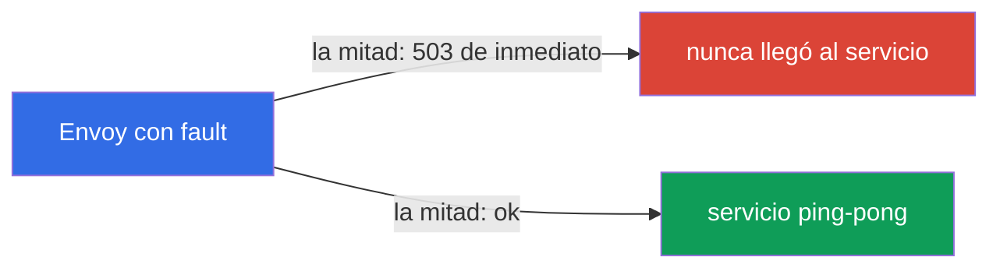
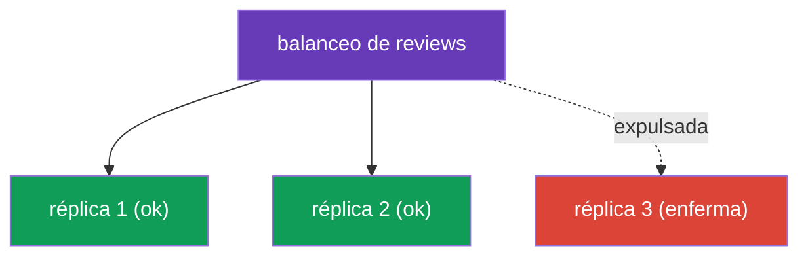

[RU version](ru.md) · [Eng version](en.md) · [Version française](fr.md) · [Deutsche Version](de.md)

# Capítulo 8. Resiliencia: fault injection, timeouts, reintentos, circuit breaking

> **Qué sigue.** La red no es fiable: los servicios se ralentizan, se reinician, devuelven
> errores. En este capítulo cubrimos cómo Istio hace que una aplicación sea resiliente a tales
> fallos, todo a nivel de infraestructura, sin cambiar código. Primero aprendemos a romper un
> servicio a propósito (fault injection) para probar la resiliencia, y luego a arreglarla:
> timeouts, reintentos y circuit breaking.

## 8.1. El problema: fallos y caídas en cascada

Cuando un servicio llama a otro por la red, las cosas pueden salir mal: el receptor se
ralentiza, devuelve 503 o no está disponible en absoluto. Si esto no se maneja, el problema se
propaga: un servicio lento retiene a quien lo llamó, las conexiones se acumulan ahí y, con el
tiempo, toda la cadena se cae. Esto se llama **fallo en cascada**.

Istio ofrece un conjunto de herramientas contra esto, y todas se configuran en recursos que ya
conoces:

| Herramienta | Dónde se configura | Qué hace |
|-------------|--------------------|----------|
| Fault injection | VirtualService | inyecta deliberadamente retrasos y errores para pruebas |
| Timeout | VirtualService | aborta una petición que tarda demasiado |
| Retry | VirtualService | repite una petición fallida |
| Circuit breaking | DestinationRule | limita la carga y corta las réplicas enfermas |

## 8.2. Fault injection: romper a propósito

Antes de defenderse de los fallos, hay que saber reproducirlos. La fault injection es la
introducción controlada de errores para comprobar cómo se comporta el sistema. Hay dos tipos.

La fault injection se configura en un **`VirtualService`** para el servicio que queremos
"romper" (en los ejemplos de abajo, `ping-pong`): en el campo `hosts` nombramos ese servicio, y
en `http.fault`, qué fallo inyectar.

**Delay**: simular un servicio lento:

```yaml
apiVersion: networking.istio.io/v1
kind: VirtualService
metadata:
  name: ping-pong
spec:
  hosts:
  - ping-pong               # a qué servicio se lo aplicamos
  http:
  - fault:
      delay:
        fixedDelay: 5s
        percentage:
          value: 100        # añade un retraso de 5s a todas las peticiones
    route:
    - destination:
        host: ping-pong
```

**Abort**: simular un error:

```yaml
apiVersion: networking.istio.io/v1
kind: VirtualService
metadata:
  name: ping-pong
spec:
  hosts:
  - ping-pong
  http:
  - fault:
      abort:
        httpStatus: 503
        percentage:
          value: 50         # devuelve 503 de inmediato para la mitad de las peticiones
    route:
    - destination:
        host: ping-pong
```



Un punto importante: con `abort` el error lo genera **el propio Envoy**, la petición ni siquiera
llega al servicio real. Esto es cómodo y seguro: pruebas la resiliencia del lado que llama sin
tocar código y sin romper realmente el servicio.

## 8.3. Timeout: abortar una petición larga

Si un servicio responde demasiado despacio, es mejor abortar la petición que esperar
eternamente y mantener una conexión ocupada. El timeout se define en un `VirtualService` para
el servicio destino (abajo solo se muestra el bloque `http`; la estructura completa es como en
el ejemplo de 8.2):

```yaml
http:
- timeout: 3s           # esperar una respuesta no más de 3 segundos
  route:
  - destination:
      host: reviews
```

Si `reviews` no respondió en 3 segundos, Envoy aborta la petición y devuelve un error (`504`) a
quien llama. Sin un timeout un único servicio lento puede "colgar" toda la cadena.

## 8.4. Retry: repetir una petición fallida

Muchos fallos son transitorios: un pod se reinició, hubo un fallo momentáneo de red. En esos
casos un simple reintento resuelve el problema. Los reintentos también se definen en un
`VirtualService` (abajo solo el bloque `http`):

```yaml
http:
- retries:
    attempts: 3               # hasta 3 intentos de reintento
    perTryTimeout: 2s         # timeout para cada intento
    retryOn: 5xx,connect-failure   # ante qué errores reintentar
  route:
  - destination:
      host: reviews
```


Desglosemos los campos:

- **`attempts`**: cuántas veces reintentar tras el primer fallo.
- **`perTryTimeout`**: el timeout para cada intento individual.
- **`retryOn`**: bajo qué condiciones reintentar: `5xx` (cualquier respuesta 5xx),
  `connect-failure`, `gateway-error`, `retriable-4xx` y otras, separadas por comas.

Los reintentos aumentan notablemente la fiabilidad. Matemática sencilla: si un servicio da
error el 50% de las veces, entonces con 3 reintentos la probabilidad de que fallen los 4
intentos es 0,5 elevado a la 4ª potencia = ~6%. Así que la tasa de éxito sube del 50% a ~94%, y
todo ello es invisible para la aplicación.

### Trampas de los reintentos

Los reintentos son potentes, pero tienen sutilezas que conviene recordar.

- **Istio ya reintenta por defecto.** Incluso sin un bloque `retries`, Istio aplica reintentos
  por defecto a las peticiones HTTP (normalmente `attempts: 2` ante fallos "seguros" como
  `connect-failure`, `refused-stream`, `unavailable`). Un `retries` explícito sobrescribe esto.
  Así que "no hay reintentos" es un mito; la única cuestión es si los ajustes son los tuyos o
  los de por defecto.
- **Solo se pueden reintentar operaciones idempotentes.** Repetir un `GET` es seguro. Pero
  repetir un `POST` que crea un pedido o cobra dinero se ejecutará dos veces al reintentar.
  Habilita los reintentos para peticiones no idempotentes de forma deliberada (o no los
  habilites en absoluto): es el mismo problema que con el mirroring del capítulo 6.
- **Cuidado con las tormentas de reintentos.** Si toda la cadena está fallando, cada capa
  empieza a reintentar, y la carga se multiplica, rematando a un servicio ya sobrecargado.
  Mantén `attempts` pequeño (2-3) y limita los reintentos concurrentes mediante
  `connectionPool.http.maxRetries` en el DestinationRule.
- **El timeout debe dar cabida a todos los intentos.** El `timeout` global de la petición cuenta
  a través de todos los reintentos a la vez. Si `timeout: 3s` mientras `perTryTimeout: 2s` con
  `attempts: 3`, no quedará tiempo para el segundo y el tercer intento. Alinea `timeout ≈
  attempts × perTryTimeout` (más algo de margen).

## 8.5. Dónde poner los reintentos: una sutileza importante

Los reintentos se configuran en el lado del servicio que **hace la petición** (el cliente), no
en el lado del servicio que responde con un error. La razón es simple: el reintento lo hace el
Envoy que hace la llamada saliente.

Recuerda el ejemplo del laboratorio 03: `frontend` llama a `ping-pong`, y `ping-pong` tiene la
fault injection habilitada (50% de errores). Los reintentos deben definirse en el
VirtualService de `frontend`: entonces su Envoy repetirá las llamadas salientes a `ping-pong`.

Definir los reintentos en el VirtualService de `ping-pong` sería inútil: ahí es donde está la
fault injection, y Envoy reintentaría el error que él mismo generó, un bucle sin fin sin
sentido.

Puedes verificar que los reintentos realmente ocurren desde las métricas de Envoy del pod que
llama:

```bash
kubectl exec -it <frontend-pod> -c istio-proxy -- \
  pilot-agent request GET stats | grep upstream_rq_retry
```

## 8.6. Circuit breaking: el pool de conexiones

Los reintentos y los timeouts trabajan con una petición individual. El circuit breaking trabaja
a nivel de servicio: limita cuántas peticiones y conexiones se pueden enviar a un receptor. Se
configura en un DestinationRule mediante `connectionPool`.

```yaml
apiVersion: networking.istio.io/v1
kind: DestinationRule
metadata:
  name: reviews-dr
spec:
  host: reviews
  trafficPolicy:
    connectionPool:
      tcp:
        maxConnections: 100          # máximo de conexiones TCP
      http:
        http1MaxPendingRequests: 10  # máximo de peticiones en cola
        maxRequestsPerConnection: 10
```

La idea es evitar "desbordar" un servicio sobrecargado. Cuando se superan los límites, Envoy
rechaza de inmediato las peticiones extra (`503`) en lugar de encolarlas sin fin. Esto le da al
servicio una oportunidad de recuperarse, y a quien llama una respuesta rápida (aunque sea un
error) en lugar de quedarse colgado. Mejor fallar rápido que morir despacio a lo largo de toda
la cadena.

Campos útiles de `connectionPool`:

- `tcp.maxConnections`: el tope de conexiones TCP al servicio;
- `http.http1MaxPendingRequests`: cuántas peticiones pueden esperar en la cola;
- `http.http2MaxRequests`: el máximo de peticiones concurrentes (relevante para HTTP/2 y gRPC,
  donde todo va por una única conexión, capítulo 10);
- `http.maxRequestsPerConnection`: tras cuántas peticiones reabrir la conexión;
- `http.maxRetries`: el tope de reintentos concurrentes a todo el servicio (protección contra
  las tormentas de reintentos);
- `tcp.connectTimeout` / `http.idleTimeout`: los timeouts de establecimiento de conexión y de
  inactividad.

## 8.7. Outlier detection: cortar las réplicas enfermas

La segunda parte del circuit breaking es `outlierDetection`. Observa las réplicas individuales
y expulsa temporalmente del balanceo de carga a las que están lanzando errores.

```yaml
  trafficPolicy:
    outlierDetection:
      consecutive5xxErrors: 5    # 5 errores 5xx consecutivos
      interval: 10s              # cada cuánto comprobar
      baseEjectionTime: 30s      # durante cuánto expulsar la réplica
      maxEjectionPercent: 50     # pero no más del 50% de las réplicas a la vez
```



La lógica: si una réplica devuelve `consecutive5xxErrors` errores seguidos, Envoy la retira del
pool durante `baseEjectionTime` y envía tráfico solo a las sanas. Pasado ese tiempo la réplica
se reincorpora y se comprueba de nuevo. `maxEjectionPercent` impide expulsar demasiadas réplicas
a la vez, para no quedarse sin ninguna operativa.

Por separado, recuerda el capítulo 7: es exactamente `outlierDetection` lo que hace falta para
el failover por localidad; sin él Istio no entiende que las réplicas de una zona están enfermas
y no cambia el tráfico.

### Cómo se combina esto con las probes de liveness/readiness

La outlier detection es fácil de confundir con las probes de Kubernetes, pero son mecanismos
distintos en niveles distintos, y se complementan mutuamente.

| | Probes de readiness / liveness | Outlier detection |
|---|---|---|
| Quién comprueba | kubelet en el nodo | el Envoy del pod que llama |
| Cómo | sondea **activamente** el endpoint de salud del pod | observa **pasivamente** las respuestas reales (5xx, timeouts, resets) |
| Basado en qué | lo que la aplicación reporta sobre sí misma | lo que realmente volvió en peticiones reales |
| Alcance | global: readiness quita el pod de Endpoints, nadie lo ve | local: cada Envoy que llama decide por sí mismo |
| Velocidad | periodo de la probe + propagación de Endpoints | de inmediato, ante el hecho de los errores |
| Acción | readiness: quitar de Endpoints; liveness: reiniciar el contenedor | expulsar temporalmente el endpoint de su propio pool |

Cómo trabajan juntas:

- **Readiness** es la primera línea: si el pod se declara no listo, kubelet lo quita de los
  Endpoints del Service, istiod deja de anunciarlo como endpoint, y no le va tráfico en
  absoluto; la outlier detection ni siquiera lo "ve".
- **Liveness**: si el contenedor se cuelga, kubelet lo reinicia; durante el reinicio el pod
  falla la readiness de todos modos y sale de Endpoints.
- **Outlier detection** cubre lo que las probes pasan por alto: el pod **pasa la readiness**
  (dice "estoy sano") pero en realidad lanza errores, por ejemplo, a causa de una dependencia
  fallida o un bug que el endpoint de salud no detecta. Envoy ve los 5xx reales y expulsa
  temporalmente esa réplica del balanceo, sin esperar a que la aplicación lo "admita".

La conclusión práctica: las probes y la outlier detection no se sustituyen sino que se
**complementan** mutuamente. Readiness/liveness es "¿estoy sano según mi propia evaluación?",
mientras que la outlier detection es "¿cómo respondo realmente al tráfico real?". Para la
tolerancia a fallos (y para el failover por localidad del capítulo 7) necesitas ambas: probes
correctas **más** `outlierDetection`.

> Un matiz de Istio: para un pod en la malla la probe de readiness de la aplicación se fusiona
> con la readiness del propio sidecar (`istio-proxy`, puerto `15021`). Si el sidecar no está
> listo, el pod tampoco lo está y sale de Endpoints (ver capítulo 4).

## 8.8. Buenas prácticas

- **Estratifica tus defensas.** Timeout + reintentos + circuit breaking trabajan juntos: el
  timeout evita que las cosas se cuelguen, los reintentos ocultan fallos transitorios, el
  circuit breaking protege un servicio sobrecargado. Cada uno es más débil por separado.
- **Pon timeouts en todas partes.** Por defecto Istio no tiene timeout de petición; una
  petición puede esperar indefinidamente. Pon un `timeout` razonable en cada llamada, de lo
  contrario un único servicio lento colgará toda la cadena.
- **Reintenta solo lo idempotente.** `GET`: sí; `POST`/`PUT` con efectos secundarios: solo si
  la operación es idempotente (o mediante una clave de idempotencia en el lado de la
  aplicación).
- **`attempts` pequeño + `maxRetries`.** 2-3 intentos bastan; limita los reintentos
  concurrentes mediante `connectionPool.http.maxRetries` para no provocar una tormenta de
  reintentos.
- **Alinea el timeout y los reintentos.** El `timeout` global debe dar cabida a `attempts ×
  perTryTimeout`, de lo contrario algunos intentos no tendrán tiempo de ejecutarse.
- **Circuit breaking: de forma conservadora y por carga.** Fija los límites de `connectionPool`
  a la capacidad real del servicio; mejor devolver un 503 rápido que acumular una cola.
- **`outlierDetection` con `maxEjectionPercent`.** Expulsa las réplicas enfermas, pero no todas
  a la vez; de lo contrario Envoy entra en modo pánico (capítulo 7) y empieza a enviar tráfico
  a todas de nuevo.
- **Valida la resiliencia con fault injection.** No confíes en que la configuración de
  resiliencia funciona hasta que hayas roto el servicio a propósito (`delay`/`abort`) y hayas
  visto que los reintentos, timeouts y breakers realmente se activan.

## 8.9. Resumen del capítulo

- Una red no fiable lleva a fallos en cascada; Istio protege contra ellos a nivel de
  infraestructura.
- **Fault injection** (`fault.delay`, `fault.abort`) en un VirtualService inyecta
  deliberadamente retrasos y errores para probar la resiliencia; el error lo genera el propio
  Envoy.
- **Timeout** en un VirtualService aborta una petición que tarda demasiado (devuelve 504).
- **Retry** en un VirtualService repite una petición fallida (`attempts`, `perTryTimeout`,
  `retryOn`); aumenta notablemente la fiabilidad.
- Los reintentos se configuran en el lado del servicio cliente (que hace la petición), no en el
  lado del servicio que responde con un error.
- Trampas de los reintentos: Istio reintenta por defecto (attempts 2), solo lo idempotente es
  seguro de reintentar, el riesgo de una tormenta de reintentos (limita `attempts` y
  `maxRetries`), el `timeout` global debe dar cabida a todos los intentos.
- **Circuit breaking** en un DestinationRule: `connectionPool` limita la carga,
  `outlierDetection` expulsa las réplicas enfermas.
- `outlierDetection` también es obligatorio para el failover por localidad (capítulo 7).
- La outlier detection (comprobación pasiva de Envoy basada en respuestas reales) y las probes
  de kubelet (una comprobación activa del endpoint de salud) se complementan: las probes quitan
  el pod de Endpoints globalmente, la outlier detection detecta una réplica que pasa la
  readiness pero en realidad responde con errores.

## 8.10. Preguntas de autoevaluación

1. ¿Qué es un fallo en cascada y cómo ayuda Istio a prevenirlo?
2. ¿En qué se diferencia `fault.delay` de `fault.abort`? ¿Quién genera el error en el abort?
3. ¿En qué recurso se definen los timeouts y los reintentos?
4. ¿Por qué los reintentos se configuran en el lado del servicio cliente (que hace la
   petición), no en el lado del servicio que responde con un error?
5. ¿De qué se ocupan `connectionPool` y `outlierDetection` en el circuit breaking?
6. ¿Cuál es la conexión entre `outlierDetection` y el failover por localidad del capítulo 7?
7. ¿Por qué es peligroso reintentar peticiones POST? ¿Qué es una tormenta de reintentos y cómo
   se limita?
8. ¿Qué ocurre si `timeout` es menor que `attempts × perTryTimeout`? ¿Tiene Istio reintentos
   por defecto?
9. ¿En qué se diferencia `outlierDetection` de las probes de readiness/liveness, y cómo se
   complementan? ¿Qué caso detecta la outlier detection que la readiness no?

## Práctica

Practica la fault injection y los reintentos (rompe el backend y arréglalo con reintentos):

🧪 Laboratorio 03: [tasks/ica/labs/03](../../labs/03/README_ES.MD)

Practica los timeouts y el circuit breaking:

🧪 Laboratorio 10: [tasks/ica/labs/10](../../labs/10/README_ES.MD)

---
[Índice](../README_ES.md) · [Capítulo 7](../07/es.md) · [Capítulo 9](../09/es.md)
