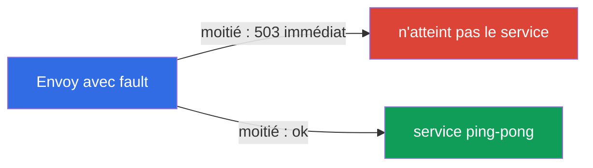
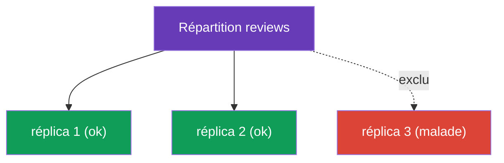

[RU version](ru.md) · [Eng version](en.md) · [Versión en español](es.md) · [Deutsche Version](de.md)

# Chapitre 8. Résilience : fault injection, timeouts, retries, circuit breaking

> **Ce qui suit.** Le réseau n'est pas fiable : les services ralentissent, redémarrent,
> renvoient des erreurs. Dans ce chapitre, nous verrons comment Istio rend une application
> résiliente à de telles pannes - et le tout au niveau de l'infrastructure, sans modifier
> le code. D'abord, nous apprendrons à casser volontairement un service (fault injection),
> pour vérifier la résilience, puis à réparer : timeouts, retries et circuit breaking.

## 8.1. Le problème : pannes et défaillances en cascade

Quand un service s'adresse à un autre par le réseau, tout peut mal tourner : le
destinataire ralentit, renvoie un 503 ou est carrément indisponible. Si l'on ne gère pas
cela, le mal se propage : un service lent retarde l'appelant, chez qui les connexions
s'accumulent, et au bout du compte toute la chaîne tombe. C'est ce qu'on appelle une
**défaillance en cascade** (cascading failure).

Istio fournit un ensemble d'outils contre cela, et ils se configurent tous dans des
ressources déjà connues :

| Outil | Où il se configure | Ce qu'il fait |
|------------|-------------------|------------|
| Fault injection | VirtualService | introduit volontairement des délais et des erreurs pour le test |
| Timeout | VirtualService | interrompt une requête trop longue |
| Retry | VirtualService | répète une requête échouée |
| Circuit breaking | DestinationRule | limite la charge et écarte les réplicas malades |

## 8.2. Fault injection : casser volontairement

Avant de se protéger des pannes, il faut savoir les reproduire. La fault injection est
l'introduction contrôlée d'erreurs, pour vérifier comment le système se comportera. Il en
existe deux types.

La fault injection se définit dans le **`VirtualService`** du service que l'on veut
« casser » (dans les exemples ci-dessous - `ping-pong`) : dans le champ `hosts` on indique
ce service, et dans `http.fault` - quelle panne introduire.

**Délai (delay)** - on simule un service lent :

```yaml
apiVersion: networking.istio.io/v1
kind: VirtualService
metadata:
  name: ping-pong
spec:
  hosts:
  - ping-pong               # à quel service on l'applique
  http:
  - fault:
      delay:
        fixedDelay: 5s
        percentage:
          value: 100        # ajouter 5s de délai à toutes les requêtes
    route:
    - destination:
        host: ping-pong
```

**Interruption (abort)** - on simule une erreur :

```yaml
apiVersion: networking.istio.io/v1
kind: VirtualService
metadata:
  name: ping-pong
spec:
  hosts:
  - ping-pong
  http:
  - fault:
      abort:
        httpStatus: 503
        percentage:
          value: 50         # renvoyer immédiatement 503 à la moitié des requêtes
    route:
    - destination:
        host: ping-pong
```



Point important : lors d'un `abort`, l'erreur est générée par **Envoy lui-même**, la
requête n'atteint même pas le vrai service. C'est pratique et sûr : vous testez la
résilience du côté appelant, sans toucher au code ni casser réellement le service lui-même.

## 8.3. Timeout : interrompre une requête longue

Si un service répond trop lentement, mieux vaut interrompre la requête que d'attendre
indéfiniment et de garder une connexion occupée. Le timeout se définit dans le
`VirtualService` du service voulu (ci-dessous n'est montré que le bloc `http`, la structure
complète est comme dans l'exemple de 8.2) :

```yaml
http:
- timeout: 3s           # on attend la réponse au plus 3 secondes
  route:
  - destination:
      host: reviews
```

Si `reviews` n'a pas répondu en 3 secondes, Envoy interrompt la requête et renvoie une
erreur à l'appelant (`504`). Sans timeout, un seul service lent peut « suspendre » toute la
chaîne.

## 8.4. Retry : répéter une requête échouée

Beaucoup de pannes sont temporaires : un pod a redémarré, il y a eu un problème réseau d'une
seconde. Dans ces cas, une simple répétition de la requête résout le problème. Les retries
se définissent eux aussi dans le `VirtualService` (ci-dessous - seulement le bloc `http`) :

```yaml
http:
- retries:
    attempts: 3               # jusqu'à 3 nouvelles tentatives
    perTryTimeout: 2s         # timeout de chaque tentative
    retryOn: 5xx,connect-failure   # sur quelles erreurs réessayer
  route:
  - destination:
      host: reviews
```


Détaillons les champs :

- **`attempts`** - combien de fois réessayer après le premier échec.
- **`perTryTimeout`** - le timeout de chaque tentative individuelle.
- **`retryOn`** - dans quelles conditions réessayer : `5xx` (toute réponse 5xx),
  `connect-failure`, `gateway-error`, `retriable-4xx` et d'autres, séparés par des virgules.

Les retries améliorent nettement la fiabilité. Un calcul simple : si un service échoue dans
50 % des cas, alors avec 3 retries la probabilité que les 4 tentatives échouent toutes vaut
0,5 puissance 4 = ~6 %. Autrement dit, le succès grimpe de 50 % à ~94 %, et tout cela de
façon invisible pour l'application.

### Pièges des retries

Les retries sont puissants, mais ils ont des subtilités qu'il importe de garder en tête.

- **Istio retry déjà par défaut.** Même sans bloc `retries`, Istio applique aux requêtes
  HTTP des retries par défaut (généralement `attempts: 2` sur des pannes « sûres » comme
  `connect-failure`, `refused-stream`, `unavailable`). Un `retries` explicite remplace
  cela. Autrement dit, « il n'y a pas de retries » est un mythe ; la seule question est de
  savoir si vous avez vos propres réglages ou ceux par défaut.
- **On ne peut réessayer que des opérations idempotentes.** Répéter un `GET` est sûr. Mais
  répéter un `POST` qui crée une commande ou débite de l'argent s'exécutera deux fois en
  cas de retry. Activez les retries pour les requêtes non idempotentes de manière réfléchie
  (ou pas du tout) - c'est le même problème qu'avec le mirroring du chapitre 6.
- **Attention au retry storm (avalanche de retries).** Si toute la chaîne échoue, chaque
  couche se met à réessayer - et la charge se multiplie, achevant un service déjà
  surchargé. Gardez `attempts` petit (2-3) et limitez les retries simultanés via
  `connectionPool.http.maxRetries` dans la DestinationRule.
- **Le timeout doit contenir toutes les tentatives.** Le `timeout` global de la requête se
  décompte pour tous les retries à la fois. Si `timeout: 3s` et `perTryTimeout: 2s` avec
  `attempts: 3`, alors il ne restera plus de temps pour la deuxième et la troisième
  tentative. Accordez `timeout ≈ attempts × perTryTimeout` (plus une marge).

## 8.5. Où placer les retries : une subtilité importante

Les retries se configurent du côté du service qui **fait la requête** (le client), et non
du côté du service qui répond par une erreur. La raison est simple : c'est l'Envoy qui fait
l'appel sortant qui répète la requête.

Rappelez-vous l'exemple du lab 03 : `frontend` s'adresse à `ping-pong`, et sur `ping-pong`
la fault injection est activée (50 % d'erreurs). Les retries doivent être placés dans le
VirtualService de `frontend` - ainsi son Envoy répétera les appels sortants vers
`ping-pong`.

Placer les retries dans le VirtualService de `ping-pong` n'aurait aucun sens : c'est là que
siège la fault injection elle-même, et Envoy répéterait l'erreur qu'il a lui-même générée -
une boucle infinie et absurde.

On peut vérifier que les retries ont réellement lieu grâce aux métriques de l'Envoy du pod
appelant :

```bash
kubectl exec -it <frontend-pod> -c istio-proxy -- \
  pilot-agent request GET stats | grep upstream_rq_retry
```

## 8.6. Circuit breaking : le pool de connexions

Les retries et les timeouts travaillent sur une requête individuelle. Le circuit breaking
(disjoncteur) travaille au niveau du service : il limite le nombre de requêtes et de
connexions autorisé à envoyer au destinataire. Il se configure dans la DestinationRule via
`connectionPool`.

```yaml
apiVersion: networking.istio.io/v1
kind: DestinationRule
metadata:
  name: reviews-dr
spec:
  host: reviews
  trafficPolicy:
    connectionPool:
      tcp:
        maxConnections: 100          # maximum de connexions TCP
      http:
        http1MaxPendingRequests: 10  # maximum de requêtes en file d'attente
        maxRequestsPerConnection: 10
```

L'idée est de ne pas « écrouler » un service surchargé. Quand les limites sont dépassées,
Envoy rejette immédiatement les requêtes en trop (`503`), sans les mettre dans une file
d'attente infinie. Cela donne au service une chance de se dégager, et à l'appelant - une
réponse rapide (même si c'est une erreur) au lieu d'un blocage. Mieux vaut refuser vite que
mourir lentement avec toute la chaîne.

Champs utiles de `connectionPool` :

- `tcp.maxConnections` - plafond des connexions TCP vers le service ;
- `http.http1MaxPendingRequests` - combien de requêtes peuvent attendre dans la file ;
- `http.http2MaxRequests` - maximum de requêtes simultanées (pertinent pour HTTP/2 et gRPC,
  où tout passe par une seule connexion - chapitre 10) ;
- `http.maxRequestsPerConnection` - après combien de requêtes rouvrir la connexion ;
- `http.maxRetries` - plafond des retries simultanés vers l'ensemble du service (protection
  contre le retry storm) ;
- `tcp.connectTimeout` / `http.idleTimeout` - timeouts d'établissement et d'inactivité de
  la connexion.

## 8.7. Outlier detection : écarter les réplicas malades

La deuxième partie du circuit breaking est `outlierDetection`. Elle surveille les réplicas
individuels et exclut temporairement de la répartition ceux qui crachent des erreurs.

```yaml
  trafficPolicy:
    outlierDetection:
      consecutive5xxErrors: 5    # 5 erreurs 5xx d'affilée
      interval: 10s              # à quelle fréquence vérifier
      baseEjectionTime: 30s      # pour combien de temps exclure le réplica
      maxEjectionPercent: 50     # mais pas plus de 50% des réplicas à la fois
```



La logique : si un réplica a produit `consecutive5xxErrors` erreurs d'affilée, Envoy le
retire du pool pour `baseEjectionTime` et n'envoie le trafic que vers les sains. Passé ce
délai, le réplica est réintégré et vérifié de nouveau. `maxEjectionPercent` empêche
d'exclure trop de réplicas à la fois, pour ne pas se retrouver sans réplicas fonctionnels.

Rappelez-vous à part le chapitre 7 : c'est justement `outlierDetection` qui est nécessaire
pour le locality failover - sans lui, Istio ne comprend pas que les réplicas d'une zone
sont malades, et ne bascule pas le trafic.

### Comment cela s'articule avec les liveness/readiness probes

Il est facile de confondre l'outlier detection avec les probes de Kubernetes, mais ce sont
des mécanismes différents à des niveaux différents - et ils se complètent mutuellement.

| | Readiness / Liveness probes | Outlier detection |
|---|---|---|
| Qui vérifie | kubelet sur le nœud | Envoy du pod appelant |
| Comment | interroge **activement** l'endpoint de santé du pod | observe **passivement** les vraies réponses (5xx, timeouts, ruptures) |
| Sur quelle base | ce que l'application déclare elle-même sur elle | ce qui est réellement revenu sur les requêtes de production |
| Portée | globale : la readiness retire le pod des Endpoints - personne ne le voit | locale : chaque Envoy appelant décide pour lui-même |
| Rapidité | période de la probe + propagation des Endpoints | immédiate, dès les erreurs constatées |
| Action | readiness - retirer des Endpoints ; liveness - redémarrer le conteneur | exclure temporairement l'endpoint de son propre pool |

Comment ils travaillent ensemble :

- **Readiness** - première ligne : si un pod s'est lui-même déclaré non prêt, kubelet le
  retire des Endpoints du service, istiod cesse de le diffuser comme endpoint, et le trafic
  n'y va plus du tout - l'outlier detection ne le « voit » même pas.
- **Liveness** - si un conteneur se fige, kubelet le redémarre ; pendant le redémarrage, le
  pod échoue de toute façon à la readiness et sort des Endpoints.
- **Outlier detection** couvre ce que les probes laissent passer : un pod **passe la
  readiness** (dit « je suis sain »), mais crache en réalité des erreurs - par exemple, à
  cause d'une dépendance tombée ou d'un bug que l'endpoint de santé n'attrape pas. Envoy
  voit les vrais 5xx et exclut temporairement un tel réplica de la répartition, sans
  attendre que l'application « avoue ».

Conclusion pratique : probes et outlier detection ne se remplacent pas, ils se
**complètent**. La readiness/liveness, c'est « suis-je sain selon ma propre évaluation »,
et l'outlier detection, c'est « et comment est-ce que je réponds réellement au trafic de
production ». Pour la tolérance aux pannes (et pour le locality failover du chapitre 7), il
faut les deux : des probes correctes **plus** `outlierDetection`.

> Nuance Istio : pour un pod dans le mesh, la readiness-probe de l'application est combinée
> avec la disponibilité du sidecar lui-même (`istio-proxy`, port `15021`). Si le sidecar
> n'est pas prêt, le pod ne l'est pas non plus et sort des Endpoints (voir chapitre 4).

## 8.8. Bonnes pratiques

- **Superposez les protections.** Timeout + retries + circuit breaking fonctionnent
  ensemble : le timeout empêche de rester suspendu, les retries masquent les pannes
  temporaires, le circuit breaking protège un service surchargé. Séparément, chacun est
  plus faible.
- **Mettez des timeouts partout.** Par défaut, Istio n'a pas de timeout de requête - une
  requête peut attendre indéfiniment. Fixez un `timeout` raisonnable sur chaque appel,
  sinon un seul service lent suspendra toute la chaîne.
- **Ne réessayez que l'idempotent.** `GET` - oui ; `POST`/`PUT` à effets de bord - seulement
  si l'opération est idempotente (ou via une clé d'idempotence côté application).
- **Un `attempts` petit + `maxRetries`.** 2-3 tentatives suffisent ; limitez les retries
  simultanés via `connectionPool.http.maxRetries`, pour ne pas provoquer de retry storm.
- **Accordez timeout et retries.** Le `timeout` global doit contenir `attempts ×
  perTryTimeout`, sinon une partie des tentatives n'aura pas le temps de s'exécuter.
- **Circuit breaking - de façon conservatrice et selon la charge.** Ajustez les limites de
  `connectionPool` à la capacité réelle du service ; mieux vaut renvoyer vite un 503 que
  d'accumuler une file.
- **`outlierDetection` avec `maxEjectionPercent`.** Excluez les réplicas malades, mais pas
  tous à la fois - sinon Envoy passera en panic mode (chapitre 7) et recommencera à envoyer
  du trafic vers tous.
- **Vérifiez la résilience par fault injection.** Ne croyez pas qu'une config de resilience
  fonctionne tant que vous n'avez pas cassé le service volontairement (`delay`/`abort`) et
  vu que les retries, timeouts et disjoncteurs jouent réellement leur rôle.

## 8.9. Résumé du chapitre

- Un réseau peu fiable mène à des défaillances en cascade ; Istio en protège au niveau de
  l'infrastructure.
- La **fault injection** (`fault.delay`, `fault.abort`) dans le VirtualService introduit
  volontairement des délais et des erreurs pour vérifier la résilience ; l'erreur est
  générée par Envoy lui-même.
- Le **Timeout** dans le VirtualService interrompt une requête trop longue (renvoie 504).
- Le **Retry** dans le VirtualService répète une requête échouée (`attempts`,
  `perTryTimeout`, `retryOn`) ; améliore nettement la fiabilité.
- Les retries se configurent du côté du service-client (celui qui fait la requête), et non
  du côté du service qui répond par une erreur.
- Pièges des retries : Istio retry par défaut (attempts 2), on ne peut réessayer sans
  risque que l'idempotent, risque de retry storm (limiter `attempts` et `maxRetries`), le
  `timeout` global doit contenir toutes les tentatives.
- **Circuit breaking** dans la DestinationRule : `connectionPool` limite la charge,
  `outlierDetection` exclut les réplicas malades.
- `outlierDetection` est aussi nécessaire au locality failover (chapitre 7).
- L'outlier detection (vérification passive d'Envoy sur les vraies réponses) et les probes
  du kubelet (vérification active de l'endpoint de santé) se complètent : les probes
  retirent le pod des Endpoints globalement, l'outlier detection attrape un réplica qui
  passe la readiness mais répond en réalité par des erreurs.

## 8.10. Questions d'auto-évaluation

1. Qu'est-ce qu'une défaillance en cascade et comment Istio aide-t-il à la prévenir ?
2. En quoi `fault.delay` diffère-t-il de `fault.abort` ? Qui génère l'erreur lors d'un
   abort ?
3. Dans quelle ressource se définissent les timeouts et les retries ?
4. Pourquoi les retries se configurent-ils du côté du service-client (celui qui fait la
   requête), et non du côté du service qui répond par une erreur ?
5. De quoi sont responsables `connectionPool` et `outlierDetection` dans le circuit
   breaking ?
6. Quel est le lien entre `outlierDetection` et le locality failover du chapitre 7 ?
7. Pourquoi est-il dangereux de réessayer des requêtes POST ? Qu'est-ce qu'un retry storm
   et avec quoi le limite-t-on ?
8. Que se passe-t-il si `timeout` est inférieur à `attempts × perTryTimeout` ? Istio a-t-il
   des retries par défaut ?
9. En quoi `outlierDetection` diffère-t-il des readiness/liveness probes et comment se
   complètent-ils ? Quel cas l'outlier detection attrape-t-il, alors que la readiness -
   non ?

## Pratique

Entraînez-vous à la fault injection et aux retries (casser le backend et le réparer par des
retries) :

🧪 Lab 03 : [tasks/ica/labs/03](../../labs/03/README_FR.MD)

Entraînez-vous aux timeouts et au circuit breaking :

🧪 Lab 10 : [tasks/ica/labs/10](../../labs/10/README_FR.MD)

---
[Table des matières](../README_FR.md) · [Chapitre 7](../07/fr.md) · [Chapitre 9](../09/fr.md)
