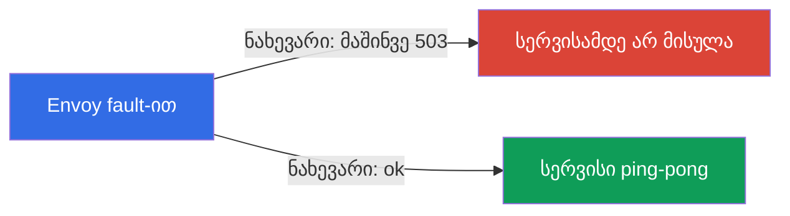
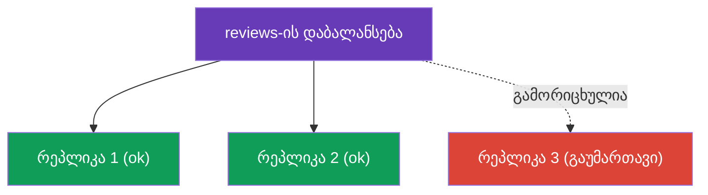

[Русская версия](ru.md) · [Eng version](en.md) · [Versión en español](es.md) · [Version française](fr.md) · [Deutsche Version](de.md) · [繁體中文版](tw.md) · [日本語版](jp.md)

# თავი 8. მდგრადობა: fault injection, timeouts, retries, circuit breaking

> **რა არის შემდეგ.** ქსელი არასაიმედოა: სერვისები ნელდება, იტვირთება ხელახლა და
> შეცდომებს აბრუნებს. ამ თავში განვიხილავთ, როგორ ხდის Istio აპლიკაციას ასეთი
> შეფერხებებისადმი მდგრადს - თანაც ყველაფერს ინფრასტრუქტურის დონეზე, კოდის შეცვლის
> გარეშე. ჯერ ვისწავლით სერვისის განზრახ გაფუჭებას (fault injection), რათა მდგრადობა
> შევამოწმოთ, შემდეგ კი მის გამოსწორებას: ტაიმაუტებით, განმეორებითი მცდელობებითა და
> circuit breaking-ით.

## 8.1. პრობლემა: შეფერხებები და კასკადური მარცხები

როდესაც ერთი სერვისი მეორეს ქსელის გავლით მიმართავს, ყველაფერი შეიძლება არასწორად
წარიმართოს: მიმღები ნელდება, აბრუნებს 503-ს ან საერთოდ მიუწვდომელია. თუ ეს არ
დამუშავდა, პრობლემა ვრცელდება: ნელი სერვისი აყოვნებს გამომძახებელს, მასთან გროვდება
კავშირები და საბოლოოდ მთელი ჯაჭვი ითიშება. ამას **კასკადურ მარცხს** (cascading
failure) უწოდებენ.

Istio ამის საწინააღმდეგო ინსტრუმენტების ნაკრებს გვთავაზობს და ყველა მათგანი უკვე
ნაცნობ რესურსებში კონფიგურირდება:

| ინსტრუმენტი | სად კონფიგურირდება | რას აკეთებს |
|------------|-------------------|------------|
| Fault injection | VirtualService | ტესტირებისთვის განზრახ ამატებს დაყოვნებებსა და შეცდომებს |
| Timeout | VirtualService | წყვეტს ზედმეტად ხანგრძლივ მოთხოვნას |
| Retry | VirtualService | ხელახლა აგზავნის წარუმატებელ მოთხოვნას |
| Circuit breaking | DestinationRule | ზღუდავს დატვირთვას და გამორიცხავს გაუმართავ რეპლიკებს |

## 8.2. Fault injection: განზრახ ვაფუჭებთ

სანამ შეფერხებებისგან დაცვას დავიწყებთ, მათი გამეორება უნდა შეგვეძლოს. Fault
injection არის შეცდომების კონტროლირებადი შეტანა იმის შესამოწმებლად, თუ როგორ მოიქცევა
სისტემა. არსებობს ორი სახეობა.

Fault injection მიეთითება **`VirtualService`**-ში იმ სერვისისთვის, რომლის
„გაფუჭებაც“ გვინდა (ქვემოთ მოცემულ მაგალითებში - `ping-pong`): `hosts` ველში
ვუთითებთ ამ სერვისს, ხოლო `http.fault`-ში - რა ტიპის შეფერხება უნდა შევიტანოთ.

**დაყოვნება (delay)** - ვბაძავთ ნელ სერვისს:

```yaml
apiVersion: networking.istio.io/v1
kind: VirtualService
metadata:
  name: ping-pong
spec:
  hosts:
  - ping-pong               # რომელ სერვისზე ვიყენებთ
  http:
  - fault:
      delay:
        fixedDelay: 5s
        percentage:
          value: 100        # 5წმ დაყოვნების დამატება ყველა მოთხოვნას
    route:
    - destination:
        host: ping-pong
```

**შეწყვეტა (abort)** - ვბაძავთ შეცდომას:

```yaml
apiVersion: networking.istio.io/v1
kind: VirtualService
metadata:
  name: ping-pong
spec:
  hosts:
  - ping-pong
  http:
  - fault:
      abort:
        httpStatus: 503
        percentage:
          value: 50         # მოთხოვნების ნახევარს მაშინვე დავუბრუნოთ 503
    route:
    - destination:
        host: ping-pong
```



მნიშვნელოვანი დეტალი: `abort`-ის დროს შეცდომას **თავად Envoy** აგენერირებს და მოთხოვნა
რეალურ სერვისამდეც კი არ მიდის. ეს მოსახერხებელი და უსაფრთხოა: თქვენ ამოწმებთ
გამომძახებელი მხარის მდგრადობას ისე, რომ კოდს არ ეხებით და თავად სერვისს რეალურად არ
აფუჭებთ.

## 8.3. Timeout: ხანგრძლივ მოთხოვნას ვწყვეტთ

თუ სერვისი ზედმეტად დიდხანს პასუხობს, უმჯობესია მოთხოვნა შევწყვიტოთ, ვიდრე უსასრულოდ
ველოდოთ და კავშირი დაკავებული გვქონდეს. ტაიმაუტი საჭირო სერვისის `VirtualService`-ში
მიეთითება (ქვემოთ ნაჩვენებია მხოლოდ `http` ბლოკი, სრული სტრუქტურა კი ისეთივეა,
როგორიც 8.2-ის მაგალითში):

```yaml
http:
- timeout: 3s           # ველოდებით პასუხს არაუმეტეს 3 წამისა
  route:
  - destination:
      host: reviews
```

თუ `reviews` 3 წამში არ უპასუხებს, Envoy მოთხოვნას წყვეტს და გამომძახებელს შეცდომას
(`504`) უბრუნებს. ტაიმაუტის გარეშე ერთ ნელ სერვისს მთელი ჯაჭვის „დაკიდება“ შეუძლია.

## 8.4. Retry: წარუმატებელ მოთხოვნას ვიმეორებთ

ბევრი შეფერხება დროებითია: პოდი გადაიტვირთა ან წამიერი ქსელური პრობლემა წარმოიშვა.
ასეთ შემთხვევებში მოთხოვნის უბრალო გამეორება პრობლემას აგვარებს. განმეორებითი
მცდელობებიც `VirtualService`-ში მიეთითება (ქვემოთ მხოლოდ `http` ბლოკია):

```yaml
http:
- retries:
    attempts: 3               # 3 განმეორებით ცდამდე
    perTryTimeout: 2s         # ტაიმაუტი თითოეულ ცდაზე
    retryOn: 5xx,connect-failure   # რომელ შეცდომებზე გავიმეოროთ
  route:
  - destination:
      host: reviews
```


განვიხილოთ ველები:

- **`attempts`** - რამდენჯერ უნდა განმეორდეს მოთხოვნა პირველი წარუმატებლობის შემდეგ.
- **`perTryTimeout`** - თითოეული ცალკეული მცდელობის ტაიმაუტი.
- **`retryOn`** - რა პირობებში უნდა განმეორდეს მოთხოვნა: `5xx` (ნებისმიერი 5xx პასუხი),
  `connect-failure`, `gateway-error`, `retriable-4xx` და სხვა, მძიმით გამოყოფილი.

განმეორებითი მცდელობები საიმედოობას მნიშვნელოვნად ზრდის. მარტივი მათემატიკა: თუ
სერვისი შემთხვევების 50%-ში შეცდომას უშვებს, 3 განმეორებითი მცდელობისას ოთხივე
მცდელობის წარუმატებლობის ალბათობა იქნება 0.5 მეოთხე ხარისხში = ~6%. ანუ წარმატების
მაჩვენებელი 50%-დან ~94%-მდე იზრდება და ეს ყველაფერი აპლიკაციისთვის შეუმჩნევლად
ხდება.

### განმეორებითი მცდელობების სირთულეები

განმეორებითი მცდელობები მძლავრი მექანიზმია, თუმცა მათ აქვს თავისებურებები, რომლებიც
უნდა გახსოვდეთ.

- **Istio ნაგულისხმევად უკვე იმეორებს მოთხოვნებს.** `retries` ბლოკის გარეშეც კი Istio
  HTTP მოთხოვნებზე ნაგულისხმევ განმეორებით მცდელობებს იყენებს (როგორც წესი,
  `attempts: 2` „უსაფრთხო“ შეფერხებებისთვის, როგორიცაა `connect-failure`,
  `refused-stream`, `unavailable`). ცხადად მითითებული `retries` ამ პარამეტრებს
  გადაფარავს. ამიტომ „განმეორებითი მცდელობები არ არის“ - მითია; საკითხავია მხოლოდ,
  თქვენი პარამეტრები გამოიყენება თუ ნაგულისხმევი.
- **მხოლოდ იდემპოტენტური ოპერაციების გამეორებაა დასაშვები.** `GET`-ის გამეორება
  უსაფრთხოა. მაგრამ `POST`, რომელიც შეკვეთას ქმნის ან თანხას ჩამოჭრის, განმეორებითი
  მცდელობისას ორჯერ შესრულდება. არაიდემპოტენტური მოთხოვნებისთვის განმეორებითი
  მცდელობები გააზრებულად ჩართეთ (ან საერთოდ არ ჩართოთ) - ეს იგივე პრობლემაა, რაც მე-6
  თავში განხილული სარკისებური ასახვისას.
- **ფრთხილად იყავით retry storm-თან (განმეორებითი მცდელობების ზვავი).** თუ მთელი
  ჯაჭვი შეცდომას უშვებს, თითოეული შრე მოთხოვნების გამეორებას იწყებს - დატვირთვა
  მრავლდება და ისედაც გადატვირთულ სერვისს საბოლოოდ თიშავს. `attempts` მცირე დატოვეთ
  (2-3) და ერთდროული განმეორებითი მცდელობები DestinationRule-ში
  `connectionPool.http.maxRetries`-ით შეზღუდეთ.
- **ტაიმაუტი ყველა მცდელობას უნდა იტევდეს.** მოთხოვნის საერთო `timeout` ყველა
  განმეორებითი მცდელობისთვის ერთად ითვლება. თუ მითითებულია `timeout: 3s`, ხოლო
  `perTryTimeout: 2s` და `attempts: 3`, მეორე და მესამე მცდელობისთვის დრო აღარ დარჩება.
  შეათანხმეთ `timeout ≈ attempts × perTryTimeout` (დამატებითი მარაგით).

## 8.5. სად უნდა განთავსდეს განმეორებითი მცდელობები: მნიშვნელოვანი დეტალი

განმეორებითი მცდელობები იმ სერვისის მხარეს კონფიგურირდება, რომელიც **მოთხოვნას
აგზავნის** (კლიენტი), და არა იმ სერვისის მხარეს, რომელიც შეცდომით პასუხობს. მიზეზი
მარტივია: მოთხოვნას ის Envoy იმეორებს, რომელიც გამავალ გამოძახებას ასრულებს.

გაიხსენეთ ლაბორატორიული სამუშაო 03-ის მაგალითი: `frontend` მიმართავს `ping-pong`-ს,
ხოლო `ping-pong`-ზე ჩართულია fault injection (შეცდომების 50%). განმეორებითი
მცდელობები `frontend`-ის VirtualService-ში უნდა მიეთითოს - მაშინ მისი Envoy
`ping-pong`-ისკენ გამავალ გამოძახებებს გაიმეორებს.

`ping-pong`-ის VirtualService-ში განმეორებითი მცდელობების მითითება უაზრო იქნებოდა:
იქ თავად fault injection მდებარეობს და Envoy თავისივე დაგენერირებულ შეცდომას
გაიმეორებდა - მივიღებდით უსასრულო, უაზრო ციკლს.

იმის შემოწმება, რეალურად ხდება თუ არა განმეორებითი მცდელობები, გამომძახებელი პოდის
Envoy-ის მეტრიკებით შეიძლება:

```bash
kubectl exec -it <frontend-pod> -c istio-proxy -- \
  pilot-agent request GET stats | grep upstream_rq_retry
```

## 8.6. Circuit breaking: კავშირების პული

განმეორებითი მცდელობები და ტაიმაუტები ცალკეულ მოთხოვნაზე მუშაობს. Circuit breaking
(ამომრთველი) სერვისის დონეზე მუშაობს: ის ზღუდავს, რამდენი მოთხოვნისა და კავშირის
გაგზავნაა ნებადართული მიმღებთან. კონფიგურირდება DestinationRule-ში `connectionPool`-ის
მეშვეობით.

```yaml
apiVersion: networking.istio.io/v1
kind: DestinationRule
metadata:
  name: reviews-dr
spec:
  host: reviews
  trafficPolicy:
    connectionPool:
      tcp:
        maxConnections: 100          # მაქსიმუმ TCP-კავშირები
      http:
        http1MaxPendingRequests: 10  # მაქსიმუმ მოთხოვნები რიგში
        maxRequestsPerConnection: 10
```

მიზანია, გადატვირთული სერვისი არ „წაიქცეს“. ლიმიტების გადაჭარბებისას Envoy ზედმეტ
მოთხოვნებს დაუყოვნებლივ უარყოფს (`503`) და მათ უსასრულო რიგში არ აყენებს. ეს სერვისს
დატვირთვის დამუშავების შანსს აძლევს, გამომძახებელს კი საშუალებას აძლევს სწრაფად
მიიღოს პასუხი (თუნდაც შეცდომა), ნაცვლად გაჭედვისა. სჯობს სწრაფი უარი, ვიდრე მთელი
ჯაჭვის ნელი კვდომა.

`connectionPool`-ის სასარგებლო ველები:

- `tcp.maxConnections` - სერვისთან TCP კავშირების ზედა ზღვარი;
- `http.http1MaxPendingRequests` - რამდენ მოთხოვნას შეუძლია რიგში ლოდინი;
- `http.http2MaxRequests` - ერთდროული მოთხოვნების მაქსიმუმი (აქტუალურია HTTP/2-ისა და
  gRPC-ისთვის, სადაც ყველაფერი ერთი კავშირით მიმდინარეობს - თავი 10);
- `http.maxRequestsPerConnection` - რამდენი მოთხოვნის შემდეგ უნდა გაიხსნას კავშირი
  თავიდან;
- `http.maxRetries` - მთელი სერვისისთვის ერთდროული განმეორებითი მცდელობების ზედა ზღვარი
  (retry storm-ისგან დაცვა);
- `tcp.connectTimeout` / `http.idleTimeout` - კავშირის დამყარებისა და უმოქმედობის
  ტაიმაუტები.

## 8.7. Outlier detection: გაუმართავი რეპლიკების გამორიცხვა

Circuit breaking-ის მეორე ნაწილია `outlierDetection`. ის ცალკეულ რეპლიკებს აკვირდება
და შეცდომების გამომწვევ რეპლიკებს დატვირთვის დაბალანსებიდან დროებით გამორიცხავს.

```yaml
  trafficPolicy:
    outlierDetection:
      consecutive5xxErrors: 5    # 5 ცალი 5xx შეცდომა ზედიზედ
      interval: 10s              # რამდენად ხშირად შემოწმდეს
      baseEjectionTime: 30s      # რამდენი ხნით ამოირიცხოს replica
      maxEjectionPercent: 50     # მაგრამ არაუმეტეს replica-ების 50% ერთდროულად
```



ლოგიკა ასეთია: თუ რეპლიკა ზედიზედ `consecutive5xxErrors` რაოდენობის შეცდომას აბრუნებს,
Envoy მას პულიდან `baseEjectionTime` დროით ამოიღებს და ტრაფიკს მხოლოდ გამართულ
რეპლიკებზე აგზავნის. ამ დროის გასვლის შემდეგ რეპლიკას აბრუნებენ და კვლავ ამოწმებენ.
`maxEjectionPercent` ერთდროულად ზედმეტად ბევრი რეპლიკის გამორიცხვას უშლის ხელს, რათა
მუშა რეპლიკების გარეშე არ დავრჩეთ.

ცალკე გაიხსენეთ თავი 7: locality failover-ისთვის სწორედ `outlierDetection` არის საჭირო
- მის გარეშე Istio ვერ ხვდება, რომ ზონაში არსებული რეპლიკები გაუმართავია, და ტრაფიკს
სხვა მიმართულებით არ გადართავს.

### როგორ ეწყობა ეს liveness/readiness probes-ს

Outlier detection ადვილად შეიძლება აგვერიოს Kubernetes-ის probes-ში, თუმცა ისინი
სხვადასხვა დონეზე მოქმედი განსხვავებული მექანიზმებია და ერთმანეთს ავსებს.

| | Readiness / Liveness probes | Outlier detection |
|---|---|---|
| ვინ ამოწმებს | kubelet ნოდზე | გამომძახებელი პოდის Envoy |
| როგორ | **აქტიურად** გამოკითხავს პოდის health endpoint-ს | **პასიურად** აკვირდება რეალურ პასუხებს (5xx, ტაიმაუტები, გაწყვეტები) |
| რის საფუძველზე | რას ატყობინებს აპლიკაცია საკუთარი თავის შესახებ | რა დაბრუნდა რეალურ სამუშაო მოთხოვნებზე |
| მოქმედების არეალი | გლობალურად: readiness პოდს Endpoints-იდან იღებს - მას ვეღარავინ ხედავს | ლოკალურად: თითოეული გამომძახებელი Envoy თავად იღებს გადაწყვეტილებას |
| სიჩქარე | შემოწმების პერიოდი + Endpoints-ის გავრცელება | შეცდომის დაფიქსირებისთანავე |
| მოქმედება | readiness - Endpoints-იდან ამოღება; liveness - კონტეინერის გადატვირთვა | endpoint-ის საკუთარი პულიდან დროებით გამორიცხვა |

როგორ მუშაობენ ისინი ერთად:

- **Readiness** - დაცვის პირველი ზღვარია: თუ პოდმა თავად გამოაცხადა, რომ მზად არ არის,
  kubelet მას სერვისის Endpoints-იდან იღებს, istiod აღარ ავრცელებს მას endpoint-ის
  სახით და მასთან ტრაფიკი საერთოდ აღარ მიდის - outlier detection მას ვერც კი
  „დაინახავს“.
- **Liveness** - თუ კონტეინერი გაიჭედა, kubelet მას გადატვირთავს; გადატვირთვის დროს პოდი
  მაინც ვერ გაივლის readiness-ს და Endpoints-იდან ამოვარდება.
- **Outlier detection** ფარავს იმას, რასაც probes ვერ ამჩნევს: პოდი **გადის readiness-ს**
  (ამბობს „ჯანმრთელი ვარ“), მაგრამ სინამდვილეში შეცდომებს აბრუნებს - მაგალითად,
  გათიშული დამოკიდებულების ან ისეთი ხარვეზის გამო, რომელსაც health endpoint ვერ
  აფიქსირებს. Envoy რეალურ 5xx პასუხებს ხედავს და ასეთ რეპლიკას დაბალანსებიდან დროებით
  გამორიცხავს ისე, რომ არ ელოდება, როდის „აღიარებს“ აპლიკაცია პრობლემას.

პრაქტიკული დასკვნა: probes და outlier detection ერთმანეთს კი არ ცვლის, არამედ
**ავსებს**. Readiness/liveness არის „ჯანმრთელი ვარ თუ არა ჩემი შეფასებით“, ხოლო outlier
detection - „რეალურად როგორ ვპასუხობ სამუშაო ტრაფიკს“. მტყუნებამედეგობისთვის (და მე-7
თავში განხილული locality failover-ისთვის) ორივეა საჭირო: გამართული probes **პლუს**
`outlierDetection`.

> Istio-ს ნიუანსი: mesh-ში მყოფი პოდის აპლიკაციის readiness probe თავად sidecar-ის
> მზადყოფნასთან ერთიანდება (`istio-proxy`, პორტი `15021`). თუ sidecar მზად არ არის,
> პოდიც მზად არ არის და Endpoints-იდან ამოვარდება (იხ. თავი 4).

## 8.8. საუკეთესო პრაქტიკები

- **დაცვა შრეებად ააგეთ.** ტაიმაუტი + განმეორებითი მცდელობები + circuit breaking ერთად
  მუშაობს: ტაიმაუტი გაჭედვას უშლის ხელს, განმეორებითი მცდელობები დროებით შეფერხებებს
  მალავს, circuit breaking კი გადატვირთულ სერვისს იცავს. ცალ-ცალკე თითოეული მათგანი
  უფრო სუსტია.
- **ტაიმაუტები ყველგან დააყენეთ.** Istio-ს ნაგულისხმევად მოთხოვნის ტაიმაუტი არ აქვს -
  მოთხოვნას ნებისმიერი ხანგრძლივობით შეუძლია ლოდინი. თითოეულ გამოძახებაზე გონივრული
  `timeout` მიუთითეთ, წინააღმდეგ შემთხვევაში ერთი ნელი სერვისი მთელ ჯაჭვს გააჩერებს.
- **მხოლოდ იდემპოტენტური ოპერაციები გაიმეორეთ.** `GET` - დიახ; გვერდითი ეფექტების მქონე
  `POST`/`PUT` - მხოლოდ მაშინ, თუ ოპერაცია იდემპოტენტურია (ან აპლიკაციის მხარეს
  იდემპოტენტურობის გასაღები გამოიყენება).
- **მცირე `attempts` + `maxRetries`.** 2-3 მცდელობა საკმარისია; ერთდროული განმეორებითი
  მცდელობები `connectionPool.http.maxRetries`-ით შეზღუდეთ, რათა retry storm არ
  გამოიწვიოთ.
- **ტაიმაუტი და განმეორებითი მცდელობები შეათანხმეთ.** საერთო `timeout` უნდა იტევდეს
  `attempts × perTryTimeout`-ს, წინააღმდეგ შემთხვევაში მცდელობების ნაწილი შესრულებას
  ვერ მოასწრებს.
- **Circuit breaking - კონსერვატიულად და დატვირთვის შესაბამისად.** `connectionPool`-ის
  ლიმიტები სერვისის რეალური გამტარუნარიანობის მიხედვით შეარჩიეთ; სჯობს 503 სწრაფად
  დააბრუნოთ, ვიდრე რიგი დააგროვოთ.
- **`outlierDetection` `maxEjectionPercent`-თან ერთად.** გაუმართავი რეპლიკები გამორიცხეთ,
  მაგრამ არა ყველა ერთდროულად - წინააღმდეგ შემთხვევაში Envoy panic mode-ში გადავა
  (თავი 7) და ტრაფიკის ყველა რეპლიკაზე გაგზავნას კვლავ დაიწყებს.
- **მდგრადობა fault injection-ით შეამოწმეთ.** ნუ ირწმუნებთ, რომ resilience-ის
  კონფიგურაცია მუშაობს, სანამ სერვისს განზრახ არ გააფუჭებთ (`delay`/`abort`) და არ
  ნახავთ, რომ განმეორებითი მცდელობები, ტაიმაუტები და ამომრთველები რეალურად მუშაობს.

## 8.9. თავის შეჯამება

- არასაიმედო ქსელს კასკადურ მარცხებამდე მივყავართ; Istio მათგან ინფრასტრუქტურის დონეზე
  გვიცავს.
- **Fault injection** (`fault.delay`, `fault.abort`) VirtualService-ში მდგრადობის
  შესამოწმებლად განზრახ ამატებს დაყოვნებებსა და შეცდომებს; შეცდომას თავად Envoy
  აგენერირებს.
- **Timeout** VirtualService-ში ზედმეტად ხანგრძლივ მოთხოვნას წყვეტს (აბრუნებს 504-ს).
- **Retry** VirtualService-ში წარუმატებელ მოთხოვნას იმეორებს (`attempts`,
  `perTryTimeout`, `retryOn`) და საიმედოობას მნიშვნელოვნად ზრდის.
- განმეორებითი მცდელობები სერვის-კლიენტის მხარეს (რომელიც მოთხოვნას აგზავნის)
  კონფიგურირდება და არა შეცდომით მოპასუხე სერვისის მხარეს.
- განმეორებითი მცდელობების სირთულეები: Istio მოთხოვნებს ნაგულისხმევად იმეორებს
  (attempts 2), უსაფრთხოდ მხოლოდ იდემპოტენტური ოპერაციების გამეორება შეიძლება,
  არსებობს retry storm-ის რისკი (შეზღუდეთ `attempts` და `maxRetries`), ხოლო საერთო
  `timeout` ყველა მცდელობას უნდა იტევდეს.
- **Circuit breaking** DestinationRule-ში: `connectionPool` ზღუდავს დატვირთვას,
  `outlierDetection` კი გაუმართავ რეპლიკებს გამორიცხავს.
- `outlierDetection` ასევე აუცილებელია locality failover-ისთვის (თავი 7).
- Outlier detection (Envoy-ის პასიური შემოწმება რეალური პასუხების მიხედვით) და kubelet-ის
  probes (health endpoint-ის აქტიური შემოწმება) ერთმანეთს ავსებს: probes პოდს
  Endpoints-იდან გლობალურად იღებს, outlier detection კი აფიქსირებს რეპლიკას, რომელიც
  readiness-ს გადის, მაგრამ რეალურად შეცდომებით პასუხობს.

## 8.10. თვითშემოწმების კითხვები

1. რა არის კასკადური მარცხი და როგორ ეხმარება Istio მის თავიდან აცილებას?
2. რით განსხვავდება `fault.delay` `fault.abort`-ისგან? ვინ აგენერირებს შეცდომას abort-ის
   დროს?
3. რომელ რესურსში მიეთითება ტაიმაუტები და განმეორებითი მცდელობები?
4. რატომ კონფიგურირდება განმეორებითი მცდელობები სერვის-კლიენტის (რომელიც მოთხოვნას
   აგზავნის) მხარეს და არა შეცდომით მოპასუხე სერვისის მხარეს?
5. რაზეა პასუხისმგებელი `connectionPool` და `outlierDetection` circuit breaking-ში?
6. რა კავშირია `outlierDetection`-სა და მე-7 თავის locality failover-ს შორის?
7. რატომ არის სახიფათო POST მოთხოვნების გამეორება? რა არის retry storm და რით იზღუდება
   ის?
8. რა მოხდება, თუ `timeout` `attempts × perTryTimeout`-ზე ნაკლებია? აქვს თუ არა Istio-ს
   ნაგულისხმევი განმეორებითი მცდელობები?
9. რით განსხვავდება `outlierDetection` readiness/liveness probes-ისგან და როგორ ავსებენ
   ისინი ერთმანეთს? რომელ შემთხვევას აფიქსირებს outlier detection, readiness კი - ვერა?

## პრაქტიკა

ივარჯიშეთ fault injection-სა და განმეორებით მცდელობებზე (გააფუჭეთ ბეკენდი და
განმეორებითი მცდელობებით გამოასწორეთ):

🧪 ლაბორატორიული სამუშაო 03: [tasks/ica/labs/03](../../labs/03/README_GE.MD)

ივარჯიშეთ ტაიმაუტებსა და circuit breaking-ზე:

🧪 ლაბორატორიული სამუშაო 10: [tasks/ica/labs/10](../../labs/10/README_GE.MD)

---
[სარჩევი](../README_GE.md) · [თავი 7](../07/ge.md) · [თავი 9](../09/ge.md)
