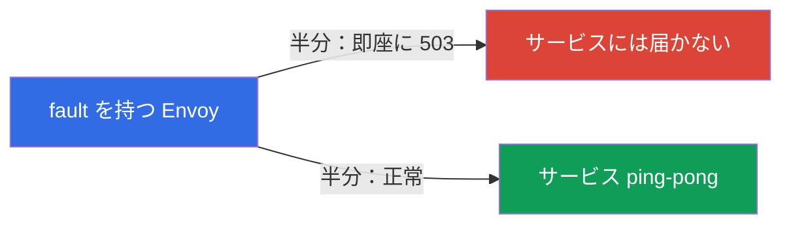
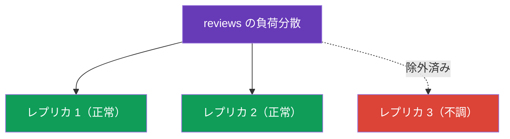

[Русская версия](ru.md) · [Eng version](en.md) · [Versión en español](es.md) · [Version française](fr.md) · [Deutsche Version](de.md) · [ქართული ვერსია](ge.md) · [繁體中文版](tw.md)

# 第8章：レジリエンス：fault injection、timeouts、retries、circuit breaking

> **この先に学ぶこと。** ネットワークは信頼できません。サービスは遅くなり、再起動し、エラーを返します。この章では、そのような障害に対して Istio がアプリケーションをレジリエントにする方法を、コードを変更せず、すべてインフラストラクチャ層で扱います。まず意図的にサービスを壊して（fault injection）レジリエンスをテストする方法を学び、次にそれを解決します：timeouts、retries、circuit breaking。

## 8.1. 問題：障害とカスケード障害

あるサービスがネットワーク経由で別のサービスを呼び出すと、あらゆる問題が起こり得ます。呼び出し先が遅くなる、503 を返す、あるいは完全に利用不能になることもあります。これを処理しなければ、問題は広がります。遅いサービスが呼び出し元を遅延させ、そこで接続が蓄積し、最終的にはチェーン全体が停止します。これを**カスケード障害**（cascading failure）と呼びます。

Istio はこれに対抗する一連のツールを提供しており、いずれもすでに馴染みのあるリソースで設定します。

| ツール | 設定場所 | 何をするか |
|------------|-------------------|------------|
| Fault injection | VirtualService | テストのために意図的に遅延とエラーを注入する |
| Timeout | VirtualService | 長すぎるリクエストを打ち切る |
| Retry | VirtualService | 失敗したリクエストを再試行する |
| Circuit breaking | DestinationRule | 負荷を制限し、不調なレプリカを除外する |

## 8.2. Fault injection：意図的に壊す

障害から守る前に、まず障害を再現できなければなりません。Fault injection は、システムがどのように振る舞うかを確認するために、制御された形でエラーを注入するものです。2 種類あります。

Fault injection は、壊したいサービス（以下の例では `ping-pong`）の **`VirtualService`** で設定します。`hosts` フィールドにはそのサービスを指定し、`http.fault` には注入する障害を指定します。

**遅延（delay）** - 遅いサービスをシミュレートします。

```yaml
apiVersion: networking.istio.io/v1
kind: VirtualService
metadata:
  name: ping-pong
spec:
  hosts:
  - ping-pong               # どのサービスに適用するか
  http:
  - fault:
      delay:
        fixedDelay: 5s
        percentage:
          value: 100        # すべてのリクエストに 5 秒の遅延を追加
    route:
    - destination:
        host: ping-pong
```

**中断（abort）** - エラーをシミュレートします。

```yaml
apiVersion: networking.istio.io/v1
kind: VirtualService
metadata:
  name: ping-pong
spec:
  hosts:
  - ping-pong
  http:
  - fault:
      abort:
        httpStatus: 503
        percentage:
          value: 50         # 半分のリクエストに即座に 503 を返す
    route:
    - destination:
        host: ping-pong
```



重要な点は、`abort` ではエラーを生成するのが**Envoy 自身**であることです。リクエストは実際のサービスには届きません。これは便利で安全です。呼び出し側のレジリエンスをテストでき、コードに触れず、サービス自体を実際に壊すこともありません。

## 8.3. Timeout：長いリクエストを打ち切る

サービスの応答が長すぎる場合、無限に待って接続を占有し続けるよりも、リクエストを打ち切る方がよいでしょう。タイムアウトは対象サービスの `VirtualService` で設定します（以下は `http` ブロックだけです。完全な構造は 8.2 の例と同じです）。

```yaml
http:
- timeout: 3s           # 3 秒を超えて応答を待たない
  route:
  - destination:
      host: reviews
```

`reviews` が 3 秒以内に応答しなければ、Envoy はリクエストを打ち切り、呼び出し元にエラー（`504`）を返します。タイムアウトがなければ、1 つの遅いサービスがチェーン全体を停止させる可能性があります。

## 8.4. Retry：失敗したリクエストを再試行する

多くの障害は一時的なものです。Pod が再起動した、数秒間のネットワーク問題があった、といった場合です。そのようなときは、単純なリクエストの再試行で問題を解決できます。Retry も `VirtualService` で設定します（以下は `http` ブロックだけです）。

```yaml
http:
- retries:
    attempts: 3               # 最大3回まで再試行
    perTryTimeout: 2s         # 各試行ごとのタイムアウト
    retryOn: 5xx,connect-failure   # どのエラーで再試行するか
  route:
  - destination:
      host: reviews
```


フィールドを見ていきましょう。

- **`attempts`** - 最初の失敗後に何回再試行するか。
- **`perTryTimeout`** - 個々の試行ごとのタイムアウト。
- **`retryOn`** - 再試行する条件：`5xx`（任意の 5xx 応答）、`connect-failure`、`gateway-error`、`retriable-4xx` など。カンマで区切ります。

Retry は信頼性を大幅に高めます。簡単な計算です。サービスが 50% の確率でエラーになる場合、3 回の retry を行うと、4 回すべての試行が失敗する確率は 0.5 の 4 乗 = 約 6% です。つまり成功率は 50% から約 94% に上がり、しかもアプリケーションには見えません。

### Retry の落とし穴

Retry は強力ですが、覚えておくべき注意点があります。

- **Istio はデフォルトですでに retry します。** `retries` ブロックがなくても、Istio は HTTP リクエストにデフォルトの retry を適用します（通常は `connect-failure`、`refused-stream`、`unavailable` のような「安全な」障害に対して `attempts: 2`）。明示的な `retries` はこれを上書きします。つまり「retry はない」というのは誤りです。独自設定かデフォルト設定かの違いだけです。
- **Retry できるのは冪等な操作だけです。** `GET` の繰り返しは安全です。しかし、注文を作成したり金額を引き落としたりする `POST` を retry すると、2 回実行されます。非冪等なリクエストの retry は意図して有効にしてください（または有効にしないでください）。これは第 6 章のミラーリングと同じ問題です。
- **retry storm（retry の雪崩）に注意してください。** チェーン全体でエラーが起きると、各層が retry を開始し、負荷が増幅して、すでに過負荷のサービスにとどめを刺します。`attempts` は小さく（2～3）保ち、DestinationRule の `connectionPool.http.maxRetries` によって同時 retry を制限してください。
- **タイムアウトはすべての試行を収める必要があります。** リクエスト全体の `timeout` はすべての retry をまとめて計測します。`timeout: 3s`、`attempts: 3` で `perTryTimeout: 2s` の場合、2 回目と 3 回目の試行に残された時間はありません。`timeout ≈ attempts × perTryTimeout`（さらに余裕）となるよう調整してください。

## 8.5. Retry を置く場所：重要な注意点

Retry は、エラーを返すサービス側ではなく、**リクエストを行う**サービス（クライアント）側で設定します。理由は単純です。リクエストを再試行するのは、送信呼び出しを行う Envoy だからです。

ラボ 03 の例を思い出してください。`frontend` は `ping-pong` を呼び出し、`ping-pong` では fault injection（50% のエラー）が有効です。Retry は `frontend` 用の VirtualService に設定する必要があります。そうすれば、その Envoy が `ping-pong` への送信呼び出しを再試行します。

`ping-pong` 用の VirtualService に retry を設定しても意味がありません。そこには fault injection 自体があり、Envoy は自分で生成したエラーを再試行することになります。終わりのない無意味なループです。

Retry が実際に行われていることは、呼び出し元 Pod の Envoy メトリクスで確認できます。

```bash
kubectl exec -it <frontend-pod> -c istio-proxy -- \
  pilot-agent request GET stats | grep upstream_rq_retry
```

## 8.6. Circuit breaking：接続プール

Retry と timeout は個々のリクエストに対して機能します。Circuit breaking（遮断器）はサービスレベルで機能します。呼び出し先に送信を許可するリクエスト数と接続数を制限します。DestinationRule の `connectionPool` で設定します。

```yaml
apiVersion: networking.istio.io/v1
kind: DestinationRule
metadata:
  name: reviews-dr
spec:
  host: reviews
  trafficPolicy:
    connectionPool:
      tcp:
        maxConnections: 100          # TCP 接続数の上限
      http:
        http1MaxPendingRequests: 10  # キュー内リクエスト数の上限
        maxRequestsPerConnection: 10
```

目的は、過負荷のサービスを「押しつぶさない」ことです。制限を超えると、Envoy は余分なリクエストを無限のキューに入れず、即座に拒否します（`503`）。これによりサービスは処理を立て直す機会を得られ、呼び出し元は停止する代わりに、たとえエラーでも素早く応答を受け取れます。チェーン全体がゆっくり死ぬより、速く失敗する方がよいのです。

有用な `connectionPool` フィールド：

- `tcp.maxConnections` - サービスへの TCP 接続数の上限。
- `http.http1MaxPendingRequests` - キューで待機できるリクエスト数。
- `http.http2MaxRequests` - 同時リクエスト数の上限（1 接続ですべてを処理する HTTP/2 と gRPC で有効。第 10 章）。
- `http.maxRequestsPerConnection` - 何リクエスト後に接続を再確立するか。
- `http.maxRetries` - サービス全体への同時 retry の上限（retry storm に対する保護）。
- `tcp.connectTimeout` / `http.idleTimeout` - 接続確立とアイドル状態のタイムアウト。

## 8.7. Outlier detection：不調なレプリカを除外する

Circuit breaking の第 2 の要素が `outlierDetection` です。個々のレプリカを監視し、エラーを連発するレプリカを一時的に負荷分散から除外します。

```yaml
  trafficPolicy:
    outlierDetection:
      consecutive5xxErrors: 5    # 連続5回の 5xx エラー
      interval: 10s              # 確認する頻度
      baseEjectionTime: 30s      # レプリカを除外する時間
      maxEjectionPercent: 50     # ただし一度に除外するのは 50% まで
```



ロジックは次のとおりです。レプリカが連続して `consecutive5xxErrors` 回のエラーを返すと、Envoy は `baseEjectionTime` の間そのレプリカをプールから外し、正常なものだけにトラフィックを送ります。この時間が経過するとレプリカは戻され、再び確認されます。`maxEjectionPercent` は、一度に除外するレプリカが多すぎて、稼働中のものがなくなることを防ぎます。

第 7 章も思い出してください。locality failover に必要なのはまさに `outlierDetection` です。これがなければ Istio はゾーン内のレプリカが不調であることを理解できず、トラフィックを切り替えません。

### liveness/readiness probes との関係

Outlier detection は Kubernetes の probes と混同しやすいですが、異なるレベルで動作する別のメカニズムであり、互いを補完します。

| | Readiness / Liveness probes | Outlier detection |
|---|---|---|
| 確認する主体 | ノード上の kubelet | 呼び出し元 Pod の Envoy |
| 方法 | Pod の health エンドポイントを**能動的に**問い合わせる | 実際の応答（5xx、timeout、中断）を**受動的に**見る |
| 判断の根拠 | アプリケーションが自らについて報告する内容 | 本番リクエストに実際に返された内容 |
| 作用範囲 | グローバル：readiness は Pod を Endpoints から外すため、誰からも見えなくなる | ローカル：各呼び出し元 Envoy が自らの判断で決定する |
| 速度 | probe の周期 + Endpoints の伝播 | エラー発生の直後 |
| 動作 | readiness - Endpoints から外す；liveness - コンテナを再起動する | エンドポイントを自身のプールから一時的に除外する |

両者が連携する仕組み：

- **Readiness** - 第 1 の防衛線です。Pod 自身が準備できていないと宣言すると、kubelet はそれをサービスの Endpoints から外し、istiod もエンドポイントとして配信しなくなるため、そこへのトラフィックは完全に流れなくなります。outlier detection はそれを「見る」ことすらありません。
- **Liveness** - コンテナがハングすると kubelet が再起動します。再起動中も Pod は readiness に失敗するため、Endpoints から外れます。
- **Outlier detection** は probes が見逃すものをカバーします。Pod が **readiness に通過している**（「正常です」と報告している）のに、実際にはエラーを連発している場合です。たとえば依存先の障害や、health エンドポイントでは検出できないバグが原因です。Envoy は実際の 5xx を確認し、アプリケーションが「認める」のを待たずに、このようなレプリカを一時的に負荷分散から除外します。

実践的な結論：probes と outlier detection は互いの代わりではなく、**補完する**ものです。Readiness/liveness は「自己評価で自分は健康か」、outlier detection は「本番トラフィックに実際どう応答しているか」です。耐障害性（および第 7 章の locality failover）には、正しい probes **に加えて** `outlierDetection` の両方が必要です。

> Istio の注意点：mesh 内の Pod では、アプリケーションの readiness probe は sidecar 自身（`istio-proxy`、ポート `15021`）の準備状態と統合されます。sidecar の準備ができていなければ、Pod も準備未完了となり、Endpoints から外れます（第 4 章参照）。

## 8.8. ベストプラクティス

- **防御を重ねる。** Timeout + retry + circuit breaking は一緒に機能します。timeout は待ち続けることを防ぎ、retry は一時的な障害を隠し、circuit breaking は過負荷のサービスを保護します。個別ではどれも弱くなります。
- **どこでも timeout を設定する。** Istio はデフォルトでリクエスト timeout を持たないため、リクエストはいくらでも待機できます。各呼び出しに適切な `timeout` を設定してください。そうしなければ、1 つの遅いサービスがチェーン全体を停止させます。
- **冪等なものだけを retry する。** `GET` は問題ありません。副作用を持つ `POST`/`PUT` は、その操作が冪等である場合（またはアプリケーション側の冪等性キーを通す場合）に限ります。
- **小さい `attempts` + `maxRetries`。** 2～3 回の試行で十分です。retry storm を起こさないよう、`connectionPool.http.maxRetries` で同時 retry を制限してください。
- **timeout と retry を整合させる。** 全体の `timeout` は `attempts × perTryTimeout` を収める必要があります。そうしないと、一部の試行は実行に間に合いません。
- **Circuit breaking は保守的に、かつ負荷に応じて。** `connectionPool` の制限は、実際のサービス容量に合わせて選んでください。キューを積み上げるよりも、速く 503 を返す方がよいのです。
- **`maxEjectionPercent` を伴う `outlierDetection`。** 不調なレプリカは除外しますが、一度にすべてを除外してはいけません。そうでなければ Envoy は panic mode（第 7 章）に入り、再びすべてにトラフィックを送り始めます。
- **fault injection でレジリエンスを確認する。** 意図的にサービスを壊し（`delay`/`abort`）、retry、timeout、遮断器が実際に機能することを確認するまで、resilience 設定が動作していると信じてはいけません。

## 8.9. 章のまとめ

- 信頼できないネットワークはカスケード障害につながります。Istio はインフラストラクチャ層でこれを防御します。
- VirtualService の **Fault injection**（`fault.delay`、`fault.abort`）は、レジリエンスを確認するために意図的に遅延とエラーを注入します。エラーを生成するのは Envoy 自身です。
- VirtualService の **Timeout** は、長すぎるリクエストを打ち切ります（504 を返します）。
- VirtualService の **Retry** は、失敗したリクエストを再試行します（`attempts`、`perTryTimeout`、`retryOn`）。信頼性を大幅に高めます。
- Retry は、エラーを返すサービス側ではなく、リクエストを行うクライアントサービス側で設定します。
- Retry の落とし穴：Istio はデフォルトで retry する（attempts 2）、retry が安全なのは冪等なものだけ、retry storm のリスク（`attempts` と `maxRetries` を制限する）、全体の `timeout` はすべての試行を収めなければなりません。
- DestinationRule の **Circuit breaking**：`connectionPool` は負荷を制限し、`outlierDetection` は不調なレプリカを除外します。
- `outlierDetection` は locality failover（第 7 章）にも必要です。
- Outlier detection（実際の応答に基づく Envoy の受動的な確認）と kubelet の probes（health エンドポイントの能動的な確認）は互いを補完します。probes は Pod をグローバルに Endpoints から外し、outlier detection は readiness を通過しているが実際にはエラーを返すレプリカを検出します。

## 8.10. 自己確認の質問

1. カスケード障害とは何ですか。また、Istio はそれをどのように防ぐのに役立ちますか？
2. `fault.delay` と `fault.abort` はどのように異なりますか？ abort 時にエラーを生成するのは誰ですか？
3. Timeout と retry はどのリソースで設定しますか？
4. なぜ retry は、エラーを返すサービス側ではなく、リクエストを行うクライアントサービス側で設定するのですか？
5. Circuit breaking において、`connectionPool` と `outlierDetection` はそれぞれ何を担当しますか？
6. `outlierDetection` と第 7 章の locality failover にはどのような関係がありますか？
7. POST リクエストを retry するのが危険なのはなぜですか？ retry storm とは何で、何によって制限しますか？
8. `timeout` が `attempts × perTryTimeout` より小さいとどうなりますか？ Istio にはデフォルトの retry がありますか？
9. `outlierDetection` は readiness/liveness probes とどのように異なり、どう補完しますか？ outlier detection が検出でき、readiness が検出できないのはどのようなケースですか？

## 実践

fault injection と retry を練習しましょう（バックエンドを壊し、retry で修復する）：

🧪 ラボ 03: [tasks/ica/labs/03](../../labs/03/README_JP.MD)

Timeout と circuit breaking を練習しましょう：

🧪 ラボ 10: [tasks/ica/labs/10](../../labs/10/README_JP.MD)

---
[目次](../README_JP.md) · [第7章](../07/jp.md) · [第9章](../09/jp.md)
