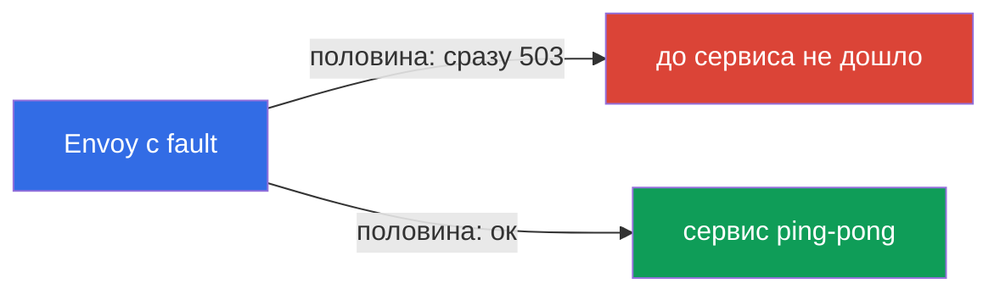
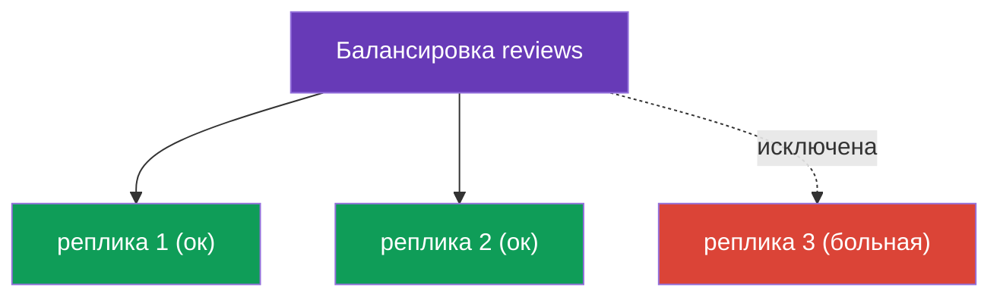

# Глава 8. Устойчивость: fault injection, timeouts, retries, circuit breaking

> **Что дальше.** Сеть ненадёжна: сервисы тормозят, перезагружаются, отдают ошибки. В
> этой главе разберём, как Istio делает приложение устойчивым к таким сбоям - и всё
> на уровне инфраструктуры, без изменения кода. Сначала научимся намеренно ломать
> сервис (fault injection), чтобы проверить устойчивость, а потом чинить: таймауты,
> ретраи и circuit breaking.

## 8.1. Проблема: сбои и каскадные отказы

Когда один сервис зовёт другой по сети, всё может пойти не так: получатель тормозит,
отдаёт 503, вообще недоступен. Если это не обрабатывать, беда расползается: медленный
сервис задерживает вызывающего, у того копятся соединения, и в итоге падает вся
цепочка. Это называют **каскадным отказом** (cascading failure).

Istio даёт набор инструментов против этого, и все они настраиваются в уже знакомых
ресурсах:

| Инструмент | Где настраивается | Что делает |
|------------|-------------------|------------|
| Fault injection | VirtualService | намеренно вносит задержки и ошибки для теста |
| Timeout | VirtualService | обрывает слишком долгий запрос |
| Retry | VirtualService | повторяет неудачный запрос |
| Circuit breaking | DestinationRule | ограничивает нагрузку и отсекает больные реплики |

## 8.2. Fault injection: ломаем намеренно

Прежде чем защищаться от сбоев, надо уметь их воспроизводить. Fault injection - это
контролируемое внесение ошибок, чтобы проверить, как система себя поведёт. Есть два
вида.

**Задержка (delay)** - имитируем медленный сервис:

```yaml
http:
- fault:
    delay:
      fixedDelay: 5s
      percentage:
        value: 100        # добавить 5с задержки ко всем запросам
  route:
  - destination:
      host: ping-pong
```

**Обрыв (abort)** - имитируем ошибку:

```yaml
http:
- fault:
    abort:
      httpStatus: 503
      percentage:
        value: 50         # половине запросов сразу вернуть 503
  route:
  - destination:
      host: ping-pong
```



Важный момент: при `abort` ошибку генерирует **сам Envoy**, запрос до реального сервиса
даже не доходит. Это удобно и безопасно: вы тестируете устойчивость вызывающей стороны,
не трогая код и не ломая сам сервис по-настоящему.

## 8.3. Timeout: обрываем долгий запрос

Если сервис отвечает слишком долго, лучше оборвать запрос, чем ждать бесконечно и
держать занятым соединение. Таймаут задаётся в VirtualService:

```yaml
http:
- timeout: 3s           # ждём ответа не больше 3 секунд
  route:
  - destination:
      host: reviews
```

Если `reviews` не ответил за 3 секунды, Envoy обрывает запрос и возвращает вызывающему
ошибку (`504`). Без таймаута один медленный сервис может «подвесить» всю цепочку.

## 8.4. Retry: повторяем неудачный запрос

Многие сбои временные: под перезапустился, была секундная сетевая проблема. В таких
случаях простой повтор запроса решает проблему. Ретраи тоже задаются в VirtualService:

```yaml
http:
- retries:
    attempts: 3               # до 3 повторных попыток
    perTryTimeout: 2s         # таймаут на каждую попытку
    retryOn: 5xx,connect-failure   # при каких ошибках повторять
  route:
  - destination:
      host: reviews
```


Разберём поля:

- **`attempts`** - сколько раз повторить после первой неудачи.
- **`perTryTimeout`** - таймаут на каждую отдельную попытку.
- **`retryOn`** - при каких условиях повторять: `5xx` (любой 5xx-ответ),
  `connect-failure`, `gateway-error`, `retriable-4xx` и другие, через запятую.

Ретраи заметно повышают надёжность. Простая математика: если сервис ошибается в 50%
случаев, то при 3 ретраях вероятность, что все 4 попытки провалятся, равна
0.5 в степени 4 = ~6%. То есть успех вырастает с 50% до ~94%, и всё это незаметно для
приложения.

## 8.5. Где ставить ретраи: важная тонкость

Ретраи настраиваются на стороне **вызывающего** сервиса, а не того, что ошибается.
Причина простая: повторяет запрос тот Envoy, который делает исходящий вызов.

Вспомните пример из лабы 03: `frontend` зовёт `ping-pong`, а на `ping-pong` включён
fault injection (50% ошибок). Ретраи надо ставить в VirtualService для `frontend` -
тогда его Envoy будет повторять исходящие вызовы к `ping-pong`.

Ставить ретраи в VirtualService для `ping-pong` было бы бессмысленно: там сидит сам
fault injection, и Envoy повторял бы сгенерированную им же ошибку - бесконечный
бессмысленный цикл.

Проверить, что ретраи реально происходят, можно по метрикам Envoy вызывающего пода:

```bash
kubectl exec -it <frontend-pod> -c istio-proxy -- \
  pilot-agent request GET stats | grep upstream_rq_retry
```

## 8.6. Circuit breaking: пул соединений

Ретраи и таймауты работают с отдельным запросом. Circuit breaking (предохранитель)
работает на уровне сервиса: он ограничивает, сколько запросов и соединений разрешено
слать получателю. Настраивается в DestinationRule через `connectionPool`.

```yaml
apiVersion: networking.istio.io/v1
kind: DestinationRule
metadata:
  name: reviews-dr
spec:
  host: reviews
  trafficPolicy:
    connectionPool:
      tcp:
        maxConnections: 100          # максимум TCP-соединений
      http:
        http1MaxPendingRequests: 10  # максимум запросов в очереди
        maxRequestsPerConnection: 10
```

Смысл в том, чтобы не «завалить» перегруженный сервис. Когда лимиты превышены, Envoy
сразу отклоняет лишние запросы (`503`), не ставя их в бесконечную очередь. Это даёт
сервису шанс разгрестись, а вызывающему - быстро получить ответ (пусть и ошибку)
вместо зависания. Лучше быстро отказать, чем медленно умирать всей цепочкой.

## 8.7. Outlier detection: отсекаем больные реплики

Вторая часть circuit breaking - `outlierDetection`. Она следит за отдельными
репликами и временно исключает из балансировки те, что сыпят ошибками.

```yaml
  trafficPolicy:
    outlierDetection:
      consecutive5xxErrors: 5    # 5 ошибок 5xx подряд
      interval: 10s              # как часто проверять
      baseEjectionTime: 30s      # на сколько исключить реплику
      maxEjectionPercent: 50     # но не больше 50% реплик разом
```



Логика: если реплика выдала `consecutive5xxErrors` ошибок подряд, Envoy на
`baseEjectionTime` убирает её из пула и шлёт трафик только на здоровые. Через это время
реплику возвращают и снова проверяют. `maxEjectionPercent` не даёт исключить слишком
много реплик сразу, чтобы не остаться без рабочих.

Отдельно вспомните главу 7: именно `outlierDetection` нужен для locality failover -
без него Istio не понимает, что реплики в зоне больны, и не переключает трафик.

## 8.8. Итоги главы

- Ненадёжная сеть ведёт к каскадным отказам; Istio защищает от них на уровне
  инфраструктуры.
- **Fault injection** (`fault.delay`, `fault.abort`) в VirtualService намеренно вносит
  задержки и ошибки для проверки устойчивости; ошибку генерирует сам Envoy.
- **Timeout** в VirtualService обрывает слишком долгий запрос (возвращает 504).
- **Retry** в VirtualService повторяет неудачный запрос (`attempts`, `perTryTimeout`,
  `retryOn`); заметно повышает надёжность.
- Ретраи ставятся на стороне вызывающего сервиса, а не того, что ошибается.
- **Circuit breaking** в DestinationRule: `connectionPool` ограничивает нагрузку,
  `outlierDetection` исключает больные реплики.
- `outlierDetection` также необходим для locality failover (глава 7).

## 8.9. Вопросы для самопроверки

1. Что такое каскадный отказ и как Istio помогает его предотвратить?
2. Чем `fault.delay` отличается от `fault.abort`? Кто генерирует ошибку при abort?
3. В каком ресурсе задаются таймауты и ретраи?
4. Почему ретраи нужно ставить на стороне вызывающего, а не ошибающегося сервиса?
5. За что отвечают `connectionPool` и `outlierDetection` в circuit breaking?
6. Какая связь между `outlierDetection` и locality failover из главы 7?

## Практика

Отработайте fault injection и ретраи (сломать бэкенд и починить ретраями):

🧪 Лаба 03: [tasks/ica/labs/03](../../labs/03/README_RU.MD)

Отработайте таймауты и circuit breaking:

🧪 Лаба 10: [tasks/ica/labs/10](../../labs/10/README_RU.MD)

---
[Оглавление](../README.md) · [Глава 7](../07/ru.md) · [Глава 9](../09/ru.md)
