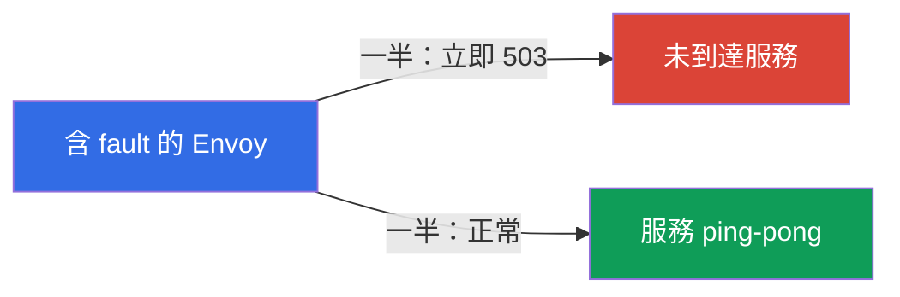
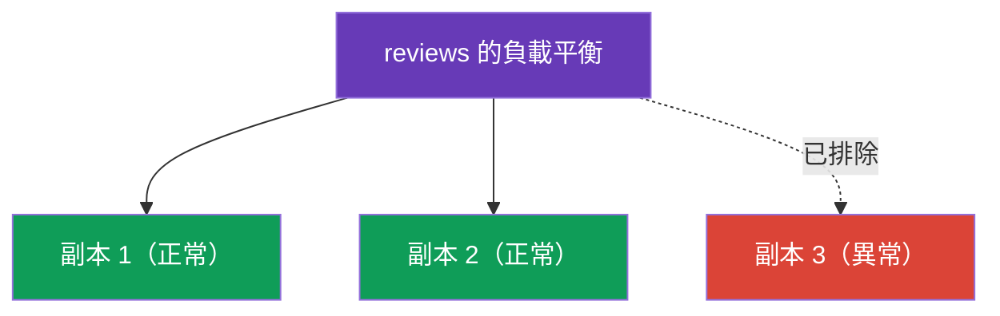

[Русская версия](ru.md) · [Eng version](en.md) · [Versión en español](es.md) · [Version française](fr.md) · [Deutsche Version](de.md) · [ქართული ვერსია](ge.md) · [日本語版](jp.md)

# 第 8 章。韌性：fault injection、timeouts、retries、circuit breaking

> **接下來。** 網路並不可靠：服務會變慢、重新啟動、回傳錯誤。本章將說明 Istio 如何讓應用程式能承受這類故障--而且完全在基礎架構層級進行，無須修改程式碼。我們會先學習如何故意讓服務故障（fault injection）以驗證韌性，然後再修復它：timeouts、retries 與 circuit breaking。

## 8.1. 問題：故障與連鎖失效

當一個服務透過網路呼叫另一個服務時，任何事情都可能出錯：接收端變慢、回傳 503，或完全無法使用。若不加以處理，問題會擴散：緩慢的服務拖延呼叫端、呼叫端的連線不斷累積，最終整條鏈路都會失效。這稱為**連鎖失效**（cascading failure）。

Istio 提供一組用來應對此問題的工具，而且都設定於我們已熟悉的資源中：

| 工具 | 設定位置 | 作用 |
|------------|-------------------|------------|
| Fault injection | VirtualService | 為測試而故意注入延遲與錯誤 |
| Timeout | VirtualService | 中止耗時過長的請求 |
| Retry | VirtualService | 重試失敗的請求 |
| Circuit breaking | DestinationRule | 限制負載並排除異常副本 |

## 8.2. Fault injection：故意造成故障

在防護故障之前，必須能重現它們。Fault injection 是受控地注入錯誤，以檢查系統的行為。有兩種類型。

Fault injection 會設定於我們想要「弄壞」的服務之 **`VirtualService`**（以下範例為 `ping-pong`）：在 `hosts` 欄位指定該服務，並在 `http.fault` 指定要注入的故障。

**延遲（delay）**--模擬緩慢的服務：

```yaml
apiVersion: networking.istio.io/v1
kind: VirtualService
metadata:
  name: ping-pong
spec:
  hosts:
  - ping-pong               # 套用至哪個服務
  http:
  - fault:
      delay:
        fixedDelay: 5s
        percentage:
          value: 100        # 為所有請求加入 5 秒延遲
    route:
    - destination:
        host: ping-pong
```

**中止（abort）**--模擬錯誤：

```yaml
apiVersion: networking.istio.io/v1
kind: VirtualService
metadata:
  name: ping-pong
spec:
  hosts:
  - ping-pong
  http:
  - fault:
      abort:
        httpStatus: 503
        percentage:
          value: 50         # 對一半的請求立即回傳 503
    route:
    - destination:
        host: ping-pong
```



一個重點：使用 `abort` 時，錯誤由 **Envoy 本身**產生，請求甚至不會抵達實際服務。這既方便又安全：您可以測試呼叫端的韌性，不必變更程式碼，也不會真正弄壞服務本身。

## 8.3. Timeout：中止耗時過長的請求

如果服務回應耗時太久，最好中止請求，而不是無限等待並持續佔用連線。Timeout 會在所需服務的 `VirtualService` 中設定（以下僅顯示 `http` 區塊；完整結構如 8.2 的範例）：

```yaml
http:
- timeout: 3s           # 等待回應不超過 3 秒
  route:
  - destination:
      host: reviews
```

如果 `reviews` 沒有在 3 秒內回應，Envoy 會中止請求並向呼叫端回傳錯誤（`504`）。若沒有 timeout，一個緩慢服務就可能讓整條鏈路「卡住」。

## 8.4. Retry：重試失敗的請求

許多故障都是暫時的：pod 正在重新啟動，或發生了短暫的網路問題。在這類情況下，簡單地重試請求便可解決問題。Retries 也設定於 `VirtualService`（以下僅為 `http` 區塊）：

```yaml
http:
- retries:
    attempts: 3               # 最多重試 3 次
    perTryTimeout: 2s         # 每次嘗試的逾時
    retryOn: 5xx,connect-failure   # 在哪些錯誤時重試
  route:
  - destination:
      host: reviews
```


說明各欄位：

- **`attempts`**--第一次失敗後要重試幾次。
- **`perTryTimeout`**--每一個獨立嘗試的 timeout。
- **`retryOn`**--要在哪些條件下重試：`5xx`（任何 5xx 回應）、`connect-failure`、`gateway-error`、`retriable-4xx` 等，以逗號分隔。

Retries 能顯著提高可靠性。簡單算術：若服務有 50% 的機率出錯，設定 3 次 retries 時，4 次嘗試全數失敗的機率為 0.5 的 4 次方 = 約 6%。也就是說，成功率從 50% 提升到約 94%，而應用程式完全不會察覺。

### Retries 的陷阱

Retries 很強大，但有一些重要細節需要記住。

- **Istio 預設已會重試。** 即使沒有 `retries` 區塊，Istio 仍會將預設 retries 套用於 HTTP 請求（通常是對 `connect-failure`、`refused-stream`、`unavailable` 等「安全」故障使用 `attempts: 2`）。明確指定的 `retries` 會覆寫此設定。因此，「沒有 retries」是迷思；問題只在於您使用自己的設定還是預設設定。
- **只能重試冪等操作。** 重試 `GET` 是安全的。但若重試會建立訂單或扣款的 `POST`，它將執行兩次。請有意識地為非冪等請求啟用 retries（或不要啟用）--這與第 6 章的 mirroring 有同樣的問題。
- **小心 retry storm（重試風暴）。** 若整條鏈路都發生錯誤，每一層都開始重試，負載就會倍增，進一步壓垮已超載的服務。請讓 `attempts` 保持較小（2–3），並透過 DestinationRule 中的 `connectionPool.http.maxRetries` 限制同時進行的 retries。
- **Timeout 必須容納所有嘗試。** 請求的整體 `timeout` 會涵蓋所有 retries。如果 `timeout: 3s`，但 `attempts: 3` 時的 `perTryTimeout: 2s`，那麼第二與第三次嘗試已沒有時間可用。請使 `timeout ≈ attempts × perTryTimeout`（再加上餘裕）保持協調。

## 8.5. 在哪裡設定 retries：重要細節

Retries 應設定在**發出請求**的服務（客戶端）一側，而不是回應錯誤的服務一側。原因很簡單：重試請求的是發出 outbound 呼叫的 Envoy。

回想 lab 03 的範例：`frontend` 呼叫 `ping-pong`，而 `ping-pong` 已啟用 fault injection（50% 錯誤）。應在 `frontend` 的 VirtualService 中設定 retries--這樣它的 Envoy 才會重試對 `ping-pong` 的 outbound 呼叫。

在 `ping-pong` 的 VirtualService 設定 retries 沒有意義：fault injection 就在那裡，Envoy 會重試自己產生的錯誤--形成無限且毫無意義的迴圈。

您可透過呼叫端 pod 的 Envoy metrics 驗證 retries 是否真的發生：

```bash
kubectl exec -it <frontend-pod> -c istio-proxy -- \
  pilot-agent request GET stats | grep upstream_rq_retry
```

## 8.6. Circuit breaking：連線集區

Retries 與 timeouts 處理的是單一請求。Circuit breaking（斷路器）則在服務層級運作：它限制可向接收端傳送多少請求與連線。可在 DestinationRule 中透過 `connectionPool` 設定。

```yaml
apiVersion: networking.istio.io/v1
kind: DestinationRule
metadata:
  name: reviews-dr
spec:
  host: reviews
  trafficPolicy:
    connectionPool:
      tcp:
        maxConnections: 100          # TCP 連線上限
      http:
        http1MaxPendingRequests: 10  # 佇列中請求的上限
        maxRequestsPerConnection: 10
```

目的在於避免「壓垮」已超載的服務。超過限制時，Envoy 會立即拒絕多餘的請求（`503`），而不是將它們放進無限佇列。這讓服務有機會清理積壓，也讓呼叫端快速取得回應（即使是錯誤），而非一直卡住。快速拒絕，勝過讓整條鏈路緩慢死亡。

實用的 `connectionPool` 欄位：

- `tcp.maxConnections`--服務 TCP 連線的上限；
- `http.http1MaxPendingRequests`--可在佇列中等待的請求數；
- `http.http2MaxRequests`--同時請求的上限（適用於 HTTP/2 與 gRPC，兩者都經由一個連線傳輸--第 10 章）；
- `http.maxRequestsPerConnection`--多少請求後重新開啟連線；
- `http.maxRetries`--整個服務的同時 retries 上限（防護 retry storm）；
- `tcp.connectTimeout` / `http.idleTimeout`--連線建立與閒置的 timeouts。

## 8.7. Outlier detection：排除異常副本

Circuit breaking 的第二部分是 `outlierDetection`。它監看個別副本，並暫時將持續出錯的副本從負載平衡中排除。

```yaml
  trafficPolicy:
    outlierDetection:
      consecutive5xxErrors: 5    # 連續 5 次 5xx 錯誤
      interval: 10s              # 檢查頻率
      baseEjectionTime: 30s      # 將複本排除多久
      maxEjectionPercent: 50     # 但一次不超過 50% 的複本
```



邏輯如下：如果副本連續回傳 `consecutive5xxErrors` 個錯誤，Envoy 就會在 `baseEjectionTime` 期間將它從集區移除，並只將流量傳送到健康副本。時間過後，副本會被加回並再次檢查。`maxEjectionPercent` 可避免一次排除過多副本，以免沒有可運作的副本。

也請回想第 7 章：locality failover 正是需要 `outlierDetection`--沒有它，Istio 無法判斷某個 zone 中的副本已異常，也不會切換流量。

### 這與 liveness/readiness probes 如何配合

Outlier detection 容易與 Kubernetes probes 混淆，但它們是在不同層級運作的不同機制--並且彼此互補。

| | Readiness / Liveness probes | Outlier detection |
|---|---|---|
| 執行檢查者 | node 上的 kubelet | 呼叫端 pod 的 Envoy |
| 如何檢查 | **主動**探測 pod 的 health endpoint | **被動**查看實際回應（5xx、timeouts、連線中斷） |
| 判斷依據 | 應用程式對自身狀態的回報 | 正式請求實際得到的回應 |
| 作用範圍 | 全域：readiness 將 pod 從 Endpoints 移除--其他任何人都看不到它 | 區域：每個呼叫端 Envoy 都自行判斷 |
| 速度 | probe 週期 + Endpoints 傳播 | 錯誤發生後立即處理 |
| 動作 | readiness--從 Endpoints 移除；liveness--重新啟動 container | 暫時從自己的集區排除 endpoint |

它們的協作方式：

- **Readiness**--第一道防線：若 pod 自行宣告尚未就緒，kubelet 會將它從服務的 Endpoints 移除，istiod 不再將它作為 endpoint 發送，流量完全不會前往它--outlier detection 甚至「看不到」它。
- **Liveness**--若 container 卡住，kubelet 會將它重新啟動；在重新啟動期間，pod 仍會通不過 readiness 並從 Endpoints 排除。
- **Outlier detection** 處理 probes 遺漏的情況：pod **通過 readiness**（宣稱「我很健康」），但實際上持續回傳錯誤--例如相依服務失效，或 health endpoint 沒有偵測到的 bug。Envoy 會看到真實的 5xx，並暫時將該副本從負載平衡中排除，不必等到應用程式「承認」問題。

實務結論：probes 與 outlier detection 並非彼此替代，而是**互補**。Readiness/liveness 是「依我自己的判斷，我健康嗎」，outlier detection 是「我實際上如何回應正式流量」。若要達到容錯能力（以及第 7 章的 locality failover），兩者皆不可少：正確的 probes **加上** `outlierDetection`。

> Istio 細節：mesh 中 pod 的應用程式 readiness probe 會與 sidecar 本身的就緒狀態（`istio-proxy`、連接埠 `15021`）合併。若 sidecar 尚未就緒，pod 也尚未就緒，並會從 Endpoints 排除（見第 4 章）。

## 8.8. Best practices

- **分層防護。** Timeout + retries + circuit breaking 共同運作：timeout 避免持續等待，retries 隱藏暫時性故障，circuit breaking 保護超載服務。單獨使用時每一項都較弱。
- **到處設定 timeouts。** Istio 預設沒有 request timeout--請求可無限等待。為每個呼叫設定合理的 `timeout`，否則一個緩慢服務便會卡住整條鏈路。
- **只重試冪等操作。** `GET` 可以；具副作用的 `POST`/`PUT` 僅在操作為冪等時才可以（或透過應用程式側的 idempotency key）。
- **較小的 `attempts` + `maxRetries`。** 2–3 次嘗試已足夠；透過 `connectionPool.http.maxRetries` 限制同時 retries，以免造成 retry storm。
- **協調 timeout 與 retries。** 整體 `timeout` 必須容納 `attempts × perTryTimeout`，否則部分嘗試將沒有時間完成。
- **Circuit breaking 應保守設定並依負載調整。** 依服務的實際容量選擇 `connectionPool` 限制；快速回傳 503 勝過累積佇列。
- **使用 `maxEjectionPercent` 的 `outlierDetection`。** 排除異常副本，但不要一次全數排除--否則 Envoy 會進入 panic mode（第 7 章），並再次將流量傳送至所有副本。
- **以 fault injection 驗證韌性。** 在您故意弄壞服務（`delay`/`abort`），並看到 retries、timeouts 與斷路器確實生效之前，不要相信 resilience configuration 能正常運作。

## 8.9. 本章總結

- 不可靠的網路會導致連鎖失效；Istio 在基礎架構層級提供防護。
- VirtualService 中的 **Fault injection**（`fault.delay`、`fault.abort`）會為韌性測試故意注入延遲與錯誤；錯誤由 Envoy 本身產生。
- VirtualService 中的 **Timeout** 會中止耗時過長的請求（回傳 504）。
- VirtualService 中的 **Retry** 會重試失敗請求（`attempts`、`perTryTimeout`、`retryOn`）；可顯著提高可靠性。
- Retries 應設定在客戶端服務（發出請求者）一側，而非回應錯誤的服務一側。
- Retries 的陷阱：Istio 預設會重試（attempts 2），只有冪等操作可安全重試，存在 retry storm 風險（以 `attempts` 與 `maxRetries` 限制），整體 `timeout` 必須容納所有嘗試。
- DestinationRule 中的 **Circuit breaking**：`connectionPool` 限制負載，`outlierDetection` 排除異常副本。
- locality failover（第 7 章）也需要 `outlierDetection`。
- Outlier detection（Envoy 依實際回應進行的被動檢查）與 kubelet probes（主動檢查 health endpoint）彼此互補：probes 會從全域 Endpoints 移除 pod，outlier detection 則能捕捉通過 readiness 卻實際回傳錯誤的副本。

## 8.10. 自我檢查問題

1. 什麼是連鎖失效，Istio 如何幫助預防它？
2. `fault.delay` 與 `fault.abort` 有何差異？abort 發生時由誰產生錯誤？
3. Timeouts 與 retries 設定在哪一種資源中？
4. 為何 retries 設定在客戶端服務（發出請求者）一側，而不是回應錯誤的服務一側？
5. Circuit breaking 中的 `connectionPool` 與 `outlierDetection` 分別負責什麼？
6. `outlierDetection` 與第 7 章的 locality failover 有何關係？
7. 為何重試 POST 請求危險？什麼是 retry storm，又用什麼限制它？
8. 若 `timeout` 小於 `attempts × perTryTimeout`，會發生什麼事？Istio 預設有 retries 嗎？
9. `outlierDetection` 與 readiness/liveness probes 有何不同，又如何彼此互補？Outlier detection 能捕捉而 readiness 無法捕捉的是哪種情況？

## 實作

練習 fault injection 與 retries（弄壞 backend，再以 retries 修復）：

🧪 Lab 03：[tasks/ica/labs/03](../../labs/03/README_TW.MD)

練習 timeouts 與 circuit breaking：

🧪 Lab 10：[tasks/ica/labs/10](../../labs/10/README_TW.MD)

---
[目錄](../README_TW.md) · [第 7 章](../07/tw.md) · [第 9 章](../09/tw.md)
