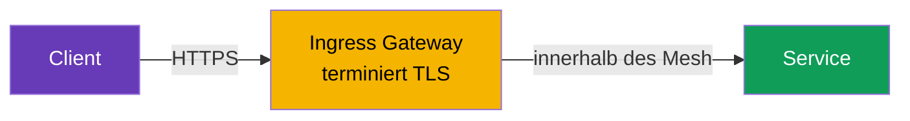
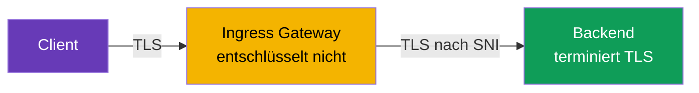
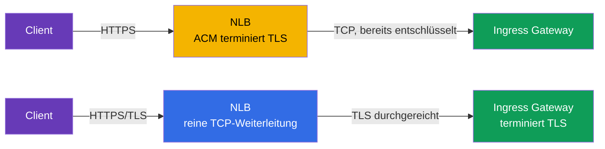
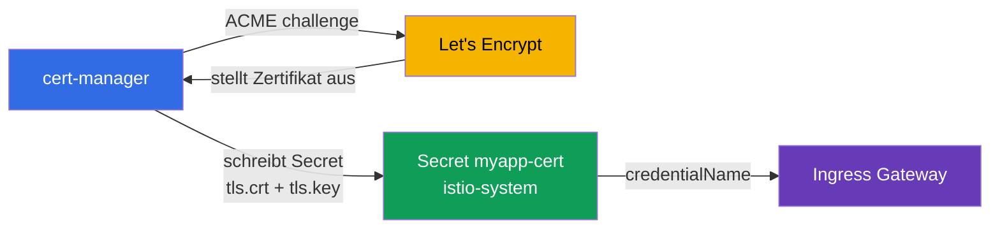

[RU version](ru.md) · [Eng version](en.md) · [Versión en español](es.md) · [Version française](fr.md)

# Kapitel 9. Edge TLS: Ingress in den Modi SIMPLE, MUTUAL, PASSTHROUGH

> **Was kommt als Nächstes.** Bisher kam der Traffic von außen über einfaches HTTP zu
> uns. In der Produktion ist das nicht erlaubt: Der Traffic am Eingang (edge) muss über
> HTTPS verschlüsselt sein. In diesem Kapitel klären wir, wie man TLS am Ingress-Gateway
> konfiguriert und welche Modi es gibt: SIMPLE (normales HTTPS), MUTUAL (Prüfung des
> Client-Zertifikats) und PASSTHROUGH (Verschlüsselung bis zum Backend selbst).

## 9.1. Wo TLS terminiert wird

Zunächst ein wichtiger Begriff. **TLS-Terminierung** ist der Punkt, an dem
verschlüsselter Traffic entschlüsselt wird. Von dieser Stelle hängt die Wahl des Modus
ab.

Drei Varianten für eingehenden Traffic:

- Der Client verschlüsselt, das **Ingress-Gateway entschlüsselt** und danach läuft der
  Traffic innerhalb des Mesh seinen gewohnten Weg. Das sind SIMPLE und MUTUAL.
- Der Client verschlüsselt, das Gateway **entschlüsselt nicht**, sondern leitet den
  verschlüsselten Datenstrom bis zum Backend durch, und erst das **Backend terminiert
  TLS**. Das ist PASSTHROUGH.

Verwechseln Sie Edge TLS nicht mit mTLS innerhalb des Mesh (Kapitel 12). Hier geht es um
Traffic von außen in den Cluster. Den internen Traffic zwischen Services verschlüsselt
Istio separat und automatisch.

## 9.2. Zertifikate im Secret

Für TLS braucht man ein Zertifikat und einen privaten Schlüssel. In Istio legt man sie in
einem Kubernetes-`Secret` ab, und das Gateway verweist über den Namen darauf.

```bash
kubectl create -n istio-system secret tls myapp-cert \
  --cert=myapp.crt --key=myapp.key
```

Wichtiges Detail: Das Secret muss im selben Namespace liegen, in dem das Ingress-Gateway
läuft (in der Regel `istio-system`). Das Gateway verweist über `credentialName` darauf,
und istiod liefert das Zertifikat per SDS an Envoy aus (erinnern Sie sich an Kapitel 4 -
Secret Discovery Service).

## 9.3. SIMPLE: normales HTTPS

Der häufigste Modus. Der Client verbindet sich über HTTPS, das Gateway entschlüsselt den
Traffic und leitet ihn dann an den Service innerhalb des Mesh weiter.

```yaml
apiVersion: networking.istio.io/v1
kind: Gateway
metadata:
  name: main-gateway
spec:
  selector:
    istio: ingressgateway
  servers:
  - port:
      number: 443
      name: https
      protocol: HTTPS
    tls:
      mode: SIMPLE
      credentialName: myapp-cert   # Secret mit Zertifikat und Schlüssel
    hosts:
    - myapp.local
```



Schlüsselfelder:

- **`protocol: HTTPS`** und **`tls.mode: SIMPLE`** - das Gateway nimmt TLS-Traffic
  entgegen und entschlüsselt ihn selbst.
- **`credentialName`** - Name des Secret mit dem Server-Zertifikat.

Danach ist die Anwendung über `https://myapp.local` erreichbar. Der Client prüft das
Server-Zertifikat, wie bei jedem gewöhnlichen HTTPS.

## 9.4. Redirect von HTTP auf HTTPS

Üblicherweise möchte man, dass Clients, die über HTTP kommen, automatisch auf HTTPS
umgeleitet werden. Dafür fügt man im Gateway einen HTTP-Server mit dem Flag
`httpsRedirect` hinzu:

```yaml
  servers:
  - port:
      number: 80
      name: http
      protocol: HTTP
    hosts:
    - myapp.local
    tls:
      httpsRedirect: true    # jede HTTP-Anfrage -> Redirect auf HTTPS
  - port:
      number: 443
      name: https
      protocol: HTTPS
    tls:
      mode: SIMPLE
      credentialName: myapp-cert
    hosts:
    - myapp.local
```

Jetzt erhält eine Anfrage an `http://myapp.local` einen Redirect (301) auf
`https://myapp.local`.

## 9.5. MUTUAL: Prüfung des Client-Zertifikats

Bei SIMPLE prüft nur der Client den Server. Aber manchmal ist es nötig, dass auch der
**Server den Client prüft**: nur diejenigen durchlassen, die ein gültiges
Client-Zertifikat besitzen. Das ist mutual TLS am Eingang, der Modus `MUTUAL`.

```yaml
    tls:
      mode: MUTUAL
      credentialName: myapp-cert   # hier sowohl das Server-Zertifikat als auch die CA zur Client-Prüfung
    hosts:
    - myapp.local
```

Unterschied zu SIMPLE: Bei `MUTUAL` muss das Secret zusätzlich ein CA-Zertifikat
(`ca.crt`) enthalten, mit dem das Gateway die Client-Zertifikate prüft. Ein Client ohne
gültiges, von dieser CA signiertes Zertifikat besteht den TLS-Handshake gar nicht erst.

```bash
# ohne Client-Zertifikat - Ablehnung
curl -sk https://myapp.local:32443/                       # nicht 200

# mit Client-Zertifikat - geht durch
curl -sk --cert client.crt --key client.key https://myapp.local:32443/   # 200
```

MUTUAL setzt man für B2B-APIs, Partner-Integrationen und interne Admin-Oberflächen ein -
überall dort, wo der Zugriff nur den Inhabern eines ausgestellten Zertifikats vorbehalten
sein soll.

## 9.6. PASSTHROUGH: TLS terminiert das Backend

Bei SIMPLE und MUTUAL entschlüsselt das Gateway den Traffic. Aber manchmal ist das nicht
erwünscht: Zum Beispiel möchte das Backend sein TLS selbst verwalten, oder es wird eine
durchgehende Verschlüsselung bis zum Service selbst benötigt, ohne dass am Gateway
„aufgemacht" wird. Dann verwendet man `PASSTHROUGH`: Das Gateway entschlüsselt den
Traffic nicht, sondern leitet ihn durch und orientiert sich nur am SNI (dem Hostnamen im
TLS).

```yaml
  servers:
  - port:
      number: 443
      name: tls
      protocol: TLS
    tls:
      mode: PASSTHROUGH        # das Gateway entschlüsselt nicht
    hosts:
    - passthrough.local
```



Bei PASSTHROUGH braucht man einen VirtualService mit einem `tls`-Block und einem Match
nach SNI, damit das Gateway versteht, an welchen Service es den verschlüsselten Datenstrom
leiten soll:

```yaml
apiVersion: networking.istio.io/v1
kind: VirtualService
metadata:
  name: passthrough-vs
spec:
  hosts:
  - passthrough.local
  gateways:
  - main-gateway
  tls:                        # genau tls, nicht http
  - match:
    - sniHosts:
      - passthrough.local
    route:
    - destination:
        host: secure-backend
        port:
          number: 443
```

Beachten Sie: Da das Gateway den Traffic nicht entschlüsselt, sieht es auch kein HTTP
darin. Deshalb ist Routing nur nach SNI möglich, nicht nach Pfaden oder Headern.

## 9.7. Vergleich der Modi

| Modus | Wer terminiert TLS | Client-Prüfung | Wann verwenden |
|-------|---------------------|------------------|--------------------|
| `SIMPLE` | Ingress Gateway | nein | normales öffentliches HTTPS |
| `MUTUAL` | Ingress Gateway | ja, per Client-Zertifikat | geschlossener Zugriff, B2B, Partner |
| `PASSTHROUGH` | das Backend selbst | hängt vom Backend ab | durchgehende Verschlüsselung, Backend hält TLS selbst |

Praktische Faustregel: Nehmen Sie standardmäßig `SIMPLE`. `MUTUAL` - wenn nur mit
Client-Zertifikaten durchgelassen werden soll. `PASSTHROUGH` - wenn das Gateway den Inhalt
nicht sehen darf und TLS unangetastet bis zum Backend gelangen muss.

## 9.8. Wo TLS terminieren: am NLB (ACM) oder in Istio

Alles bisher Gesagte betrifft die TLS-Terminierung **in Istio** (das Gateway entschlüsselt
den Traffic mit dem Zertifikat aus dem Secret). Auf AWS gibt es aber eine Alternative: ein
fertiges Zertifikat aus dem **AWS Certificate Manager (ACM)** direkt an den Network Load
Balancer hängen, dann wird TLS **am Load Balancer** terminiert, noch vor Envoy. Technisch
geschieht das über Annotationen am Service des Gateways (`aws-load-balancer-ssl-cert` +
`aws-load-balancer-ssl-ports`) - eine ausführliche Betrachtung der Annotationen findet
sich in [Kapitel 5](../05/ru.md). Hier ist es wichtig zu verstehen, **was man wählt**.



**Variante A - TLS am NLB (Offload über ACM).**

Vorteile:

- Das Zertifikat verwaltet AWS: ACM verlängert es selbst, der Schlüssel verlässt AWS
  nicht, in den Cluster muss nichts geladen werden.
- Entlastung des Gateways: Die Kryptografie macht der NLB, Envoy erhält bereits
  entschlüsselten Traffic.
- Einfache Integration mit Route 53/ACM (DNS-Validierung des Zertifikats mit wenigen
  Klicks).

Nachteile:

- Zwischen NLB und Gateway läuft der Traffic **ohne dieses TLS** (nur durch die Grenzen der
  VPC geschützt). Für durchgehende Verschlüsselung taugt das nicht.
- Istio **sieht** das ursprüngliche TLS **nicht**: Routing nach SNI ist nicht möglich,
  `MUTUAL` (Prüfung des Client-Zertifikats) am Gateway ist nicht möglich, `PASSTHROUGH`
  verliert seinen Sinn.
- Das Zertifikat muss im ACM liegen. Ein eigenes Zertifikat (von einer eigenen CA oder
  Let's Encrypt) kann man in ACM **importieren**, aber solche importierten Zertifikate
  verlängert ACM **nicht automatisch** - sie müssen manuell neu hochgeladen werden
  (Auto-Verlängerung funktioniert nur für Zertifikate, die ACM selbst ausgestellt hat).

**Variante B - TLS in Istio (SIMPLE/MUTUAL/PASSTHROUGH), NLB im TCP-Weiterleitungsmodus.**

Vorteile:

- Volle Kontrolle: `MUTUAL` (mTLS am Eingang), `PASSTHROUGH`, Routing nach SNI.
- Beliebige Zertifikatsquelle: eigene CA, ACM Private CA, Let's Encrypt über cert-manager
  (Abschnitt 9.9).
- Die Verschlüsselung reicht bis zum Mesh selbst und bricht nicht am Load Balancer ab.

Nachteile:

- Die Zertifikate verwalten Sie selbst (oder setzen cert-manager ein - siehe unten).
- Die kryptografische Last liegt auf den Pods des Gateways.

| Kriterium | TLS am NLB (ACM) | TLS in Istio |
|----------|------------------|-------------|
| Wer verlängert das Zertifikat | AWS (ACM) | Sie / cert-manager |
| Durchgehende Verschlüsselung bis zum Mesh | nein | ja |
| `MUTUAL` (Client-Zertifikat) am Eingang | nein | ja |
| `PASSTHROUGH` / Routing nach SNI | nein | ja |
| Zertifikatsquelle | ACM (ausgestellt oder importiert) | beliebig (CA, ACM PCA, Let's Encrypt) |
| Auto-Verlängerung importierter Zertifikate | nein (manuell hochladen) | ja (cert-manager) |
| Last am Gateway | niedriger | höher |

Praktische Faustregel: **Einfaches öffentliches HTTPS auf EKS ohne mTLS am Eingang** -
bequemer und günstiger im Betrieb an NLB+ACM abgeben. **Braucht man `MUTUAL`,
`PASSTHROUGH`, durchgehende Verschlüsselung oder ein Zertifikat nicht aus ACM** - dann in
Istio terminieren.

## 9.9. Automatische Zertifikate: cert-manager und Let's Encrypt

Zertifikate von Hand zu laden und zu verlängern (`kubectl create secret tls ...`) ist in
der Produktion unbequem und gefährlich - vergessen Sie eine Verlängerung, geht die Website
„offline". Die Standardlösung für Istio ist [cert-manager](https://cert-manager.io/): Er
bezieht Zertifikate selbst von einer Zertifizierungsstelle über das Protokoll **ACME**
(der bekannteste ACME-Anbieter ist das kostenlose **Let's Encrypt**), legt sie in ein
Kubernetes-`Secret` und verlängert sie automatisch vor Ablauf.

Das Schema ist einfach: cert-manager erstellt genau das `Secret` (`tls.crt` + `tls.key`),
auf das das Gateway ohnehin über `credentialName` verweisen kann. Für Istio ist nichts
Besonderes nötig - es sieht einfach ein fertiges Secret.



Zuerst beschreibt man die Zertifikatsquelle - `ClusterIssuer` (clusterweit) oder `Issuer`
(im Rahmen eines Namespace). Beispiel eines ACME-Issuers für Let's Encrypt mit
DNS-01-Prüfung über Route 53 (auf AWS ist das zuverlässiger als HTTP-01, weil es keine
Erreichbarkeit von Port 80 von außen erfordert):

```yaml
apiVersion: cert-manager.io/v1
kind: ClusterIssuer
metadata:
  name: letsencrypt-prod
spec:
  acme:
    server: https://acme-v02.api.letsencrypt.org/directory
    email: admin@example.com
    privateKeySecretRef:
      name: letsencrypt-prod-account-key
    solvers:
    - dns01:
        route53:
          region: eu-central-1        # cert-manager bestätigt den Domainbesitz
                                       # über einen Eintrag in Route 53 (IAM-Rechte nötig)
```

Danach - die Ressource `Certificate`, die sagt „ich möchte ein Zertifikat für diese
Domain, lege es in dieses Secret". Das Secret muss **im Namespace des Gateways**
(`istio-system`) liegen, sonst sieht das Gateway es nicht:

```yaml
apiVersion: cert-manager.io/v1
kind: Certificate
metadata:
  name: myapp-cert
  namespace: istio-system          # dort, wo das Ingress-Gateway läuft
spec:
  secretName: myapp-cert           # cert-manager erstellt dieses Secret
  issuerRef:
    name: letsencrypt-prod
    kind: ClusterIssuer
  dnsNames:
  - myapp.example.com
```

Weiter geht alles wie in Abschnitt 9.3 - das Gateway verweist auf dieses Secret:

```yaml
    tls:
      mode: SIMPLE
      credentialName: myapp-cert   # Secret, das cert-manager gefüllt hat
```

Kurz zum Challenge:

- **DNS-01** (Beispiel oben) - cert-manager erstellt einen TXT-Eintrag in der DNS-Zone
  (Route 53, Cloud DNS usw.). Funktioniert sogar für interne Gateways und für
  Wildcard-Zertifikate (`*.example.com`).
- **HTTP-01** - Let's Encrypt prüft die Domain, indem es eine Datei unter
  `http://<domain>/.well-known/...` anfordert. Dafür muss Port 80 des Gateways aus dem
  Internet erreichbar sein und die Challenge-Anfrage bis zum Solver von cert-manager
  gelangen; im Zusammenspiel mit Istio ist das komplizierter zu konfigurieren, deshalb
  nimmt man auf AWS häufiger DNS-01.

Vorteile von cert-manager+Let's Encrypt: kostenlos, vollständig automatische Verlängerung,
einheitlicher Mechanismus für alle Domains. Nachteile: Man muss cert-manager selbst
betreiben, Let's Encrypt hat [Ausstellungslimits](https://letsencrypt.org/docs/rate-limits/)
(verwenden Sie beim Debuggen den Staging-Issuer `acme-staging-v02`), und für DNS-01 braucht
man Rechte zur Änderung der DNS-Zone.

## 9.10. Best Practices

- **Leiten Sie HTTP immer auf HTTPS um** (`httpsRedirect: true`, Abschnitt 9.4) - kein
  offenes HTTP in der Produktion.
- **Legen Sie die minimale TLS-Version fest.** Nehmen Sie standardmäßig TLS 1.2 und höher
  und deaktivieren Sie alte Protokolle direkt im Server des Gateway:

  ```yaml
    - port:
        number: 443
        name: https
        protocol: HTTPS
      tls:
        mode: SIMPLE
        credentialName: myapp-cert
        minProtocolVersion: TLSV1_2      # TLS 1.0/1.1 verbieten
        # cipherSuites: [ECDHE-ECDSA-AES256-GCM-SHA384, ...]  # bei Bedarf
  ```

- **Automatisieren Sie Zertifikate.** Manuelles `kubectl create secret tls` - nur für Labs
  und Debugging. In der Produktion - cert-manager (Let's Encrypt/eigene CA) oder ACM am
  NLB.
- **Bewahren Sie private Schlüssel nicht in git auf.** Schlüssel und Zertifikat sind
  Secrets; im Repository hält man nur die Manifeste `Certificate`/`Issuer`, aber nicht die
  Schlüssel selbst.
- **Ein eigenes Secret pro Domain/Host.** Werfen Sie inkompatible Domains nicht in ein
  Zertifikat; für einen Satz von Subdomains nehmen Sie ein Wildcard (`*.example.com`) oder
  ein SAN-Zertifikat.
- **Beschränken Sie den Zugriff auf die Secrets des Gateways.** Secrets mit Schlüsseln
  liegen im Namespace des Gateways (`istio-system`); sperren Sie den Zugriff darauf per
  RBAC, damit nur diejenigen sie lesen können, die es brauchen.
- **Überwachen Sie die Gültigkeitsdauer.** Auch mit Auto-Verlängerung behalten Sie das
  Ablaufdatum im Auge (Alert N Tage vorher) - für den Fall, dass die Automatik versagt.
- **Trennen Sie öffentlichen und internen Traffic** über verschiedene Ingress-Gateways
  (Kapitel 5): Sie haben unterschiedliche Zertifikate und unterschiedliche
  TLS-Anforderungen.
- **HSTS für öffentliche Websites.** Der Header `Strict-Transport-Security` zwingt den
  Browser, immer über HTTPS zu gehen; man fügt ihn über `headers` im VirtualService oder
  EnvoyFilter hinzu.

## 9.11. Zusammenfassung des Kapitels

- Der Traffic beim Eingang in den Cluster muss verschlüsselt werden; TLS wird im `Gateway`
  im Block `tls` konfiguriert.
- Zertifikate werden in einem `Secret` im Namespace des Gateways gespeichert und über
  `credentialName` eingebunden (die Auslieferung an Envoy erfolgt per SDS).
- **SIMPLE** - normales HTTPS: das Gateway terminiert TLS, der Client prüft nur den Server.
- **`httpsRedirect: true`** leitet HTTP automatisch auf HTTPS um.
- **MUTUAL** - das Gateway prüft zusätzlich das Client-Zertifikat; im Secret wird eine CA
  benötigt.
- **PASSTHROUGH** - das Gateway entschlüsselt den Traffic nicht, das Backend terminiert
  ihn; Routing nur nach SNI (ein VirtualService mit `tls` und `sniHosts` ist nötig).
- TLS kann man **am NLB** mit einem fertigen Zertifikat aus ACM terminieren (Offload, AWS
  verlängert selbst) oder **in Istio** (volle Kontrolle, mTLS/Passthrough, beliebige
  Zertifikatsquelle) - die Wahl hängt davon ab, ob `MUTUAL`, `PASSTHROUGH` und durchgehende
  Verschlüsselung benötigt werden.
- In der Produktion werden Zertifikate automatisch ausgestellt: **cert-manager + Let's
  Encrypt** (ACME, DNS-01 auf AWS) legt ein fertiges Secret ab, auf das `credentialName`
  verweist.
- Best Practices: Redirect auf HTTPS, `minProtocolVersion: TLSV1_2`, Automatisierung der
  Ausstellung, Schlüssel nicht in git, RBAC auf die Secrets, Überwachung der
  Gültigkeitsdauer, HSTS.
- Edge TLS ist nicht dasselbe wie mTLS innerhalb des Mesh (Kapitel 12).

## 9.12. Fragen zur Selbstüberprüfung

1. Was bedeutet „TLS-Terminierung" und worin unterscheiden sich in diesem Sinne SIMPLE und
   PASSTHROUGH?
2. Wo muss das Secret mit dem Zertifikat liegen und wie verweist das Gateway darauf?
3. Wodurch unterscheidet sich MUTUAL von SIMPLE und was wird zusätzlich im Secret benötigt?
4. Warum kann man bei PASSTHROUGH nicht nach HTTP-Pfaden routen, sondern nur nach SNI?
5. Wie konfiguriert man einen automatischen Redirect von HTTP auf HTTPS?
6. Worin besteht der Unterschied zwischen TLS-Terminierung am NLB (ACM) und in Istio? Wann
   welche Variante wählen?
7. Wie stellt cert-manager mit Let's Encrypt ein Zertifikat für ein Istio-Gateway aus und
   warum ist auf AWS DNS-01 bequemer als HTTP-01?
8. Welche Sicherheitsmaßnahmen sollte man bei Edge TLS anwenden (Protokollversion,
   Speicherung der Schlüssel, Zugriff auf die Secrets)?

## Praxis

Üben Sie die TLS-Terminierung am Gateway (Modus SIMPLE):

🧪 Lab 13: [tasks/ica/labs/13](../../labs/13/README_DE.MD)

Üben Sie die Modi MUTUAL und PASSTHROUGH:

🧪 Lab 29: [tasks/ica/labs/29](../../labs/29/README_DE.MD)

---
[Inhaltsverzeichnis](../README_DE.md) · [Kapitel 8](../08/de.md) · [Kapitel 10](../10/de.md)
