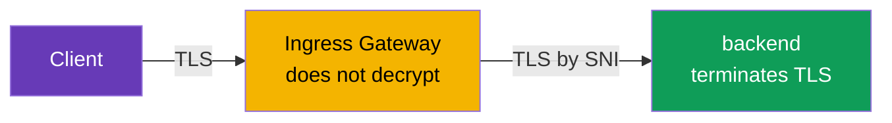
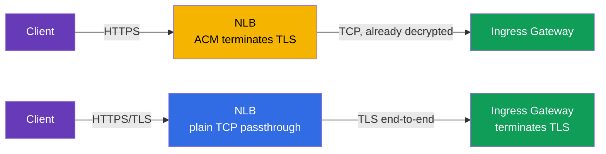
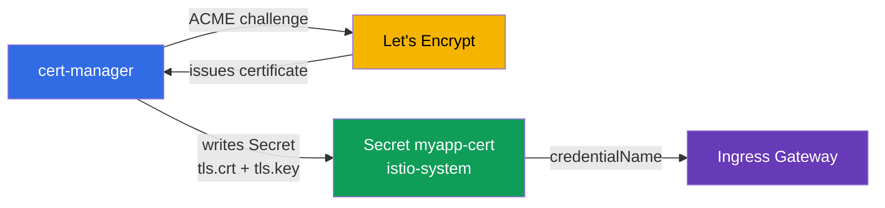

[RU version](ru.md)

# Chapter 9. Edge TLS: ingress in SIMPLE, MUTUAL, PASSTHROUGH modes

> **What's next.** So far traffic from outside reached us over plain HTTP. In production that
> is not acceptable: traffic at the edge must be encrypted over HTTPS. In this chapter we look
> at how to configure TLS on the ingress gateway and what modes exist: SIMPLE (plain HTTPS),
> MUTUAL (client certificate verification) and PASSTHROUGH (encryption all the way to the
> backend).

## 9.1. Where TLS is terminated

First, an important concept. **TLS termination** is the point where encrypted traffic is
decrypted. The choice of mode depends on where this happens.

Three options for inbound traffic:

- The client encrypts, the **ingress gateway decrypts**, and inside the mesh the traffic then
  proceeds as usual. This is SIMPLE and MUTUAL.
- The client encrypts, the gateway **does not decrypt** but passes the encrypted stream on to
  the backend, and the **backend terminates TLS**. This is PASSTHROUGH.

Do not confuse edge TLS with mTLS inside the mesh (chapter 12). Here we are talking about
traffic from outside into the cluster. Internal traffic between services is encrypted by Istio
separately and automatically.

## 9.2. Certificates in a Secret

For TLS you need a certificate and a private key. In Istio they are put into a Kubernetes
`Secret`, and the Gateway references it by name.

```bash
kubectl create -n istio-system secret tls myapp-cert \
  --cert=myapp.crt --key=myapp.key
```

An important detail: the Secret must live in the same namespace where the ingress gateway runs
(usually `istio-system`). The Gateway references it via `credentialName`, and istiod delivers
the certificate to Envoy over SDS (remember from chapter 4 - Secret Discovery Service).

## 9.3. SIMPLE: plain HTTPS

The most common mode. The client connects over HTTPS, the gateway decrypts the traffic and
then hands it to a service inside the mesh.

```yaml
apiVersion: networking.istio.io/v1
kind: Gateway
metadata:
  name: main-gateway
spec:
  selector:
    istio: ingressgateway
  servers:
  - port:
      number: 443
      name: https
      protocol: HTTPS
    tls:
      mode: SIMPLE
      credentialName: myapp-cert   # Secret with the certificate and key
    hosts:
    - myapp.local
```


Key fields:

- **`protocol: HTTPS`** and **`tls.mode: SIMPLE`** - the gateway accepts TLS traffic and
  decrypts it itself.
- **`credentialName`** - the name of the Secret with the server certificate.

After this the application is reachable at `https://myapp.local`. The client verifies the
server certificate, as in any ordinary HTTPS.

## 9.4. Redirect from HTTP to HTTPS

Usually you want clients that arrive over HTTP to be automatically redirected to HTTPS. For
this you add an HTTP server to the Gateway with the `httpsRedirect` flag:

```yaml
  servers:
  - port:
      number: 80
      name: http
      protocol: HTTP
    hosts:
    - myapp.local
    tls:
      httpsRedirect: true    # any HTTP request -> redirect to HTTPS
  - port:
      number: 443
      name: https
      protocol: HTTPS
    tls:
      mode: SIMPLE
      credentialName: myapp-cert
    hosts:
    - myapp.local
```

Now a request to `http://myapp.local` gets a redirect (301) to `https://myapp.local`.

## 9.5. MUTUAL: verifying the client certificate

In SIMPLE only the client verifies the server. But sometimes you also want the **server to
verify the client**: to admit only those who hold a valid client certificate. This is mutual
TLS at the edge, mode `MUTUAL`.

```yaml
    tls:
      mode: MUTUAL
      credentialName: myapp-cert   # here both the server cert and the CA to verify the client
    hosts:
    - myapp.local
```

The difference from SIMPLE: with `MUTUAL` the Secret must also contain a CA certificate
(`ca.crt`) that the gateway uses to verify client certificates. A client without a valid
certificate signed by this CA will not get through the TLS handshake at all.

```bash
# without a client certificate - rejected
curl -sk https://myapp.local:32443/                       # not 200

# with a client certificate - passes
curl -sk --cert client.crt --key client.key https://myapp.local:32443/   # 200
```

MUTUAL is used for B2B APIs, partner integrations, internal admin panels - anywhere access
should be limited to holders of an issued certificate.

## 9.6. PASSTHROUGH: the backend terminates TLS

In SIMPLE and MUTUAL the gateway decrypts the traffic. But sometimes that is undesirable: for
example, the backend wants to manage its own TLS, or you need end-to-end encryption all the
way to the service without being "opened up" at the gateway. Then you use `PASSTHROUGH`: the
gateway does not decrypt the traffic, it passes it through, routing only by SNI (the host name
in TLS).

```yaml
  servers:
  - port:
      number: 443
      name: tls
      protocol: TLS
    tls:
      mode: PASSTHROUGH        # the gateway does not decrypt
    hosts:
    - passthrough.local
```



With PASSTHROUGH you need a VirtualService with a `tls` block and a match by SNI, so the
gateway knows which service to route the encrypted stream to:

```yaml
apiVersion: networking.istio.io/v1
kind: VirtualService
metadata:
  name: passthrough-vs
spec:
  hosts:
  - passthrough.local
  gateways:
  - main-gateway
  tls:                        # tls, not http
  - match:
    - sniHosts:
      - passthrough.local
    route:
    - destination:
        host: secure-backend
        port:
          number: 443
```

Note: since the gateway does not decrypt the traffic, it does not see the HTTP inside either.
So routing is possible only by SNI, not by paths or headers.

## 9.7. Comparing the modes

| Mode | Who terminates TLS | Client verification | When to use |
|------|--------------------|---------------------|-------------|
| `SIMPLE` | ingress gateway | no | ordinary public HTTPS |
| `MUTUAL` | ingress gateway | yes, by client cert | restricted access, B2B, partners |
| `PASSTHROUGH` | the backend itself | depends on the backend | end-to-end encryption, backend holds TLS |

A practical rule: by default take `SIMPLE`. `MUTUAL` - when you need to admit only clients
with a certificate. `PASSTHROUGH` - when the gateway must not see the content and TLS has to
reach the backend untouched.

## 9.8. Where to terminate TLS: on the NLB (ACM) or in Istio

Everything above is TLS termination **in Istio** (the gateway decrypts traffic using a
certificate from a Secret). But on AWS there is an alternative: put a ready certificate from
**AWS Certificate Manager (ACM)** directly on the Network Load Balancer, and then TLS is
terminated **on the balancer**, before Envoy. Technically this is done with annotations on the
gateway Service (`aws-load-balancer-ssl-cert` + `aws-load-balancer-ssl-ports`) - a detailed
breakdown of the annotations is in [chapter 5](../05/en.md). Here what matters is understanding
**which to choose**.



**Option A - TLS on the NLB (offload via ACM).**

Pros:

- AWS manages the certificate: ACM renews it itself, the key never leaves AWS, and nothing
  needs to be loaded into the cluster.
- Offloads the gateway: the crypto is done by the NLB, and Envoy receives already-decrypted
  traffic.
- Simple integration with Route 53/ACM (DNS validation of the certificate in a couple of
  clicks).

Cons:

- Between the NLB and the gateway the traffic travels **without that TLS** (protected only by
  the VPC boundaries). For end-to-end encryption this is not suitable.
- Istio **does not see** the original TLS: you cannot route by SNI, you cannot do `MUTUAL`
  (client certificate verification) on the gateway, and `PASSTHROUGH` loses its meaning.
- The certificate must live in ACM. You **can import** your own certificate (from your own CA
  or Let's Encrypt) into ACM, but such imported certificates are **not renewed automatically**
  by ACM - you will have to re-upload them by hand (auto-renewal works only for certificates
  issued by ACM itself).

**Option B - TLS in Istio (SIMPLE/MUTUAL/PASSTHROUGH), NLB in plain TCP passthrough mode.**

Pros:

- Full control: `MUTUAL` (mTLS at the edge), `PASSTHROUGH`, routing by SNI.
- Any certificate source: your own CA, ACM Private CA, Let's Encrypt via cert-manager
  (section 9.9).
- Encryption reaches the mesh itself, rather than being broken at the balancer.

Cons:

- You manage the certificates yourself (or install cert-manager - see below).
- The crypto load falls on the gateway pods.

| Criterion | TLS on the NLB (ACM) | TLS in Istio |
|-----------|----------------------|--------------|
| Who renews the certificate | AWS (ACM) | you / cert-manager |
| End-to-end encryption to the mesh | no | yes |
| `MUTUAL` (client cert) at the edge | no | yes |
| `PASSTHROUGH` / routing by SNI | no | yes |
| Certificate source | ACM (issued or imported) | any (CA, ACM PCA, Let's Encrypt) |
| Auto-renewal of an imported cert | no (upload manually) | yes (cert-manager) |
| Load on the gateway | lower | higher |

A practical rule: **plain public HTTPS on EKS without mTLS at the edge** - it is more
convenient and cheaper to operate by offloading to NLB+ACM. **If you need `MUTUAL`,
`PASSTHROUGH`, end-to-end encryption or a certificate not from ACM** - terminate in Istio.

## 9.9. Automatic certificates: cert-manager and Let's Encrypt

Loading and renewing certificates by hand (`kubectl create secret tls ...`) is inconvenient
and dangerous in production - forget to renew and the site "goes down". The standard solution
for Istio is [cert-manager](https://cert-manager.io/): it obtains certificates from a
certificate authority over the **ACME** protocol (the best-known ACME provider is the free
**Let's Encrypt**), puts them into a Kubernetes `Secret` and automatically renews them before
they expire.

The scheme is simple: cert-manager creates exactly the `Secret` (`tls.crt` + `tls.key`) that
the Gateway already knows how to reference via `credentialName`. Nothing special is needed for
Istio - it just sees a ready Secret.



First you describe the certificate source - a `ClusterIssuer` (cluster-wide) or an `Issuer`
(namespace-scoped). Here is an example of an ACME issuer for Let's Encrypt with DNS-01
validation via Route 53 (on AWS this is more reliable than HTTP-01, because it does not
require port 80 to be reachable from outside):

```yaml
apiVersion: cert-manager.io/v1
kind: ClusterIssuer
metadata:
  name: letsencrypt-prod
spec:
  acme:
    server: https://acme-v02.api.letsencrypt.org/directory
    email: admin@example.com
    privateKeySecretRef:
      name: letsencrypt-prod-account-key
    solvers:
    - dns01:
        route53:
          region: eu-central-1        # cert-manager proves domain ownership
                                       # via a record in Route 53 (needs IAM permissions)
```

Then - a `Certificate` resource that says "I want a certificate for such-and-such domain, put
it in such-and-such Secret". The Secret must be **in the gateway namespace**
(`istio-system`), otherwise the Gateway will not see it:

```yaml
apiVersion: cert-manager.io/v1
kind: Certificate
metadata:
  name: myapp-cert
  namespace: istio-system          # same place as the ingress gateway
spec:
  secretName: myapp-cert           # cert-manager will create this Secret
  issuerRef:
    name: letsencrypt-prod
    kind: ClusterIssuer
  dnsNames:
  - myapp.example.com
```

After that everything is as in section 9.3 - the Gateway references this Secret:

```yaml
    tls:
      mode: SIMPLE
      credentialName: myapp-cert   # the Secret that cert-manager filled in
```

Briefly on challenges:

- **DNS-01** (the example above) - cert-manager creates a TXT record in the DNS zone (Route 53,
  Cloud DNS, etc.). Works even for internal gateways and for wildcard certificates
  (`*.example.com`).
- **HTTP-01** - Let's Encrypt verifies the domain by requesting a file at
  `http://<domain>/.well-known/...`. For this the gateway's port 80 must be reachable from the
  internet, and the challenge request must reach cert-manager's solver; in combination with
  Istio this is trickier to set up, so on AWS DNS-01 is usually preferred.

Pros of cert-manager+Let's Encrypt: free, fully automatic renewal, a single mechanism for all
domains. Cons: you have to operate cert-manager itself, Let's Encrypt has
[issuance rate limits](https://letsencrypt.org/docs/rate-limits/) (use the staging issuer
`acme-staging-v02` while debugging), and DNS-01 needs permission to modify the DNS zone.

## 9.10. Best practices

- **Always redirect HTTP to HTTPS** (`httpsRedirect: true`, section 9.4) - no plain HTTP in
  production.
- **Set a minimum TLS version.** By default take TLS 1.2 and above, disabling old protocols
  right in the Gateway server:

  ```yaml
    - port:
        number: 443
        name: https
        protocol: HTTPS
      tls:
        mode: SIMPLE
        credentialName: myapp-cert
        minProtocolVersion: TLSV1_2      # forbid TLS 1.0/1.1
        # cipherSuites: [ECDHE-ECDSA-AES256-GCM-SHA384, ...]  # if needed
  ```

- **Automate certificates.** A manual `kubectl create secret tls` is only for labs and
  debugging. In production - cert-manager (Let's Encrypt/your own CA) or ACM on the NLB.
- **Do not store private keys in git.** The key and the certificate are secrets; keep only the
  `Certificate`/`Issuer` manifests in the repository, not the keys themselves.
- **A separate Secret per domain/host.** Do not bundle incompatible domains into one
  certificate; for a set of subdomains use a wildcard (`*.example.com`) or a SAN certificate.
- **Restrict access to the gateway secrets.** The Secrets with keys live in the gateway
  namespace (`istio-system`); lock them down with RBAC so that only those who need them can
  read them.
- **Monitor the validity period.** Even with auto-renewal, watch the expiry date (an alert N
  days ahead) - in case the automation breaks.
- **Separate public and internal traffic** across different ingress gateways (chapter 5): they
  have different certificates and different TLS requirements.
- **HSTS for public sites.** The `Strict-Transport-Security` header forces the browser to
  always use HTTPS; it is added via `headers` in a VirtualService or an EnvoyFilter.

## 9.11. Chapter summary

- Traffic entering the cluster must be encrypted; TLS is configured in the `Gateway` in the
  `tls` block.
- Certificates are stored in a `Secret` in the gateway namespace and are attached via
  `credentialName` (delivery to Envoy goes over SDS).
- **SIMPLE** - ordinary HTTPS: the gateway terminates TLS, the client verifies only the
  server.
- **`httpsRedirect: true`** automatically redirects HTTP to HTTPS.
- **MUTUAL** - the gateway additionally verifies the client certificate; the Secret needs a
  CA.
- **PASSTHROUGH** - the gateway does not decrypt the traffic, the backend terminates it;
  routing only by SNI (you need a VirtualService with `tls` and `sniHosts`).
- TLS can be terminated **on the NLB** with a ready certificate from ACM (offload, AWS renews
  it) or **in Istio** (full control, mTLS/passthrough, any certificate source) - the choice
  depends on whether you need `MUTUAL`, `PASSTHROUGH` and end-to-end encryption.
- In production certificates are issued automatically: **cert-manager + Let's Encrypt** (ACME,
  DNS-01 on AWS) drops in a ready Secret that `credentialName` references.
- Best practices: redirect to HTTPS, `minProtocolVersion: TLSV1_2`, automate issuance, keys
  not in git, RBAC on secrets, monitor the validity period, HSTS.
- Edge TLS is not the same as mTLS inside the mesh (chapter 12).

## 9.12. Self-check questions

1. What does "TLS termination" mean and how, in this sense, do SIMPLE and PASSTHROUGH differ?
2. Where must the Secret with the certificate live and how does the Gateway reference it?
3. How does MUTUAL differ from SIMPLE and what is additionally needed in the Secret?
4. Why can you not route by HTTP paths with PASSTHROUGH, only by SNI?
5. How do you set up an automatic redirect from HTTP to HTTPS?
6. What is the difference between terminating TLS on the NLB (ACM) and in Istio? When do you
   choose which option?
7. How does cert-manager with Let's Encrypt issue a certificate for an Istio Gateway, and why
   is DNS-01 more convenient than HTTP-01 on AWS?
8. What security measures should you apply to edge TLS (protocol version, key storage, access
   to secrets)?

## Practice

Practice TLS termination on the gateway (SIMPLE mode):

🧪 Lab 13: [tasks/ica/labs/13](../../labs/13/README.MD)

Practice the MUTUAL and PASSTHROUGH modes:

🧪 Lab 29: [tasks/ica/labs/29](../../labs/29/README.MD)

---
[Contents](../README.md) · [Chapter 8](../08/en.md) · [Chapter 10](../10/en.md)
