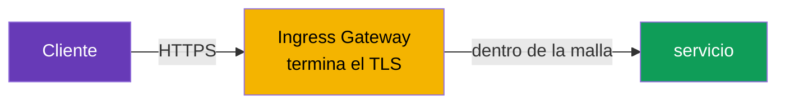
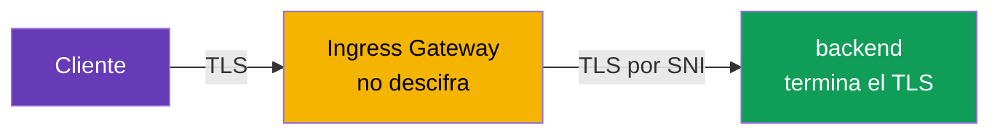
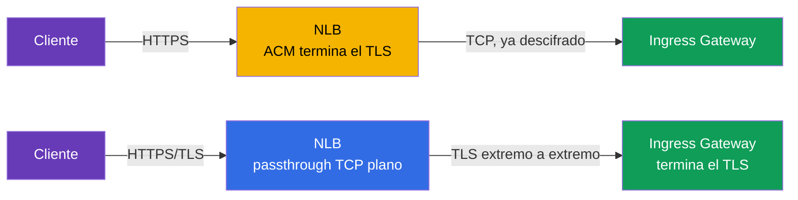
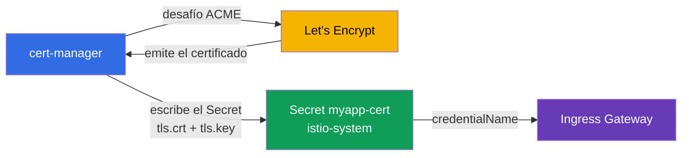

[RU version](ru.md) · [Eng version](en.md)

# Capítulo 9. TLS en el borde: ingress en modos SIMPLE, MUTUAL, PASSTHROUGH

> **Qué sigue.** Hasta ahora el tráfico de fuera nos llegaba por HTTP plano. En producción eso
> no es aceptable: el tráfico en el borde debe ir cifrado por HTTPS. En este capítulo vemos
> cómo configurar TLS en el ingress gateway y qué modos existen: SIMPLE (HTTPS plano), MUTUAL
> (verificación del certificado de cliente) y PASSTHROUGH (cifrado hasta el propio backend).

## 9.1. Dónde se termina el TLS

Primero, un concepto importante. La **terminación de TLS** es el punto donde el tráfico cifrado
se descifra. La elección del modo depende de dónde ocurre esto.

Tres opciones para el tráfico entrante:

- El cliente cifra, el **ingress gateway descifra**, y dentro de la malla el tráfico continúa
  luego como de costumbre. Esto es SIMPLE y MUTUAL.
- El cliente cifra, el gateway **no descifra** sino que pasa el flujo cifrado hacia el backend, y
  el **backend termina el TLS**. Esto es PASSTHROUGH.

No confundas el TLS de borde con el mTLS dentro de la malla (capítulo 12). Aquí hablamos del
tráfico de fuera hacia el clúster. El tráfico interno entre servicios lo cifra Istio por
separado y automáticamente.

## 9.2. Certificados en un Secret

Para TLS necesitas un certificado y una clave privada. En Istio se ponen en un `Secret` de
Kubernetes, y el Gateway lo referencia por su nombre.

```bash
kubectl create -n istio-system secret tls myapp-cert \
  --cert=myapp.crt --key=myapp.key
```

Un detalle importante: el Secret debe vivir en el mismo namespace donde corre el ingress gateway
(normalmente `istio-system`). El Gateway lo referencia vía `credentialName`, e istiod entrega el
certificado a Envoy por SDS (recuerda del capítulo 4, Secret Discovery Service).

## 9.3. SIMPLE: HTTPS plano

El modo más común. El cliente se conecta por HTTPS, el gateway descifra el tráfico y luego se lo
entrega a un servicio dentro de la malla.

```yaml
apiVersion: networking.istio.io/v1
kind: Gateway
metadata:
  name: main-gateway
spec:
  selector:
    istio: ingressgateway
  servers:
  - port:
      number: 443
      name: https
      protocol: HTTPS
    tls:
      mode: SIMPLE
      credentialName: myapp-cert   # Secret con el certificado y la clave
    hosts:
    - myapp.local
```



Campos clave:

- **`protocol: HTTPS`** y **`tls.mode: SIMPLE`**: el gateway acepta tráfico TLS y lo descifra él
  mismo.
- **`credentialName`**: el nombre del Secret con el certificado del servidor.

Tras esto la aplicación es accesible en `https://myapp.local`. El cliente verifica el
certificado del servidor, como en cualquier HTTPS normal.

## 9.4. Redirección de HTTP a HTTPS

Normalmente quieres que los clientes que llegan por HTTP sean redirigidos automáticamente a
HTTPS. Para esto añades un servidor HTTP al Gateway con el flag `httpsRedirect`:

```yaml
  servers:
  - port:
      number: 80
      name: http
      protocol: HTTP
    hosts:
    - myapp.local
    tls:
      httpsRedirect: true    # cualquier petición HTTP -> redirección a HTTPS
  - port:
      number: 443
      name: https
      protocol: HTTPS
    tls:
      mode: SIMPLE
      credentialName: myapp-cert
    hosts:
    - myapp.local
```

Ahora una petición a `http://myapp.local` recibe una redirección (301) a `https://myapp.local`.

## 9.5. MUTUAL: verificar el certificado de cliente

En SIMPLE solo el cliente verifica al servidor. Pero a veces también quieres que el **servidor
verifique al cliente**: admitir solo a quienes poseen un certificado de cliente válido. Esto es
TLS mutuo en el borde, modo `MUTUAL`.

```yaml
    tls:
      mode: MUTUAL
      credentialName: myapp-cert   # aquí tanto el cert del servidor como la CA para verificar al cliente
    hosts:
    - myapp.local
```

La diferencia respecto a SIMPLE: con `MUTUAL` el Secret debe contener también un certificado de
CA (`ca.crt`) que el gateway usa para verificar los certificados de cliente. Un cliente sin un
certificado válido firmado por esta CA no pasará siquiera el handshake TLS.

```bash
# sin certificado de cliente - rechazado
curl -sk https://myapp.local:32443/                       # no 200

# con certificado de cliente - pasa
curl -sk --cert client.crt --key client.key https://myapp.local:32443/   # 200
```

MUTUAL se usa para APIs B2B, integraciones con partners, paneles de administración internos:
donde quiera que el acceso deba limitarse a quienes posean un certificado emitido.

## 9.6. PASSTHROUGH: el backend termina el TLS

En SIMPLE y MUTUAL el gateway descifra el tráfico. Pero a veces eso no es deseable: por ejemplo,
el backend quiere gestionar su propio TLS, o necesitas cifrado extremo a extremo hasta el propio
servicio sin ser "abierto" en el gateway. Entonces usas `PASSTHROUGH`: el gateway no descifra el
tráfico, lo pasa a través, enrutando solo por SNI (el nombre de host en TLS).

```yaml
  servers:
  - port:
      number: 443
      name: tls
      protocol: TLS
    tls:
      mode: PASSTHROUGH        # el gateway no descifra
    hosts:
    - passthrough.local
```



Con PASSTHROUGH necesitas un VirtualService con un bloque `tls` y un match por SNI, para que el
gateway sepa a qué servicio enrutar el flujo cifrado:

```yaml
apiVersion: networking.istio.io/v1
kind: VirtualService
metadata:
  name: passthrough-vs
spec:
  hosts:
  - passthrough.local
  gateways:
  - main-gateway
  tls:                        # tls, no http
  - match:
    - sniHosts:
      - passthrough.local
    route:
    - destination:
        host: secure-backend
        port:
          number: 443
```

Nota: como el gateway no descifra el tráfico, tampoco ve el HTTP de dentro. Así que el
enrutamiento solo es posible por SNI, no por rutas ni cabeceras.

## 9.7. Comparación de los modos

| Modo | Quién termina el TLS | Verificación del cliente | Cuándo usarlo |
|------|----------------------|--------------------------|---------------|
| `SIMPLE` | ingress gateway | no | HTTPS público normal |
| `MUTUAL` | ingress gateway | sí, por cert de cliente | acceso restringido, B2B, partners |
| `PASSTHROUGH` | el propio backend | depende del backend | cifrado extremo a extremo, el backend maneja el TLS |

Una regla práctica: por defecto toma `SIMPLE`. `MUTUAL`: cuando necesitas admitir solo a
clientes con un certificado. `PASSTHROUGH`: cuando el gateway no debe ver el contenido y el TLS
tiene que llegar al backend intacto.

## 9.8. Dónde terminar el TLS: en el NLB (ACM) o en Istio

Todo lo anterior es terminación de TLS **en Istio** (el gateway descifra el tráfico usando un
certificado de un Secret). Pero en AWS hay una alternativa: poner un certificado listo de **AWS
Certificate Manager (ACM)** directamente en el Network Load Balancer, y entonces el TLS se
termina **en el balanceador**, antes de Envoy. Técnicamente esto se hace con anotaciones en el
Service del gateway (`aws-load-balancer-ssl-cert` + `aws-load-balancer-ssl-ports`): un desglose
detallado de las anotaciones está en el [capítulo 5](../05/es.md). Aquí lo que importa es
entender **cuál elegir**.



**Opción A: TLS en el NLB (offload vía ACM).**

Pros:

- AWS gestiona el certificado: ACM lo renueva por sí mismo, la clave nunca sale de AWS y no hay
  que cargar nada en el clúster.
- Descarga el gateway: la criptografía la hace el NLB, y Envoy recibe tráfico ya descifrado.
- Integración sencilla con Route 53/ACM (validación por DNS del certificado en un par de
  clics).

Contras:

- Entre el NLB y el gateway el tráfico viaja **sin ese TLS** (protegido solo por los límites de
  la VPC). Para cifrado extremo a extremo esto no sirve.
- Istio **no ve** el TLS original: no puedes enrutar por SNI, no puedes hacer `MUTUAL`
  (verificación del certificado de cliente) en el gateway, y `PASSTHROUGH` pierde su sentido.
- El certificado debe vivir en ACM. **Puedes importar** tu propio certificado (de tu propia CA
  o de Let's Encrypt) a ACM, pero esos certificados importados **ACM no los renueva
  automáticamente**: tendrás que volver a subirlos a mano (la autorrenovación solo funciona
  para certificados emitidos por el propio ACM).

**Opción B: TLS en Istio (SIMPLE/MUTUAL/PASSTHROUGH), NLB en modo passthrough TCP plano.**

Pros:

- Control total: `MUTUAL` (mTLS en el borde), `PASSTHROUGH`, enrutamiento por SNI.
- Cualquier fuente de certificado: tu propia CA, ACM Private CA, Let's Encrypt vía cert-manager
  (sección 9.9).
- El cifrado llega hasta la propia malla, en lugar de romperse en el balanceador.

Contras:

- Gestionas los certificados tú mismo (o instalas cert-manager, ver abajo).
- La carga criptográfica recae sobre los pods del gateway.

| Criterio | TLS en el NLB (ACM) | TLS en Istio |
|----------|---------------------|--------------|
| Quién renueva el certificado | AWS (ACM) | tú / cert-manager |
| Cifrado extremo a extremo hasta la malla | no | sí |
| `MUTUAL` (cert de cliente) en el borde | no | sí |
| `PASSTHROUGH` / enrutamiento por SNI | no | sí |
| Fuente del certificado | ACM (emitido o importado) | cualquiera (CA, ACM PCA, Let's Encrypt) |
| Autorrenovación de un cert importado | no (subir a mano) | sí (cert-manager) |
| Carga sobre el gateway | menor | mayor |

Una regla práctica: **HTTPS público plano en EKS sin mTLS en el borde**: es más cómodo y barato
de operar delegándolo a NLB+ACM. **Si necesitas `MUTUAL`, `PASSTHROUGH`, cifrado extremo a
extremo o un certificado que no sea de ACM**: termina en Istio.

## 9.9. Certificados automáticos: cert-manager y Let's Encrypt

Cargar y renovar certificados a mano (`kubectl create secret tls ...`) es incómodo y peligroso
en producción: se te olvida renovar y el sitio "se cae". La solución estándar para Istio es
[cert-manager](https://cert-manager.io/): obtiene certificados de una autoridad de certificación
mediante el protocolo **ACME** (el proveedor de ACME más conocido es el gratuito **Let's
Encrypt**), los pone en un `Secret` de Kubernetes y los renueva automáticamente antes de que
expiren.

El esquema es simple: cert-manager crea exactamente el `Secret` (`tls.crt` + `tls.key`) que el
Gateway ya sabe referenciar vía `credentialName`. No hace falta nada especial para Istio:
simplemente ve un Secret listo.



Primero describes la fuente del certificado: un `ClusterIssuer` (a nivel de clúster) o un
`Issuer` (con alcance de namespace). Aquí tienes un ejemplo de un issuer ACME para Let's Encrypt
con validación DNS-01 vía Route 53 (en AWS esto es más fiable que HTTP-01, porque no requiere
que el puerto 80 sea accesible desde fuera):

```yaml
apiVersion: cert-manager.io/v1
kind: ClusterIssuer
metadata:
  name: letsencrypt-prod
spec:
  acme:
    server: https://acme-v02.api.letsencrypt.org/directory
    email: admin@example.com
    privateKeySecretRef:
      name: letsencrypt-prod-account-key
    solvers:
    - dns01:
        route53:
          region: eu-central-1        # cert-manager demuestra la propiedad del dominio
                                       # vía un registro en Route 53 (necesita permisos IAM)
```

Luego, un recurso `Certificate` que dice "quiero un certificado para tal dominio, ponlo en tal
Secret". El Secret debe estar **en el namespace del gateway** (`istio-system`), de lo contrario
el Gateway no lo verá:

```yaml
apiVersion: cert-manager.io/v1
kind: Certificate
metadata:
  name: myapp-cert
  namespace: istio-system          # el mismo lugar que el ingress gateway
spec:
  secretName: myapp-cert           # cert-manager creará este Secret
  issuerRef:
    name: letsencrypt-prod
    kind: ClusterIssuer
  dnsNames:
  - myapp.example.com
```

Tras eso todo es como en la sección 9.3: el Gateway referencia este Secret:

```yaml
    tls:
      mode: SIMPLE
      credentialName: myapp-cert   # el Secret que cert-manager rellenó
```

Brevemente sobre los desafíos:

- **DNS-01** (el ejemplo de arriba): cert-manager crea un registro TXT en la zona DNS (Route 53,
  Cloud DNS, etc.). Funciona incluso para gateways internos y para certificados wildcard
  (`*.example.com`).
- **HTTP-01**: Let's Encrypt verifica el dominio solicitando un archivo en
  `http://<domain>/.well-known/...`. Para esto el puerto 80 del gateway debe ser accesible desde
  internet, y la petición del desafío debe llegar al solver de cert-manager; en combinación con
  Istio esto es más engorroso de configurar, así que en AWS normalmente se prefiere DNS-01.

Pros de cert-manager+Let's Encrypt: gratis, renovación totalmente automática, un único mecanismo
para todos los dominios. Contras: tienes que operar el propio cert-manager, Let's Encrypt tiene
[límites de emisión (rate limits)](https://letsencrypt.org/docs/rate-limits/) (usa el issuer de
staging `acme-staging-v02` mientras depuras), y DNS-01 necesita permiso para modificar la zona
DNS.

## 9.10. Buenas prácticas

- **Redirige siempre HTTP a HTTPS** (`httpsRedirect: true`, sección 9.4): nada de HTTP plano en
  producción.
- **Fija una versión mínima de TLS.** Por defecto toma TLS 1.2 y superior, deshabilitando
  protocolos antiguos directamente en el servidor del Gateway:

  ```yaml
    - port:
        number: 443
        name: https
        protocol: HTTPS
      tls:
        mode: SIMPLE
        credentialName: myapp-cert
        minProtocolVersion: TLSV1_2      # prohibir TLS 1.0/1.1
        # cipherSuites: [ECDHE-ECDSA-AES256-GCM-SHA384, ...]  # si hace falta
  ```

- **Automatiza los certificados.** Un `kubectl create secret tls` manual es solo para
  laboratorios y depuración. En producción: cert-manager (Let's Encrypt/tu propia CA) o ACM en
  el NLB.
- **No guardes claves privadas en git.** La clave y el certificado son secretos; mantén en el
  repositorio solo los manifiestos `Certificate`/`Issuer`, no las claves mismas.
- **Un Secret aparte por dominio/host.** No juntes dominios incompatibles en un mismo
  certificado; para un conjunto de subdominios usa un wildcard (`*.example.com`) o un
  certificado SAN.
- **Restringe el acceso a los secrets del gateway.** Los Secrets con claves viven en el
  namespace del gateway (`istio-system`); bloquéalos con RBAC para que solo quienes los necesiten
  puedan leerlos.
- **Vigila el periodo de validez.** Incluso con autorrenovación, vigila la fecha de expiración
  (una alerta N días antes) por si la automatización falla.
- **Separa el tráfico público del interno** en distintos ingress gateways (capítulo 5): tienen
  certificados distintos y requisitos de TLS distintos.
- **HSTS para sitios públicos.** La cabecera `Strict-Transport-Security` obliga al navegador a
  usar siempre HTTPS; se añade vía `headers` en un VirtualService o un EnvoyFilter.

## 9.11. Resumen del capítulo

- El tráfico que entra en el clúster debe ir cifrado; el TLS se configura en el `Gateway` en el
  bloque `tls`.
- Los certificados se guardan en un `Secret` en el namespace del gateway y se adjuntan vía
  `credentialName` (la entrega a Envoy va por SDS).
- **SIMPLE**: HTTPS normal: el gateway termina el TLS, el cliente verifica solo al servidor.
- **`httpsRedirect: true`** redirige automáticamente HTTP a HTTPS.
- **MUTUAL**: el gateway además verifica el certificado de cliente; el Secret necesita una CA.
- **PASSTHROUGH**: el gateway no descifra el tráfico, el backend lo termina; enrutamiento solo
  por SNI (necesitas un VirtualService con `tls` y `sniHosts`).
- El TLS se puede terminar **en el NLB** con un certificado listo de ACM (offload, AWS lo
  renueva) o **en Istio** (control total, mTLS/passthrough, cualquier fuente de certificado): la
  elección depende de si necesitas `MUTUAL`, `PASSTHROUGH` y cifrado extremo a extremo.
- En producción los certificados se emiten automáticamente: **cert-manager + Let's Encrypt**
  (ACME, DNS-01 en AWS) deja caer un Secret listo al que `credentialName` referencia.
- Buenas prácticas: redirección a HTTPS, `minProtocolVersion: TLSV1_2`, automatizar la emisión,
  claves fuera de git, RBAC sobre los secrets, vigilar el periodo de validez, HSTS.
- El TLS de borde no es lo mismo que el mTLS dentro de la malla (capítulo 12).

## 9.12. Preguntas de autoevaluación

1. ¿Qué significa "terminación de TLS" y cómo, en ese sentido, se diferencian SIMPLE y
   PASSTHROUGH?
2. ¿Dónde debe vivir el Secret con el certificado y cómo lo referencia el Gateway?
3. ¿En qué se diferencia MUTUAL de SIMPLE y qué se necesita adicionalmente en el Secret?
4. ¿Por qué no puedes enrutar por rutas HTTP con PASSTHROUGH, solo por SNI?
5. ¿Cómo configuras una redirección automática de HTTP a HTTPS?
6. ¿Cuál es la diferencia entre terminar el TLS en el NLB (ACM) y en Istio? ¿Cuándo eliges cada
   opción?
7. ¿Cómo emite cert-manager con Let's Encrypt un certificado para un Gateway de Istio, y por qué
   DNS-01 es más cómodo que HTTP-01 en AWS?
8. ¿Qué medidas de seguridad deberías aplicar al TLS de borde (versión del protocolo,
   almacenamiento de claves, acceso a los secrets)?

## Práctica

Practica la terminación de TLS en el gateway (modo SIMPLE):

🧪 Laboratorio 13: [tasks/ica/labs/13](../../labs/13/README_ES.MD)

Practica los modos MUTUAL y PASSTHROUGH:

🧪 Laboratorio 29: [tasks/ica/labs/29](../../labs/29/README_ES.MD)

---
[Índice](../README_ES.md) · [Capítulo 8](../08/es.md) · [Capítulo 10](../10/es.md)
