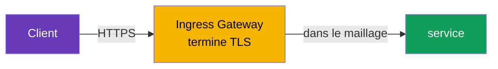
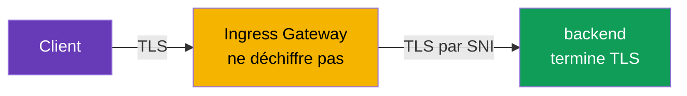
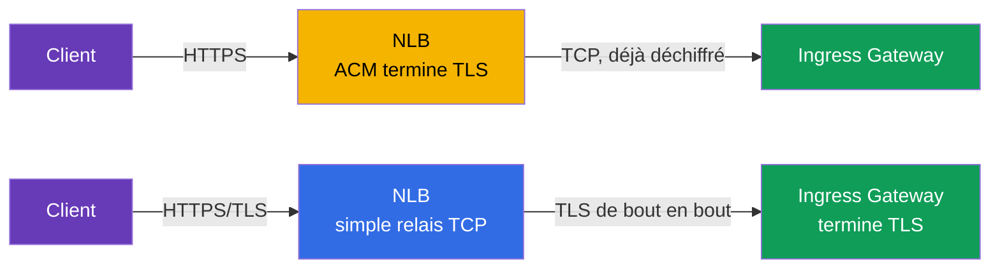
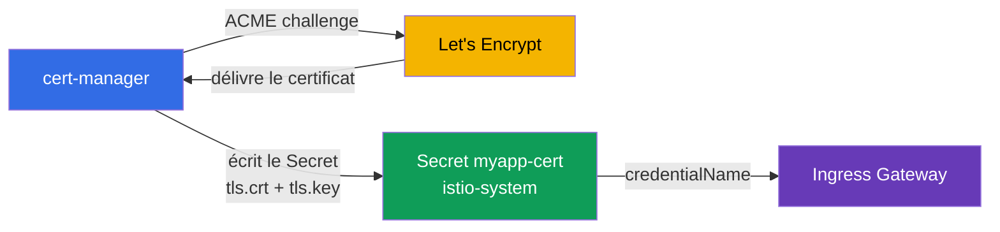

[RU version](ru.md) · [Eng version](en.md) · [Versión en español](es.md) · [Deutsche Version](de.md)

# Chapitre 9. Edge TLS : ingress en modes SIMPLE, MUTUAL, PASSTHROUGH

> **Ce qui suit.** Jusqu'à présent, le trafic venu de l'extérieur nous parvenait en HTTP
> ordinaire. En production, c'est inacceptable : le trafic en entrée (edge) doit être
> chiffré en HTTPS. Dans ce chapitre, nous verrons comment configurer TLS sur l'ingress
> gateway et quels modes existent : SIMPLE (HTTPS ordinaire), MUTUAL (vérification du
> certificat client) et PASSTHROUGH (chiffrement jusqu'au backend lui-même).

## 9.1. Où TLS est terminé

D'abord une notion importante. La **terminaison TLS** est le point où le trafic chiffré est
déchiffré. C'est de l'endroit où cela se produit que dépend le choix du mode.

Trois options pour le trafic entrant :

- Le client chiffre, l'**ingress gateway déchiffre**, puis à l'intérieur du maillage le
  trafic circule selon sa propre logique. C'est SIMPLE et MUTUAL.
- Le client chiffre, le gateway **ne déchiffre pas** mais laisse passer le flux chiffré
  jusqu'au backend, et c'est alors le **backend qui termine TLS**. C'est PASSTHROUGH.

Ne confondez pas l'edge TLS avec le mTLS interne au maillage (chapitre 12). Ici, il s'agit du
trafic venu de l'extérieur vers le cluster. Le trafic interne entre services, Istio le chiffre
séparément et automatiquement.

## 9.2. Certificats dans un Secret

Pour TLS, il faut un certificat et une clé privée. Dans Istio, on les place dans un `Secret`
Kubernetes, et le Gateway y fait référence par son nom.

```bash
kubectl create -n istio-system secret tls myapp-cert \
  --cert=myapp.crt --key=myapp.key
```

Détail important : le Secret doit se trouver dans le même namespace que celui où fonctionne
l'ingress gateway (généralement `istio-system`). Le Gateway y fait référence via
`credentialName`, et istiod livre le certificat à Envoy par SDS (souvenez-vous du chapitre 4 -
Secret Discovery Service).

## 9.3. SIMPLE : HTTPS ordinaire

Le mode le plus fréquent. Le client se connecte en HTTPS, le gateway déchiffre le trafic et le
transmet ensuite au service à l'intérieur du maillage.

```yaml
apiVersion: networking.istio.io/v1
kind: Gateway
metadata:
  name: main-gateway
spec:
  selector:
    istio: ingressgateway
  servers:
  - port:
      number: 443
      name: https
      protocol: HTTPS
    tls:
      mode: SIMPLE
      credentialName: myapp-cert   # Secret avec le certificat et la clé
    hosts:
    - myapp.local
```



Champs clés :

- **`protocol: HTTPS`** et **`tls.mode: SIMPLE`** - le gateway reçoit le trafic TLS et le
  déchiffre lui-même.
- **`credentialName`** - nom du Secret contenant le certificat serveur.

Après cela, l'application est accessible via `https://myapp.local`. Le client vérifie le
certificat du serveur, comme dans n'importe quel HTTPS ordinaire.

## 9.4. Redirection de HTTP vers HTTPS

Généralement, on veut que les clients arrivés en HTTP soient automatiquement redirigés vers
HTTPS. Pour cela, on ajoute au Gateway un serveur HTTP avec l'indicateur `httpsRedirect` :

```yaml
  servers:
  - port:
      number: 80
      name: http
      protocol: HTTP
    hosts:
    - myapp.local
    tls:
      httpsRedirect: true    # toute requête HTTP -> redirection vers HTTPS
  - port:
      number: 443
      name: https
      protocol: HTTPS
    tls:
      mode: SIMPLE
      credentialName: myapp-cert
    hosts:
    - myapp.local
```

Désormais, une requête vers `http://myapp.local` obtiendra une redirection (301) vers
`https://myapp.local`.

## 9.5. MUTUAL : vérification du certificat client

En SIMPLE, seul le client vérifie le serveur. Mais parfois il faut aussi que le **serveur
vérifie le client** : n'admettre que ceux qui possèdent un certificat client valide. C'est le
mutual TLS en entrée, le mode `MUTUAL`.

```yaml
    tls:
      mode: MUTUAL
      credentialName: myapp-cert   # ici, le cert serveur et le CA pour vérifier le client
    hosts:
    - myapp.local
```

Différence avec SIMPLE : en `MUTUAL`, le Secret doit aussi contenir un certificat CA
(`ca.crt`) avec lequel le gateway vérifie les certificats clients. Un client sans certificat
valide signé par ce CA ne passera pas du tout le handshake TLS.

```bash
# sans certificat client - refus
curl -sk https://myapp.local:32443/                       # pas 200

# avec certificat client - passe
curl -sk --cert client.crt --key client.key https://myapp.local:32443/   # 200
```

MUTUAL s'applique aux API B2B, aux intégrations partenaires, aux consoles d'administration
internes - partout où l'accès ne doit être réservé qu'aux détenteurs d'un certificat délivré.

## 9.6. PASSTHROUGH : le backend termine TLS

En SIMPLE et MUTUAL, le gateway déchiffre le trafic. Mais parfois c'est indésirable : par
exemple, le backend veut gérer son propre TLS, ou l'on exige un chiffrement de bout en bout
jusqu'au service lui-même sans « ouverture » au niveau du gateway. On utilise alors
`PASSTHROUGH` : le gateway ne déchiffre pas le trafic, il le laisse passer tel quel, en se
repérant uniquement sur le SNI (le nom d'hôte dans TLS).

```yaml
  servers:
  - port:
      number: 443
      name: tls
      protocol: TLS
    tls:
      mode: PASSTHROUGH        # le gateway ne déchiffre pas
    hosts:
    - passthrough.local
```



En PASSTHROUGH, il faut un VirtualService avec un bloc `tls` et un match par SNI, pour que le
gateway comprenne vers quel service diriger le flux chiffré :

```yaml
apiVersion: networking.istio.io/v1
kind: VirtualService
metadata:
  name: passthrough-vs
spec:
  hosts:
  - passthrough.local
  gateways:
  - main-gateway
  tls:                        # précisément tls, et non http
  - match:
    - sniHosts:
      - passthrough.local
    route:
    - destination:
        host: secure-backend
        port:
          number: 443
```

Notez bien : puisque le gateway ne déchiffre pas le trafic, il ne voit pas non plus le HTTP à
l'intérieur. Le routage n'est donc possible que par SNI, et non par chemins ou en-têtes.

## 9.7. Comparaison des modes

| Mode | Qui termine TLS | Vérification du client | Quand l'utiliser |
|-------|---------------------|------------------|--------------------|
| `SIMPLE` | ingress gateway | non | HTTPS public ordinaire |
| `MUTUAL` | ingress gateway | oui, par certificat client | accès restreint, B2B, partenaires |
| `PASSTHROUGH` | le backend lui-même | dépend du backend | chiffrement de bout en bout, le backend gère TLS |

Règle pratique : par défaut, prenez `SIMPLE`. `MUTUAL` - quand il faut n'admettre que par
certificat client. `PASSTHROUGH` - quand le gateway ne doit pas voir le contenu et que TLS doit
atteindre le backend intact.

## 9.8. Où terminer TLS : sur le NLB (ACM) ou dans Istio

Tout ce qui précède, c'est la terminaison TLS **dans Istio** (le gateway déchiffre le trafic
avec le certificat issu d'un Secret). Mais sur AWS il existe une alternative : attacher un
certificat prêt à l'emploi issu d'**AWS Certificate Manager (ACM)** directement au Network Load
Balancer, et alors TLS est terminé **sur le balanceur**, avant même Envoy. Techniquement, cela
se fait via des annotations sur le Service du gateway (`aws-load-balancer-ssl-cert` +
`aws-load-balancer-ssl-ports`) - l'analyse détaillée des annotations se trouve au
[chapitre 5](../05/ru.md). Ici, l'important est de comprendre **quoi choisir**.



**Option A - TLS sur le NLB (offload via ACM).**

Avantages :

- Le certificat est géré par AWS : ACM le renouvelle lui-même, la clé ne quitte pas AWS, il n'y
  a rien à charger dans le cluster.
- Décharge du gateway : la cryptographie est faite par le NLB, Envoy reçoit le trafic déjà
  déchiffré.
- Intégration simple avec Route 53/ACM (validation DNS du certificat en quelques clics).

Inconvénients :

- Entre le NLB et le gateway, le trafic circule **sans ce TLS** (protégé uniquement par les
  frontières du VPC). Pour un chiffrement de bout en bout, cela ne convient pas.
- Istio **ne voit pas** le TLS d'origine : impossible de router par SNI, impossible de faire du
  `MUTUAL` (vérification du certificat client) au niveau du gateway, `PASSTHROUGH` perd son
  sens.
- Le certificat doit se trouver dans ACM. Un certificat propre (issu de votre CA ou de Let's
  Encrypt) **peut être importé** dans ACM, mais ACM **ne renouvelle pas automatiquement** ces
  certificats importés - il faudra les recharger manuellement (le renouvellement automatique ne
  fonctionne que pour les certificats émis par ACM lui-même).

**Option B - TLS dans Istio (SIMPLE/MUTUAL/PASSTHROUGH), NLB en mode relais TCP.**

Avantages :

- Contrôle total : `MUTUAL` (mTLS en entrée), `PASSTHROUGH`, routage par SNI.
- N'importe quelle source de certificat : votre CA, ACM Private CA, Let's Encrypt via
  cert-manager (section 9.9).
- Le chiffrement atteint le maillage lui-même, au lieu de s'interrompre sur le balanceur.

Inconvénients :

- Vous gérez les certificats vous-même (ou vous installez cert-manager - voir ci-dessous).
- La charge cryptographique repose sur les pods du gateway.

| Critère | TLS sur le NLB (ACM) | TLS dans Istio |
|----------|------------------|-------------|
| Qui renouvelle le certificat | AWS (ACM) | vous / cert-manager |
| Chiffrement de bout en bout jusqu'au maillage | non | oui |
| `MUTUAL` (cert client) en entrée | non | oui |
| `PASSTHROUGH` / routage par SNI | non | oui |
| Source du certificat | ACM (émis ou importé) | n'importe laquelle (CA, ACM PCA, Let's Encrypt) |
| Renouvellement auto du cert importé | non (charger manuellement) | oui (cert-manager) |
| Charge sur le gateway | plus faible | plus élevée |

Règle pratique : **HTTPS public simple sur EKS sans mTLS en entrée** - il est plus commode et
moins coûteux à exploiter de le confier à NLB+ACM. **Besoin de `MUTUAL`, `PASSTHROUGH`, de
chiffrement de bout en bout ou d'un certificat hors ACM** - terminez dans Istio.

## 9.9. Certificats automatiques : cert-manager et Let's Encrypt

Charger et renouveler les certificats à la main (`kubectl create secret tls ...`) en production
est peu pratique et dangereux - vous oublierez de renouveler, et le site « tombera ». La
solution standard pour Istio est [cert-manager](https://cert-manager.io/) : il obtient
lui-même les certificats auprès d'une autorité de certification via le protocole **ACME** (le
fournisseur ACME le plus connu est le gratuit **Let's Encrypt**), les place dans un `Secret`
Kubernetes et les renouvelle automatiquement avant expiration.

Le schéma est simple : cert-manager crée exactement le `Secret` (`tls.crt` + `tls.key`) auquel
le Gateway sait déjà faire référence via `credentialName`. Pour Istio, rien de spécial n'est
nécessaire - il voit simplement un Secret prêt à l'emploi.



On décrit d'abord la source des certificats - `ClusterIssuer` (commun à tout le cluster) ou
`Issuer` (dans le cadre d'un namespace). Exemple d'issuer ACME pour Let's Encrypt avec
vérification DNS-01 via Route 53 (sur AWS, c'est plus fiable que HTTP-01, car cela n'exige pas
que le port 80 soit accessible depuis l'extérieur) :

```yaml
apiVersion: cert-manager.io/v1
kind: ClusterIssuer
metadata:
  name: letsencrypt-prod
spec:
  acme:
    server: https://acme-v02.api.letsencrypt.org/directory
    email: admin@example.com
    privateKeySecretRef:
      name: letsencrypt-prod-account-key
    solvers:
    - dns01:
        route53:
          region: eu-central-1        # cert-manager confirme la propriété du domaine
                                       # via un enregistrement dans Route 53 (droits IAM requis)
```

Ensuite - la ressource `Certificate`, qui dit « je veux un certificat pour tel domaine, place-le
dans tel Secret ». Le Secret doit obligatoirement être **dans le namespace du gateway**
(`istio-system`), sinon le Gateway ne le verra pas :

```yaml
apiVersion: cert-manager.io/v1
kind: Certificate
metadata:
  name: myapp-cert
  namespace: istio-system          # au même endroit que l'ingress gateway
spec:
  secretName: myapp-cert           # cert-manager créera ce Secret
  issuerRef:
    name: letsencrypt-prod
    kind: ClusterIssuer
  dnsNames:
  - myapp.example.com
```

Ensuite, tout se passe comme à la section 9.3 - le Gateway fait référence à ce Secret :

```yaml
    tls:
      mode: SIMPLE
      credentialName: myapp-cert   # Secret rempli par cert-manager
```

À propos du challenge, en bref :

- **DNS-01** (exemple ci-dessus) - cert-manager crée un enregistrement TXT dans la zone DNS
  (Route 53, Cloud DNS, etc.). Fonctionne même pour les gateways internes et pour les
  certificats wildcard (`*.example.com`).
- **HTTP-01** - Let's Encrypt vérifie le domaine en demandant un fichier via
  `http://<domaine>/.well-known/...`. Pour cela, le port 80 du gateway doit être accessible
  depuis internet, et la requête de challenge doit atteindre le solver de cert-manager ; en
  combinaison avec Istio, c'est plus complexe à configurer, c'est pourquoi sur AWS on prend plus
  souvent DNS-01.

Avantages de cert-manager+Let's Encrypt : gratuit, renouvellement entièrement automatique,
mécanisme unifié pour tous les domaines. Inconvénients : il faut exploiter cert-manager
lui-même, Let's Encrypt a des [limites d'émission](https://letsencrypt.org/docs/rate-limits/)
(utilisez l'issuer de staging `acme-staging-v02` lors de la mise au point), et pour DNS-01 il
faut des droits de modification de la zone DNS.

## 9.10. Bonnes pratiques

- **Redirigez toujours HTTP vers HTTPS** (`httpsRedirect: true`, section 9.4) - aucun HTTP en
  clair en production.
- **Définissez une version TLS minimale.** Par défaut, prenez TLS 1.2 ou supérieur, en
  désactivant les anciens protocoles directement dans le serveur du Gateway :

  ```yaml
    - port:
        number: 443
        name: https
        protocol: HTTPS
      tls:
        mode: SIMPLE
        credentialName: myapp-cert
        minProtocolVersion: TLSV1_2      # interdire TLS 1.0/1.1
        # cipherSuites: [ECDHE-ECDSA-AES256-GCM-SHA384, ...]  # si nécessaire
  ```

- **Automatisez les certificats.** Le `kubectl create secret tls` manuel - uniquement pour les
  labs et la mise au point. En production - cert-manager (Let's Encrypt/votre CA) ou ACM sur le
  NLB.
- **Ne stockez pas les clés privées dans git.** La clé et le certificat sont des secrets ; dans
  le dépôt on ne garde que les manifestes `Certificate`/`Issuer`, mais pas les clés elles-mêmes.
- **Un Secret distinct par domaine/hôte.** Ne mettez pas des domaines incompatibles dans un
  seul certificat ; pour un ensemble de sous-domaines, prenez un wildcard (`*.example.com`) ou
  un certificat SAN.
- **Restreignez l'accès aux secrets du gateway.** Les Secrets contenant les clés se trouvent
  dans le namespace du gateway (`istio-system`) ; fermez-en l'accès par RBAC, pour que seuls
  ceux qui en ont besoin puissent les lire.
- **Surveillez la date d'expiration.** Même avec le renouvellement automatique, surveillez la
  date d'expiration (alerte N jours avant) - au cas où l'automatisme se briserait.
- **Séparez le trafic public et interne** sur des ingress gateway différents (chapitre 5) : ils
  ont des certificats différents et des exigences TLS différentes.
- **HSTS pour les sites publics.** L'en-tête `Strict-Transport-Security` force le navigateur à
  toujours passer par HTTPS ; on l'ajoute via `headers` dans un VirtualService ou un EnvoyFilter.

## 9.11. Résumé du chapitre

- Le trafic entrant dans le cluster doit être chiffré ; TLS se configure dans le `Gateway` dans
  le bloc `tls`.
- Les certificats sont stockés dans un `Secret` dans le namespace du gateway et connectés via
  `credentialName` (la livraison à Envoy passe par SDS).
- **SIMPLE** - HTTPS ordinaire : le gateway termine TLS, le client ne vérifie que le serveur.
- **`httpsRedirect: true`** redirige automatiquement HTTP vers HTTPS.
- **MUTUAL** - le gateway vérifie en plus le certificat client ; il faut un CA dans le Secret.
- **PASSTHROUGH** - le gateway ne déchiffre pas le trafic, c'est le backend qui le termine ;
  routage uniquement par SNI (il faut un VirtualService avec `tls` et `sniHosts`).
- TLS peut être terminé **sur le NLB** avec un certificat prêt issu d'ACM (offload, AWS renouvelle
  lui-même) ou **dans Istio** (contrôle total, mTLS/passthrough, n'importe quelle source de
  certificat) - le choix dépend de la nécessité de `MUTUAL`, `PASSTHROUGH` et du chiffrement de
  bout en bout.
- En production, les certificats sont émis automatiquement : **cert-manager + Let's Encrypt**
  (ACME, DNS-01 sur AWS) place un Secret prêt auquel `credentialName` fait référence.
- Bonnes pratiques : redirection vers HTTPS, `minProtocolVersion: TLSV1_2`, automatisation de
  l'émission, clés hors git, RBAC sur les secrets, surveillance de l'expiration, HSTS.
- L'edge TLS n'est pas la même chose que le mTLS interne au maillage (chapitre 12).

## 9.12. Questions d'auto-évaluation

1. Que signifie « terminaison TLS » et en quoi, en ce sens, SIMPLE et PASSTHROUGH diffèrent-ils ?
2. Où doit se trouver le Secret contenant le certificat et comment le Gateway y fait-il
   référence ?
3. En quoi MUTUAL diffère-t-il de SIMPLE et que faut-il en plus dans le Secret ?
4. Pourquoi, en PASSTHROUGH, ne peut-on pas router par chemins HTTP, mais seulement par SNI ?
5. Comment configurer la redirection automatique de HTTP vers HTTPS ?
6. Quelle est la différence entre la terminaison TLS sur le NLB (ACM) et dans Istio ? Quand
   choisir l'une ou l'autre option ?
7. Comment cert-manager avec Let's Encrypt délivre-t-il un certificat pour un Istio Gateway et
   pourquoi sur AWS DNS-01 est-il plus commode que HTTP-01 ?
8. Quelles mesures de sécurité appliquer à l'edge TLS (version du protocole, stockage des clés,
   accès aux secrets) ?

## Pratique

Exercez-vous à la terminaison TLS sur le gateway (mode SIMPLE) :

🧪 Lab 13 : [tasks/ica/labs/13](../../labs/13/README_FR.MD)

Exercez-vous aux modes MUTUAL et PASSTHROUGH :

🧪 Lab 29 : [tasks/ica/labs/29](../../labs/29/README_FR.MD)

---
[Table des matières](../README_FR.md) · [Chapitre 8](../08/fr.md) · [Chapitre 10](../10/fr.md)
