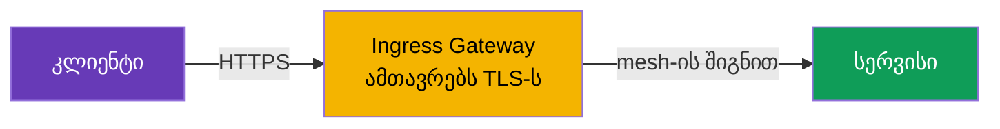
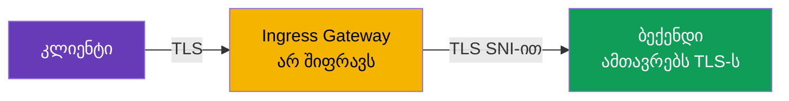
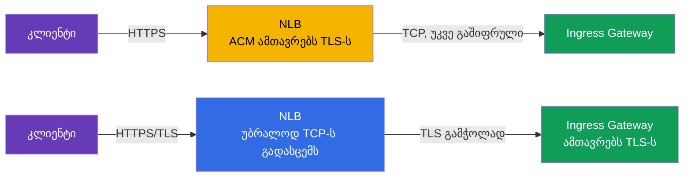
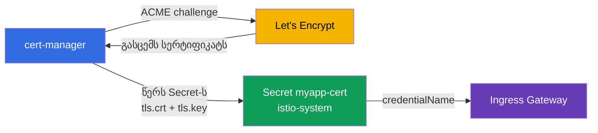

[Русская версия](ru.md) · [Eng version](en.md) · [Versión en español](es.md) · [Version française](fr.md) · [Deutsche Version](de.md) · [繁體中文版](tw.md) · [日本語版](jp.md)

# თავი 9. Edge TLS: ingress SIMPLE, MUTUAL და PASSTHROUGH რეჟიმებში

> **რა იქნება შემდეგ.** აქამდე გარედან ტრაფიკი ჩვენამდე ჩვეულებრივი HTTP-ით მოდიოდა.
> production-ში ასე არ შეიძლება: შემომავალი (edge) ტრაფიკი HTTPS-ით უნდა იყოს დაშიფრული.
> ამ თავში განვიხილავთ, როგორ დავაკონფიგურიროთ TLS ingress gateway-ზე და რა რეჟიმები
> არსებობს: SIMPLE (ჩვეულებრივი HTTPS), MUTUAL (კლიენტის სერტიფიკატის შემოწმება) და
> PASSTHROUGH (დაშიფვრა უშუალოდ ბეკენდამდე).

## 9.1. სად სრულდება TLS

თავდაპირველად მნიშვნელოვანი ცნება განვიხილოთ. **TLS-ის ტერმინაცია** არის წერტილი, სადაც
დაშიფრული ტრაფიკის გაშიფვრა ხდება. რეჟიმის არჩევანი სწორედ იმაზეა დამოკიდებული, თუ სად ხდება ეს.

შემომავალი ტრაფიკისთვის სამი ვარიანტია:

- კლიენტი შიფრავს, **ingress gateway გაშიფრავს**, შემდეგ კი mesh-ის შიგნით ტრაფიკი
  ჩვეულებრივ აგრძელებს მოძრაობას. ეს არის SIMPLE და MUTUAL.
- კლიენტი შიფრავს, gateway **არ გაშიფრავს**, არამედ დაშიფრულ ნაკადს ბეკენდამდე ატარებს
  და TLS-ს უკვე **ბეკენდი ასრულებს**. ეს არის PASSTHROUGH.

არ აგერიოთ edge TLS და mesh-ის შიგნით მოქმედი mTLS (თავი 12). აქ საუბარია გარედან
კლასტერში შემავალ ტრაფიკზე. სერვისებს შორის შიდა ტრაფიკს Istio ცალკე და ავტომატურად შიფრავს.

## 9.2. სერტიფიკატები Secret-ში

TLS-ს სჭირდება სერტიფიკატი და პირადი გასაღები. Istio-ში მათ Kubernetes `Secret`-ში
ათავსებენ, Gateway კი მას სახელით მიმართავს.

```bash
kubectl create -n istio-system secret tls myapp-cert \
  --cert=myapp.crt --key=myapp.key
```

მნიშვნელოვანი დეტალი: Secret იმავე namespace-ში უნდა იყოს, სადაც ingress gateway მუშაობს
(ჩვეულებრივ `istio-system`). Gateway მას `credentialName`-ის საშუალებით მიმართავს, ხოლო
istiod სერტიფიკატს Envoy-ს SDS-ით აწვდის (გაიხსენეთ მე-4 თავიდან - Secret Discovery Service).

## 9.3. SIMPLE: ჩვეულებრივი HTTPS

ეს ყველაზე გავრცელებული რეჟიმია. კლიენტი HTTPS-ით უკავშირდება, gateway ტრაფიკს გაშიფრავს
და შემდეგ მას mesh-ის შიგნით არსებულ სერვისს გადასცემს.

```yaml
apiVersion: networking.istio.io/v1
kind: Gateway
metadata:
  name: main-gateway
spec:
  selector:
    istio: ingressgateway
  servers:
  - port:
      number: 443
      name: https
      protocol: HTTPS
    tls:
      mode: SIMPLE
      credentialName: myapp-cert   # Secret სერტიფიკატითა და გასაღებით
    hosts:
    - myapp.local
```



ძირითადი ველები:

- **`protocol: HTTPS`** და **`tls.mode: SIMPLE`** - gateway TLS-ტრაფიკს იღებს და თავად
  გაშიფრავს მას.
- **`credentialName`** - სერვერის სერტიფიკატის შემცველი Secret-ის სახელი.

ამის შემდეგ აპლიკაცია ხელმისაწვდომია მისამართზე `https://myapp.local`. კლიენტი სერვერის
სერტიფიკატს ისე ამოწმებს, როგორც ნებისმიერ ჩვეულებრივ HTTPS-ში.

## 9.4. HTTP-დან HTTPS-ზე Redirect

ჩვეულებრივ სასურველია, რომ HTTP-ით მოსული კლიენტები ავტომატურად გადამისამართდნენ HTTPS-ზე.
ამისთვის Gateway-ს ემატება HTTP-სერვერი `httpsRedirect` დროშით:

```yaml
  servers:
  - port:
      number: 80
      name: http
      protocol: HTTP
    hosts:
    - myapp.local
    tls:
      httpsRedirect: true    # ნებისმიერი HTTP-მოთხოვნა -> რედირექტი HTTPS-ზე
  - port:
      number: 443
      name: https
      protocol: HTTPS
    tls:
      mode: SIMPLE
      credentialName: myapp-cert
    hosts:
    - myapp.local
```

ახლა `http://myapp.local`-ზე მოთხოვნა `https://myapp.local`-ზე გადამისამართებას (301) მიიღებს.

## 9.5. MUTUAL: კლიენტის სერტიფიკატის შემოწმება

SIMPLE-ში მხოლოდ კლიენტი ამოწმებს სერვერს. თუმცა ზოგჯერ საჭიროა, რომ **სერვერმაც შეამოწმოს
კლიენტი**: დაუშვას მხოლოდ ისინი, ვისაც მოქმედი კლიენტის სერტიფიკატი აქვს. ეს შემომავალი
mutual TLS-ია - რეჟიმი `MUTUAL`.

```yaml
    tls:
      mode: MUTUAL
      credentialName: myapp-cert   # აქ სერვერის სერტიც და კლიენტის შესამოწმებელი CA-ც
    hosts:
    - myapp.local
```

SIMPLE-ისგან განსხვავებით, `MUTUAL` რეჟიმში Secret დამატებით CA-სერტიფიკატსაც (`ca.crt`)
უნდა შეიცავდეს, რომლითაც gateway კლიენტის სერტიფიკატებს ამოწმებს. კლიენტი, რომელსაც ამ
CA-ს მიერ ხელმოწერილი მოქმედი სერტიფიკატი არ აქვს, TLS-handshake-ს საერთოდ ვერ გაივლის.

```bash
# კლიენტის სერტიფიკატის გარეშე - უარი
curl -sk https://myapp.local:32443/                       # არა 200

# კლიენტის სერტიფიკატით - გადის
curl -sk --cert client.crt --key client.key https://myapp.local:32443/   # 200
```

MUTUAL გამოიყენება B2B API-ებისთვის, პარტნიორულ ინტეგრაციებში, შიდა ადმინისტრაციულ
პანელებში - ყველგან, სადაც წვდომა მხოლოდ გაცემული სერტიფიკატის მფლობელებს უნდა ჰქონდეთ.

## 9.6. PASSTHROUGH: TLS-ს ბეკენდი ასრულებს

SIMPLE-სა და MUTUAL-ში gateway ტრაფიკს გაშიფრავს. თუმცა ზოგჯერ ეს არასასურველია: მაგალითად,
ბეკენდს საკუთარი TLS-ის მართვა სურს, ან საჭიროა გამჭოლი დაშიფვრა უშუალოდ სერვისამდე,
gateway-ზე „გახსნის“ გარეშე. მაშინ გამოიყენება `PASSTHROUGH`: gateway ტრაფიკს არ გაშიფრავს,
არამედ უცვლელად ატარებს და მხოლოდ SNI-ით (TLS-ში ჰოსტის სახელით) ხელმძღვანელობს.

```yaml
  servers:
  - port:
      number: 443
      name: tls
      protocol: TLS
    tls:
      mode: PASSTHROUGH        # gateway არ შიფრავს
    hosts:
    - passthrough.local
```



PASSTHROUGH-ის დროს საჭიროა VirtualService `tls` ბლოკითა და SNI-ზე match-ით, რათა
Gateway-მ გაიგოს, რომელ სერვისზე უნდა მიმართოს დაშიფრული ნაკადი:

```yaml
apiVersion: networking.istio.io/v1
kind: VirtualService
metadata:
  name: passthrough-vs
spec:
  hosts:
  - passthrough.local
  gateways:
  - main-gateway
  tls:                        # სწორედ tls, არა http
  - match:
    - sniHosts:
      - passthrough.local
    route:
    - destination:
        host: secure-backend
        port:
          number: 443
```

გაითვალისწინეთ: რადგან gateway ტრაფიკს არ გაშიფრავს, ის შიგნით არსებულ HTTP-საც ვერ ხედავს.
ამიტომ მარშრუტიზაცია შესაძლებელია მხოლოდ SNI-ით და არა ბილიკებით ან სათაურებით.

## 9.7. რეჟიმების შედარება

| რეჟიმი | ვინ ასრულებს TLS-ს | კლიენტის შემოწმება | როდის გამოვიყენოთ |
|-------|---------------------|------------------|--------------------|
| `SIMPLE` | ingress gateway | არა | ჩვეულებრივი საჯარო HTTPS |
| `MUTUAL` | ingress gateway | დიახ, კლიენტის სერტიფიკატით | დახურული წვდომა, B2B, პარტნიორები |
| `PASSTHROUGH` | თავად ბეკენდი | დამოკიდებულია ბეკენდზე | გამჭოლი დაშიფვრა, TLS-ს თავად ბეკენდი მართავს |

პრაქტიკული წესი: ნაგულისხმევად აირჩიეთ `SIMPLE`. `MUTUAL` - როდესაც წვდომა მხოლოდ
კლიენტის სერტიფიკატებით უნდა დაუშვათ. `PASSTHROUGH` - როდესაც gateway-მ შიგთავსი არ უნდა
დაინახოს და TLS ბეკენდამდე ხელუხლებლად უნდა მივიდეს.

## 9.8. სად დავასრულოთ TLS: NLB-ზე (ACM) თუ Istio-ში

ყველაფერი, რაც ზემოთ იყო განხილული, TLS-ის **Istio-ში** ტერმინაციაა (gateway ტრაფიკს
Secret-ში არსებული სერტიფიკატით გაშიფრავს). თუმცა AWS-ზე არსებობს ალტერნატივა: **AWS
Certificate Manager (ACM)**-ის მზა სერტიფიკატი პირდაპირ Network Load Balancer-ს მიაბათ,
რის შედეგადაც TLS **ბალანსერზე**, Envoy-მდე დასრულდება. ტექნიკურად ეს gateway-ის Service-ზე
ანოტაციებით კეთდება (`aws-load-balancer-ssl-cert` + `aws-load-balancer-ssl-ports`) - ანოტაციები
დეტალურად [მე-5 თავშია](../05/ge.md) განხილული. აქ მნიშვნელოვანია გავიგოთ, **რომელი ავირჩიოთ**.



**ვარიანტი A - TLS NLB-ზე (offload ACM-ის საშუალებით).**

უპირატესობები:

- სერტიფიკატს AWS მართავს: ACM თავად განაახლებს მას, გასაღები AWS-ს არ ტოვებს და კლასტერში
  არაფრის ატვირთვა არ არის საჭირო.
- gateway-ის განტვირთვა: კრიპტოგრაფიას NLB ასრულებს, Envoy კი უკვე გაშიფრულ ტრაფიკს იღებს.
- მარტივი ინტეგრაცია Route 53/ACM-თან (სერტიფიკატის DNS-ვალიდაცია რამდენიმე დაწკაპუნებით).

ნაკლოვანებები:

- NLB-სა და gateway-ს შორის ტრაფიკი **ამ TLS-ის გარეშე** მოძრაობს (მას მხოლოდ VPC-ის
  საზღვრები იცავს). გამჭოლი დაშიფვრისთვის ეს არ გამოდგება.
- Istio საწყის TLS-ს **ვერ ხედავს**: შეუძლებელია SNI-ით მარშრუტიზაცია, gateway-ზე `MUTUAL`-ის
  (კლიენტის სერტიფიკატის შემოწმების) შესრულება და `PASSTHROUGH` აზრს კარგავს.
- სერტიფიკატი ACM-ში უნდა ინახებოდეს. საკუთარი სერტიფიკატის (საკუთარი CA-დან ან Let's Encrypt-იდან)
  ACM-ში **იმპორტირება შესაძლებელია**, მაგრამ ასეთ იმპორტირებულ სერტიფიკატებს ACM **ავტომატურად
  არ განაახლებს** - მათი ხელით ხელახლა ატვირთვა მოგიწევთ (ავტოგანახლება მხოლოდ თავად ACM-ის
  მიერ გაცემულ სერტიფიკატებზე მუშაობს).

**ვარიანტი B - TLS Istio-ში (SIMPLE/MUTUAL/PASSTHROUGH), NLB TCP-ის გამტარ რეჟიმში.**

უპირატესობები:

- სრული კონტროლი: `MUTUAL` (შემომავალი mTLS), `PASSTHROUGH`, მარშრუტიზაცია SNI-ით.
- სერტიფიკატის ნებისმიერი წყარო: საკუთარი CA, ACM Private CA, Let's Encrypt cert-manager-ის
  საშუალებით (განყოფილება 9.9).
- დაშიფვრა უშუალოდ mesh-მდე აღწევს და ბალანსერზე არ წყდება.

ნაკლოვანებები:

- სერტიფიკატებს თავად მართავთ (ან აყენებთ cert-manager-ს - იხ. ქვემოთ).
- კრიპტოგრაფიული დატვირთვა gateway-ის pod-ებს ეკისრება.

| კრიტერიუმი | TLS NLB-ზე (ACM) | TLS Istio-ში |
|----------|------------------|-------------|
| ვინ განაახლებს სერტიფიკატს | AWS (ACM) | თქვენ / cert-manager |
| გამჭოლი დაშიფვრა mesh-მდე | არა | დიახ |
| შემომავალი `MUTUAL` (კლიენტის სერტიფიკატი) | არა | დიახ |
| `PASSTHROUGH` / მარშრუტი SNI-ით | არა | დიახ |
| სერტიფიკატის წყარო | ACM (გაცემული ან იმპორტირებული) | ნებისმიერი (CA, ACM PCA, Let's Encrypt) |
| იმპორტირებული სერტიფიკატის ავტოგანახლება | არა (ხელით ატვირთვა) | დიახ (cert-manager) |
| დატვირთვა gateway-ზე | ნაკლები | მეტი |

პრაქტიკული წესი: **მარტივი საჯარო HTTPS EKS-ზე შემომავალი mTLS-ის გარეშე** - ექსპლუატაციის
მხრივ უფრო მოსახერხებელი და იაფია NLB+ACM-ს მიანდოთ. **თუ საჭიროა `MUTUAL`, `PASSTHROUGH`,
გამჭოლი დაშიფვრა ან სერტიფიკატი ACM-დან არ არის** - TLS Istio-ში დაასრულეთ.

## 9.9. ავტომატური სერტიფიკატები: cert-manager და Let's Encrypt

production-ში სერტიფიკატების ხელით ატვირთვა და განახლება (`kubectl create secret tls ...`)
არასასიამოვნო და სახიფათოა - განახლება დაგავიწყდებათ და საიტი „გაითიშება“. Istio-სთვის
სტანდარტული გადაწყვეტაა [cert-manager](https://cert-manager.io/): ის სერტიფიკატებს
სერტიფიკაციის ცენტრიდან **ACME** პროტოკოლით თავად იღებს (ყველაზე ცნობილი ACME-პროვაიდერია
უფასო **Let's Encrypt**), Kubernetes `Secret`-ში ათავსებს და ვადის გასვლამდე ავტომატურად
განაახლებს.

სქემა მარტივია: cert-manager ქმნის ზუსტად იმ `Secret`-ს (`tls.crt` + `tls.key`), რომელსაც
Gateway უკვე `credentialName`-ით მიმართავს. Istio-სთვის განსაკუთრებული არაფერია საჭირო -
ის უბრალოდ მზა Secret-ს ხედავს.



ჯერ აღწერენ სერტიფიკატების წყაროს - `ClusterIssuer`-ს (საერთო მთელი კლასტერისთვის) ან
`Issuer`-ს (namespace-ის ფარგლებში). Let's Encrypt-ის ACME-issuer-ის მაგალითი Route 53-ის
საშუალებით DNS-01 შემოწმებით (AWS-ზე ეს HTTP-01-ზე საიმედოა, რადგან გარედან მე-80 პორტის
ხელმისაწვდომობას არ მოითხოვს):

```yaml
apiVersion: cert-manager.io/v1
kind: ClusterIssuer
metadata:
  name: letsencrypt-prod
spec:
  acme:
    server: https://acme-v02.api.letsencrypt.org/directory
    email: admin@example.com
    privateKeySecretRef:
      name: letsencrypt-prod-account-key
    solvers:
    - dns01:
        route53:
          region: eu-central-1        # cert-manager ადასტურებს დომენის მფლობელობას
                                       # Route 53-ში ჩანაწერის მეშვეობით (საჭიროა IAM-უფლებები)
```

შემდეგ იქმნება რესურსი `Certificate`, რომელიც ამბობს: „მინდა სერტიფიკატი ამ დომენისთვის,
მოათავსე ის ამ Secret-ში“. Secret აუცილებლად **gateway-ის namespace-ში** (`istio-system`)
უნდა იყოს, წინააღმდეგ შემთხვევაში Gateway მას ვერ დაინახავს:

```yaml
apiVersion: cert-manager.io/v1
kind: Certificate
metadata:
  name: myapp-cert
  namespace: istio-system          # იქვე, სადაც ingress gateway
spec:
  secretName: myapp-cert           # cert-manager შექმნის ამ Secret-ს
  issuerRef:
    name: letsencrypt-prod
    kind: ClusterIssuer
  dnsNames:
  - myapp.example.com
```

შემდეგ ყველაფერი ისეა, როგორც 9.3 განყოფილებაში - Gateway ამ Secret-ს მიმართავს:

```yaml
    tls:
      mode: SIMPLE
      credentialName: myapp-cert   # Secret, რომელიც cert-manager-მა შეავსო
```

მოკლედ challenge-ის შესახებ:

- **DNS-01** (ზემოთ მოცემული მაგალითი) - cert-manager DNS-ზონაში TXT-ჩანაწერს ქმნის
  (Route 53, Cloud DNS და ა.შ.). მუშაობს შიდა gateway-ებისა და wildcard-სერტიფიკატებისთვისაც
  (`*.example.com`).
- **HTTP-01** - Let's Encrypt დომენს ამოწმებს ფაილის მოთხოვნით მისამართზე
  `http://<დომენი>/.well-known/...`. ამისთვის gateway-ის მე-80 პორტი ინტერნეტიდან ხელმისაწვდომი
  უნდა იყოს, ხოლო challenge-მოთხოვნა cert-manager-ის solver-მდე აღწევდეს; Istio-სთან ერთად
  ამის კონფიგურაცია უფრო რთულია, ამიტომ AWS-ზე უფრო ხშირად DNS-01-ს ირჩევენ.

cert-manager+Let's Encrypt-ის უპირატესობები: უფასოა, განახლება სრულად ავტომატურია და ყველა
დომენისთვის ერთიანი მექანიზმი მოქმედებს. ნაკლოვანებები: თავად cert-manager-ის ექსპლუატაციაა
საჭირო, Let's Encrypt-ს აქვს [გაცემის ლიმიტები](https://letsencrypt.org/docs/rate-limits/)
(გამართვისას გამოიყენეთ staging-issuer `acme-staging-v02`), ხოლო DNS-01-ს DNS-ზონის შეცვლის
უფლებები სჭირდება.

## 9.10. საუკეთესო პრაქტიკები

- **ყოველთვის გადაამისამართეთ HTTP HTTPS-ზე** (`httpsRedirect: true`, განყოფილება 9.4) -
  production-ში ღია HTTP არ უნდა იყოს.
- **მიუთითეთ TLS-ის მინიმალური ვერსია.** ნაგულისხმევად აირჩიეთ TLS 1.2 ან უფრო ახალი და
  ძველი პროტოკოლები უშუალოდ Gateway-ის სერვერზე გამორთეთ:

  ```yaml
    - port:
        number: 443
        name: https
        protocol: HTTPS
      tls:
        mode: SIMPLE
        credentialName: myapp-cert
        minProtocolVersion: TLSV1_2      # TLS 1.0/1.1-ის აკრძალვა
        # cipherSuites: [ECDHE-ECDSA-AES256-GCM-SHA384, ...]  # საჭიროების შემთხვევაში
  ```

- **მოახდინეთ სერტიფიკატების ავტომატიზაცია.** ხელით `kubectl create secret tls` მხოლოდ
  ლაბორატორიებისა და გამართვისთვის გამოიყენეთ. production-ში - cert-manager (Let's Encrypt/საკუთარი
  CA) ან ACM NLB-ზე.
- **არ შეინახოთ პირადი გასაღებები git-ში.** გასაღები და სერტიფიკატი საიდუმლო მონაცემებია;
  რეპოზიტორიაში მხოლოდ `Certificate`/`Issuer` მანიფესტები შეინახეთ და არა თავად გასაღებები.
- **ცალკე Secret თითოეული დომენისთვის/ჰოსტისთვის.** შეუთავსებელი დომენები ერთ სერტიფიკატში
  არ მოათავსოთ; ქვედომენების ნაკრებისთვის გამოიყენეთ wildcard (`*.example.com`) ან SAN-სერტიფიკატი.
- **შეზღუდეთ წვდომა gateway-ის საიდუმლოებებზე.** გასაღებების შემცველი Secret-ები gateway-ის
  namespace-ში (`istio-system`) ინახება; RBAC-ით შეზღუდეთ მათზე წვდომა, რათა მათი წაკითხვა
  მხოლოდ მათ შეეძლოთ, ვისაც ეს სჭირდება.
- **აკონტროლეთ მოქმედების ვადა.** ავტოგანახლების შემთხვევაშიც კი თვალი ადევნეთ ვადის
  გასვლის თარიღს (გაფრთხილება N დღით ადრე) - იმ შემთხვევისთვის, თუ ავტომატიზაცია გაფუჭდა.
- **განაცალკევეთ საჯარო და შიდა ტრაფიკი** სხვადასხვა ingress gateway-ზე (თავი 5): მათ
  განსხვავებული სერტიფიკატები და TLS-ის მიმართ განსხვავებული მოთხოვნები აქვთ.
- **HSTS საჯარო საიტებისთვის.** სათაური `Strict-Transport-Security` ბრაუზერს აიძულებს,
  ყოველთვის HTTPS გამოიყენოს; მას VirtualService-ში `headers`-ის ან EnvoyFilter-ის საშუალებით ამატებენ.

## 9.11. თავის შეჯამება

- კლასტერში შემომავალი ტრაფიკი უნდა დაიშიფროს; TLS `Gateway`-ის `tls` ბლოკში კონფიგურირდება.
- სერტიფიკატები gateway-ის namespace-ში არსებულ `Secret`-ში ინახება და `credentialName`-ით
  ერთდება (Envoy-სთვის მიწოდება SDS-ით ხდება).
- **SIMPLE** - ჩვეულებრივი HTTPS: gateway TLS-ს ასრულებს, კლიენტი მხოლოდ სერვერს ამოწმებს.
- **`httpsRedirect: true`** HTTP-ს ავტომატურად გადაამისამართებს HTTPS-ზე.
- **MUTUAL** - gateway დამატებით კლიენტის სერტიფიკატს ამოწმებს; Secret-ში CA არის საჭირო.
- **PASSTHROUGH** - gateway ტრაფიკს არ გაშიფრავს, მას ბეკენდი ასრულებს; მარშრუტიზაცია მხოლოდ
  SNI-ით ხდება (საჭიროა VirtualService `tls`-ითა და `sniHosts`-ით).
- TLS შეიძლება დასრულდეს **NLB-ზე** ACM-ის მზა სერტიფიკატით (offload, AWS თავად განაახლებს)
  ან **Istio-ში** (სრული კონტროლი, mTLS/passthrough, სერტიფიკატის ნებისმიერი წყარო) - არჩევანი
  დამოკიდებულია იმაზე, საჭიროა თუ არა `MUTUAL`, `PASSTHROUGH` და გამჭოლი დაშიფვრა.
- production-ში სერტიფიკატები ავტომატურად გაიცემა: **cert-manager + Let's Encrypt** (ACME,
  DNS-01 AWS-ზე) ქმნის მზა Secret-ს, რომელსაც `credentialName` მიმართავს.
- საუკეთესო პრაქტიკები: HTTPS-ზე გადამისამართება, `minProtocolVersion: TLSV1_2`, გაცემის
  ავტომატიზაცია, გასაღებების git-ში არშენახვა, Secret-ებზე RBAC, მოქმედების ვადის მონიტორინგი, HSTS.
- Edge TLS და mesh-ის შიგნით მოქმედი mTLS (თავი 12) ერთი და იგივე არ არის.

## 9.12. თვითშემოწმების კითხვები

1. რას ნიშნავს „TLS-ის ტერმინაცია“ და ამ მხრივ რით განსხვავდება SIMPLE და PASSTHROUGH?
2. სად უნდა ინახებოდეს სერტიფიკატის შემცველი Secret და როგორ მიმართავს მას Gateway?
3. რით განსხვავდება MUTUAL SIMPLE-ისგან და დამატებით რა არის საჭირო Secret-ში?
4. რატომ არ შეიძლება PASSTHROUGH-ის დროს HTTP-ბილიკებით მარშრუტიზაცია და რატომაა შესაძლებელი
   მხოლოდ SNI-ის გამოყენება?
5. როგორ დავაკონფიგურიროთ HTTP-დან HTTPS-ზე ავტომატური გადამისამართება?
6. რით განსხვავდება TLS-ის ტერმინაცია NLB-ზე (ACM) და Istio-ში? როდის რომელი ვარიანტი უნდა ავირჩიოთ?
7. როგორ გასცემს cert-manager Let's Encrypt-თან ერთად სერტიფიკატს Istio Gateway-სთვის და რატომაა
   AWS-ზე DNS-01 უფრო მოსახერხებელი, ვიდრე HTTP-01?
8. უსაფრთხოების რა ზომები უნდა გამოვიყენოთ edge TLS-ისთვის (პროტოკოლის ვერსია, გასაღებების
   შენახვა, საიდუმლოებებზე წვდომა)?

## პრაქტიკა

ივარჯიშეთ gateway-ზე TLS-ის ტერმინაციაში (რეჟიმი SIMPLE):

🧪 ლაბორატორია 13: [tasks/ica/labs/13](../../labs/13/README_GE.MD)

ივარჯიშეთ MUTUAL და PASSTHROUGH რეჟიმებში:

🧪 ლაბორატორია 29: [tasks/ica/labs/29](../../labs/29/README_GE.MD)

---
[სარჩევი](../README_GE.md) · [თავი 8](../08/ge.md) · [თავი 10](../10/ge.md)
