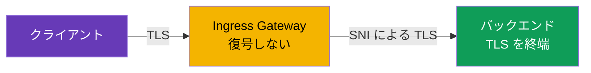
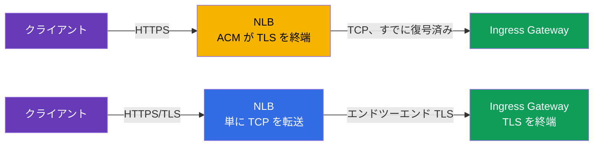
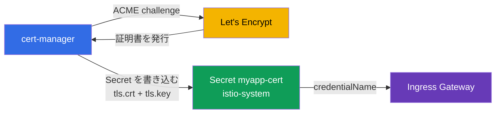

[Русская версия](ru.md) · [Eng version](en.md) · [Versión en español](es.md) · [Version française](fr.md) · [Deutsche Version](de.md) · [ქართული ვერსია](ge.md) · [繁體中文版](tw.md)

# 第9章. Edge TLS: SIMPLE、MUTUAL、PASSTHROUGH モードの ingress

> **次に進む前に。** これまでは外部からのトラフィックは通常の HTTP で到達していました。本番環境ではこれでは不十分です。入口（edge）のトラフィックは HTTPS で暗号化する必要があります。この章では、ingress gateway で TLS を設定する方法と、SIMPLE（通常の HTTPS）、MUTUAL（クライアント証明書の検証）、PASSTHROUGH（バックエンドまで暗号化）の各モードを扱います。

## 9.1. TLS はどこで終端されるか

まず重要な概念です。**TLS 終端**とは、暗号化されたトラフィックが復号される地点です。どこで行われるかによって、選ぶモードが決まります。

受信トラフィックには次の 3 つの選択肢があります。

- クライアントが暗号化し、**ingress gateway が復号**します。その後、mesh 内のトラフィックは通常どおり流れます。これは SIMPLE と MUTUAL です。
- クライアントが暗号化し、gateway は**復号せず**、暗号化されたストリームをバックエンドまで通過させ、**バックエンドが TLS を終端**します。これは PASSTHROUGH です。

edge TLS と mesh 内の mTLS（第12章）を混同しないでください。ここでは、外部からクラスターへのトラフィックを扱います。サービス間の内部トラフィックは、Istio が別途自動的に暗号化します。

## 9.2. Secret 内の証明書

TLS には証明書と秘密鍵が必要です。Istio ではこれらを Kubernetes の `Secret` に格納し、Gateway は名前でそれを参照します。

```bash
kubectl create -n istio-system secret tls myapp-cert \
  --cert=myapp.crt --key=myapp.key
```

重要な詳細: Secret は ingress gateway が動作する namespace（通常は `istio-system`）と同じ場所に置く必要があります。Gateway は `credentialName` でそれを参照し、istiod は SDS 経由で証明書を Envoy に配布します（第4章の Secret Discovery Service を思い出してください）。

## 9.3. SIMPLE: 通常の HTTPS

最も一般的なモードです。クライアントは HTTPS で接続し、gateway がトラフィックを復号してから mesh 内のサービスへ渡します。

```yaml
apiVersion: networking.istio.io/v1
kind: Gateway
metadata:
  name: main-gateway
spec:
  selector:
    istio: ingressgateway
  servers:
  - port:
      number: 443
      name: https
      protocol: HTTPS
    tls:
      mode: SIMPLE
      credentialName: myapp-cert   # 証明書と鍵を含む Secret
    hosts:
    - myapp.local
```


主要なフィールド:

- **`protocol: HTTPS`** と **`tls.mode: SIMPLE`** - gateway が TLS トラフィックを受け取り、自身で復号します。
- **`credentialName`** - サーバー証明書を含む Secret の名前です。

これで、アプリケーションには `https://myapp.local` でアクセスできます。通常の HTTPS と同様に、クライアントはサーバー証明書を検証します。

## 9.4. HTTP から HTTPS へのリダイレクト

通常、HTTP で来たクライアントは自動的に HTTPS へリダイレクトしたいものです。そのためには、`httpsRedirect` フラグを持つ HTTP サーバーを Gateway に追加します。

```yaml
  servers:
  - port:
      number: 80
      name: http
      protocol: HTTP
    hosts:
    - myapp.local
    tls:
      httpsRedirect: true    # あらゆる HTTP リクエストを HTTPS へリダイレクト
  - port:
      number: 443
      name: https
      protocol: HTTPS
    tls:
      mode: SIMPLE
      credentialName: myapp-cert
    hosts:
    - myapp.local
```

これで `http://myapp.local` へのリクエストは `https://myapp.local` へのリダイレクト（301）を受け取ります。

## 9.5. MUTUAL: クライアント証明書の検証

SIMPLE ではクライアントだけがサーバーを検証します。しかし、**サーバーもクライアントを検証する**必要がある場合があります。有効なクライアント証明書を持つ相手だけを通すためです。これは入口での mutual TLS、すなわち `MUTUAL` モードです。

```yaml
    tls:
      mode: MUTUAL
      credentialName: myapp-cert   # サーバー証明書と、クライアント検証用の CA の両方
    hosts:
    - myapp.local
```

SIMPLE との違い: `MUTUAL` では、Secret にクライアント証明書を検証するための CA 証明書（`ca.crt`）も含める必要があります。この CA で署名された有効な証明書を持たないクライアントは、TLS ハンドシェイク自体を通過できません。

```bash
# クライアント証明書なし - 拒否
curl -sk https://myapp.local:32443/                       # 200 にならない

# クライアント証明書あり - 通過する
curl -sk --cert client.crt --key client.key https://myapp.local:32443/   # 200
```

MUTUAL は B2B API、パートナー連携、内部管理画面など、発行済みの証明書を持つ者だけにアクセスを許可すべきあらゆる場所で使われます。

## 9.6. PASSTHROUGH: バックエンドが TLS を終端する

SIMPLE と MUTUAL では gateway がトラフィックを復号します。しかし、これが望ましくない場合もあります。たとえば、バックエンド自身が TLS を管理したい場合や、gateway で「開封」せずサービスまでエンドツーエンド暗号化が必要な場合です。その場合は `PASSTHROUGH` を使用します。gateway はトラフィックを復号せず、TLS の SNI（ホスト名）だけを手がかりにそのまま通過させます。

```yaml
  servers:
  - port:
      number: 443
      name: tls
      protocol: TLS
    tls:
      mode: PASSTHROUGH        # gateway は復号しない
    hosts:
    - passthrough.local
```



PASSTHROUGH では、gateway が暗号化されたストリームをどのサービスに送るべきか判断できるよう、`tls` ブロックと SNI による match を持つ VirtualService が必要です。

```yaml
apiVersion: networking.istio.io/v1
kind: VirtualService
metadata:
  name: passthrough-vs
spec:
  hosts:
  - passthrough.local
  gateways:
  - main-gateway
  tls:                        # http ではなく tls
  - match:
    - sniHosts:
      - passthrough.local
    route:
    - destination:
        host: secure-backend
        port:
          number: 443
```

注意してください。gateway はトラフィックを復号しないため、内部の HTTP を見ることもできません。そのため、ルーティングはパスやヘッダーではなく SNI によってのみ可能です。

## 9.7. モードの比較

| モード | TLS を終端するもの | クライアント検証 | 使用する場面 |
|-------|---------------------|------------------|--------------------|
| `SIMPLE` | ingress gateway | なし | 通常の公開 HTTPS |
| `MUTUAL` | ingress gateway | はい、クライアント証明書による | 制限付きアクセス、B2B、パートナー |
| `PASSTHROUGH` | バックエンド自身 | バックエンドに依存 | エンドツーエンド暗号化、バックエンドが TLS を管理 |

実践上のルール: デフォルトでは `SIMPLE` を選びます。クライアント証明書を持つ相手だけを通す必要がある場合は `MUTUAL`、gateway が内容を見てはならず TLS が無変更でバックエンドまで届く必要がある場合は `PASSTHROUGH` を使います。

## 9.8. TLS はどこで終端すべきか: NLB（ACM）か Istio か

ここまで扱ったのは **Istio 内**での TLS 終端です（gateway が Secret の証明書でトラフィックを復号します）。しかし AWS には代替案があります。**AWS Certificate Manager (ACM)** の既成証明書を Network Load Balancer に直接設定すれば、TLS は Envoy より手前、**ロードバランサー上**で終端されます。技術的には gateway の Service に付けるアノテーション（`aws-load-balancer-ssl-cert` + `aws-load-balancer-ssl-ports`）で実現します。アノテーションの詳細は[第5章](../05/jp.md)で扱っています。ここで重要なのは、**何を選ぶか**です。



**選択肢 A - NLB で TLS（ACM による offload）。**

利点:

- 証明書は AWS が管理します。ACM が自動更新し、鍵は AWS の外に出ず、クラスターへ何もアップロードする必要がありません。
- gateway の負荷軽減: 暗号処理は NLB が行い、Envoy は復号済みのトラフィックを受け取ります。
- Route 53/ACM との簡単な統合（数クリックでの証明書 DNS 検証）。

欠点:

- NLB と gateway の間では、トラフィックは**この TLS なしで**流れます（VPC の境界だけで保護されます）。エンドツーエンド暗号化には適しません。
- Istio は元の TLS を**見ることができません**。SNI によるルーティング、gateway での `MUTUAL`（クライアント証明書検証）、`PASSTHROUGH` は意味を失います。
- 証明書は ACM に存在する必要があります。独自の証明書（独自 CA や Let's Encrypt のもの）は ACM に**インポートできます**が、そのようなインポート済み証明書を ACM は**自動更新しません**。手動で再アップロードする必要があります（自動更新は ACM 自身が発行した証明書でのみ機能します）。

**選択肢 B - Istio で TLS（SIMPLE/MUTUAL/PASSTHROUGH）、NLB は TCP 転送モード。**

利点:

- 完全な制御: `MUTUAL`（入口での mTLS）、`PASSTHROUGH`、SNI によるルーティング。
- 任意の証明書ソース: 独自 CA、ACM Private CA、cert-manager 経由の Let's Encrypt（セクション 9.9）。
- 暗号化はロードバランサーで途切れず、mesh 自体まで到達します。

欠点:

- 証明書は自分で管理する必要があります（または cert-manager を導入します。下記参照）。
- 暗号処理の負荷は gateway の Pod にかかります。

| 基準 | NLB 上の TLS（ACM） | Istio 内の TLS |
|----------|------------------|-------------|
| 証明書を更新するもの | AWS（ACM） | 自分 / cert-manager |
| mesh までのエンドツーエンド暗号化 | なし | あり |
| 入口での `MUTUAL`（クライアント証明書） | なし | あり |
| `PASSTHROUGH` / SNI によるルート | なし | あり |
| 証明書のソース | ACM（発行済みまたはインポート済み） | 任意（CA、ACM PCA、Let's Encrypt） |
| インポート済み証明書の自動更新 | なし（手動アップロード） | あり（cert-manager） |
| gateway の負荷 | 低い | 高い |

実践上のルール: **入口で mTLS を使わない EKS 上の単純な公開 HTTPS**なら、NLB+ACM に任せるほうが運用が便利で安価です。**`MUTUAL`、`PASSTHROUGH`、エンドツーエンド暗号化、または ACM 以外の証明書が必要**なら、Istio で終端してください。

## 9.9. 自動証明書: cert-manager と Let's Encrypt

本番環境で証明書を手動でアップロード・更新する（`kubectl create secret tls ...`）のは不便で危険です。更新を忘れるとサイトが「停止」します。Istio の標準的な解決策は [cert-manager](https://cert-manager.io/) です。これは **ACME** プロトコルで認証局から証明書を取得し（最も有名な ACME プロバイダーは無料の **Let's Encrypt**）、Kubernetes の `Secret` に格納し、有効期限前に自動更新します。

仕組みは簡単です。cert-manager は、Gateway がすでに `credentialName` で参照できる `Secret`（`tls.crt` + `tls.key`）をそのまま作成します。Istio に特別な設定は不要で、準備済みの Secret を見るだけです。



まず、証明書の発行元として `ClusterIssuer`（クラスター全体）または `Issuer`（namespace 内）を定義します。以下は Route 53 を介した DNS-01 検証を使う Let's Encrypt 向け ACME-issuer の例です（AWS では、外部からポート 80 にアクセス可能である必要がないため、HTTP-01 より信頼性が高くなります）。

```yaml
apiVersion: cert-manager.io/v1
kind: ClusterIssuer
metadata:
  name: letsencrypt-prod
spec:
  acme:
    server: https://acme-v02.api.letsencrypt.org/directory
    email: admin@example.com
    privateKeySecretRef:
      name: letsencrypt-prod-account-key
    solvers:
    - dns01:
        route53:
          region: eu-central-1        # cert-manager がドメイン所有権を確認する
                                       # Route 53 のレコード経由（IAM 権限が必要）
```

次に、「このドメインの証明書が欲しいので、この Secret に格納する」と指定する `Certificate` リソースを作成します。Secret は gateway の namespace（`istio-system`）に**必ず**置く必要があり、そうでなければ Gateway から見えません。

```yaml
apiVersion: cert-manager.io/v1
kind: Certificate
metadata:
  name: myapp-cert
  namespace: istio-system          # ingress gateway と同じ場所
spec:
  secretName: myapp-cert           # cert-manager がこの Secret を作成する
  issuerRef:
    name: letsencrypt-prod
    kind: ClusterIssuer
  dnsNames:
  - myapp.example.com
```

以降はセクション 9.3 と同じです。Gateway がこの Secret を参照します。

```yaml
    tls:
      mode: SIMPLE
      credentialName: myapp-cert   # cert-manager が中身を設定した Secret
```

challenge について簡単に説明します。

- **DNS-01**（上の例）- cert-manager が DNS ゾーン（Route 53、Cloud DNS など）に TXT レコードを作成します。内部 gateway や wildcard 証明書（`*.example.com`）でも機能します。
- **HTTP-01** - Let's Encrypt は、`http://<ドメイン>/.well-known/...` からファイルを要求してドメインを検証します。このため gateway のポート 80 がインターネットから到達可能であり、challenge リクエストが cert-manager の solver に到達する必要があります。Istio との組み合わせでは設定がより複雑なため、AWS では DNS-01 がよく選ばれます。

cert-manager+Let's Encrypt の利点: 無料、完全自動更新、すべてのドメインに共通の仕組み。欠点: cert-manager 自体を運用する必要があり、Let's Encrypt には[発行レート制限](https://letsencrypt.org/docs/rate-limits/)があります（デバッグ時には `acme-staging-v02` staging-issuer を使用してください）。また DNS-01 には DNS ゾーンを変更する権限が必要です。

## 9.10. ベストプラクティス

- **常に HTTP から HTTPS へリダイレクトしてください**（`httpsRedirect: true`、セクション 9.4）。本番環境で平文 HTTP を公開してはいけません。
- **最小 TLS バージョンを指定してください。** デフォルトでは TLS 1.2 以上を使用し、古いプロトコルは Gateway のサーバーで直接無効化します。

  ```yaml
    - port:
        number: 443
        name: https
        protocol: HTTPS
      tls:
        mode: SIMPLE
        credentialName: myapp-cert
        minProtocolVersion: TLSV1_2      # TLS 1.0/1.1 を禁止
        # cipherSuites: [ECDHE-ECDSA-AES256-GCM-SHA384, ...]  # 必要に応じて
  ```

- **証明書を自動化してください。** 手動の `kubectl create secret tls` はラボとデバッグだけにします。本番では cert-manager（Let's Encrypt/独自 CA）または NLB 上の ACM を使います。
- **秘密鍵を git に保存しないでください。** 鍵と証明書は秘密情報です。リポジトリーには `Certificate`/`Issuer` マニフェストだけを置き、鍵そのものは置きません。
- **ドメイン/ホストごとに別の Secret を使用してください。** 互換性のないドメインを 1 つの証明書にまとめないでください。サブドメインの集合には wildcard（`*.example.com`）または SAN 証明書を使います。
- **gateway の Secret へのアクセスを制限してください。** 鍵を含む Secret は gateway の namespace（`istio-system`）にあります。必要な人だけが読み取れるよう、RBAC でアクセスを制限します。
- **有効期限を監視してください。** 自動更新があっても、仕組みが壊れた場合に備えて有効期限を監視します（N 日前にアラート）。
- **公開トラフィックと内部トラフィックを分離してください**。異なる ingress gateway（第5章）を使用します。証明書と TLS 要件が異なるためです。
- **公開サイトには HSTS を使用してください。** `Strict-Transport-Security` ヘッダーにより、ブラウザーは常に HTTPS を使用します。VirtualService の `headers` または EnvoyFilter を通じて追加します。

## 9.11. この章のまとめ

- クラスターへの入口トラフィックは暗号化する必要があります。TLS は `Gateway` の `tls` ブロックで設定します。
- 証明書は gateway の namespace 内の `Secret` に格納され、`credentialName` で接続します（Envoy への配布は SDS 経由です）。
- **SIMPLE** - 通常の HTTPS: gateway が TLS を終端し、クライアントはサーバーのみを検証します。
- **`httpsRedirect: true`** - HTTP を HTTPS へ自動的にリダイレクトします。
- **MUTUAL** - gateway がクライアント証明書も検証します。Secret に CA が必要です。
- **PASSTHROUGH** - gateway はトラフィックを復号せず、バックエンドが終端します。ルーティングは SNI によってのみ可能です（`tls` と `sniHosts` を持つ VirtualService が必要です）。
- TLS は、ACM の既成証明書により**NLB 上**で終端することも（offload、AWS が自動更新）、**Istio 内**で終端することもできます（完全な制御、mTLS/passthrough、任意の証明書ソース）。`MUTUAL`、`PASSTHROUGH`、エンドツーエンド暗号化が必要かどうかで選択します。
- 本番環境では証明書を自動発行します。**cert-manager + Let's Encrypt**（ACME、AWS では DNS-01）が、`credentialName` から参照する準備済み Secret を格納します。
- ベストプラクティス: HTTPS へのリダイレクト、`minProtocolVersion: TLSV1_2`、発行の自動化、鍵を git に保存しないこと、Secret の RBAC、有効期限の監視、HSTS。
- Edge TLS は mesh 内の mTLS（第12章）と同じものではありません。

## 9.12. 自己確認の質問

1. 「TLS 終端」とは何を意味し、この意味で SIMPLE と PASSTHROUGH はどう違いますか？
2. 証明書を含む Secret はどこに置くべきで、Gateway はどのようにそれを参照しますか？
3. MUTUAL は SIMPLE とどう異なり、Secret には何を追加で含める必要がありますか？
4. PASSTHROUGH で HTTP パスではなく SNI によってのみルーティングできるのはなぜですか？
5. HTTP から HTTPS への自動リダイレクトをどう設定しますか？
6. NLB（ACM）での TLS 終端と Istio での終端の違いは何ですか？ それぞれどのような場合に選びますか？
7. cert-manager と Let's Encrypt はどのように Istio Gateway の証明書を発行しますか？ AWS で HTTP-01 ではなく DNS-01 が便利なのはなぜですか？
8. edge TLS にはどのようなセキュリティ対策（プロトコルのバージョン、鍵の保管、Secret へのアクセス）を適用すべきですか？

## 演習

gateway での TLS 終端（SIMPLE モード）を練習してください。

🧪 ラボ 13: [tasks/ica/labs/13](../../labs/13/README_JP.MD)

MUTUAL および PASSTHROUGH モードを練習してください。

🧪 ラボ 29: [tasks/ica/labs/29](../../labs/29/README_JP.MD)

---
[目次](../README_JP.md) · [第8章](../08/jp.md) · [第10章](../10/jp.md)
