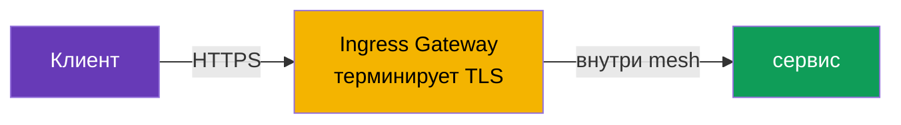
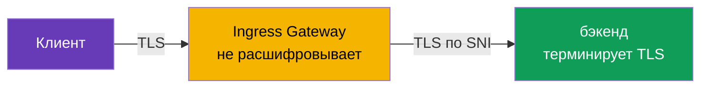
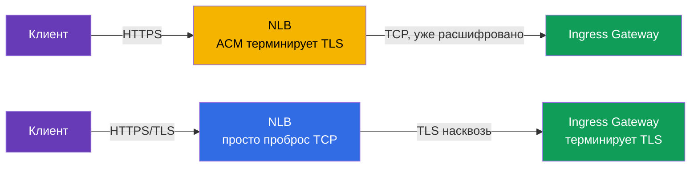
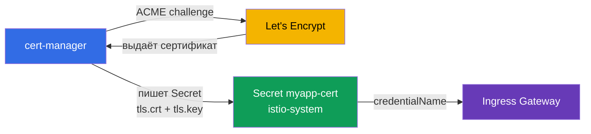

[Eng version](en.md)

# Глава 9. Edge TLS: ingress в режимах SIMPLE, MUTUAL, PASSTHROUGH

> **Что дальше.** До сих пор трафик снаружи приходил к нам по обычному HTTP. В
> продакшене так нельзя: трафик на входе (edge) должен быть зашифрован по HTTPS. В
> этой главе разберём, как настроить TLS на ingress gateway и какие есть режимы:
> SIMPLE (обычный HTTPS), MUTUAL (проверка клиентского сертификата) и PASSTHROUGH
> (шифрование до самого бэкенда).

## 9.1. Где терминируется TLS

Сначала важное понятие. **Терминация TLS** - это точка, где зашифрованный трафик
расшифровывается. От того, где это происходит, и зависит выбор режима.

Три варианта для входящего трафика:

- Клиент шифрует, **ingress gateway расшифровывает** и дальше внутри mesh трафик идёт
  своим порядком. Это SIMPLE и MUTUAL.
- Клиент шифрует, gateway **не расшифровывает**, а пропускает зашифрованный поток до
  бэкенда, и уже **бэкенд терминирует TLS**. Это PASSTHROUGH.

Не путайте edge TLS с mTLS внутри mesh (глава 12). Здесь речь про трафик снаружи в
кластер. Внутренний трафик между сервисами Istio шифрует отдельно и автоматически.

## 9.2. Сертификаты в Secret

Для TLS нужен сертификат и приватный ключ. В Istio их кладут в Kubernetes `Secret`, а
Gateway ссылается на него по имени.

```bash
kubectl create -n istio-system secret tls myapp-cert \
  --cert=myapp.crt --key=myapp.key
```

Важная деталь: Secret должен лежать в том же namespace, где работает ingress gateway
(обычно `istio-system`). Gateway ссылается на него через `credentialName`, и istiod
доставляет сертификат в Envoy по SDS (помните из главы 4 - Secret Discovery Service).

## 9.3. SIMPLE: обычный HTTPS

Самый частый режим. Клиент подключается по HTTPS, gateway расшифровывает трафик и
дальше передаёт его сервису внутри mesh.

```yaml
apiVersion: networking.istio.io/v1
kind: Gateway
metadata:
  name: main-gateway
spec:
  selector:
    istio: ingressgateway
  servers:
  - port:
      number: 443
      name: https
      protocol: HTTPS
    tls:
      mode: SIMPLE
      credentialName: myapp-cert   # Secret с сертификатом и ключом
    hosts:
    - myapp.local
```



Ключевые поля:

- **`protocol: HTTPS`** и **`tls.mode: SIMPLE`** - шлюз принимает TLS-трафик и сам его
  расшифровывает.
- **`credentialName`** - имя Secret с сертификатом сервера.

После этого приложение доступно по `https://myapp.local`. Клиент проверяет
сертификат сервера, как в любом обычном HTTPS.

## 9.4. Redirect с HTTP на HTTPS

Обычно хочется, чтобы клиенты, пришедшие по HTTP, автоматически перенаправлялись на
HTTPS. Для этого в Gateway добавляют HTTP-сервер с флагом `httpsRedirect`:

```yaml
  servers:
  - port:
      number: 80
      name: http
      protocol: HTTP
    hosts:
    - myapp.local
    tls:
      httpsRedirect: true    # любой HTTP-запрос -> редирект на HTTPS
  - port:
      number: 443
      name: https
      protocol: HTTPS
    tls:
      mode: SIMPLE
      credentialName: myapp-cert
    hosts:
    - myapp.local
```

Теперь запрос на `http://myapp.local` получит редирект (301) на `https://myapp.local`.

## 9.5. MUTUAL: проверка клиентского сертификата

В SIMPLE только клиент проверяет сервер. Но иногда нужно, чтобы и **сервер проверял
клиента**: пускать только тех, у кого есть валидный клиентский сертификат. Это mutual
TLS на входе, режим `MUTUAL`.

```yaml
    tls:
      mode: MUTUAL
      credentialName: myapp-cert   # тут и серверный серт, и CA для проверки клиента
    hosts:
    - myapp.local
```

Отличие от SIMPLE: при `MUTUAL` Secret должен содержать ещё и CA-сертификат (`ca.crt`),
которым шлюз проверяет клиентские сертификаты. Клиент без валидного сертификата,
подписанного этим CA, не пройдёт TLS-хендшейк вообще.

```bash
# без клиентского сертификата - отказ
curl -sk https://myapp.local:32443/                       # не 200

# с клиентским сертификатом - проходит
curl -sk --cert client.crt --key client.key https://myapp.local:32443/   # 200
```

MUTUAL применяют для B2B API, партнёрских интеграций, внутренних админок - везде, где
доступ должен быть только у обладателей выданного сертификата.

## 9.6. PASSTHROUGH: TLS терминирует бэкенд

В SIMPLE и MUTUAL шлюз расшифровывает трафик. Но иногда это нежелательно: например,
бэкенд сам хочет управлять своим TLS, или требуется сквозное шифрование до самого
сервиса без «вскрытия» на шлюзе. Тогда используют `PASSTHROUGH`: шлюз не расшифровывает
трафик, а пропускает его насквозь, ориентируясь только по SNI (имени хоста в TLS).

```yaml
  servers:
  - port:
      number: 443
      name: tls
      protocol: TLS
    tls:
      mode: PASSTHROUGH        # шлюз не расшифровывает
    hosts:
    - passthrough.local
```



При PASSTHROUGH нужен VirtualService с блоком `tls` и match по SNI, чтобы шлюз понял,
на какой сервис направить зашифрованный поток:

```yaml
apiVersion: networking.istio.io/v1
kind: VirtualService
metadata:
  name: passthrough-vs
spec:
  hosts:
  - passthrough.local
  gateways:
  - main-gateway
  tls:                        # именно tls, а не http
  - match:
    - sniHosts:
      - passthrough.local
    route:
    - destination:
        host: secure-backend
        port:
          number: 443
```

Обратите внимание: раз шлюз не расшифровывает трафик, он и не видит HTTP внутри.
Поэтому маршрутизация возможна только по SNI, а не по путям или заголовкам.

## 9.7. Сравнение режимов

| Режим | Кто терминирует TLS | Проверка клиента | Когда использовать |
|-------|---------------------|------------------|--------------------|
| `SIMPLE` | ingress gateway | нет | обычный публичный HTTPS |
| `MUTUAL` | ingress gateway | да, по клиентскому серту | закрытый доступ, B2B, партнёры |
| `PASSTHROUGH` | сам бэкенд | зависит от бэкенда | сквозное шифрование, бэкенд сам держит TLS |

Практическое правило: по умолчанию берите `SIMPLE`. `MUTUAL` - когда нужно пускать
только по клиентским сертификатам. `PASSTHROUGH` - когда шлюз не должен видеть
содержимое и TLS обязан дойти до бэкенда нетронутым.

## 9.8. Где терминировать TLS: на NLB (ACM) или в Istio

Всё, что было выше, - это терминация TLS **в Istio** (шлюз расшифровывает трафик по
сертификату из Secret). Но на AWS есть альтернатива: повесить готовый сертификат из **AWS
Certificate Manager (ACM)** прямо на Network Load Balancer, и тогда TLS терминируется **на
балансировщике**, ещё до Envoy. Технически это делается аннотациями к Service шлюза
(`aws-load-balancer-ssl-cert` + `aws-load-balancer-ssl-ports`) - подробный разбор аннотаций
в [главе 5](../05/ru.md). Здесь важно понять, **что выбрать**.



**Вариант A - TLS на NLB (offload через ACM).**

Плюсы:

- Сертификатом управляет AWS: ACM сам продлевает его, ключ не покидает AWS, в кластер
  ничего грузить не нужно.
- Разгрузка шлюза: криптографию делает NLB, Envoy получает уже расшифрованный трафик.
- Простая интеграция с Route 53/ACM (DNS-валидация сертификата в пару кликов).

Минусы:

- Между NLB и шлюзом трафик идёт **без этого TLS** (защищён только границами VPC). Для
  сквозного шифрования это не годится.
- Istio **не видит** исходный TLS: нельзя маршрутизировать по SNI, нельзя сделать `MUTUAL`
  (проверку клиентского сертификата) на шлюзе, `PASSTHROUGH` теряет смысл.
- Сертификат должен лежать в ACM. Свой сертификат (от своего CA или Let's Encrypt) в ACM
  **импортировать можно**, но такие импортированные сертификаты ACM **не продлевает
  автоматически** - их придётся перезаливать вручную (автопродление работает только для
  сертификатов, выпущенных самим ACM).

**Вариант B - TLS в Istio (SIMPLE/MUTUAL/PASSTHROUGH), NLB в режиме проброса TCP.**

Плюсы:

- Полный контроль: `MUTUAL` (mTLS на входе), `PASSTHROUGH`, маршрутизация по SNI.
- Любой источник сертификата: свой CA, ACM Private CA, Let's Encrypt через cert-manager
  (раздел 9.9).
- Шифрование доходит до самого mesh, а не обрывается на балансировщике.

Минусы:

- Сертификатами управляете вы сами (или ставите cert-manager - см. ниже).
- Криптографическая нагрузка ложится на поды шлюза.

| Критерий | TLS на NLB (ACM) | TLS в Istio |
|----------|------------------|-------------|
| Кто продлевает сертификат | AWS (ACM) | вы / cert-manager |
| Сквозное шифрование до mesh | нет | да |
| `MUTUAL` (клиентский серт) на входе | нет | да |
| `PASSTHROUGH` / маршрут по SNI | нет | да |
| Источник сертификата | ACM (выпущенный или импортированный) | любой (CA, ACM PCA, Let's Encrypt) |
| Автопродление импортированного серта | нет (заливать вручную) | да (cert-manager) |
| Нагрузка на шлюз | ниже | выше |

Практическое правило: **простой публичный HTTPS на EKS без mTLS на входе** - удобнее и
дешевле в эксплуатации отдать на NLB+ACM. **Нужен `MUTUAL`, `PASSTHROUGH`, сквозное
шифрование или сертификат не из ACM** - терминируйте в Istio.

## 9.9. Автоматические сертификаты: cert-manager и Let's Encrypt

Грузить и продлевать сертификаты руками (`kubectl create secret tls ...`) в продакшене
неудобно и опасно - забудете продлить, и сайт «ляжет». Стандартное решение для Istio -
[cert-manager](https://cert-manager.io/): он сам получает сертификаты от центра
сертификации по протоколу **ACME** (самый известный ACME-провайдер - бесплатный **Let's
Encrypt**), кладёт их в Kubernetes `Secret` и автоматически продлевает до истечения срока.

Схема простая: cert-manager создаёт ровно тот `Secret` (`tls.crt` + `tls.key`), на который
уже умеет ссылаться Gateway через `credentialName`. Для Istio ничего специального не нужно
- он просто видит готовый Secret.



Сначала описывают источник сертификатов - `ClusterIssuer` (общий на кластер) или `Issuer`
(в рамках namespace). Пример ACME-issuer для Let's Encrypt с DNS-01 проверкой через Route 53
(на AWS это надёжнее HTTP-01, потому что не требует доступности порта 80 снаружи):

```yaml
apiVersion: cert-manager.io/v1
kind: ClusterIssuer
metadata:
  name: letsencrypt-prod
spec:
  acme:
    server: https://acme-v02.api.letsencrypt.org/directory
    email: admin@example.com
    privateKeySecretRef:
      name: letsencrypt-prod-account-key
    solvers:
    - dns01:
        route53:
          region: eu-central-1        # cert-manager подтверждает владение доменом
                                       # через запись в Route 53 (нужны IAM-права)
```

Затем - ресурс `Certificate`, который говорит «хочу сертификат для такого-то домена, положи
его в такой-то Secret». Secret обязан быть **в namespace шлюза** (`istio-system`), иначе
Gateway его не увидит:

```yaml
apiVersion: cert-manager.io/v1
kind: Certificate
metadata:
  name: myapp-cert
  namespace: istio-system          # там же, где ingress gateway
spec:
  secretName: myapp-cert           # cert-manager создаст этот Secret
  issuerRef:
    name: letsencrypt-prod
    kind: ClusterIssuer
  dnsNames:
  - myapp.example.com
```

Дальше всё как в разделе 9.3 - Gateway ссылается на этот Secret:

```yaml
    tls:
      mode: SIMPLE
      credentialName: myapp-cert   # Secret, который наполнил cert-manager
```

Про challenge коротко:

- **DNS-01** (пример выше) - cert-manager создаёт TXT-запись в DNS-зоне (Route 53, Cloud DNS
  и т.п.). Работает даже для внутренних шлюзов и для wildcard-сертификатов (`*.example.com`).
- **HTTP-01** - Let's Encrypt проверяет домен, запрашивая файл по `http://<домен>/.well-known/...`.
  Для этого порт 80 шлюза должен быть доступен из интернета, а challenge-запрос - доходить до
  solver'а cert-manager; в связке с Istio это настраивается сложнее, поэтому на AWS чаще берут
  DNS-01.

Плюсы cert-manager+Let's Encrypt: бесплатно, полностью автоматическое продление, единый
механизм для всех доменов. Минусы: нужно эксплуатировать сам cert-manager, у Let's Encrypt
есть [лимиты на выпуск](https://letsencrypt.org/docs/rate-limits/) (используйте staging-issuer
`acme-staging-v02` при отладке), а для DNS-01 нужны права на изменение DNS-зоны.

## 9.10. Best practices

- **Всегда редиректьте HTTP на HTTPS** (`httpsRedirect: true`, раздел 9.4) - никакого
  открытого HTTP в продакшене.
- **Задавайте минимальную версию TLS.** По умолчанию берите TLS 1.2 и выше, отключая старые
  протоколы прямо в сервере Gateway:

  ```yaml
    - port:
        number: 443
        name: https
        protocol: HTTPS
      tls:
        mode: SIMPLE
        credentialName: myapp-cert
        minProtocolVersion: TLSV1_2      # запретить TLS 1.0/1.1
        # cipherSuites: [ECDHE-ECDSA-AES256-GCM-SHA384, ...]  # при необходимости
  ```

- **Автоматизируйте сертификаты.** Ручной `kubectl create secret tls` - только для лаб и
  отладки. В продакшене - cert-manager (Let's Encrypt/свой CA) или ACM на NLB.
- **Не храните приватные ключи в git.** Ключ и сертификат - секреты; в репозитории держат
  только манифесты `Certificate`/`Issuer`, но не сами ключи.
- **Отдельный Secret на домен/хост.** Не складывайте несовместимые домены в один сертификат;
  для набора поддоменов берите wildcard (`*.example.com`) или SAN-сертификат.
- **Ограничьте доступ к секретам шлюза.** Secret'ы с ключами лежат в namespace шлюза
  (`istio-system`); закройте доступ к ним RBAC, чтобы читать их могли только те, кому нужно.
- **Мониторьте срок действия.** Даже с автопродлением следите за датой истечения (алерт за
  N дней) - на случай, если автоматика сломалась.
- **Разделяйте публичный и внутренний трафик** по разным ingress gateway (глава 5): у них
  разные сертификаты и разные требования к TLS.
- **HSTS для публичных сайтов.** Заголовок `Strict-Transport-Security` заставляет браузер
  всегда ходить по HTTPS; его добавляют через `headers` в VirtualService или EnvoyFilter.

## 9.11. Итоги главы

- Трафик на входе в кластер надо шифровать; TLS настраивается в `Gateway` в блоке
  `tls`.
- Сертификаты хранятся в `Secret` в namespace шлюза и подключаются через
  `credentialName` (доставка в Envoy идёт по SDS).
- **SIMPLE** - обычный HTTPS: шлюз терминирует TLS, клиент проверяет только сервер.
- **`httpsRedirect: true`** автоматически перенаправляет HTTP на HTTPS.
- **MUTUAL** - шлюз дополнительно проверяет клиентский сертификат; в Secret нужен CA.
- **PASSTHROUGH** - шлюз не расшифровывает трафик, терминирует его бэкенд; маршрутизация
  только по SNI (нужен VirtualService с `tls` и `sniHosts`).
- TLS можно терминировать **на NLB** готовым сертификатом из ACM (offload, AWS сам
  продлевает) или **в Istio** (полный контроль, mTLS/passthrough, любой источник серта) -
  выбор зависит от того, нужны ли `MUTUAL`, `PASSTHROUGH` и сквозное шифрование.
- В продакшене сертификаты выпускают автоматически: **cert-manager + Let's Encrypt** (ACME,
  DNS-01 на AWS) кладёт готовый Secret, на который ссылается `credentialName`.
- Best practices: редирект на HTTPS, `minProtocolVersion: TLSV1_2`, автоматизация выпуска,
  ключи не в git, RBAC на секреты, мониторинг срока действия, HSTS.
- Edge TLS это не то же самое, что mTLS внутри mesh (глава 12).

## 9.12. Вопросы для самопроверки

1. Что значит «терминация TLS» и чем в этом смысле отличаются SIMPLE и PASSTHROUGH?
2. Где должен лежать Secret с сертификатом и как Gateway на него ссылается?
3. Чем MUTUAL отличается от SIMPLE и что дополнительно нужно в Secret?
4. Почему при PASSTHROUGH нельзя маршрутизировать по HTTP-путям, только по SNI?
5. Как настроить автоматический редирект с HTTP на HTTPS?
6. В чём разница между терминацией TLS на NLB (ACM) и в Istio? Когда какой вариант выбрать?
7. Как cert-manager с Let's Encrypt выдаёт сертификат для Istio Gateway и почему на AWS
   удобнее DNS-01, а не HTTP-01?
8. Какие меры безопасности стоит применить к edge TLS (версия протокола, хранение ключей,
   доступ к секретам)?

## Практика

Отработайте терминацию TLS на шлюзе (режим SIMPLE):

🧪 Лаба 13: [tasks/ica/labs/13](../../labs/13/README_RU.MD)

Отработайте режимы MUTUAL и PASSTHROUGH:

🧪 Лаба 29: [tasks/ica/labs/29](../../labs/29/README_RU.MD)

---
[Оглавление](../README.md) · [Глава 8](../08/ru.md) · [Глава 10](../10/ru.md)
