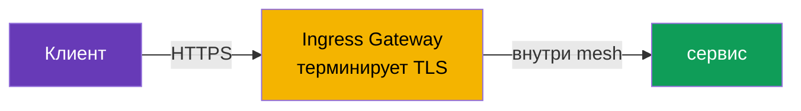
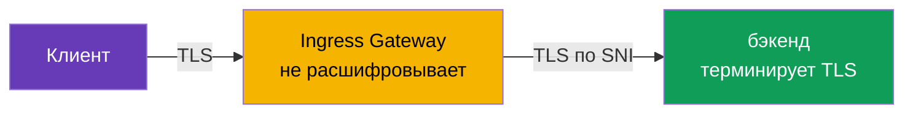

# Глава 9. Edge TLS: ingress в режимах SIMPLE, MUTUAL, PASSTHROUGH

> **Что дальше.** До сих пор трафик снаружи приходил к нам по обычному HTTP. В
> продакшене так нельзя: трафик на входе (edge) должен быть зашифрован по HTTPS. В
> этой главе разберём, как настроить TLS на ingress gateway и какие есть режимы:
> SIMPLE (обычный HTTPS), MUTUAL (проверка клиентского сертификата) и PASSTHROUGH
> (шифрование до самого бэкенда).

## 9.1. Где терминируется TLS

Сначала важное понятие. **Терминация TLS** - это точка, где зашифрованный трафик
расшифровывается. От того, где это происходит, и зависит выбор режима.

Три варианта для входящего трафика:

- Клиент шифрует, **ingress gateway расшифровывает** и дальше внутри mesh трафик идёт
  своим порядком. Это SIMPLE и MUTUAL.
- Клиент шифрует, gateway **не расшифровывает**, а пропускает зашифрованный поток до
  бэкенда, и уже **бэкенд терминирует TLS**. Это PASSTHROUGH.

Не путайте edge TLS с mTLS внутри mesh (глава 12). Здесь речь про трафик снаружи в
кластер. Внутренний трафик между сервисами Istio шифрует отдельно и автоматически.

## 9.2. Сертификаты в Secret

Для TLS нужен сертификат и приватный ключ. В Istio их кладут в Kubernetes `Secret`, а
Gateway ссылается на него по имени.

```bash
kubectl create -n istio-system secret tls myapp-cert \
  --cert=myapp.crt --key=myapp.key
```

Важная деталь: Secret должен лежать в том же namespace, где работает ingress gateway
(обычно `istio-system`). Gateway ссылается на него через `credentialName`, и istiod
доставляет сертификат в Envoy по SDS (помните из главы 4 - Secret Discovery Service).

## 9.3. SIMPLE: обычный HTTPS

Самый частый режим. Клиент подключается по HTTPS, gateway расшифровывает трафик и
дальше передаёт его сервису внутри mesh.

```yaml
apiVersion: networking.istio.io/v1
kind: Gateway
metadata:
  name: main-gateway
spec:
  selector:
    istio: ingressgateway
  servers:
  - port:
      number: 443
      name: https
      protocol: HTTPS
    tls:
      mode: SIMPLE
      credentialName: myapp-cert   # Secret с сертификатом и ключом
    hosts:
    - myapp.local
```



Ключевые поля:

- **`protocol: HTTPS`** и **`tls.mode: SIMPLE`** - шлюз принимает TLS-трафик и сам его
  расшифровывает.
- **`credentialName`** - имя Secret с сертификатом сервера.

После этого приложение доступно по `https://myapp.local`. Клиент проверяет
сертификат сервера, как в любом обычном HTTPS.

## 9.4. Redirect с HTTP на HTTPS

Обычно хочется, чтобы клиенты, пришедшие по HTTP, автоматически перенаправлялись на
HTTPS. Для этого в Gateway добавляют HTTP-сервер с флагом `httpsRedirect`:

```yaml
  servers:
  - port:
      number: 80
      name: http
      protocol: HTTP
    hosts:
    - myapp.local
    tls:
      httpsRedirect: true    # любой HTTP-запрос -> редирект на HTTPS
  - port:
      number: 443
      name: https
      protocol: HTTPS
    tls:
      mode: SIMPLE
      credentialName: myapp-cert
    hosts:
    - myapp.local
```

Теперь запрос на `http://myapp.local` получит редирект (301) на `https://myapp.local`.

## 9.5. MUTUAL: проверка клиентского сертификата

В SIMPLE только клиент проверяет сервер. Но иногда нужно, чтобы и **сервер проверял
клиента**: пускать только тех, у кого есть валидный клиентский сертификат. Это mutual
TLS на входе, режим `MUTUAL`.

```yaml
    tls:
      mode: MUTUAL
      credentialName: myapp-cert   # тут и серверный серт, и CA для проверки клиента
    hosts:
    - myapp.local
```

Отличие от SIMPLE: при `MUTUAL` Secret должен содержать ещё и CA-сертификат (`ca.crt`),
которым шлюз проверяет клиентские сертификаты. Клиент без валидного сертификата,
подписанного этим CA, не пройдёт TLS-хендшейк вообще.

```bash
# без клиентского сертификата - отказ
curl -sk https://myapp.local:32443/                       # не 200

# с клиентским сертификатом - проходит
curl -sk --cert client.crt --key client.key https://myapp.local:32443/   # 200
```

MUTUAL применяют для B2B API, партнёрских интеграций, внутренних админок - везде, где
доступ должен быть только у обладателей выданного сертификата.

## 9.6. PASSTHROUGH: TLS терминирует бэкенд

В SIMPLE и MUTUAL шлюз расшифровывает трафик. Но иногда это нежелательно: например,
бэкенд сам хочет управлять своим TLS, или требуется сквозное шифрование до самого
сервиса без «вскрытия» на шлюзе. Тогда используют `PASSTHROUGH`: шлюз не расшифровывает
трафик, а пропускает его насквозь, ориентируясь только по SNI (имени хоста в TLS).

```yaml
  servers:
  - port:
      number: 443
      name: tls
      protocol: TLS
    tls:
      mode: PASSTHROUGH        # шлюз не расшифровывает
    hosts:
    - passthrough.local
```



При PASSTHROUGH нужен VirtualService с блоком `tls` и match по SNI, чтобы шлюз понял,
на какой сервис направить зашифрованный поток:

```yaml
apiVersion: networking.istio.io/v1
kind: VirtualService
metadata:
  name: passthrough-vs
spec:
  hosts:
  - passthrough.local
  gateways:
  - main-gateway
  tls:                        # именно tls, а не http
  - match:
    - sniHosts:
      - passthrough.local
    route:
    - destination:
        host: secure-backend
        port:
          number: 443
```

Обратите внимание: раз шлюз не расшифровывает трафик, он и не видит HTTP внутри.
Поэтому маршрутизация возможна только по SNI, а не по путям или заголовкам.

## 9.7. Сравнение режимов

| Режим | Кто терминирует TLS | Проверка клиента | Когда использовать |
|-------|---------------------|------------------|--------------------|
| `SIMPLE` | ingress gateway | нет | обычный публичный HTTPS |
| `MUTUAL` | ingress gateway | да, по клиентскому серту | закрытый доступ, B2B, партнёры |
| `PASSTHROUGH` | сам бэкенд | зависит от бэкенда | сквозное шифрование, бэкенд сам держит TLS |

Практическое правило: по умолчанию берите `SIMPLE`. `MUTUAL` - когда нужно пускать
только по клиентским сертификатам. `PASSTHROUGH` - когда шлюз не должен видеть
содержимое и TLS обязан дойти до бэкенда нетронутым.

## 9.8. Итоги главы

- Трафик на входе в кластер надо шифровать; TLS настраивается в `Gateway` в блоке
  `tls`.
- Сертификаты хранятся в `Secret` в namespace шлюза и подключаются через
  `credentialName` (доставка в Envoy идёт по SDS).
- **SIMPLE** - обычный HTTPS: шлюз терминирует TLS, клиент проверяет только сервер.
- **`httpsRedirect: true`** автоматически перенаправляет HTTP на HTTPS.
- **MUTUAL** - шлюз дополнительно проверяет клиентский сертификат; в Secret нужен CA.
- **PASSTHROUGH** - шлюз не расшифровывает трафик, терминирует его бэкенд; маршрутизация
  только по SNI (нужен VirtualService с `tls` и `sniHosts`).
- Edge TLS это не то же самое, что mTLS внутри mesh (глава 12).

## 9.9. Вопросы для самопроверки

1. Что значит «терминация TLS» и чем в этом смысле отличаются SIMPLE и PASSTHROUGH?
2. Где должен лежать Secret с сертификатом и как Gateway на него ссылается?
3. Чем MUTUAL отличается от SIMPLE и что дополнительно нужно в Secret?
4. Почему при PASSTHROUGH нельзя маршрутизировать по HTTP-путям, только по SNI?
5. Как настроить автоматический редирект с HTTP на HTTPS?

## Практика

Отработайте терминацию TLS на шлюзе (режим SIMPLE):

🧪 Лаба 13: [tasks/ica/labs/13](../../labs/13/README_RU.MD)

Отработайте режимы MUTUAL и PASSTHROUGH:

🧪 Лаба 29: [tasks/ica/labs/29](../../labs/29/README_RU.MD)

---
[Оглавление](../README.md) · [Глава 8](../08/ru.md) · [Глава 10](../10/ru.md)
