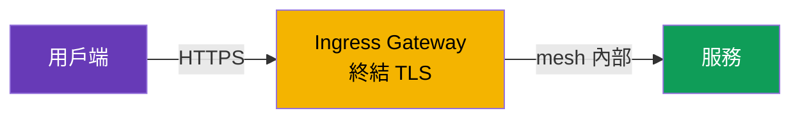
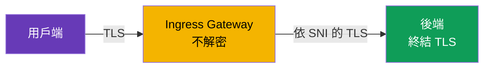
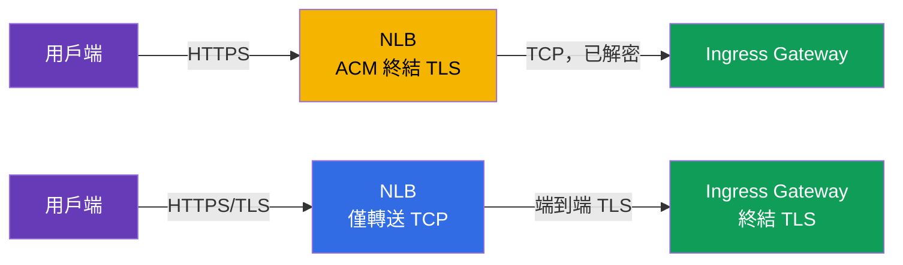
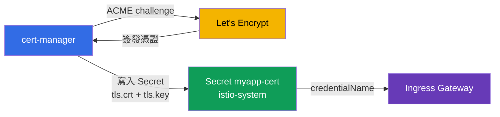

[Русская версия](ru.md) · [Eng version](en.md) · [Versión en español](es.md) · [Version française](fr.md) · [Deutsche Version](de.md) · [ქართული ვერსია](ge.md) · [日本語版](jp.md)

# 第 9 章。Edge TLS：SIMPLE、MUTUAL、PASSTHROUGH 模式的 ingress

> **接下來的內容。** 到目前為止，外部流量是透過一般 HTTP 進入。這在正式環境中不可行：入口（edge）流量必須使用 HTTPS 加密。本章將說明如何在 ingress gateway 上設定 TLS，以及有哪些模式：SIMPLE（一般 HTTPS）、MUTUAL（驗證用戶端憑證）和 PASSTHROUGH（加密直達後端）。

## 9.1. TLS 在何處終結

先說明一個重要概念。**TLS 終結**是加密流量被解密的位置。模式的選擇取決於此發生的位置。

輸入流量有三種選項：

- 用戶端加密，**ingress gateway 解密**，之後 mesh 內的流量依其既有方式傳送。這是 SIMPLE 和 MUTUAL。
- 用戶端加密，gateway **不解密**，而是將加密串流傳遞至後端，接著由**後端終結 TLS**。這是 PASSTHROUGH。

請勿將 edge TLS 與 mesh 內的 mTLS（第 12 章）混淆。這裡討論的是從叢集外部進入的流量。服務之間的內部流量由 Istio 另外自動加密。

## 9.2. Secret 中的憑證

TLS 需要憑證與私密金鑰。在 Istio 中，它們放在 Kubernetes `Secret`，而 Gateway 依名稱參照它。

```bash
kubectl create -n istio-system secret tls myapp-cert \
  --cert=myapp.crt --key=myapp.key
```

重要細節：Secret 必須位於 ingress gateway 運行的同一個 namespace（通常是 `istio-system`）。Gateway 透過 `credentialName` 參照它，istiod 則經由 SDS 將憑證交付給 Envoy（還記得第 4 章的 Secret Discovery Service 嗎）。

## 9.3. SIMPLE：一般 HTTPS

最常見的模式。用戶端透過 HTTPS 連線，gateway 解密流量，然後將其傳送給 mesh 內的服務。

```yaml
apiVersion: networking.istio.io/v1
kind: Gateway
metadata:
  name: main-gateway
spec:
  selector:
    istio: ingressgateway
  servers:
  - port:
      number: 443
      name: https
      protocol: HTTPS
    tls:
      mode: SIMPLE
      credentialName: myapp-cert   # 含憑證與金鑰的 Secret
    hosts:
    - myapp.local
```



關鍵欄位：

- **`protocol: HTTPS`** 和 **`tls.mode: SIMPLE`**：gateway 接受 TLS 流量並自行解密。
- **`credentialName`**：含有伺服器憑證的 Secret 名稱。

此後，應用程式可透過 `https://myapp.local` 存取。用戶端會如同任何一般 HTTPS 一樣驗證伺服器憑證。

## 9.4. 從 HTTP 重新導向至 HTTPS

通常會希望透過 HTTP 進來的用戶端自動重新導向至 HTTPS。為此，在 Gateway 中加入帶有 `httpsRedirect` 旗標的 HTTP 伺服器：

```yaml
  servers:
  - port:
      number: 80
      name: http
      protocol: HTTP
    hosts:
    - myapp.local
    tls:
      httpsRedirect: true    # 任何 HTTP 請求 -> 重新導向至 HTTPS
  - port:
      number: 443
      name: https
      protocol: HTTPS
    tls:
      mode: SIMPLE
      credentialName: myapp-cert
    hosts:
    - myapp.local
```

現在請求 `http://myapp.local` 會收到重新導向（301）至 `https://myapp.local`。

## 9.5. MUTUAL：驗證用戶端憑證

在 SIMPLE 中，只有用戶端驗證伺服器。但有時也需要讓**伺服器驗證用戶端**：僅允許持有有效用戶端憑證者存取。這是入口端的 mutual TLS，即 `MUTUAL` 模式。

```yaml
    tls:
      mode: MUTUAL
      credentialName: myapp-cert   # 同時包含伺服器憑證與驗證用戶端的 CA
    hosts:
    - myapp.local
```

與 SIMPLE 的差異是：在 `MUTUAL` 下，Secret 還必須包含 CA 憑證（`ca.crt`），gateway 使用它驗證用戶端憑證。沒有由該 CA 簽署之有效憑證的用戶端，根本無法通過 TLS 交握。

```bash
# 沒有用戶端憑證 - 拒絕
curl -sk https://myapp.local:32443/                       # 非 200

# 帶有用戶端憑證 - 通過
curl -sk --cert client.crt --key client.key https://myapp.local:32443/   # 200
```

MUTUAL 用於 B2B API、合作夥伴整合、內部管理介面--凡是存取權限應僅授予所發憑證持有者的地方。

## 9.6. PASSTHROUGH：由後端終結 TLS

在 SIMPLE 和 MUTUAL 中，gateway 會解密流量。但有時這並不理想：例如後端希望自行管理其 TLS，或必須將端到端加密一路保留到服務本身，而不在 gateway 上「拆封」。此時使用 `PASSTHROUGH`：gateway 不會解密流量，而是僅依 SNI（TLS 中的主機名稱）將其直接傳遞。

```yaml
  servers:
  - port:
      number: 443
      name: tls
      protocol: TLS
    tls:
      mode: PASSTHROUGH        # gateway 不解密
    hosts:
    - passthrough.local
```



PASSTHROUGH 需要一個含有 `tls` 區塊與 SNI match 的 VirtualService，讓 gateway 知道該將加密串流導向哪個服務：

```yaml
apiVersion: networking.istio.io/v1
kind: VirtualService
metadata:
  name: passthrough-vs
spec:
  hosts:
  - passthrough.local
  gateways:
  - main-gateway
  tls:                        # 是 tls，而非 http
  - match:
    - sniHosts:
      - passthrough.local
    route:
    - destination:
        host: secure-backend
        port:
          number: 443
```

請注意：既然 gateway 不解密流量，它也看不到其中的 HTTP。因此只能依 SNI 路由，不能依路徑或標頭路由。

## 9.7. 模式比較

| 模式 | 由誰終結 TLS | 用戶端驗證 | 何時使用 |
|-------|---------------------|------------------|--------------------|
| `SIMPLE` | ingress gateway | 否 | 一般公開 HTTPS |
| `MUTUAL` | ingress gateway | 是，透過用戶端憑證 | 受限存取、B2B、合作夥伴 |
| `PASSTHROUGH` | 後端本身 | 取決於後端 | 端到端加密、後端自行管理 TLS |

實務規則：預設使用 `SIMPLE`。需要僅允許持有用戶端憑證者存取時使用 `MUTUAL`。當 gateway 不應看到內容且 TLS 必須原封不動地抵達後端時，使用 `PASSTHROUGH`。

## 9.8. TLS 要在何處終結：NLB（ACM）還是 Istio

以上內容都是在**Istio 中**終結 TLS（gateway 依 Secret 中的憑證解密流量）。但在 AWS 有另一個選擇：將 **AWS Certificate Manager (ACM)** 的現成憑證直接掛載到 Network Load Balancer，TLS 便會在 **load balancer 上**、也就是 Envoy 之前終結。技術上透過 gateway Service 的註解（`aws-load-balancer-ssl-cert` + `aws-load-balancer-ssl-ports`）完成--註解詳解見[第 5 章](../05/tw.md)。這裡重要的是理解**該如何選擇**。



**選項 A：在 NLB 上處理 TLS（透過 ACM offload）。**

優點：

- AWS 管理憑證：ACM 會自行續期，私密金鑰不會離開 AWS，也無需將任何內容上傳到叢集。
- 降低 gateway 負載：NLB 處理密碼學運算，Envoy 接收已解密的流量。
- 可與 Route 53/ACM 簡易整合（點幾下即可完成憑證的 DNS 驗證）。

缺點：

- NLB 與 gateway 之間的流量**不使用這層 TLS**（僅由 VPC 邊界保護）。因此不適用於端到端加密。
- Istio **看不到**原始 TLS：無法依 SNI 路由、無法在 gateway 實作 `MUTUAL`（用戶端憑證驗證），`PASSTHROUGH` 也失去意義。
- 憑證必須存放在 ACM。您**可以匯入**自己的憑證（來自自己的 CA 或 Let's Encrypt）至 ACM，但 ACM **不會自動續期**此類匯入的憑證--必須手動重新上傳（自動續期僅適用於 ACM 自行簽發的憑證）。

**選項 B：在 Istio 中處理 TLS（SIMPLE/MUTUAL/PASSTHROUGH），NLB 採 TCP 轉送模式。**

優點：

- 完整控制：`MUTUAL`（入口端 mTLS）、`PASSTHROUGH`、依 SNI 路由。
- 任意憑證來源：自己的 CA、ACM Private CA、透過 cert-manager 使用 Let's Encrypt（第 9.9 節）。
- 加密會抵達 mesh 本身，而非在 load balancer 中斷。

缺點：

- 憑證由您自行管理（或安裝 cert-manager--見下文）。
- 密碼學負載由 gateway pods 承擔。

| 準則 | 在 NLB 上處理 TLS（ACM） | 在 Istio 中處理 TLS |
|----------|------------------|-------------|
| 誰續期憑證 | AWS（ACM） | 您 / cert-manager |
| 到 mesh 的端到端加密 | 否 | 是 |
| 入口端的 `MUTUAL`（用戶端憑證） | 否 | 是 |
| `PASSTHROUGH` / 依 SNI 路由 | 否 | 是 |
| 憑證來源 | ACM（簽發或匯入） | 任意（CA、ACM PCA、Let's Encrypt） |
| 匯入憑證的自動續期 | 否（手動上傳） | 是（cert-manager） |
| gateway 負載 | 較低 | 較高 |

實務規則：**在 EKS 上不需入口 mTLS 的簡單公開 HTTPS**，交給 NLB+ACM 處理會更方便且營運成本更低。**若需要 `MUTUAL`、`PASSTHROUGH`、端到端加密，或憑證不是來自 ACM**，請在 Istio 中終結 TLS。

## 9.9. 自動化憑證：cert-manager 與 Let's Encrypt

在正式環境中，手動上傳與續期憑證（`kubectl create secret tls ...`）既不方便又有風險--一旦忘記續期，網站就會「掛掉」。Istio 的標準解決方案是 [cert-manager](https://cert-manager.io/)：它會依 **ACME** 協定自行從憑證授權中心取得憑證（最知名的 ACME 提供者是免費的 **Let's Encrypt**），將其放入 Kubernetes `Secret`，並在到期前自動續期。

流程很簡單：cert-manager 會建立 Gateway 已能透過 `credentialName` 參照的那個 `Secret`（`tls.crt` + `tls.key`）。Istio 不需要任何特別設定--它只會看到準備好的 Secret。



首先定義憑證來源：`ClusterIssuer`（整個叢集共用）或 `Issuer`（在一個 namespace 的範圍內）。以下是透過 Route 53 進行 DNS-01 驗證的 Let's Encrypt ACME issuer 範例（在 AWS 上這比 HTTP-01 更可靠，因為不要求外部可存取連接埠 80）：

```yaml
apiVersion: cert-manager.io/v1
kind: ClusterIssuer
metadata:
  name: letsencrypt-prod
spec:
  acme:
    server: https://acme-v02.api.letsencrypt.org/directory
    email: admin@example.com
    privateKeySecretRef:
      name: letsencrypt-prod-account-key
    solvers:
    - dns01:
        route53:
          region: eu-central-1        # cert-manager 確認網域的擁有權
                                       # 透過 Route 53 中的記錄（需要 IAM 權限）
```

接著是 `Certificate` 資源，它表示「我想要這個網域的憑證，請將其放入這個 Secret」。Secret 必須位於**gateway 的 namespace**（`istio-system`），否則 Gateway 看不到它：

```yaml
apiVersion: cert-manager.io/v1
kind: Certificate
metadata:
  name: myapp-cert
  namespace: istio-system          # 與 ingress gateway 相同之處
spec:
  secretName: myapp-cert           # cert-manager 會建立此 Secret
  issuerRef:
    name: letsencrypt-prod
    kind: ClusterIssuer
  dnsNames:
  - myapp.example.com
```

後續步驟與第 9.3 節相同：Gateway 參照這個 Secret：

```yaml
    tls:
      mode: SIMPLE
      credentialName: myapp-cert   # 由 cert-manager 填入的 Secret
```

簡要說明 challenge：

- **DNS-01**（上例）：cert-manager 在 DNS zone（Route 53、Cloud DNS 等）建立 TXT 記錄。即使對內部 gateway 和 wildcard 憑證（`*.example.com`）也能運作。
- **HTTP-01**：Let's Encrypt 透過請求 `http://<網域>/.well-known/...` 的檔案來驗證網域。這要求 gateway 的連接埠 80 可從網際網路存取，且 challenge 請求能抵達 cert-manager 的 solver；在 Istio 的組合中設定較複雜，因此 AWS 上通常使用 DNS-01。

cert-manager+Let's Encrypt 的優點：免費、完全自動續期、所有網域使用統一機制。缺點：必須維運 cert-manager 本身，Let's Encrypt 有[簽發限制](https://letsencrypt.org/docs/rate-limits/)（除錯時使用 staging-issuer `acme-staging-v02`），而 DNS-01 需要修改 DNS zone 的權限。

## 9.10. 最佳實務

- **一律將 HTTP 重新導向至 HTTPS**（`httpsRedirect: true`，第 9.4 節）--正式環境中不得使用公開 HTTP。
- **設定最低 TLS 版本。** 預設採用 TLS 1.2 以上，直接在 Gateway server 中停用舊協定：

  ```yaml
    - port:
        number: 443
        name: https
        protocol: HTTPS
      tls:
        mode: SIMPLE
        credentialName: myapp-cert
        minProtocolVersion: TLSV1_2      # 禁用 TLS 1.0/1.1
        # cipherSuites: [ECDHE-ECDSA-AES256-GCM-SHA384, ...]  # 視需要
  ```

- **自動化憑證管理。** 手動 `kubectl create secret tls` 僅用於實驗與除錯。正式環境請使用 cert-manager（Let's Encrypt/自己的 CA）或 NLB 上的 ACM。
- **不要將私密金鑰儲存在 git。** 金鑰與憑證是機密資訊；儲存庫中僅保留 `Certificate`/`Issuer` manifests，而非金鑰本身。
- **每個網域/主機使用獨立的 Secret。** 不要將不相容網域放在同一張憑證；若是一組子網域，請使用 wildcard（`*.example.com`）或 SAN 憑證。
- **限制對 gateway secrets 的存取。** 含有金鑰的 Secret 位於 gateway namespace（`istio-system`）；請透過 RBAC 限制存取，使只有需要的人可以讀取。
- **監控有效期限。** 即使有自動續期，也要追蹤到期日（在前 N 天告警），以防自動化失效。
- **將公開與內部流量分開**至不同 ingress gateway（第 5 章）：它們使用不同憑證，且 TLS 需求也不同。
- **公開網站使用 HSTS。** `Strict-Transport-Security` 標頭會強制瀏覽器一律使用 HTTPS；可透過 VirtualService 或 EnvoyFilter 中的 `headers` 新增。

## 9.11. 本章摘要

- 進入叢集的流量必須加密；在 `Gateway` 的 `tls` 區塊設定 TLS。
- 憑證儲存在 gateway namespace 的 `Secret` 中，並透過 `credentialName` 連接（經由 SDS 交付至 Envoy）。
- **SIMPLE** 是一般 HTTPS：gateway 終結 TLS，用戶端只驗證伺服器。
- **`httpsRedirect: true`** 會自動將 HTTP 重新導向至 HTTPS。
- **MUTUAL** 讓 gateway 額外驗證用戶端憑證；Secret 中需要 CA。
- **PASSTHROUGH** 不會讓 gateway 解密流量，由後端終結；僅可依 SNI 路由（需要帶有 `tls` 與 `sniHosts` 的 VirtualService）。
- TLS 可使用 ACM 的現成憑證**在 NLB 上**終結（offload，AWS 自動續期），或**在 Istio 中**終結（完整控制、mTLS/passthrough、任意憑證來源）--選擇取決於是否需要 `MUTUAL`、`PASSTHROUGH` 與端到端加密。
- 正式環境的憑證應自動簽發：**cert-manager + Let's Encrypt**（ACME，在 AWS 使用 DNS-01）會放入可供 `credentialName` 參照的準備好 Secret。
- 最佳實務：重新導向至 HTTPS、`minProtocolVersion: TLSV1_2`、自動化簽發、金鑰不進 git、Secret 的 RBAC、有效期限監控、HSTS。
- Edge TLS 與 mesh 內的 mTLS 並不相同（第 12 章）。

## 9.12. 自我檢查問題

1. 「TLS 終結」是什麼意思？就此而言，SIMPLE 與 PASSTHROUGH 有何差異？
2. 含有憑證的 Secret 應位於何處，Gateway 如何參照它？
3. MUTUAL 與 SIMPLE 有何不同，Secret 還需要什麼？
4. 為什麼在 PASSTHROUGH 下不能依 HTTP 路徑路由，而只能依 SNI？
5. 如何設定從 HTTP 至 HTTPS 的自動重新導向？
6. 在 NLB（ACM）與 Istio 中終結 TLS 有何差異？何時應選擇哪一種？
7. cert-manager 與 Let's Encrypt 如何為 Istio Gateway 簽發憑證，以及為何 AWS 上 DNS-01 比 HTTP-01 更方便？
8. 應對 edge TLS 採取哪些安全措施（協定版本、金鑰儲存、Secret 存取）？

## 實作

練習在 gateway 上終結 TLS（SIMPLE 模式）：

🧪 實驗 13：[tasks/ica/labs/13](../../labs/13/README_TW.MD)

練習 MUTUAL 與 PASSTHROUGH 模式：

🧪 實驗 29：[tasks/ica/labs/29](../../labs/29/README_TW.MD)

---
[目錄](../README_TW.md) · [第 8 章](../08/tw.md) · [第 10 章](../10/tw.md)
