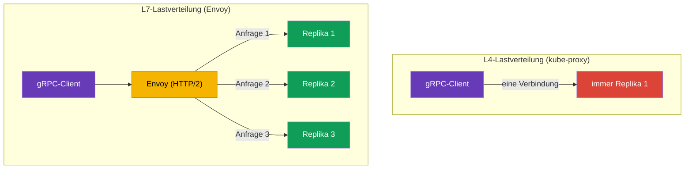

[RU version](ru.md) · [Eng version](en.md) · [Versión en español](es.md) · [Version française](fr.md)

# Kapitel 10. Routing von TCP, gRPC und WebSocket

> **Was kommt als Nächstes.** Bisher haben wir mit HTTP-Traffic gearbeitet. Aber nicht
> jede Kommunikation zwischen Services ist HTTP: Es gibt Datenbanken, Message Broker,
> eigene Binärprotokolle über TCP und außerdem gRPC und WebSocket. In diesem Kapitel
> klären wir, wie Istio mit TCP-Traffic umgeht (einschließlich eines praktischen
> Anwendungsfalls - der Bereitstellung von Redis/RabbitMQ im internen VPC-Netz), warum
> gRPC einen Sonderfall darstellt und wie man mit langlebigen WebSocket-Verbindungen
> umgeht. Einem eigenen Ingress-Standard - der Kubernetes Gateway API - ist das folgende
> Kapitel 11 gewidmet.

## 10.1. Wozu TCP-Routing nötig ist

HTTP-Routing kann in die Anfrage hineinschauen: Header, Pfade, Methoden. Aber wenn der
Traffic zum Beispiel PostgreSQL oder ein beliebiges TCP-Protokoll ist, gibt es dort keine
HTTP-Header. Istio kann ihn dennoch steuern, aber auf der Ebene der Verbindungen (L4):
einen Port weiterleiten, Traffic zwischen Versionen verteilen, nach SNI für TLS leiten.

## 10.2. Weiterleitung eines TCP-Ports am Gateway

Zuerst deklarieren wir am Gateway einen TCP-Port (Protokoll `TCP` statt `HTTP`):

```yaml
apiVersion: networking.istio.io/v1
kind: Gateway
metadata:
  name: tcp-gateway
spec:
  selector:
    istio: ingressgateway
  servers:
  - port:
      number: 3000
      name: tcp
      protocol: TCP      # nicht HTTP, sondern TCP
    hosts:
    - "*"
```

Danach leitet der VirtualService diesen TCP-Traffic an den Service. Beachten Sie: Der
Block heißt `tcp`, nicht `http`, und das Match läuft nach Port, nicht nach Headern.

```yaml
apiVersion: networking.istio.io/v1
kind: VirtualService
metadata:
  name: tcp-echo-vs
spec:
  hosts:
  - "*"
  gateways:
  - tcp-gateway
  tcp:                    # genau tcp
  - match:
    - port: 3000
    route:
    - destination:
        host: tcp-echo
        port:
          number: 9000
```


## 10.3. Gewichtetes TCP-Routing

Wie bei HTTP kann TCP-Traffic nach Gewichten zwischen Versionen verteilt werden. Das ist
für Canary auch bei Nicht-HTTP-Services nützlich:

```yaml
  tcp:
  - match:
    - port: 3000
    route:
    - destination:
        host: tcp-echo
        subset: v1
      weight: 80        # 80% der Verbindungen auf v1
    - destination:
        host: tcp-echo
        subset: v2
      weight: 20        # 20% auf v2
```

Den Unterschied zu HTTP muss man verstehen: HTTP-Gewichte verteilen **Anfragen**, während
TCP-Gewichte **Verbindungen** verteilen. Innerhalb einer einzelnen TCP-Verbindung geht der
gesamte Traffic an dieselbe Replika, weil Envoy den Inhalt des Datenstroms nicht in
einzelne Anfragen zerlegt. Nach Headern, Pfaden und Methoden kann man bei TCP ebenfalls
nicht matchen - nur nach Port (und nach SNI für TLS, wie bei PASSTHROUGH aus Kapitel 9).

## 10.4. Beispiel: Redis/RabbitMQ im internen VPC-Netz

Eine häufige Aufgabe: In EKS läuft Redis (oder RabbitMQ), und es wird Zugriff von anderen
Services in der VPC benötigt - aber **nicht aus dem Internet**. Das ist ein reiner
TCP-Fall: Redis und AMQP sind kein HTTP, deshalb steuern wir sie auf L4, und die „Tür" ins
private Netz öffnen wir über ein **internes** Ingress-Gateway mit einem privaten NLB.

Ein zweiteiliges Schema:

1. **Internes Ingress-Gateway** - ein separates Gateway, dessen Service einen NLB mit
   `scheme: internal` erhält (die Adresse wird nur in private IPs der VPC aufgelöst, aus
   dem Internet nicht erreichbar). Wie man ein zweites Gateway ausrollt und einen internen
   NLB daran hängt, haben wir in [Kapitel 5](../05/ru.md) besprochen.
2. **Gateway + VirtualService auf den TCP-Port** dieses Services, ausgerichtet auf das
   interne Gateway.


Das Gateway lauscht auf den TCP-Port von Redis und ist über `selector` an das interne
Gateway gebunden:

```yaml
apiVersion: networking.istio.io/v1
kind: Gateway
metadata:
  name: redis-gateway
spec:
  selector:
    istio: ingressgateway-internal   # internes Gateway (privater NLB)
  servers:
  - port:
      number: 6379
      name: tcp-redis
      protocol: TCP
    hosts:
    - "*"
```

Der VirtualService leitet den TCP-Port an den Redis-Service (Block `tcp`, Match nach Port):

```yaml
apiVersion: networking.istio.io/v1
kind: VirtualService
metadata:
  name: redis-vs
spec:
  hosts:
  - "*"
  gateways:
  - redis-gateway
  tcp:
  - match:
    - port: 6379
    route:
    - destination:
        host: redis.data.svc.cluster.local   # Kubernetes Service Redis
        port:
          number: 6379
```

Für RabbitMQ ist alles dasselbe - nur die Ports ändern sich: `5672` (AMQP) und, falls
nötig, `15672` (Management-UI, das man aber üblicherweise nicht einmal ins interne Netz
stellt). Clients in der VPC verbinden sich über den DNS-Namen des internen NLB
(`*.elb.amazonaws.com`, wird in private IPs aufgelöst).

Wichtige Feinheiten:

- Das ist **L4**: Routing nur nach Port, keine Pfade/Header; Gewichte verteilen
  Verbindungen (Abschnitt 10.3).
- **Sicherheit.** Der NLB `internal` sperrt den Zugriff aus dem Internet, aber innerhalb
  der VPC ist der Port offen. Beschränken Sie, wer sich verbinden darf: Security Group am
  NLB, `AuthorizationPolicy` auf der Mesh-Seite und mTLS zwischen Services (Kapitel 12-13).
  Nach außen stellt man solche Services nicht.
- Ist der Client außerhalb des Mesh (eine gewöhnliche VM in der VPC), wird der Traffic vom
  NLB bis zum Pod von Redis innerhalb des Clusters nicht automatisch verschlüsselt -
  verwenden Sie bei Bedarf das TLS von Redis/RabbitMQ selbst oder PASSTHROUGH nach SNI
  (Kapitel 9).

## 10.5. WebSocket

WebSocket beginnt als gewöhnliche HTTP/1.1-Anfrage mit dem Header `Upgrade: websocket`,
woraufhin die Verbindung zu einem dauerhaften bidirektionalen Kanal „hochgestuft" wird.
Für Istio ist das L7-HTTP, und **WebSocket muss man nicht extra aktivieren** - Envoy
unterstützt das Upgrade von Haus aus. Die Route beschreibt man mit dem gewöhnlichen
`http`-Block im VirtualService (Gateway und Service - wie für jede HTTP-Anwendung aus
Kapitel 5).

Der Hauptfallstrick sind **Timeouts**, wie auch beim gRPC-Streaming. Eine
WebSocket-Verbindung lebt lange (Minuten und Stunden), und ein gewöhnlicher `timeout` im
VirtualService würde sie nach Ablauf der Zeit abbrechen. Deshalb setzt man für
WebSocket-Routen den Timeout entweder gar nicht oder groß - im Beispiel unten ist er direkt
in der Route entfernt (`timeout: 0s`):

```yaml
apiVersion: networking.istio.io/v1
kind: VirtualService
metadata:
  name: chat-vs
  namespace: apps
spec:
  hosts:
  - chat.example.com          # derselbe Host wie im Gateway
  gateways:
  - main-gateway              # Name des Gateway mit HTTP/HTTPS-Port (Kapitel 5)
  http:
  - match:
    - uri:
        prefix: /ws           # WebSocket-Endpunkt
    timeout: 0s               # 0 = ohne Begrenzung (für langlebige Verbindungen)
    route:
    - destination:
        host: chat-backend    # Kubernetes Service des Backends
        port:
          number: 8080
```

Noch ein paar Punkte:

- **Idle-Timeout.** Lange Leerlaufphasen in der Verbindung kann nicht nur Istio abbrechen,
  sondern auch der NLB (beim AWS NLB Idle-Timeout, standardmäßig 350s) - konfigurieren Sie
  für WebSocket auf dem Server Ping/Pong (Heartbeat), damit die Verbindung nicht als
  leerlaufend gilt.
- **Session Affinity.** Wenn das Backend den Sitzungszustand hält, binden Sie den Client
  über Consistent Hash in der DestinationRule an eine Replika (`consistentHash` nach Cookie
  oder Header, Kapitel 7) - sonst kann ein erneutes Verbinden auf eine andere Replika
  gehen.

## 10.6. Besonderheiten von gRPC

gRPC wird oft mit „einfach nur TCP" verwechselt, aber das ist ein wichtiger Fehler. gRPC
arbeitet **über HTTP/2**, und damit ist es für Istio HTTP-Traffic (L7), nicht rohes TCP.
Daraus folgen zwei Schlussfolgerungen.

Erstens stehen für gRPC alle L7-Möglichkeiten zur Verfügung: Routing nach Headern, Retries,
Timeouts, Lastverteilung pro Anfrage, detaillierte Metriken. Das heißt, gRPC konfigurieren
Sie über den `http`-Block im VirtualService, wie gewöhnliches HTTP, und nicht über `tcp`.

Zweitens - und das ist der Hauptgrund, ein Mesh für gRPC einzusetzen - das Problem der
Lastverteilung. gRPC hält **eine langlebige HTTP/2-Verbindung** und multiplext in ihr viele
Anfragen. Gewöhnliche L4-Lastverteilung (kube-proxy) verteilt den Traffic nach
Verbindungen, deshalb „kleben" alle Anfragen des Clients an einer Replika, und die
Lastverteilung funktioniert faktisch nicht.



Envoy versteht HTTP/2 und verteilt die Last **nach einzelnen Anfragen** innerhalb einer
Verbindung: Jeder gRPC-Aufruf kann an seine eigene Replika gehen. Das ist einer der
häufigsten Gründe, warum man gRPC-Services in ein Mesh bringt.

Damit Istio das Protokoll richtig erkennt, muss man den Port des Services **explizit
benennen**: Der Portname muss mit `grpc` beginnen (zum Beispiel `grpc-web`) oder verwenden
Sie das Feld `appProtocol: grpc`. Benennt man den Port neutral (`tcp-...`), betrachtet
Istio den Traffic als gewöhnliches TCP und alle L7-Möglichkeiten gehen verloren.

```yaml
apiVersion: v1
kind: Service
metadata:
  name: my-grpc-service
spec:
  ports:
  - name: grpc-api        # Name beginnt mit grpc -> Istio sieht HTTP/2
    port: 9000
    appProtocol: grpc     # oder explizit über appProtocol
```

Merken Sie sich die Regel: **gRPC ist HTTP/2, nicht TCP**. Konfigurieren Sie es wie HTTP
und vergessen Sie nicht, den Port richtig zu benennen.

## 10.7. gRPC am Ingress

Um gRPC von außen über ein Ingress-Gateway anzunehmen, braucht man drei Ressourcen, wie
auch für gewöhnliches HTTP aus Kapitel 5, nur mit den Vorbehalten zu HTTP/2:

1. **Service** der gRPC-Anwendung - mit richtig benanntem Port, damit Istio versteht, dass
   es HTTP/2 ist (Abschnitt 10.6).
2. **Gateway** - öffnet einen Port am Ingress-Gateway mit dem Protokoll `GRPC` (oder
   `HTTP2`).
3. **VirtualService** - leitet den Traffic vom Gateway an den Service; die Route beschreibt
   man im `http`-Block (nicht `tcp`!), weil gRPC für Istio L7 ist.

**1. Service der gRPC-Anwendung.** Der Portname muss mit `grpc` beginnen oder über
`appProtocol: grpc` gesetzt sein, sonst hält Istio den Traffic für gewöhnliches TCP:

```yaml
apiVersion: v1
kind: Service
metadata:
  name: grpc-server
  namespace: apps
spec:
  selector:
    app: grpc-server
  ports:
  - name: grpc-api          # Name beginnt mit grpc -> Istio sieht HTTP/2
    port: 9000
    targetPort: 9000
    appProtocol: grpc       # oder explizit über appProtocol
```

**2. Gateway.** Der Port wird mit dem Protokoll `GRPC` (oder `HTTP2`) deklariert.
Gewöhnliches `HTTP` passt hier nicht: Das Gateway muss wissen, dass es HTTP/2 ist, sonst
funktionieren Multiplexing und Lastverteilung pro Anfrage nicht. Üblicherweise stellt man
gRPC über TLS bereit, deshalb fügen wir `tls` hinzu (Zertifikat im Secret `grpc-cert`, wie
in Kapitel 9):

```yaml
apiVersion: networking.istio.io/v1
kind: Gateway
metadata:
  name: grpc-gateway
  namespace: apps
spec:
  selector:
    istio: ingressgateway     # auf welches Ingress-Gateway anzuwenden (Kapitel 5)
  servers:
  - port:
      number: 443
      name: grpc-tls
      protocol: GRPC          # oder HTTP2; nicht einfach HTTP
    tls:
      mode: SIMPLE
      credentialName: grpc-cert
    hosts:
    - grpc.example.com
```

**3. VirtualService.** Wird über `gateways` an das Gateway gebunden und leitet den Traffic
an den Service. Die Route - im `http`-Block; nach der gRPC-Methode kann man über
`uri.prefix` matchen, weil der Methodenname ein HTTP/2-Path der Form
`/<package>.<Service>/<Method>` ist:

```yaml
apiVersion: networking.istio.io/v1
kind: VirtualService
metadata:
  name: grpc-server-vs
  namespace: apps
spec:
  hosts:
  - grpc.example.com          # derselbe Host wie im Gateway
  gateways:
  - grpc-gateway              # Name des Gateway aus Schritt 2 (kann namespace/name sein)
  http:
  - match:
    - uri:
        prefix: /helloworld.Greeter/   # optional: Route nach einem konkreten gRPC-Service
    route:
    - destination:
        host: grpc-server     # Name des Service aus Schritt 1
        port:
          number: 9000
```

Wenn man nicht nach Methoden aufteilen muss, kann man den `match`-Block weglassen - dann
geht der gesamte gRPC-Traffic des Hosts an `grpc-server`. Der Client verbindet sich über
TLS mit `grpc.example.com:443`, und danach verteilt die Lastverteilung pro Anfrage
(Abschnitt 10.6) die Aufrufe auf die Replikas.

## 10.8. gRPC: Retries, Timeouts und Connection Pool

Da gRPC HTTP ist, ist die Resilienz aus Kapitel 8 auf es anwendbar, aber mit Feinheiten.

**Retries nach gRPC-Statuscodes.** gRPC hat eigene Statuscodes (nicht HTTP), und `retryOn`
kann sie verstehen - listen Sie genau die gRPC-Bedingungen auf. Konfiguriert werden sie im
selben VirtualService wie die Route (das ist derselbe `grpc-server-vs` aus 10.7, nur mit
einem `retries`-Block):

```yaml
apiVersion: networking.istio.io/v1
kind: VirtualService
metadata:
  name: grpc-server-vs
  namespace: apps
spec:
  hosts:
  - grpc.example.com
  gateways:
  - grpc-gateway
  http:
  - retries:
      attempts: 3
      perTryTimeout: 2s
      retryOn: unavailable,resource-exhausted,cancelled   # gRPC-Statuscodes
    route:
    - destination:
        host: grpc-server     # derselbe Service wie in 10.7
        port:
          number: 9000
```

Nützliche Werte für `retryOn` bei gRPC: `cancelled`, `deadline-exceeded`, `internal`,
`resource-exhausted`, `unavailable`. Wie bei HTTP (Kapitel 8) sollte man nur idempotente
Aufrufe wiederholen.

**Timeouts und Streaming - Vorsicht.** Das Feld `timeout` im VirtualService begrenzt die
gesamte „Anfragedauer". Für Unary-Aufrufe (eine Anfrage - eine Antwort) ist das in Ordnung.
Aber für **Server-Streaming / Bidi-Streaming**-RPC, bei denen die Verbindung lange lebt und
Daten im Strom fließen, würde ein gewöhnlicher `timeout` den Stream nach Ablauf der Zeit
abbrechen. Für Streaming-Services setzt man den Timeout entweder gar nicht oder bewusst
groß.

**Connection Pool und Rebalancing.** gRPC hält eine langlebige HTTP/2-Verbindung. Selbst
mit Envoy erzeugt das ein Problem: Wenn Sie den Service **skaliert** haben (Replikas
hinzugefügt), hängen die alten Verbindungen weiter an den früheren Endpoints. Es helfen die
Einstellungen `connectionPool` in der DestinationRule:

```yaml
apiVersion: networking.istio.io/v1
kind: DestinationRule
metadata:
  name: grpc-server-dr
  namespace: apps
spec:
  host: grpc-server           # derselbe Service wie in 10.7
  trafficPolicy:
    connectionPool:
      http:
        http2MaxRequests: 1000          # max. gleichzeitige Anfragen (für HTTP/2 ist genau das wichtig)
        maxRequestsPerConnection: 100   # nach N Anfragen Verbindung neu aufbauen -> nimmt neue Replikas auf
```

Für HTTP/2 und gRPC ist das Schlüssellimit `http2MaxRequests` (Maximum gleichzeitiger
Anfragen), nicht `http1MaxPendingRequests` aus HTTP/1.1. Und `maxRequestsPerConnection`
zwingt Envoy, die Verbindung periodisch neu zu öffnen, damit sich der Traffic auch auf frisch
hinzugefügte Replikas verteilt.

## 10.9. Vergleich: HTTP, TCP, gRPC

| | HTTP (L7) | TCP (L4) | gRPC (HTTP/2, L7) |
|---|---|---|---|
| Block im VirtualService | `http` | `tcp` | `http` |
| Match nach Headern/Pfaden | ja | nein | ja (Methode = Path) |
| Match nach SNI | - | ja (TLS) | - |
| Gewichte verteilen | Anfragen | Verbindungen | Anfragen |
| Retries/Timeouts | ja | nein | ja (gRPC-Statuscodes) |
| Lastverteilung | pro Anfrage | pro Verbindung | pro Anfrage |
| Portname | `http` | `tcp` | `grpc` / `appProtocol: grpc` |

WebSocket in dieser Tabelle - das ist die Spalte HTTP (L7): wird wie HTTP über den
`http`-Block geroutet, das Upgrade unterstützt Istio von Haus aus, aber die Verbindung ist
langlebig (siehe 10.5).

## 10.10. Best Practices

- **Benennen Sie die Ports richtig.** `grpc...` oder `appProtocol: grpc` für gRPC,
  `http...` für HTTP, `tcp...` für rohes TCP. Ein Fehler im Portnamen = Verlust der
  L7-Möglichkeiten (bei gRPC ist das besonders schmerzhaft - die Lastverteilung geht
  kaputt).
- **Am Ingress für gRPC - Protokoll `GRPC`/`HTTP2`**, nicht `HTTP`.
- **Retries für gRPC - nach gRPC-Statuscodes** (`unavailable`, `resource-exhausted` usw.)
  und nur für idempotente Aufrufe.
- **Setzen Sie keinen gewöhnlichen `timeout` auf Streaming-RPC** - er würde den langlebigen
  Strom abbrechen.
- **Konfigurieren Sie für gRPC `http2MaxRequests` und `maxRequestsPerConnection`**, damit
  sich die Verbindungen nach dem Skalieren auf neue Replikas neu verteilen.
- **TCP - nur für das, was wirklich kein HTTP ist** (DBs, Broker, eigene Binärprotokolle).
  Alles, was HTTP/2 kann, führen Sie als HTTP/gRPC, um der L7-Möglichkeiten willen.
- **Stellen Sie DBs und Broker nicht ins Internet.** Redis/RabbitMQ stellt man nur ins
  interne Netz bereit - über ein internes Ingress-Gateway mit NLB `scheme: internal`, plus
  Security Group, `AuthorizationPolicy` und mTLS.
- **Für WebSocket und Streaming entfernen Sie den `timeout`** (`0s` oder ein großer Wert)
  und konfigurieren Sie Heartbeat, damit die Verbindung nicht durch das Idle-Timeout
  abreißt (auch am NLB).

## 10.11. Zusammenfassung des Kapitels

- Istio steuert nicht nur HTTP, sondern auch TCP-Traffic - auf der Ebene der Verbindungen
  (L4).
- Für TCP deklariert man am Gateway einen Port mit `protocol: TCP`, und im VirtualService
  verwendet man den Block `tcp` mit einem Match nach Port.
- TCP-Gewichte verteilen Verbindungen (nicht Anfragen); man kann nicht nach Headern und
  Pfaden matchen, nur nach Port und SNI.
- **gRPC ist HTTP/2, nicht TCP**: Es wird wie HTTP konfiguriert, erhält alle
  L7-Möglichkeiten und vor allem Lastverteilung pro Anfrage (L4 würde alles an eine Replika
  verteilen). Den Port muss man `grpc...` benennen oder `appProtocol: grpc` setzen.
- Am **Ingress für gRPC** deklariert man den Gateway-Port mit dem Protokoll `GRPC`/`HTTP2`;
  die Route - im `http`-Block, nach der gRPC-Methode kann man über `uri.prefix` matchen.
- Resilienz für gRPC: Retries nach **gRPC-Statuscodes** (`unavailable`,
  `resource-exhausted`…), Vorsicht mit `timeout` beim **Streaming**, und `http2MaxRequests`
  sowie `maxRequestsPerConnection` in `connectionPool` helfen, langlebige Verbindungen neu
  zu verteilen.
- **Redis/RabbitMQ ins interne VPC-Netz** stellt man als TCP über ein internes
  Ingress-Gateway mit privatem NLB (`scheme: internal`) bereit; nach außen stellt man sie
  nicht, den Zugriff beschränkt man per SG/AuthorizationPolicy/mTLS.
- **WebSocket** ist L7-HTTP (Upgrade wird von Haus aus unterstützt); das Wichtigste ist,
  den `timeout` für die langlebige Verbindung zu entfernen und Heartbeat gegen
  Idle-Timeouts zu konfigurieren.

## 10.12. Fragen zur Selbstüberprüfung

1. Wodurch unterscheidet sich TCP-Routing von HTTP? Was kann man bei TCP nicht matchen?
2. Verteilen Gewichte beim TCP-Routing Anfragen oder Verbindungen? Warum?
3. Warum konfiguriert man gRPC in Istio wie HTTP und nicht wie TCP?
4. Wie benennt man den Port richtig, damit Istio gRPC erkennt?
5. Warum leidet ohne Mesh die Lastverteilung von gRPC?
6. Welches Protokoll gibt man am Gateway an, um gRPC von außen anzunehmen, und warum nicht
   `HTTP`?
7. Wodurch unterscheiden sich Retries für gRPC von HTTP? Warum ist es gefährlich, einen
   `timeout` auf einen Streaming-RPC zu setzen?
8. Wozu konfiguriert man für gRPC `maxRequestsPerConnection`?
9. Wie stellt man Redis oder RabbitMQ aus EKS nur ins interne VPC-Netz bereit, aber nicht
   ins Internet?
10. Muss man WebSocket in Istio extra aktivieren? Was ist der Hauptfallstrick bei
    WebSocket-Verbindungen und wie umgeht man ihn?

## Praxis

Üben Sie das Routing von rohem TCP-Traffic (gewichtete Verteilung nach Verbindungen):

🧪 Lab 28: [tasks/ica/labs/28](../../labs/28/README_DE.MD)

Üben Sie gRPC in der Praxis - genau das, was sich im Text nicht mit Worten überprüfen lässt:

- Lastverteilung pro Anfrage bei gRPC: ein Client, mehrere Replikas, Anfragen verteilen
  sich tatsächlich auf verschiedene Pods (im Unterschied zu L4, wo alles an einer Replika
  klebt);
- richtige Benennung des Ports (`grpc` / `appProtocol: grpc`) und was ohne sie kaputtgeht;
- Retries und Timeouts für gRPC wie für HTTP.

🧪 Lab 32: [tasks/ica/labs/32](../../labs/32/README_DE.MD)

---
[Inhaltsverzeichnis](../README_DE.md) · [Kapitel 9](../09/de.md) · [Kapitel 11](../11/de.md)
