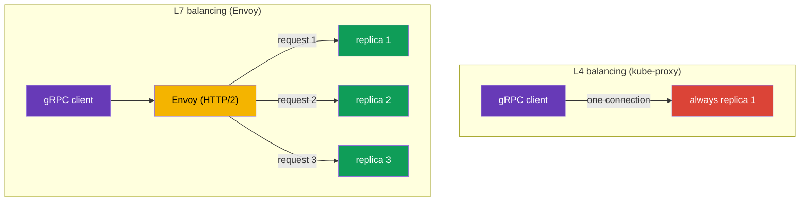

[RU version](ru.md)

# Chapter 10. Routing TCP, gRPC and WebSocket traffic

> **What's next.** So far we have worked with HTTP traffic. But not all service communication
> is HTTP: there are databases, message brokers, custom binary protocols over TCP, and also
> gRPC and WebSocket. In this chapter we look at how Istio handles TCP traffic (including a
> practical case - exposing Redis/RabbitMQ to the internal VPC network), why gRPC stands
> apart, and how to deal with long-lived WebSocket connections. A separate ingress standard -
> the Kubernetes Gateway API - is the subject of the next chapter 11.

## 10.1. Why TCP routing is needed

HTTP routing can look inside a request: headers, paths, methods. But if the traffic is, say,
PostgreSQL or an arbitrary TCP protocol, there are no HTTP headers there. Istio can still
manage it, but at the connection level (L4): forward a port, split traffic across versions,
route by SNI for TLS.

## 10.2. Forwarding a TCP port on the gateway

First, on the Gateway we declare a TCP port (protocol `TCP` instead of `HTTP`):

```yaml
apiVersion: networking.istio.io/v1
kind: Gateway
metadata:
  name: tcp-gateway
spec:
  selector:
    istio: ingressgateway
  servers:
  - port:
      number: 3000
      name: tcp
      protocol: TCP      # not HTTP, but TCP
    hosts:
    - "*"
```

Then a VirtualService routes this TCP traffic to a service. Note: the block is called `tcp`,
not `http`, and the match is by port, not by headers.

```yaml
apiVersion: networking.istio.io/v1
kind: VirtualService
metadata:
  name: tcp-echo-vs
spec:
  hosts:
  - "*"
  gateways:
  - tcp-gateway
  tcp:                    # tcp specifically
  - match:
    - port: 3000
    route:
    - destination:
        host: tcp-echo
        port:
          number: 9000
```


## 10.3. Weighted TCP routing

As with HTTP, TCP traffic can be split across versions by weights. This is useful for canary
even for non-HTTP services:

```yaml
  tcp:
  - match:
    - port: 3000
    route:
    - destination:
        host: tcp-echo
        subset: v1
      weight: 80        # 80% of connections to v1
    - destination:
        host: tcp-echo
        subset: v2
      weight: 20        # 20% to v2
```

An important difference from HTTP: HTTP weights distribute **requests**, while TCP weights
distribute **connections**. Within a single TCP connection all traffic goes to the same
replica, because Envoy does not break the stream into individual requests. You also cannot
match by headers, paths and methods for TCP - only by port (and by SNI for TLS, as in
PASSTHROUGH from chapter 9).

## 10.4. Example: Redis/RabbitMQ to the internal VPC network

A common task: Redis (or RabbitMQ) runs in EKS, and it needs to be reachable from other
services in the VPC - but **not from the internet**. This is a pure TCP case: Redis and AMQP
are not HTTP, so we manage them at L4, and we open the "door" into the private network via an
**internal** ingress gateway with a private NLB.

The scheme has two parts:

1. **An internal ingress gateway** - a separate gateway whose Service gets an NLB with
   `scheme: internal` (its address resolves only to private VPC IPs and is unreachable from
   the internet). How to deploy a second gateway and attach an internal NLB to it was covered
   in [chapter 5](../05/en.md).
2. **A Gateway + VirtualService for the service's TCP port**, pointed at the internal gateway.


The Gateway listens on the Redis TCP port and is bound to the internal gateway via
`selector`:

```yaml
apiVersion: networking.istio.io/v1
kind: Gateway
metadata:
  name: redis-gateway
spec:
  selector:
    istio: ingressgateway-internal   # the internal gateway (private NLB)
  servers:
  - port:
      number: 6379
      name: tcp-redis
      protocol: TCP
    hosts:
    - "*"
```

The VirtualService routes the TCP port to the Redis service (a `tcp` block, matching by
port):

```yaml
apiVersion: networking.istio.io/v1
kind: VirtualService
metadata:
  name: redis-vs
spec:
  hosts:
  - "*"
  gateways:
  - redis-gateway
  tcp:
  - match:
    - port: 6379
    route:
    - destination:
        host: redis.data.svc.cluster.local   # the Kubernetes Service for Redis
        port:
          number: 6379
```

For RabbitMQ it is all the same - only the ports change: `5672` (AMQP) and, if needed,
`15672` (the management UI, but that is usually not exposed even to the internal network).
Clients in the VPC connect by the internal NLB's DNS name (`*.elb.amazonaws.com`, resolving
to private IPs).

Important nuances:

- This is **L4**: routing only by port, no paths/headers; weights distribute connections
  (section 10.3).
- **Security.** An `internal` NLB closes off internet access, but inside the VPC the port is
  open. Restrict who may connect: a security group on the NLB, an `AuthorizationPolicy` on
  the mesh side, and mTLS between services (chapters 12–13). Such services are not exposed to
  the outside.
- If the client is outside the mesh (a plain VM in the VPC), the traffic from the NLB to the
  Redis pod inside the cluster is not encrypted automatically - if needed, use Redis/RabbitMQ's
  own TLS or PASSTHROUGH by SNI (chapter 9).

## 10.5. WebSocket

WebSocket starts as an ordinary HTTP/1.1 request with an `Upgrade: websocket` header, after
which the connection is "upgraded" to a persistent bidirectional channel. For Istio this is
L7 HTTP, and **you do not need to enable WebSocket specially** - Envoy supports the upgrade
out of the box. The route is described with an ordinary `http` block in a VirtualService (the
Gateway and Service are as for any HTTP application from chapter 5).

The main pitfall is **timeouts**, just as with gRPC streaming. A WebSocket connection lives a
long time (minutes and hours), while an ordinary `timeout` in the VirtualService will abort
it once the time is up. So for WebSocket routes the timeout is either not set or set to a
large value - in the example below it is removed right in the route (`timeout: 0s`):

```yaml
apiVersion: networking.istio.io/v1
kind: VirtualService
metadata:
  name: chat-vs
  namespace: apps
spec:
  hosts:
  - chat.example.com          # the same host as in the Gateway
  gateways:
  - main-gateway              # the name of the Gateway with an HTTP/HTTPS port (chapter 5)
  http:
  - match:
    - uri:
        prefix: /ws           # the WebSocket endpoint
    timeout: 0s               # 0 = no limit (for long-lived connections)
    route:
    - destination:
        host: chat-backend    # the backend Kubernetes Service
        port:
          number: 8080
```

A couple more points:

- **Idle timeout.** Long idle periods on a connection can be dropped not only by Istio but
  also by the NLB (AWS NLB has an idle timeout, 350s by default) - for WebSocket set up
  ping/pong (a heartbeat) on the server so the connection is not considered idle.
- **Session affinity.** If the backend keeps session state, pin the client to a single
  replica via consistent hash in a DestinationRule (`consistentHash` by cookie or header,
  chapter 7) - otherwise a reconnect may land on a different replica.

## 10.6. gRPC specifics

gRPC is often confused with "just TCP", but that is an important mistake. gRPC runs **on top
of HTTP/2**, which means for Istio it is HTTP traffic (L7), not raw TCP. Two conclusions
follow.

First, all L7 features are available for gRPC: routing by headers, retries, timeouts,
per-request load balancing, detailed metrics. That is, you configure gRPC through the `http`
block in a VirtualService, like ordinary HTTP, not through `tcp`.

Second - and this is the main reason to put a mesh in front of gRPC - the load balancing
problem. gRPC holds **a single long-lived HTTP/2 connection** and multiplexes many requests
over it. Ordinary L4 load balancing (kube-proxy) distributes traffic by connections, so all
of a client's requests "stick" to one replica, and balancing effectively does not work.



Envoy understands HTTP/2 and balances **per individual request** within a single connection:
each gRPC call can go to its own replica. This is one of the most common reasons gRPC services
are brought into a mesh.

For Istio to recognize the protocol correctly, the service port must be **named explicitly**:
the port name must start with `grpc` (for example, `grpc-web`) or use the `appProtocol: grpc`
field. If the port is named neutrally (`tcp-...`), Istio will treat the traffic as ordinary
TCP and all L7 features will be lost.

```yaml
apiVersion: v1
kind: Service
metadata:
  name: my-grpc-service
spec:
  ports:
  - name: grpc-api        # the name starts with grpc -> Istio sees HTTP/2
    port: 9000
    appProtocol: grpc     # or explicitly via appProtocol
```

Remember the rule: **gRPC is HTTP/2, not TCP**. Configure it as HTTP and do not forget to name
the port correctly.

## 10.7. gRPC at the ingress

To accept gRPC from outside via the ingress gateway you need three resources, just as for
ordinary HTTP from chapter 5, only with the HTTP/2 caveats:

1. **A Service** for the gRPC application - with a correctly named port so that Istio
   understands it is HTTP/2 (section 10.6).
2. **A Gateway** - opens a port on the ingress gateway with protocol `GRPC` (or `HTTP2`).
3. **A VirtualService** - routes traffic from the gateway to the Service; the route is
   described in the `http` block (not `tcp`!), because for Istio gRPC is L7.

**1. The gRPC application's Service.** The port name must start with `grpc` or be set via
`appProtocol: grpc`, otherwise Istio will treat the traffic as ordinary TCP:

```yaml
apiVersion: v1
kind: Service
metadata:
  name: grpc-server
  namespace: apps
spec:
  selector:
    app: grpc-server
  ports:
  - name: grpc-api          # the name starts with grpc -> Istio sees HTTP/2
    port: 9000
    targetPort: 9000
    appProtocol: grpc       # or explicitly via appProtocol
```

**2. The Gateway.** The port is declared with protocol `GRPC` (or `HTTP2`). Ordinary `HTTP`
will not do here: the gateway needs to know this is HTTP/2, otherwise multiplexing and
per-request balancing will not work. gRPC is usually exposed over TLS, so we add `tls` (the
certificate in the Secret `grpc-cert`, as in chapter 9):

```yaml
apiVersion: networking.istio.io/v1
kind: Gateway
metadata:
  name: grpc-gateway
  namespace: apps
spec:
  selector:
    istio: ingressgateway     # which ingress gateway to apply to (chapter 5)
  servers:
  - port:
      number: 443
      name: grpc-tls
      protocol: GRPC          # or HTTP2; not just HTTP
    tls:
      mode: SIMPLE
      credentialName: grpc-cert
    hosts:
    - grpc.example.com
```

**3. The VirtualService.** It binds to the Gateway via `gateways` and routes traffic to the
Service. The route is in the `http` block; you can match by gRPC method via `uri.prefix`,
because the method name is an HTTP/2 path of the form `/<package>.<Service>/<Method>`:

```yaml
apiVersion: networking.istio.io/v1
kind: VirtualService
metadata:
  name: grpc-server-vs
  namespace: apps
spec:
  hosts:
  - grpc.example.com          # the same host as in the Gateway
  gateways:
  - grpc-gateway              # the Gateway name from step 2 (namespace/name is allowed)
  http:
  - match:
    - uri:
        prefix: /helloworld.Greeter/   # optional: route by a specific gRPC service
    route:
    - destination:
        host: grpc-server     # the Service name from step 1
        port:
          number: 9000
```

If you do not need to split by method, the `match` block can be omitted - then all of the
host's gRPC traffic goes to `grpc-server`. The client connects to `grpc.example.com:443` over
TLS, and then per-request balancing (section 10.6) distributes the calls across replicas.

## 10.8. gRPC: retries, timeouts and the connection pool

Since gRPC is HTTP, the resilience from chapter 8 applies to it, but with subtleties.

**Retries by gRPC status.** gRPC has its own status codes (not HTTP), and `retryOn` can
understand them - list the gRPC conditions specifically. They are configured in the same
VirtualService as the route (this is the same `grpc-server-vs` from 10.7, just with a
`retries` block):

```yaml
apiVersion: networking.istio.io/v1
kind: VirtualService
metadata:
  name: grpc-server-vs
  namespace: apps
spec:
  hosts:
  - grpc.example.com
  gateways:
  - grpc-gateway
  http:
  - retries:
      attempts: 3
      perTryTimeout: 2s
      retryOn: unavailable,resource-exhausted,cancelled   # gRPC statuses
    route:
    - destination:
        host: grpc-server     # the same Service as in 10.7
        port:
          number: 9000
```

Useful `retryOn` values for gRPC: `cancelled`, `deadline-exceeded`, `internal`,
`resource-exhausted`, `unavailable`. As with HTTP (chapter 8), only idempotent calls should
be retried.

**Timeouts and streaming - be careful.** The `timeout` field in a VirtualService limits the
whole "request time". For unary calls (one request - one response) this is fine. But for
**server-streaming / bidi-streaming** RPCs, where the connection lives a long time and data
flows as a stream, an ordinary `timeout` will abort the stream once the time is up. For
streaming services the timeout is either not set or set deliberately large.

**The connection pool and rebalancing.** gRPC holds a single long-lived HTTP/2 connection.
Even with Envoy this creates a problem: if you **scaled** the service (added replicas), the
old connections keep hanging on the previous endpoints. The `connectionPool` settings in a
DestinationRule help:

```yaml
apiVersion: networking.istio.io/v1
kind: DestinationRule
metadata:
  name: grpc-server-dr
  namespace: apps
spec:
  host: grpc-server           # the same Service as in 10.7
  trafficPolicy:
    connectionPool:
      http:
        http2MaxRequests: 1000          # max concurrent requests (this is what matters for HTTP/2)
        maxRequestsPerConnection: 100   # re-create the connection after N requests -> picks up new replicas
```

For HTTP/2 and gRPC the key limit is `http2MaxRequests` (the maximum concurrent requests),
not `http1MaxPendingRequests` from HTTP/1.1. And `maxRequestsPerConnection` makes Envoy
periodically reopen the connection so that traffic is distributed to freshly added replicas
as well.

## 10.9. Comparison: HTTP, TCP, gRPC

| | HTTP (L7) | TCP (L4) | gRPC (HTTP/2, L7) |
|---|---|---|---|
| Block in VirtualService | `http` | `tcp` | `http` |
| Match by headers/paths | yes | no | yes (method = path) |
| Match by SNI | - | yes (TLS) | - |
| Weights distribute | requests | connections | requests |
| Retries/timeouts | yes | no | yes (gRPC statuses) |
| Balancing | per-request | per-connection | per-request |
| Port name | `http` | `tcp` | `grpc` / `appProtocol: grpc` |

WebSocket in this table is the HTTP column (L7): it is routed as HTTP via the `http` block,
Istio supports the upgrade out of the box, but the connection is long-lived (see 10.5).

## 10.10. Best practices

- **Name ports correctly.** `grpc...` or `appProtocol: grpc` for gRPC, `http...` for HTTP,
  `tcp...` for raw TCP. A mistake in the port name = a loss of L7 features (for gRPC this
  especially hurts - balancing breaks).
- **At the ingress for gRPC - protocol `GRPC`/`HTTP2`**, not `HTTP`.
- **gRPC retries - by gRPC status** (`unavailable`, `resource-exhausted`, etc.) and only for
  idempotent calls.
- **Do not put an ordinary `timeout` on streaming RPCs** - it will abort the long-lived
  stream.
- **For gRPC configure `http2MaxRequests` and `maxRequestsPerConnection`** so that connections
  rebalance onto new replicas after scaling.
- **TCP - only for what is genuinely not HTTP** (databases, brokers, custom binary protocols).
  Anything that speaks HTTP/2, run as HTTP/gRPC for the L7 features.
- **Do not expose databases and brokers to the internet.** Redis/RabbitMQ are exposed only to
  the internal network - via an internal ingress gateway with an NLB `scheme: internal`, plus
  a security group, `AuthorizationPolicy` and mTLS.
- **For WebSocket and streaming, remove the `timeout`** (`0s` or a large value) and set up a
  heartbeat so the connection is not dropped by an idle timeout (including on the NLB).

## 10.11. Chapter summary

- Istio manages not only HTTP but also TCP traffic - at the connection level (L4).
- For TCP you declare a port with `protocol: TCP` on the Gateway, and in the VirtualService
  you use a `tcp` block matching by port.
- TCP weights distribute connections (not requests); you cannot match by headers and paths,
  only by port and SNI.
- **gRPC is HTTP/2, not TCP**: it is configured as HTTP, gets all L7 features and, most
  importantly, per-request balancing (L4 would send everything to one replica). The port must
  be named `grpc...` or set with `appProtocol: grpc`.
- At the **ingress for gRPC** the Gateway port is declared with protocol `GRPC`/`HTTP2`; the
  route is in the `http` block, and you can match by gRPC method via `uri.prefix`.
- Resilience for gRPC: retries by **gRPC status** (`unavailable`, `resource-exhausted`…), be
  careful with `timeout` on **streaming**, and `http2MaxRequests` and
  `maxRequestsPerConnection` in `connectionPool` help rebalance long-lived connections.
- **Redis/RabbitMQ to the internal VPC network** are exposed as TCP via an internal ingress
  gateway with a private NLB (`scheme: internal`); they are not exposed to the outside, and
  access is restricted with SG/AuthorizationPolicy/mTLS.
- **WebSocket** is L7 HTTP (the upgrade is supported out of the box); the main thing is to
  remove the `timeout` for the long-lived connection and set up a heartbeat against idle
  timeouts.

## 10.12. Self-check questions

1. How does TCP routing differ from HTTP? What can you not match in TCP?
2. Do weights in TCP routing distribute requests or connections? Why?
3. Why is gRPC configured as HTTP in Istio, not as TCP?
4. How do you name the port correctly so Istio recognizes gRPC?
5. Why does gRPC balancing suffer without a mesh?
6. Which protocol do you specify on the Gateway to accept gRPC from outside, and why not
   `HTTP`?
7. How do gRPC retries differ from HTTP? Why is it dangerous to set a `timeout` on a streaming
   RPC?
8. Why do you configure `maxRequestsPerConnection` for gRPC?
9. How do you expose Redis or RabbitMQ from EKS only to the internal VPC network, but not to
   the internet?
10. Do you need to enable WebSocket specially in Istio? What is the main pitfall with
    WebSocket connections and how do you work around it?

## Practice

Practice routing raw TCP traffic (weighted distribution across connections):

🧪 Lab 28: [tasks/ica/labs/28](../../labs/28/README.MD)

Practice gRPC hands-on - exactly what cannot be verified in words in the text:

- gRPC per-request balancing: one client, several replicas, requests really spread across
  different pods (unlike L4, where everything sticks to one replica);
- correct port naming (`grpc` / `appProtocol: grpc`) and what breaks without it;
- retries and timeouts for gRPC as for HTTP.

🧪 Lab 32: [tasks/ica/labs/32](../../labs/32/README.MD)

---
[Contents](../README.md) · [Chapter 9](../09/en.md) · [Chapter 11](../11/en.md)
