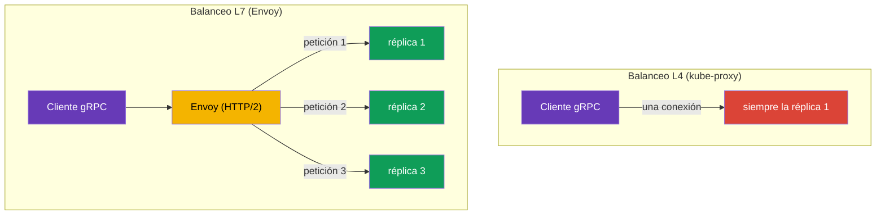

[RU version](ru.md) · [Eng version](en.md) · [Version française](fr.md) · [Deutsche Version](de.md)

# Capítulo 10. Enrutamiento de tráfico TCP, gRPC y WebSocket

> **Qué sigue.** Hasta ahora hemos trabajado con tráfico HTTP. Pero no toda la comunicación
> entre servicios es HTTP: hay bases de datos, brokers de mensajes, protocolos binarios
> propios sobre TCP, y también gRPC y WebSocket. En este capítulo veremos cómo Istio maneja el
> tráfico TCP (incluido un caso práctico: exponer Redis/RabbitMQ a la red interna de la VPC),
> por qué gRPC es un caso aparte y cómo tratar las conexiones WebSocket de larga duración. Un
> estándar de ingress independiente, la Kubernetes Gateway API, es el tema del siguiente
> capítulo 11.

## 10.1. Por qué se necesita el enrutamiento TCP

El enrutamiento HTTP puede mirar dentro de una petición: cabeceras, rutas, métodos. Pero si el
tráfico es, digamos, PostgreSQL o un protocolo TCP arbitrario, ahí no hay cabeceras HTTP.
Istio todavía puede gestionarlo, pero a nivel de conexión (L4): reenviar un puerto, dividir el
tráfico entre versiones, enrutar por SNI para TLS.

## 10.2. Reenvío de un puerto TCP en el gateway

Primero, en el Gateway declaramos un puerto TCP (protocolo `TCP` en lugar de `HTTP`):

```yaml
apiVersion: networking.istio.io/v1
kind: Gateway
metadata:
  name: tcp-gateway
spec:
  selector:
    istio: ingressgateway
  servers:
  - port:
      number: 3000
      name: tcp
      protocol: TCP      # no HTTP, sino TCP
    hosts:
    - "*"
```

Luego un VirtualService enruta este tráfico TCP hacia un servicio. Fíjate: el bloque se llama
`tcp`, no `http`, y la coincidencia es por puerto, no por cabeceras.

```yaml
apiVersion: networking.istio.io/v1
kind: VirtualService
metadata:
  name: tcp-echo-vs
spec:
  hosts:
  - "*"
  gateways:
  - tcp-gateway
  tcp:                    # tcp específicamente
  - match:
    - port: 3000
    route:
    - destination:
        host: tcp-echo
        port:
          number: 9000
```


## 10.3. Enrutamiento TCP ponderado

Igual que con HTTP, el tráfico TCP puede dividirse entre versiones por pesos. Esto es útil para
canary incluso en servicios que no son HTTP:

```yaml
  tcp:
  - match:
    - port: 3000
    route:
    - destination:
        host: tcp-echo
        subset: v1
      weight: 80        # 80% de las conexiones a v1
    - destination:
        host: tcp-echo
        subset: v2
      weight: 20        # 20% a v2
```

Una diferencia importante frente a HTTP: los pesos de HTTP distribuyen **peticiones**, mientras
que los pesos de TCP distribuyen **conexiones**. Dentro de una misma conexión TCP todo el
tráfico va a la misma réplica, porque Envoy no divide el flujo en peticiones individuales.
Tampoco puedes hacer match por cabeceras, rutas ni métodos en TCP: solo por puerto (y por SNI
para TLS, como en PASSTHROUGH del capítulo 9).

## 10.4. Ejemplo: Redis/RabbitMQ hacia la red interna de la VPC

Una tarea habitual: Redis (o RabbitMQ) se ejecuta en EKS y debe ser accesible desde otros
servicios de la VPC, pero **no desde internet**. Este es un caso puramente TCP: Redis y AMQP no
son HTTP, así que los gestionamos en L4, y abrimos la "puerta" a la red privada mediante un
ingress gateway **interno** con un NLB privado.

El esquema tiene dos partes:

1. **Un ingress gateway interno**: un gateway aparte cuyo Service obtiene un NLB con
   `scheme: internal` (su dirección resuelve solo a IPs privadas de la VPC y es inalcanzable
   desde internet). Cómo desplegar un segundo gateway y adjuntarle un NLB interno se cubrió en
   el [capítulo 5](../05/es.md).
2. **Un Gateway + VirtualService para el puerto TCP del servicio**, apuntado al gateway interno.


El Gateway escucha en el puerto TCP de Redis y se vincula al gateway interno mediante
`selector`:

```yaml
apiVersion: networking.istio.io/v1
kind: Gateway
metadata:
  name: redis-gateway
spec:
  selector:
    istio: ingressgateway-internal   # el gateway interno (NLB privado)
  servers:
  - port:
      number: 6379
      name: tcp-redis
      protocol: TCP
    hosts:
    - "*"
```

El VirtualService enruta el puerto TCP hacia el servicio Redis (un bloque `tcp`, con match por
puerto):

```yaml
apiVersion: networking.istio.io/v1
kind: VirtualService
metadata:
  name: redis-vs
spec:
  hosts:
  - "*"
  gateways:
  - redis-gateway
  tcp:
  - match:
    - port: 6379
    route:
    - destination:
        host: redis.data.svc.cluster.local   # el Service de Kubernetes para Redis
        port:
          number: 6379
```

Para RabbitMQ es todo igual, solo cambian los puertos: `5672` (AMQP) y, si hace falta, `15672`
(la UI de gestión, aunque normalmente no se expone ni a la red interna). Los clientes en la VPC
se conectan por el nombre DNS del NLB interno (`*.elb.amazonaws.com`, que resuelve a IPs
privadas).

Matices importantes:

- Esto es **L4**: enrutamiento solo por puerto, sin rutas/cabeceras; los pesos distribuyen
  conexiones (sección 10.3).
- **Seguridad.** Un NLB `internal` cierra el acceso desde internet, pero dentro de la VPC el
  puerto está abierto. Restringe quién puede conectarse: un security group en el NLB, una
  `AuthorizationPolicy` del lado de la malla y mTLS entre servicios (capítulos 12-13). Tales
  servicios no se exponen al exterior.
- Si el cliente está fuera de la malla (una simple VM en la VPC), el tráfico del NLB al pod de
  Redis dentro del clúster no se cifra automáticamente; si hace falta, usa el propio TLS de
  Redis/RabbitMQ o PASSTHROUGH por SNI (capítulo 9).

## 10.5. WebSocket

WebSocket empieza como una petición HTTP/1.1 corriente con una cabecera `Upgrade: websocket`,
tras la cual la conexión se "actualiza" a un canal bidireccional persistente. Para Istio esto
es HTTP L7 y **no necesitas habilitar WebSocket de forma especial**: Envoy soporta el upgrade
de fábrica. La ruta se describe con un bloque `http` corriente en un VirtualService (el Gateway
y el Service son como para cualquier aplicación HTTP del capítulo 5).

El principal escollo son los **timeouts**, igual que con el streaming de gRPC. Una conexión
WebSocket vive mucho tiempo (minutos y horas), mientras que un `timeout` corriente en el
VirtualService la cortará una vez cumplido el plazo. Por eso, en las rutas WebSocket el timeout
o no se fija o se fija a un valor grande; en el ejemplo de abajo se elimina justo en la ruta
(`timeout: 0s`):

```yaml
apiVersion: networking.istio.io/v1
kind: VirtualService
metadata:
  name: chat-vs
  namespace: apps
spec:
  hosts:
  - chat.example.com          # el mismo host que en el Gateway
  gateways:
  - main-gateway              # el nombre del Gateway con un puerto HTTP/HTTPS (capítulo 5)
  http:
  - match:
    - uri:
        prefix: /ws           # el endpoint de WebSocket
    timeout: 0s               # 0 = sin límite (para conexiones de larga duración)
    route:
    - destination:
        host: chat-backend    # el Service de Kubernetes del backend
        port:
          number: 8080
```

Un par de puntos más:

- **Idle timeout.** Los periodos largos de inactividad en una conexión pueden ser cortados no
  solo por Istio, sino también por el NLB (el NLB de AWS tiene un idle timeout, 350s por
  defecto); para WebSocket configura ping/pong (un heartbeat) en el servidor para que la
  conexión no se considere inactiva.
- **Afinidad de sesión.** Si el backend guarda estado de sesión, fija el cliente a una única
  réplica mediante consistent hash en un DestinationRule (`consistentHash` por cookie o
  cabecera, capítulo 7); de lo contrario, una reconexión puede caer en otra réplica.

## 10.6. Particularidades de gRPC

A menudo se confunde gRPC con "simplemente TCP", pero es un error importante. gRPC corre **sobre
HTTP/2**, lo que significa que para Istio es tráfico HTTP (L7), no TCP en crudo. De ahí se
siguen dos conclusiones.

Primero, todas las funciones L7 están disponibles para gRPC: enrutamiento por cabeceras,
reintentos, timeouts, balanceo de carga por petición, métricas detalladas. Es decir, configuras
gRPC a través del bloque `http` en un VirtualService, como HTTP corriente, no a través de `tcp`.

Segundo, y esta es la razón principal para poner una malla delante de gRPC, el problema del
balanceo de carga. gRPC mantiene **una única conexión HTTP/2 de larga duración** y multiplexa
muchas peticiones sobre ella. El balanceo de carga L4 corriente (kube-proxy) distribuye el
tráfico por conexiones, así que todas las peticiones de un cliente "se pegan" a una réplica, y
el balanceo efectivamente no funciona.



Envoy entiende HTTP/2 y balancea **por petición individual** dentro de una misma conexión: cada
llamada gRPC puede ir a su propia réplica. Esta es una de las razones más comunes para llevar
servicios gRPC a una malla.

Para que Istio reconozca el protocolo correctamente, el puerto del servicio debe estar
**nombrado explícitamente**: el nombre del puerto debe empezar por `grpc` (por ejemplo,
`grpc-web`) o usar el campo `appProtocol: grpc`. Si el puerto se nombra de forma neutra
(`tcp-...`), Istio tratará el tráfico como TCP corriente y se perderán todas las funciones L7.

```yaml
apiVersion: v1
kind: Service
metadata:
  name: my-grpc-service
spec:
  ports:
  - name: grpc-api        # el nombre empieza por grpc -> Istio ve HTTP/2
    port: 9000
    appProtocol: grpc     # o explícitamente vía appProtocol
```

Recuerda la regla: **gRPC es HTTP/2, no TCP**. Configúralo como HTTP y no olvides nombrar el
puerto correctamente.

## 10.7. gRPC en el ingress

Para aceptar gRPC desde fuera mediante el ingress gateway necesitas tres recursos, igual que
para HTTP corriente del capítulo 5, solo que con las salvedades de HTTP/2:

1. **Un Service** para la aplicación gRPC, con un puerto correctamente nombrado para que Istio
   entienda que es HTTP/2 (sección 10.6).
2. **Un Gateway**, que abre un puerto en el ingress gateway con protocolo `GRPC` (o `HTTP2`).
3. **Un VirtualService**, que enruta el tráfico desde el gateway hacia el Service; la ruta se
   describe en el bloque `http` (¡no `tcp`!), porque para Istio gRPC es L7.

**1. El Service de la aplicación gRPC.** El nombre del puerto debe empezar por `grpc` o fijarse
vía `appProtocol: grpc`, de lo contrario Istio tratará el tráfico como TCP corriente:

```yaml
apiVersion: v1
kind: Service
metadata:
  name: grpc-server
  namespace: apps
spec:
  selector:
    app: grpc-server
  ports:
  - name: grpc-api          # el nombre empieza por grpc -> Istio ve HTTP/2
    port: 9000
    targetPort: 9000
    appProtocol: grpc       # o explícitamente vía appProtocol
```

**2. El Gateway.** El puerto se declara con protocolo `GRPC` (o `HTTP2`). Un `HTTP` corriente
no sirve aquí: el gateway necesita saber que esto es HTTP/2, de lo contrario la multiplexación y
el balanceo por petición no funcionarán. gRPC suele exponerse sobre TLS, así que añadimos `tls`
(el certificado en el Secret `grpc-cert`, como en el capítulo 9):

```yaml
apiVersion: networking.istio.io/v1
kind: Gateway
metadata:
  name: grpc-gateway
  namespace: apps
spec:
  selector:
    istio: ingressgateway     # a qué ingress gateway aplicar (capítulo 5)
  servers:
  - port:
      number: 443
      name: grpc-tls
      protocol: GRPC          # o HTTP2; no solo HTTP
    tls:
      mode: SIMPLE
      credentialName: grpc-cert
    hosts:
    - grpc.example.com
```

**3. El VirtualService.** Se vincula al Gateway vía `gateways` y enruta el tráfico hacia el
Service. La ruta está en el bloque `http`; puedes hacer match por método gRPC vía `uri.prefix`,
porque el nombre del método es una ruta HTTP/2 de la forma `/<package>.<Service>/<Method>`:

```yaml
apiVersion: networking.istio.io/v1
kind: VirtualService
metadata:
  name: grpc-server-vs
  namespace: apps
spec:
  hosts:
  - grpc.example.com          # el mismo host que en el Gateway
  gateways:
  - grpc-gateway              # el nombre del Gateway del paso 2 (se permite namespace/name)
  http:
  - match:
    - uri:
        prefix: /helloworld.Greeter/   # opcional: enrutar por un servicio gRPC concreto
    route:
    - destination:
        host: grpc-server     # el nombre del Service del paso 1
        port:
          number: 9000
```

Si no necesitas dividir por método, el bloque `match` puede omitirse: entonces todo el tráfico
gRPC del host va a `grpc-server`. El cliente se conecta a `grpc.example.com:443` sobre TLS, y
después el balanceo por petición (sección 10.6) distribuye las llamadas entre las réplicas.

## 10.8. gRPC: reintentos, timeouts y el pool de conexiones

Como gRPC es HTTP, la resiliencia del capítulo 8 se le aplica, pero con matices.

**Reintentos por estado gRPC.** gRPC tiene sus propios códigos de estado (no HTTP), y `retryOn`
puede entenderlos: lista las condiciones gRPC específicamente. Se configuran en el mismo
VirtualService que la ruta (este es el mismo `grpc-server-vs` de 10.7, solo con un bloque
`retries`):

```yaml
apiVersion: networking.istio.io/v1
kind: VirtualService
metadata:
  name: grpc-server-vs
  namespace: apps
spec:
  hosts:
  - grpc.example.com
  gateways:
  - grpc-gateway
  http:
  - retries:
      attempts: 3
      perTryTimeout: 2s
      retryOn: unavailable,resource-exhausted,cancelled   # estados gRPC
    route:
    - destination:
        host: grpc-server     # el mismo Service que en 10.7
        port:
          number: 9000
```

Valores útiles de `retryOn` para gRPC: `cancelled`, `deadline-exceeded`, `internal`,
`resource-exhausted`, `unavailable`. Igual que con HTTP (capítulo 8), solo deben reintentarse
las llamadas idempotentes.

**Timeouts y streaming: ten cuidado.** El campo `timeout` en un VirtualService limita todo el
"tiempo de la petición". Para llamadas unary (una petición, una respuesta) esto está bien. Pero
para RPCs de **server-streaming / bidi-streaming**, donde la conexión vive mucho tiempo y los
datos fluyen como un stream, un `timeout` corriente cortará el stream una vez cumplido el plazo.
Para servicios de streaming el timeout o no se fija o se fija deliberadamente grande.

**El pool de conexiones y el rebalanceo.** gRPC mantiene una única conexión HTTP/2 de larga
duración. Incluso con Envoy esto crea un problema: si has **escalado** el servicio (añadido
réplicas), las conexiones antiguas siguen colgadas en los endpoints anteriores. Los ajustes de
`connectionPool` en un DestinationRule ayudan:

```yaml
apiVersion: networking.istio.io/v1
kind: DestinationRule
metadata:
  name: grpc-server-dr
  namespace: apps
spec:
  host: grpc-server           # el mismo Service que en 10.7
  trafficPolicy:
    connectionPool:
      http:
        http2MaxRequests: 1000          # máx. de peticiones concurrentes (lo que importa en HTTP/2)
        maxRequestsPerConnection: 100   # recrea la conexión tras N peticiones -> capta nuevas réplicas
```

Para HTTP/2 y gRPC el límite clave es `http2MaxRequests` (el máximo de peticiones concurrentes),
no `http1MaxPendingRequests` de HTTP/1.1. Y `maxRequestsPerConnection` hace que Envoy reabra
periódicamente la conexión para que el tráfico se distribuya también a las réplicas recién
añadidas.

## 10.9. Comparación: HTTP, TCP, gRPC

| | HTTP (L7) | TCP (L4) | gRPC (HTTP/2, L7) |
|---|---|---|---|
| Bloque en VirtualService | `http` | `tcp` | `http` |
| Match por cabeceras/rutas | sí | no | sí (método = ruta) |
| Match por SNI | - | sí (TLS) | - |
| Los pesos distribuyen | peticiones | conexiones | peticiones |
| Reintentos/timeouts | sí | no | sí (estados gRPC) |
| Balanceo | por petición | por conexión | por petición |
| Nombre del puerto | `http` | `tcp` | `grpc` / `appProtocol: grpc` |

WebSocket en esta tabla es la columna HTTP (L7): se enruta como HTTP vía el bloque `http`, Istio
soporta el upgrade de fábrica, pero la conexión es de larga duración (ver 10.5).

## 10.10. Buenas prácticas

- **Nombra los puertos correctamente.** `grpc...` o `appProtocol: grpc` para gRPC, `http...`
  para HTTP, `tcp...` para TCP en crudo. Un error en el nombre del puerto = pérdida de funciones
  L7 (para gRPC esto duele especialmente: el balanceo se rompe).
- **En el ingress para gRPC, protocolo `GRPC`/`HTTP2`**, no `HTTP`.
- **Reintentos gRPC: por estado gRPC** (`unavailable`, `resource-exhausted`, etc.) y solo para
  llamadas idempotentes.
- **No pongas un `timeout` corriente en RPCs de streaming**: cortará el stream de larga
  duración.
- **Para gRPC configura `http2MaxRequests` y `maxRequestsPerConnection`** para que las
  conexiones se rebalanceen hacia nuevas réplicas tras el escalado.
- **TCP: solo para lo que genuinamente no es HTTP** (bases de datos, brokers, protocolos
  binarios propios). Todo lo que habla HTTP/2, ejecútalo como HTTP/gRPC para tener las funciones
  L7.
- **No expongas bases de datos ni brokers a internet.** Redis/RabbitMQ se exponen solo a la red
  interna, vía un ingress gateway interno con un NLB `scheme: internal`, más un security group,
  `AuthorizationPolicy` y mTLS.
- **Para WebSocket y streaming, elimina el `timeout`** (`0s` o un valor grande) y configura un
  heartbeat para que la conexión no la corte un idle timeout (incluido el del NLB).

## 10.11. Resumen del capítulo

- Istio gestiona no solo HTTP, sino también tráfico TCP, a nivel de conexión (L4).
- Para TCP declaras un puerto con `protocol: TCP` en el Gateway, y en el VirtualService usas un
  bloque `tcp` con match por puerto.
- Los pesos TCP distribuyen conexiones (no peticiones); no puedes hacer match por cabeceras ni
  rutas, solo por puerto y SNI.
- **gRPC es HTTP/2, no TCP**: se configura como HTTP, obtiene todas las funciones L7 y, lo más
  importante, el balanceo por petición (L4 enviaría todo a una réplica). El puerto debe nombrarse
  `grpc...` o fijarse con `appProtocol: grpc`.
- En el **ingress para gRPC** el puerto del Gateway se declara con protocolo `GRPC`/`HTTP2`; la
  ruta está en el bloque `http`, y puedes hacer match por método gRPC vía `uri.prefix`.
- Resiliencia para gRPC: reintentos por **estado gRPC** (`unavailable`, `resource-exhausted`…),
  cuidado con el `timeout` en **streaming**, y `http2MaxRequests` y `maxRequestsPerConnection`
  en `connectionPool` ayudan a rebalancear las conexiones de larga duración.
- **Redis/RabbitMQ hacia la red interna de la VPC** se exponen como TCP mediante un ingress
  gateway interno con un NLB privado (`scheme: internal`); no se exponen al exterior, y el
  acceso se restringe con SG/AuthorizationPolicy/mTLS.
- **WebSocket** es HTTP L7 (el upgrade se soporta de fábrica); lo principal es eliminar el
  `timeout` para la conexión de larga duración y configurar un heartbeat contra los idle
  timeouts.

## 10.12. Preguntas de autoevaluación

1. ¿En qué se diferencia el enrutamiento TCP del HTTP? ¿Qué no puedes hacer match en TCP?
2. ¿Los pesos en el enrutamiento TCP distribuyen peticiones o conexiones? ¿Por qué?
3. ¿Por qué gRPC se configura como HTTP en Istio, y no como TCP?
4. ¿Cómo nombras el puerto correctamente para que Istio reconozca gRPC?
5. ¿Por qué el balanceo de gRPC sufre sin una malla?
6. ¿Qué protocolo especificas en el Gateway para aceptar gRPC desde fuera, y por qué no `HTTP`?
7. ¿En qué se diferencian los reintentos de gRPC de los de HTTP? ¿Por qué es peligroso fijar un
   `timeout` en un RPC de streaming?
8. ¿Por qué configuras `maxRequestsPerConnection` para gRPC?
9. ¿Cómo expones Redis o RabbitMQ desde EKS solo a la red interna de la VPC, pero no a internet?
10. ¿Necesitas habilitar WebSocket de forma especial en Istio? ¿Cuál es el principal escollo con
    las conexiones WebSocket y cómo lo sorteas?

## Práctica

Practica el enrutamiento de tráfico TCP en crudo (distribución ponderada entre conexiones):

🧪 Laboratorio 28: [tasks/ica/labs/28](../../labs/28/README_ES.MD)

Practica gRPC de forma práctica, justo lo que no puede verificarse con palabras en el texto:

- balanceo por petición de gRPC: un cliente, varias réplicas, peticiones realmente repartidas
  entre distintos pods (a diferencia de L4, donde todo se pega a una réplica);
- nombrado correcto del puerto (`grpc` / `appProtocol: grpc`) y qué se rompe sin él;
- reintentos y timeouts para gRPC como para HTTP.

🧪 Laboratorio 32: [tasks/ica/labs/32](../../labs/32/README_ES.MD)

---
[Índice](../README_ES.md) · [Capítulo 9](../09/es.md) · [Capítulo 11](../11/es.md)
