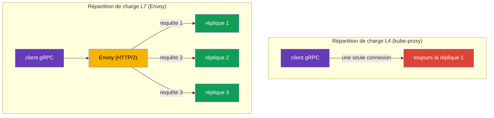

[RU version](ru.md) · [Eng version](en.md) · [Versión en español](es.md) · [Deutsche Version](de.md)

# Chapitre 10. Routage TCP, gRPC et WebSocket

> **Ce qui suit.** Jusqu'à présent, nous avons travaillé avec du trafic HTTP. Mais toute la
> communication entre services n'est pas du HTTP : il y a les bases de données, les brokers de
> messages, des protocoles binaires propres au-dessus de TCP, et aussi gRPC et WebSocket. Dans
> ce chapitre, nous verrons comment Istio travaille avec le trafic TCP (y compris un cas
> pratique - exposer Redis/RabbitMQ dans le réseau interne du VPC), pourquoi gRPC est un cas à
> part et comment gérer les connexions WebSocket de longue durée. Un standard d'ingress à part -
> Kubernetes Gateway API - fait l'objet du chapitre suivant, le chapitre 11.

## 10.1. Pourquoi le routage TCP est nécessaire

Le routage HTTP sait regarder à l'intérieur de la requête : en-têtes, chemins, méthodes. Mais
si le trafic est, par exemple, du PostgreSQL ou un protocole TCP quelconque, il n'y a là aucun
en-tête HTTP. Istio peut tout de même le gérer, mais au niveau des connexions (L4) : relayer un
port, répartir le trafic entre versions, diriger par SNI pour TLS.

## 10.2. Relais d'un port TCP sur le gateway

D'abord, sur le Gateway, on déclare un port TCP (protocole `TCP` au lieu de `HTTP`) :

```yaml
apiVersion: networking.istio.io/v1
kind: Gateway
metadata:
  name: tcp-gateway
spec:
  selector:
    istio: ingressgateway
  servers:
  - port:
      number: 3000
      name: tcp
      protocol: TCP      # pas HTTP, mais TCP
    hosts:
    - "*"
```

Ensuite, le VirtualService dirige ce trafic TCP vers le service. Notez bien : le bloc s'appelle
`tcp`, et non `http`, et le match se fait par port, et non par en-têtes.

```yaml
apiVersion: networking.istio.io/v1
kind: VirtualService
metadata:
  name: tcp-echo-vs
spec:
  hosts:
  - "*"
  gateways:
  - tcp-gateway
  tcp:                    # précisément tcp
  - match:
    - port: 3000
    route:
    - destination:
        host: tcp-echo
        port:
          number: 9000
```


## 10.3. Routage TCP pondéré

Comme pour HTTP, le trafic TCP peut être réparti entre versions selon des poids. C'est utile
pour le canary, même pour des services non-HTTP :

```yaml
  tcp:
  - match:
    - port: 3000
    route:
    - destination:
        host: tcp-echo
        subset: v1
      weight: 80        # 80% des connexions vers v1
    - destination:
        host: tcp-echo
        subset: v2
      weight: 20        # 20% vers v2
```

Il est important de comprendre la différence avec HTTP : les poids HTTP répartissent les
**requêtes**, tandis que les poids TCP répartissent les **connexions**. Au sein d'une même
connexion TCP, tout le trafic va vers la même réplique, car Envoy ne décompose pas le contenu du
flux en requêtes individuelles. Matcher par en-têtes, chemins et méthodes n'est pas non plus
possible pour TCP - uniquement par port (et par SNI pour TLS, comme en PASSTHROUGH du chapitre
9).

## 10.4. Exemple : Redis/RabbitMQ dans le réseau interne du VPC

Tâche fréquente : dans EKS tourne Redis (ou RabbitMQ), et il faut y accéder depuis d'autres
services du VPC - mais **pas depuis internet**. C'est un cas TCP pur : Redis et AMQP ne sont pas
du HTTP, on les gère donc au niveau L4, et l'on ouvre la « porte » vers le réseau privé via un
ingress gateway **interne** avec un NLB privé.

Un schéma en deux parties :

1. **Ingress gateway interne** - un gateway distinct dont le Service reçoit un NLB avec `scheme:
   internal` (l'adresse ne se résout qu'en IP privées du VPC, inaccessibles depuis internet).
   Comment déployer un second gateway et lui attacher un NLB interne - nous l'avons vu au
   [chapitre 5](../05/ru.md).
2. **Gateway + VirtualService sur le port TCP** de ce service, dirigés vers le gateway interne.


Le Gateway écoute le port TCP de Redis et est rattaché au gateway interne via `selector` :

```yaml
apiVersion: networking.istio.io/v1
kind: Gateway
metadata:
  name: redis-gateway
spec:
  selector:
    istio: ingressgateway-internal   # gateway interne (NLB privé)
  servers:
  - port:
      number: 6379
      name: tcp-redis
      protocol: TCP
    hosts:
    - "*"
```

Le VirtualService dirige le port TCP vers le service Redis (bloc `tcp`, match par port) :

```yaml
apiVersion: networking.istio.io/v1
kind: VirtualService
metadata:
  name: redis-vs
spec:
  hosts:
  - "*"
  gateways:
  - redis-gateway
  tcp:
  - match:
    - port: 6379
    route:
    - destination:
        host: redis.data.svc.cluster.local   # Kubernetes Service Redis
        port:
          number: 6379
```

Pour RabbitMQ, tout est identique - seuls les ports changent : `5672` (AMQP) et, si nécessaire,
`15672` (management UI, mais on ne l'expose généralement pas, même dans le réseau interne). Les
clients dans le VPC se connectent par le nom DNS du NLB interne (`*.elb.amazonaws.com`, qui se
résout en IP privées).

Points importants :

- C'est du **L4** : routage uniquement par port, aucun chemin/en-tête ; les poids répartissent
  les connexions (section 10.3).
- **Sécurité.** Le NLB `internal` ferme l'accès depuis internet, mais à l'intérieur du VPC le
  port est ouvert. Restreignez qui peut se connecter : security group sur le NLB,
  `AuthorizationPolicy` du côté du maillage et mTLS entre services (chapitres 12–13). On
  n'expose pas de tels services vers l'extérieur.
- Si le client est hors maillage (une VM ordinaire dans le VPC), le trafic du NLB jusqu'au pod
  Redis à l'intérieur du cluster n'est pas chiffré automatiquement - au besoin, utilisez le TLS
  propre à Redis/RabbitMQ ou le PASSTHROUGH par SNI (chapitre 9).

## 10.5. WebSocket

WebSocket commence comme une requête HTTP/1.1 ordinaire avec l'en-tête `Upgrade: websocket`,
après quoi la connexion est « promue » en un canal bidirectionnel permanent. Pour Istio, c'est
du HTTP L7, et il **n'est pas nécessaire d'activer spécialement WebSocket** - Envoy prend en
charge l'upgrade nativement. On décrit la route par un bloc `http` ordinaire dans le
VirtualService (Gateway et Service - comme pour n'importe quelle application HTTP du chapitre 5).

Le principal écueil est celui des **timeouts**, comme pour le streaming gRPC. Une connexion
WebSocket vit longtemps (des minutes et des heures), alors qu'un `timeout` ordinaire dans le
VirtualService la coupera une fois le délai écoulé. C'est pourquoi, pour les routes WebSocket, on
ne définit pas de timeout, ou on le met à une valeur élevée - dans l'exemple ci-dessous il est
retiré directement dans la route (`timeout: 0s`) :

```yaml
apiVersion: networking.istio.io/v1
kind: VirtualService
metadata:
  name: chat-vs
  namespace: apps
spec:
  hosts:
  - chat.example.com          # le même hôte que dans le Gateway
  gateways:
  - main-gateway              # nom du Gateway avec un port HTTP/HTTPS (chapitre 5)
  http:
  - match:
    - uri:
        prefix: /ws           # endpoint WebSocket
    timeout: 0s               # 0 = sans limite (pour les connexions de longue durée)
    route:
    - destination:
        host: chat-backend    # Kubernetes Service du backend
        port:
          number: 8080
```

Encore quelques points :

- **Idle timeout.** Les longues périodes d'inactivité dans la connexion peuvent être coupées non
  seulement par Istio, mais aussi par le NLB (le NLB AWS a un idle timeout, par défaut 350 s) -
  pour WebSocket, configurez côté serveur un ping/pong (heartbeat), afin que la connexion ne soit
  pas considérée comme inactive.
- **Session affinity.** Si le backend conserve un état de session, rattachez le client à une
  seule réplique via un consistent hash dans un DestinationRule (`consistentHash` par cookie ou
  en-tête, chapitre 7) - sinon une reconnexion peut aboutir sur une autre réplique.

## 10.6. Particularités de gRPC

On confond souvent gRPC avec « du simple TCP », mais c'est une erreur importante. gRPC
fonctionne **au-dessus de HTTP/2**, ce qui signifie que pour Istio c'est du trafic HTTP (L7), et
non du TCP brut. Il en découle deux conséquences.

Premièrement, toutes les possibilités L7 sont disponibles pour gRPC : routage par en-têtes,
retries, timeouts, répartition de charge par requête, métriques détaillées. Autrement dit, gRPC
se configure via le bloc `http` dans le VirtualService, comme du HTTP ordinaire, et non via
`tcp`.

Deuxièmement - et c'est la raison principale de mettre un maillage pour gRPC - le problème de la
répartition de charge. gRPC maintient **une seule connexion HTTP/2 de longue durée** et y
multiplexe de nombreuses requêtes. La répartition de charge L4 ordinaire (kube-proxy) répartit
le trafic par connexions, si bien que toutes les requêtes du client « collent » à une seule
réplique, et la répartition de charge ne fonctionne en réalité pas.



Envoy comprend HTTP/2 et répartit **par requêtes individuelles** au sein d'une même connexion :
chaque appel gRPC peut aboutir sur sa propre réplique. C'est l'une des raisons les plus
fréquentes pour lesquelles on fait entrer les services gRPC dans un maillage.

Pour qu'Istio reconnaisse correctement le protocole, il faut **nommer explicitement** le port
du service : le nom du port doit commencer par `grpc` (par exemple, `grpc-web`) ou utilisez le
champ `appProtocol: grpc`. Si le port est nommé de façon neutre (`tcp-...`), Istio considérera
le trafic comme du TCP ordinaire et toutes les possibilités L7 disparaîtront.

```yaml
apiVersion: v1
kind: Service
metadata:
  name: my-grpc-service
spec:
  ports:
  - name: grpc-api        # le nom commence par grpc -> Istio voit HTTP/2
    port: 9000
    appProtocol: grpc     # ou explicitement via appProtocol
```

Retenez la règle : **gRPC, c'est du HTTP/2, pas du TCP**. Configurez-le comme du HTTP et
n'oubliez pas de nommer correctement le port.

## 10.7. gRPC sur l'ingress

Pour recevoir du gRPC de l'extérieur via l'ingress gateway, il faut trois ressources, comme pour
le HTTP ordinaire du chapitre 5, mais avec des réserves concernant HTTP/2 :

1. **Service** de l'application gRPC - avec un port correctement nommé, pour qu'Istio comprenne
   qu'il s'agit de HTTP/2 (section 10.6).
2. **Gateway** - ouvre un port sur l'ingress gateway avec le protocole `GRPC` (ou `HTTP2`).
3. **VirtualService** - dirige le trafic du gateway vers le Service ; la route est décrite dans
   le bloc `http` (pas `tcp` !), car pour Istio gRPC est du L7.

**1. Service de l'application gRPC.** Le nom du port doit commencer par `grpc` ou être défini via
`appProtocol: grpc`, sinon Istio considérera le trafic comme du TCP ordinaire :

```yaml
apiVersion: v1
kind: Service
metadata:
  name: grpc-server
  namespace: apps
spec:
  selector:
    app: grpc-server
  ports:
  - name: grpc-api          # le nom commence par grpc -> Istio voit HTTP/2
    port: 9000
    targetPort: 9000
    appProtocol: grpc       # ou explicitement via appProtocol
```

**2. Gateway.** Le port est déclaré avec le protocole `GRPC` (ou `HTTP2`). Le `HTTP` ordinaire ne
convient pas ici : le gateway doit savoir qu'il s'agit de HTTP/2, sinon le multiplexage et la
répartition de charge par requête ne fonctionneront pas. Généralement, on expose gRPC en TLS,
c'est pourquoi on ajoute `tls` (certificat dans le Secret `grpc-cert`, comme au chapitre 9) :

```yaml
apiVersion: networking.istio.io/v1
kind: Gateway
metadata:
  name: grpc-gateway
  namespace: apps
spec:
  selector:
    istio: ingressgateway     # à quel ingress gateway l'appliquer (chapitre 5)
  servers:
  - port:
      number: 443
      name: grpc-tls
      protocol: GRPC          # ou HTTP2 ; pas simplement HTTP
    tls:
      mode: SIMPLE
      credentialName: grpc-cert
    hosts:
    - grpc.example.com
```

**3. VirtualService.** Se rattache au Gateway via `gateways` et dirige le trafic vers le Service.
La route - dans le bloc `http` ; on peut matcher par méthode gRPC via `uri.prefix`, car le nom
de la méthode est un path HTTP/2 de la forme `/<package>.<Service>/<Method>` :

```yaml
apiVersion: networking.istio.io/v1
kind: VirtualService
metadata:
  name: grpc-server-vs
  namespace: apps
spec:
  hosts:
  - grpc.example.com          # le même hôte que dans le Gateway
  gateways:
  - grpc-gateway              # nom du Gateway de l'étape 2 (namespace/nom possible)
  http:
  - match:
    - uri:
        prefix: /helloworld.Greeter/   # optionnel : route par service gRPC concret
    route:
    - destination:
        host: grpc-server     # nom du Service de l'étape 1
        port:
          number: 9000
```

S'il n'est pas nécessaire de séparer par méthodes, le bloc `match` peut être omis - alors tout le
trafic gRPC de l'hôte ira vers `grpc-server`. Le client se connecte à `grpc.example.com:443` en
TLS, puis la répartition de charge par requête (section 10.6) répartit les appels sur les
répliques.

## 10.8. gRPC : retries, timeouts et pool de connexions

Puisque gRPC est du HTTP, la résilience du chapitre 8 lui est applicable, mais avec des nuances.

**Retries par statuts gRPC.** gRPC a ses propres codes de statut (pas HTTP), et `retryOn` sait
les comprendre - énumérez précisément les conditions gRPC. Elles se configurent dans le même
VirtualService que la route (c'est le même `grpc-server-vs` de 10.7, seulement avec un bloc
`retries`) :

```yaml
apiVersion: networking.istio.io/v1
kind: VirtualService
metadata:
  name: grpc-server-vs
  namespace: apps
spec:
  hosts:
  - grpc.example.com
  gateways:
  - grpc-gateway
  http:
  - retries:
      attempts: 3
      perTryTimeout: 2s
      retryOn: unavailable,resource-exhausted,cancelled   # statuts gRPC
    route:
    - destination:
        host: grpc-server     # le même Service qu'en 10.7
        port:
          number: 9000
```

Valeurs utiles de `retryOn` pour gRPC : `cancelled`, `deadline-exceeded`, `internal`,
`resource-exhausted`, `unavailable`. Comme avec HTTP (chapitre 8), il ne faut réessayer que les
appels idempotents.

**Timeouts et streaming - prudence.** Le champ `timeout` dans le VirtualService limite tout le
« temps de la requête ». Pour les appels unary (une requête - une réponse), c'est normal. Mais
pour les RPC **server-streaming / bidi-streaming**, où la connexion vit longtemps et les données
circulent en flux, un `timeout` ordinaire coupera le stream une fois le délai écoulé. Pour les
services de streaming, on ne définit pas de timeout, ou on le met à une valeur délibérément
élevée.

**Pool de connexions et rééquilibrage.** gRPC maintient une seule connexion HTTP/2 de longue
durée. Même avec Envoy, cela crée un problème : si vous avez **mis à l'échelle** le service
(ajouté des répliques), les anciennes connexions restent accrochées aux endpoints précédents.
Les réglages `connectionPool` dans le DestinationRule aident :

```yaml
apiVersion: networking.istio.io/v1
kind: DestinationRule
metadata:
  name: grpc-server-dr
  namespace: apps
spec:
  host: grpc-server           # le même Service qu'en 10.7
  trafficPolicy:
    connectionPool:
      http:
        http2MaxRequests: 1000          # max de requêtes simultanées (c'est ce qui compte pour HTTP/2)
        maxRequestsPerConnection: 100   # après N requêtes, recréer la connexion -> capte les nouvelles répliques
```

Pour HTTP/2 et gRPC, la limite clé est `http2MaxRequests` (maximum de requêtes simultanées), et
non `http1MaxPendingRequests` de HTTP/1.1. Et `maxRequestsPerConnection` force Envoy à rouvrir
périodiquement la connexion, pour que le trafic soit aussi réparti vers les répliques
fraîchement ajoutées.

## 10.9. Comparaison : HTTP, TCP, gRPC

| | HTTP (L7) | TCP (L4) | gRPC (HTTP/2, L7) |
|---|---|---|---|
| Bloc dans le VirtualService | `http` | `tcp` | `http` |
| Match par en-têtes/chemins | oui | non | oui (méthode = path) |
| Match par SNI | - | oui (TLS) | - |
| Les poids répartissent | requêtes | connexions | requêtes |
| Retries/timeouts | oui | non | oui (statuts gRPC) |
| Répartition de charge | par requête | par connexion | par requête |
| Nom du port | `http` | `tcp` | `grpc` / `appProtocol: grpc` |

WebSocket, dans ce tableau, correspond à la colonne HTTP (L7) : il se route comme du HTTP via le
bloc `http`, Istio prend en charge l'upgrade nativement, mais la connexion est de longue durée
(voir 10.5).

## 10.10. Bonnes pratiques

- **Nommez correctement les ports.** `grpc...` ou `appProtocol: grpc` pour gRPC, `http...` pour
  HTTP, `tcp...` pour du TCP brut. Une erreur dans le nom du port = perte des possibilités L7
  (pour gRPC, c'est particulièrement douloureux - la répartition de charge se casse).
- **Sur l'ingress pour gRPC - le protocole `GRPC`/`HTTP2`**, et non `HTTP`.
- **Les retries pour gRPC - par statuts gRPC** (`unavailable`, `resource-exhausted`, etc.) et
  uniquement pour les appels idempotents.
- **Ne mettez pas de `timeout` ordinaire sur les RPC de streaming** - il couperait le flux de
  longue durée.
- **Pour gRPC, configurez `http2MaxRequests` et `maxRequestsPerConnection`**, afin que les
  connexions se rééquilibrent vers les nouvelles répliques après la mise à l'échelle.
- **TCP - uniquement pour ce qui n'est réellement pas du HTTP** (BDD, brokers, protocoles
  binaires propres). Tout ce qui sait faire du HTTP/2, gérez-le comme du HTTP/gRPC pour bénéficier
  des possibilités L7.
- **N'exposez pas les BDD et les brokers sur internet.** Redis/RabbitMQ ne s'exposent que dans le
  réseau interne - via un ingress gateway interne avec un NLB `scheme: internal`, plus security
  group, `AuthorizationPolicy` et mTLS.
- **Pour WebSocket et le streaming, retirez le `timeout`** (`0s` ou une valeur élevée) et
  configurez un heartbeat, afin que la connexion ne soit pas coupée par un idle timeout (y
  compris sur le NLB).

## 10.11. Résumé du chapitre

- Istio gère non seulement le HTTP, mais aussi le trafic TCP - au niveau des connexions (L4).
- Pour TCP, on déclare sur le Gateway un port avec `protocol: TCP`, et dans le VirtualService on
  utilise le bloc `tcp` avec un match par port.
- Les poids TCP répartissent les connexions (pas les requêtes) ; matcher par en-têtes et chemins
  n'est pas possible, uniquement par port et SNI.
- **gRPC, c'est du HTTP/2, pas du TCP** : il se configure comme du HTTP, obtient toutes les
  possibilités L7 et, surtout, la répartition de charge par requête (le L4 enverrait tout vers
  une seule réplique). Il faut nommer le port `grpc...` ou définir `appProtocol: grpc`.
- Sur l'**ingress pour gRPC**, le port du Gateway est déclaré avec le protocole `GRPC`/`HTTP2` ;
  la route - dans le bloc `http`, on peut matcher par méthode gRPC via `uri.prefix`.
- Résilience pour gRPC : retries par **statuts gRPC** (`unavailable`, `resource-exhausted`…),
  prudence avec `timeout` sur le **streaming**, et `http2MaxRequests` et
  `maxRequestsPerConnection` dans `connectionPool` aident à rééquilibrer les connexions de longue
  durée.
- **Redis/RabbitMQ dans le réseau interne du VPC** s'exposent comme du TCP via un ingress gateway
  interne avec un NLB privé (`scheme: internal`) ; on ne les expose pas vers l'extérieur, l'accès
  est restreint par SG/AuthorizationPolicy/mTLS.
- **WebSocket** est du HTTP L7 (l'upgrade est pris en charge nativement) ; l'essentiel - retirer
  le `timeout` pour la connexion de longue durée et configurer un heartbeat contre les idle
  timeouts.

## 10.12. Questions d'auto-évaluation

1. En quoi le routage TCP diffère-t-il du HTTP ? Que ne peut-on pas matcher en TCP ?
2. Les poids dans le routage TCP répartissent-ils les requêtes ou les connexions ? Pourquoi ?
3. Pourquoi configure-t-on gRPC dans Istio comme du HTTP, et non comme du TCP ?
4. Comment nommer correctement le port pour qu'Istio reconnaisse gRPC ?
5. Pourquoi, sans maillage, la répartition de charge de gRPC souffre-t-elle ?
6. Quel protocole indique-t-on sur le Gateway pour recevoir du gRPC de l'extérieur, et pourquoi
   pas `HTTP` ?
7. En quoi les retries pour gRPC diffèrent-ils du HTTP ? Pourquoi est-il dangereux de mettre un
   `timeout` sur un RPC de streaming ?
8. Pourquoi configure-t-on `maxRequestsPerConnection` pour gRPC ?
9. Comment exposer Redis ou RabbitMQ depuis EKS uniquement dans le réseau interne du VPC, mais
   pas sur internet ?
10. Faut-il activer spécialement WebSocket dans Istio ? Quel est le principal écueil avec les
    connexions WebSocket et comment le contourner ?

## Pratique

Exercez-vous au routage de trafic TCP brut (répartition pondérée par connexions) :

🧪 Lab 28 : [tasks/ica/labs/28](../../labs/28/README_FR.MD)

Exercez-vous à gRPC en pratique - précisément ce qui ne se vérifie pas sur le papier :

- la répartition de charge par requête de gRPC : un client, plusieurs répliques, les requêtes se
  répartissent réellement sur différents pods (contrairement au L4, où tout colle à une seule
  réplique) ;
- le nommage correct du port (`grpc` / `appProtocol: grpc`) et ce qui se casse sans lui ;
- les retries et timeouts pour gRPC comme pour HTTP.

🧪 Lab 32 : [tasks/ica/labs/32](../../labs/32/README_FR.MD)

---
[Table des matières](../README_FR.md) · [Chapitre 9](../09/fr.md) · [Chapitre 11](../11/fr.md)
