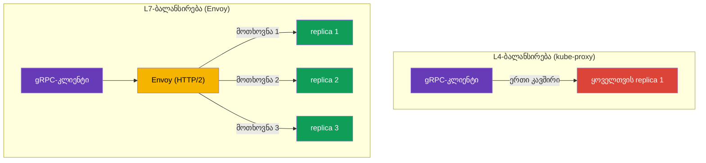

[Русская версия](ru.md) · [Eng version](en.md) · [Versión en español](es.md) · [Version française](fr.md) · [Deutsche Version](de.md) · [繁體中文版](tw.md) · [日本語版](jp.md)

# თავი 10. TCP, gRPC და WebSocket მარშრუტიზაცია

> **რა არის შემდეგ.** აქამდე HTTP ტრაფიკთან ვმუშაობდით. თუმცა სერვისებს შორის ყველა
> კომუნიკაცია HTTP არ არის: არსებობს მონაცემთა ბაზები, შეტყობინებების ბროკერები, TCP-ზე
> აგებული საკუთარი ბინარული პროტოკოლები, აგრეთვე gRPC და WebSocket. ამ თავში განვიხილავთ,
> როგორ მუშაობს Istio TCP ტრაფიკთან (მათ შორის პრაქტიკულ შემთხვევას - Redis/RabbitMQ-ის
> შიდა VPC ქსელში გატანას), რატომ დგას gRPC ცალკე და როგორ მოვექცეთ ხანგრძლივ WebSocket
> კავშირებს. ingress-ის ცალკე სტანდარტს - Kubernetes Gateway API-ს - მომდევნო, მე-11 თავი
> ეძღვნება.

## 10.1. რისთვის არის საჭირო TCP მარშრუტიზაცია

HTTP მარშრუტიზაციას მოთხოვნის შიგთავსის დანახვა შეუძლია: სათაურების, გზებისა და მეთოდების.
მაგრამ თუ ტრაფიკი, მაგალითად, PostgreSQL ან ნებისმიერი TCP პროტოკოლია, მასში HTTP
სათაურები არ არის. Istio-ს მისი მართვა მაინც შეუძლია, ოღონდ კავშირების დონეზე (L4):
პორტის გადამისამართება, ტრაფიკის ვერსიებს შორის განაწილება, TLS-ისთვის SNI-ის მიხედვით
მიმართვა.

## 10.2. TCP პორტის გადამისამართება gateway-ზე

ჯერ Gateway-ში TCP პორტს ვაცხადებთ (პროტოკოლი `TCP`, `HTTP`-ის ნაცვლად):

```yaml
apiVersion: networking.istio.io/v1
kind: Gateway
metadata:
  name: tcp-gateway
spec:
  selector:
    istio: ingressgateway
  servers:
  - port:
      number: 3000
      name: tcp
      protocol: TCP      # არა HTTP, არამედ TCP
    hosts:
    - "*"
```

შემდეგ VirtualService ამ TCP ტრაფიკს სერვისისკენ მიმართავს. ყურადღება მიაქციეთ: ბლოკს
`tcp` ეწოდება და არა `http`, ხოლო დამთხვევა პორტის და არა სათაურების მიხედვით ხდება.

```yaml
apiVersion: networking.istio.io/v1
kind: VirtualService
metadata:
  name: tcp-echo-vs
spec:
  hosts:
  - "*"
  gateways:
  - tcp-gateway
  tcp:                    # სწორედ tcp
  - match:
    - port: 3000
    route:
    - destination:
        host: tcp-echo
        port:
          number: 9000
```


## 10.3. TCP-ის წონიანი მარშრუტიზაცია

HTTP-ის მსგავსად, TCP ტრაფიკიც შეიძლება წონების მიხედვით განაწილდეს ვერსიებს შორის.
ეს canary-ისთვის არა-HTTP სერვისებშიც სასარგებლოა:

```yaml
  tcp:
  - match:
    - port: 3000
    route:
    - destination:
        host: tcp-echo
        subset: v1
      weight: 80        # კავშირების 80% v1-ზე
    - destination:
        host: tcp-echo
        subset: v2
      weight: 20        # 20% v2-ზე
```

HTTP-სგან განსხვავების გაგება მნიშვნელოვანია: HTTP წონები **მოთხოვნებს** ანაწილებს,
TCP წონები კი - **კავშირებს**. ერთი TCP კავშირის შიგნით მთელი ტრაფიკი ყოველთვის ერთსა
და იმავე რეპლიკაზე მიდის, რადგან Envoy ნაკადის შიგთავსს ცალკეულ მოთხოვნებად არ შლის.
TCP-ისთვის სათაურების, გზებისა და მეთოდების მიხედვით დამთხვევაც შეუძლებელია - მხოლოდ
პორტის (და TLS-ისთვის SNI-ის) მიხედვით, როგორც მე-9 თავის PASSTHROUGH-ში.

## 10.4. მაგალითი: Redis/RabbitMQ შიდა VPC ქსელში

ხშირი ამოცანაა: EKS-ში მუშაობს Redis (ან RabbitMQ) და მასზე წვდომა VPC-ში არსებული სხვა
სერვისებიდან გვჭირდება, თუმცა **არა ინტერნეტიდან**. ეს წმინდა TCP შემთხვევაა: Redis და
AMQP HTTP არ არის, ამიტომ მათ L4 დონეზე ვმართავთ, ხოლო კერძო ქსელში „კარს“ **შიდა**
ingress gateway-ისა და კერძო NLB-ის მეშვეობით ვხსნით.

სქემა ორი ნაწილისგან შედგება:

1. **შიდა ingress gateway** - ცალკე gateway, რომლის Service იღებს NLB-ს `scheme:
   internal`-ით (მისამართი მხოლოდ VPC-ის კერძო IP-ებად რეზოლვდება და ინტერნეტიდან
   მიუწვდომელია). მეორე gateway-ის გაშლა და მასზე შიდა NLB-ის მიმაგრება [მე-5 თავში](../05/ge.md)
   განვიხილეთ.
2. **Gateway + VirtualService ამ სერვისის TCP პორტზე**, რომლებიც შიდა gateway-ისკენაა
   მიმართული.


Gateway უსმენს Redis-ის TCP პორტს და `selector`-ის მეშვეობით შიდა gateway-ს უკავშირდება:

```yaml
apiVersion: networking.istio.io/v1
kind: Gateway
metadata:
  name: redis-gateway
spec:
  selector:
    istio: ingressgateway-internal   # შიდა gateway (პრივატული NLB)
  servers:
  - port:
      number: 6379
      name: tcp-redis
      protocol: TCP
    hosts:
    - "*"
```

VirtualService TCP პორტს Redis სერვისისკენ მიმართავს (ბლოკი `tcp`, დამთხვევა პორტით):

```yaml
apiVersion: networking.istio.io/v1
kind: VirtualService
metadata:
  name: redis-vs
spec:
  hosts:
  - "*"
  gateways:
  - redis-gateway
  tcp:
  - match:
    - port: 6379
    route:
    - destination:
        host: redis.data.svc.cluster.local   # Kubernetes Service Redis
        port:
          number: 6379
```

RabbitMQ-ისთვის ყველაფერი იგივეა - მხოლოდ პორტები იცვლება: `5672` (AMQP) და, საჭიროების
შემთხვევაში, `15672` (management UI, თუმცა მას ჩვეულებრივ შიდა ქსელშიც კი არ აქვეყნებენ).
VPC-ში არსებული კლიენტები შიდა NLB-ის DNS სახელით (`*.elb.amazonaws.com`, რომელიც კერძო
IP-ებად რეზოლვდება) უკავშირდებიან.

მნიშვნელოვანი ნიუანსები:

- ეს **L4**-ია: მარშრუტიზაცია მხოლოდ პორტით ხდება, გზებისა და სათაურების გარეშე; წონები
  კავშირებს ანაწილებს (განყოფილება 10.3).
- **უსაფრთხოება.** NLB `internal` ინტერნეტიდან წვდომას კეტავს, მაგრამ VPC-ის შიგნით პორტი
  ღიაა. შეზღუდეთ, ვის შეუძლია დაკავშირება: security group NLB-ზე, `AuthorizationPolicy`
  mesh-ის მხარეს და mTLS სერვისებს შორის (თავები 12–13). ასეთი სერვისები გარეთ არ გააქვთ.
- თუ კლიენტი mesh-ის გარეთაა (ჩვეულებრივი VM VPC-ში), NLB-დან Redis-ის პოდამდე ტრაფიკი
  კლასტერში ავტომატურად არ იშიფრება - საჭიროების შემთხვევაში გამოიყენეთ თავად
  Redis/RabbitMQ-ის TLS ან PASSTHROUGH SNI-ის მიხედვით (თავი 9).

## 10.5. WebSocket

WebSocket იწყება როგორც ჩვეულებრივი HTTP/1.1 მოთხოვნა სათაურით `Upgrade: websocket`, რის
შემდეგაც კავშირი მუდმივ ორმხრივ არხად „განახლდება“. Istio-სთვის ეს L7-HTTP-ია და
**WebSocket-ის ცალკე ჩართვა საჭირო არ არის** - Envoy upgrade-ს სტანდარტულად უჭერს მხარს.
მარშრუტი VirtualService-ში ჩვეულებრივი `http` ბლოკით აღიწერება (Gateway და Service -
როგორც მე-5 თავის ნებისმიერი HTTP აპლიკაციისთვის).

მთავარი საფრთხე **ტაიმაუტებია**, ისევე როგორც gRPC სტრიმინგისას. WebSocket კავშირი დიდხანს
ცოცხლობს (წუთები და საათები), ხოლო VirtualService-ში ჩვეულებრივი `timeout` დროის გასვლის
შემდეგ მას გაწყვეტს. ამიტომ WebSocket მარშრუტებისთვის ტაიმაუტს ან საერთოდ არ უთითებენ,
ან დიდ მნიშვნელობას აძლევენ - ქვემოთ მოცემულ მაგალითში ის უშუალოდ მარშრუტშია მოხსნილი
(`timeout: 0s`):

```yaml
apiVersion: networking.istio.io/v1
kind: VirtualService
metadata:
  name: chat-vs
  namespace: apps
spec:
  hosts:
  - chat.example.com          # იგივე ჰოსტი, რაც Gateway-ში
  gateways:
  - main-gateway              # Gateway-ის სახელი HTTP/HTTPS-პორტით (თავი 5)
  http:
  - match:
    - uri:
        prefix: /ws           # WebSocket-ის endpoint
    timeout: 0s               # 0 = შეზღუდვის გარეშე (დიდხანს მცოცხალი კავშირებისთვის)
    route:
    - destination:
        host: chat-backend    # ბექენდის Kubernetes Service
        port:
          number: 8080
```

კიდევ რამდენიმე საკითხი:

- **Idle timeout.** კავშირის ხანგრძლივი უმოქმედობა შეიძლება არა მხოლოდ Istio-მ, არამედ
  NLB-მაც გაწყვიტოს (AWS NLB-ის idle timeout ნაგულისხმევად 350 წამია) - WebSocket-ისთვის
  სერვერზე ping/pong (heartbeat) დააყენეთ, რათა კავშირი უმოქმედოდ არ ჩაითვალოს.
- **Session affinity.** თუ backend სესიის მდგომარეობას ინახავს, კლიენტი ერთ რეპლიკას
  DestinationRule-ში consistent hash-ის მეშვეობით მიაბით (`consistentHash` cookie-ის ან
  სათაურის მიხედვით, თავი 7) - წინააღმდეგ შემთხვევაში ხელახალი დაკავშირება შეიძლება
  სხვა რეპლიკაზე მოხვდეს.

## 10.6. gRPC-ის თავისებურებები

gRPC ხშირად „უბრალოდ TCP“-ში ერევათ, მაგრამ ეს მნიშვნელოვანი შეცდომაა. gRPC **HTTP/2-ის
თავზე** მუშაობს, რაც ნიშნავს, რომ Istio-სთვის ის HTTP ტრაფიკია (L7) და არა ნედლი TCP.
აქედან ორი დასკვნა გამომდინარეობს.

პირველი: gRPC-სთვის ყველა L7 შესაძლებლობა ხელმისაწვდომია - მარშრუტიზაცია სათაურებით,
განმეორებითი მცდელობები, ტაიმაუტები, per-request დატვირთვის დაბალანსება და დეტალური
მეტრიკები. ანუ gRPC-ს VirtualService-ში `http` ბლოკით, ჩვეულებრივი HTTP-ის მსგავსად
აკონფიგურირებთ და არა `tcp`-ით.

მეორე - და ეს gRPC-სთვის mesh-ის დაყენების მთავარი მიზეზია - დატვირთვის დაბალანსების
პრობლემა. gRPC **ერთ ხანგრძლივ HTTP/2 კავშირს** ინარჩუნებს და მასში მრავალ მოთხოვნას
ამულტიპლექსირებს. ჩვეულებრივი L4 დატვირთვის დაბალანსება (kube-proxy) ტრაფიკს კავშირების
მიხედვით ანაწილებს, ამიტომ კლიენტის ყველა მოთხოვნა ერთ რეპლიკას „ეწებება“ და დაბალანსება
ფაქტობრივად არ მუშაობს.



Envoy-ს HTTP/2 ესმის და ერთი კავშირის შიგნით **ცალკეული მოთხოვნების მიხედვით** აბალანსებს:
თითოეული gRPC გამოძახება შეიძლება თავის რეპლიკაზე წავიდეს. ეს ერთ-ერთი ყველაზე ხშირი
მიზეზია, რის გამოც gRPC სერვისები mesh-ში შეჰყავთ.

Istio-მ პროტოკოლი სწორად რომ ამოიცნოს, სერვისის პორტს **სახელი მკაფიოდ უნდა დაერქვას**:
პორტის სახელი `grpc`-ით უნდა იწყებოდეს (მაგალითად, `grpc-web`) ან გამოიყენეთ ველი
`appProtocol: grpc`. თუ პორტს ნეიტრალურ სახელს (`tcp-...`) დაარქმევთ, Istio ტრაფიკს
ჩვეულებრივ TCP-ად ჩათვლის და ყველა L7 შესაძლებლობა დაიკარგება.

```yaml
apiVersion: v1
kind: Service
metadata:
  name: my-grpc-service
spec:
  ports:
  - name: grpc-api        # სახელი იწყება grpc-ით -> Istio ხედავს HTTP/2
    port: 9000
    appProtocol: grpc     # ან ცხადად appProtocol-ის მეშვეობით
```

დაიმახსოვრეთ წესი: **gRPC არის HTTP/2 და არა TCP**. დააკონფიგურირეთ ის როგორც HTTP და
პორტისთვის სწორი სახელის დარქმევა არ დაგავიწყდეთ.

## 10.7. gRPC ingress-ზე

ingress gateway-ის მეშვეობით გარედან gRPC-ის მისაღებად სამი რესურსია საჭირო, ისევე როგორც
მე-5 თავის ჩვეულებრივი HTTP-ისთვის, ოღონდ HTTP/2-თან დაკავშირებული შენიშვნებით:

1. gRPC აპლიკაციის **Service** - სწორად დასახელებული პორტით, რათა Istio მიხვდეს, რომ ეს
   HTTP/2-ია (განყოფილება 10.6).
2. **Gateway** - ingress gateway-ზე ხსნის პორტს პროტოკოლით `GRPC` (ან `HTTP2`).
3. **VirtualService** - ტრაფიკს gateway-დან Service-ისკენ მიმართავს; მარშრუტი `http`
   ბლოკში აღიწერება (არა `tcp`-ში!), რადგან Istio-სთვის gRPC არის L7.

**1. gRPC აპლიკაციის Service.** პორტის სახელი `grpc`-ით უნდა იწყებოდეს ან
`appProtocol: grpc`-ით უნდა იყოს მითითებული, წინააღმდეგ შემთხვევაში Istio ტრაფიკს
ჩვეულებრივ TCP-ად ჩათვლის:

```yaml
apiVersion: v1
kind: Service
metadata:
  name: grpc-server
  namespace: apps
spec:
  selector:
    app: grpc-server
  ports:
  - name: grpc-api          # სახელი იწყება grpc-ით -> Istio ხედავს HTTP/2
    port: 9000
    targetPort: 9000
    appProtocol: grpc       # ან ცხადად appProtocol-ის მეშვეობით
```

**2. Gateway.** პორტი `GRPC` (ან `HTTP2`) პროტოკოლით ცხადდება. ჩვეულებრივი `HTTP` აქ არ
გამოდგება: gateway-მ უნდა იცოდეს, რომ ეს HTTP/2-ია, წინააღმდეგ შემთხვევაში
მულტიპლექსირება და per-request დაბალანსება არ იმუშავებს. ჩვეულებრივ gRPC TLS-ით
ქვეყნდება, ამიტომ ვამატებთ `tls`-ს (სერტიფიკატი Secret `grpc-cert`-ში, როგორც მე-9 თავში):

```yaml
apiVersion: networking.istio.io/v1
kind: Gateway
metadata:
  name: grpc-gateway
  namespace: apps
spec:
  selector:
    istio: ingressgateway     # რომელ ingress gateway-ზე გამოვიყენოთ (თავი 5)
  servers:
  - port:
      number: 443
      name: grpc-tls
      protocol: GRPC          # ან HTTP2; არა უბრალოდ HTTP
    tls:
      mode: SIMPLE
      credentialName: grpc-cert
    hosts:
    - grpc.example.com
```

**3. VirtualService.** `gateways`-ის მეშვეობით Gateway-ს უკავშირდება და ტრაფიკს
Service-ისკენ მიმართავს. მარშრუტი `http` ბლოკშია; gRPC მეთოდის მიხედვით დამთხვევა
`uri.prefix`-ით არის შესაძლებელი, რადგან მეთოდის სახელი არის HTTP/2 path ფორმით
`/<package>.<Service>/<Method>`:

```yaml
apiVersion: networking.istio.io/v1
kind: VirtualService
metadata:
  name: grpc-server-vs
  namespace: apps
spec:
  hosts:
  - grpc.example.com          # იგივე ჰოსტი, რაც Gateway-ში
  gateways:
  - grpc-gateway              # Gateway-ის სახელი მე-2 ნაბიჯიდან (შეიძლება namespace/სახელი)
  http:
  - match:
    - uri:
        prefix: /helloworld.Greeter/   # ოფციურად: მარშრუტი კონკრეტული gRPC-სერვისის მიხედვით
    route:
    - destination:
        host: grpc-server     # Service-ის სახელი მე-1 ნაბიჯიდან
        port:
          number: 9000
```

თუ მეთოდების მიხედვით დაყოფა საჭირო არ არის, `match` ბლოკი შეიძლება გამოტოვოთ - მაშინ
ჰოსტის მთელი gRPC ტრაფიკი `grpc-server`-ზე წავა. კლიენტი TLS-ით
`grpc.example.com:443`-ს უკავშირდება, შემდეგ კი per-request დაბალანსება (განყოფილება
10.6) გამოძახებებს რეპლიკებზე ანაწილებს.

## 10.8. gRPC: განმეორებითი მცდელობები, ტაიმაუტები და კავშირების პული

რადგან gRPC არის HTTP, მასზე მე-8 თავის მდგრადობის მექანიზმები ვრცელდება, თუმცა გარკვეული
ნიუანსებით.

**განმეორებითი მცდელობები gRPC სტატუსებით.** gRPC-ს საკუთარი სტატუსის კოდები აქვს (არა
HTTP) და `retryOn`-ს მათი გაგება შეუძლია - ჩამოთვალეთ სწორედ gRPC პირობები. ისინი იმავე
VirtualService-ში კონფიგურირდება, სადაც მარშრუტია (ეს იგივე `grpc-server-vs`-ია 10.7-დან,
ოღონდ `retries` ბლოკით):

```yaml
apiVersion: networking.istio.io/v1
kind: VirtualService
metadata:
  name: grpc-server-vs
  namespace: apps
spec:
  hosts:
  - grpc.example.com
  gateways:
  - grpc-gateway
  http:
  - retries:
      attempts: 3
      perTryTimeout: 2s
      retryOn: unavailable,resource-exhausted,cancelled   # gRPC-სტატუსები
    route:
    - destination:
        host: grpc-server     # იგივე Service, რაც 10.7-ში
        port:
          number: 9000
```

gRPC-სთვის `retryOn`-ის სასარგებლო მნიშვნელობებია: `cancelled`, `deadline-exceeded`,
`internal`, `resource-exhausted`, `unavailable`. HTTP-ის მსგავსად (თავი 8), განმეორებითი
მცდელობა მხოლოდ იდემპოტენტური გამოძახებებისთვის ღირს.

**ტაიმაუტები და სტრიმინგი - ფრთხილად.** VirtualService-ის `timeout` ველი მთლიან
„მოთხოვნის დროს“ ზღუდავს. unary გამოძახებებისთვის (ერთი მოთხოვნა - ერთი პასუხი) ეს
ნორმალურია. მაგრამ **server-streaming / bidi-streaming** RPC-ისთვის, სადაც კავშირი
დიდხანს ცოცხლობს და მონაცემები ნაკადად მიედინება, ჩვეულებრივი `timeout` დროის გასვლის
შემდეგ სტრიმს გაწყვეტს. სტრიმინგ სერვისებისთვის ტაიმაუტს ან არ უთითებენ, ან განზრახ დიდ
მნიშვნელობას აძლევენ.

**კავშირების პული და ხელახალი დაბალანსება.** gRPC ერთ ხანგრძლივ HTTP/2 კავშირს ინარჩუნებს.
Envoy-ის შემთხვევაშიც კი ეს პრობლემას ქმნის: თუ სერვისი **გააფართოეთ** (რეპლიკები
დაამატეთ), ძველი კავშირები კვლავ ძველ endpoint-ებზე რჩება. DestinationRule-ში
`connectionPool` პარამეტრები გვეხმარება:

```yaml
apiVersion: networking.istio.io/v1
kind: DestinationRule
metadata:
  name: grpc-server-dr
  namespace: apps
spec:
  host: grpc-server           # იგივე Service, რაც 10.7-ში
  trafficPolicy:
    connectionPool:
      http:
        http2MaxRequests: 1000          # მაქს. ერთდროული მოთხოვნები (HTTP/2-ისთვის სწორედ ეს არის მნიშვნელოვანი)
        maxRequestsPerConnection: 100   # N მოთხოვნის შემდეგ კავშირის ხელახლა შექმნა -> აიტაცებს ახალ replica-ებს
```

HTTP/2-ისა და gRPC-სთვის მთავარი ლიმიტია `http2MaxRequests` (ერთდროული მოთხოვნების
მაქსიმუმი) და არა HTTP/1.1-ის `http1MaxPendingRequests`. ხოლო `maxRequestsPerConnection`
Envoy-ს აიძულებს, კავშირი პერიოდულად ხელახლა გახსნას, რათა ტრაფიკი ახლად დამატებულ
რეპლიკებზეც განაწილდეს.

## 10.9. შედარება: HTTP, TCP, gRPC

| | HTTP (L7) | TCP (L4) | gRPC (HTTP/2, L7) |
|---|---|---|---|
| ბლოკი VirtualService-ში | `http` | `tcp` | `http` |
| დამთხვევა სათაურებით/გზებით | დიახ | არა | დიახ (მეთოდი = path) |
| დამთხვევა SNI-ით | - | დიახ (TLS) | - |
| წონები ანაწილებს | მოთხოვნებს | კავშირებს | მოთხოვნებს |
| განმეორებითი მცდელობები/ტაიმაუტები | დიახ | არა | დიახ (gRPC სტატუსები) |
| დატვირთვის დაბალანსება | per-request | per-connection | per-request |
| პორტის სახელი | `http` | `tcp` | `grpc` / `appProtocol: grpc` |

ამ ცხრილში WebSocket არის HTTP (L7) სვეტი: მარშრუტიზაცია `http` ბლოკით, როგორც HTTP,
ხდება; Istio upgrade-ს სტანდარტულად უჭერს მხარს, მაგრამ კავშირი ხანგრძლივია (იხ. 10.5).

## 10.10. საუკეთესო პრაქტიკები

- **პორტებს სწორი სახელები დაარქვით.** `grpc...` ან `appProtocol: grpc` gRPC-სთვის,
  `http...` HTTP-ისთვის, `tcp...` ნედლი TCP-ისთვის. პორტის სახელში შეცდომა = L7
  შესაძლებლობების დაკარგვა (gRPC-სთვის ეს განსაკუთრებით მტკივნეულია - დატვირთვის
  დაბალანსება ირღვევა).
- **gRPC-ის ingress-ზე - პროტოკოლი `GRPC`/`HTTP2`**, და არა `HTTP`.
- **gRPC-ის განმეორებითი მცდელობები - gRPC სტატუსებით** (`unavailable`,
  `resource-exhausted` და ა.შ.) და მხოლოდ იდემპოტენტური გამოძახებებისთვის.
- **სტრიმინგ RPC-ზე ჩვეულებრივი `timeout` არ დააყენოთ** - ის ხანგრძლივ ნაკადს გაწყვეტს.
- **gRPC-სთვის დააკონფიგურირეთ `http2MaxRequests` და `maxRequestsPerConnection`**, რათა
  მასშტაბირების შემდეგ კავშირები ახალ რეპლიკებზე ხელახლა დაბალანსდეს.
- **TCP მხოლოდ იმისთვის გამოიყენეთ, რაც ნამდვილად არ არის HTTP** (მონაცემთა ბაზები,
  ბროკერები, საკუთარი ბინარული პროტოკოლები). ყველაფერი, რასაც HTTP/2 შეუძლია,
  HTTP/gRPC-დ მართეთ, რათა L7 შესაძლებლობები გამოიყენოთ.
- **მონაცემთა ბაზები და ბროკერები ინტერნეტში არ გამოაქვეყნოთ.** Redis/RabbitMQ მხოლოდ
  შიდა ქსელში გაიტანეთ - შიდა ingress gateway-ითა და NLB `scheme: internal`-ით, დამატებით
  security group-ით, `AuthorizationPolicy`-ითა და mTLS-ით.
- **WebSocket-ისა და სტრიმინგისთვის მოხსენით `timeout`** (`0s` ან დიდი მნიშვნელობა) და
  დააკონფიგურირეთ heartbeat, რათა კავშირი idle timeout-ის გამო არ გაწყდეს (მათ შორის NLB-ზე).

## 10.11. თავის შეჯამება

- Istio არა მხოლოდ HTTP, არამედ TCP ტრაფიკსაც მართავს - კავშირების დონეზე (L4).
- TCP-ისთვის Gateway-ში პორტი `protocol: TCP`-ით ცხადდება, VirtualService-ში კი გამოიყენება
  `tcp` ბლოკი პორტის მიხედვით დამთხვევით.
- TCP წონები კავშირებს (და არა მოთხოვნებს) ანაწილებს; სათაურებითა და გზებით დამთხვევა
  შეუძლებელია - მხოლოდ პორტითა და SNI-ით.
- **gRPC არის HTTP/2 და არა TCP**: ის HTTP-ის მსგავსად კონფიგურირდება, იღებს ყველა L7
  შესაძლებლობას და, რაც მთავარია, per-request დაბალანსებას (L4 ყველაფერს ერთ რეპლიკაზე
  დააბალანსებდა). პორტს `grpc...` სახელი უნდა დაერქვას ან `appProtocol: grpc` უნდა მიეთითოს.
- **gRPC ingress-ისთვის** Gateway-ის პორტი `GRPC`/`HTTP2` პროტოკოლით ცხადდება; მარშრუტი
  `http` ბლოკშია, ხოლო gRPC მეთოდით დამთხვევა `uri.prefix`-ით შეიძლება.
- gRPC-ის მდგრადობა: განმეორებითი მცდელობები **gRPC სტატუსებით** (`unavailable`,
  `resource-exhausted`…), სიფრთხილე `timeout`-თან **სტრიმინგისას**, ხოლო `connectionPool`-ში
  `http2MaxRequests` და `maxRequestsPerConnection` ხანგრძლივი კავშირების ხელახლა
  დაბალანსებას უწყობს ხელს.
- **Redis/RabbitMQ შიდა VPC ქსელში** TCP-ის სახით, შიდა ingress gateway-ითა და კერძო NLB-ით
  (`scheme: internal`) გააქვთ; გარეთ არ აქვეყნებენ, ხოლო წვდომას
  SG/AuthorizationPolicy/mTLS-ით ზღუდავენ.
- **WebSocket** არის L7-HTTP (upgrade სტანდარტულად მხარდაჭერილია); მთავარია ხანგრძლივი
  კავშირისთვის `timeout` მოიხსნას და idle timeout-ების საწინააღმდეგოდ heartbeat
  დაკონფიგურირდეს.

## 10.12. თვითშემოწმების კითხვები

1. რით განსხვავდება TCP მარშრუტიზაცია HTTP-ისგან? TCP-ში რის მიხედვით დამთხვევა არ შეიძლება?
2. TCP მარშრუტიზაციაში წონები მოთხოვნებს ანაწილებს თუ კავშირებს? რატომ?
3. რატომ კონფიგურირდება gRPC Istio-ში როგორც HTTP და არა როგორც TCP?
4. როგორ უნდა დაარქვათ პორტს სახელი, რათა Istio-მ gRPC ამოიცნოს?
5. რატომ ზარალდება gRPC-ის დატვირთვის დაბალანსება mesh-ის გარეშე?
6. რა პროტოკოლი მიეთითება Gateway-ზე გარედან gRPC-ის მისაღებად და რატომ არა `HTTP`?
7. რით განსხვავდება gRPC-ის განმეორებითი მცდელობები HTTP-ისგან? რატომ არის სახიფათო
   სტრიმინგ RPC-ზე `timeout`-ის დაყენება?
8. რატომ აკონფიგურირებენ gRPC-სთვის `maxRequestsPerConnection`-ს?
9. როგორ გავიტანოთ Redis ან RabbitMQ EKS-დან მხოლოდ შიდა VPC ქსელში და არა ინტერნეტში?
10. საჭიროა თუ არა Istio-ში WebSocket-ის ცალკე ჩართვა? რა არის WebSocket კავშირების მთავარი
    საფრთხე და როგორ ავიცილოთ ის თავიდან?

## პრაქტიკა

ივარჯიშეთ ნედლი TCP ტრაფიკის მარშრუტიზაციაში (კავშირების წონიანი განაწილება):

🧪 ლაბორატორია 28: [tasks/ica/labs/28](../../labs/28/README_GE.MD)

ივარჯიშეთ gRPC-ზე - სწორედ იმაზე, რისი შემოწმებაც ტექსტში სიტყვიერად შეუძლებელია:

- gRPC-ის per-request დატვირთვის დაბალანსება: ერთი კლიენტი, რამდენიმე რეპლიკა, მოთხოვნები
  რეალურად ნაწილდება სხვადასხვა პოდზე (L4-ისგან განსხვავებით, სადაც ყველაფერი ერთ
  რეპლიკას ეწებება);
- პორტის სწორი დასახელება (`grpc` / `appProtocol: grpc`) და რა ირღვევა მის გარეშე;
- gRPC-ის განმეორებითი მცდელობები და ტაიმაუტები, როგორც HTTP-ისთვის.

🧪 ლაბორატორია 32: [tasks/ica/labs/32](../../labs/32/README_GE.MD)

---
[სარჩევი](../README_GE.md) · [თავი 9](../09/ge.md) · [თავი 11](../11/ge.md)
