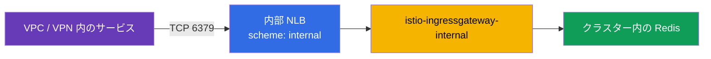
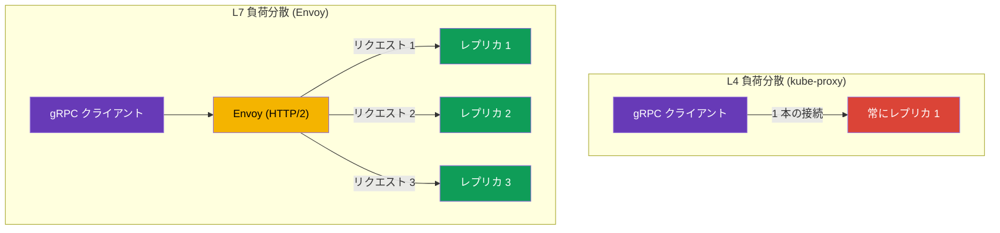

[Русская версия](ru.md) · [Eng version](en.md) · [Versión en español](es.md) · [Version française](fr.md) · [Deutsche Version](de.md) · [ქართული ვერსია](ge.md) · [繁體中文版](tw.md)

# 第10章 TCP、gRPC、WebSocket のルーティング

> **この次は。** これまで HTTP トラフィックを扱ってきました。しかし、サービス間の通信が
> すべて HTTP とは限りません。データベース、メッセージブローカー、TCP 上の独自バイナリプロトコルに加え、
> gRPC や WebSocket もあります。この章では、Istio が TCP トラフィックをどのように扱うか（内部 VPC
> ネットワークへ Redis/RabbitMQ を公開する実践的なケースを含む）、gRPC がなぜ特別なのか、長時間存続する
> WebSocket 接続をどう扱うかを説明します。もう一つの ingress 標準である Kubernetes Gateway API は、次の第11章で扱います。

## 10.1. TCP ルーティングが必要な理由

HTTP ルーティングは、ヘッダー、パス、メソッドなど、リクエストの内部を確認できます。しかし、
トラフィックが PostgreSQL や任意の TCP プロトコルの場合、そこには HTTP ヘッダーはありません。
Istio はそれでも接続レベル（L4）で管理できます。ポートを転送し、バージョン間でトラフィックを分散し、
TLS の SNI によって転送できます。

## 10.2. Gateway での TCP ポート転送

まず、Gateway で TCP ポートを宣言します（`HTTP` ではなくプロトコル `TCP` を使用します）。

```yaml
apiVersion: networking.istio.io/v1
kind: Gateway
metadata:
  name: tcp-gateway
spec:
  selector:
    istio: ingressgateway
  servers:
  - port:
      number: 3000
      name: tcp
      protocol: TCP      # HTTP ではなく TCP
    hosts:
    - "*"
```

次に VirtualService が、この TCP トラフィックをサービスへ転送します。注意してください。ブロック名は
`http` ではなく `tcp` であり、match はヘッダーではなくポートに対して行われます。

```yaml
apiVersion: networking.istio.io/v1
kind: VirtualService
metadata:
  name: tcp-echo-vs
spec:
  hosts:
  - "*"
  gateways:
  - tcp-gateway
  tcp:                    # tcp を指定
  - match:
    - port: 3000
    route:
    - destination:
        host: tcp-echo
        port:
          number: 9000
```


## 10.3. TCP の重み付きルーティング

HTTP と同様に、TCP トラフィックも重みに基づいてバージョン間に分散できます。これは HTTP 以外の
サービスでも canary に役立ちます。

```yaml
  tcp:
  - match:
    - port: 3000
    route:
    - destination:
        host: tcp-echo
        subset: v1
      weight: 80        # 接続の 80% を v1 へ
    - destination:
        host: tcp-echo
        subset: v2
      weight: 20        # 20% を v2 へ
```

HTTP との違いを理解することは重要です。HTTP の重みは**リクエスト**を分散しますが、TCP の重みは
**接続**を分散します。1 つの TCP 接続内では、Envoy がストリームの内容を個々のリクエストに分解しないため、
すべてのトラフィックが同じレプリカへ送られます。TCP ではヘッダー、パス、メソッドによる match もできません。
ポートだけ（および第9章の PASSTHROUGH と同様に TLS の SNI）で可能です。

## 10.4. 例: 内部 VPC ネットワークへの Redis/RabbitMQ

よくあるタスクとして、EKS で Redis（または RabbitMQ）を実行しており、VPC 内の他サービスからアクセスする
必要がある一方で、**インターネットからはアクセスさせない**というものがあります。これは純粋な TCP のケースです。
Redis と AMQP は HTTP ではないため L4 で管理し、**内部** ingress gateway とプライベート NLB を通じてプライベート
ネットワークへの「扉」を開きます。

構成は 2 つの部分からなります。

1. **内部 ingress gateway**: 個別の gateway であり、その Service は `scheme:
   internal` を持つ NLB を取得します（アドレスは VPC のプライベート IP にのみ解決され、インターネットからはアクセスできません）。
   2 つ目の gateway をデプロイし、内部 NLB を接続する方法は[第5章](../05/jp.md)で扱いました。
2. このサービスの **TCP ポートに対する Gateway + VirtualService**。内部 gateway に向けます。



Gateway は Redis の TCP ポートをリッスンし、`selector` を通じて内部 gateway に紐付けられます。

```yaml
apiVersion: networking.istio.io/v1
kind: Gateway
metadata:
  name: redis-gateway
spec:
  selector:
    istio: ingressgateway-internal   # 内部 gateway (プライベート NLB)
  servers:
  - port:
      number: 6379
      name: tcp-redis
      protocol: TCP
    hosts:
    - "*"
```

VirtualService は TCP ポートを Redis Service に転送します（`tcp` ブロック、ポートで match）。

```yaml
apiVersion: networking.istio.io/v1
kind: VirtualService
metadata:
  name: redis-vs
spec:
  hosts:
  - "*"
  gateways:
  - redis-gateway
  tcp:
  - match:
    - port: 6379
    route:
    - destination:
        host: redis.data.svc.cluster.local   # Kubernetes Service Redis
        port:
          number: 6379
```

RabbitMQ でもすべて同じです。異なるのはポートだけです。`5672`（AMQP）、および必要なら
`15672`（management UI。ただし通常、内部ネットワークであっても公開しません）。VPC 内のクライアントは内部 NLB の
DNS 名（`*.elb.amazonaws.com`、プライベート IP に解決）に接続します。

重要な注意点:

- これは **L4** です。ルーティングはポートのみであり、パスやヘッダーは使用できません。重みは
  接続を分散します（10.3節）。
- **セキュリティ。** `internal` NLB はインターネットからのアクセスを閉じますが、VPC 内ではポートが
  開放されています。接続できる対象を制限してください。NLB の security group、mesh 側の `AuthorizationPolicy`、
  サービス間の mTLS（第12～13章）を使用します。このようなサービスを外部へ公開してはいけません。
- クライアントが mesh 外部（VPC 内の通常の VM）の場合、NLB からクラスター内の Redis Pod までのトラフィックは
  自動的には暗号化されません。必要に応じて Redis/RabbitMQ 自体の TLS、または SNI による PASSTHROUGH（第9章）を使用してください。

## 10.5. WebSocket

WebSocket は、`Upgrade: websocket` ヘッダーを持つ通常の HTTP/1.1 リクエストとして始まり、その後、接続が
永続的な双方向チャネルへ「アップグレード」されます。Istio にとってこれは L7 HTTP であり、**WebSocket を特別に
有効化する必要はありません**。Envoy は最初から upgrade をサポートしています。ルートは VirtualService の通常の
`http` ブロックで記述します（Gateway と Service は第5章の任意の HTTP アプリケーションと同じです）。

主な落とし穴は、gRPC ストリーミングと同じく **タイムアウト** です。WebSocket 接続は長時間（数分から数時間）
存続しますが、VirtualService の通常の `timeout` は時間切れになると切断します。そのため WebSocket ルートでは、
タイムアウトを指定しないか、大きな値にします。以下の例ではルート内で無効化しています（`timeout: 0s`）。

```yaml
apiVersion: networking.istio.io/v1
kind: VirtualService
metadata:
  name: chat-vs
  namespace: apps
spec:
  hosts:
  - chat.example.com          # Gateway と同じホスト
  gateways:
  - main-gateway              # HTTP/HTTPS ポートを持つ Gateway 名 (第5章)
  http:
  - match:
    - uri:
        prefix: /ws           # WebSocket エンドポイント
    timeout: 0s               # 0 = 制限なし (長時間接続向け)
    route:
    - destination:
        host: chat-backend    # バックエンドの Kubernetes Service
        port:
          number: 8080
```

さらにいくつか注意点があります。

- **Idle timeout。** 接続が長時間アイドル状態の場合、Istio だけでなく NLB も切断する可能性があります
  （AWS NLB の idle timeout はデフォルトで 350 秒）。WebSocket ではサーバーで ping/pong（heartbeat）を設定し、
  接続がアイドルと見なされないようにしてください。
- **Session affinity。** バックエンドがセッション状態を保持する場合、DestinationRule の consistent hash
  （cookie またはヘッダーによる `consistentHash`、第7章）を通じてクライアントを 1 つのレプリカに固定します。
  そうしないと、再接続時に別のレプリカへ送られる可能性があります。

## 10.6. gRPC の特徴

gRPC は「単なる TCP」と混同されがちですが、これは重要な誤りです。gRPC は **HTTP/2 上で**動作するため、
Istio にとっては生の TCP ではなく HTTP トラフィック（L7）です。ここから 2 つの結論が導かれます。

第一に、gRPC ではすべての L7 機能、すなわちヘッダーによるルーティング、リトライ、タイムアウト、
per-request 負荷分散、詳細なメトリクスを利用できます。つまり、gRPC は TCP ではなく通常の HTTP と同様に、
VirtualService の `http` ブロックを通じて設定します。

第二に、そしてこれが gRPC に mesh を導入する最大の理由ですが、負荷分散の問題があります。gRPC は**1 本の長時間存続する
HTTP/2 接続**を維持し、その中で多数のリクエストを多重化します。通常の L4 負荷分散（kube-proxy）は接続単位で
トラフィックを分散するため、クライアントのすべてのリクエストが 1 つのレプリカに「張り付き」、実質的に負荷分散が
機能しなくなります。



Envoy は HTTP/2 を理解し、1 つの接続内の**個々のリクエスト単位**で負荷分散します。各 gRPC 呼び出しを
別のレプリカへ送れます。これは gRPC サービスを mesh に導入する最も一般的な理由の一つです。

Istio がプロトコルを正しく認識するには、Service のポートを**明示的に命名**する必要があります。ポート名は
`grpc` で始める（例: `grpc-web`）か、フィールド `appProtocol: grpc` を使用します。ポートを中立的に
（`tcp-...`）命名すると、Istio はトラフィックを通常の TCP と見なし、すべての L7 機能が失われます。

```yaml
apiVersion: v1
kind: Service
metadata:
  name: my-grpc-service
spec:
  ports:
  - name: grpc-api        # 名前が grpc で始まる -> Istio は HTTP/2 と認識
    port: 9000
    appProtocol: grpc     # または appProtocol で明示的に
```

ルールを覚えてください。**gRPC は TCP ではなく HTTP/2 です**。HTTP として設定し、ポートを正しく命名することを
忘れないでください。

## 10.7. ingress での gRPC

外部から ingress gateway を通じて gRPC を受け入れるには、第5章の通常の HTTP と同様に 3 つのリソースが
必要ですが、HTTP/2 に関する注意点があります。

1. gRPC アプリケーションの **Service**: Istio が HTTP/2 であると認識できるよう、ポートを正しく命名します
   （10.6節）。
2. **Gateway**: プロトコル `GRPC`（または `HTTP2`）で ingress gateway のポートを開きます。
3. **VirtualService**: gateway から Service へトラフィックを送ります。gRPC は Istio にとって L7 なので、
   ルートは `tcp` ではなく `http` ブロックで記述します。

**1. gRPC アプリケーションの Service。** ポート名は `grpc` で始めるか、`appProtocol: grpc` で指定する必要があります。
そうしないと Istio はトラフィックを通常の TCP と見なします。

```yaml
apiVersion: v1
kind: Service
metadata:
  name: grpc-server
  namespace: apps
spec:
  selector:
    app: grpc-server
  ports:
  - name: grpc-api          # 名前が grpc で始まる -> Istio は HTTP/2 と認識
    port: 9000
    targetPort: 9000
    appProtocol: grpc       # または appProtocol で明示的に
```

**2. Gateway。** ポートをプロトコル `GRPC`（または `HTTP2`）で宣言します。通常の `HTTP` では不十分です。
gateway は HTTP/2 であることを認識する必要があり、そうでないと多重化と per-request 負荷分散が機能しません。
通常 gRPC は TLS で公開するため、`tls` を追加します（証明書は第9章と同じく Secret `grpc-cert` に入れます）。

```yaml
apiVersion: networking.istio.io/v1
kind: Gateway
metadata:
  name: grpc-gateway
  namespace: apps
spec:
  selector:
    istio: ingressgateway     # どの ingress gateway に適用するか (第5章)
  servers:
  - port:
      number: 443
      name: grpc-tls
      protocol: GRPC          # または HTTP2。単なる HTTP ではない
    tls:
      mode: SIMPLE
      credentialName: grpc-cert
    hosts:
    - grpc.example.com
```

**3. VirtualService。** `gateways` を通じて Gateway に紐付き、トラフィックを Service に送ります。ルートは
`http` ブロックに置きます。メソッド名は `/<package>.<Service>/<Method>` 形式の HTTP/2 path なので、
gRPC メソッドは `uri.prefix` を通じて match できます。

```yaml
apiVersion: networking.istio.io/v1
kind: VirtualService
metadata:
  name: grpc-server-vs
  namespace: apps
spec:
  hosts:
  - grpc.example.com          # Gateway と同じホスト
  gateways:
  - grpc-gateway              # 手順2の Gateway 名 (namespace/名前も可)
  http:
  - match:
    - uri:
        prefix: /helloworld.Greeter/   # 任意: 特定の gRPC サービスへのルート
    route:
    - destination:
        host: grpc-server     # 手順1の Service 名
        port:
          number: 9000
```

メソッドごとに分ける必要がない場合は、`match` ブロックを省略できます。その場合、ホストのすべての gRPC トラフィックが
`grpc-server` に送られます。クライアントは TLS で `grpc.example.com:443` に接続し、その後、per-request 負荷分散
（10.6節）が呼び出しをレプリカ間に分散します。

## 10.8. gRPC: リトライ、タイムアウト、接続プール

gRPC は HTTP であるため、第8章のレジリエンスを適用できますが、いくつか注意点があります。

**gRPC ステータスによるリトライ。** gRPC には独自のステータスコード（HTTP ではない）があり、`retryOn` は
それらを理解できます。必ず gRPC の条件を列挙してください。これらはルートと同じ VirtualService（10.7 の
`grpc-server-vs` と同じで、`retries` ブロックを追加したもの）で設定します。

```yaml
apiVersion: networking.istio.io/v1
kind: VirtualService
metadata:
  name: grpc-server-vs
  namespace: apps
spec:
  hosts:
  - grpc.example.com
  gateways:
  - grpc-gateway
  http:
  - retries:
      attempts: 3
      perTryTimeout: 2s
      retryOn: unavailable,resource-exhausted,cancelled   # gRPC ステータス
    route:
    - destination:
        host: grpc-server     # 10.7 と同じ Service
        port:
          number: 9000
```

gRPC における有用な `retryOn` 値は、`cancelled`、`deadline-exceeded`、`internal`、
`resource-exhausted`、`unavailable` です。HTTP（第8章）と同様に、リトライは冪等な呼び出しに対してのみ行うべきです。

**タイムアウトとストリーミング: 注意が必要です。** VirtualService の `timeout` フィールドは「リクエスト時間」全体を
制限します。unary 呼び出し（1 リクエスト、1 レスポンス）では問題ありません。しかし、接続が長時間維持され、データが
ストリームとして流れる **server-streaming / bidi-streaming** RPC では、通常の `timeout` により時間切れでストリームが
切断されます。ストリーミングサービスではタイムアウトを指定しないか、十分に大きい値を設定します。

**接続プールと再分散。** gRPC は 1 本の長時間存続する HTTP/2 接続を維持します。Envoy を使用していても、これは問題を
生みます。サービスを**スケールアウト**（レプリカを追加）した場合、古い接続は以前の endpoint に接続されたままです。
DestinationRule の `connectionPool` 設定が役立ちます。

```yaml
apiVersion: networking.istio.io/v1
kind: DestinationRule
metadata:
  name: grpc-server-dr
  namespace: apps
spec:
  host: grpc-server           # 10.7 と同じ Service
  trafficPolicy:
    connectionPool:
      http:
        http2MaxRequests: 1000          # 同時リクエスト数の上限 (HTTP/2 ではこれが重要)
        maxRequestsPerConnection: 100   # N リクエスト後に接続を再作成 -> 新しいレプリカを取り込む
```

HTTP/2 と gRPC で重要な制限は、HTTP/1.1 の `http1MaxPendingRequests` ではなく `http2MaxRequests`
（最大同時リクエスト数）です。`maxRequestsPerConnection` は Envoy に定期的な接続再確立をさせることで、新たに追加された
レプリカにもトラフィックが分散されるようにします。

## 10.9. 比較: HTTP、TCP、gRPC

| | HTTP (L7) | TCP (L4) | gRPC (HTTP/2, L7) |
|---|---|---|---|
| VirtualService のブロック | `http` | `tcp` | `http` |
| ヘッダー/パスによる Match | 可 | 不可 | 可（メソッド = path） |
| SNI による Match | - | 可（TLS） | - |
| 重みが分散する対象 | リクエスト | 接続 | リクエスト |
| リトライ/タイムアウト | 可 | 不可 | 可（gRPC ステータス） |
| 負荷分散 | per-request | per-connection | per-request |
| ポート名 | `http` | `tcp` | `grpc` / `appProtocol: grpc` |

この表において WebSocket は HTTP（L7）の列です。`http` ブロックを通じて HTTP としてルーティングされ、Istio は
upgrade を最初からサポートしていますが、接続は長時間存続します（10.5節を参照）。

## 10.10. ベストプラクティス

- **ポートを正しく命名してください。** gRPC には `grpc...` または `appProtocol: grpc`、HTTP には `http...`、
  生の TCP には `tcp...` を使います。ポート名の誤りは L7 機能の喪失につながります（gRPC では特に深刻で、負荷分散が壊れます）。
- **gRPC の ingress では `HTTP` ではなくプロトコル `GRPC`/`HTTP2` を使用します。**
- **gRPC のリトライは gRPC ステータス**（`unavailable`、`resource-exhausted` など）に対して行い、
  冪等な呼び出しに限定します。
- **ストリーミング RPC に通常の `timeout` を設定しないでください。** 長時間存続するストリームを切断してしまいます。
- **gRPC では `http2MaxRequests` と `maxRequestsPerConnection` を設定してください。** スケールアウト後に
  接続が新しいレプリカへ再分散されます。
- **TCP は実際に HTTP ではないものだけに使用してください**（DB、ブローカー、独自バイナリプロトコル）。
  HTTP/2 を扱えるものは、L7 機能のため HTTP/gRPC として扱います。
- **DB とブローカーをインターネットに公開しないでください。** Redis/RabbitMQ は、NLB `scheme: internal` を持つ
  内部 ingress gateway を通じて内部ネットワークにのみ公開し、security group、`AuthorizationPolicy`、mTLS を追加します。
- **WebSocket とストリーミングでは `timeout` を無効化してください**（`0s` または大きな値）。また、idle timeout
  （NLB 上のものを含む）で接続が切れないよう heartbeat を設定してください。

## 10.11. この章のまとめ

- Istio は HTTP だけでなく、接続レベル（L4）で TCP トラフィックも管理します。
- TCP では、Gateway で `protocol: TCP` を持つポートを宣言し、VirtualService ではポートによる match を持つ
  `tcp` ブロックを使用します。
- TCP の重みはリクエストではなく接続を分散します。ヘッダーやパスで match はできず、ポートと SNI のみです。
- **gRPC は TCP ではなく HTTP/2** です。HTTP として設定され、すべての L7 機能と、最も重要な per-request 負荷分散を
  得られます（L4 ではすべてが 1 つのレプリカに分散されます）。ポート名は `grpc...` にするか、`appProtocol: grpc` を設定します。
- **gRPC の ingress** では、Gateway のポートをプロトコル `GRPC`/`HTTP2` で宣言します。ルートは `http` ブロックに置き、
  gRPC メソッドは `uri.prefix` を通じて match できます。
- gRPC のレジリエンス: **gRPC ステータス**（`unavailable`、`resource-exhausted`…）によるリトライ、
  **ストリーミング**時の `timeout` には注意し、`connectionPool` の `http2MaxRequests` と `maxRequestsPerConnection` は
  長時間存続する接続の再分散に役立ちます。
- **内部 VPC ネットワークへの Redis/RabbitMQ** は、プライベート NLB（`scheme: internal`）を備えた内部 ingress
  gateway を通じて TCP として公開します。外部には公開せず、SG/AuthorizationPolicy/mTLS でアクセスを制限します。
- **WebSocket** は L7 HTTP です（upgrade は最初からサポートされています）。重要なのは長時間存続する接続のために
  `timeout` を無効化し、idle timeout 対策の heartbeat を設定することです。

## 10.12. 自己確認の質問

1. TCP ルーティングは HTTP と何が異なりますか。TCP では何を match できませんか。
2. TCP ルーティングの重みは、リクエストと接続のどちらを分散しますか。なぜですか。
3. Istio で gRPC を TCP ではなく HTTP として設定するのはなぜですか。
4. Istio が gRPC を認識するには、ポートをどのように命名しますか。
5. mesh がないと gRPC の負荷分散が悪化するのはなぜですか。
6. 外部から gRPC を受け入れるために Gateway にはどのプロトコルを指定しますか。また、なぜ `HTTP` ではないのですか。
7. gRPC のリトライは HTTP とどう異なりますか。ストリーミング RPC に `timeout` を設定することが危険なのはなぜですか。
8. gRPC で `maxRequestsPerConnection` を設定する目的は何ですか。
9. EKS の Redis または RabbitMQ をインターネットには公開せず、内部 VPC ネットワークにのみ公開するにはどうしますか。
10. Istio で WebSocket を特別に有効化する必要はありますか。WebSocket 接続の主な落とし穴と、その回避方法は何ですか。

## 演習

生の TCP トラフィックのルーティング（接続に基づく重み付き分散）を練習してください。

🧪 ラボ 28: [tasks/ica/labs/28](../../labs/28/README_JP.MD)

gRPC を実践で扱ってください。特に、テキストだけでは確認できない点を扱います。

- gRPC の per-request 負荷分散: 1 クライアント、複数レプリカで、リクエストが実際に異なる Pod へ分散されます
  （すべてが 1 つに張り付く L4 とは異なります）。
- ポートの正しい命名（`grpc` / `appProtocol: grpc`）と、命名しない場合に何が壊れるか。
- HTTP と同様の gRPC に対するリトライとタイムアウト。

🧪 ラボ 32: [tasks/ica/labs/32](../../labs/32/README_JP.MD)

---
[目次](../README_JP.md) · [第9章](../09/jp.md) · [第11章](../11/jp.md)
