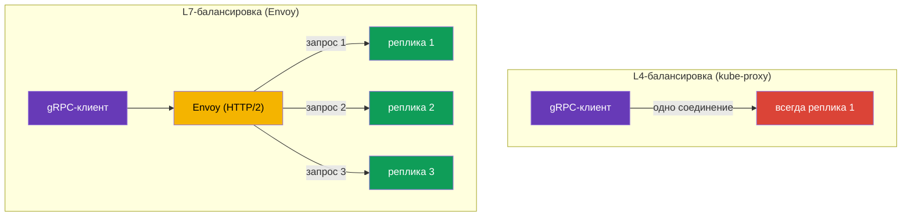

# Глава 10. Маршрутизация TCP и gRPC трафика

> **Что дальше.** До сих пор мы работали с HTTP-трафиком. Но не всё общение сервисов
> это HTTP: есть базы данных, брокеры сообщений, свои бинарные протоколы поверх TCP, а
> ещё gRPC. В этой главе разберём, как Istio работает с TCP-трафиком и почему gRPC
> стоит особняком. Отдельному стандарту ingress - Kubernetes Gateway API - посвящена
> следующая глава 11.

## 10.1. Зачем нужна TCP-маршрутизация

HTTP-маршрутизация умеет смотреть внутрь запросаииииииииииии: заголовки, пути, методы. Но если
трафик это, например, PostgreSQL или произвольный TCP-протокол, никаких HTTP-заголовков
там нет. Istio всё равно может им управлять, но на уровне соединений (L4): пробросить
порт, распределить трафик между версиями, направить по SNI для TLS.

## 10.2. Проброс TCP-порта на шлюзе

Сначала на Gateway объявляем TCP-порт (протокол `TCP` вместо `HTTP`):

```yaml
apiVersion: networking.istio.io/v1
kind: Gateway
metadata:
  name: tcp-gateway
spec:
  selector:
    istio: ingressgateway
  servers:
  - port:
      number: 3000
      name: tcp
      protocol: TCP      # не HTTP, а TCP
    hosts:
    - "*"
```

Затем VirtualService направляет этот TCP-трафик на сервис. Обратите внимание: блок
называется `tcp`, а не `http`, и match идёт по порту, а не по заголовкам.

```yaml
apiVersion: networking.istio.io/v1
kind: VirtualService
metadata:
  name: tcp-echo-vs
spec:
  hosts:
  - "*"
  gateways:
  - tcp-gateway
  tcp:                    # именно tcp
  - match:
    - port: 3000
    route:
    - destination:
        host: tcp-echo
        port:
          number: 9000
```


## 10.3. Взвешенная маршрутизация TCP

Как и для HTTP, TCP-трафик можно распределять между версиями по весам. Это полезно для
canary даже для не-HTTP сервисов:

```yaml
  tcp:
  - match:
    - port: 3000
    route:
    - destination:
        host: tcp-echo
        subset: v1
      weight: 80        # 80% соединений на v1
    - destination:
        host: tcp-echo
        subset: v2
      weight: 20        # 20% на v2
```

Отличие от HTTP важно понимать: HTTP-веса распределяют **запросы**, а TCP-веса -
**соединения**. Внутри одного TCP-соединения весь трафик идёт на одну и ту же реплику,
потому что Envoy не разбирает содержимое потока на отдельные запросы. Матчить по
заголовкам, путям и методам для TCP тоже нельзя - только по порту (и по SNI для TLS,
как в PASSTHROUGH из главы 9).

## 10.4. Особенности gRPC

gRPC часто путают с «просто TCP», но это важная ошибка. gRPC работает **поверх HTTP/2**,
а значит для Istio это HTTP-трафик (L7), а не сырой TCP. Из этого следуют два вывода.

Во-первых, для gRPC доступны все L7-возможности: маршрутизация по заголовкам, ретраи,
таймауты, per-request балансировка, детальные метрики. То есть gRPC вы настраиваете
через блок `http` в VirtualService, как обычный HTTP, а не через `tcp`.

Во-вторых - и это главная причина ставить mesh для gRPC - проблема балансировки.
gRPC держит **одно долгоживущее HTTP/2-соединение** и мультиплексирует в нём множество
запросов. Обычная L4-балансировка (kube-proxy) распределяет трафик по соединениям,
поэтому все запросы клиента «прилипают» к одной реплике, и балансировка фактически не
работает.



Envoy понимает HTTP/2 и балансирует **по отдельным запросам** внутри одного соединения:
каждый gRPC-вызов может уйти на свою реплику. Это одна из самых частых причин, почему
gRPC-сервисы заводят в mesh.

Чтобы Istio правильно распознал протокол, порт сервиса нужно **явно назвать**: имя порта
должно начинаться с `grpc` (например, `grpc-web`) или используйте поле `appProtocol:
grpc`. Если порт назвать нейтрально (`tcp-...`), Istio будет считать трафик обычным TCP
и все L7-возможности пропадут.

```yaml
apiVersion: v1
kind: Service
metadata:
  name: my-grpc-service
spec:
  ports:
  - name: grpc-api        # имя начинается с grpc -> Istio видит HTTP/2
    port: 9000
    appProtocol: grpc     # или явно через appProtocol
```

Запомните правило: **gRPC это HTTP/2, а не TCP**. Настраивайте его как HTTP и не
забывайте правильно называть порт.

## 10.5. Итоги главы

- Istio управляет не только HTTP, но и TCP-трафиком - на уровне соединений (L4).
- Для TCP на Gateway объявляют порт с `protocol: TCP`, а в VirtualService используют
  блок `tcp` с match по порту.
- TCP-веса распределяют соединения (не запросы); матчить по заголовкам и путям нельзя,
  только по порту и SNI.
- **gRPC это HTTP/2, а не TCP**: настраивается как HTTP, получает все L7-возможности и,
  главное, per-request балансировку (L4 балансировал бы всё в одну реплику). Порт надо
  называть `grpc...` или задавать `appProtocol: grpc`.

## 10.6. Вопросы для самопроверки

1. Чем маршрутизация TCP отличается от HTTP? Что нельзя матчить в TCP?
2. Веса в TCP-маршрутизации распределяют запросы или соединения? Почему?
3. Почему gRPC в Istio настраивают как HTTP, а не как TCP?
4. Как правильно назвать порт, чтобы Istio распознал gRPC?
5. Почему без mesh страдает балансировка gRPC?

## Практика

Отработайте маршрутизацию сырого TCP-трафика (взвешенное распределение по соединениям):

🧪 Лаба 28: [tasks/ica/labs/28](../../labs/28/README_RU.MD)

Отработайте gRPC на практике - именно то, что в тексте не проверить на словах:

- per-request балансировку gRPC: один клиент, несколько реплик, запросы реально
  расходятся по разным подам (в отличие от L4, где всё липнет к одной реплике);
- правильное именование порта (`grpc` / `appProtocol: grpc`) и что ломается без него;
- ретраи и таймауты для gRPC как для HTTP.

🧪 Лаба 32: [tasks/ica/labs/32](../../labs/32/README_RU.MD)

---
[Оглавление](../README.md) · [Глава 9](../09/ru.md) · [Глава 11](../11/ru.md)
