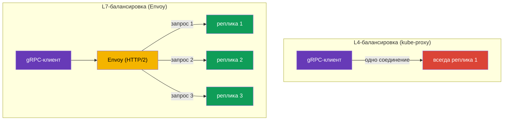

[Eng version](en.md)

# Глава 10. Маршрутизация TCP, gRPC и WebSocket

> **Что дальше.** До сих пор мы работали с HTTP-трафиком. Но не всё общение сервисов
> это HTTP: есть базы данных, брокеры сообщений, свои бинарные протоколы поверх TCP, а
> ещё gRPC и WebSocket. В этой главе разберём, как Istio работает с TCP-трафиком (включая
> практический кейс - выпуск Redis/RabbitMQ во внутреннюю сеть VPC), почему gRPC стоит
> особняком и как быть с долгоживущими WebSocket-соединениями. Отдельному стандарту
> ingress - Kubernetes Gateway API - посвящена следующая глава 11.

## 10.1. Зачем нужна TCP-маршрутизация

HTTP-маршрутизация умеет смотреть внутрь запроса: заголовки, пути, методы. Но если
трафик это, например, PostgreSQL или произвольный TCP-протокол, никаких HTTP-заголовков
там нет. Istio всё равно может им управлять, но на уровне соединений (L4): пробросить
порт, распределить трафик между версиями, направить по SNI для TLS.

## 10.2. Проброс TCP-порта на шлюзе

Сначала на Gateway объявляем TCP-порт (протокол `TCP` вместо `HTTP`):

```yaml
apiVersion: networking.istio.io/v1
kind: Gateway
metadata:
  name: tcp-gateway
spec:
  selector:
    istio: ingressgateway
  servers:
  - port:
      number: 3000
      name: tcp
      protocol: TCP      # не HTTP, а TCP
    hosts:
    - "*"
```

Затем VirtualService направляет этот TCP-трафик на сервис. Обратите внимание: блок
называется `tcp`, а не `http`, и match идёт по порту, а не по заголовкам.

```yaml
apiVersion: networking.istio.io/v1
kind: VirtualService
metadata:
  name: tcp-echo-vs
spec:
  hosts:
  - "*"
  gateways:
  - tcp-gateway
  tcp:                    # именно tcp
  - match:
    - port: 3000
    route:
    - destination:
        host: tcp-echo
        port:
          number: 9000
```


## 10.3. Взвешенная маршрутизация TCP

Как и для HTTP, TCP-трафик можно распределять между версиями по весам. Это полезно для
canary даже для не-HTTP сервисов:

```yaml
  tcp:
  - match:
    - port: 3000
    route:
    - destination:
        host: tcp-echo
        subset: v1
      weight: 80        # 80% соединений на v1
    - destination:
        host: tcp-echo
        subset: v2
      weight: 20        # 20% на v2
```

Отличие от HTTP важно понимать: HTTP-веса распределяют **запросы**, а TCP-веса -
**соединения**. Внутри одного TCP-соединения весь трафик идёт на одну и ту же реплику,
потому что Envoy не разбирает содержимое потока на отдельные запросы. Матчить по
заголовкам, путям и методам для TCP тоже нельзя - только по порту (и по SNI для TLS,
как в PASSTHROUGH из главы 9).

## 10.4. Пример: Redis/RabbitMQ во внутреннюю сеть VPC

Частая задача: в EKS работает Redis (или RabbitMQ), и к нему нужен доступ из других
сервисов в VPC - но **не из интернета**. Это чистый TCP-кейс: Redis и AMQP не HTTP, поэтому
управляем ими на L4, а «дверь» в приватную сеть открываем через **внутренний** ingress
gateway с приватным NLB.

Схема из двух частей:

1. **Внутренний ingress gateway** - отдельный шлюз, чей Service получает NLB со `scheme:
   internal` (адрес резолвится только в приватные IP VPC, из интернета недоступен). Как
   развернуть второй шлюз и повесить на него внутренний NLB - разбирали в [главе 5](../05/ru.md).
2. **Gateway + VirtualService на TCP-порт** этого сервиса, направленные на внутренний шлюз.


Gateway слушает TCP-порт Redis и привязан к внутреннему шлюзу через `selector`:

```yaml
apiVersion: networking.istio.io/v1
kind: Gateway
metadata:
  name: redis-gateway
spec:
  selector:
    istio: ingressgateway-internal   # внутренний шлюз (приватный NLB)
  servers:
  - port:
      number: 6379
      name: tcp-redis
      protocol: TCP
    hosts:
    - "*"
```

VirtualService направляет TCP-порт на сервис Redis (блок `tcp`, match по порту):

```yaml
apiVersion: networking.istio.io/v1
kind: VirtualService
metadata:
  name: redis-vs
spec:
  hosts:
  - "*"
  gateways:
  - redis-gateway
  tcp:
  - match:
    - port: 6379
    route:
    - destination:
        host: redis.data.svc.cluster.local   # Kubernetes Service Redis
        port:
          number: 6379
```

Для RabbitMQ всё то же самое - меняются только порты: `5672` (AMQP) и, при необходимости,
`15672` (management UI, но его обычно не выставляют даже во внутреннюю сеть). Клиенты в VPC
подключаются по DNS-имени внутреннего NLB (`*.elb.amazonaws.com`, резолвится в приватные
IP).

Важные нюансы:

- Это **L4**: маршрутизация только по порту, никаких путей/заголовков; веса распределяют
  соединения (раздел 10.3).
- **Безопасность.** NLB `internal` закрывает доступ из интернета, но внутри VPC порт
  открыт. Ограничьте, кто может подключаться: security group на NLB, `AuthorizationPolicy`
  на стороне mesh и mTLS между сервисами (главы 12–13). Наружу такие сервисы не выставляют.
- Если клиент вне mesh (обычный VM в VPC), трафик от NLB до пода Redis внутри кластера не
  шифруется автоматически - при необходимости используйте TLS самого Redis/RabbitMQ или
  PASSTHROUGH по SNI (глава 9).

## 10.5. WebSocket

WebSocket начинается как обычный HTTP/1.1-запрос с заголовком `Upgrade: websocket`, после
чего соединение «повышается» до постоянного двунаправленного канала. Для Istio это L7-HTTP,
и **специально включать WebSocket не нужно** - Envoy поддерживает upgrade из коробки.
Маршрут описывают обычным блоком `http` в VirtualService (Gateway и Service - как для
любого HTTP-приложения из главы 5).

Главный подводный камень - **таймауты**, как и у gRPC-стриминга. WebSocket-соединение живёт
долго (минуты и часы), а обычный `timeout` в VirtualService оборвёт его по истечении
времени. Поэтому для WebSocket-маршрутов таймаут либо не задают, либо ставят большим -
в примере ниже он снят прямо в маршруте (`timeout: 0s`):

```yaml
apiVersion: networking.istio.io/v1
kind: VirtualService
metadata:
  name: chat-vs
  namespace: apps
spec:
  hosts:
  - chat.example.com          # тот же хост, что в Gateway
  gateways:
  - main-gateway              # имя Gateway с HTTP/HTTPS-портом (глава 5)
  http:
  - match:
    - uri:
        prefix: /ws           # эндпоинт WebSocket
    timeout: 0s               # 0 = без ограничения (для долгоживущих соединений)
    route:
    - destination:
        host: chat-backend    # Kubernetes Service бэкенда
        port:
          number: 8080
```

Ещё пара моментов:

- **Idle timeout.** Долгие простои в соединении может рвать не только Istio, но и NLB
  (у AWS NLB idle timeout, по умолчанию 350с) - для WebSocket настройте на сервере ping/pong
  (heartbeat), чтобы соединение не считалось простаивающим.
- **Session affinity.** Если бэкенд хранит состояние сессии, привяжите клиента к одной
  реплике через consistent hash в DestinationRule (`consistentHash` по cookie или заголовку,
  глава 7) - иначе повторное подключение может уйти на другую реплику.

## 10.6. Особенности gRPC

gRPC часто путают с «просто TCP», но это важная ошибка. gRPC работает **поверх HTTP/2**,
а значит для Istio это HTTP-трафик (L7), а не сырой TCP. Из этого следуют два вывода.

Во-первых, для gRPC доступны все L7-возможности: маршрутизация по заголовкам, ретраи,
таймауты, per-request балансировка, детальные метрики. То есть gRPC вы настраиваете
через блок `http` в VirtualService, как обычный HTTP, а не через `tcp`.

Во-вторых - и это главная причина ставить mesh для gRPC - проблема балансировки.
gRPC держит **одно долгоживущее HTTP/2-соединение** и мультиплексирует в нём множество
запросов. Обычная L4-балансировка (kube-proxy) распределяет трафик по соединениям,
поэтому все запросы клиента «прилипают» к одной реплике, и балансировка фактически не
работает.



Envoy понимает HTTP/2 и балансирует **по отдельным запросам** внутри одного соединения:
каждый gRPC-вызов может уйти на свою реплику. Это одна из самых частых причин, почему
gRPC-сервисы заводят в mesh.

Чтобы Istio правильно распознал протокол, порт сервиса нужно **явно назвать**: имя порта
должно начинаться с `grpc` (например, `grpc-web`) или используйте поле `appProtocol:
grpc`. Если порт назвать нейтрально (`tcp-...`), Istio будет считать трафик обычным TCP
и все L7-возможности пропадут.

```yaml
apiVersion: v1
kind: Service
metadata:
  name: my-grpc-service
spec:
  ports:
  - name: grpc-api        # имя начинается с grpc -> Istio видит HTTP/2
    port: 9000
    appProtocol: grpc     # или явно через appProtocol
```

Запомните правило: **gRPC это HTTP/2, а не TCP**. Настраивайте его как HTTP и не
забывайте правильно называть порт.

## 10.7. gRPC на ingress

Чтобы принять gRPC снаружи через ingress gateway, нужно три ресурса, как и для обычного
HTTP из главы 5, только с оговорками про HTTP/2:

1. **Service** gRPC-приложения - с правильно названным портом, чтобы Istio понял, что это
   HTTP/2 (раздел 10.6).
2. **Gateway** - открывает порт на ingress gateway с протоколом `GRPC` (или `HTTP2`).
3. **VirtualService** - направляет трафик с шлюза на Service; маршрут описывают в блоке
   `http` (не `tcp`!), потому что gRPC для Istio это L7.

**1. Service gRPC-приложения.** Имя порта должно начинаться с `grpc` либо быть задано через
`appProtocol: grpc`, иначе Istio сочтёт трафик обычным TCP:

```yaml
apiVersion: v1
kind: Service
metadata:
  name: grpc-server
  namespace: apps
spec:
  selector:
    app: grpc-server
  ports:
  - name: grpc-api          # имя начинается с grpc -> Istio видит HTTP/2
    port: 9000
    targetPort: 9000
    appProtocol: grpc       # либо явно через appProtocol
```

**2. Gateway.** Порт объявляют с протоколом `GRPC` (или `HTTP2`). Обычный `HTTP` тут не
подойдёт: шлюзу нужно знать, что это HTTP/2, иначе мультиплексирование и per-request
балансировка не заработают. Обычно gRPC выставляют по TLS, поэтому добавляем `tls`
(сертификат в Secret `grpc-cert`, как в главе 9):

```yaml
apiVersion: networking.istio.io/v1
kind: Gateway
metadata:
  name: grpc-gateway
  namespace: apps
spec:
  selector:
    istio: ingressgateway     # к какому ingress gateway применить (глава 5)
  servers:
  - port:
      number: 443
      name: grpc-tls
      protocol: GRPC          # или HTTP2; не просто HTTP
    tls:
      mode: SIMPLE
      credentialName: grpc-cert
    hosts:
    - grpc.example.com
```

**3. VirtualService.** Привязывается к Gateway через `gateways` и направляет трафик на
Service. Маршрут - в блоке `http`; по gRPC-методу можно матчить через `uri.prefix`, потому
что имя метода это HTTP/2 path вида `/<package>.<Service>/<Method>`:

```yaml
apiVersion: networking.istio.io/v1
kind: VirtualService
metadata:
  name: grpc-server-vs
  namespace: apps
spec:
  hosts:
  - grpc.example.com          # тот же хост, что в Gateway
  gateways:
  - grpc-gateway              # имя Gateway из шага 2 (можно namespace/имя)
  http:
  - match:
    - uri:
        prefix: /helloworld.Greeter/   # опционально: маршрут по конкретному gRPC-сервису
    route:
    - destination:
        host: grpc-server     # имя Service из шага 1
        port:
          number: 9000
```

Если разделять по методам не нужно, блок `match` можно опустить - тогда весь gRPC-трафик
хоста пойдёт на `grpc-server`. Клиент подключается к `grpc.example.com:443` по TLS, а
дальше per-request балансировка (раздел 10.6) распределяет вызовы по репликам.

## 10.8. gRPC: ретраи, таймауты и пул соединений

Раз gRPC это HTTP, к нему применимы устойчивость из главы 8, но с нюансами.

**Ретраи по gRPC-статусам.** У gRPC свои коды статуса (не HTTP), и `retryOn` умеет их
понимать - перечисляйте именно gRPC-условия. Настраиваются они в том же VirtualService, что
и маршрут (это тот же `grpc-server-vs` из 10.7, только с блоком `retries`):

```yaml
apiVersion: networking.istio.io/v1
kind: VirtualService
metadata:
  name: grpc-server-vs
  namespace: apps
spec:
  hosts:
  - grpc.example.com
  gateways:
  - grpc-gateway
  http:
  - retries:
      attempts: 3
      perTryTimeout: 2s
      retryOn: unavailable,resource-exhausted,cancelled   # gRPC-статусы
    route:
    - destination:
        host: grpc-server     # тот же Service, что в 10.7
        port:
          number: 9000
```

Полезные значения `retryOn` для gRPC: `cancelled`, `deadline-exceeded`, `internal`,
`resource-exhausted`, `unavailable`. Как и с HTTP (глава 8), ретраить стоит только
идемпотентные вызовы.

**Таймауты и стриминг - осторожно.** Поле `timeout` в VirtualService ограничивает всё
«время запроса». Для unary-вызовов (один запрос - один ответ) это нормально. Но для
**server-streaming / bidi-streaming** RPC, где соединение живёт долго и данные текут
потоком, обычный `timeout` оборвёт стрим по истечении времени. Для стриминговых сервисов
таймаут либо не задают, либо ставят заведомо большим.

**Пул соединений и перебалансировка.** gRPC держит одно долгоживущее HTTP/2-соединение.
Даже с Envoy это создаёт проблему: если вы **масштабировали** сервис (добавили реплики),
старые соединения продолжают висеть на прежних endpoint'ах. Помогают настройки
`connectionPool` в DestinationRule:

```yaml
apiVersion: networking.istio.io/v1
kind: DestinationRule
metadata:
  name: grpc-server-dr
  namespace: apps
spec:
  host: grpc-server           # тот же Service, что в 10.7
  trafficPolicy:
    connectionPool:
      http:
        http2MaxRequests: 1000          # макс. одновременных запросов (для HTTP/2 важно именно это)
        maxRequestsPerConnection: 100   # после N запросов пересоздать соединение -> подхватит новые реплики
```

Для HTTP/2 и gRPC ключевой лимит - `http2MaxRequests` (максимум одновременных запросов),
а не `http1MaxPendingRequests` из HTTP/1.1. А `maxRequestsPerConnection` заставляет Envoy
периодически переоткрывать соединение, чтобы трафик распределялся и на свежедобавленные
реплики.

## 10.9. Сравнение: HTTP, TCP, gRPC

| | HTTP (L7) | TCP (L4) | gRPC (HTTP/2, L7) |
|---|---|---|---|
| Блок в VirtualService | `http` | `tcp` | `http` |
| Match по заголовкам/путям | да | нет | да (метод = path) |
| Match по SNI | - | да (TLS) | - |
| Веса распределяют | запросы | соединения | запросы |
| Ретраи/таймауты | да | нет | да (gRPC-статусы) |
| Балансировка | per-request | per-connection | per-request |
| Имя порта | `http` | `tcp` | `grpc` / `appProtocol: grpc` |

WebSocket в этой таблице - это столбец HTTP (L7): маршрутизируется как HTTP через блок
`http`, upgrade Istio поддерживает из коробки, но соединение долгоживущее (см. 10.5).

## 10.10. Best practices

- **Правильно называйте порты.** `grpc...` или `appProtocol: grpc` для gRPC, `http...` для
  HTTP, `tcp...` для сырого TCP. Ошибка в имени порта = потеря L7-возможностей (для gRPC это
  особенно больно - ломается балансировка).
- **На ingress для gRPC - протокол `GRPC`/`HTTP2`**, а не `HTTP`.
- **Ретраи для gRPC - по gRPC-статусам** (`unavailable`, `resource-exhausted` и т.д.) и
  только для идемпотентных вызовов.
- **Не ставьте обычный `timeout` на стриминговые RPC** - он оборвёт долгоживущий поток.
- **Для gRPC настраивайте `http2MaxRequests` и `maxRequestsPerConnection`**, чтобы
  соединения перебалансировались на новые реплики после масштабирования.
- **TCP - только для того, что реально не HTTP** (БД, брокеры, свои бинарные протоколы). Всё,
  что умеет HTTP/2, ведите как HTTP/gRPC ради L7-возможностей.
- **Не выставляйте БД и брокеры в интернет.** Redis/RabbitMQ выпускают только во внутреннюю
  сеть - через внутренний ingress gateway с NLB `scheme: internal`, плюс security group,
  `AuthorizationPolicy` и mTLS.
- **Для WebSocket и стриминга снимайте `timeout`** (`0s` или большое значение) и настраивайте
  heartbeat, чтобы соединение не рвалось по idle-таймауту (в т.ч. на NLB).

## 10.11. Итоги главы

- Istio управляет не только HTTP, но и TCP-трафиком - на уровне соединений (L4).
- Для TCP на Gateway объявляют порт с `protocol: TCP`, а в VirtualService используют
  блок `tcp` с match по порту.
- TCP-веса распределяют соединения (не запросы); матчить по заголовкам и путям нельзя,
  только по порту и SNI.
- **gRPC это HTTP/2, а не TCP**: настраивается как HTTP, получает все L7-возможности и,
  главное, per-request балансировку (L4 балансировал бы всё в одну реплику). Порт надо
  называть `grpc...` или задавать `appProtocol: grpc`.
- На **ingress для gRPC** порт Gateway объявляют с протоколом `GRPC`/`HTTP2`; маршрут - в
  блоке `http`, по gRPC-методу можно матчить через `uri.prefix`.
- Устойчивость для gRPC: ретраи по **gRPC-статусам** (`unavailable`, `resource-exhausted`…),
  осторожно с `timeout` на **стриминге**, а `http2MaxRequests` и `maxRequestsPerConnection`
  в `connectionPool` помогают перебалансировать долгоживущие соединения.
- **Redis/RabbitMQ во внутреннюю сеть VPC** выпускают как TCP через внутренний ingress
  gateway с приватным NLB (`scheme: internal`); наружу их не выставляют, доступ ограничивают
  SG/AuthorizationPolicy/mTLS.
- **WebSocket** это L7-HTTP (upgrade поддержан из коробки); главное - снять `timeout` для
  долгоживущего соединения и настроить heartbeat против idle-таймаутов.

## 10.12. Вопросы для самопроверки

1. Чем маршрутизация TCP отличается от HTTP? Что нельзя матчить в TCP?
2. Веса в TCP-маршрутизации распределяют запросы или соединения? Почему?
3. Почему gRPC в Istio настраивают как HTTP, а не как TCP?
4. Как правильно назвать порт, чтобы Istio распознал gRPC?
5. Почему без mesh страдает балансировка gRPC?
6. Какой протокол указывают на Gateway, чтобы принять gRPC снаружи, и почему не `HTTP`?
7. Чем ретраи для gRPC отличаются от HTTP? Почему опасно ставить `timeout` на стриминговый
   RPC?
8. Зачем для gRPC настраивают `maxRequestsPerConnection`?
9. Как выпустить Redis или RabbitMQ из EKS только во внутреннюю сеть VPC, но не в интернет?
10. Нужно ли специально включать WebSocket в Istio? Какой главный подводный камень с
    WebSocket-соединениями и как его обойти?

## Практика

Отработайте маршрутизацию сырого TCP-трафика (взвешенное распределение по соединениям):

🧪 Лаба 28: [tasks/ica/labs/28](../../labs/28/README_RU.MD)

Отработайте gRPC на практике - именно то, что в тексте не проверить на словах:

- per-request балансировку gRPC: один клиент, несколько реплик, запросы реально
  расходятся по разным подам (в отличие от L4, где всё липнет к одной реплике);
- правильное именование порта (`grpc` / `appProtocol: grpc`) и что ломается без него;
- ретраи и таймауты для gRPC как для HTTP.

🧪 Лаба 32: [tasks/ica/labs/32](../../labs/32/README_RU.MD)

---
[Оглавление](../README.md) · [Глава 9](../09/ru.md) · [Глава 11](../11/ru.md)
