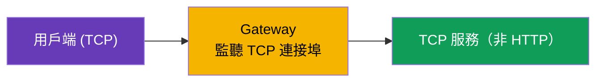
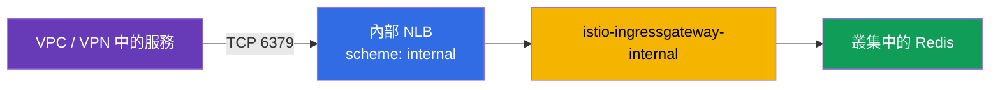
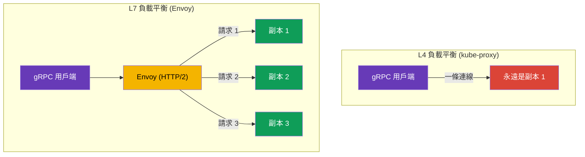

[Русская версия](ru.md) · [Eng version](en.md) · [Versión en español](es.md) · [Version française](fr.md) · [Deutsche Version](de.md) · [ქართული ვერსია](ge.md) · [日本語版](jp.md)

# 第 10 章。TCP、gRPC 與 WebSocket 路由

> **接下來。** 到目前為止，我們一直處理 HTTP 流量。但服務之間的通訊並不全都是 HTTP：還有資料庫、訊息代理、基於 TCP 的自訂二進位協定，以及 gRPC 和 WebSocket。本章將說明 Istio 如何處理 TCP 流量（包括將 Redis/RabbitMQ 發布至內部 VPC 網路的實務案例）、為何 gRPC 是特殊情況，以及如何處理長時間存活的 WebSocket 連線。下一章第 11 章將介紹另一項 ingress 標準：Kubernetes Gateway API。

## 10.1. 為何需要 TCP 路由

HTTP 路由能查看請求內部：標頭、路徑、方法。但若流量是 PostgreSQL 或任意 TCP 協定，其中沒有任何 HTTP 標頭。Istio 仍可管理它，但會在連線層級（L4）進行：轉送連接埠、在版本間分配流量、依 TLS 的 SNI 路由。

## 10.2. 在閘道上轉送 TCP 連接埠

首先，在 Gateway 上宣告 TCP 連接埠（使用協定 `TCP` 而非 `HTTP`）：

```yaml
apiVersion: networking.istio.io/v1
kind: Gateway
metadata:
  name: tcp-gateway
spec:
  selector:
    istio: ingressgateway
  servers:
  - port:
      number: 3000
      name: tcp
      protocol: TCP      # 不是 HTTP，而是 TCP
    hosts:
    - "*"
```

接著，VirtualService 將此 TCP 流量導向服務。請注意：區塊名稱是 `tcp`，不是 `http`，而 match 依連接埠而非標頭進行。

```yaml
apiVersion: networking.istio.io/v1
kind: VirtualService
metadata:
  name: tcp-echo-vs
spec:
  hosts:
  - "*"
  gateways:
  - tcp-gateway
  tcp:                    # 就是 tcp
  - match:
    - port: 3000
    route:
    - destination:
        host: tcp-echo
        port:
          number: 9000
```



## 10.3. TCP 加權路由

與 HTTP 相同，TCP 流量也可按權重在版本間分配。即使對非 HTTP 服務，這也適用於 canary：

```yaml
  tcp:
  - match:
    - port: 3000
    route:
    - destination:
        host: tcp-echo
        subset: v1
      weight: 80        # 80% 的連線導向 v1
    - destination:
        host: tcp-echo
        subset: v2
      weight: 20        # 20% 導向 v2
```

必須理解它與 HTTP 的差異：HTTP 權重分配的是**請求**，而 TCP 權重分配的是**連線**。在同一個 TCP 連線中，所有流量都會前往同一個副本，因為 Envoy 不會將串流內容剖析為獨立請求。TCP 也無法依標頭、路徑和方法進行 match，只能依連接埠（以及 TLS 的 SNI，如第 9 章的 PASSTHROUGH）進行。

## 10.4. 範例：將 Redis/RabbitMQ 發布至內部 VPC 網路

常見任務：EKS 中執行 Redis（或 RabbitMQ），而 VPC 中的其他服務需要存取它，但**不能從網際網路存取**。這是純 TCP 情境：Redis 和 AMQP 都不是 HTTP，因此我們在 L4 管理它們，而通往私有網路的「門」則透過具有私有 NLB 的**內部** ingress gateway 開啟。

此架構有兩部分：

1. **內部 ingress gateway**：獨立的閘道，其 Service 取得帶有 `scheme:
   internal` 的 NLB（位址僅解析為私有 VPC IP，無法從網際網路存取）。如何部署第二個閘道並為其掛載內部 NLB，已在[第 5 章](../05/tw.md)說明。
2. 此服務 TCP 連接埠的 **Gateway + VirtualService**，並導向內部閘道。



Gateway 監聽 Redis 的 TCP 連接埠，並透過 `selector` 綁定至內部閘道：

```yaml
apiVersion: networking.istio.io/v1
kind: Gateway
metadata:
  name: redis-gateway
spec:
  selector:
    istio: ingressgateway-internal   # 內部 gateway（私有 NLB）
  servers:
  - port:
      number: 6379
      name: tcp-redis
      protocol: TCP
    hosts:
    - "*"
```

VirtualService 將 TCP 連接埠導向 Redis 服務（`tcp` 區塊，按連接埠 match）：

```yaml
apiVersion: networking.istio.io/v1
kind: VirtualService
metadata:
  name: redis-vs
spec:
  hosts:
  - "*"
  gateways:
  - redis-gateway
  tcp:
  - match:
    - port: 6379
    route:
    - destination:
        host: redis.data.svc.cluster.local   # Kubernetes Service Redis
        port:
          number: 6379
```

對 RabbitMQ 亦完全相同，僅連接埠不同：`5672`（AMQP），以及視需要使用的 `15672`（management UI，但通常即使在內部網路中也不會發布）。VPC 中的用戶端透過內部 NLB 的 DNS 名稱（`*.elb.amazonaws.com`，解析為私有 IP）連線。

重要細節：

- 這是 **L4**：僅能按連接埠路由，沒有路徑／標頭；權重分配連線（第 10.3 節）。
- **安全性。** NLB `internal` 會阻擋來自網際網路的存取，但在 VPC 內連接埠仍開放。請限制可連線的對象：NLB 的 security group、mesh 端的 `AuthorizationPolicy`，以及服務之間的 mTLS（第 12–13 章）。此類服務不可對外發布。
- 若用戶端在 mesh 外部（VPC 中的一般 VM），從 NLB 到叢集內 Redis Pod 的流量不會自動加密；如有需要，請使用 Redis/RabbitMQ 本身的 TLS，或使用 SNI 的 PASSTHROUGH（第 9 章）。

## 10.5. WebSocket

WebSocket 以帶有 `Upgrade: websocket` 標頭的一般 HTTP/1.1 請求開始，之後連線會「升級」為持久的雙向通道。對 Istio 而言，這是 L7 HTTP，且**不需要專門啟用 WebSocket**：Envoy 開箱即支援 upgrade。路由以 VirtualService 中一般的 `http` 區塊描述（Gateway 和 Service 與第 5 章中任一 HTTP 應用程式相同）。

主要陷阱是**逾時**，這與 gRPC 串流相同。WebSocket 連線會存活很久（數分鐘甚至數小時），而 VirtualService 中一般的 `timeout` 會在時間到期時中斷它。因此，WebSocket 路由要麼不設定逾時，要麼設為很長；下例直接在路由中將其移除（`timeout: 0s`）：

```yaml
apiVersion: networking.istio.io/v1
kind: VirtualService
metadata:
  name: chat-vs
  namespace: apps
spec:
  hosts:
  - chat.example.com          # 與 Gateway 中相同的主機
  gateways:
  - main-gateway              # 具 HTTP/HTTPS 連接埠的 Gateway 名稱（第 5 章）
  http:
  - match:
    - uri:
        prefix: /ws           # WebSocket endpoint
    timeout: 0s               # 0 = 無限制（用於長時間連線）
    route:
    - destination:
        host: chat-backend    # 後端的 Kubernetes Service
        port:
          number: 8080
```

另有幾點：

- **Idle timeout。** 長時間閒置的連線不僅可能被 Istio 中斷，也可能被 NLB 中斷（AWS NLB idle timeout 預設為 350 秒）。對 WebSocket，請在伺服器設定 ping/pong（heartbeat），以免連線被視為閒置。
- **Session affinity。** 若後端保存 session 狀態，請透過 DestinationRule 中的 consistent hash（依 cookie 或標頭的 `consistentHash`，第 7 章）將用戶端固定到單一副本；否則重新連線可能會前往另一個副本。

## 10.6. gRPC 的特性

gRPC 常被誤認為「只是 TCP」，但這是重要的錯誤。gRPC 運作於 **HTTP/2 之上**，因此對 Istio 而言是 HTTP 流量（L7），而非原始 TCP。這帶來兩個結論。

首先，gRPC 可使用所有 L7 功能：依標頭路由、重試、逾時、per-request 負載平衡、詳細指標。也就是說，gRPC 要透過 VirtualService 的 `http` 區塊設定，如同一般 HTTP，而非使用 `tcp`。

其次，也是為 gRPC 使用 mesh 的主要理由，是負載平衡問題。gRPC 維持**一條長時間存活的 HTTP/2 連線**，並在其中多工處理大量請求。一般 L4 負載平衡（kube-proxy）按連線分配流量，因此用戶端所有請求會「黏」在同一副本上，負載平衡實際上不會運作。



Envoy 理解 HTTP/2，並在同一連線內**按各個請求**進行負載平衡：每個 gRPC 呼叫可前往不同副本。這是 gRPC 服務常被置入 mesh 的主要原因之一。

為讓 Istio 正確識別協定，服務連接埠必須**明確命名**：連接埠名稱必須以 `grpc` 開頭（例如 `grpc-web`），或使用欄位 `appProtocol: grpc`。若連接埠使用中性名稱（`tcp-...`），Istio 會將流量視為一般 TCP，所有 L7 功能都會消失。

```yaml
apiVersion: v1
kind: Service
metadata:
  name: my-grpc-service
spec:
  ports:
  - name: grpc-api        # 名稱以 grpc 開頭 -> Istio 識別為 HTTP/2
    port: 9000
    appProtocol: grpc     # 或透過 appProtocol 明確指定
```

請記住規則：**gRPC 是 HTTP/2，不是 TCP**。將它設定為 HTTP，且不要忘記正確命名連接埠。

## 10.7. ingress 上的 gRPC

若要經由 ingress gateway 從外部接收 gRPC，與第 5 章中的一般 HTTP 相同，需要三個資源，但要注意 HTTP/2 的細節：

1. **Service** gRPC 應用程式：具有正確命名的連接埠，以便 Istio 知道這是 HTTP/2（第 10.6 節）。
2. **Gateway**：以協定 `GRPC`（或 `HTTP2`）在 ingress gateway 上開放連接埠。
3. **VirtualService**：將流量從閘道導向 Service；路由以 `http` 區塊描述（不是 `tcp`！），因為 gRPC 對 Istio 而言是 L7。

**1. Service gRPC 應用程式。** 連接埠名稱須以 `grpc` 開頭，或透過 `appProtocol: grpc` 指定；否則 Istio 會將流量視為一般 TCP：

```yaml
apiVersion: v1
kind: Service
metadata:
  name: grpc-server
  namespace: apps
spec:
  selector:
    app: grpc-server
  ports:
  - name: grpc-api          # 名稱以 grpc 開頭 -> Istio 識別為 HTTP/2
    port: 9000
    targetPort: 9000
    appProtocol: grpc       # 或透過 appProtocol 明確指定
```

**2. Gateway。** 使用協定 `GRPC`（或 `HTTP2`）宣告連接埠。一般的 `HTTP` 不適用：閘道必須知道這是 HTTP/2，否則多工與 per-request 負載平衡不會運作。通常以 TLS 發布 gRPC，因此加入 `tls`（憑證位於 Secret `grpc-cert`，如第 9 章）：

```yaml
apiVersion: networking.istio.io/v1
kind: Gateway
metadata:
  name: grpc-gateway
  namespace: apps
spec:
  selector:
    istio: ingressgateway     # 套用至哪個 ingress gateway（第 5 章）
  servers:
  - port:
      number: 443
      name: grpc-tls
      protocol: GRPC          # 或 HTTP2；不是單純的 HTTP
    tls:
      mode: SIMPLE
      credentialName: grpc-cert
    hosts:
    - grpc.example.com
```

**3. VirtualService。** 透過 `gateways` 綁定到 Gateway，並將流量導向 Service。路由位於 `http` 區塊中；可透過 `uri.prefix` 依 gRPC 方法 match，因為方法名稱是形式為 `/<package>.<Service>/<Method>` 的 HTTP/2 path：

```yaml
apiVersion: networking.istio.io/v1
kind: VirtualService
metadata:
  name: grpc-server-vs
  namespace: apps
spec:
  hosts:
  - grpc.example.com          # 與 Gateway 中相同的主機
  gateways:
  - grpc-gateway              # 步驟 2 的 Gateway 名稱（可用 namespace/名稱）
  http:
  - match:
    - uri:
        prefix: /helloworld.Greeter/   # 選用：依特定 gRPC 服務路由
    route:
    - destination:
        host: grpc-server     # 步驟 1 的 Service 名稱
        port:
          number: 9000
```

若無須依方法分流，可省略 `match` 區塊，則此主機的所有 gRPC 流量都會前往 `grpc-server`。用戶端透過 TLS 連至 `grpc.example.com:443`，之後 per-request 負載平衡（第 10.6 節）將呼叫分配給各副本。

## 10.8. gRPC：重試、逾時與連線集區

既然 gRPC 是 HTTP，第 8 章的韌性設定也適用於它，但有一些細節。

**依 gRPC 狀態重試。** gRPC 有自己的狀態碼（不是 HTTP），而 `retryOn` 能理解它們，請列出 gRPC 條件本身。它們設定在與路由相同的 VirtualService 中（即第 10.7 節的 `grpc-server-vs`，僅加入 `retries` 區塊）：

```yaml
apiVersion: networking.istio.io/v1
kind: VirtualService
metadata:
  name: grpc-server-vs
  namespace: apps
spec:
  hosts:
  - grpc.example.com
  gateways:
  - grpc-gateway
  http:
  - retries:
      attempts: 3
      perTryTimeout: 2s
      retryOn: unavailable,resource-exhausted,cancelled   # gRPC 狀態
    route:
    - destination:
        host: grpc-server     # 與 10.7 中相同的 Service
        port:
          number: 9000
```

適合 gRPC 的 `retryOn` 值包括：`cancelled`、`deadline-exceeded`、`internal`、`resource-exhausted`、`unavailable`。與 HTTP（第 8 章）相同，僅應對冪等呼叫進行重試。

**逾時與串流：請謹慎。** VirtualService 中的 `timeout` 欄位會限制整個「請求時間」。對 unary 呼叫（一次請求，一次回應）這沒有問題。但對**server-streaming / bidi-streaming** RPC，連線會存活很久且資料持續串流，一般 `timeout` 會在到期時中斷串流。對串流服務，要麼不設定逾時，要麼設得明確夠長。

**連線集區與重新平衡。** gRPC 維持一條長時間存活的 HTTP/2 連線。即使使用 Envoy，這也會產生問題：若您**擴展**服務（增加副本），舊連線仍會掛在原有 endpoint 上。DestinationRule 中的 `connectionPool` 設定可幫助解決：

```yaml
apiVersion: networking.istio.io/v1
kind: DestinationRule
metadata:
  name: grpc-server-dr
  namespace: apps
spec:
  host: grpc-server           # 與 10.7 中相同的 Service
  trafficPolicy:
    connectionPool:
      http:
        http2MaxRequests: 1000          # 同時請求的上限（對 HTTP/2 而言這點很重要）
        maxRequestsPerConnection: 100   # 在 N 個請求後重建連線 -> 便會接手新複本
```

對 HTTP/2 和 gRPC，關鍵限制是 `http2MaxRequests`（同時請求數上限），而不是 HTTP/1.1 的 `http1MaxPendingRequests`。而 `maxRequestsPerConnection` 會要求 Envoy 定期重新開啟連線，使流量也能分配到新加入的副本。

## 10.9. 比較：HTTP、TCP、gRPC

| | HTTP (L7) | TCP (L4) | gRPC (HTTP/2, L7) |
|---|---|---|---|
| VirtualService 中的區塊 | `http` | `tcp` | `http` |
| 依標頭／路徑 Match | 是 | 否 | 是（方法 = path） |
| 依 SNI Match | - | 是（TLS） | - |
| 權重分配 | 請求 | 連線 | 請求 |
| 重試／逾時 | 是 | 否 | 是（gRPC 狀態） |
| 負載平衡 | per-request | per-connection | per-request |
| 連接埠名稱 | `http` | `tcp` | `grpc` / `appProtocol: grpc` |

此表中的 WebSocket 是 HTTP（L7）欄：透過 `http` 區塊如 HTTP 一樣路由，Istio 開箱即支援 upgrade，但其連線存活很久（見第 10.5 節）。

## 10.10. 最佳實務

- **正確命名連接埠。** gRPC 使用 `grpc...` 或 `appProtocol: grpc`，HTTP 使用 `http...`，原始 TCP 使用 `tcp...`。連接埠名稱錯誤 = 失去 L7 功能（對 gRPC 尤其嚴重，會使負載平衡失效）。
- **gRPC 的 ingress 使用協定 `GRPC`/`HTTP2`**，而非 `HTTP`。
- **gRPC 重試依 gRPC 狀態進行**（`unavailable`、`resource-exhausted` 等），且僅限冪等呼叫。
- **請勿對串流 RPC 設定一般 `timeout`**，否則會中斷長時間存活的串流。
- **對 gRPC 設定 `http2MaxRequests` 與 `maxRequestsPerConnection`**，使擴展後連線能重新平衡至新副本。
- **TCP 僅用於真正非 HTTP 的項目**（資料庫、代理、自訂二進位協定）。凡支援 HTTP/2 的流量，應視為 HTTP/gRPC 處理，以取得 L7 功能。
- **不要將資料庫與代理發布至網際網路。** Redis/RabbitMQ 僅發布到內部網路：透過具有 NLB `scheme: internal` 的內部 ingress gateway，加上 security group、`AuthorizationPolicy` 與 mTLS。
- **對 WebSocket 與串流移除 `timeout`**（`0s` 或較大值），並設定 heartbeat，以免連線因 idle timeout 而中斷（也包括 NLB）。

## 10.11. 本章總結

- Istio 不僅管理 HTTP，也在連線層級（L4）管理 TCP 流量。
- 對 TCP，在 Gateway 上以 `protocol: TCP` 宣告連接埠，並在 VirtualService 中使用按連接埠 match 的 `tcp` 區塊。
- TCP 權重分配連線（而非請求）；無法依標頭和路徑 match，只能依連接埠與 SNI。
- **gRPC 是 HTTP/2，不是 TCP**：它像 HTTP 一樣設定，獲得所有 L7 功能，最重要的是 per-request 負載平衡（L4 會將所有流量平衡到一個副本）。連接埠必須命名為 `grpc...` 或設定 `appProtocol: grpc`。
- 在 **gRPC ingress** 上，Gateway 連接埠使用協定 `GRPC`/`HTTP2`；路由位於 `http` 區塊，可透過 `uri.prefix` 依 gRPC 方法 match。
- gRPC 的韌性：依 **gRPC 狀態**重試（`unavailable`、`resource-exhausted`…），對**串流**的 `timeout` 謹慎處理，並透過 `connectionPool` 中的 `http2MaxRequests` 與 `maxRequestsPerConnection` 協助長連線重新平衡。
- **將 Redis/RabbitMQ 發布至內部 VPC 網路**時，應作為 TCP 經由具有私有 NLB（`scheme: internal`）的內部 ingress gateway；不可對外發布，並應以 SG/AuthorizationPolicy/mTLS 限制存取。
- **WebSocket** 是 L7 HTTP（開箱即支援 upgrade）；重點是移除長連線的 `timeout`，並設定 heartbeat 以避免 idle timeout。

## 10.12. 自我檢核問題

1. TCP 路由與 HTTP 有何不同？TCP 中無法 match 什麼？
2. TCP 路由中的權重分配請求還是連線？為什麼？
3. 為何 Istio 中的 gRPC 要如 HTTP 而非 TCP 一樣設定？
4. 應如何正確命名連接埠，讓 Istio 辨識 gRPC？
5. 為何沒有 mesh 時，gRPC 的負載平衡會受影響？
6. 若要從外部接收 gRPC，Gateway 應指定何種協定？為何不是 `HTTP`？
7. gRPC 重試與 HTTP 有何差異？為何對串流 RPC 設定 `timeout` 很危險？
8. 為何要為 gRPC 設定 `maxRequestsPerConnection`？
9. 如何僅將 EKS 中的 Redis 或 RabbitMQ 發布至內部 VPC 網路，而非網際網路？
10. 是否需要在 Istio 中專門啟用 WebSocket？WebSocket 連線的主要陷阱是什麼，以及如何避免？

## 實作練習

練習原始 TCP 流量路由（依連線進行加權分配）：

🧪 實驗 28：[tasks/ica/labs/28](../../labs/28/README_TW.MD)

實際練習 gRPC，亦即無法僅靠文字驗證的內容：

- gRPC 的 per-request 負載平衡：一個用戶端、數個副本，請求實際分散到不同 Pod（相對於所有流量都黏在單一副本的 L4）；
- 正確的連接埠命名（`grpc` / `appProtocol: grpc`）及未命名時會發生什麼；
- 將 gRPC 視為 HTTP 設定重試與逾時。

🧪 實驗 32：[tasks/ica/labs/32](../../labs/32/README_TW.MD)

---
[目錄](../README_TW.md) · [第 9 章](../09/tw.md) · [第 11 章](../11/tw.md)
