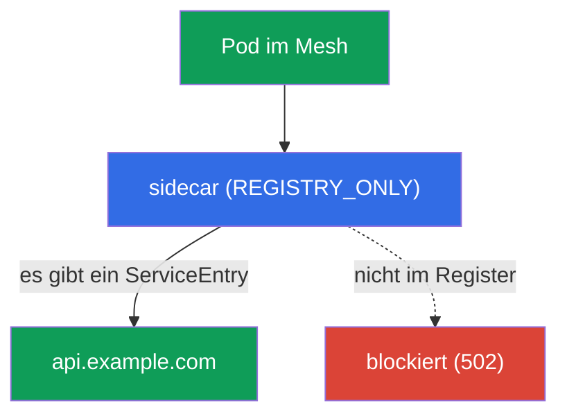
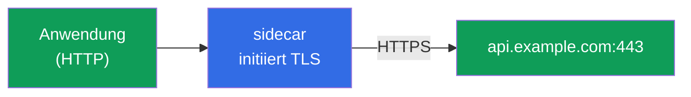
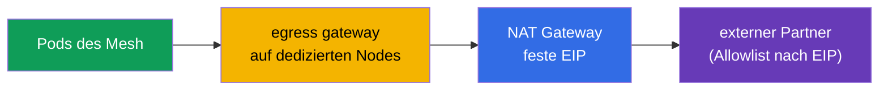

[RU version](ru.md) · [Eng version](en.md) · [Versión en español](es.md) · [Version française](fr.md)

# Kapitel 12. Egress: ServiceEntry, Egress Gateway, TLS-Origination

> **Was kommt als Nächstes.** Bisher haben wir den Traffic gesteuert, der in das Mesh
> kommt und darin verläuft. Jetzt betrachten wir den Traffic, der nach **außen** geht - zu
> externen APIs, Datenbanken, Drittanbieter-Services. Standardmäßig lässt Istio Traffic
> überallhin nach außen, und das ist ein Sicherheitsproblem. In diesem Kapitel lernen wir,
> Egress zu kontrollieren: externe Services zu registrieren, sie durch einen einzigen
> Ausgangspunkt zu leiten und alles Überflüssige zu verbieten.

## 12.1. Das Problem: standardmäßig darf man nach außen alles

Standardmäßig hat Istio die Egress-Policy `ALLOW_ANY` - jeder Pod kann sich an jede Adresse
im Internet wenden. Für die Entwicklung ist das bequem, aber aus Sicht der Sicherheit
schlecht: Ist ein Pod kompromittiert, kann er Daten an jede beliebige externe Adresse
„abfließen" lassen, und Sie bemerken es nicht einmal.

Kontrollierter Egress löst drei Aufgaben:

- **wissen**, an welche externen Services sich das Mesh überhaupt wendet (`ServiceEntry`);
- externen Traffic durch einen einzigen Punkt **leiten** für Audit und Filterung (Egress
  Gateway);
- alles **verbieten**, was nicht ausdrücklich erlaubt ist (`REGISTRY_ONLY` + `Sidecar`).

## 12.2. ServiceEntry: einen externen Service registrieren

Istio führt ein internes Service-Register. Cluster-interne Services gelangen dorthin
automatisch aus Kubernetes, aber über externe (zum Beispiel `api.example.com`) weiß Istio
nichts. `ServiceEntry` fügt einen externen Host in dieses Register hinzu.

```yaml
apiVersion: networking.istio.io/v1
kind: ServiceEntry
metadata:
  name: external-api
spec:
  hosts:
  - api.example.com
  ports:
  - number: 443
    name: https
    protocol: TLS
  resolution: DNS          # den Namen über DNS auflösen
  location: MESH_EXTERNAL  # Service außerhalb des Mesh
```

Betrachten wir die Felder:

- **`hosts`** - der externe DNS-Name, den wir registrieren.
- **`ports`** - Port und Protokoll des externen Service.
- **`resolution: DNS`** - Envoy löst den Namen selbst über DNS auf (es gibt auch `STATIC`
  für feste IPs).
- **`location: MESH_EXTERNAL`** - der Service ist außerhalb des Mesh, mTLS wird auf ihn
  nicht angewendet.

Zu `resolution` ausführlicher:

- **`DNS`** - Envoy löst `hosts` selbst über DNS auf (passt für gewöhnliche externe APIs
  nach Domainnamen).
- **`STATIC`** - Sie geben konkrete IPs im Block `endpoints` an (zum Beispiel eine externe
  DB nach festen Adressen):

  ```yaml
  spec:
    hosts:
    - db.external
    ports:
    - number: 5432
      name: tcp-postgres
      protocol: TCP
    resolution: STATIC
    location: MESH_EXTERNAL
    endpoints:
    - address: 10.0.50.10      # konkrete IP des externen Service
    - address: 10.0.50.11
  ```

- **`NONE`** - ohne Auflösung, der Traffic läuft nach Destination-IP wie er ist (für Fälle,
  in denen die Adresse im Voraus unbekannt ist).

Noch ein paar nützliche Felder:

- **Wildcard-Host.** In `hosts` kann man `*.example.com` angeben, um mit einem einzigen
  ServiceEntry alle Subdomains abzudecken.
- **`exportTo`** - in welchen Namespaces dieses ServiceEntry sichtbar ist (`.` - nur der
  eigene, `*` - alle). Nützlich, damit die Erlaubnis für einen externen Service nicht auf
  den gesamten Cluster wirkt, sondern gezielt.

Wozu das nötig ist: Ohne `ServiceEntry` kann man einen externen Service weder über ein
Egress Gateway routen noch im strikten Modus `REGISTRY_ONLY` erlauben. Das ist der erste
Baustein der Egress-Kontrolle.

### Wildcard-Hosts: Feinheiten und Egress Gateway

Ein Wildcard in `hosts` (`*.example.com`) ist bequem, um mit einem einzigen `ServiceEntry`
ein Bündel von Subdomains abzudecken, aber er hat eine wichtige Einschränkung: **Ein
Wildcard kann man nicht direkt per DNS auflösen** - einen DNS-Eintrag `*.example.com` gibt
es nicht, und Envoy weiß nicht, wohin es die Pakete senden soll. Deshalb hängt das
Verhalten davon ab, wie die Subdomains in der Realität „landen":

- **Alle Subdomains hinter einem gemeinsamen Satz von Adressen** (ein typisches Beispiel -
  `*.wikipedia.org`, wo alles ein Serverpool bedient). Dann setzt man `resolution: DNS` und
  einen **expliziten** Endpoint, wohin tatsächlich zu gehen ist:

  ```yaml
  apiVersion: networking.istio.io/v1
  kind: ServiceEntry
  metadata:
    name: wikipedia
    namespace: app
  spec:
    hosts:
    - "*.wikipedia.org"
    ports:
    - number: 443
      name: https
      protocol: TLS
    resolution: DNS
    endpoints:
    - address: www.wikipedia.org    # gemeinsame Adresse, in die alle Subdomains aufgelöst werden
  ```

- **Beliebige, unabhängige Subdomains** (jede wird in ihre eigene Adresse aufgelöst). Hier
  hilft DNS nicht - man verwendet `resolution: NONE` (Envoy lässt den Traffic nach
  SNI/Destination-IP durch, ohne etwas aufzulösen):

  ```yaml
  spec:
    hosts:
    - "*.example.com"
    ports:
    - number: 443
      name: tls
      protocol: TLS
    resolution: NONE               # ohne Auflösung, Routing nach SNI/IP wie es ist
    location: MESH_EXTERNAL
  ```

Einschränkungen, über die man stolpert:

- **Ein nacktes `*` gibt man nicht an** - es braucht ein Domain-Suffix (`*.example.com`),
  sonst bedeutet es „überallhin nach außen lassen", was dem Sinn von `REGISTRY_ONLY`
  widerspricht.
- Ein Wildcard funktioniert nur für die oberste Ebene der Subdomains: `*.example.com`
  matcht `a.example.com`, aber nicht `a.b.example.com`.

Über ein **Egress Gateway** lässt man ein Wildcard per Routing nach SNI (`tls` im Modus
`PASSTHROUGH`) durch und nicht nach exaktem Host - in `sniHosts` und `hosts` des Gateways
gibt man das Wildcard selbst an. Das Schema ist dasselbe mit vier Ressourcen wie in 12.4,
es ändern sich nur die Hosts:

```yaml
apiVersion: networking.istio.io/v1
kind: Gateway
metadata:
  name: istio-egressgateway
  namespace: istio-system
spec:
  selector:
    istio: egressgateway
  servers:
  - port:
      number: 443
      name: tls
      protocol: TLS
    hosts:
    - "*.example.com"             # Wildcard direkt am Listener des Gateways
    tls:
      mode: PASSTHROUGH
---
apiVersion: networking.istio.io/v1
kind: VirtualService
metadata:
  name: wildcard-via-egress
  namespace: istio-system
spec:
  hosts:
  - "*.example.com"
  gateways:
  - mesh
  - istio-egressgateway
  tls:
  - match:
    - gateways: [mesh]
      sniHosts: ["*.example.com"]          # SNI-Match nach Wildcard, nicht nach exaktem Host
    route:
    - destination:
        host: istio-egressgateway.istio-system.svc.cluster.local
        subset: api-egress
        port:
          number: 443
  - match:
    - gateways: [istio-egressgateway]
      sniHosts: ["*.example.com"]
    route:
    - destination:
        host: "*.example.com"              # nach außen lassen nach SNI
        port:
          number: 443
```

> **Prüfe die Funktion.** Eine erlaubte Subdomain muss durchkommen, und ein Host außerhalb
> des Wildcard muss an `REGISTRY_ONLY` scheitern:
>
> ```bash
> kubectl exec deploy/sleep -n app -- curl -sS -o /dev/null -w "%{http_code}\n" \
>   https://a.example.com          # erwartet 200 (im Register per Wildcard)
> kubectl exec deploy/sleep -n app -- curl -sS -o /dev/null -w "%{http_code}\n" \
>   https://api.other.com          # erwartet Fehler/502 (nicht im Register)
> ```

Der praktische Rat bleibt derselbe: Ein Wildcard ist ein Kompromiss zwischen Bequemlichkeit
und Genauigkeit der Kontrolle. Je breiter das `*`, desto weniger wissen Sie, wohin das Mesh
tatsächlich geht, deshalb bevorzugt man in Prod exakte Hosts und nimmt ein Wildcard bewusst
(zum Beispiel für ein CDN oder einen Cloud-Service mit unvorhersehbaren Subdomains).

### DNS Proxying: Auflösung durch Istio

Standardmäßig gehen die DNS-Anfragen der Anwendung an kube-DNS (CoreDNS), und Istio rührt
sie nicht an. Das hat Einschränkungen: Die Anwendung kann Hosts aus `ServiceEntry` ohne
echte DNS-Einträge nicht auflösen (besonders mit `resolution: STATIC`/`NONE`), und für jede
externe Anfrage geht eine Abfrage an CoreDNS.

Istio kann einen **DNS Proxy** aufsetzen: istio-agent direkt im Pod antwortet auf
DNS-Anfragen, da er das Register des Mesh kennt (Services des Clusters und Hosts aus
`ServiceEntry`). Aktiviert wird das über MeshConfig:

```yaml
meshConfig:
  defaultConfig:
    proxyMetadata:
      ISTIO_META_DNS_CAPTURE: "true"        # DNS in der Data Plane abfangen
      ISTIO_META_DNS_AUTO_ALLOCATE: "true"  # ServiceEntry-Hosts ohne Adressen virtuelle IPs zuweisen
```

(dasselbe kann man gezielt über die Pod-Annotation `proxy.istio.io/config` aktivieren). Was
das bringt:

- **ServiceEntry-Hosts werden lokal aufgelöst** - wichtig für externe TCP-Services ohne
  DNS-Einträge; mit `DNS_AUTO_ALLOCATE` weist Istio ihnen virtuelle IPs zu, um genauer zu
  routen (sonst sind mehrere TCP-Services auf einem Port nach Destination-IP nicht
  unterscheidbar).
- **Weniger Last auf CoreDNS** und schnellere Antwort (Auflösung lokal im Pod).
- In **ambient** und auf **VMs** (Kapitel 29) ist der DNS Proxy die reguläre Methode, um
  Cluster-Namen aufzulösen.

## 12.3. REGISTRY_ONLY: alles Überflüssige verbieten

Jetzt ziehen wir die Schrauben an: Wir schalten das Mesh in einen Modus, in dem man nach
außen **nur** zu registrierten Services gehen darf. Das ist
`outboundTrafficPolicy.mode: REGISTRY_ONLY`.

Festlegen kann man ihn global (in MeshConfig bei der Installation) oder gezielt pro
Namespace über die Ressource `Sidecar`:

```yaml
apiVersion: networking.istio.io/v1
kind: Sidecar
metadata:
  name: default            # Name default = Policy für den gesamten Namespace
  namespace: app
spec:
  outboundTrafficPolicy:
    mode: REGISTRY_ONLY     # nach außen nur das, was im Register ist
```

Danach kommt eine Anfrage an einen über `ServiceEntry` registrierten Host durch, an jeden
anderen - wird blockiert (Envoy gibt einen Fehler zurück, üblicherweise `502`).



Das ist das Egress-Gegenstück zum Prinzip default-deny: Wir erlauben die benötigten
externen Services ausdrücklich über `ServiceEntry`, alles Übrige ist verboten. Die Ressource
`Sidecar` betrachten wir ausführlicher in Kapitel 19 (dort wird sie zur Optimierung der
Proxy-Konfiguration verwendet).

## 12.4. Egress Gateway: einziger Ausgangspunkt

`ServiceEntry` + `REGISTRY_ONLY` geben bereits Kontrolle: Es ist bekannt, wohin man darf,
das Übrige ist gesperrt. Aber der Traffic geht bislang direkt aus dem Sidecar jedes Pods
nach außen. Oft möchte man den gesamten externen Traffic durch **einen Punkt** leiten - ein
Egress Gateway. Das ist bequem für Audit, Logging und die Anwendung von Policies an einer
Stelle (und außerdem kann eine externe Firewall den Ausgang nur von der IP dieses Gateways
erlauben).


Die Konfiguration eines Egress Gateway ist der wortreichste Teil: Man braucht vier
Ressourcen. Wir nehmen an, dass das `ServiceEntry` für `api.example.com` (Port 443, TLS)
aus 12.2 bereits erstellt ist und das Egress Gateway selbst ausgerollt ist (Pod-Label
`istio: egressgateway`).

**1. Gateway** - konfiguriert das Egress-Gateway so, dass es den benötigten Host für den
Ausgang lauscht:

```yaml
apiVersion: networking.istio.io/v1
kind: Gateway
metadata:
  name: istio-egressgateway
  namespace: istio-system
spec:
  selector:
    istio: egressgateway        # auf die Pods des Egress Gateway anwenden
  servers:
  - port:
      number: 443
      name: tls
      protocol: TLS
    hosts:
    - api.example.com
    tls:
      mode: PASSTHROUGH         # der Traffic ist von der Anwendung bereits verschlüsselt, das Gateway entschlüsselt nicht
```

**2. DestinationRule** - deklariert das Subset des Gateways, auf das der VirtualService
verweisen wird:

```yaml
apiVersion: networking.istio.io/v1
kind: DestinationRule
metadata:
  name: egressgateway-for-api
  namespace: istio-system
spec:
  host: istio-egressgateway.istio-system.svc.cluster.local
  subsets:
  - name: api-egress            # Subset, auf das wir den Traffic aus dem Mesh leiten
```

**3. VirtualService** - zweistufiges Routing. Ein und dieselbe Anfrage macht zwei
„Sprünge": zuerst Pod → Egress Gateway, dann Egress Gateway → externer Service:

```yaml
apiVersion: networking.istio.io/v1
kind: VirtualService
metadata:
  name: route-via-egress
  namespace: istio-system
spec:
  hosts:
  - api.example.com
  gateways:
  - mesh                        # Stufe 1: Traffic aus dem Sidecar der Pods
  - istio-egressgateway         # Stufe 2: Traffic, der am Egress Gateway angekommen ist
  tls:
  - match:
    - gateways: [mesh]                     # Stufe 1: aus dem Mesh...
      sniHosts: [api.example.com]
    route:
    - destination:
        host: istio-egressgateway.istio-system.svc.cluster.local
        subset: api-egress                 # ...leiten wir auf das Egress Gateway
        port:
          number: 443
  - match:
    - gateways: [istio-egressgateway]      # Stufe 2: am Egress Gateway...
      sniHosts: [api.example.com]
    route:
    - destination:
        host: api.example.com              # ...lassen wir nach außen
        port:
          number: 443
```

Hier ist der Traffic bereits TLS (die Anwendung verschlüsselt selbst), deshalb Routing nach
`sniHosts` und das Gateway im Modus `PASSTHROUGH`. Wenn es nötig ist, dass das Gateway
selbst TLS initiiert, macht man das über eine `http`-Route + TLS-Origination am Egress
Gateway (Abschnitt 12.5).

Prüfen, dass der Traffic tatsächlich durch das Gateway geht, kann man über dessen Logs:

```bash
kubectl logs -n istio-system -l istio=egressgateway --tail=20 | grep api.example.com
```

> **Wichtig: Ein Egress Gateway ist für sich allein keine Sicherheitsgrenze.** Wenn ein Pod
> direkt nach außen gehen kann, umgeht er einfach das Gateway. Ein Egress Gateway ergibt nur
> zusammen mit `REGISTRY_ONLY` (12.3) und/oder Kubernetes-`NetworkPolicy` Sinn, die den Pods
> ausgehenden Traffic am Gateway vorbei verbieten. Andernfalls ist es nur eine „empfohlene
> Route" und keine Kontrolle.

## 12.5. TLS-Origination

Ein separater nützlicher Kniff. Manchmal kommuniziert die Anwendung mit einem externen
Service über gewöhnliches HTTP, aber es wird benötigt, dass der Traffic nach außen über
HTTPS geht. Man kann natürlich TLS in den Code der Anwendung einbauen, aber einfacher ist
es, das dem Mesh zu überlassen. **TLS-Origination** ist, wenn die Anwendung einfaches HTTP
sendet und das Sidecar (oder das Egress Gateway) selbst eine TLS-Verbindung zum
Ziel-Service herstellt.



Konfiguriert wird das über eine `DestinationRule` mit `tls.mode: SIMPLE` für den externen
Host:

```yaml
apiVersion: networking.istio.io/v1
kind: DestinationRule
metadata:
  name: external-api-tls
spec:
  host: api.example.com
  trafficPolicy:
    tls:
      mode: SIMPLE      # das Sidecar stellt TLS nach außen selbst her
```

Zusammen mit `ServiceEntry` (wo der externe Port als HTTP 80 deklariert ist, während der
reale Service auf 443 lauscht) erlaubt das der Anwendung, sich an `http://api.example.com`
zu wenden, während der Traffic nach außen bereits verschlüsselt geht. Der Code der
Anwendung bleibt einfach, und die Arbeit mit Zertifikaten und TLS übernimmt einheitlich das
Mesh.

**mTLS nach außen (`mode: MUTUAL`).** Wenn der externe Service ein Client-Zertifikat
verlangt (wechselseitiges TLS), kann das Mesh es selbst vorlegen - dann gibt man in der
`DestinationRule` `mode: MUTUAL` und Verweise auf die Zertifikate an (über `credentialName`
mit einem Secret oder Pfade zu Dateien):

```yaml
  trafficPolicy:
    tls:
      mode: MUTUAL              # dem externen Service ein Client-Zertifikat vorlegen
      credentialName: api-client-cert   # Secret mit Client-Zertifikat und Schlüssel
```

So sendet die Anwendung nach wie vor einfaches HTTP, und das Mesh stellt nach außen eine
mTLS-Verbindung mit dem benötigten Client-Zertifikat her.

Verwechseln Sie das nicht mit den TLS-Modi aus Kapitel 9: dort (SIMPLE/MUTUAL/PASSTHROUGH)
ging es um den **eingehenden** Traffic am Ingress-Gateway. TLS-Origination betrifft den
**ausgehenden** Traffic, den das Mesh auf dem Weg nach außen verschlüsselt.

## 12.6. Egress in EKS/AWS: statische IP und Allowlist

Eine häufige Produktionsaufgabe: Ein externer Partner (Payment-Gateway, fremde API)
verlangt, dass Anfragen an ihn von einer **bekannten IP** kommen - um sie in seine
Allowlist aufzunehmen. In gewöhnlichem EKS gehen Pods über ein **NAT Gateway** ins
Internet, und nach außen ist dessen Elastic IP sichtbar. Aber wenn es mehrere Nodes und
NAT-Gateways gibt (eines pro AZ), gibt es mehrere ausgehende Adressen.

Ein Egress Gateway hilft, alles auf einen vorhersehbaren Satz von Adressen zu reduzieren:

- Der gesamte externe Traffic des Mesh geht durch ein **Egress Gateway** (12.4), und
  `REGISTRY_ONLY` + `NetworkPolicy` lassen die Pods nicht am Gateway vorbei.
- Die Pods des Egress Gateway heftet man an einen dedizierten Node-Pool
  (über `nodeSelector`/`affinity`), und dieser Node-Pool geht über **ein NAT Gateway mit
  fester Elastic IP** ins Internet.
- Der Partner trägt genau diese EIP in die Allowlist ein.



Wichtig ist, die Rollenaufteilung zu verstehen: **Das Egress Gateway selbst gibt keine IP
nach außen** - die externe Adresse bestimmt das NAT Gateway (oder die öffentliche IP der
Node). Das Egress Gateway sammelt nur den gesamten ausgehenden Traffic an einem Punkt,
damit er über vorhersehbare Nodes und dementsprechend über eine vorhersehbare NAT-EIP nach
außen geht. Ohne die Konzentration am Egress Gateway würde sich der Traffic über alle Nodes
und NAT-Gateways aller AZs verteilen.

## 12.7. Best Practices

- **Lassen Sie in Prod nicht `ALLOW_ANY`.** Schalten Sie das Mesh (oder zumindest sensible
  Namespaces) auf `REGISTRY_ONLY` und erlauben Sie externe Services über explizite
  `ServiceEntry`.
- **Egress Gateway - nur zusammen mit einer Umgehungssperre.** Für sich allein ist es keine
  Sicherheitsgrenze; sperren Sie den direkten Ausgang der Pods über `REGISTRY_ONLY`
  und/oder `NetworkPolicy`.
- **Minimieren Sie `ServiceEntry`.** Exakte Hosts statt breiter Wildcards; beschränken Sie
  den Sichtbarkeitsbereich über `exportTo`, damit die Erlaubnis nicht auf den gesamten
  Cluster wirkt.
- **Verschlüsseln Sie ausgehenden Traffic über TLS-Origination**, nicht im Code der
  Anwendung - einheitlich und mit zentralisierter Verwaltung der Zertifikate (`MUTUAL`,
  wenn der Partner mTLS verlangt).
- **Für eine Allowlist nach IP** konzentrieren Sie Egress über dedizierte Nodes mit fester
  NAT-EIP (12.6); denken Sie daran, dass die Adresse das NAT/die Node gibt und nicht das
  Gateway selbst.
- **Auditieren Sie Egress.** Die Logs des Egress Gateway sind ein bequemer einzelner Punkt,
  um zu sehen, wohin und wie viel das Mesh geht.

## 12.8. Zusammenfassung des Kapitels

- Standardmäßig ist Egress im Modus `ALLOW_ANY` - nach außen darf man überallhin, das ist
  ein Sicherheitsrisiko.
- **ServiceEntry** registriert einen externen Service im Register des Mesh; ohne es kann
  man einen externen Host weder routen noch in `REGISTRY_ONLY` erlauben.
- **REGISTRY_ONLY** (über MeshConfig oder `Sidecar`) erlaubt den Ausgang nur zu
  registrierten Services - das Egress-Gegenstück zu default-deny.
- **Egress Gateway** gibt einen einzigen Ausgangspunkt für Audit und Filterung; konfiguriert
  wird es über Gateway + DestinationRule + VirtualService mit zweistufigem Routing.
- **ServiceEntry** ist flexibel bei `resolution` (`DNS`/`STATIC`/`NONE`), unterstützt
  Wildcard-Hosts und die Sichtbarkeitsbeschränkung über `exportTo`.
- **Wildcard-Hosts** (`*.example.com`) kann man nicht direkt per DNS auflösen: für eine
  gemeinsame Adresse - `resolution: DNS` mit explizitem `endpoints`, für beliebige
  Subdomains - `resolution: NONE`; über ein Egress Gateway lässt man sie nach SNI durch
  (`sniHosts: ["*.example.com"]`, `PASSTHROUGH`).
- **DNS Proxying** (`ISTIO_META_DNS_CAPTURE`) löst Namen mit den Mitteln von istio-agent
  auf: macht ServiceEntry-Hosts auflösbar (mit `DNS_AUTO_ALLOCATE` - virtuelle IPs für Hosts
  ohne Adressen), entlastet CoreDNS; regulär verwendet in ambient und auf VMs.
- **Ein Egress Gateway ist für sich allein keine Sicherheitsgrenze**: Es funktioniert nur
  zusammen mit `REGISTRY_ONLY` und/oder `NetworkPolicy`, sonst umgeht der Pod es direkt.
- **TLS-Origination** erlaubt der Anwendung, über HTTP zu gehen, während das Mesh selbst den
  Traffic nach außen verschlüsselt (DestinationRule `tls.mode: SIMPLE`; `MUTUAL` - wenn ein
  Client-Zertifikat nötig ist).
- In EKS konzentriert man für eine **Allowlist nach IP** den Traffic über ein Egress Gateway
  auf dedizierten Nodes mit fester NAT-EIP; die externe Adresse gibt das NAT Gateway und
  nicht das Gateway selbst.
- Edge TLS (Kapitel 9) betrifft eingehenden Traffic, TLS-Origination - ausgehenden.

## 12.9. Fragen zur Selbstüberprüfung

1. Warum ist der Modus `ALLOW_ANY` standardmäßig gefährlich?
2. Wozu braucht man `ServiceEntry` und was passiert ohne es im Modus `REGISTRY_ONLY`?
3. Wie realisiert der Modus `REGISTRY_ONLY` das Prinzip default-deny für Egress?
4. Wozu externen Traffic durch ein Egress Gateway leiten, wenn die Kontrolle bereits
   besteht?
5. Was ist TLS-Origination und wodurch unterscheidet sie sich von Edge TLS aus Kapitel 9?
   Was fügt der Modus `MUTUAL` hinzu?
6. Warum ist ein Egress Gateway für sich allein keine Sicherheitsgrenze? Was muss man
   hinzufügen?
7. Wodurch unterscheiden sich `resolution: DNS`, `STATIC` und `NONE` in ServiceEntry?
8. Was ist DNS Proxying in Istio und wozu braucht man `DNS_AUTO_ALLOCATE`?
9. Wie macht man in EKS, dass Anfragen an einen externen Partner von einer bekannten IP für
   die Allowlist ausgehen? Wer genau bestimmt die ausgehende Adresse?
10. Warum kann man einen Wildcard-Host nicht direkt per DNS auflösen und welches
    `resolution` wählt man für eine gemeinsame Adresse und welches - für beliebige
    Subdomains? Wie lässt man ein Wildcard über ein Egress Gateway durch?

## Praxis

Üben Sie die vollständige Egress-Kontrolle: ServiceEntry, Egress Gateway und REGISTRY_ONLY:

🧪 Lab 05: [tasks/ica/labs/05](../../labs/05/README_DE.MD)

Üben Sie TLS-Origination (Initiierung von TLS auf der Seite des Mesh):

🧪 Lab 22: [tasks/ica/labs/22](../../labs/22/README_DE.MD)

---
[Inhaltsverzeichnis](../README_DE.md) · [Kapitel 11](../11/de.md) · [Kapitel 13](../13/de.md)
