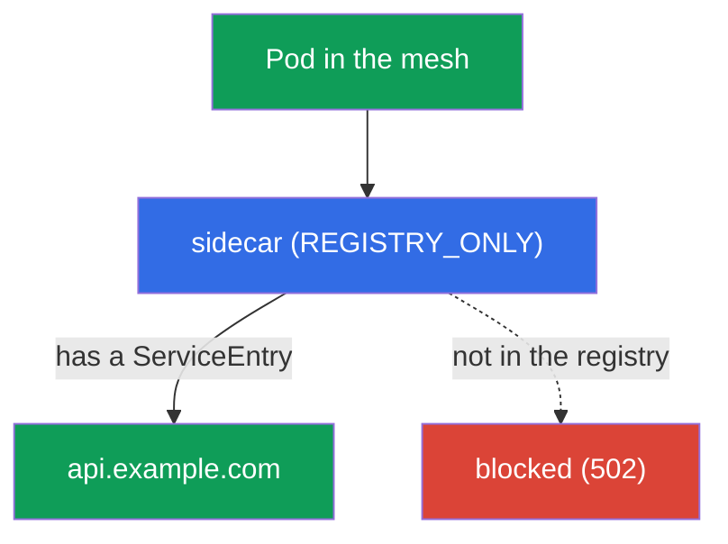
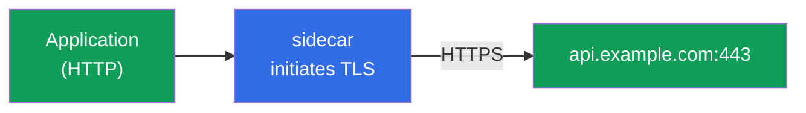

[RU version](ru.md) · [Versión en español](es.md)

# Chapter 12. Egress: ServiceEntry, egress gateway, TLS origination

> **What's next.** So far we have managed traffic that comes into the mesh and travels inside
> it. Now let us look at traffic that leaves **outward** - to external APIs, databases,
> third-party services. By default Istio lets traffic out to anywhere, and that is a security
> problem. In this chapter we learn to control egress: register external services, route them
> through a single exit point, and forbid everything else.

## 12.1. The problem: by default you can reach anywhere outside

By default Istio's outbound traffic policy is `ALLOW_ANY` - any pod can reach any address on
the internet. Handy for development, but bad for security: if a pod is compromised, it can
"exfiltrate" data to any external address and you would not even notice.

Controlled egress solves three tasks:

- **knowing** which external services the mesh reaches at all (`ServiceEntry`);
- **routing** external traffic through a single point for auditing and filtering (egress
  gateway);
- **forbidding** everything not explicitly allowed (`REGISTRY_ONLY` + `Sidecar`).

## 12.2. ServiceEntry: registering an external service

Istio keeps an internal service registry. In-cluster services get there from Kubernetes
automatically, but Istio knows nothing about external ones (for example, `api.example.com`).
A `ServiceEntry` adds an external host to this registry.

```yaml
apiVersion: networking.istio.io/v1
kind: ServiceEntry
metadata:
  name: external-api
spec:
  hosts:
  - api.example.com
  ports:
  - number: 443
    name: https
    protocol: TLS
  resolution: DNS          # resolve the name via DNS
  location: MESH_EXTERNAL  # a service outside the mesh
```

Let's break down the fields:

- **`hosts`** - the external DNS name we register.
- **`ports`** - the port and protocol of the external service.
- **`resolution: DNS`** - Envoy resolves the name via DNS itself (there is also `STATIC` for
  fixed IPs).
- **`location: MESH_EXTERNAL`** - the service is outside the mesh, mTLS is not applied to it.

More on `resolution`:

- **`DNS`** - Envoy resolves `hosts` via DNS itself (suits ordinary external APIs by domain
  name).
- **`STATIC`** - you specify concrete IPs in the `endpoints` block (for example, an external
  DB at fixed addresses):

  ```yaml
  spec:
    hosts:
    - db.external
    ports:
    - number: 5432
      name: tcp-postgres
      protocol: TCP
    resolution: STATIC
    location: MESH_EXTERNAL
    endpoints:
    - address: 10.0.50.10      # a concrete IP of the external service
    - address: 10.0.50.11
  ```

- **`NONE`** - no resolution, traffic goes to the destination IP as is (for cases where the
  address is not known in advance).

A couple more useful fields:

- **A wildcard host.** In `hosts` you can specify `*.example.com` to cover all subdomains with
  a single ServiceEntry.
- **`exportTo`** - in which namespaces this ServiceEntry is visible (`.` - only its own, `*` -
  all). Useful so the permission for an external service applies not to the whole cluster but
  narrowly.

Why this is needed: without a `ServiceEntry` an external service can neither be routed through
the egress gateway nor allowed in strict `REGISTRY_ONLY` mode. This is the first building
block of egress control.

### Wildcard hosts: caveats and the egress gateway

A wildcard in `hosts` (`*.example.com`) is handy for covering a bunch of subdomains with a
single `ServiceEntry`, but it has an important limitation: **a wildcard cannot be DNS-resolved
directly** - there is no DNS record for `*.example.com`, and Envoy does not know where to send
the packets. So the behavior depends on how the subdomains "land" in reality:

- **All subdomains behind a common set of addresses** (a typical example is `*.wikipedia.org`,
  where everything is served by one server pool). Then you set `resolution: DNS` and an
  **explicit** endpoint to actually go to:

  ```yaml
  apiVersion: networking.istio.io/v1
  kind: ServiceEntry
  metadata:
    name: wikipedia
    namespace: app
  spec:
    hosts:
    - "*.wikipedia.org"
    ports:
    - number: 443
      name: https
      protocol: TLS
    resolution: DNS
    endpoints:
    - address: www.wikipedia.org    # the common address all subdomains resolve to
  ```

- **Arbitrary, independent subdomains** (each resolves to its own address). Here DNS will not
  help - you use `resolution: NONE` (Envoy passes traffic by SNI/destination IP, resolving
  nothing):

  ```yaml
  spec:
    hosts:
    - "*.example.com"
    ports:
    - number: 443
      name: tls
      protocol: TLS
    resolution: NONE               # no resolution, route by SNI/IP as is
    location: MESH_EXTERNAL
  ```

Limitations people trip over:

- **A bare `*` is not set** - a domain suffix is needed (`*.example.com`), otherwise it means
  "let out to anywhere", which contradicts the point of `REGISTRY_ONLY`.
- A wildcard works only for the top level of subdomains: `*.example.com` matches
  `a.example.com`, but not `a.b.example.com`.

Through an **egress gateway** a wildcard is routed by SNI (`tls` in `PASSTHROUGH` mode) rather
than by an exact host - you put the wildcard itself in `sniHosts` and in the gateway's
`hosts`. The scheme is the same four-resource one as in 12.4, only the hosts change:

```yaml
apiVersion: networking.istio.io/v1
kind: Gateway
metadata:
  name: istio-egressgateway
  namespace: istio-system
spec:
  selector:
    istio: egressgateway
  servers:
  - port:
      number: 443
      name: tls
      protocol: TLS
    hosts:
    - "*.example.com"             # the wildcard right on the gateway listener
    tls:
      mode: PASSTHROUGH
---
apiVersion: networking.istio.io/v1
kind: VirtualService
metadata:
  name: wildcard-via-egress
  namespace: istio-system
spec:
  hosts:
  - "*.example.com"
  gateways:
  - mesh
  - istio-egressgateway
  tls:
  - match:
    - gateways: [mesh]
      sniHosts: ["*.example.com"]          # SNI match by the wildcard, not by an exact host
    route:
    - destination:
        host: istio-egressgateway.istio-system.svc.cluster.local
        subset: api-egress
        port:
          number: 443
  - match:
    - gateways: [istio-egressgateway]
      sniHosts: ["*.example.com"]
    route:
    - destination:
        host: "*.example.com"              # let it out by SNI
        port:
          number: 443
```

> **Check your work.** An allowed subdomain should go through, while a host outside the
> wildcard should hit `REGISTRY_ONLY`:
>
> ```bash
> kubectl exec deploy/sleep -n app -- curl -sS -o /dev/null -w "%{http_code}\n" \
>   https://a.example.com          # expect 200 (in the registry by wildcard)
> kubectl exec deploy/sleep -n app -- curl -sS -o /dev/null -w "%{http_code}\n" \
>   https://api.other.com          # expect an error/502 (not in the registry)
> ```

The practical advice stays the same: a wildcard is a trade-off between convenience and
precision of control. The broader the `*`, the less you know where the mesh actually goes, so
in production precise hosts are preferred, and a wildcard is taken deliberately (for example,
for a CDN or a cloud service with unpredictable subdomains).

### DNS proxying: resolving by Istio itself

By default the application's DNS queries go to kube-DNS (CoreDNS), and Istio does not touch
them. This has limitations: the application cannot resolve `ServiceEntry` hosts without real
DNS records (especially with `resolution: STATIC`/`NONE`), and every external request goes to
CoreDNS.

Istio can bring up a **DNS proxy**: istio-agent right in the pod answers DNS queries, knowing
the mesh registry (cluster services and `ServiceEntry` hosts). It is enabled via MeshConfig:

```yaml
meshConfig:
  defaultConfig:
    proxyMetadata:
      ISTIO_META_DNS_CAPTURE: "true"        # capture DNS in the data plane
      ISTIO_META_DNS_AUTO_ALLOCATE: "true"  # allocate virtual IPs to ServiceEntry hosts without addresses
```

(the same can be enabled surgically with the pod annotation `proxy.istio.io/config`). What
this gives:

- **ServiceEntry hosts resolve locally** - important for external TCP services without DNS
  records; with `DNS_AUTO_ALLOCATE` Istio allocates them virtual IPs to route more precisely
  (otherwise several TCP services on one port are indistinguishable by destination IP).
- **Less load on CoreDNS** and a faster answer (resolution locally in the pod).
- In **ambient** and on **VMs** (chapter 29) the DNS proxy is the standard way to resolve
  cluster names.

## 12.3. REGISTRY_ONLY: forbidding everything else

Now let us tighten the screws: switch the mesh to a mode where you may go out **only** to
registered services. This is `outboundTrafficPolicy.mode: REGISTRY_ONLY`.

You can set it globally (in MeshConfig at install time) or per namespace via a `Sidecar`
resource:

```yaml
apiVersion: networking.istio.io/v1
kind: Sidecar
metadata:
  name: default            # the name default = a policy for the whole namespace
  namespace: app
spec:
  outboundTrafficPolicy:
    mode: REGISTRY_ONLY     # outward only what is in the registry
```

After this a request to a host registered via `ServiceEntry` will go through, while a request
to any other will be blocked (Envoy returns an error, usually `502`).



This is the egress analogue of the default-deny principle: explicitly allow the needed
external services via `ServiceEntry`, everything else is forbidden. We will cover the
`Sidecar` resource in more detail in chapter 19 (there it is used to optimize the proxy
configuration).

## 12.4. Egress gateway: a single exit point

`ServiceEntry` + `REGISTRY_ONLY` already give control: it is known where you may go,
everything else is closed. But so far traffic leaves directly from each pod's sidecar. Often
you want to route all external traffic through **a single point** - the egress gateway. This
is convenient for auditing, logging and applying policies in one place (and an external
firewall can allow egress only from this gateway's IP).


Configuring the egress gateway is the most verbose part: it needs four resources. We assume
the `ServiceEntry` for `api.example.com` (port 443, TLS) from 12.2 is already created, and the
egress gateway itself is deployed (pod label `istio: egressgateway`).

**1. Gateway** - configures the egress gateway to listen for the needed host on the way out:

```yaml
apiVersion: networking.istio.io/v1
kind: Gateway
metadata:
  name: istio-egressgateway
  namespace: istio-system
spec:
  selector:
    istio: egressgateway        # apply to the egress gateway pods
  servers:
  - port:
      number: 443
      name: tls
      protocol: TLS
    hosts:
    - api.example.com
    tls:
      mode: PASSTHROUGH         # traffic is already encrypted by the app, the gateway does not decrypt
```

**2. DestinationRule** - declares the gateway subset the VirtualService will reference:

```yaml
apiVersion: networking.istio.io/v1
kind: DestinationRule
metadata:
  name: egressgateway-for-api
  namespace: istio-system
spec:
  host: istio-egressgateway.istio-system.svc.cluster.local
  subsets:
  - name: api-egress            # the subset we will route mesh traffic to
```

**3. VirtualService** - two-stage routing. The same request makes two "hops": first pod →
egress gateway, then egress gateway → external service:

```yaml
apiVersion: networking.istio.io/v1
kind: VirtualService
metadata:
  name: route-via-egress
  namespace: istio-system
spec:
  hosts:
  - api.example.com
  gateways:
  - mesh                        # stage 1: traffic from the pods' sidecars
  - istio-egressgateway         # stage 2: traffic that arrived at the egress gateway
  tls:
  - match:
    - gateways: [mesh]                     # stage 1: from the mesh...
      sniHosts: [api.example.com]
    route:
    - destination:
        host: istio-egressgateway.istio-system.svc.cluster.local
        subset: api-egress                 # ...route to the egress gateway
        port:
          number: 443
  - match:
    - gateways: [istio-egressgateway]      # stage 2: at the egress gateway...
      sniHosts: [api.example.com]
    route:
    - destination:
        host: api.example.com              # ...let it out
        port:
          number: 443
```

Here the traffic is already TLS (the application encrypts it itself), so routing is by
`sniHosts` and the gateway is in `PASSTHROUGH` mode. If you need the gateway itself to
initiate TLS, that is done with an `http` route + TLS origination on the egress gateway
(section 12.5).

You can verify that traffic really goes through the gateway from its logs:

```bash
kubectl logs -n istio-system -l istio=egressgateway --tail=20 | grep api.example.com
```

> **Important: an egress gateway is not a security boundary by itself.** If a pod can go out
> directly, it will simply bypass the gateway. An egress gateway only makes sense together
> with `REGISTRY_ONLY` (12.3) and/or a Kubernetes `NetworkPolicy` that forbid pods outbound
> traffic around the gateway. Otherwise it is merely a "recommended route", not control.

## 12.5. TLS origination

A separate useful technique. Sometimes an application talks to an external service over plain
HTTP, but the traffic needs to leave over HTTPS. You could, of course, add TLS to the
application code, but it is simpler to hand it to the mesh. **TLS origination** is when the
application sends plain HTTP and the sidecar (or egress gateway) establishes the TLS
connection to the target service itself.



It is configured via a `DestinationRule` with `tls.mode: SIMPLE` for the external host:

```yaml
apiVersion: networking.istio.io/v1
kind: DestinationRule
metadata:
  name: external-api-tls
spec:
  host: api.example.com
  trafficPolicy:
    tls:
      mode: SIMPLE      # the sidecar establishes TLS outward itself
```

Together with a `ServiceEntry` (where the external port is declared as HTTP 80, while the real
service listens on 443) this lets the application call `http://api.example.com`, while the
traffic leaves already encrypted. The application code stays simple, and the mesh uniformly
takes on the work with certificates and TLS.

**mTLS outward (`mode: MUTUAL`).** If the external service requires a client certificate
(mutual TLS), the mesh can present it itself - then in the `DestinationRule` you specify
`mode: MUTUAL` and references to the certificates (via `credentialName` with a Secret or file
paths):

```yaml
  trafficPolicy:
    tls:
      mode: MUTUAL              # present a client certificate to the external service
      credentialName: api-client-cert   # a Secret with the client certificate and key
```

This way the application still sends plain HTTP, while the mesh establishes an mTLS connection
outward with the required client certificate.

Do not confuse this with the TLS modes from chapter 9: there (SIMPLE/MUTUAL/PASSTHROUGH) it
is about **inbound** traffic at the ingress gateway. TLS origination is about **outbound**
traffic that the mesh encrypts on the way out.

## 12.6. Egress on EKS/AWS: a static IP and an allowlist

A common production task: an external partner (a payment gateway, a third-party API) asks that
requests to it arrive from a **known IP** - to add it to their allowlist. In ordinary EKS pods
go out to the internet through a **NAT Gateway**, and its Elastic IP is what is seen outside.
But if there are several nodes and NAT gateways (one per AZ), there will be several outbound
addresses.

An egress gateway helps reduce it all to a predictable set of addresses:

- All external mesh traffic goes through the **egress gateway** (12.4), while `REGISTRY_ONLY`
  + `NetworkPolicy` prevent pods from going around it.
- The egress gateway pods are pinned to a dedicated node pool (via `nodeSelector`/`affinity`),
  and that node pool goes out to the internet through **a single NAT Gateway with a fixed
  Elastic IP**.
- The partner adds exactly this EIP to the allowlist.


It is important to understand the division of roles: **the egress gateway itself does not
provide an outward IP** - the external address is determined by the NAT Gateway (or the node's
public IP). The egress gateway only gathers all outbound traffic into one point so it leaves
through predictable nodes and, therefore, through a predictable NAT EIP. Without concentrating
it on the egress gateway, traffic would spread across all nodes and NAT gateways of all AZs.

## 12.7. Best practices

- **Do not leave `ALLOW_ANY` in production.** Switch the mesh (or at least sensitive
  namespaces) to `REGISTRY_ONLY` and allow external services with explicit `ServiceEntry`s.
- **An egress gateway - only together with bypass restriction.** By itself it is not a
  security boundary; close off pods' direct exit via `REGISTRY_ONLY` and/or a `NetworkPolicy`.
- **Minimize `ServiceEntry`s.** Precise hosts instead of broad wildcards; limit the visibility
  scope via `exportTo` so a permission does not apply to the whole cluster.
- **Encrypt outbound traffic via TLS origination**, not in the application code - uniformly
  and with centralized certificate management (`MUTUAL` if the partner requires mTLS).
- **For an IP allowlist** concentrate egress through dedicated nodes with a fixed NAT EIP
  (12.6); remember that the address is provided by the NAT/node, not the gateway itself.
- **Audit egress.** The egress gateway logs are a convenient single point to see where and how
  much the mesh reaches.

## 12.8. Chapter summary

- By default egress is in `ALLOW_ANY` mode - you can reach anywhere outside, which is a
  security risk.
- **ServiceEntry** registers an external service in the mesh registry; without it an external
  host can neither be routed nor allowed under `REGISTRY_ONLY`.
- **REGISTRY_ONLY** (via MeshConfig or `Sidecar`) allows exit only to registered services -
  the egress analogue of default-deny.
- **The egress gateway** gives a single exit point for auditing and filtering; it is
  configured via Gateway + DestinationRule + VirtualService with two-stage routing.
- **ServiceEntry** is flexible in `resolution` (`DNS`/`STATIC`/`NONE`), supports wildcard hosts
  and visibility limiting via `exportTo`.
- **Wildcard hosts** (`*.example.com`) cannot be DNS-resolved directly: for a common address
  use `resolution: DNS` with an explicit `endpoints`, for arbitrary subdomains use
  `resolution: NONE`; through an egress gateway they are routed by SNI
  (`sniHosts: ["*.example.com"]`, `PASSTHROUGH`).
- **DNS proxying** (`ISTIO_META_DNS_CAPTURE`) resolves names by istio-agent itself: it makes
  ServiceEntry hosts resolvable (with `DNS_AUTO_ALLOCATE` - virtual IPs for hosts without
  addresses), offloads CoreDNS; used by default in ambient and on VMs.
- **An egress gateway is not a security boundary by itself**: it works only together with
  `REGISTRY_ONLY` and/or a `NetworkPolicy`, otherwise a pod will bypass it directly.
- **TLS origination** lets the application go over HTTP while the mesh encrypts the traffic
  outward itself (DestinationRule `tls.mode: SIMPLE`; `MUTUAL` if a client certificate is
  needed).
- On EKS, for an **IP allowlist**, traffic is concentrated through an egress gateway on
  dedicated nodes with a fixed NAT EIP; the outbound address is provided by the NAT Gateway,
  not the gateway itself.
- Edge TLS (chapter 9) is about inbound traffic, TLS origination is about outbound.

## 12.9. Self-check questions

1. Why is the default `ALLOW_ANY` mode dangerous?
2. What is a `ServiceEntry` for and what happens without it under `REGISTRY_ONLY`?
3. How does `REGISTRY_ONLY` implement the default-deny principle for egress?
4. Why route external traffic through an egress gateway if control is already in place?
5. What is TLS origination and how does it differ from edge TLS in chapter 9? What does the
   `MUTUAL` mode add?
6. Why is an egress gateway not a security boundary by itself? What needs to be added?
7. How do `resolution: DNS`, `STATIC` and `NONE` differ in a ServiceEntry?
8. What is DNS proxying in Istio and what is `DNS_AUTO_ALLOCATE` for?
9. How, on EKS, do you make requests to an external partner leave from a known IP for an
   allowlist? Who exactly determines the outbound address?
10. Why can't a wildcard host be DNS-resolved directly, and which `resolution` do you pick for
    a common address versus arbitrary subdomains? How do you route a wildcard through an egress
    gateway?

## Practice

Practice full egress control: ServiceEntry, egress gateway and REGISTRY_ONLY:

🧪 Lab 05: [tasks/ica/labs/05](../../labs/05/README.MD)

Practice TLS origination (initiating TLS on the mesh side):

🧪 Lab 22: [tasks/ica/labs/22](../../labs/22/README.MD)

---
[Contents](../README.md) · [Chapter 11](../11/en.md) · [Chapter 13](../13/en.md)
