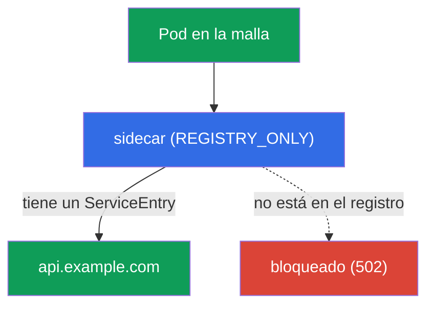
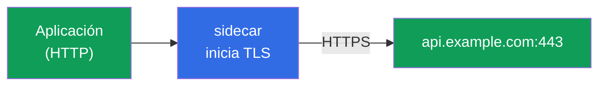
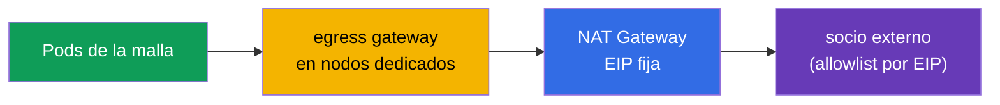

[RU version](ru.md) · [Eng version](en.md)

# Capítulo 12. Egress: ServiceEntry, egress gateway, originación de TLS

> **Qué sigue.** Hasta ahora hemos gestionado tráfico que entra en la malla y viaja dentro de
> ella. Ahora miremos el tráfico que sale **hacia fuera**: a APIs externas, bases de datos,
> servicios de terceros. Por defecto Istio deja salir tráfico a cualquier sitio, y eso es un
> problema de seguridad. En este capítulo aprendemos a controlar el egress: registrar servicios
> externos, enrutarlos a través de un único punto de salida y prohibir todo lo demás.

## 12.1. El problema: por defecto puedes alcanzar cualquier sitio fuera

Por defecto la política de tráfico saliente de Istio es `ALLOW_ANY`: cualquier pod puede
alcanzar cualquier dirección de internet. Cómodo para el desarrollo, pero malo para la
seguridad: si un pod se ve comprometido, puede "exfiltrar" datos a cualquier dirección externa
sin que te enteres siquiera.

El egress controlado resuelve tres tareas:

- **saber** a qué servicios externos llega la malla en absoluto (`ServiceEntry`);
- **enrutar** el tráfico externo a través de un único punto para auditoría y filtrado (egress
  gateway);
- **prohibir** todo lo que no esté explícitamente permitido (`REGISTRY_ONLY` + `Sidecar`).

## 12.2. ServiceEntry: registrar un servicio externo

Istio mantiene un registro interno de servicios. Los servicios dentro del clúster llegan ahí
automáticamente desde Kubernetes, pero Istio no sabe nada de los externos (por ejemplo,
`api.example.com`). Un `ServiceEntry` añade un host externo a este registro.

```yaml
apiVersion: networking.istio.io/v1
kind: ServiceEntry
metadata:
  name: external-api
spec:
  hosts:
  - api.example.com
  ports:
  - number: 443
    name: https
    protocol: TLS
  resolution: DNS          # resolver el nombre vía DNS
  location: MESH_EXTERNAL  # un servicio fuera de la malla
```

Desglosemos los campos:

- **`hosts`**: el nombre DNS externo que registramos.
- **`ports`**: el puerto y protocolo del servicio externo.
- **`resolution: DNS`**: Envoy resuelve el nombre vía DNS por sí mismo (también existe `STATIC`
  para IPs fijas).
- **`location: MESH_EXTERNAL`**: el servicio está fuera de la malla, no se le aplica mTLS.

Más sobre `resolution`:

- **`DNS`**: Envoy resuelve `hosts` vía DNS por sí mismo (adecuado para APIs externas corrientes
  por nombre de dominio).
- **`STATIC`**: especificas IPs concretas en el bloque `endpoints` (por ejemplo, una BD externa
  en direcciones fijas):

  ```yaml
  spec:
    hosts:
    - db.external
    ports:
    - number: 5432
      name: tcp-postgres
      protocol: TCP
    resolution: STATIC
    location: MESH_EXTERNAL
    endpoints:
    - address: 10.0.50.10      # una IP concreta del servicio externo
    - address: 10.0.50.11
  ```

- **`NONE`**: sin resolución, el tráfico va a la IP destino tal cual (para casos donde la
  dirección no se conoce de antemano).

Un par de campos útiles más:

- **Un host wildcard.** En `hosts` puedes especificar `*.example.com` para cubrir todos los
  subdominios con un único ServiceEntry.
- **`exportTo`**: en qué namespaces es visible este ServiceEntry (`.`: solo el propio, `*`:
  todos). Útil para que el permiso de un servicio externo no aplique a todo el clúster, sino de
  forma acotada.

Por qué se necesita esto: sin un `ServiceEntry` un servicio externo no puede enrutarse a través
del egress gateway ni permitirse en el modo estricto `REGISTRY_ONLY`. Este es el primer bloque
de construcción del control de egress.

### Hosts wildcard: salvedades y el egress gateway

Un wildcard en `hosts` (`*.example.com`) es cómodo para cubrir un montón de subdominios con un
único `ServiceEntry`, pero tiene una limitación importante: **un wildcard no puede resolverse
por DNS directamente**; no hay un registro DNS para `*.example.com`, y Envoy no sabe adónde
enviar los paquetes. Así que el comportamiento depende de cómo "aterricen" los subdominios en la
realidad:

- **Todos los subdominios detrás de un conjunto común de direcciones** (un ejemplo típico es
  `*.wikipedia.org`, donde todo lo sirve un mismo pool de servidores). Entonces fijas
  `resolution: DNS` y un endpoint **explícito** al que ir de verdad:

  ```yaml
  apiVersion: networking.istio.io/v1
  kind: ServiceEntry
  metadata:
    name: wikipedia
    namespace: app
  spec:
    hosts:
    - "*.wikipedia.org"
    ports:
    - number: 443
      name: https
      protocol: TLS
    resolution: DNS
    endpoints:
    - address: www.wikipedia.org    # la dirección común a la que resuelven todos los subdominios
  ```

- **Subdominios arbitrarios e independientes** (cada uno resuelve a su propia dirección). Aquí
  el DNS no ayudará: usas `resolution: NONE` (Envoy pasa el tráfico por SNI/IP destino, sin
  resolver nada):

  ```yaml
  spec:
    hosts:
    - "*.example.com"
    ports:
    - number: 443
      name: tls
      protocol: TLS
    resolution: NONE               # sin resolución, enrutar por SNI/IP tal cual
    location: MESH_EXTERNAL
  ```

Limitaciones con las que la gente tropieza:

- **Un `*` a secas no se admite**: hace falta un sufijo de dominio (`*.example.com`), de lo
  contrario significa "dejar salir a cualquier sitio", lo que contradice el sentido de
  `REGISTRY_ONLY`.
- Un wildcard funciona solo para el nivel superior de subdominios: `*.example.com` coincide con
  `a.example.com`, pero no con `a.b.example.com`.

A través de un **egress gateway** un wildcard se enruta por SNI (`tls` en modo `PASSTHROUGH`) en
lugar de por un host exacto: pones el propio wildcard en `sniHosts` y en los `hosts` del
gateway. El esquema es el mismo de cuatro recursos que en 12.4, solo cambian los hosts:

```yaml
apiVersion: networking.istio.io/v1
kind: Gateway
metadata:
  name: istio-egressgateway
  namespace: istio-system
spec:
  selector:
    istio: egressgateway
  servers:
  - port:
      number: 443
      name: tls
      protocol: TLS
    hosts:
    - "*.example.com"             # el wildcard directamente en el listener del gateway
    tls:
      mode: PASSTHROUGH
---
apiVersion: networking.istio.io/v1
kind: VirtualService
metadata:
  name: wildcard-via-egress
  namespace: istio-system
spec:
  hosts:
  - "*.example.com"
  gateways:
  - mesh
  - istio-egressgateway
  tls:
  - match:
    - gateways: [mesh]
      sniHosts: ["*.example.com"]          # match por SNI con el wildcard, no por un host exacto
    route:
    - destination:
        host: istio-egressgateway.istio-system.svc.cluster.local
        subset: api-egress
        port:
          number: 443
  - match:
    - gateways: [istio-egressgateway]
      sniHosts: ["*.example.com"]
    route:
    - destination:
        host: "*.example.com"              # dejarlo salir por SNI
        port:
          number: 443
```

> **Comprueba tu trabajo.** Un subdominio permitido debería pasar, mientras que un host fuera
> del wildcard debería toparse con `REGISTRY_ONLY`:
>
> ```bash
> kubectl exec deploy/sleep -n app -- curl -sS -o /dev/null -w "%{http_code}\n" \
>   https://a.example.com          # se espera 200 (en el registro por el wildcard)
> kubectl exec deploy/sleep -n app -- curl -sS -o /dev/null -w "%{http_code}\n" \
>   https://api.other.com          # se espera un error/502 (no está en el registro)
> ```

El consejo práctico sigue siendo el mismo: un wildcard es un compromiso entre comodidad y
precisión del control. Cuanto más amplio es el `*`, menos sabes adónde va realmente la malla,
así que en producción se prefieren los hosts precisos, y un wildcard se toma deliberadamente
(por ejemplo, para una CDN o un servicio de nube con subdominios impredecibles).

### Proxy de DNS: resolver por el propio Istio

Por defecto las consultas DNS de la aplicación van a kube-DNS (CoreDNS), e Istio no las toca.
Esto tiene limitaciones: la aplicación no puede resolver los hosts de `ServiceEntry` sin
registros DNS reales (especialmente con `resolution: STATIC`/`NONE`), y cada petición externa va
a CoreDNS.

Istio puede levantar un **proxy de DNS**: istio-agent, dentro del propio pod, responde a las
consultas DNS, conociendo el registro de la malla (servicios del clúster y hosts de
`ServiceEntry`). Se habilita vía MeshConfig:

```yaml
meshConfig:
  defaultConfig:
    proxyMetadata:
      ISTIO_META_DNS_CAPTURE: "true"        # capturar DNS en el data plane
      ISTIO_META_DNS_AUTO_ALLOCATE: "true"  # asignar IPs virtuales a hosts de ServiceEntry sin direcciones
```

(lo mismo puede habilitarse de forma quirúrgica con la anotación de pod
`proxy.istio.io/config`). Qué da esto:

- **Los hosts de ServiceEntry resuelven localmente**: importante para servicios TCP externos sin
  registros DNS; con `DNS_AUTO_ALLOCATE` Istio les asigna IPs virtuales para enrutar con más
  precisión (de lo contrario, varios servicios TCP en un mismo puerto son indistinguibles por IP
  destino).
- **Menos carga en CoreDNS** y una respuesta más rápida (resolución localmente en el pod).
- En **ambient** y en **VMs** (capítulo 29) el proxy de DNS es la forma estándar de resolver
  nombres del clúster.

## 12.3. REGISTRY_ONLY: prohibir todo lo demás

Ahora apretemos las tuercas: cambiamos la malla a un modo en el que solo puedes salir **hacia**
servicios registrados. Esto es `outboundTrafficPolicy.mode: REGISTRY_ONLY`.

Puedes fijarlo globalmente (en MeshConfig al instalar) o por namespace mediante un recurso
`Sidecar`:

```yaml
apiVersion: networking.istio.io/v1
kind: Sidecar
metadata:
  name: default            # el nombre default = una política para todo el namespace
  namespace: app
spec:
  outboundTrafficPolicy:
    mode: REGISTRY_ONLY     # hacia fuera solo lo que está en el registro
```

Tras esto, una petición a un host registrado vía `ServiceEntry` pasará, mientras que una
petición a cualquier otro se bloqueará (Envoy devuelve un error, normalmente `502`).



Este es el análogo de egress del principio default-deny: permite explícitamente los servicios
externos necesarios vía `ServiceEntry`, todo lo demás está prohibido. Cubriremos el recurso
`Sidecar` con más detalle en el capítulo 19 (allí se usa para optimizar la configuración del
proxy).

## 12.4. Egress gateway: un único punto de salida

`ServiceEntry` + `REGISTRY_ONLY` ya dan control: se sabe adónde puedes ir, todo lo demás está
cerrado. Pero hasta ahora el tráfico sale directamente desde el sidecar de cada pod. A menudo
quieres enrutar todo el tráfico externo a través de **un único punto**: el egress gateway. Esto
es cómodo para auditoría, logging y aplicar políticas en un solo lugar (y un firewall externo
puede permitir egress solo desde la IP de este gateway).


Configurar el egress gateway es la parte más verbosa: necesita cuatro recursos. Damos por hecho
que el `ServiceEntry` para `api.example.com` (puerto 443, TLS) de 12.2 ya está creado, y que el
propio egress gateway está desplegado (etiqueta de pod `istio: egressgateway`).

**1. Gateway**: configura el egress gateway para que escuche el host necesario en la salida:

```yaml
apiVersion: networking.istio.io/v1
kind: Gateway
metadata:
  name: istio-egressgateway
  namespace: istio-system
spec:
  selector:
    istio: egressgateway        # aplicar a los pods del egress gateway
  servers:
  - port:
      number: 443
      name: tls
      protocol: TLS
    hosts:
    - api.example.com
    tls:
      mode: PASSTHROUGH         # el tráfico ya lo cifra la app, el gateway no lo descifra
```

**2. DestinationRule**: declara el subset del gateway que referenciará el VirtualService:

```yaml
apiVersion: networking.istio.io/v1
kind: DestinationRule
metadata:
  name: egressgateway-for-api
  namespace: istio-system
spec:
  host: istio-egressgateway.istio-system.svc.cluster.local
  subsets:
  - name: api-egress            # el subset al que enrutaremos el tráfico de la malla
```

**3. VirtualService**: enrutamiento en dos etapas. La misma petición hace dos "saltos": primero
pod → egress gateway, luego egress gateway → servicio externo:

```yaml
apiVersion: networking.istio.io/v1
kind: VirtualService
metadata:
  name: route-via-egress
  namespace: istio-system
spec:
  hosts:
  - api.example.com
  gateways:
  - mesh                        # etapa 1: tráfico desde los sidecars de los pods
  - istio-egressgateway         # etapa 2: tráfico que llegó al egress gateway
  tls:
  - match:
    - gateways: [mesh]                     # etapa 1: desde la malla...
      sniHosts: [api.example.com]
    route:
    - destination:
        host: istio-egressgateway.istio-system.svc.cluster.local
        subset: api-egress                 # ...enrutar al egress gateway
        port:
          number: 443
  - match:
    - gateways: [istio-egressgateway]      # etapa 2: en el egress gateway...
      sniHosts: [api.example.com]
    route:
    - destination:
        host: api.example.com              # ...dejarlo salir
        port:
          number: 443
```

Aquí el tráfico ya es TLS (la aplicación lo cifra ella misma), así que el enrutamiento es por
`sniHosts` y el gateway está en modo `PASSTHROUGH`. Si necesitas que el propio gateway inicie
TLS, eso se hace con una route `http` + originación de TLS en el egress gateway (sección 12.5).

Puedes verificar que el tráfico realmente pasa por el gateway desde sus logs:

```bash
kubectl logs -n istio-system -l istio=egressgateway --tail=20 | grep api.example.com
```

> **Importante: un egress gateway no es una frontera de seguridad por sí solo.** Si un pod puede
> salir directamente, simplemente esquivará el gateway. Un egress gateway solo tiene sentido
> junto con `REGISTRY_ONLY` (12.3) y/o una `NetworkPolicy` de Kubernetes que prohíban a los pods
> tráfico saliente por fuera del gateway. De lo contrario es meramente una "ruta recomendada",
> no un control.

## 12.5. Originación de TLS

Una técnica útil aparte. A veces una aplicación habla con un servicio externo por HTTP plano,
pero el tráfico necesita salir por HTTPS. Podrías, por supuesto, añadir TLS al código de la
aplicación, pero es más sencillo delegárselo a la malla. La **originación de TLS** es cuando la
aplicación envía HTTP plano y el sidecar (o el egress gateway) establece por sí mismo la
conexión TLS con el servicio destino.



Se configura vía un `DestinationRule` con `tls.mode: SIMPLE` para el host externo:

```yaml
apiVersion: networking.istio.io/v1
kind: DestinationRule
metadata:
  name: external-api-tls
spec:
  host: api.example.com
  trafficPolicy:
    tls:
      mode: SIMPLE      # el sidecar establece TLS hacia fuera por sí mismo
```

Junto con un `ServiceEntry` (donde el puerto externo se declara como HTTP 80, mientras que el
servicio real escucha en 443) esto permite que la aplicación llame a `http://api.example.com`,
mientras el tráfico sale ya cifrado. El código de la aplicación se mantiene simple, y la malla
asume de forma uniforme el trabajo con certificados y TLS.

**mTLS hacia fuera (`mode: MUTUAL`).** Si el servicio externo requiere un certificado de cliente
(TLS mutuo), la malla puede presentarlo ella misma: entonces en el `DestinationRule` especificas
`mode: MUTUAL` y referencias a los certificados (vía `credentialName` con un Secret o rutas de
archivo):

```yaml
  trafficPolicy:
    tls:
      mode: MUTUAL              # presentar un certificado de cliente al servicio externo
      credentialName: api-client-cert   # un Secret con el certificado de cliente y la clave
```

De este modo la aplicación sigue enviando HTTP plano, mientras que la malla establece una
conexión mTLS hacia fuera con el certificado de cliente requerido.

No confundas esto con los modos de TLS del capítulo 9: allí (SIMPLE/MUTUAL/PASSTHROUGH) se trata
del tráfico **entrante** en el ingress gateway. La originación de TLS trata del tráfico
**saliente** que la malla cifra en la salida.

## 12.6. Egress en EKS/AWS: una IP estática y una allowlist

Una tarea de producción habitual: un socio externo (una pasarela de pago, una API de terceros)
pide que las peticiones hacia él lleguen desde una **IP conocida**, para añadirla a su allowlist.
En un EKS corriente los pods salen a internet a través de un **NAT Gateway**, y su Elastic IP es
lo que se ve desde fuera. Pero si hay varios nodos y NAT gateways (uno por AZ), habrá varias
direcciones de salida.

Un egress gateway ayuda a reducirlo todo a un conjunto predecible de direcciones:

- Todo el tráfico externo de la malla pasa por el **egress gateway** (12.4), mientras que
  `REGISTRY_ONLY` + `NetworkPolicy` impiden que los pods lo esquiven.
- Los pods del egress gateway se fijan a un node pool dedicado (vía `nodeSelector`/`affinity`), y
  ese node pool sale a internet a través de **un único NAT Gateway con una Elastic IP fija**.
- El socio añade exactamente esta EIP a la allowlist.



Es importante entender la división de roles: **el propio egress gateway no proporciona una IP de
salida**; la dirección externa la determina el NAT Gateway (o la IP pública del nodo). El egress
gateway solo reúne todo el tráfico saliente en un punto para que salga a través de nodos
predecibles y, por tanto, a través de una EIP de NAT predecible. Sin concentrarlo en el egress
gateway, el tráfico se repartiría por todos los nodos y NAT gateways de todas las AZs.

## 12.7. Buenas prácticas

- **No dejes `ALLOW_ANY` en producción.** Cambia la malla (o al menos los namespaces sensibles)
  a `REGISTRY_ONLY` y permite servicios externos con `ServiceEntry`s explícitos.
- **Un egress gateway: solo junto con la restricción del bypass.** Por sí solo no es una
  frontera de seguridad; cierra la salida directa de los pods vía `REGISTRY_ONLY` y/o una
  `NetworkPolicy`.
- **Minimiza los `ServiceEntry`s.** Hosts precisos en lugar de wildcards amplios; limita el
  alcance de visibilidad vía `exportTo` para que un permiso no aplique a todo el clúster.
- **Cifra el tráfico saliente vía originación de TLS**, no en el código de la aplicación: de
  forma uniforme y con gestión centralizada de certificados (`MUTUAL` si el socio requiere
  mTLS).
- **Para una allowlist de IP** concentra el egress a través de nodos dedicados con una EIP de
  NAT fija (12.6); recuerda que la dirección la proporciona el NAT/nodo, no el propio gateway.
- **Audita el egress.** Los logs del egress gateway son un único punto cómodo para ver adónde y
  cuánto llega la malla.

## 12.8. Resumen del capítulo

- Por defecto el egress está en modo `ALLOW_ANY`: puedes alcanzar cualquier sitio fuera, lo que
  es un riesgo de seguridad.
- **ServiceEntry** registra un servicio externo en el registro de la malla; sin él un host
  externo no puede enrutarse ni permitirse bajo `REGISTRY_ONLY`.
- **REGISTRY_ONLY** (vía MeshConfig o `Sidecar`) permite salir solo hacia servicios registrados:
  el análogo de egress de default-deny.
- **El egress gateway** da un único punto de salida para auditoría y filtrado; se configura vía
  Gateway + DestinationRule + VirtualService con enrutamiento en dos etapas.
- **ServiceEntry** es flexible en `resolution` (`DNS`/`STATIC`/`NONE`), soporta hosts wildcard y
  limitación de visibilidad vía `exportTo`.
- **Los hosts wildcard** (`*.example.com`) no pueden resolverse por DNS directamente: para una
  dirección común usa `resolution: DNS` con `endpoints` explícito, para subdominios arbitrarios
  usa `resolution: NONE`; a través de un egress gateway se enrutan por SNI
  (`sniHosts: ["*.example.com"]`, `PASSTHROUGH`).
- **El proxy de DNS** (`ISTIO_META_DNS_CAPTURE`) resuelve nombres por el propio istio-agent: hace
  resolubles los hosts de ServiceEntry (con `DNS_AUTO_ALLOCATE`: IPs virtuales para hosts sin
  direcciones), descarga a CoreDNS; se usa por defecto en ambient y en VMs.
- **Un egress gateway no es una frontera de seguridad por sí solo**: funciona solo junto con
  `REGISTRY_ONLY` y/o una `NetworkPolicy`, de lo contrario un pod lo esquivará directamente.
- **La originación de TLS** permite que la aplicación vaya por HTTP mientras la malla cifra ella
  misma el tráfico hacia fuera (DestinationRule `tls.mode: SIMPLE`; `MUTUAL` si se necesita un
  certificado de cliente).
- En EKS, para una **allowlist de IP**, el tráfico se concentra a través de un egress gateway en
  nodos dedicados con una EIP de NAT fija; la dirección de salida la proporciona el NAT Gateway,
  no el propio gateway.
- El TLS en el borde (capítulo 9) trata del tráfico entrante, la originación de TLS trata del
  saliente.

## 12.9. Preguntas de autoevaluación

1. ¿Por qué es peligroso el modo `ALLOW_ANY` por defecto?
2. ¿Para qué sirve un `ServiceEntry` y qué pasa sin él bajo `REGISTRY_ONLY`?
3. ¿Cómo implementa `REGISTRY_ONLY` el principio default-deny para el egress?
4. ¿Por qué enrutar el tráfico externo a través de un egress gateway si el control ya está en su
   sitio?
5. ¿Qué es la originación de TLS y en qué se diferencia del TLS en el borde del capítulo 9? ¿Qué
   añade el modo `MUTUAL`?
6. ¿Por qué un egress gateway no es una frontera de seguridad por sí solo? ¿Qué hay que añadir?
7. ¿En qué se diferencian `resolution: DNS`, `STATIC` y `NONE` en un ServiceEntry?
8. ¿Qué es el proxy de DNS en Istio y para qué sirve `DNS_AUTO_ALLOCATE`?
9. ¿Cómo haces, en EKS, que las peticiones a un socio externo salgan desde una IP conocida para
   una allowlist? ¿Quién determina exactamente la dirección de salida?
10. ¿Por qué un host wildcard no puede resolverse por DNS directamente, y qué `resolution` eliges
    para una dirección común frente a subdominios arbitrarios? ¿Cómo enrutas un wildcard a través
    de un egress gateway?

## Práctica

Practica el control completo de egress: ServiceEntry, egress gateway y REGISTRY_ONLY:

🧪 Laboratorio 05: [tasks/ica/labs/05](../../labs/05/README_ES.MD)

Practica la originación de TLS (iniciar TLS del lado de la malla):

🧪 Laboratorio 22: [tasks/ica/labs/22](../../labs/22/README_ES.MD)

---
[Índice](../README_ES.md) · [Capítulo 11](../11/es.md) · [Capítulo 13](../13/es.md)
