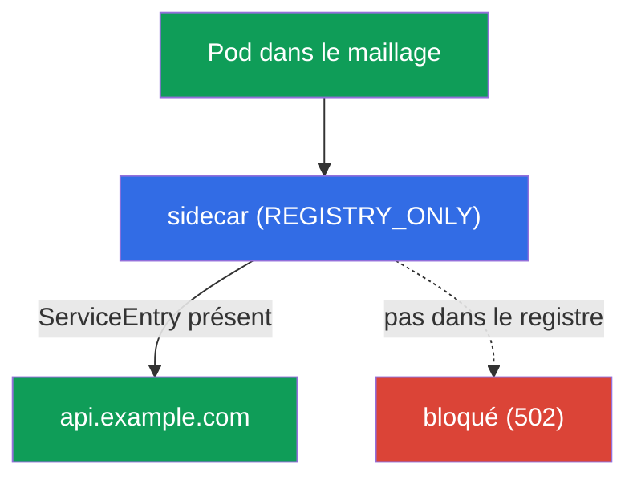
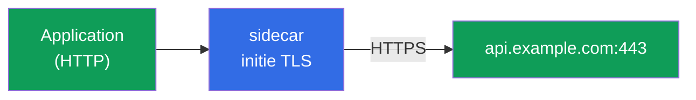
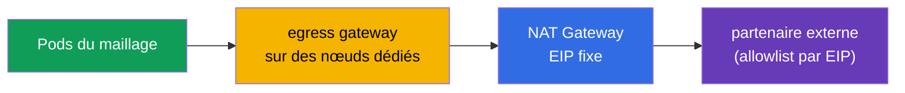

[RU version](ru.md) · [Eng version](en.md) · [Versión en español](es.md) · [Deutsche Version](de.md)

# Chapitre 12. Egress : ServiceEntry, egress gateway, origination TLS

> **Ce qui suit.** Jusqu'à présent, nous gérions le trafic qui entre dans le maillage et y
> circule à l'intérieur. Regardons maintenant le trafic qui part **vers l'extérieur** - vers des
> API externes, des bases de données, des services tiers. Par défaut, Istio laisse sortir le
> trafic n'importe où, et c'est un problème de sécurité. Dans ce chapitre, nous apprendrons à
> contrôler l'egress : enregistrer les services externes, les faire passer par un point de sortie
> unique et interdire tout le superflu.

## 12.1. Le problème : par défaut, tout est permis vers l'extérieur

Par défaut, la politique de trafic sortant d'Istio est `ALLOW_ANY` - n'importe quel pod peut
s'adresser à n'importe quelle adresse sur internet. C'est pratique pour le développement, mais du
point de vue de la sécurité c'est mauvais : si un pod est compromis, il pourra « exfiltrer » des
données vers n'importe quelle adresse externe, et vous ne le remarquerez même pas.

Un egress contrôlé résout trois tâches :

- **savoir** à quels services externes le maillage s'adresse (`ServiceEntry`) ;
- **faire passer** le trafic externe par un point unique pour l'audit et le filtrage (egress
  gateway) ;
- **interdire** tout ce qui n'est pas explicitement autorisé (`REGISTRY_ONLY` + `Sidecar`).

## 12.2. ServiceEntry : enregistrer un service externe

Istio tient un registre interne de services. Les services intra-cluster y arrivent
automatiquement depuis Kubernetes, mais des services externes (par exemple, `api.example.com`)
Istio ne sait rien. Le `ServiceEntry` ajoute un hôte externe à ce registre.

```yaml
apiVersion: networking.istio.io/v1
kind: ServiceEntry
metadata:
  name: external-api
spec:
  hosts:
  - api.example.com
  ports:
  - number: 443
    name: https
    protocol: TLS
  resolution: DNS          # résoudre le nom via DNS
  location: MESH_EXTERNAL  # service hors du maillage
```

Détaillons les champs :

- **`hosts`** - le nom DNS externe que l'on enregistre.
- **`ports`** - le port et le protocole du service externe.
- **`resolution: DNS`** - Envoy résout lui-même le nom via DNS (il existe aussi `STATIC` pour des
  IP fixes).
- **`location: MESH_EXTERNAL`** - service hors du maillage, le mTLS ne lui est pas appliqué.

À propos de `resolution`, plus en détail :

- **`DNS`** - Envoy résout lui-même `hosts` via DNS (convient aux API externes ordinaires par nom
  de domaine).
- **`STATIC`** - vous indiquez des IP concrètes dans le bloc `endpoints` (par exemple, une BDD
  externe à des adresses fixes) :

  ```yaml
  spec:
    hosts:
    - db.external
    ports:
    - number: 5432
      name: tcp-postgres
      protocol: TCP
    resolution: STATIC
    location: MESH_EXTERNAL
    endpoints:
    - address: 10.0.50.10      # IP concrète du service externe
    - address: 10.0.50.11
  ```

- **`NONE`** - sans résolution, le trafic passe par l'IP de destination tel quel (pour les cas où
  l'adresse est inconnue à l'avance).

Encore quelques champs utiles :

- **Hôte wildcard.** Dans `hosts`, on peut indiquer `*.example.com`, pour couvrir tous les
  sous-domaines avec un seul ServiceEntry.
- **`exportTo`** - dans quels namespaces ce ServiceEntry est visible (`.` - le sien uniquement,
  `*` - tous). Utile pour que l'autorisation vers un service externe agisse non sur tout le
  cluster, mais de manière ciblée.

Pourquoi c'est nécessaire : sans `ServiceEntry`, un service externe ne peut être ni routé via un
egress gateway, ni autorisé en mode strict `REGISTRY_ONLY`. C'est la première brique du contrôle
de l'egress.

### Hôtes wildcard : nuances et egress gateway

Le wildcard dans `hosts` (`*.example.com`) est commode pour couvrir tout un paquet de
sous-domaines avec un seul `ServiceEntry`, mais il a une limite importante : **un wildcard ne peut
pas être résolu directement par DNS** - l'enregistrement DNS `*.example.com` n'existe pas, et
Envoy ne sait pas où envoyer les paquets. Le comportement dépend donc de la manière dont les
sous-domaines « atterrissent » en réalité :

- **Tous les sous-domaines derrière un ensemble d'adresses commun** (exemple typique -
  `*.wikipedia.org`, où tout est servi par un seul pool de serveurs). On définit alors
  `resolution: DNS` et un endpoint **explicite** vers lequel aller réellement :

  ```yaml
  apiVersion: networking.istio.io/v1
  kind: ServiceEntry
  metadata:
    name: wikipedia
    namespace: app
  spec:
    hosts:
    - "*.wikipedia.org"
    ports:
    - number: 443
      name: https
      protocol: TLS
    resolution: DNS
    endpoints:
    - address: www.wikipedia.org    # adresse commune où se résolvent tous les sous-domaines
  ```

- **Sous-domaines arbitraires et indépendants** (chacun se résout à sa propre adresse). Ici, le
  DNS n'aidera pas - on utilise `resolution: NONE` (Envoy laisse passer le trafic par SNI/IP de
  destination, sans rien résoudre) :

  ```yaml
  spec:
    hosts:
    - "*.example.com"
    ports:
    - number: 443
      name: tls
      protocol: TLS
    resolution: NONE               # sans résolution, routage par SNI/IP tel quel
    location: MESH_EXTERNAL
  ```

Limites sur lesquelles on trébuche :

- **Un `*` nu ne se définit pas** - il faut un suffixe de domaine (`*.example.com`), sinon cela
  revient à « laisser sortir n'importe où », ce qui contredit le sens de `REGISTRY_ONLY`.
- Le wildcard ne fonctionne que pour le niveau supérieur des sous-domaines : `*.example.com`
  matche `a.example.com`, mais pas `a.b.example.com`.

Via un **egress gateway**, on laisse passer le wildcard par routage par SNI (`tls` en mode
`PASSTHROUGH`), et non par hôte exact - dans `sniHosts` et `hosts` du gateway on indique le
wildcard lui-même. Le schéma est le même à quatre ressources qu'en 12.4, seuls les hôtes
changent :

```yaml
apiVersion: networking.istio.io/v1
kind: Gateway
metadata:
  name: istio-egressgateway
  namespace: istio-system
spec:
  selector:
    istio: egressgateway
  servers:
  - port:
      number: 443
      name: tls
      protocol: TLS
    hosts:
    - "*.example.com"             # wildcard directement sur le listener du gateway
    tls:
      mode: PASSTHROUGH
---
apiVersion: networking.istio.io/v1
kind: VirtualService
metadata:
  name: wildcard-via-egress
  namespace: istio-system
spec:
  hosts:
  - "*.example.com"
  gateways:
  - mesh
  - istio-egressgateway
  tls:
  - match:
    - gateways: [mesh]
      sniHosts: ["*.example.com"]          # match SNI par wildcard, et non par hôte exact
    route:
    - destination:
        host: istio-egressgateway.istio-system.svc.cluster.local
        subset: api-egress
        port:
          number: 443
  - match:
    - gateways: [istio-egressgateway]
      sniHosts: ["*.example.com"]
    route:
    - destination:
        host: "*.example.com"              # on laisse sortir par SNI
        port:
          number: 443
```

> **Vérifie le fonctionnement.** Un sous-domaine autorisé doit passer, tandis qu'un hôte hors du
> wildcard doit se heurter à `REGISTRY_ONLY` :
>
> ```bash
> kubectl exec deploy/sleep -n app -- curl -sS -o /dev/null -w "%{http_code}\n" \
>   https://a.example.com          # on attend 200 (dans le registre via wildcard)
> kubectl exec deploy/sleep -n app -- curl -sS -o /dev/null -w "%{http_code}\n" \
>   https://api.other.com          # on attend une erreur/502 (pas dans le registre)
> ```

Le conseil pratique reste le même : le wildcard est un compromis entre commodité et précision du
contrôle. Plus le `*` est large, moins vous savez où va réellement le maillage, c'est pourquoi en
prod on préfère les hôtes exacts, et l'on prend le wildcard en connaissance de cause (par exemple,
pour un CDN ou un service cloud aux sous-domaines imprévisibles).

### DNS proxying : résolution par Istio lui-même

Par défaut, les requêtes DNS de l'application partent vers kube-DNS (CoreDNS), et Istio n'y
touche pas. Cela comporte des limites : l'application ne peut pas résoudre les hôtes issus d'un
`ServiceEntry` sans enregistrements DNS réels (surtout avec `resolution: STATIC`/`NONE`), et
chaque requête externe donne lieu à un appel à CoreDNS.

Istio sait monter un **DNS proxy** : l'istio-agent répond aux requêtes DNS directement dans le
pod, connaissant le registre du maillage (services du cluster et hôtes `ServiceEntry`). Il
s'active via MeshConfig :

```yaml
meshConfig:
  defaultConfig:
    proxyMetadata:
      ISTIO_META_DNS_CAPTURE: "true"        # intercepter le DNS dans le data plane
      ISTIO_META_DNS_AUTO_ALLOCATE: "true"  # attribuer des IP virtuelles aux hôtes ServiceEntry sans adresses
```

(on peut activer la même chose de manière ciblée par l'annotation de pod `proxy.istio.io/config`).
Ce que cela apporte :

- **Les hôtes ServiceEntry se résolvent localement** - important pour les services TCP externes
  sans enregistrements DNS ; avec `DNS_AUTO_ALLOCATE`, Istio leur attribue des IP virtuelles pour
  router plus précisément (sinon plusieurs services TCP sur un même port sont indistinguables par
  IP de destination).
- **Moins de charge sur CoreDNS** et réponse plus rapide (résolution localement dans le pod).
- En **ambient** et sur **VM** (chapitre 29), le DNS proxy est le moyen standard de résoudre les
  noms de cluster.

## 12.3. REGISTRY_ONLY : interdire tout le superflu

Maintenant, serrons la vis : basculons le maillage dans un mode où l'on ne peut aller vers
l'extérieur **que** vers des services enregistrés. C'est
`outboundTrafficPolicy.mode: REGISTRY_ONLY`.

On peut le définir globalement (dans MeshConfig à l'installation) ou de manière ciblée par
namespace via la ressource `Sidecar` :

```yaml
apiVersion: networking.istio.io/v1
kind: Sidecar
metadata:
  name: default            # le nom default = politique sur tout le namespace
  namespace: app
spec:
  outboundTrafficPolicy:
    mode: REGISTRY_ONLY     # vers l'extérieur, uniquement ce qui est dans le registre
```

Après cela, une requête vers un hôte enregistré via `ServiceEntry` passera, et vers tout autre -
sera bloquée (Envoy renverra une erreur, généralement `502`).



C'est l'équivalent egress du principe default-deny : on autorise explicitement les services
externes nécessaires via `ServiceEntry`, tout le reste est interdit. La ressource `Sidecar`, nous
l'examinerons plus en détail au chapitre 19 (elle y est utilisée pour l'optimisation de la
configuration du proxy).

## 12.4. Egress gateway : point de sortie unique

`ServiceEntry` + `REGISTRY_ONLY` donnent déjà du contrôle : on sait où l'on peut aller, le reste
est fermé. Mais le trafic part encore vers l'extérieur directement depuis le sidecar de chaque
pod. Souvent, on veut faire passer tout le trafic externe par **un point unique** - l'egress
gateway. C'est pratique pour l'audit, le logging et l'application de politiques au même endroit
(et un firewall externe peut aussi n'autoriser la sortie que depuis l'IP de ce gateway).


La configuration de l'egress gateway est la partie la plus verbeuse : il faut quatre ressources.
On suppose que le `ServiceEntry` pour `api.example.com` (port 443, TLS) de 12.2 est déjà créé, et
que l'egress gateway lui-même est déployé (label de pod `istio: egressgateway`).

**1. Gateway** - configure l'egress gateway pour écouter l'hôte voulu en sortie :

```yaml
apiVersion: networking.istio.io/v1
kind: Gateway
metadata:
  name: istio-egressgateway
  namespace: istio-system
spec:
  selector:
    istio: egressgateway        # appliquer aux pods de l'egress gateway
  servers:
  - port:
      number: 443
      name: tls
      protocol: TLS
    hosts:
    - api.example.com
    tls:
      mode: PASSTHROUGH         # le trafic est déjà chiffré par l'application, le gateway ne déchiffre pas
```

**2. DestinationRule** - déclare le subset du gateway auquel le VirtualService fera référence :

```yaml
apiVersion: networking.istio.io/v1
kind: DestinationRule
metadata:
  name: egressgateway-for-api
  namespace: istio-system
spec:
  host: istio-egressgateway.istio-system.svc.cluster.local
  subsets:
  - name: api-egress            # subset vers lequel on dirigera le trafic du maillage
```

**3. VirtualService** - routage en deux étapes. Une même requête fait deux « sauts » : d'abord pod
→ egress gateway, puis egress gateway → service externe :

```yaml
apiVersion: networking.istio.io/v1
kind: VirtualService
metadata:
  name: route-via-egress
  namespace: istio-system
spec:
  hosts:
  - api.example.com
  gateways:
  - mesh                        # étape 1 : trafic issu des sidecars des pods
  - istio-egressgateway         # étape 2 : trafic arrivé sur l'egress gateway
  tls:
  - match:
    - gateways: [mesh]                     # étape 1 : depuis le maillage...
      sniHosts: [api.example.com]
    route:
    - destination:
        host: istio-egressgateway.istio-system.svc.cluster.local
        subset: api-egress                 # ...on dirige vers l'egress gateway
        port:
          number: 443
  - match:
    - gateways: [istio-egressgateway]      # étape 2 : sur l'egress gateway...
      sniHosts: [api.example.com]
    route:
    - destination:
        host: api.example.com              # ...on laisse sortir vers l'extérieur
        port:
          number: 443
```

Ici, le trafic est déjà en TLS (l'application le chiffre elle-même), d'où le routage par
`sniHosts`, et le gateway en mode `PASSTHROUGH`. Si besoin que TLS soit initié par le gateway
lui-même, on le fait via une route `http` + origination TLS sur l'egress gateway (section 12.5).

Pour vérifier que le trafic passe réellement par le gateway, on peut consulter ses logs :

```bash
kubectl logs -n istio-system -l istio=egressgateway --tail=20 | grep api.example.com
```

> **Important : l'egress gateway en soi n'est pas une frontière de sécurité.** Si un pod peut
> aller vers l'extérieur directement, il contournera simplement le gateway. L'egress gateway n'a
> de sens qu'associé à `REGISTRY_ONLY` (12.3) et/ou à une `NetworkPolicy` Kubernetes, qui
> interdisent aux pods le trafic sortant en dehors du gateway. Sinon, ce n'est qu'une « route
> recommandée », et non un contrôle.

## 12.5. Origination TLS

Un procédé utile à part. Parfois l'application communique avec un service externe en HTTP
ordinaire, mais on veut que vers l'extérieur le trafic parte en HTTPS. On peut, bien sûr, ajouter
TLS dans le code de l'application, mais il est plus simple de confier cela au maillage.
L'**origination TLS**, c'est lorsque l'application envoie du HTTP simple, et que le sidecar (ou
l'egress gateway) établit lui-même une connexion TLS vers le service cible.



Cela se configure via un `DestinationRule` avec `tls.mode: SIMPLE` pour l'hôte externe :

```yaml
apiVersion: networking.istio.io/v1
kind: DestinationRule
metadata:
  name: external-api-tls
spec:
  host: api.example.com
  trafficPolicy:
    tls:
      mode: SIMPLE      # le sidecar établit lui-même TLS vers l'extérieur
```

Associé à un `ServiceEntry` (où le port externe est déclaré comme HTTP 80, alors que le service
réel écoute sur 443), cela permet à l'application de s'adresser à `http://api.example.com`, tandis
que le trafic vers l'extérieur part déjà chiffré. Le code de l'application reste simple, et la
gestion des certificats et de TLS est prise en charge uniformément par le maillage.

**mTLS vers l'extérieur (`mode: MUTUAL`).** Si le service externe exige un certificat client (TLS
mutuel), le maillage peut le présenter lui-même - on indique alors dans le `DestinationRule`
`mode: MUTUAL` et les références aux certificats (via `credentialName` avec un Secret ou des
chemins de fichiers) :

```yaml
  trafficPolicy:
    tls:
      mode: MUTUAL              # présenter un certificat client au service externe
      credentialName: api-client-cert   # Secret avec le certificat et la clé client
```

Ainsi l'application envoie toujours du HTTP simple, et le maillage établit vers l'extérieur une
connexion mTLS avec le certificat client requis.

Ne confondez pas avec les modes TLS du chapitre 9 : là (SIMPLE/MUTUAL/PASSTHROUGH), il s'agissait
du trafic **entrant** sur l'ingress gateway. L'origination TLS concerne le trafic **sortant**, que
le maillage chiffre sur le chemin vers l'extérieur.

## 12.6. Egress dans EKS/AWS : IP statique et allowlist

Tâche de production fréquente : un partenaire externe (passerelle de paiement, API tierce) demande
que les requêtes vers lui arrivent depuis une **IP connue** - pour l'ajouter à son allowlist. Dans
un EKS ordinaire, les pods sortent vers internet via un **NAT Gateway**, et c'est son Elastic IP
qui est visible vers l'extérieur. Mais s'il y a plusieurs nœuds et NAT gateways (un par AZ), il y
aura plusieurs adresses sortantes.

L'egress gateway aide à tout ramener à un ensemble d'adresses prévisible :

- Tout le trafic externe du maillage passe par l'**egress gateway** (12.4), et `REGISTRY_ONLY` +
  `NetworkPolicy` empêchent les pods de le contourner.
- Les pods de l'egress gateway sont fixés sur un pool de nœuds dédié (via `nodeSelector`/
  `affinity`), et ce pool de nœuds sort vers internet via **un seul NAT Gateway avec un Elastic IP
  fixe**.
- Le partenaire inscrit précisément cet EIP dans son allowlist.



Il est important de comprendre la répartition des rôles : **l'egress gateway lui-même ne fournit
pas d'IP vers l'extérieur** - l'adresse externe est déterminée par le NAT Gateway (ou l'IP publique
du nœud). L'egress gateway ne fait que rassembler tout le trafic sortant en un point unique, pour
qu'il sorte par des nœuds prévisibles et, par conséquent, par un EIP de NAT prévisible. Sans
concentration sur l'egress gateway, le trafic se disperserait sur tous les nœuds et NAT gateways de
toutes les AZ.

## 12.7. Bonnes pratiques

- **Ne laissez pas `ALLOW_ANY` en prod.** Basculez le maillage (ou au moins les namespaces
  sensibles) en `REGISTRY_ONLY` et autorisez les services externes par des `ServiceEntry`
  explicites.
- **Egress gateway - uniquement avec une restriction du contournement.** En soi, ce n'est pas une
  frontière de sécurité ; fermez la sortie directe des pods via `REGISTRY_ONLY` et/ou
  `NetworkPolicy`.
- **Minimisez les `ServiceEntry`.** Des hôtes exacts plutôt que de larges wildcards ; restreignez
  la portée de visibilité via `exportTo`, pour que l'autorisation n'agisse pas sur tout le cluster.
- **Chiffrez le trafic sortant via l'origination TLS**, et non dans le code de l'application -
  c'est uniforme et avec une gestion centralisée des certificats (`MUTUAL`, si le partenaire exige
  du mTLS).
- **Pour un allowlist par IP**, concentrez l'egress via des nœuds dédiés avec un EIP de NAT fixe
  (12.6) ; rappelez-vous que l'adresse est fournie par le NAT/nœud, et non par le gateway
  lui-même.
- **Auditez l'egress.** Les logs de l'egress gateway sont un point unique commode pour voir où et
  combien le maillage sort.

## 12.8. Résumé du chapitre

- Par défaut, l'egress est en mode `ALLOW_ANY` - on peut aller n'importe où vers l'extérieur,
  c'est un risque de sécurité.
- **ServiceEntry** enregistre un service externe dans le registre du maillage ; sans lui, un hôte
  externe ne peut être ni routé, ni autorisé en `REGISTRY_ONLY`.
- **REGISTRY_ONLY** (via MeshConfig ou `Sidecar`) n'autorise la sortie que vers les services
  enregistrés - l'équivalent egress du default-deny.
- **Egress gateway** fournit un point de sortie unique pour l'audit et le filtrage ; il se
  configure via Gateway + DestinationRule + VirtualService avec un routage en deux étapes.
- **ServiceEntry** est flexible par `resolution` (`DNS`/`STATIC`/`NONE`), prend en charge les
  hôtes wildcard et la restriction de visibilité via `exportTo`.
- **Les hôtes wildcard** (`*.example.com`) ne peuvent pas être résolus directement par DNS : pour
  une adresse commune - `resolution: DNS` avec `endpoints` explicite, pour des sous-domaines
  arbitraires - `resolution: NONE` ; via un egress gateway on les laisse passer par SNI
  (`sniHosts: ["*.example.com"]`, `PASSTHROUGH`).
- **DNS proxying** (`ISTIO_META_DNS_CAPTURE`) résout les noms par l'istio-agent : rend les hôtes
  ServiceEntry résolvables (avec `DNS_AUTO_ALLOCATE` - IP virtuelles pour les hôtes sans adresses),
  décharge CoreDNS ; utilisé nativement en ambient et sur VM.
- **L'egress gateway n'est pas une frontière de sécurité en soi** : il ne fonctionne qu'associé à
  `REGISTRY_ONLY` et/ou une `NetworkPolicy`, sinon un pod le contournera directement.
- **L'origination TLS** permet à l'application d'aller en HTTP, tandis que le maillage chiffre
  lui-même le trafic vers l'extérieur (DestinationRule `tls.mode: SIMPLE` ; `MUTUAL` - si un
  certificat client est nécessaire).
- Dans EKS, pour un **allowlist par IP**, on concentre le trafic via un egress gateway sur des
  nœuds dédiés avec un EIP de NAT fixe ; l'adresse externe est fournie par le NAT Gateway, et non
  par le gateway lui-même.
- L'edge TLS (chapitre 9) concerne le trafic entrant, l'origination TLS - le trafic sortant.

## 12.9. Questions d'auto-évaluation

1. En quoi le mode `ALLOW_ANY` par défaut est-il dangereux ?
2. À quoi sert un `ServiceEntry` et que se passe-t-il sans lui en mode `REGISTRY_ONLY` ?
3. Comment le mode `REGISTRY_ONLY` réalise-t-il le principe default-deny pour l'egress ?
4. Pourquoi faire passer le trafic externe par un egress gateway, si le contrôle existe déjà ?
5. Qu'est-ce que l'origination TLS et en quoi diffère-t-elle de l'edge TLS du chapitre 9 ? Qu'ajoute
   le mode `MUTUAL` ?
6. Pourquoi l'egress gateway n'est-il pas en soi une frontière de sécurité ? Que faut-il ajouter ?
7. En quoi diffèrent `resolution: DNS`, `STATIC` et `NONE` dans un ServiceEntry ?
8. Qu'est-ce que le DNS proxying dans Istio et à quoi sert `DNS_AUTO_ALLOCATE` ?
9. Comment faire, dans EKS, pour que les requêtes vers un partenaire externe partent depuis une IP
   connue pour un allowlist ? Qui exactement détermine l'adresse sortante ?
10. Pourquoi un hôte wildcard ne peut-il pas être résolu directement par DNS et quelle
    `resolution` choisir pour une adresse commune, et laquelle - pour des sous-domaines
    arbitraires ? Comment faire passer un wildcard via un egress gateway ?

## Pratique

Exercez-vous au contrôle complet de l'egress : ServiceEntry, egress gateway et REGISTRY_ONLY :

🧪 Lab 05 : [tasks/ica/labs/05](../../labs/05/README_FR.MD)

Exercez-vous à l'origination TLS (initiation de TLS du côté du maillage) :

🧪 Lab 22 : [tasks/ica/labs/22](../../labs/22/README_FR.MD)

---
[Table des matières](../README_FR.md) · [Chapitre 11](../11/fr.md) · [Chapitre 13](../13/fr.md)
