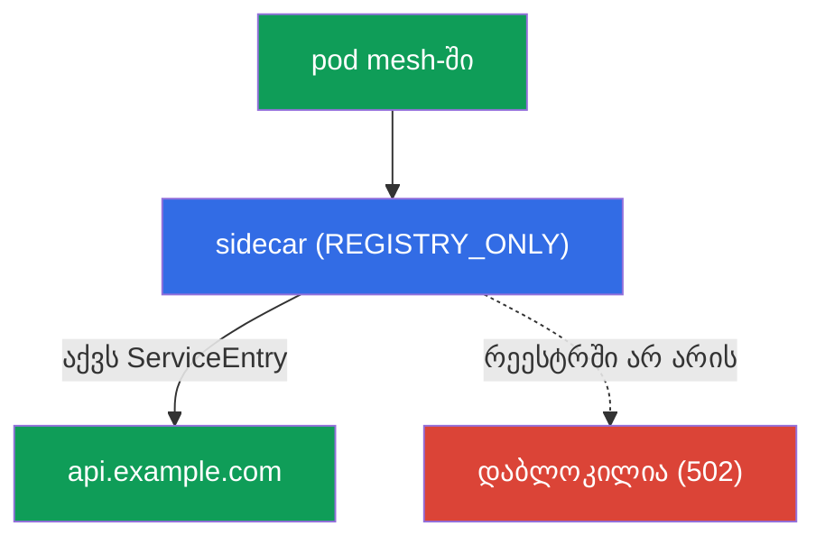
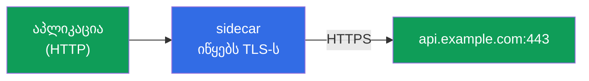
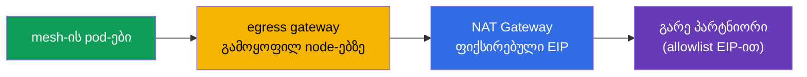

[Русская версия](ru.md) · [Eng version](en.md) · [Versión en español](es.md) · [Version française](fr.md) · [Deutsche Version](de.md) · [繁體中文版](tw.md) · [日本語版](jp.md)

# თავი 12. Egress: ServiceEntry, egress gateway, TLS origination

> **რა არის შემდეგ.** აქამდე ჩვენ ვმართავდით ტრაფიკს, რომელიც mesh-ში შემოდის და
> მის შიგნით გადაადგილდება. ახლა განვიხილოთ ტრაფიკი, რომელიც **გარეთ** გადის - გარე API-ებისკენ,
> მონაცემთა ბაზებისკენ, მესამე მხარის სერვისებისკენ. ნაგულისხმევად Istio ტრაფიკს ნებისმიერი მიმართულებით უშვებს, რაც
> უსაფრთხოების პრობლემაა. ამ თავში ვისწავლით egress-ის კონტროლს: გარე სერვისების
> რეგისტრაციას, მათ ერთიანი გასასვლელი წერტილის გავლით გაშვებას და ყველა ზედმეტი წვდომის აკრძალვას.

## 12.1. პრობლემა: ნაგულისხმევად გარეთ ყველაფერი დაშვებულია

ნაგულისხმევად Istio-ში გამავალი ტრაფიკის პოლიტიკაა `ALLOW_ANY` - ნებისმიერ pod-ს შეუძლია
ინტერნეტში ნებისმიერ მისამართს მიმართოს. შემუშავებისთვის ეს მოსახერხებელია, მაგრამ უსაფრთხოების
თვალსაზრისით ცუდია: თუ pod კომპრომეტირებულია, ის შეძლებს მონაცემების ნებისმიერ
გარე მისამართზე „გაჟონვას“ და ამას ვერც კი შეამჩნევთ.

კონტროლირებადი egress სამ ამოცანას წყვეტს:

- **ვიცოდეთ**, რომელ გარე სერვისებს მიმართავს mesh (`ServiceEntry`);
- **გავატაროთ** გარე ტრაფიკი ერთიანი წერტილის გავლით აუდიტისა და ფილტრაციისთვის
  (egress gateway);
- **ავკრძალოთ** ყველაფერი, რაც აშკარად დაშვებული არ არის (`REGISTRY_ONLY` + `Sidecar`).

## 12.2. ServiceEntry: გარე სერვისის რეგისტრაცია

Istio სერვისების შიდა რეესტრს აწარმოებს. შიდაკლასტერული სერვისები მასში Kubernetes-იდან
ავტომატურად ხვდება, ხოლო გარე სერვისების შესახებ (მაგალითად, `api.example.com`) Istio-მ არაფერი
იცის. `ServiceEntry` ამ რეესტრში გარე ჰოსტს ამატებს.

```yaml
apiVersion: networking.istio.io/v1
kind: ServiceEntry
metadata:
  name: external-api
spec:
  hosts:
  - api.example.com
  ports:
  - number: 443
    name: https
    protocol: TLS
  resolution: DNS          # სახელის რესოლვა DNS-ის მეშვეობით
  location: MESH_EXTERNAL  # სერვისი mesh-ის გარეთ
```

განვიხილოთ ველები:

- **`hosts`** - გარე DNS-სახელი, რომელსაც ვარეგისტრირებთ.
- **`ports`** - გარე სერვისის პორტი და პროტოკოლი.
- **`resolution: DNS`** - Envoy თავად ახდენს სახელის DNS-ით რეზოლვინგს (ასევე არსებობს `STATIC`
  ფიქსირებული IP-ებისთვის).
- **`location: MESH_EXTERNAL`** - სერვისი mesh-ის გარეთაა, ამიტომ მასზე mTLS არ ვრცელდება.

უფრო დაწვრილებით `resolution`-ის შესახებ:

- **`DNS`** - Envoy თავად ახდენს `hosts`-ის DNS-ით რეზოლვინგს (გამოდგება ჩვეულებრივი გარე API-ებისთვის,
  რომლებსაც დომენური სახელი აქვთ).
- **`STATIC`** - `endpoints` ბლოკში კონკრეტულ IP-ებს უთითებთ (მაგალითად, გარე მონაცემთა ბაზა
  ფიქსირებული მისამართებით):

  ```yaml
  spec:
    hosts:
    - db.external
    ports:
    - number: 5432
      name: tcp-postgres
      protocol: TCP
    resolution: STATIC
    location: MESH_EXTERNAL
    endpoints:
    - address: 10.0.50.10      # გარე სერვისის კონკრეტული IP
    - address: 10.0.50.11
  ```

- **`NONE`** - რეზოლვინგის გარეშე, ტრაფიკი destination IP-ის მიხედვით უცვლელად გადის (იმ შემთხვევებისთვის, როცა
  მისამართი წინასწარ უცნობია).

კიდევ რამდენიმე სასარგებლო ველი:

- **Wildcard-ჰოსტი.** `hosts`-ში შეგიძლიათ მიუთითოთ `*.example.com`, რათა ერთი ServiceEntry-ით
  ყველა ქვედომენი მოიცვათ.
- **`exportTo`** - რომელ namespace-ებში ჩანს ეს ServiceEntry (`.` - მხოლოდ საკუთარში, `*` - ყველაში).
  სასარგებლოა, რათა გარე სერვისზე ნებართვა მთელ კლასტერზე კი არა, მხოლოდ საჭირო ადგილებზე გავრცელდეს.

რატომ არის ეს საჭირო: `ServiceEntry`-ის გარეშე გარე სერვისს ვერც egress gateway-ის გავლით
დააროუტებთ და ვერც მკაცრ `REGISTRY_ONLY` რეჟიმში დაუშვებთ. ეს egress-ის
კონტროლის პირველი აგურია.

### Wildcard-ჰოსტები: ნიუანსები და egress gateway

`hosts`-ში wildcard (`*.example.com`) მოსახერხებელია, რათა ერთი `ServiceEntry`-ით ქვედომენების
ჯგუფი მოიცვათ, მაგრამ მას მნიშვნელოვანი შეზღუდვა აქვს: **wildcard-ის პირდაპირ DNS-რეზოლვინგი შეუძლებელია** -
DNS-ჩანაწერი `*.example.com` არ არსებობს და Envoy-მ არ იცის, პაკეტები სად გაგზავნოს. ამიტომ
ქცევა დამოკიდებულია იმაზე, რეალურად სად „ეშვება“ ქვედომენები:

- **ყველა ქვედომენი მისამართების საერთო ნაკრების უკანაა** (ტიპური მაგალითია `*.wikipedia.org`, სადაც ყველაფერს
  სერვერების ერთი პული ემსახურება). ამ შემთხვევაში უთითებენ `resolution: DNS`-ს და **აშკარა** endpoint-ს, სადაც
  რეალურად უნდა გადავიდეს ტრაფიკი:

  ```yaml
  apiVersion: networking.istio.io/v1
  kind: ServiceEntry
  metadata:
    name: wikipedia
    namespace: app
  spec:
    hosts:
    - "*.wikipedia.org"
    ports:
    - number: 443
      name: https
      protocol: TLS
    resolution: DNS
    endpoints:
    - address: www.wikipedia.org    # საერთო მისამართი, სადაც რესოლვდება ყველა ქვედომენი
  ```

- **ნებისმიერი, დამოუკიდებელი ქვედომენები** (თითოეული საკუთარ მისამართში რეზოლვდება). აქ DNS
  ვერ დაგვეხმარება - იყენებენ `resolution: NONE`-ს (Envoy ტრაფიკს SNI/destination IP-ის მიხედვით ატარებს
  და არაფერს არეზოლვებს):

  ```yaml
  spec:
    hosts:
    - "*.example.com"
    ports:
    - number: 443
      name: tls
      protocol: TLS
    resolution: NONE               # რესოლვის გარეშე, მარშრუტი SNI/IP-ით როგორც არის
    location: MESH_EXTERNAL
  ```

შეზღუდვები, რომლებზეც ხშირად წამოეგებიან:

- **ცალკე `*` არ გამოიყენება** - საჭიროა დომენური სუფიქსი (`*.example.com`), წინააღმდეგ შემთხვევაში ეს ნიშნავს „ტრაფიკის
  ნებისმიერ მიმართულებით გაშვებას“, რაც `REGISTRY_ONLY`-ის არსს ეწინააღმდეგება.
- Wildcard მხოლოდ ქვედომენების ზედა დონისთვის მუშაობს: `*.example.com` ემთხვევა
  `a.example.com`-ს, მაგრამ არა `a.b.example.com`-ს.

**egress gateway**-ის გავლით wildcard-ს SNI-ის მიხედვით მარშრუტიზაციით (`tls` რეჟიმში
`PASSTHROUGH`) უშვებენ და არა ზუსტი ჰოსტით - gateway-ის `sniHosts`-სა და `hosts`-ში თავად wildcard-ს უთითებენ.
სქემა იგივე ოთხრესურსიანია, რაც 12.4-ში, იცვლება მხოლოდ ჰოსტები:

```yaml
apiVersion: networking.istio.io/v1
kind: Gateway
metadata:
  name: istio-egressgateway
  namespace: istio-system
spec:
  selector:
    istio: egressgateway
  servers:
  - port:
      number: 443
      name: tls
      protocol: TLS
    hosts:
    - "*.example.com"             # wildcard პირდაპირ gateway-ის listener-ზე
    tls:
      mode: PASSTHROUGH
---
apiVersion: networking.istio.io/v1
kind: VirtualService
metadata:
  name: wildcard-via-egress
  namespace: istio-system
spec:
  hosts:
  - "*.example.com"
  gateways:
  - mesh
  - istio-egressgateway
  tls:
  - match:
    - gateways: [mesh]
      sniHosts: ["*.example.com"]          # SNI-მატჩი wildcard-ით, არა ზუსტი ჰოსტით
    route:
    - destination:
        host: istio-egressgateway.istio-system.svc.cluster.local
        subset: api-egress
        port:
          number: 443
  - match:
    - gateways: [istio-egressgateway]
      sniHosts: ["*.example.com"]
    route:
    - destination:
        host: "*.example.com"              # გავუშვათ გარეთ SNI-ით
        port:
          number: 443
```

> **შეამოწმეთ მუშაობა.** დაშვებული ქვედომენი უნდა გაიხსნას, ხოლო wildcard-ის მიღმა მყოფი ჰოსტი -
> `REGISTRY_ONLY`-ზე შეჩერდეს:
>
> ```bash
> kubectl exec deploy/sleep -n app -- curl -sS -o /dev/null -w "%{http_code}\n" \
>   https://a.example.com          # ველოდებით 200 (რეესტრში wildcard-ით)
> kubectl exec deploy/sleep -n app -- curl -sS -o /dev/null -w "%{http_code}\n" \
>   https://api.other.com          # ველოდებით შეცდომას/502 (რეესტრში არ არის)
> ```

პრაქტიკული რჩევა იგივე რჩება: wildcard - ეს არის კომპრომისი მოხერხებულობასა და კონტროლის
სიზუსტეს შორის. რაც უფრო ფართოა `*`, მით ნაკლები იცით, რეალურად სად დადის mesh, ამიტომ production-ში
უპირატესობას ზუსტ ჰოსტებს ანიჭებენ, wildcard-ს კი გააზრებულად იყენებენ (მაგალითად, CDN-ისთვის ან ღრუბლოვანი
სერვისისთვის, რომელსაც არაპროგნოზირებადი ქვედომენები აქვს).

### DNS proxying: რეზოლვინგი Istio-ს საშუალებით

ნაგულისხმევად აპლიკაციის DNS-მოთხოვნები kube-DNS-ში (CoreDNS) მიდის, Istio კი მათ არ ეხება.
ამას შეზღუდვები აქვს: აპლიკაცია რეალური DNS-ჩანაწერების გარეშე `ServiceEntry`-ის ჰოსტებს ვერ
არეზოლვებს (განსაკუთრებით `resolution: STATIC`/`NONE`-ის შემთხვევაში), ხოლო თითოეულ გარე მოთხოვნას
CoreDNS-თან მიმართვა ახლავს.

Istio-ს შეუძლია **DNS proxy** აამუშაოს: უშუალოდ pod-ში istio-agent პასუხობს DNS-მოთხოვნებს, რადგან
იცის mesh-ის რეესტრი (კლასტერის სერვისები და `ServiceEntry`-ის ჰოსტები). ეს MeshConfig-ით ირთვება:

```yaml
meshConfig:
  defaultConfig:
    proxyMetadata:
      ISTIO_META_DNS_CAPTURE: "true"        # DNS-ის გადაჭერა data plane-ში
      ISTIO_META_DNS_AUTO_ALLOCATE: "true"  # ვირტუალური IP-ების გაცემა უმისამართო ServiceEntry ჰოსტებზე
```

(იგივე შეგიძლიათ ცალკეული pod-ისთვის `proxy.istio.io/config` ანოტაციით ჩართოთ). რას გვაძლევს ეს:

- **ServiceEntry-ის ჰოსტები ლოკალურად რეზოლვდება** - მნიშვნელოვანია DNS-ჩანაწერების არმქონე გარე TCP-სერვისებისთვის;
  `DNS_AUTO_ALLOCATE`-ით Istio მათ ვირტუალურ IP-ებს ანიჭებს, რათა მარშრუტიზაცია უფრო ზუსტი იყოს (წინააღმდეგ შემთხვევაში
  ერთ პორტზე არსებული რამდენიმე TCP-სერვისი destination IP-ით ერთმანეთისგან ვერ განსხვავდება).
- **CoreDNS-ზე ნაკლები დატვირთვაა** და პასუხიც უფრო სწრაფია (რეზოლვინგი pod-ში ლოკალურად ხდება).
- **ambient**-სა და **VM**-ზე (თავი 29) DNS proxy კლასტერის სახელების რეზოლვინგის სტანდარტული მეთოდია.

## 12.3. REGISTRY_ONLY: ყველა ზედმეტის აკრძალვა

ახლა კონტროლი გავამკაცროთ: mesh გადავიყვანოთ რეჟიმში, სადაც გარეთ წვდომა **მხოლოდ**
რეგისტრირებულ სერვისებთან არის შესაძლებელი. ეს არის `outboundTrafficPolicy.mode: REGISTRY_ONLY`.

მისი დაყენება შეიძლება გლობალურად (ინსტალაციისას MeshConfig-ში) ან კონკრეტული namespace-ისთვის
`Sidecar` რესურსით:

```yaml
apiVersion: networking.istio.io/v1
kind: Sidecar
metadata:
  name: default            # default სახელი = პოლიტიკა მთელ namespace-ზე
  namespace: app
spec:
  outboundTrafficPolicy:
    mode: REGISTRY_ONLY     # გარეთ მხოლოდ ის, რაც რეესტრშია
```

ამის შემდეგ `ServiceEntry`-ით რეგისტრირებულ ჰოსტზე მოთხოვნა გაივლის, ხოლო ნებისმიერ
სხვაზე - დაიბლოკება (Envoy დააბრუნებს შეცდომას, ჩვეულებრივ `502`-ს).



ეს default-deny პრინციპის egress-ანალოგია: საჭირო გარე სერვისებს აშკარად ვუშვებთ
`ServiceEntry`-ის საშუალებით, დანარჩენი ყველაფერი აკრძალულია. `Sidecar` რესურსს უფრო დაწვრილებით მე-19
თავში განვიხილავთ (იქ ის proxy-ის კონფიგურაციის ოპტიმიზაციისთვის გამოიყენება).

## 12.4. Egress gateway: ერთიანი გასასვლელი წერტილი

`ServiceEntry` + `REGISTRY_ONLY` უკვე გვაძლევს კონტროლს: ცნობილია, სად შეიძლება წვდომა, დანარჩენი
დახურულია. თუმცა ტრაფიკი ჯერ კიდევ თითოეული pod-ის sidecar-იდან პირდაპირ გადის გარეთ. ხშირად საჭიროა
მთელი გარე ტრაფიკის **ერთი წერტილის** - egress gateway-ის გავლით გატარება. ეს მოსახერხებელია
აუდიტისთვის, ლოგირებისა და პოლიტიკების ერთ ადგილას გამოსაყენებლად (გარდა ამისა, გარე firewall-ს შეუძლია
გამავალი ტრაფიკი მხოლოდ ამ gateway-ის IP-დან დაუშვას).


egress gateway-ის გამართვა ყველაზე ვრცელი ნაწილია: საჭიროა ოთხი რესურსი. ვგულისხმობთ,
რომ `api.example.com`-ისთვის `ServiceEntry` (პორტი 443, TLS) 12.2-დან უკვე შექმნილია, ხოლო თავად
egress gateway გაშვებულია (pod-ის ჭდე `istio: egressgateway`).

**1. Gateway** - egress gateway-ს საჭირო გამავალი ჰოსტის მოსასმენად აყენებს:

```yaml
apiVersion: networking.istio.io/v1
kind: Gateway
metadata:
  name: istio-egressgateway
  namespace: istio-system
spec:
  selector:
    istio: egressgateway        # გამოვიყენოთ egress gateway-ის pod-ებზე
  servers:
  - port:
      number: 443
      name: tls
      protocol: TLS
    hosts:
    - api.example.com
    tls:
      mode: PASSTHROUGH         # ტრაფიკი უკვე დაშიფრულია აპლიკაციის მიერ, gateway არ შიფრავს
```

**2. DestinationRule** - აცხადებს gateway-ის subset-ს, რომელსაც VirtualService მიმართავს:

```yaml
apiVersion: networking.istio.io/v1
kind: DestinationRule
metadata:
  name: egressgateway-for-api
  namespace: istio-system
spec:
  host: istio-egressgateway.istio-system.svc.cluster.local
  subsets:
  - name: api-egress            # subset, რომელზეც მივმართავთ ტრაფიკს mesh-იდან
```

**3. VirtualService** - ორეტაპიანი მარშრუტიზაცია. ერთი და იგივე მოთხოვნა ორ „ნახტომს“ ასრულებს:
ჯერ pod → egress gateway, შემდეგ egress gateway → გარე სერვისი:

```yaml
apiVersion: networking.istio.io/v1
kind: VirtualService
metadata:
  name: route-via-egress
  namespace: istio-system
spec:
  hosts:
  - api.example.com
  gateways:
  - mesh                        # ეტაპი 1: ტრაფიკი sidecar pod-ებიდან
  - istio-egressgateway         # ეტაპი 2: ტრაფიკი, რომელიც მოვიდა egress gateway-ზე
  tls:
  - match:
    - gateways: [mesh]                     # ეტაპი 1: mesh-იდან...
      sniHosts: [api.example.com]
    route:
    - destination:
        host: istio-egressgateway.istio-system.svc.cluster.local
        subset: api-egress                 # ...მივმართავთ egress gateway-ზე
        port:
          number: 443
  - match:
    - gateways: [istio-egressgateway]      # ეტაპი 2: egress gateway-ზე...
      sniHosts: [api.example.com]
    route:
    - destination:
        host: api.example.com              # ...გავუშვათ გარეთ
        port:
          number: 443
```

აქ ტრაფიკი უკვე TLS-ითაა დაცული (აპლიკაცია თავად შიფრავს), ამიტომ მარშრუტიზაცია `sniHosts`-ით ხდება, gateway კი
`PASSTHROUGH` რეჟიმშია. თუ საჭიროა, რომ TLS თავად gateway-მ დაიწყოს, ამას egress gateway-ზე
`http` მარშრუტით + TLS origination-ით აკეთებენ (განყოფილება 12.5).

იმის შემოწმება, რომ ტრაფიკი ნამდვილად gateway-ის გავლით მიდის, მისი ლოგებით შეიძლება:

```bash
kubectl logs -n istio-system -l istio=egressgateway --tail=20 | grep api.example.com
```

> **მნიშვნელოვანია: egress gateway თავისთავად უსაფრთხოების საზღვარი არ არის.** თუ pod-ს გარეთ
> პირდაპირ გასვლა შეუძლია, ის უბრალოდ გვერდს აუვლის gateway-ს. Egress gateway-ს აზრი მხოლოდ
> `REGISTRY_ONLY`-თან (12.3) და/ან Kubernetes `NetworkPolicy`-სთან ერთად აქვს, რომლებიც pod-ებს gateway-ის
> გვერდის ავლით გამავალ ტრაფიკს უკრძალავს. წინააღმდეგ შემთხვევაში ეს მხოლოდ „რეკომენდებული მარშრუტია“ და არა კონტროლი.

## 12.5. TLS origination

კიდევ ერთი სასარგებლო მეთოდი. ზოგჯერ აპლიკაცია გარე სერვისს ჩვეულებრივი HTTP-ით უკავშირდება,
მაგრამ საჭიროა, რომ გარეთ ტრაფიკი HTTPS-ით გავიდეს. რა თქმა უნდა, შეიძლება TLS აპლიკაციის კოდში
დაემატოს, მაგრამ ამის mesh-ისთვის მინდობა უფრო მარტივია. **TLS origination** ნიშნავს, რომ აპლიკაცია
უბრალო HTTP-ს აგზავნის, ხოლო sidecar (ან egress gateway) თავად ამყარებს TLS-კავშირს სამიზნე
სერვისთან.



ეს გარე ჰოსტისთვის `tls.mode: SIMPLE`-ის მქონე `DestinationRule`-ით იმართება:

```yaml
apiVersion: networking.istio.io/v1
kind: DestinationRule
metadata:
  name: external-api-tls
spec:
  host: api.example.com
  trafficPolicy:
    tls:
      mode: SIMPLE      # sidecar თავად ამყარებს TLS-ს გარეთ
```

`ServiceEntry`-სთან ერთად (სადაც გარე პორტი HTTP 80-ადაა გამოცხადებული, რეალური სერვისი კი
443-ს უსმენს) ეს აპლიკაციას `http://api.example.com`-ზე მიმართვის საშუალებას აძლევს, გარეთ კი ტრაფიკი
უკვე დაშიფრული გადის. აპლიკაციის კოდი მარტივი რჩება, სერტიფიკატებთან და
TLS-თან მუშაობას კი ერთგვაროვნად mesh იღებს საკუთარ თავზე.

**mTLS გარეთ (`mode: MUTUAL`).** თუ გარე სერვისი კლიენტის სერტიფიკატს
(ორმხრივ TLS-ს) მოითხოვს, mesh-ს შეუძლია თავად წარადგინოს იგი - ამ შემთხვევაში `DestinationRule`-ში უთითებენ
`mode: MUTUAL`-სა და სერტიფიკატების ბმულებს (`credentialName`-ით Secret-ზე ან ფაილების ბილიკებით):

```yaml
  trafficPolicy:
    tls:
      mode: MUTUAL              # კლიენტის სერტიფიკატის წარდგენა გარე სერვისს
      credentialName: api-client-cert   # Secret კლიენტის სერტიფიკატითა და გასაღებით
```

ამრიგად, აპლიკაცია კვლავ უბრალო HTTP-ს აგზავნის, mesh კი გარეთ საჭირო კლიენტის
სერტიფიკატით mTLS-კავშირს ამყარებს.

არ აგერიოთ მე-9 თავის TLS-რეჟიმებში: იქ (SIMPLE/MUTUAL/PASSTHROUGH) საუბარია
ingress gateway-ის **შემომავალ** ტრაფიკზე. TLS origination ეხება **გამავალ** ტრაფიკს,
რომელსაც mesh გარეთ მიმავალ გზაზე შიფრავს.

## 12.6. Egress EKS/AWS-ში: სტატიკური IP და allowlist

production-ის გავრცელებული ამოცანა: გარე პარტნიორი (საგადახდო gateway, სხვისი API) ითხოვს, რომ მასთან მოთხოვნები
**ცნობილი IP-დან** მოდიოდეს, რათა თავის allowlist-ში დაამატოს. ჩვეულებრივ EKS-ში
pod-ები ინტერნეტში **NAT Gateway**-ის გავლით გადიან და გარედან მისი Elastic IP ჩანს. მაგრამ თუ node და
NAT gateway რამდენიმეა (თითო AZ-ზე ერთი), გამავალი მისამართიც რამდენიმე იქნება.

Egress gateway ყველაფრის მისამართების პროგნოზირებად ნაკრებამდე დაყვანაში გვეხმარება:

- mesh-ის მთელი გარე ტრაფიკი **egress gateway**-ის გავლით მიდის (12.4), ხოლო `REGISTRY_ONLY` +
  `NetworkPolicy` pod-ებს გვერდის ავლით წასვლის საშუალებას არ აძლევს.
- Egress gateway-ის pod-ები node-ების გამოყოფილ პულზე მაგრდება (`nodeSelector`/`affinity`-ით),
  ხოლო node-ების ეს პული ინტერნეტში **ფიქსირებული Elastic IP-ის მქონე ერთი NAT Gateway**-ის გავლით გადის.
- პარტნიორი allowlist-ში სწორედ ამ EIP-ს ამატებს.



მნიშვნელოვანია როლების გამიჯვნა: **თავად egress gateway გარე IP-ს არ იძლევა** - გარე მისამართს
NAT Gateway (ან node-ის საჯარო IP) განსაზღვრავს. Egress gateway მხოლოდ მთელ გამავალ
ტრაფიკს ერთ წერტილში აგროვებს, რათა მან პროგნოზირებადი node-ების და, შესაბამისად,
პროგნოზირებადი NAT EIP-ის გავლით გაიაროს. egress gateway-ზე კონცენტრაციის გარეშე ტრაფიკი ყველა
node-სა და ყველა AZ-ის NAT gateway-ზე გაიფანტებოდა.

## 12.7. საუკეთესო პრაქტიკები

- **production-ში `ALLOW_ANY` არ დატოვოთ.** mesh (ან სულ მცირე, მგრძნობიარე
  namespace-ები) `REGISTRY_ONLY`-ზე გადაიყვანეთ და გარე სერვისები აშკარა `ServiceEntry`-ებით დაუშვით.
- **Egress gateway - მხოლოდ გვერდის ავლის შეზღუდვასთან ერთად.** თავისთავად ის უსაფრთხოების
  საზღვარი არ არის; pod-ების პირდაპირი წვდომა `REGISTRY_ONLY`-ით და/ან `NetworkPolicy`-ით დახურეთ.
- **მინიმუმამდე შეამცირეთ `ServiceEntry`.** ფართო wildcard-ების ნაცვლად გამოიყენეთ ზუსტი ჰოსტები; ხილვადობის
  არე `exportTo`-თი შეზღუდეთ, რათა ნებართვა მთელ კლასტერზე არ გავრცელდეს.
- **გამავალი ტრაფიკი TLS origination-ით დაშიფრეთ** და არა აპლიკაციის კოდში - ეს ერთგვაროვანია
  და სერტიფიკატების ცენტრალიზებულ მართვას უზრუნველყოფს (`MUTUAL`, თუ პარტნიორი mTLS-ს მოითხოვს).
- **IP allowlist-ისთვის** egress გამოყოფილი node-ების გავლით, ფიქსირებული NAT
  EIP-ით მოახდინეთ (12.6); გახსოვდეთ, რომ მისამართს NAT/node იძლევა და არა თავად gateway.
- **ჩაატარეთ egress-ის აუდიტი.** Egress gateway-ის ლოგები მოსახერხებელი ერთიანი წერტილია იმის სანახავად, სად და
  რა სიხშირით მიმართავს mesh.

## 12.8. თავის შეჯამება

- ნაგულისხმევად egress `ALLOW_ANY` რეჟიმშია - გარეთ წვდომა ყველგან შეიძლება, რაც უსაფრთხოების
  რისკია.
- **ServiceEntry** გარე სერვისს mesh-ის რეესტრში არეგისტრირებს; მის გარეშე გარე ჰოსტს
  ვერც დააროუტებთ და ვერც `REGISTRY_ONLY`-ში დაუშვებთ.
- **REGISTRY_ONLY** (MeshConfig-ის ან `Sidecar`-ის საშუალებით) გარეთ წვდომას მხოლოდ
  რეგისტრირებულ სერვისებთან უშვებს - ეს default-deny-ის egress-ანალოგია.
- **Egress gateway** აუდიტისა და ფილტრაციისთვის ერთიან გასასვლელ წერტილს ქმნის; იგი
  Gateway + DestinationRule + VirtualService-ით და ორეტაპიანი მარშრუტიზაციით იმართება.
- **ServiceEntry** მოქნილია `resolution`-ის მხრივ (`DNS`/`STATIC`/`NONE`), wildcard-ჰოსტებს
  და `exportTo`-თი ხილვადობის შეზღუდვას უჭერს მხარს.
- **Wildcard-ჰოსტების** (`*.example.com`) პირდაპირ DNS-რეზოლვინგი შეუძლებელია: საერთო მისამართისთვის გამოიყენება
  `resolution: DNS` აშკარა `endpoints`-ით, ნებისმიერი ქვედომენისთვის კი - `resolution: NONE`;
  egress gateway-ის გავლით ისინი SNI-ით გადის (`sniHosts: ["*.example.com"]`, `PASSTHROUGH`).
- **DNS proxying** (`ISTIO_META_DNS_CAPTURE`) სახელებს istio-agent-ის საშუალებით არეზოლვებს: ის
  ServiceEntry-ის ჰოსტებს რეზოლვირებადს ხდის (`DNS_AUTO_ALLOCATE`-ით - ვირტუალური IP-ები მისამართის არმქონე ჰოსტებისთვის),
  CoreDNS-ს განტვირთავს; სტანდარტულად გამოიყენება ambient-სა და VM-ზე.
- **Egress gateway თავისთავად უსაფრთხოების საზღვარი არ არის**: ის მხოლოდ
  `REGISTRY_ONLY`-თან და/ან `NetworkPolicy`-სთან ერთად მუშაობს, წინააღმდეგ შემთხვევაში pod მას პირდაპირ გვერდს აუვლის.
- **TLS origination** აპლიკაციას HTTP-ით მუშაობის საშუალებას აძლევს, ხოლო mesh თავად შიფრავს ტრაფიკს
  გარეთ (DestinationRule `tls.mode: SIMPLE`; `MUTUAL` - თუ კლიენტის სერტიფიკატია საჭირო).
- EKS-ში **IP allowlist-ისთვის** ტრაფიკი egress gateway-ის გავლით, ფიქსირებული
  NAT EIP-ის მქონე გამოყოფილ node-ებზე კონცენტრირდება; გარე მისამართს NAT Gateway განსაზღვრავს და არა თავად gateway.
- Edge TLS (თავი 9) შემომავალ ტრაფიკს ეხება, TLS origination კი - გამავალს.

## 12.9. თვითშემოწმების კითხვები

1. რატომ არის ნაგულისხმევი `ALLOW_ANY` რეჟიმი სახიფათო?
2. რისთვის არის საჭირო `ServiceEntry` და რა მოხდება მის გარეშე `REGISTRY_ONLY` რეჟიმში?
3. როგორ ახორციელებს `REGISTRY_ONLY` რეჟიმი egress-ისთვის default-deny პრინციპს?
4. რატომ უნდა გავატაროთ გარე ტრაფიკი egress gateway-ის გავლით, თუ კონტროლი უკვე არსებობს?
5. რა არის TLS origination და რით განსხვავდება ის მე-9 თავის edge TLS-ისგან? რას ამატებს
   `MUTUAL` რეჟიმი?
6. რატომ არ არის egress gateway თავისთავად უსაფრთხოების საზღვარი? რა უნდა დაემატოს?
7. რით განსხვავდება ServiceEntry-ში `resolution: DNS`, `STATIC` და `NONE`?
8. რა არის DNS proxying Istio-ში და რისთვის არის საჭირო `DNS_AUTO_ALLOCATE`?
9. როგორ უნდა მოვაწყოთ EKS-ში, რომ გარე პარტნიორისკენ მოთხოვნები allowlist-ისთვის ცნობილი IP-დან
   გავიდეს? კონკრეტულად რა განსაზღვრავს გამავალ მისამართს?
10. რატომ არ შეიძლება wildcard-ჰოსტის პირდაპირ DNS-რეზოლვინგი და რომელი `resolution` უნდა ავირჩიოთ
    საერთო მისამართისთვის, ხოლო რომელი - ნებისმიერი ქვედომენისთვის? როგორ გავატაროთ wildcard egress
    gateway-ის გავლით?

## პრაქტიკა

დაამუშავეთ egress-ის სრული კონტროლი: ServiceEntry, egress gateway და REGISTRY_ONLY:

🧪 ლაბორატორია 05: [tasks/ica/labs/05](../../labs/05/README_GE.MD)

დაამუშავეთ TLS origination (TLS-ის ინიციაცია mesh-ის მხარეს):

🧪 ლაბორატორია 22: [tasks/ica/labs/22](../../labs/22/README_GE.MD)

---
[სარჩევი](../README_GE.md) · [თავი 11](../11/ge.md) · [თავი 13](../13/ge.md)