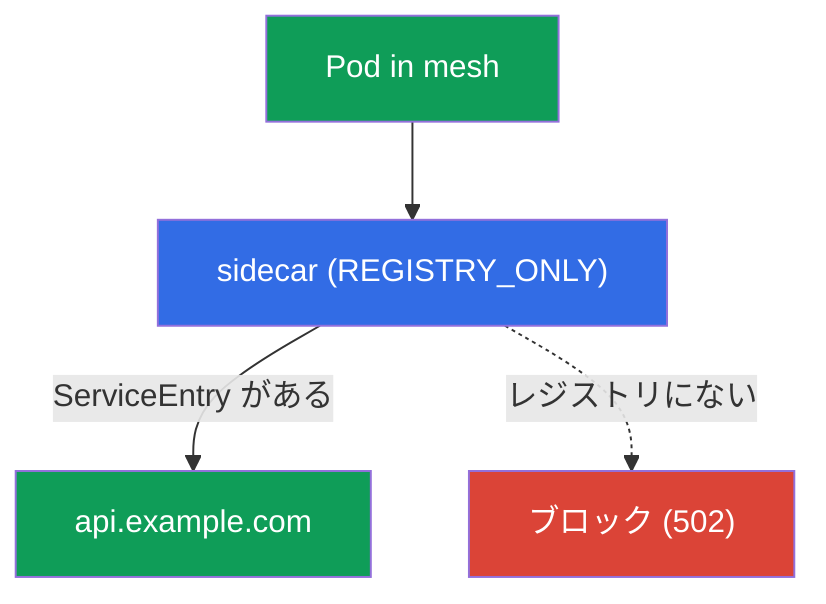
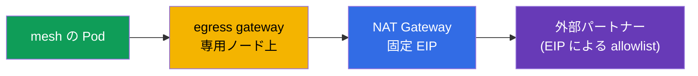

[Русская версия](ru.md) · [Eng version](en.md) · [Versión en español](es.md) · [Version française](fr.md) · [Deutsche Version](de.md) · [ქართული ვერსია](ge.md) · [繁體中文版](tw.md)

# 第12章 Egress: ServiceEntry、egress gateway、TLS origination

> **次は何か。** これまで、mesh に入ってくるトラフィックと、mesh 内部を流れるトラフィックを管理してきました。ここからは **外部**、すなわち外部 API、データベース、サードパーティサービスへ出ていくトラフィックを扱います。デフォルトでは Istio はトラフィックをどこへでも出せますが、これはセキュリティ上の問題です。この章では、egress を制御する方法、すなわち外部サービスの登録、単一の出口を経由した通信、不要な通信の禁止を学びます。

## 12.1. 問題: デフォルトでは外部へ何でも送れる

デフォルトで Istio の送信トラフィックポリシーは `ALLOW_ANY` です。つまり、どの Pod もインターネット上の任意のアドレスに接続できます。開発には便利ですが、セキュリティの観点では望ましくありません。Pod が侵害されると、任意の外部アドレスへデータを「流出」させることができ、気付かない可能性さえあります。

制御された egress は、3つの課題を解決します。

- mesh がどの外部サービスに接続しているかを**把握する**（`ServiceEntry`）。
- 監査とフィルタリングのため、外部トラフィックを単一の出口に**通す**（egress gateway）。
- 明示的に許可されていないものをすべて**禁止する**（`REGISTRY_ONLY` + `Sidecar`）。

## 12.2. ServiceEntry: 外部サービスを登録する

Istio はサービスの内部レジストリを管理しています。クラスタ内サービスは Kubernetes から自動的に登録されますが、外部サービス（たとえば `api.example.com`）については Istio は何も知りません。`ServiceEntry` はこのレジストリに外部ホストを追加します。

```yaml
apiVersion: networking.istio.io/v1
kind: ServiceEntry
metadata:
  name: external-api
spec:
  hosts:
  - api.example.com
  ports:
  - number: 443
    name: https
    protocol: TLS
  resolution: DNS          # 名前を DNS で解決する
  location: MESH_EXTERNAL  # mesh 外部のサービス
```

フィールドを見ていきましょう。

- **`hosts`**: 登録する外部 DNS 名です。
- **`ports`**: 外部サービスのポートとプロトコルです。
- **`resolution: DNS`**: Envoy が DNS で名前を解決します（固定 IP 向けの `STATIC` もあります）。
- **`location: MESH_EXTERNAL`**: サービスは mesh の外部にあり、mTLS は適用されません。

`resolution` の詳細です。

- **`DNS`**: Envoy が DNS 経由で `hosts` を解決します（ドメイン名を使用する通常の外部 API に適しています）。
- **`STATIC`**: `endpoints` ブロックで特定の IP を指定します（たとえば、固定アドレスを持つ外部 DB）。

  ```yaml
  spec:
    hosts:
    - db.external
    ports:
    - number: 5432
      name: tcp-postgres
      protocol: TCP
    resolution: STATIC
    location: MESH_EXTERNAL
    endpoints:
    - address: 10.0.50.10      # 外部サービスの具体的な IP
    - address: 10.0.50.11
  ```

- **`NONE`**: 名前解決なしで、トラフィックは destination IP のまま通過します（アドレスが事前に不明な場合に使用します）。

さらに便利なフィールドがいくつかあります。

- **Wildcard ホスト。** `hosts` に `*.example.com` を指定すると、1つの ServiceEntry で全サブドメインを対象にできます。
- **`exportTo`**: この ServiceEntry を表示できる namespace（`.` は自身のみ、`*` はすべて）です。外部サービスへの許可をクラスタ全体ではなく、限定的に適用する場合に役立ちます。

なぜ必要なのでしょうか。`ServiceEntry` がなければ、外部サービスを egress gateway 経由でルーティングすることも、厳格な `REGISTRY_ONLY` モードで許可することもできません。これは egress 制御の最初の構成要素です。

### Wildcard ホスト: 注意点と egress gateway

`hosts` の Wildcard（`*.example.com`）は、1つの `ServiceEntry` で多数のサブドメインを対象にするのに便利ですが、重要な制約があります。**wildcard を直接 DNS 解決することはできません**。DNS レコード `*.example.com` は存在せず、Envoy はパケットの送信先を知ることができないためです。そのため、実際にサブドメインがどのように到達先へ解決されるかによって動作が異なります。

- **すべてのサブドメインが共通のアドレス群の背後にある場合**（典型例は `*.wikipedia.org` で、すべてが1つのサーバープールで処理される場合）。この場合は `resolution: DNS` と、実際に接続する**明示的な** endpoint を指定します。

  ```yaml
  apiVersion: networking.istio.io/v1
  kind: ServiceEntry
  metadata:
    name: wikipedia
    namespace: app
  spec:
    hosts:
    - "*.wikipedia.org"
    ports:
    - number: 443
      name: https
      protocol: TLS
    resolution: DNS
    endpoints:
    - address: www.wikipedia.org    # すべてのサブドメインが解決される共通アドレス
  ```

- **任意で独立したサブドメイン**（各々が異なるアドレスに解決される場合）。ここでは DNS は役に立ちません。`resolution: NONE` を使います（Envoy は何も解決せず、SNI/destination IP に従ってトラフィックを通します）。

  ```yaml
  spec:
    hosts:
    - "*.example.com"
    ports:
    - number: 443
      name: tls
      protocol: TLS
    resolution: NONE               # 解決せず、SNI/IP のまま転送する
    location: MESH_EXTERNAL
  ```

つまずきやすい制約は以下です。

- **裸の `*` は指定しません**。ドメインサフィックス（`*.example.com`）が必要です。そうしないと「どこにでも出せる」ことになり、`REGISTRY_ONLY` の目的に反します。
- Wildcard が動作するのは最上位のサブドメインだけです。`*.example.com` は `a.example.com` にはマッチしますが、`a.b.example.com` にはマッチしません。

**egress gateway** 経由で wildcard を通す場合、正確なホストではなく SNI（`PASSTHROUGH` モードの `tls`）でルーティングします。`sniHosts` と gateway の `hosts` に wildcard 自体を指定します。構成は 12.4 と同じ4リソースで、異なるのはホストだけです。

```yaml
apiVersion: networking.istio.io/v1
kind: Gateway
metadata:
  name: istio-egressgateway
  namespace: istio-system
spec:
  selector:
    istio: egressgateway
  servers:
  - port:
      number: 443
      name: tls
      protocol: TLS
    hosts:
    - "*.example.com"             # gateway の listener に直接 wildcard
    tls:
      mode: PASSTHROUGH
---
apiVersion: networking.istio.io/v1
kind: VirtualService
metadata:
  name: wildcard-via-egress
  namespace: istio-system
spec:
  hosts:
  - "*.example.com"
  gateways:
  - mesh
  - istio-egressgateway
  tls:
  - match:
    - gateways: [mesh]
      sniHosts: ["*.example.com"]          # 正確なホストではなく wildcard で SNI 一致
    route:
    - destination:
        host: istio-egressgateway.istio-system.svc.cluster.local
        subset: api-egress
        port:
          number: 443
  - match:
    - gateways: [istio-egressgateway]
      sniHosts: ["*.example.com"]
    route:
    - destination:
        host: "*.example.com"              # SNI に基づき外部へ送出
        port:
          number: 443
```

> **動作を確認してください。** 許可されたサブドメインは通過し、wildcard 外のホストは `REGISTRY_ONLY` によって拒否される必要があります。
>
> ```bash
> kubectl exec deploy/sleep -n app -- curl -sS -o /dev/null -w "%{http_code}\n" \
>   https://a.example.com          # 200 を期待 (wildcard でレジストリにある)
> kubectl exec deploy/sleep -n app -- curl -sS -o /dev/null -w "%{http_code}\n" \
>   https://api.other.com          # エラー/502 を期待 (レジストリにない)
> ```

実践的な助言は変わりません。wildcard は利便性と制御精度の間のトレードオフです。`*` が広いほど、mesh が実際にどこへ接続しているかの把握は難しくなります。そのため本番では正確なホストが推奨され、wildcard は意識的に使用します（たとえば CDN や、予測不能なサブドメインを持つクラウドサービス向け）。

### DNS proxying: Istio による名前解決

デフォルトでは、アプリケーションの DNS リクエストは kube-DNS（CoreDNS）に送られ、Istio は関与しません。これには制約があります。アプリケーションは実際の DNS レコードがない `ServiceEntry` のホストを解決できず（特に `resolution: STATIC`/`NONE`）、外部リクエストごとに CoreDNS への問い合わせが行われます。

Istio は **DNS proxy** を起動できます。Pod 内の istio-agent が、mesh レジストリ（クラスタサービスと `ServiceEntry` ホスト）を認識して DNS リクエストに直接応答します。MeshConfig で有効化します。

```yaml
meshConfig:
  defaultConfig:
    proxyMetadata:
      ISTIO_META_DNS_CAPTURE: "true"        # data plane で DNS を捕捉する
      ISTIO_META_DNS_AUTO_ALLOCATE: "true"  # アドレスのない ServiceEntry ホストに仮想 IP を割り当てる
```

（Pod アノテーション `proxy.istio.io/config` を使って個別に有効化することもできます）。これにより次が得られます。

- **ServiceEntry ホストがローカルで解決される**ため、DNS レコードのない外部 TCP サービスで重要です。`DNS_AUTO_ALLOCATE` により Istio はアドレスを持たないホストに仮想 IP を割り当て、より正確にルーティングできます（割り当てない場合、同じポート上の複数 TCP サービスを destination IP で区別できません）。
- **CoreDNS の負荷が減り**、応答も速くなります（Pod 内でローカルに名前解決されます）。
- **ambient** と **VM**（第29章）では、DNS proxy がクラスタ名を解決する標準的な方法です。

## 12.3. REGISTRY_ONLY: 不要な通信をすべて禁止する

次に制限を強化します。外部へ接続できるのは**登録済み**サービスだけ、というモードに mesh を切り替えます。これは `outboundTrafficPolicy.mode: REGISTRY_ONLY` です。

グローバルに（インストール時の MeshConfig で）設定することも、`Sidecar` リソースを使って namespace 単位で設定することもできます。

```yaml
apiVersion: networking.istio.io/v1
kind: Sidecar
metadata:
  name: default            # 名前 default = namespace 全体に対するポリシー
  namespace: app
spec:
  outboundTrafficPolicy:
    mode: REGISTRY_ONLY     # レジストリにあるものだけ外部へ
```

この後、`ServiceEntry` で登録されたホストへのリクエストは通過しますが、その他すべてへのリクエストはブロックされます（Envoy は通常 `502` のエラーを返します）。



これは default-deny 原則の egress 版です。必要な外部サービスを `ServiceEntry` で明示的に許可し、それ以外はすべて禁止します。`Sidecar` リソースについては第19章で詳しく扱います（そこでプロキシ設定の最適化に使用します）。

## 12.4. Egress gateway: 単一の出口

`ServiceEntry` + `REGISTRY_ONLY` ですでに制御できます。許可先は分かり、それ以外は閉じられています。しかし、トラフィックはまだ各 Pod の sidecar から直接外部へ出ています。多くの場合、すべての外部トラフィックを **1つの地点**、すなわち egress gateway に通したいでしょう。これは1か所での監査、ロギング、ポリシー適用に便利です（さらに外部ファイアウォールで、この gateway の IP からの送信だけを許可できます）。


Egress gateway の設定は最も記述量の多い部分で、4つのリソースが必要です。12.2 の `api.example.com`（ポート 443、TLS）用 `ServiceEntry` がすでに作成済みであり、egress gateway 自体もデプロイ済み（Pod ラベル `istio: egressgateway`）であると仮定します。

**1. Gateway**: egress gateway が出口で必要なホストをリッスンするよう設定します。

```yaml
apiVersion: networking.istio.io/v1
kind: Gateway
metadata:
  name: istio-egressgateway
  namespace: istio-system
spec:
  selector:
    istio: egressgateway        # egress gateway の Pod に適用
  servers:
  - port:
      number: 443
      name: tls
      protocol: TLS
    hosts:
    - api.example.com
    tls:
      mode: PASSTHROUGH         # トラフィックはアプリケーションで既に暗号化済み、gateway は復号しない
```

**2. DestinationRule**: VirtualService が参照する gateway の subset を定義します。

```yaml
apiVersion: networking.istio.io/v1
kind: DestinationRule
metadata:
  name: egressgateway-for-api
  namespace: istio-system
spec:
  host: istio-egressgateway.istio-system.svc.cluster.local
  subsets:
  - name: api-egress            # subset。mesh からのトラフィックをここへ向ける
```

**3. VirtualService**: 2段階のルーティングです。同じリクエストが2つの「ホップ」を行います。まず Pod → egress gateway、次に egress gateway → 外部サービスです。

```yaml
apiVersion: networking.istio.io/v1
kind: VirtualService
metadata:
  name: route-via-egress
  namespace: istio-system
spec:
  hosts:
  - api.example.com
  gateways:
  - mesh                        # 段階1: sidecar Pod からのトラフィック
  - istio-egressgateway         # 段階2: egress gateway に到達したトラフィック
  tls:
  - match:
    - gateways: [mesh]                     # 段階1: mesh から...
      sniHosts: [api.example.com]
    route:
    - destination:
        host: istio-egressgateway.istio-system.svc.cluster.local
        subset: api-egress                 # ...egress gateway へ向ける
        port:
          number: 443
  - match:
    - gateways: [istio-egressgateway]      # 段階2: egress gateway で...
      sniHosts: [api.example.com]
    route:
    - destination:
        host: api.example.com              # ...外部へ送出
        port:
          number: 443
```

ここではトラフィックはすでに TLS です（アプリケーション自身が暗号化するため）。そのため `sniHosts` でルーティングし、gateway は `PASSTHROUGH` モードになります。TLS を gateway 自身に開始させる必要がある場合は、egress gateway 上で `http` ルート + TLS origination を使います（12.5節）。

トラフィックが実際に gateway を経由していることは、そのログで確認できます。

```bash
kubectl logs -n istio-system -l istio=egressgateway --tail=20 | grep api.example.com
```

> **重要: egress gateway 単体はセキュリティ境界ではありません。** Pod が直接外部へ接続できるなら、gateway を単に迂回できます。Egress gateway が意味を持つのは、`REGISTRY_ONLY`（12.3）および/または Pod が gateway を迂回して送信できないようにする Kubernetes `NetworkPolicy` と組み合わせた場合だけです。そうでなければ「推奨ルート」にすぎず、制御ではありません。

## 12.5. TLS origination

もう1つの便利な手法です。アプリケーションが外部サービスと通常の HTTP で通信しているものの、外部へのトラフィックは HTTPS にする必要がある場合があります。もちろんアプリケーションコードに TLS を追加できますが、mesh に任せるほうが簡単です。**TLS origination** とは、アプリケーションは平文 HTTP を送信し、sidecar（または egress gateway）がターゲットサービスへの TLS 接続を自ら確立することです。


外部ホスト向けに `tls.mode: SIMPLE` を指定した `DestinationRule` で設定します。

```yaml
apiVersion: networking.istio.io/v1
kind: DestinationRule
metadata:
  name: external-api-tls
spec:
  host: api.example.com
  trafficPolicy:
    tls:
      mode: SIMPLE      # sidecar 自身が外部への TLS を確立する
```

これを `ServiceEntry`（外部ポートを HTTP 80 として宣言し、実際のサービスは 443 をリッスンするもの）と組み合わせると、アプリケーションは `http://api.example.com` にアクセスでき、外部へのトラフィックはすでに暗号化されて送信されます。アプリケーションコードはシンプルなままで、証明書と TLS の処理は mesh が一貫して引き受けます。

**外部向け mTLS（`mode: MUTUAL`）。** 外部サービスがクライアント証明書（相互 TLS）を必要とする場合、mesh 自身がそれを提示できます。この場合、`DestinationRule` で `mode: MUTUAL` と、証明書への参照（Secret の `credentialName` またはファイルパス）を指定します。

```yaml
  trafficPolicy:
    tls:
      mode: MUTUAL              # 外部サービスにクライアント証明書を提示する
      credentialName: api-client-cert   # クライアント証明書と鍵を含む Secret
```

これによりアプリケーションは引き続き平文 HTTP を送り、mesh が必要なクライアント証明書で外部への mTLS 接続を確立します。

第9章の TLS モードと混同しないでください。そこにある SIMPLE/MUTUAL/PASSTHROUGH は ingress gateway への**受信**トラフィックについてです。TLS origination は、mesh が外部への経路で暗号化する**送信**トラフィックについてです。

## 12.6. EKS/AWS における Egress: 静的 IP と allowlist

よくある本番の要件として、外部パートナー（決済 gateway、他社 API）が、リクエストを**既知の IP**から受け取りたいというものがあります。これは自身の allowlist に追加するためです。通常の EKS では、Pod は **NAT Gateway** 経由でインターネットへ出るため、外部からはその Elastic IP が見えます。ただしノードと NAT gateway が複数ある場合（AZ ごとに1つずつ）、送信元アドレスも複数になります。

Egress gateway により、これを予測可能なアドレス群に集約できます。

- mesh のすべての外部トラフィックを **egress gateway**（12.4）経由にし、`REGISTRY_ONLY` + `NetworkPolicy` によって Pod が迂回できないようにします。
- Egress gateway の Pod を専用ノードプールに固定し（`nodeSelector`/`affinity` を使用）、そのノードプールを**固定 Elastic IP を持つ1つの NAT Gateway**経由でインターネットへ出します。
- パートナーはこの EIP を allowlist に登録します。



役割の分担を理解することが重要です。**egress gateway 自身が外部 IP を提供するわけではありません**。外部アドレスは NAT Gateway（またはノードのパブリック IP）によって決まります。Egress gateway はすべての送信トラフィックを1点に集めるだけで、それにより予測可能なノード、ひいては予測可能な NAT EIP を経由して送信されます。egress gateway に集約しなければ、トラフィックはすべてのノードと全 AZ の NAT gateway に分散します。

## 12.7. Best practices

- **本番で `ALLOW_ANY` を残さないでください。** mesh 全体（または少なくとも機密性の高い namespace）を `REGISTRY_ONLY` に切り替え、外部サービスを明示的な `ServiceEntry` で許可します。
- **Egress gateway は迂回制限と組み合わせてのみ使用します。** 単体ではセキュリティ境界ではありません。`REGISTRY_ONLY` および/または `NetworkPolicy` で Pod の直接送信を閉じます。
- **`ServiceEntry` を最小化します。** 広い wildcard ではなく正確なホストを使用し、許可がクラスタ全体に適用されないよう `exportTo` で可視範囲を制限します。
- **アプリケーションコードではなく TLS origination で送信トラフィックを暗号化します。** 一貫性があり、証明書を中央管理できます（パートナーが mTLS を要求する場合は `MUTUAL`）。
- **IP による allowlist には**、固定 NAT EIP を持つ専用ノードを経由して egress を集約します（12.6）。アドレスを提供するのは gateway 自身ではなく NAT/ノードであることを覚えておいてください。
- **egress を監査します。** egress gateway のログは、mesh がどこへどの程度接続しているかを確認する便利な単一地点です。

## 12.8. この章のまとめ

- デフォルトの `ALLOW_ANY` モードでは egress はどこへでも可能であり、セキュリティリスクです。
- **ServiceEntry** は mesh のレジストリに外部サービスを登録します。これがなければ、外部ホストをルーティングすることも `REGISTRY_ONLY` で許可することもできません。
- **REGISTRY_ONLY**（MeshConfig または `Sidecar` を使用）は、登録済みサービスへの送信のみを許可します。これは default-deny の egress 版です。
- **Egress gateway** は監査とフィルタリングのための単一出口を提供します。Gateway + DestinationRule + VirtualService による2段階ルーティングで設定します。
- **ServiceEntry** は `resolution`（`DNS`/`STATIC`/`NONE`）に柔軟に対応し、wildcard ホストと `exportTo` による可視範囲の制限をサポートします。
- **Wildcard ホスト**（`*.example.com`）は直接 DNS 解決できません。共通アドレスには明示的な `endpoints` を持つ `resolution: DNS` を、任意のサブドメインには `resolution: NONE` を使用します。egress gateway 経由では SNI（`sniHosts: ["*.example.com"]`、`PASSTHROUGH`）で通します。
- **DNS proxying**（`ISTIO_META_DNS_CAPTURE`）は istio-agent によって名前を解決します。ServiceEntry ホストを解決可能にし（`DNS_AUTO_ALLOCATE` ではアドレスのないホストに仮想 IP を提供）、CoreDNS の負荷を下げます。ambient と VM で標準的に使用されます。
- **Egress gateway は単体ではセキュリティ境界ではありません**。`REGISTRY_ONLY` および/または `NetworkPolicy` と組み合わせて初めて機能し、そうでなければ Pod は直接迂回できます。
- **TLS origination** により、アプリケーションは HTTP を使用し、mesh 自身が外部へのトラフィックを暗号化できます（DestinationRule `tls.mode: SIMPLE`、クライアント証明書が必要なら `MUTUAL`）。
- EKS で **IP による allowlist** を使う場合、固定 NAT EIP を持つ専用ノード上の egress gateway にトラフィックを集約します。外部アドレスを提供するのは egress gateway ではなく NAT Gateway です。
- Edge TLS（第9章）は受信トラフィック、TLS origination は送信トラフィックについてです。

## 12.9. 理解度確認の質問

1. デフォルトの `ALLOW_ANY` モードにはどのような危険がありますか？
2. `ServiceEntry` はなぜ必要で、`REGISTRY_ONLY` モードでこれがないとどうなりますか？
3. `REGISTRY_ONLY` モードは egress の default-deny 原則をどのように実現しますか？
4. すでに制御できているなら、なぜ外部トラフィックを egress gateway 経由にするのでしょうか？
5. TLS origination とは何で、第9章の edge TLS とどう異なりますか？ `MUTUAL` モードは何を追加しますか？
6. egress gateway が単体ではセキュリティ境界でないのはなぜですか？ 何を追加する必要がありますか？
7. ServiceEntry における `resolution: DNS`、`STATIC`、`NONE` の違いは何ですか？
8. Istio の DNS proxying とは何で、なぜ `DNS_AUTO_ALLOCATE` が必要ですか？
9. EKS で、外部パートナーへのリクエストを allowlist 用の既知の IP から送信するにはどうしますか？ 実際に送信元アドレスを決めるのは誰ですか？
10. wildcard ホストを直接 DNS 解決できないのはなぜですか？ 共通アドレスにはどの `resolution` を、任意のサブドメインにはどれを選びますか？ wildcard を egress gateway 経由で通すにはどうしますか？

## 演習

ServiceEntry、egress gateway、REGISTRY_ONLY による完全な egress 制御を練習してください。

🧪 ラボ 05: [tasks/ica/labs/05](../../labs/05/README_JP.MD)

TLS origination（mesh 側での TLS 開始）を練習してください。

🧪 ラボ 22: [tasks/ica/labs/22](../../labs/22/README_JP.MD)

---
[目次](../README_JP.md) · [第11章](../11/jp.md) · [第13章](../13/jp.md)
