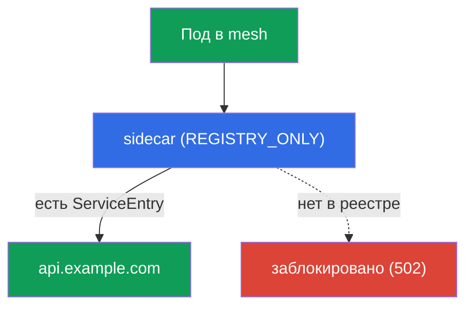
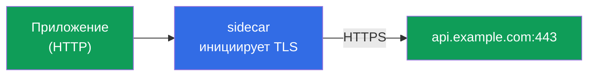
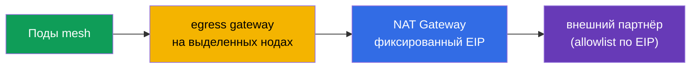

[Eng version](en.md)

# Глава 12. Egress: ServiceEntry, egress gateway, TLS origination

> **Что дальше.** До сих пор мы управляли трафиком, который приходит в mesh и ходит
> внутри него. Теперь посмотрим на трафик, который уходит **наружу** - к внешним API,
> базам, сторонним сервисам. По умолчанию Istio выпускает трафик куда угодно, и это
> проблема безопасности. В этой главе научимся контролировать egress: регистрировать
> внешние сервисы, пускать их через единую точку выхода и запрещать всё лишнее.

## 12.1. Проблема: по умолчанию наружу можно всё

По умолчанию у Istio политика исходящего трафика `ALLOW_ANY` - любой под может
обратиться к любому адресу в интернете. Для разработки удобно, но с точки зрения
безопасности плохо: если под скомпрометирован, он сможет «слить» данные на любой
внешний адрес, и вы этого даже не заметите.

Контролируемый egress решает три задачи:

- **знать**, к каким внешним сервисам вообще обращается mesh (`ServiceEntry`);
- **пропускать** внешний трафик через единую точку для аудита и фильтрации
  (egress gateway);
- **запрещать** всё, что не разрешено явно (`REGISTRY_ONLY` + `Sidecar`).

## 12.2. ServiceEntry: регистрируем внешний сервис

Istio ведёт внутренний реестр сервисов. Внутрикластерные сервисы попадают туда из
Kubernetes автоматически, а вот про внешние (например, `api.example.com`) Istio ничего
не знает. `ServiceEntry` добавляет внешний хост в этот реестр.

```yaml
apiVersion: networking.istio.io/v1
kind: ServiceEntry
metadata:
  name: external-api
spec:
  hosts:
  - api.example.com
  ports:
  - number: 443
    name: https
    protocol: TLS
  resolution: DNS          # резолвить имя через DNS
  location: MESH_EXTERNAL  # сервис снаружи mesh
```

Разберём поля:

- **`hosts`** - внешнее DNS-имя, которое регистрируем.
- **`ports`** - порт и протокол внешнего сервиса.
- **`resolution: DNS`** - Envoy сам резолвит имя через DNS (есть также `STATIC` для
  фиксированных IP).
- **`location: MESH_EXTERNAL`** - сервис снаружи mesh, mTLS к нему не применяется.

Про `resolution` подробнее:

- **`DNS`** - Envoy сам резолвит `hosts` через DNS (подходит для обычных внешних API по
  доменному имени).
- **`STATIC`** - вы задаёте конкретные IP в блоке `endpoints` (например, внешняя БД по
  фиксированным адресам):

  ```yaml
  spec:
    hosts:
    - db.external
    ports:
    - number: 5432
      name: tcp-postgres
      protocol: TCP
    resolution: STATIC
    location: MESH_EXTERNAL
    endpoints:
    - address: 10.0.50.10      # конкретный IP внешнего сервиса
    - address: 10.0.50.11
  ```

- **`NONE`** - без резолвинга, трафик проходит по destination IP как есть (для случаев, когда
  адрес заранее неизвестен).

Ещё пара полезных полей:

- **Wildcard-хост.** В `hosts` можно указать `*.example.com`, чтобы одним ServiceEntry
  накрыть все поддомены.
- **`exportTo`** - в каких namespace виден этот ServiceEntry (`.` - только свой, `*` - все).
  Полезно, чтобы разрешение на внешний сервис действовало не на весь кластер, а точечно.

Зачем это нужно: без `ServiceEntry` внешний сервис нельзя ни маршрутизировать через
egress gateway, ни разрешить в строгом режиме `REGISTRY_ONLY`. Это первый кирпичик
контроля egress.

## 12.3. REGISTRY_ONLY: запрещаем всё лишнее

Теперь закрутим гайки: переключим mesh в режим, где наружу можно ходить **только** к
зарегистрированным сервисам. Это `outboundTrafficPolicy.mode: REGISTRY_ONLY`.

Задать его можно глобально (в MeshConfig при установке) или точечно на namespace через
ресурс `Sidecar`:

```yaml
apiVersion: networking.istio.io/v1
kind: Sidecar
metadata:
  name: default            # имя default = политика на весь namespace
  namespace: app
spec:
  outboundTrafficPolicy:
    mode: REGISTRY_ONLY     # наружу только то, что есть в реестре
```

После этого запрос к зарегистрированному через `ServiceEntry` хосту пройдёт, а к любому
другому - заблокируется (Envoy вернёт ошибку, обычно `502`).



Это egress-аналог принципа default-deny: явно разрешаем нужные внешние сервисы через
`ServiceEntry`, всё остальное запрещено. Ресурс `Sidecar` мы подробнее разберём в главе
19 (там он используется для оптимизации конфигурации прокси).

## 12.4. Egress gateway: единая точка выхода

`ServiceEntry` + `REGISTRY_ONLY` уже дают контроль: известно, куда можно, остальное
закрыто. Но трафик пока уходит наружу напрямую из sidecar каждого пода. Часто хочется
пропустить весь внешний трафик через **одну точку** - egress gateway. Это удобно для
аудита, логирования и применения политик в одном месте (а ещё внешний файрвол может
разрешить исход только с IP этого шлюза).


Настройка egress gateway - самая многословная часть: нужны четыре ресурса. Предполагаем,
что `ServiceEntry` для `api.example.com` (порт 443, TLS) из 12.2 уже создан, а сам
egress gateway развёрнут (метка пода `istio: egressgateway`).

**1. Gateway** - настраивает egress-шлюз слушать нужный хост на выход:

```yaml
apiVersion: networking.istio.io/v1
kind: Gateway
metadata:
  name: istio-egressgateway
  namespace: istio-system
spec:
  selector:
    istio: egressgateway        # применить к подам egress gateway
  servers:
  - port:
      number: 443
      name: tls
      protocol: TLS
    hosts:
    - api.example.com
    tls:
      mode: PASSTHROUGH         # трафик уже зашифрован приложением, шлюз не расшифровывает
```

**2. DestinationRule** - объявляет subset шлюза, на который будет ссылаться VirtualService:

```yaml
apiVersion: networking.istio.io/v1
kind: DestinationRule
metadata:
  name: egressgateway-for-api
  namespace: istio-system
spec:
  host: istio-egressgateway.istio-system.svc.cluster.local
  subsets:
  - name: api-egress            # subset, на него направим трафик из mesh
```

**3. VirtualService** - двухэтапная маршрутизация. Один и тот же запрос делает два «прыжка»:
сначала под → egress gateway, затем egress gateway → внешний сервис:

```yaml
apiVersion: networking.istio.io/v1
kind: VirtualService
metadata:
  name: route-via-egress
  namespace: istio-system
spec:
  hosts:
  - api.example.com
  gateways:
  - mesh                        # этап 1: трафик из sidecar подов
  - istio-egressgateway         # этап 2: трафик, пришедший на egress gateway
  tls:
  - match:
    - gateways: [mesh]                     # этап 1: из mesh...
      sniHosts: [api.example.com]
    route:
    - destination:
        host: istio-egressgateway.istio-system.svc.cluster.local
        subset: api-egress                 # ...направляем на egress gateway
        port:
          number: 443
  - match:
    - gateways: [istio-egressgateway]      # этап 2: на egress gateway...
      sniHosts: [api.example.com]
    route:
    - destination:
        host: api.example.com              # ...выпускаем наружу
        port:
          number: 443
```

Здесь трафик уже TLS (приложение само шифрует), поэтому маршрутизация по `sniHosts`, а шлюз
в режиме `PASSTHROUGH`. Если нужно, чтобы TLS инициировал сам шлюз, это делают через
`http`-маршрут + TLS origination на egress gateway (раздел 12.5).

Проверить, что трафик реально идёт через шлюз, можно по его логам:

```bash
kubectl logs -n istio-system -l istio=egressgateway --tail=20 | grep api.example.com
```

> **Важно: egress gateway сам по себе не граница безопасности.** Если под может ходить
> наружу напрямую, он просто обойдёт шлюз. Egress gateway имеет смысл только вместе с
> `REGISTRY_ONLY` (12.3) и/или Kubernetes `NetworkPolicy`, которые запрещают подам исходящий
> трафик мимо шлюза. Иначе это лишь «рекомендованный маршрут», а не контроль.

## 12.5. TLS origination

Отдельный полезный приём. Иногда приложение общается с внешним сервисом по обычному
HTTP, а нужно, чтобы наружу трафик уходил по HTTPS. Можно, конечно, добавить TLS в код
приложения, но проще поручить это mesh. **TLS origination** - это когда приложение шлёт
простой HTTP, а sidecar (или egress gateway) сам устанавливает TLS-соединение к целевому
сервису.



Настраивается через `DestinationRule` с `tls.mode: SIMPLE` для внешнего хоста:

```yaml
apiVersion: networking.istio.io/v1
kind: DestinationRule
metadata:
  name: external-api-tls
spec:
  host: api.example.com
  trafficPolicy:
    tls:
      mode: SIMPLE      # sidecar сам устанавливает TLS наружу
```

Вместе с `ServiceEntry` (где внешний порт объявлен как HTTP 80, а реальный сервис слушает
443) это позволяет приложению обращаться на `http://api.example.com`, а трафик наружу
уходит уже зашифрованным. Код приложения остаётся простым, а работу с сертификатами и
TLS единообразно берёт на себя mesh.

**mTLS наружу (`mode: MUTUAL`).** Если внешний сервис требует клиентский сертификат
(взаимный TLS), mesh может предъявить его сам - тогда в `DestinationRule` указывают
`mode: MUTUAL` и ссылки на сертификаты (через `credentialName` с Secret или пути к файлам):

```yaml
  trafficPolicy:
    tls:
      mode: MUTUAL              # предъявить клиентский сертификат внешнему сервису
      credentialName: api-client-cert   # Secret с клиентским сертификатом и ключом
```

Так приложение по-прежнему шлёт простой HTTP, а mesh устанавливает наружу mTLS-соединение с
нужным клиентским сертификатом.

Не путайте с TLS-режимами из главы 9: там (SIMPLE/MUTUAL/PASSTHROUGH) речь про
**входящий** трафик на ingress gateway. TLS origination - про **исходящий** трафик,
который mesh шифрует на пути наружу.

## 12.6. Egress в EKS/AWS: статический IP и allowlist

Частая продакшн-задача: внешний партнёр (платёжный шлюз, чужой API) просит, чтобы запросы
к нему приходили с **известного IP** - чтобы добавить его в свой allowlist. В обычном EKS
поды выходят в интернет через **NAT Gateway**, и наружу виден его Elastic IP. Но если нод и
NAT-шлюзов несколько (по одному на AZ), исходящих адресов будет несколько.

Egress gateway помогает свести всё к предсказуемому набору адресов:

- Весь внешний трафик mesh идёт через **egress gateway** (12.4), а `REGISTRY_ONLY` +
  `NetworkPolicy` не дают подам ходить мимо.
- Поды egress gateway закрепляют на выделенном пуле нод (через `nodeSelector`/`affinity`),
  а этот пул нод выходит в интернет через **один NAT Gateway с фиксированным Elastic IP**.
- Партнёр вносит в allowlist именно этот EIP.



Важно понимать разделение ролей: **сам egress gateway IP наружу не даёт** - внешний адрес
определяет NAT Gateway (или публичный IP ноды). Egress gateway лишь собирает весь исходящий
трафик в одну точку, чтобы он выходил через предсказуемые ноды и, соответственно, через
предсказуемый NAT EIP. Без концентрации на egress gateway трафик расходился бы по всем
нодам и NAT-шлюзам всех AZ.

## 12.7. Best practices

- **Не оставляйте `ALLOW_ANY` в проде.** Переключайте mesh (или хотя бы чувствительные
  namespace) в `REGISTRY_ONLY` и разрешайте внешние сервисы явными `ServiceEntry`.
- **Egress gateway - только вместе с ограничением обхода.** Сам по себе он не граница
  безопасности; закрывайте прямой выход подов через `REGISTRY_ONLY` и/или `NetworkPolicy`.
- **Минимизируйте `ServiceEntry`.** Точные хосты вместо широких wildcard; ограничивайте
  область видимости через `exportTo`, чтобы разрешение не действовало на весь кластер.
- **Шифруйте исходящий трафик через TLS origination**, а не в коде приложения - единообразно
  и с централизованным управлением сертификатами (`MUTUAL`, если партнёр требует mTLS).
- **Для allowlist по IP** концентрируйте egress через выделенные ноды с фиксированным NAT
  EIP (12.6); помните, что адрес даёт NAT/нода, а не сам шлюз.
- **Аудируйте egress.** Логи egress gateway - удобная единая точка, чтобы видеть, куда и
  сколько ходит mesh.

## 12.8. Итоги главы

- По умолчанию egress в режиме `ALLOW_ANY` - наружу можно куда угодно, это риск
  безопасности.
- **ServiceEntry** регистрирует внешний сервис в реестре mesh; без него внешний хост
  нельзя ни маршрутизировать, ни разрешить в `REGISTRY_ONLY`.
- **REGISTRY_ONLY** (через MeshConfig или `Sidecar`) разрешает выход только к
  зарегистрированным сервисам - egress-аналог default-deny.
- **Egress gateway** даёт единую точку выхода для аудита и фильтрации; настраивается
  через Gateway + DestinationRule + VirtualService с двухэтапной маршрутизацией.
- **ServiceEntry** гибок по `resolution` (`DNS`/`STATIC`/`NONE`), поддерживает wildcard-хосты
  и ограничение видимости через `exportTo`.
- **Egress gateway - не граница безопасности сам по себе**: работает только вместе с
  `REGISTRY_ONLY` и/или `NetworkPolicy`, иначе под обойдёт его напрямую.
- **TLS origination** позволяет приложению ходить по HTTP, а mesh сам шифрует трафик
  наружу (DestinationRule `tls.mode: SIMPLE`; `MUTUAL` - если нужен клиентский сертификат).
- В EKS для **allowlist по IP** трафик концентрируют через egress gateway на выделенных
  нодах с фиксированным NAT EIP; внешний адрес даёт NAT Gateway, а не сам шлюз.
- Edge TLS (глава 9) это про входящий трафик, TLS origination - про исходящий.

## 12.9. Вопросы для самопроверки

1. Чем опасен режим `ALLOW_ANY` по умолчанию?
2. Зачем нужен `ServiceEntry` и что будет без него в режиме `REGISTRY_ONLY`?
3. Как режим `REGISTRY_ONLY` реализует принцип default-deny для egress?
4. Зачем пускать внешний трафик через egress gateway, если контроль уже есть?
5. Что такое TLS origination и чем оно отличается от edge TLS из главы 9? Что добавляет
   режим `MUTUAL`?
6. Почему egress gateway сам по себе не является границей безопасности? Что нужно добавить?
7. Чем отличаются `resolution: DNS`, `STATIC` и `NONE` в ServiceEntry?
8. Как в EKS сделать так, чтобы запросы к внешнему партнёру уходили с известного IP для
   allowlist? Кто именно определяет исходящий адрес?

## Практика

Отработайте полный контроль egress: ServiceEntry, egress gateway и REGISTRY_ONLY:

🧪 Лаба 05: [tasks/ica/labs/05](../../labs/05/README_RU.MD)

Отработайте TLS origination (инициация TLS на стороне mesh):

🧪 Лаба 22: [tasks/ica/labs/22](../../labs/22/README_RU.MD)

---
[Оглавление](../README.md) · [Глава 11](../11/ru.md) · [Глава 13](../13/ru.md)
