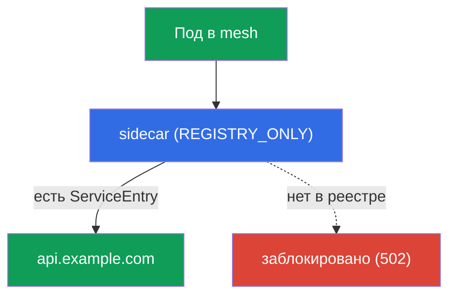
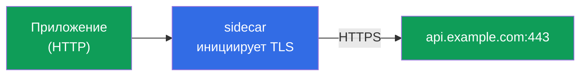

# Глава 12. Egress: ServiceEntry, egress gateway, TLS origination

> **Что дальше.** До сих пор мы управляли трафиком, который приходит в mesh и ходит
> внутри него. Теперь посмотрим на трафик, который уходит **наружу** - к внешним API,
> базам, сторонним сервисам. По умолчанию Istio выпускает трафик куда угодно, и это
> проблема безопасности. В этой главе научимся контролировать egress: регистрировать
> внешние сервисы, пускать их через единую точку выхода и запрещать всё лишнее.

## 12.1. Проблема: по умолчанию наружу можно всё

По умолчанию у Istio политика исходящего трафика `ALLOW_ANY` - любой под может
обратиться к любому адресу в интернете. Для разработки удобно, но с точки зрения
безопасности плохо: если под скомпрометирован, он сможет «слить» данные на любой
внешний адрес, и вы этого даже не заметите.

Контролируемый egress решает три задачи:

- **знать**, к каким внешним сервисам вообще обращается mesh (`ServiceEntry`);
- **пропускать** внешний трафик через единую точку для аудита и фильтрации
  (egress gateway);
- **запрещать** всё, что не разрешено явно (`REGISTRY_ONLY` + `Sidecar`).

## 12.2. ServiceEntry: регистрируем внешний сервис

Istio ведёт внутренний реестр сервисов. Внутрикластерные сервисы попадают туда из
Kubernetes автоматически, а вот про внешние (например, `api.example.com`) Istio ничего
не знает. `ServiceEntry` добавляет внешний хост в этот реестр.

```yaml
apiVersion: networking.istio.io/v1
kind: ServiceEntry
metadata:
  name: external-api
spec:
  hosts:
  - api.example.com
  ports:
  - number: 443
    name: https
    protocol: TLS
  resolution: DNS          # резолвить имя через DNS
  location: MESH_EXTERNAL  # сервис снаружи mesh
```

Разберём поля:

- **`hosts`** - внешнее DNS-имя, которое регистрируем.
- **`ports`** - порт и протокол внешнего сервиса.
- **`resolution: DNS`** - Envoy сам резолвит имя через DNS (есть также `STATIC` для
  фиксированных IP).
- **`location: MESH_EXTERNAL`** - сервис снаружи mesh, mTLS к нему не применяется.

Зачем это нужно: без `ServiceEntry` внешний сервис нельзя ни маршрутизировать через
egress gateway, ни разрешить в строгом режиме `REGISTRY_ONLY`. Это первый кирпичик
контроля egress.

## 12.3. REGISTRY_ONLY: запрещаем всё лишнее

Теперь закрутим гайки: переключим mesh в режим, где наружу можно ходить **только** к
зарегистрированным сервисам. Это `outboundTrafficPolicy.mode: REGISTRY_ONLY`.

Задать его можно глобально (в MeshConfig при установке) или точечно на namespace через
ресурс `Sidecar`:

```yaml
apiVersion: networking.istio.io/v1
kind: Sidecar
metadata:
  name: default            # имя default = политика на весь namespace
  namespace: app
spec:
  outboundTrafficPolicy:
    mode: REGISTRY_ONLY     # наружу только то, что есть в реестре
```

После этого запрос к зарегистрированному через `ServiceEntry` хосту пройдёт, а к любому
другому - заблокируется (Envoy вернёт ошибку, обычно `502`).



Это egress-аналог принципа default-deny: явно разрешаем нужные внешние сервисы через
`ServiceEntry`, всё остальное запрещено. Ресурс `Sidecar` мы подробнее разберём в главе
19 (там он используется для оптимизации конфигурации прокси).

## 12.4. Egress gateway: единая точка выхода

`ServiceEntry` + `REGISTRY_ONLY` уже дают контроль: известно, куда можно, остальное
закрыто. Но трафик пока уходит наружу напрямую из sidecar каждого пода. Часто хочется
пропустить весь внешний трафик через **одну точку** - egress gateway. Это удобно для
аудита, логирования и применения политик в одном месте (а ещё внешний файрвол может
разрешить исход только с IP этого шлюза).


Настройка egress gateway - самая многословная часть: нужны `Gateway` (настроить сам
egress-шлюз), `DestinationRule` (subset шлюза) и `VirtualService` с двухэтапной
маршрутизацией. Логика VirtualService такая:

- **этап 1**: трафик из mesh (`gateways: [mesh]`) направляется на сервис egress gateway;
- **этап 2**: трафик, пришедший на egress gateway (`gateways: [istio-egressgateway]`),
  отправляется наружу на реальный хост.

То есть один и тот же запрос делает два «прыжка»: сначала под -> egress gateway, потом
egress gateway -> внешний сервис. Полную конфигурацию разберёте на практике в лабе 05.

Проверить, что трафик реально идёт через шлюз, можно по его логам:

```bash
kubectl logs -n istio-system -l istio=egressgateway --tail=20 | grep api.example.com
```

## 12.5. TLS origination

Отдельный полезный приём. Иногда приложение общается с внешним сервисом по обычному
HTTP, а нужно, чтобы наружу трафик уходил по HTTPS. Можно, конечно, добавить TLS в код
приложения, но проще поручить это mesh. **TLS origination** - это когда приложение шлёт
простой HTTP, а sidecar (или egress gateway) сам устанавливает TLS-соединение к целевому
сервису.



Настраивается через `DestinationRule` с `tls.mode: SIMPLE` для внешнего хоста:

```yaml
apiVersion: networking.istio.io/v1
kind: DestinationRule
metadata:
  name: external-api-tls
spec:
  host: api.example.com
  trafficPolicy:
    tls:
      mode: SIMPLE      # sidecar сам устанавливает TLS наружу
```

Вместе с `ServiceEntry` (где внешний порт объявлен как HTTP 80, а реальный сервис слушает
443) это позволяет приложению обращаться на `http://api.example.com`, а трафик наружу
уходит уже зашифрованным. Код приложения остаётся простым, а работу с сертификатами и
TLS единообразно берёт на себя mesh.

Не путайте с TLS-режимами из главы 9: там (SIMPLE/MUTUAL/PASSTHROUGH) речь про
**входящий** трафик на ingress gateway. TLS origination - про **исходящий** трафик,
который mesh шифрует на пути наружу.

## 12.6. Итоги главы

- По умолчанию egress в режиме `ALLOW_ANY` - наружу можно куда угодно, это риск
  безопасности.
- **ServiceEntry** регистрирует внешний сервис в реестре mesh; без него внешний хост
  нельзя ни маршрутизировать, ни разрешить в `REGISTRY_ONLY`.
- **REGISTRY_ONLY** (через MeshConfig или `Sidecar`) разрешает выход только к
  зарегистрированным сервисам - egress-аналог default-deny.
- **Egress gateway** даёт единую точку выхода для аудита и фильтрации; настраивается
  через Gateway + DestinationRule + VirtualService с двухэтапной маршрутизацией.
- **TLS origination** позволяет приложению ходить по HTTP, а mesh сам шифрует трафик
  наружу (DestinationRule `tls.mode: SIMPLE`).
- Edge TLS (глава 9) это про входящий трафик, TLS origination - про исходящий.

## 12.7. Вопросы для самопроверки

1. Чем опасен режим `ALLOW_ANY` по умолчанию?
2. Зачем нужен `ServiceEntry` и что будет без него в режиме `REGISTRY_ONLY`?
3. Как режим `REGISTRY_ONLY` реализует принцип default-deny для egress?
4. Зачем пускать внешний трафик через egress gateway, если контроль уже есть?
5. Что такое TLS origination и чем оно отличается от edge TLS из главы 9?

## Практика

Отработайте полный контроль egress: ServiceEntry, egress gateway и REGISTRY_ONLY:

🧪 Лаба 05: [tasks/ica/labs/05](../../labs/05/README_RU.MD)

Отработайте TLS origination (инициация TLS на стороне mesh):

🧪 Лаба 22: [tasks/ica/labs/22](../../labs/22/README_RU.MD)

---
[Оглавление](../README.md) · [Глава 11](../11/ru.md) · [Глава 13](../13/ru.md)
