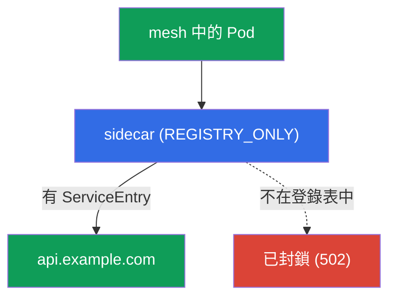
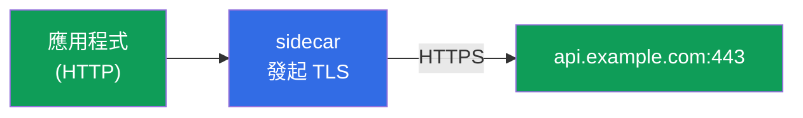
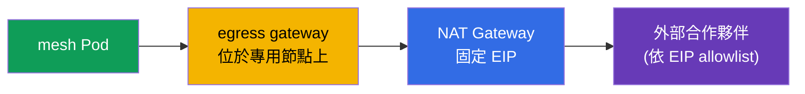

[Русская версия](ru.md) · [Eng version](en.md) · [Versión en español](es.md) · [Version française](fr.md) · [Deutsche Version](de.md) · [ქართული ვერსია](ge.md) · [日本語版](jp.md)

# 第 12 章。Egress：ServiceEntry、egress gateway、TLS origination

> **接下來。** 到目前為止，我們管理的是進入 mesh 和在其內部流動的流量。現在來看看**向外**流出的流量--前往外部 API、資料庫及第三方服務。預設情況下，Istio 允許流量流向任何地方，這是安全問題。本章將學習控制 egress：註冊外部服務、讓它們通過統一出口點，以及禁止所有多餘的流量。

## 12.1. 問題：預設允許前往任何外部位置

預設情況下，Istio 的出站流量政策是 `ALLOW_ANY`--任何 Pod 都可以存取網際網路上的任何位址。這對開發很方便，但從安全角度來說很差：若 Pod 遭到入侵，它可以將資料「外洩」到任何外部位址，而您甚至不會察覺。

受控 egress 解決三項任務：

- **了解** mesh 究竟存取了哪些外部服務（`ServiceEntry`）；
- 讓外部流量通過單一點以進行稽核與篩選（egress gateway）；
- **禁止**一切未明確允許的流量（`REGISTRY_ONLY` + `Sidecar`）。

## 12.2. ServiceEntry：註冊外部服務

Istio 維護內部服務登錄表。叢集內服務會自動從 Kubernetes 加入其中，但對外部服務（例如 `api.example.com`）Istio 一無所知。`ServiceEntry` 將外部主機加入此登錄表。

```yaml
apiVersion: networking.istio.io/v1
kind: ServiceEntry
metadata:
  name: external-api
spec:
  hosts:
  - api.example.com
  ports:
  - number: 443
    name: https
    protocol: TLS
  resolution: DNS          # 透過 DNS 解析名稱
  location: MESH_EXTERNAL  # mesh 外部的服務
```

逐一說明各欄位：

- **`hosts`**--要註冊的外部 DNS 名稱。
- **`ports`**--外部服務的連接埠與協定。
- **`resolution: DNS`**--Envoy 自行透過 DNS 解析名稱（固定 IP 也可使用 `STATIC`）。
- **`location: MESH_EXTERNAL`**--服務位於 mesh 外部，不會對它套用 mTLS。

關於 `resolution` 的更多說明：

- **`DNS`**--Envoy 自行透過 DNS 解析 `hosts`（適用於以網域名稱存取的一般外部 API）。
- **`STATIC`**--您在 `endpoints` 區塊中指定具體 IP（例如使用固定位址的外部資料庫）：

  ```yaml
  spec:
    hosts:
    - db.external
    ports:
    - number: 5432
      name: tcp-postgres
      protocol: TCP
    resolution: STATIC
    location: MESH_EXTERNAL
    endpoints:
    - address: 10.0.50.10      # 外部服務的特定 IP
    - address: 10.0.50.11
  ```

- **`NONE`**--不進行解析，流量會原樣依 destination IP 通過（適用於預先不知道位址的情況）。

還有幾個實用欄位：

- **Wildcard 主機。** 可在 `hosts` 中指定 `*.example.com`，以單一 ServiceEntry 涵蓋所有子網域。
- **`exportTo`**--此 ServiceEntry 在哪些 namespace 中可見（`.`--僅自身，`*`--全部）。可讓外部服務的許可不套用至整個叢集，而是精確限定。

為何需要它：沒有 `ServiceEntry`，外部服務既無法經由 egress gateway 路由，也無法在嚴格的 `REGISTRY_ONLY` 模式中獲准存取。這是控制 egress 的第一塊基石。

### Wildcard 主機：細節與 egress gateway

`hosts` 中的 Wildcard（`*.example.com`）很方便，可用單一 `ServiceEntry` 涵蓋一批子網域，但它有一項重要限制：**無法直接以 DNS 解析 wildcard**--不存在 `*.example.com` 的 DNS 記錄，Envoy 不知道該將封包送往何處。因此，行為取決於子網域在實際環境中的「落點」：

- **所有子網域位於共同的一組位址後方**（典型範例是 `*.wikipedia.org`，全部由同一伺服器集區提供服務）。這時設定 `resolution: DNS` 與**明確**的實際目的 endpoint：

  ```yaml
  apiVersion: networking.istio.io/v1
  kind: ServiceEntry
  metadata:
    name: wikipedia
    namespace: app
  spec:
    hosts:
    - "*.wikipedia.org"
    ports:
    - number: 443
      name: https
      protocol: TLS
    resolution: DNS
    endpoints:
    - address: www.wikipedia.org    # 所有子網域解析到的共用位址
  ```

- **任意、彼此獨立的子網域**（每個解析至自己的位址）。DNS 在此無能為力--使用 `resolution: NONE`（Envoy 依 SNI/destination IP 通過流量，而不做任何解析）：

  ```yaml
  spec:
    hosts:
    - "*.example.com"
    ports:
    - number: 443
      name: tls
      protocol: TLS
    resolution: NONE               # 不解析，依 SNI/IP 原樣路由
    location: MESH_EXTERNAL
  ```

常見限制：

- **不要設定裸露的 `*`**--必須有網域後綴（`*.example.com`），否則等於「允許流向任何位置」，與 `REGISTRY_ONLY` 的意義相違背。
- Wildcard 僅對最上層子網域有效：`*.example.com` 可匹配 `a.example.com`，但不匹配 `a.b.example.com`。

透過 **egress gateway** 時，wildcard 依 SNI 路由（`PASSTHROUGH` 模式中的 `tls`），而非依精確主機--在 gateway 的 `sniHosts` 與 `hosts` 中指定 wildcard 本身。結構與 12.4 的四個資源相同，只有主機有所變更：

```yaml
apiVersion: networking.istio.io/v1
kind: Gateway
metadata:
  name: istio-egressgateway
  namespace: istio-system
spec:
  selector:
    istio: egressgateway
  servers:
  - port:
      number: 443
      name: tls
      protocol: TLS
    hosts:
    - "*.example.com"             # 直接在 gateway listener 上使用 wildcard
    tls:
      mode: PASSTHROUGH
---
apiVersion: networking.istio.io/v1
kind: VirtualService
metadata:
  name: wildcard-via-egress
  namespace: istio-system
spec:
  hosts:
  - "*.example.com"
  gateways:
  - mesh
  - istio-egressgateway
  tls:
  - match:
    - gateways: [mesh]
      sniHosts: ["*.example.com"]          # 依 wildcard 比對 SNI，而非精確主機
    route:
    - destination:
        host: istio-egressgateway.istio-system.svc.cluster.local
        subset: api-egress
        port:
          number: 443
  - match:
    - gateways: [istio-egressgateway]
      sniHosts: ["*.example.com"]
    route:
    - destination:
        host: "*.example.com"              # 依 SNI 對外放行
        port:
          number: 443
```

> **確認運作。** 獲准的子網域應通過，wildcard 以外的主機則應被 `REGISTRY_ONLY` 擋下：
>
> ```bash
> kubectl exec deploy/sleep -n app -- curl -sS -o /dev/null -w "%{http_code}\n" \
>   https://a.example.com          # 預期 200（在登錄表中，依 wildcard）
> kubectl exec deploy/sleep -n app -- curl -sS -o /dev/null -w "%{http_code}\n" \
>   https://api.other.com          # 預期錯誤/502（不在登錄表中）
> ```

實務建議仍然不變：wildcard 是便利性與控制精確度之間的折衷。`*` 越寬，您越不了解 mesh 實際存取的位置，因此生產環境偏好精確主機，僅有意識地使用 wildcard（例如針對 CDN 或子網域難以預測的雲端服務）。

### DNS proxying：由 Istio 進行解析

預設情況下，應用程式的 DNS 查詢會前往 kube-DNS（CoreDNS），Istio 不會介入。這有一些限制：沒有真實 DNS 記錄時，應用程式無法解析來自 `ServiceEntry` 的主機（尤其是 `resolution: STATIC`/`NONE`），而且每次外部請求都要查詢 CoreDNS。

Istio 可以啟用 **DNS proxy**：Pod 中的 istio-agent 直接回應 DNS 查詢，並了解 mesh 登錄表（叢集服務與 `ServiceEntry` 主機）。透過 MeshConfig 啟用：

```yaml
meshConfig:
  defaultConfig:
    proxyMetadata:
      ISTIO_META_DNS_CAPTURE: "true"        # 在 data plane 攔截 DNS
      ISTIO_META_DNS_AUTO_ALLOCATE: "true"  # 為沒有位址的 ServiceEntry 主機配發虛擬 IP
```

（也可透過 Pod 註解 `proxy.istio.io/config` 精確啟用。）其效果如下：

- **本機解析 ServiceEntry 主機**--這對沒有 DNS 記錄的外部 TCP 服務很重要；使用 `DNS_AUTO_ALLOCATE` 時，Istio 會為其配置虛擬 IP，以達到更精確的路由（否則同一連接埠上的多個 TCP 服務無法依 destination IP 區分）。
- **降低 CoreDNS 負載**並加快回應（在 Pod 本機解析）。
- 在 **ambient** 與 **VM**（第 29 章）中，DNS proxy 是解析叢集名稱的標準方式。

## 12.3. REGISTRY_ONLY：禁止所有多餘流量

現在進一步收緊：將 mesh 切換為僅能前往**已註冊**服務的模式。這就是 `outboundTrafficPolicy.mode: REGISTRY_ONLY`。

可全域設定（安裝時於 MeshConfig 中），或透過 `Sidecar` 資源在 namespace 層級精確設定：

```yaml
apiVersion: networking.istio.io/v1
kind: Sidecar
metadata:
  name: default            # 名稱 default = 套用於整個 namespace 的政策
  namespace: app
spec:
  outboundTrafficPolicy:
    mode: REGISTRY_ONLY     # 只放行登錄表中已有的對外流量
```

之後，對經由 `ServiceEntry` 註冊的主機所作請求可以通過，而對任何其他主機的請求都會被封鎖（Envoy 會回傳錯誤，通常是 `502`）。



這是 egress 版本的 default-deny 原則：透過 `ServiceEntry` 明確允許所需外部服務，其餘一律禁止。我們會在第 19 章更詳細討論 `Sidecar` 資源（該章會用它最佳化 proxy 設定）。

## 12.4. Egress gateway：統一出口點

`ServiceEntry` + `REGISTRY_ONLY` 已能提供控制：知道可以前往何處，其他位置皆關閉。但流量目前仍直接從每個 Pod 的 sidecar 向外流出。通常希望讓所有外部流量通過**單一點**--egress gateway。這有利於在單一位置稽核、記錄及套用政策（外部防火牆也可僅允許來自此 gateway IP 的出站流量）。


設定 egress gateway 是篇幅最長的部分：需要四個資源。我們假設已建立 12.2 的 `api.example.com`（連接埠 443、TLS）`ServiceEntry`，且 egress gateway 本身已部署（Pod 標籤為 `istio: egressgateway`）。

**1. Gateway**--設定 egress gateway 在出口監聽所需主機：

```yaml
apiVersion: networking.istio.io/v1
kind: Gateway
metadata:
  name: istio-egressgateway
  namespace: istio-system
spec:
  selector:
    istio: egressgateway        # 套用至 egress gateway 的 pod
  servers:
  - port:
      number: 443
      name: tls
      protocol: TLS
    hosts:
    - api.example.com
    tls:
      mode: PASSTHROUGH         # 流量已由應用程式加密，gateway 不解密
```

**2. DestinationRule**--宣告 gateway 的 subset，VirtualService 將引用它：

```yaml
apiVersion: networking.istio.io/v1
kind: DestinationRule
metadata:
  name: egressgateway-for-api
  namespace: istio-system
spec:
  host: istio-egressgateway.istio-system.svc.cluster.local
  subsets:
  - name: api-egress            # subset，將 mesh 的流量導向它
```

**3. VirtualService**--兩階段路由。相同請求會完成兩次「跳轉」：先是 Pod → egress gateway，接著 egress gateway → 外部服務：

```yaml
apiVersion: networking.istio.io/v1
kind: VirtualService
metadata:
  name: route-via-egress
  namespace: istio-system
spec:
  hosts:
  - api.example.com
  gateways:
  - mesh                        # 階段 1：來自 sidecar pod 的流量
  - istio-egressgateway         # 階段 2：抵達 egress gateway 的流量
  tls:
  - match:
    - gateways: [mesh]                     # 階段 1：從 mesh...
      sniHosts: [api.example.com]
    route:
    - destination:
        host: istio-egressgateway.istio-system.svc.cluster.local
        subset: api-egress                 # ...導向 egress gateway
        port:
          number: 443
  - match:
    - gateways: [istio-egressgateway]      # 階段 2：於 egress gateway...
      sniHosts: [api.example.com]
    route:
    - destination:
        host: api.example.com              # ...對外放行
        port:
          number: 443
```

此處流量已是 TLS（由應用程式自行加密），因此依 `sniHosts` 路由，gateway 處於 `PASSTHROUGH` 模式。若要由 gateway 自行發起 TLS，可在 egress gateway 使用 `http` 路由 + TLS origination（第 12.5 節）。

可在其日誌中確認流量確實通過 gateway：

```bash
kubectl logs -n istio-system -l istio=egressgateway --tail=20 | grep api.example.com
```

> **重要：egress gateway 本身不是安全邊界。** 若 Pod 能直接前往外部，它只會繞過 gateway。egress gateway 僅在搭配 `REGISTRY_ONLY`（12.3）及／或禁止 Pod 繞過 gateway 出站流量的 Kubernetes `NetworkPolicy` 時才有意義。否則它只是「建議路徑」，而非控制措施。

## 12.5. TLS origination

另一項實用技巧。有時應用程式透過一般 HTTP 與外部服務通訊，但希望向外的流量使用 HTTPS。當然可以在應用程式程式碼中加入 TLS，但讓 mesh 處理更簡單。**TLS origination** 是指應用程式傳送純 HTTP，而 sidecar（或 egress gateway）自行與目標服務建立 TLS 連線。



透過外部主機的 `DestinationRule` 搭配 `tls.mode: SIMPLE` 設定：

```yaml
apiVersion: networking.istio.io/v1
kind: DestinationRule
metadata:
  name: external-api-tls
spec:
  host: api.example.com
  trafficPolicy:
    tls:
      mode: SIMPLE      # sidecar 自行對外建立 TLS
```

與 `ServiceEntry` 結合使用（其中外部連接埠宣告為 HTTP 80，而實際服務監聽 443），應用程式便可存取 `http://api.example.com`，而對外流量已加密。應用程式程式碼保持簡單，憑證與 TLS 工作則由 mesh 集中且一致地處理。

**對外 mTLS（`mode: MUTUAL`）。** 若外部服務需要用戶端憑證（雙向 TLS），mesh 可自行提供該憑證--此時在 `DestinationRule` 中指定 `mode: MUTUAL` 和憑證參照（使用含 Secret 的 `credentialName` 或檔案路徑）：

```yaml
  trafficPolicy:
    tls:
      mode: MUTUAL              # 向外部服務出示用戶端憑證
      credentialName: api-client-cert   # 含用戶端憑證與金鑰的 Secret
```

如此一來，應用程式仍傳送純 HTTP，而 mesh 會使用所需用戶端憑證向外建立 mTLS 連線。

不要與第 9 章的 TLS 模式混淆：該處的（SIMPLE/MUTUAL/PASSTHROUGH）是針對 ingress gateway 的**入站**流量。TLS origination 是針對 mesh 在向外路徑上加密的**出站**流量。

## 12.6. EKS/AWS 中的 Egress：靜態 IP 與 allowlist

常見的生產需求：外部合作夥伴（支付 gateway、第三方 API）要求來自您的請求具有**已知 IP**，以便將其加入自己的 allowlist。在一般 EKS 中，Pod 透過 **NAT Gateway** 連上網際網路，外部看到的是它的 Elastic IP。然而，若有多個節點與 NAT gateway（每個 AZ 一個），出站位址也會有多個。

Egress gateway 有助於將其收斂為可預期的一組位址：

- 所有 mesh 外部流量均通過 **egress gateway**（12.4），而 `REGISTRY_ONLY` + `NetworkPolicy` 不允許 Pod 繞過它。
- 將 egress gateway Pod 固定在專用節點集區上（透過 `nodeSelector`/`affinity`），該節點集區經由**一個具固定 Elastic IP 的 NAT Gateway**連上網際網路。
- 合作夥伴將此 EIP 加入 allowlist。



請理解角色分工：**egress gateway 本身不會提供對外 IP**--外部位址由 NAT Gateway（或節點的公有 IP）決定。Egress gateway 只是將所有出站流量匯集到一點，以便讓它經由可預期的節點，進而經由可預期的 NAT EIP 流出。若不集中於 egress gateway，流量會分散至所有節點與所有 AZ 的 NAT gateway。

## 12.7. 最佳實務

- **不要在生產環境保留 `ALLOW_ANY`。** 將 mesh（或至少敏感 namespace）切換至 `REGISTRY_ONLY`，並透過明確的 `ServiceEntry` 允許外部服務。
- **egress gateway 必須搭配繞過限制。** 它本身不是安全邊界；透過 `REGISTRY_ONLY` 及／或 `NetworkPolicy` 關閉 Pod 的直接出口。
- **將 `ServiceEntry` 最小化。** 使用精確主機而非寬鬆 wildcard；以 `exportTo` 限制可見範圍，避免許可套用到整個叢集。
- **透過 TLS origination 加密出站流量**，而非在應用程式程式碼中處理--可保持一致並集中管理憑證（合作夥伴需要 mTLS 時使用 `MUTUAL`）。
- **對於依 IP 的 allowlist**，將 egress 集中至具固定 NAT EIP 的專用節點（12.6）；請記住，位址由 NAT／節點提供，而非 gateway 本身。
- **稽核 egress。** egress gateway 日誌是觀察 mesh 前往何處及流量規模的便利統一點。

## 12.8. 本章總結

- 預設的 `ALLOW_ANY` egress 模式允許前往任何外部位置，具有安全風險。
- **ServiceEntry** 將外部服務註冊到 mesh 登錄表；沒有它，外部主機既無法路由，也無法在 `REGISTRY_ONLY` 中獲得允許。
- **REGISTRY_ONLY**（透過 MeshConfig 或 `Sidecar`）僅允許前往已註冊服務--是 egress 版本的 default-deny。
- **Egress gateway** 提供稽核與篩選所需的統一出口點；透過 Gateway + DestinationRule + VirtualService 與兩階段路由進行設定。
- **ServiceEntry** 的 `resolution`（`DNS`/`STATIC`/`NONE`）具彈性，支援 wildcard 主機以及透過 `exportTo` 限制可見範圍。
- **Wildcard 主機**（`*.example.com`）無法直接用 DNS 解析：共同位址使用有明確 `endpoints` 的 `resolution: DNS`，任意子網域使用 `resolution: NONE`；經由 egress gateway 時，依 SNI（`sniHosts: ["*.example.com"]`、`PASSTHROUGH`）通過。
- **DNS proxying**（`ISTIO_META_DNS_CAPTURE`）由 istio-agent 解析名稱：讓 ServiceEntry 主機可被解析（使用 `DNS_AUTO_ALLOCATE` 時會向無位址主機配置虛擬 IP），並減輕 CoreDNS 負載；這是在 ambient 與 VM 中的標準作法。
- **Egress gateway 本身不是安全邊界**：僅與 `REGISTRY_ONLY` 及／或 `NetworkPolicy` 搭配時才有效，否則 Pod 可直接繞過它。
- **TLS origination** 允許應用程式使用 HTTP，而 mesh 自行加密向外流量（DestinationRule `tls.mode: SIMPLE`；若需要用戶端憑證則使用 `MUTUAL`）。
- 在 EKS 中，為了**依 IP allowlist**，將流量經由 egress gateway 集中到具有固定 NAT EIP 的專用節點；外部位址由 NAT Gateway 提供，而非 gateway。
- Edge TLS（第 9 章）針對入站流量，TLS origination 則針對出站流量。

## 12.9. 自我檢查問題

1. 預設 `ALLOW_ANY` 模式有何危險？
2. 為何需要 `ServiceEntry`，沒有它時在 `REGISTRY_ONLY` 模式中會如何？
3. `REGISTRY_ONLY` 模式如何實現 egress 的 default-deny 原則？
4. 若已有控制措施，為何還要讓外部流量通過 egress gateway？
5. 何謂 TLS origination？它與第 9 章的 edge TLS 有何不同？`MUTUAL` 模式增加了什麼？
6. 為何 egress gateway 本身不是安全邊界？還需要增加什麼？
7. ServiceEntry 中的 `resolution: DNS`、`STATIC` 與 `NONE` 有何差異？
8. Istio 中的 DNS proxying 是什麼，為何需要 `DNS_AUTO_ALLOCATE`？
9. 在 EKS 中，如何讓對外部合作夥伴的請求以供 allowlist 的已知 IP 發出？究竟由誰決定出站位址？
10. 為何 wildcard 主機無法直接用 DNS 解析？共同位址與任意子網域各應選哪種 `resolution`？如何讓 wildcard 通過 egress gateway？

## 實作

練習完整的 egress 控制：ServiceEntry、egress gateway 與 REGISTRY_ONLY：

🧪 實驗 05：[tasks/ica/labs/05](../../labs/05/README_TW.MD)

練習 TLS origination（在 mesh 端發起 TLS）：

🧪 實驗 22：[tasks/ica/labs/22](../../labs/22/README_TW.MD)

---
[目錄](../README_TW.md) · [第 11 章](../11/tw.md) · [第 13 章](../13/tw.md)
