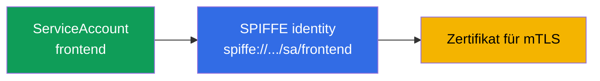
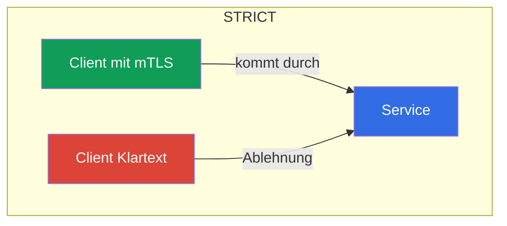
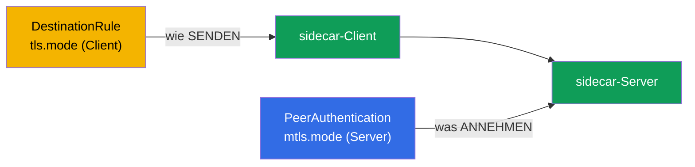
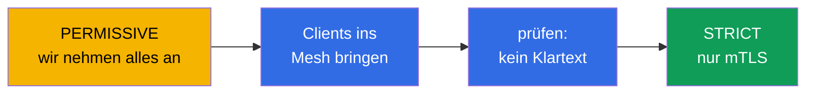

[RU version](ru.md) · [Eng version](en.md) · [Versión en español](es.md) · [Version française](fr.md)

# Kapitel 13. mTLS und PeerAuthentication: das Zero-Trust-Modell

> **Was kommt als Nächstes.** Es beginnt die zweite große Prüfungsdomäne – die Sicherheit. Standardmäßig
> kann innerhalb des Clusters jeder Pod jeden Service erreichen, und der Verkehr
> zwischen ihnen läuft im Klartext. In diesem Kapitel legen wir das Fundament der Sicherheit:
> mutual TLS (mTLS) zwischen Services und dessen Steuerung über PeerAuthentication. Das ist
> die Grundlage des Zero-Trust-Modells.

## 13.1. Das Problem: das flache vertrauenswürdige Netz

In einem gewöhnlichen Cluster ist das Netz „flach": wenn Pod A die Adresse von Pod B kennt, kann er ihn
ansprechen, und der Verkehr läuft unverschlüsselt. Niemand prüft, wer tatsächlich
anklopft. Für einen Angreifer, der ins Innere gelangt ist, ist das ein Geschenk: Er kann sich frei
zwischen Services bewegen und den Verkehr mithören.

Das **Zero-Trust**-Modell („vertraue niemandem") dreht das um: standardmäßig vertrauen wir
keiner Verbindung, solange sie nicht bewiesen hat, dass man ihr vertrauen kann. In Istio ist der
erste Schritt dahin mutual TLS zwischen allen Services.

## 13.2. Identity und SPIFFE

Um den Verkehr zu verschlüsseln und zu prüfen, braucht jeder Service eine **Identity**. In
Istio wird sie auf Basis des Kubernetes-ServiceAccount aufgebaut und nach dem Standard
**SPIFFE** ausgestellt.

**SPIFFE** (Secure Production Identity Framework For Everyone) ist ein offener Standard
(ein CNCF-Projekt), der beschreibt, wie man Services eine überprüfbare Identity ausstellt, ohne sich
an das Netz zu binden (IP, Port, Hostname sind unzuverlässig und ändern sich). Eine Identity in SPIFFE ist eine
Kennzeichnungs-Zeichenkette (SPIFFE ID) in Form einer URI, und „verpackt" wird sie in ein Zertifikat
in einem speziellen Format (SVID), mit dem der Service beweist, wer er ist. Der Standard ist herstellerneutral,
daher ist eine solche Identity auch außerhalb von Istio verständlich. In Istio sieht eine SPIFFE ID
so aus:

```
spiffe://cluster.local/ns/<namespace>/sa/<serviceaccount>
```

Zu lesen ist das einfach: der Service aus dem Namespace `<namespace>` mit dem ServiceAccount `<serviceaccount>`
in der vertrauenswürdigen Domäne `cluster.local`.



Das heißt, genau derselbe ServiceAccount, den Sie in der CKA für den Zugriff auf die
Kubernetes-API verwendet haben, wird hier zur kryptografischen Identity des Service im Mesh. Genau anhand
dieser Identity verschlüsselt Istio den Verkehr und entscheidet dann (in Kapitel 14), wem was erlaubt ist.

**Und wenn kein ServiceAccount angegeben ist?** In Kubernetes hat ein Pod **immer** einen ServiceAccount: wenn
Sie ihn nicht explizit angeben, erhält der Pod den SA `default` seines Namespace. „Keine Identity" gibt es nicht – es gibt die **Identity `default`**. Daraus folgt Wichtiges: wenn ein Dutzend verschiedener Services
ohne eigenen SA laufen, erhalten sie alle **ein und dieselbe** SPIFFE-Identity
(`spiffe://.../sa/default`). Für die mTLS-Verschlüsselung ist das nicht kritisch, aber für die Autorisierung (Kapitel
14) ein Desaster: sie lassen sich nicht unterscheiden, die Regel „nur `frontend` durchlassen" von den anderen
abzugrenzen gelingt nicht. Deshalb ist Best Practice – **ein eigener ServiceAccount pro Service** (oder zumindest pro
Gruppe mit gleichen Rechten).

**Und ein Pod ohne sidecar (außerhalb des Mesh)?** Die Identity in Istio verleiht gerade der sidecar: er erhält ein
Zertifikat von istiod und legt es vor. Ein Pod ohne sidecar (nicht injiziert oder in einem Namespace ohne
`istio-injection`) **hat keinerlei SPIFFE-Identity und kein Zertifikat** und sendet gewöhnlichen
Klartext. Das Verhalten hängt vom Modus des empfangenden Servers ab (13.4):

- ein Server im **`PERMISSIVE`**-Modus – nimmt eine solche Verbindung an (im Klartext), und genau das erlaubt es,
  das Mesh schrittweise einzuführen;
- ein Server im **`STRICT`**-Modus – **weist sie ab**: kein mTLS – keine Verbindung.

Und aus Sicht der Autorisierung hat der Verkehr von einem solchen Pod **keine geprüfte Identity**
(`source.principal` ist leer), daher lassen sich Regeln nach Principals nicht auf ihn anwenden – höchstens nach IP,
was unzuverlässig ist. Fazit: damit ein Service eine echte Identity hat, muss er im Mesh sein (mit
sidecar), sonst ist er für Zero Trust ein „Anonymer".

## 13.3. Automatisches mTLS

Der Hauptkomfort von Istio: mTLS funktioniert **automatisch**, Sie müssen sich nicht mit
Zertifikaten herumschlagen. istiod fungiert als Zertifizierungsstelle (CA):

- stellt jeder sidecar ein Zertifikat mit ihrer SPIFFE-Identity aus;
- rotiert diese Zertifikate automatisch (standardmäßig täglich);
- liefert sie per SDS an Envoy (erinnern Sie sich aus Kapitel 4 – Secret Discovery Service).

Wenn sich eine sidecar mit einer anderen verbindet, führen sie einen **mutual** TLS-Handshake durch: beide
Seiten legen Zertifikate vor und prüfen einander. Beim gewöhnlichen TLS (wie in Kapitel 9)
beweist der Server dem Client, wer er ist. Beim mutual TLS beweisen **beide** Seiten ihre
Identity. Im Ergebnis ist der Verkehr sowohl verschlüsselt als auch authentifiziert – und das alles ohne eine einzige
Zeile im Anwendungscode.

## 13.4. PeerAuthentication: mTLS-Modi

Wie Services eingehende Verbindungen annehmen, steuert die Ressource `PeerAuthentication`.
Sie hat drei Modi:

| Modus | Was der Server annimmt | Wann verwenden |
|-------|----------------------|--------------------|
| `PERMISSIVE` | sowohl mTLS als auch Klartext | Default, Übergangsphase |
| `STRICT` | nur mTLS | Ziel für Zero Trust |
| `DISABLE` | nur Klartext | mTLS deaktivieren (selten, zum Debuggen) |

Standardmäßig arbeitet Istio im `PERMISSIVE`-Modus: der Service nimmt sowohl verschlüsselten als auch
offenen Verkehr an. Das ist so gemacht, damit das Mesh schrittweise eingeführt werden kann, ohne diejenigen zu brechen,
die noch nicht im Mesh sind.

Striktes mTLS für den ganzen Namespace einschalten:

```yaml
apiVersion: security.istio.io/v1
kind: PeerAuthentication
metadata:
  name: default         # Name default + ohne selector = auf den ganzen namespace
  namespace: app
spec:
  mtls:
    mode: STRICT
```



Im `STRICT`-Modus weist der Service jeglichen unverschlüsselten Verkehr ab. Ein Client ohne sidecar
(der Klartext sendet) kann schlicht keine Verbindung aufbauen.

## 13.5. Wirkungsbereich der Policy

`PeerAuthentication` kann auf drei Ebenen angewendet werden, und das ist wichtig zu verstehen:

- **Ganzes Mesh** – Policy im Root-Namespace (`istio-system`) mit dem Namen `default`.
- **Namespace** – Policy mit dem Namen `default` und ohne `selector` im gewünschten Namespace
  (wie im Beispiel oben).
- **Konkrete Pods** – Policy mit `selector.matchLabels`, wirkt nur auf die
  ausgewählten Pods.

```yaml
spec:
  selector:
    matchLabels:
      app: payments     # nur die payments-Pods
  mtls:
    mode: STRICT
```

Eine engere Policy überschreibt eine breitere. Zum Beispiel kann man `STRICT` für das ganze
Mesh einschalten, aber für einen Legacy-Service über eine Policy mit selector `PERMISSIVE` belassen.

Es gibt noch eine feinere Ebene – den **einzelnen Port**. Über `portLevelMtls` lässt sich der
Modus für konkrete Ports vom allgemeinen abweichend festlegen. Ein klassisches Beispiel: der ganze Service im
`STRICT`-Modus, aber der Port für Metriken/Prüfungen, an den etwas außerhalb des Mesh anklopft, im `PERMISSIVE`-Modus:

```yaml
spec:
  selector:
    matchLabels:
      app: payments
  mtls:
    mode: STRICT          # Standard für alle Ports des Pod
  portLevelMtls:
    9090:
      mode: PERMISSIVE    # aber auf Port 9090 (Metriken) lassen wir auch plaintext durch
```

## 13.6. Client und Server: PeerAuthentication vs DestinationRule

Es ist wichtig, die Rollenverteilung zu verstehen, sonst bekommt man leicht rätselhafte `503`.

- **`PeerAuthentication` steuert nur die serverseitige (eingehende) Seite** – das, was der Service
  zu **akzeptieren** bereit ist (mTLS, Klartext oder beides).
- **Die clientseitige (ausgehende) Seite** – wie die absendende sidecar die Verbindung aufbaut
  – wird durch **Auto-mTLS** bestimmt: Istio sieht selbst, dass der Empfänger eine sidecar hat, und sendet mTLS.
  Explizit wird der Client-Modus in der `DestinationRule` über `trafficPolicy.tls.mode:
  ISTIO_MUTUAL` festgelegt.

Im Normalfall muss man darüber nicht nachdenken – Auto-mTLS stimmt die Seiten selbst ab. Ein Problem entsteht, wenn
jemand manuell eine `DestinationRule` mit einem `tls.mode` setzt, der mit `PeerAuthentication` in Konflikt steht:

- Server im `STRICT`-Modus, aber `DestinationRule` beim Client mit `mode: DISABLE` (oder `SIMPLE`) → der Client
  sendet Klartext, der Server verlangt mTLS → **die Verbindung reißt ab, `503`**.
- Die umgekehrte Situation (`DestinationRule` verlangt `ISTIO_MUTUAL`, aber der Server im `DISABLE`-Modus) – ebenfalls ein
  Fehler.



Regel: die Modi von Client (`DestinationRule`) und Server (`PeerAuthentication`) müssen
abgestimmt sein. Wenn man `tls` in der DestinationRule nicht anfasst, stimmt Auto-mTLS alles selbst ab – das ist
der empfohlene Weg.

## 13.7. Migration von PERMISSIVE nach STRICT ohne Downtime

`STRICT` „mit der Brechstange" auf einem laufenden Cluster einzuschalten ist gefährlich: alle Clients, die noch
Klartext senden (nicht im Mesh, Legacy-Anwendungen), fallen sofort weg. Der richtige Weg ist eine
schrittweise Migration, und `PERMISSIVE` ist genau dafür geschaffen.

Die Reihenfolge ist so:

1. **Start im PERMISSIVE-Modus** (das ist der Default). Der Service nimmt sowohl mTLS als auch Klartext an, nichts
   bricht.
2. **Wir bringen Clients ins Mesh.** Schrittweise fügen wir allen, die den Service ansprechen, eine sidecar hinzu. Sobald ein Client eine sidecar hat, beginnt er automatisch, über mTLS zu kommunizieren
   (der Service im PERMISSIVE-Modus akzeptiert das).
3. **Wir prüfen, dass es keinen Klartext mehr gibt.** Beim Sicherstellen helfen Metriken und Logs: wir schauen,
   ob unverschlüsselte Verbindungen zum Service verblieben sind.
4. **Wir schalten auf STRICT um.** Wenn der gesamte Verkehr bereits über mTLS läuft, schalten wir `STRICT` ein.
   Jetzt ist Klartext verboten, aber da ohnehin keiner mehr übrig war, leidet niemand.



Kernidee: `PERMISSIVE` ist kein „für immer unsicher", sondern eine sichere Brücke von
Klartext zu striktem mTLS.

## 13.8. Kubernetes-Proben und STRICT mTLS

Ein praktischer Stolperstein, über den man beim Einschalten von STRICT mTLS oft stolpert.
Die Gesundheitsprüfungen des Pods (liveness/readiness/startup) sendet das **kubelet** – direkt an den
Pod, und das kubelet befindet sich **außerhalb des Mesh**: es hat keine sidecar und keine mTLS-Identity. Wenn auf dem
Anwendungsport STRICT mTLS verlangt wird, erwartet die sidecar eine verschlüsselte Verbindung, während das kubelet
gewöhnliches HTTP sendet – die Probe schlägt fehl, der Pod gilt als „ungesund" und geht in einen Neustart-Zyklus über.

Istio löst das automatisch: bei der Injektion **schreibt es HTTP-Proben um** (Parameter
`rewriteAppHTTPProbers`, standardmäßig aktiviert). Die Probe vom kubelet wird auf den
pilot-agent innerhalb der sidecar umgeleitet, und dieser proxyt sie über localhost zur Anwendung, unter Umgehung von mTLS.


Was wichtig zu merken ist:

- Für HTTP- und gRPC-Proben funktioniert das **out of the box**; das Verhalten wird über die Annotation
  `sidecar.istio.io/rewriteAppHTTPProbers` gesteuert.
- Wenn man das Rewrite bei STRICT mTLS **deaktiviert**, beginnen HTTP-Proben zu scheitern, und die Pods
  starten zyklisch neu (CrashLoop). Das ist eine häufige Ursache für Probleme **direkt nach dem
  Einschalten des Mesh** – wenn Pods nach der Injektion in Neustarts „hängen bleiben", prüfen Sie die Proben.
- **TCP-Proben** leiden in der Regel nicht – sie prüfen nur, ob der Port offen ist. **exec-Proben**
  werden innerhalb des Containers ausgeführt und berühren das Mesh nicht.

## 13.9. mTLS überprüfen

mTLS einzuschalten reicht nicht – man muss sich vergewissern, dass der Verkehr tatsächlich verschlüsselt wird. Es gibt mehrere Wege.

**`istioctl` describe** zeigt pro Pod, ob mTLS auf ihn wirkt und welche Policy gilt:

```bash
istioctl x describe pod <pod> -n app
# in der Ausgabe: "Effective PeerAuthentication mode: STRICT" usw.
```

**Die Envoy-Konfiguration** – man sieht, welcher Modus für eingehende Listener abgestimmt ist:

```bash
istioctl proxy-config listeners <pod> -n app -o json | grep -i tlsMode
```

**Envoy-Metriken** – jede Verbindung hat ein Sicherheitsmerkmal. Wenn der Verkehr über
mTLS läuft, steht in den Metriken `connection_security_policy="mutual_tls"`:

```bash
kubectl exec <pod> -c istio-proxy -n app -- \
  pilot-agent request GET stats/prometheus | grep connection_security_policy
```

Noch bequemer betrachtet man das visuell: **Kiali** (Kapitel 16) zeichnet ein „Schloss" an den Kanten des Graphen,
wo der Verkehr durch mTLS geschützt ist. Wenn Sie `STRICT` erwartet haben, aber kein Schloss zu sehen ist oder in den Metriken
`connection_security_policy="none"` steht – läuft der Verkehr noch im Klartext, suchen Sie die Ursache (Client ohne
sidecar oder Konflikt der `DestinationRule`, siehe 13.6).

## 13.10. mTLS ist noch keine Autorisierung

Es ist wichtig, mTLS nicht zu überschätzen. Es beantwortet die Frage **„kann man dieser
Verbindung vertrauen und wer ist am anderen Ende?"** – das heißt, es verschlüsselt den Kanal und bestätigt die Identity
des Gegenübers. Aber es **beschränkt nicht**, was genau diesem Gegenüber zu tun erlaubt ist.

Ein Beispiel: `STRICT` mTLS wurde eingeschaltet. Nun erreicht den Service `payments` kein Client ohne
sidecar mehr. Aber jeder Service im Mesh mit seinem gültigen mTLS-Zertifikat kann nach wie vor
`payments` ansprechen. Um zu sagen „auf payments darf nur aus frontend und nur mit der
Methode GET zugegriffen werden", braucht man bereits einen anderen Mechanismus – `AuthorizationPolicy`, und das ist Thema des nächsten
Kapitels 14. mTLS und Autorisierung arbeiten im Verbund: die Autorisierung stützt sich auf die Identity,
die mTLS liefert.

## 13.11. Bedrohungsmodell: wovor mTLS schützt und wovor nicht

Um mTLS richtig anzuwenden, muss man seine Grenzen verstehen: es schließt ganz konkrete
Angriffe, ist aber keine „Wunderwaffe".

**Wovor es schützt:**

- **Mithören des Verkehrs (Sniffing).** Innerhalb des Mesh ist alles verschlüsselt – ein Angreifer, der den
  Netzwerkverkehr liest (Abgreifen auf einem anderen Pod, Spiegelung, eine kompromittierte Netzwerk-Komponente), sieht nur Chiffretext.
- **Identitäts-Spoofing über das Netz.** Man kann sich nicht als ein Service ausgeben, indem man nur seine IP
  oder seinen Namen kennt: ohne gültiges Zertifikat mit der passenden SPIFFE ID nimmt der Server im `STRICT`-Modus keine
  Verbindung an.
- **Lateral Movement von einem „fremden" Pod aus.** Ein Pod ohne sidecar (oder außerhalb des Mesh) kann keine
  Services im `STRICT`-Modus erreichen.
- **MITM innerhalb des Clusters.** Die gegenseitige Zertifikatsprüfung lässt kein Dazwischendrängen zu.

**Wovor es NICHT schützt:**

- **Kompromittierung der Node.** Das ist der Schlüsselpunkt. Die privaten Schlüssel und Zertifikate der Workloads
  leben im Speicher der sidecars (Envoy) und werden per SDS über einen Socket auf der Node ausgeliefert. Wenn ein
  Angreifer aus dem Container ausgebrochen ist und **root auf der Node** erlangt hat, dann:
  - liest er die Schlüssel/Zertifikate **aller auf dieser Node laufenden Pods** und kann sich als
    deren SPIFFE-Identities ausgeben – für das Mesh wird das legitimer Verkehr sein;
  - greift er die eingehängten **ServiceAccount-Tokens** dieser Pods ab und agiert in ihrem Namen sowohl in der
    Kubernetes-API als auch in den Mesh-Services.

  Die Schlüssel von Pods auf **anderen** Nodes erlangt er so nicht (dort sind sie nicht vorhanden), daher ist der Wirkungsradius
  auf die Identities der Node-Nachbarn beschränkt. Aber innerhalb der Node ist mTLS keine Barriere mehr.
- **Kompromittierte Anwendung.** Wenn der Service selbst gehackt wurde, hat er eine gültige Identity –
  mTLS bestätigt sie ehrlich. Zu beschränken, was dieser Service tun darf, ist Aufgabe der
  `AuthorizationPolicy` (Kapitel 14), nicht von mTLS.
- **Schwachstellen auf Anwendungsebene** (Injections, logische Bugs) – mTLS betrifft den Transport, nicht
  die Logik.

**Fazit und Defense-in-Depth.** mTLS hebt die Latte für Netzwerkangriffe, aber die Übernahme der Node = die Übernahme der
Identities ihrer Pods. Deshalb wird mTLS ergänzt durch:

- Schutz vor dem Container-Ausbruch (Verbot von privileged, Drop von Capabilities, `runAsNonRoot`,
  read-only rootfs, seccomp, AppArmor/SELinux, Pod Security Standards + Admission-Kontrolle,
  Sandbox-Runtimes wie gVisor/Kata) – das ist die CKS-Domäne;
- Isolation wertvoller Workloads auf dedizierten Nodes (taints/`nodeSelector`), damit sie nicht
  neben nicht vertrauenswürdigen liegen;
- Entwertung gestohlener Credentials: kurzlebige bound-Tokens, `automountServiceAccountToken:
  false`, RBAC least-privilege, kurze TTL der Zertifikate;
- Autorisierung per `AuthorizationPolicy` (least-privilege im Mesh) und Runtime-Detection (Falco,
  Audit), damit anomale Nutzung einer Identity sichtbar wird.

## 13.12. Best Practices

- **Ziel – `STRICT` für das ganze Mesh**, aber dorthin über `PERMISSIVE` und Verkehrsprüfung (13.7)
  gelangen, nicht „mit der Brechstange".
- **Fassen Sie `tls` in der `DestinationRule` nicht ohne Not an.** Auto-mTLS stimmt die Seiten
  selbst ab; ein manueller `mode` ist eine häufige Ursache für `503` beim Konflikt mit `PeerAuthentication` (13.6).
- **Machen Sie Ausnahmen punktuell.** Legacy außerhalb des Mesh – über `PERMISSIVE` mit `selector` oder
  `portLevelMtls` auf einen konkreten Port, nicht durch Rücknahme des ganzen Mesh.
- **Deaktivieren Sie `rewriteAppHTTPProbers` nicht.** Sonst zerbricht STRICT mTLS die HTTP-Proben und lässt die
  Pods in einen CrashLoop fallen (13.8).
- **Prüfen Sie, ob mTLS wirklich funktioniert** (13.9): Metriken `connection_security_policy`,
  `istioctl x describe`, das Schloss in Kiali – verlassen Sie sich nicht darauf, dass „eingeschaltet und fertig".
- **Stützen Sie die Identity auf sinnvolle ServiceAccounts.** Lassen Sie nicht alles unter dem `default`-SA laufen:
  die SPIFFE-Identity = Namespace + ServiceAccount, und auf ebendiese stützt sich auch die Autorisierung
  (Kapitel 14).
- **mTLS ist kein Ersatz für Autorisierung.** STRICT verschlüsselt und bestätigt die Identity, aber den Zugriff
  beschränkt die `AuthorizationPolicy` (Kapitel 14).

## 13.13. Zusammenfassung des Kapitels

- Das flache Cluster-Netz ist unsicher; das Zero-Trust-Modell verlangt, den Verkehr zwischen Services zu
  verschlüsseln und zu authentifizieren.
- Die Identity eines Service wird aus dem ServiceAccount aufgebaut und nach SPIFFE ausgestellt
  (`spiffe://.../ns/.../sa/...`).
- Einen SA hat ein Pod immer (standardmäßig `default`); ohne eigenen SA teilen sich Services eine Identity und
  lassen sich in der Autorisierung nicht unterscheiden – geben Sie jedem Service seinen eigenen ServiceAccount. Ein Pod ohne
  sidecar hat keine Identity: er sendet Klartext (nimmt `PERMISSIVE` an, weist `STRICT` ab) und bleibt für die
  Autorisierung ein „Anonymer".
- mTLS in Istio ist automatisch: istiod stellt Zertifikate aus und rotiert sie, Auslieferung per SDS.
- **PeerAuthentication** legt den Modus fest: `PERMISSIVE` (sowohl mTLS als auch Klartext), `STRICT`
  (nur mTLS), `DISABLE`.
- Die Policy kann auf Mesh-, Namespace- oder konkreter Pod-Ebene angewendet werden; eine enge
  überschreibt eine breite.
- Die Migration nach `STRICT` erfolgt über `PERMISSIVE`: alle ins Mesh bringen, prüfen, dann
  umschalten – ohne Downtime.
- mTLS ist zuständig für „wem vertrauen und Verschlüsselung", aber nicht für „was erlaubt ist" – das ist Aufgabe der
  AuthorizationPolicy (Kapitel 14).
- Kubernetes-Proben kommen vom kubelet (außerhalb des Mesh); bei STRICT mTLS schreibt Istio standardmäßig
  HTTP-Proben um (`rewriteAppHTTPProbers`), damit sie nicht scheitern. Deaktivieren des
  Rewrite führt zu CrashLoop nach dem Einschalten des Mesh.
- `PeerAuthentication` steuert die **serverseitige** (eingehende) Seite; die clientseitige – das ist
  Auto-mTLS/`DestinationRule`. Ein Konflikt des `tls.mode` in der DestinationRule mit der Server-Policy ist eine
  häufige Ursache für `503`.
- Der Modus lässt sich auch auf einen **einzelnen Port** über `portLevelMtls` festlegen.
- mTLS muss faktisch geprüft werden: Metriken `connection_security_policy=mutual_tls`,
  `istioctl x describe`/`proxy-config`, das Schloss in Kiali.
- Bedrohungsmodell: mTLS schützt vor Mithören, Spoofing und Lateral Movement über das Netz, aber
  **nicht** vor der Kompromittierung der Node (root auf der Node liest die Schlüssel und SA-Tokens ihrer Pods) und nicht vor einer
  gehackten Anwendung. Es braucht Defense-in-Depth: Schutz vor dem Container-Ausbruch (CKS),
  Isolation wertvoller Workloads, least-privilege, `AuthorizationPolicy`, Runtime-Detection.

## 13.14. Fragen zur Selbstüberprüfung

1. Was ist das Zero-Trust-Modell und warum widerspricht ihm das flache Cluster-Netz?
2. Wie wird die Identity eines Service in Istio aufgebaut und was hat der ServiceAccount damit zu tun? Was passiert mit der Identity,
   wenn kein eigener SA angegeben wird?
3. Welche Identity hat ein Pod ohne sidecar und wie wird er mit Services im `PERMISSIVE`- und
   im `STRICT`-Modus kommunizieren?
4. Wodurch unterscheidet sich mutual TLS vom gewöhnlichen TLS?
5. Worin besteht der Unterschied zwischen den Modi PERMISSIVE und STRICT?
6. Warum kann man STRICT nicht sofort auf einem laufenden Cluster einschalten und wie migriert man richtig?
7. Was löst mTLS NICHT und welcher Mechanismus wird für die Zugriffskontrolle benötigt?
8. Warum können Kubernetes-Proben bei STRICT mTLS brechen und wie löst Istio das
   standardmäßig?
9. Wodurch unterscheidet sich `PeerAuthentication` (Server) von `DestinationRule` (Client)? Wie führt ihre
   Nichtübereinstimmung zu `503`?
10. Wie legt man den mTLS-Modus für einen einzelnen Port fest?
11. Wie vergewissert man sich in der Praxis, dass der Verkehr wirklich über mTLS läuft?
12. Vor welchen Angriffen schützt mTLS und vor welchen nicht? Was passiert, wenn ein Angreifer
    root auf einer Cluster-Node erlangt?
13. Warum muss mTLS durch Defense-in-Depth ergänzt werden und durch welche Maßnahmen genau?

## Praxis

Üben Sie STRICT mTLS über PeerAuthentication (und sehen Sie die Ablehnung eines Klartext-Clients):

🧪 Lab 04: [tasks/ica/labs/04](../../labs/04/README_DE.MD)

Üben Sie die sichere Migration von PERMISSIVE nach STRICT:

🧪 Lab 20: [tasks/ica/labs/20](../../labs/20/README_DE.MD)

---
[Inhaltsverzeichnis](../README_DE.md) · [Kapitel 12](../12/de.md) · [Kapitel 14](../14/de.md)
