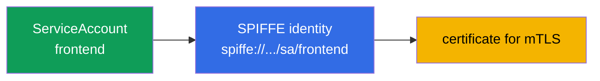
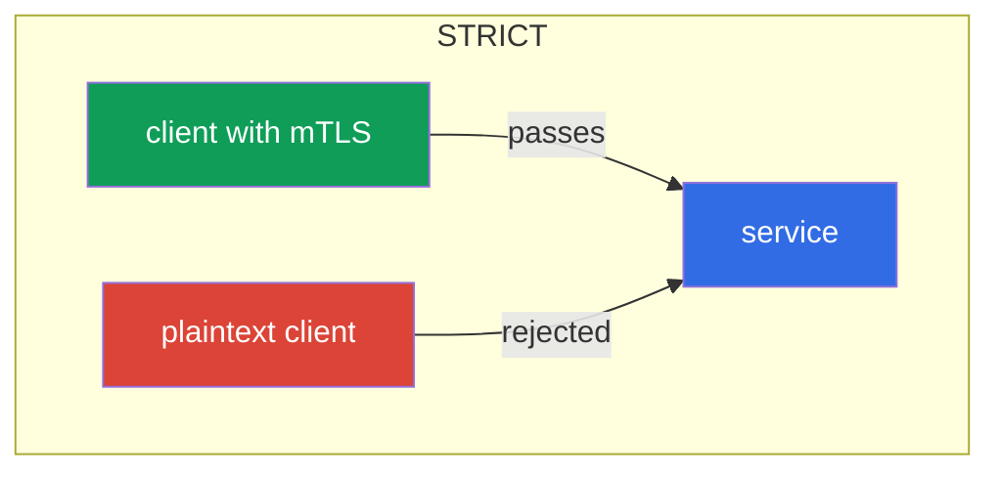
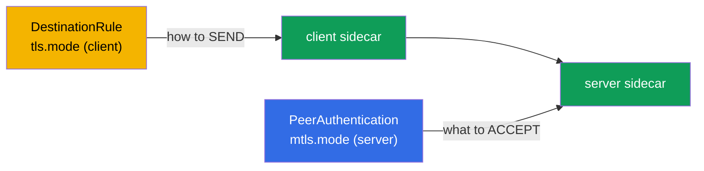

[RU version](ru.md)

# Chapter 13. mTLS and PeerAuthentication: the Zero Trust model

> **What's next.** The second big exam domain begins - security. By default, inside the
> cluster any pod can reach any service, and traffic between them travels in cleartext. In this
> chapter we build the security foundation: mutual TLS (mTLS) between services and managing it
> through PeerAuthentication. This is the basis of the Zero Trust model.

## 13.1. The problem: a flat trusted network

In an ordinary cluster the network is "flat": if pod A knows pod B's address, it can reach it,
and the traffic goes unencrypted. Nobody checks who is actually knocking. For an attacker who
has got inside, this is a gift: they can freely move between services and eavesdrop on traffic.

The **Zero Trust** model ("trust no one") turns this around: by default we trust no connection
until it has proven it can be trusted. In Istio the first step toward this is mutual TLS
between all services.

## 13.2. Identity and SPIFFE

To encrypt and verify traffic, each service needs an **identity**. In Istio it is built on the
Kubernetes ServiceAccount and expressed according to the **SPIFFE** standard.

**SPIFFE** (Secure Production Identity Framework For Everyone) is an open standard (a CNCF
project) that describes how to issue services a verifiable identity without tying it to the
network (IP, port, host name are unreliable and change). An identity in SPIFFE is a string
identifier (SPIFFE ID) in the form of a URI, and it is "packaged" into a certificate of a
special format (SVID) with which the service proves who it is. The standard is vendor-neutral,
so such an identity is understandable beyond Istio too. In Istio a SPIFFE ID looks like this:

```
spiffe://cluster.local/ns/<namespace>/sa/<serviceaccount>
```

It reads simply: a service from namespace `<namespace>` with ServiceAccount `<serviceaccount>`
in the trust domain `cluster.local`.



That is, the very ServiceAccount you used in CKA for access to the Kubernetes API here becomes
the cryptographic identity of the service in the mesh. It is by this identity that Istio
encrypts traffic and later (in chapter 14) decides who may do what.

**What if the ServiceAccount is not set?** In Kubernetes a pod **always** has a ServiceAccount:
if you did not set it explicitly, the pod gets the `default` SA of its namespace. "No identity"
does not happen — what happens is the `default` **identity**. Hence an important consequence: if
a dozen different services run without their own SA, they all get the **same** SPIFFE identity
(`spiffe://.../sa/default`). For mTLS encryption this is not critical, but for authorization
(chapter 14) it is a problem: they cannot be told apart, and a rule "allow only `frontend`"
cannot be separated from the others. So the best practice is **a dedicated ServiceAccount per
service** (or at least per group with the same rights).

**What if the pod has no sidecar (outside the mesh)?** In Istio it is the sidecar that provides
the identity: it receives a certificate from istiod and presents it. A pod without a sidecar
(not injected, or in a namespace without `istio-injection`) **has no SPIFFE identity and no
certificate** and sends plain cleartext. The behavior depends on the mode of the receiving
server (13.4):

- a server in **`PERMISSIVE`** will accept such a connection (in cleartext) - this is what
  allows a mesh to be adopted gradually;
- a server in **`STRICT`** will **reject** it: no mTLS - no connection.

And from the authorization standpoint, traffic from such a pod has **no verified identity**
(`source.principal` is empty), so principal-based rules cannot apply to it - at most by IP,
which is unreliable. Conclusion: for a service to have a real identity, it must be in the mesh
(with a sidecar), otherwise for Zero Trust it is "anonymous".

## 13.3. Automatic mTLS

Istio's main convenience: mTLS works **automatically**, you do not need to fiddle with
certificates. istiod acts as a certificate authority (CA):

- issues each sidecar a certificate with its SPIFFE identity;
- automatically rotates these certificates (by default every day);
- delivers them to Envoy over SDS (remember from chapter 4 - Secret Discovery Service).

When one sidecar connects to another, they perform a **mutual** TLS handshake: both sides
present certificates and verify each other. In ordinary TLS (as in chapter 9) the server proves
to the client who it is. In mutual TLS **both** sides prove their identity. As a result the
traffic is both encrypted and authenticated - all without a single line in the application
code.

## 13.4. PeerAuthentication: mTLS modes

What governs how services accept incoming connections is the `PeerAuthentication` resource. It
has three modes:

| Mode | What the server accepts | When to use |
|------|-------------------------|-------------|
| `PERMISSIVE` | both mTLS and plaintext | default, transition period |
| `STRICT` | only mTLS | the goal for Zero Trust |
| `DISABLE` | only plaintext | disable mTLS (rare, for debugging) |

By default Istio runs in `PERMISSIVE`: a service accepts both encrypted and cleartext traffic.
This is done so a mesh can be adopted gradually without breaking those not yet in the mesh.

Enable strict mTLS for a whole namespace:

```yaml
apiVersion: security.istio.io/v1
kind: PeerAuthentication
metadata:
  name: default         # the name default + no selector = for the whole namespace
  namespace: app
spec:
  mtls:
    mode: STRICT
```



In `STRICT` mode the service rejects any unencrypted traffic. A client without a sidecar (which
sends plaintext) simply cannot establish a connection.

## 13.5. Policy scope

`PeerAuthentication` can be applied at three levels, and it is important to understand this:

- **The whole mesh** - a policy in the root namespace (`istio-system`) with the name `default`.
- **A namespace** - a policy with the name `default` and no `selector` in the needed namespace
  (as in the example above).
- **Specific pods** - a policy with `selector.matchLabels`, applying only to the selected pods.

```yaml
spec:
  selector:
    matchLabels:
      app: payments     # only payments pods
  mtls:
    mode: STRICT
```

A narrower policy overrides a broader one. For example, you can enable `STRICT` for the whole
mesh but leave `PERMISSIVE` for a single legacy service via a policy with a selector.

There is an even finer level - **an individual port**. Via `portLevelMtls` you can set a mode
for specific ports, different from the general one. The classic example: the whole service in
`STRICT`, but the metrics/probe port that something outside the mesh knocks on left in
`PERMISSIVE`:

```yaml
spec:
  selector:
    matchLabels:
      app: payments
  mtls:
    mode: STRICT          # the default for all of the pod's ports
  portLevelMtls:
    9090:
      mode: PERMISSIVE    # but on port 9090 (metrics) we also allow plaintext
```

## 13.6. Client and server: PeerAuthentication vs DestinationRule

It is important to understand the division of roles, otherwise it is easy to get mysterious
`503`s.

- **`PeerAuthentication` governs only the server (inbound) side** - what the service agrees to
  **accept** (mTLS, plaintext or both).
- **The client (outbound) side** - how the sending sidecar establishes the connection - is
  determined by **auto-mTLS**: Istio itself sees that the recipient has a sidecar and sends
  mTLS. The client mode is set explicitly in a `DestinationRule` via `trafficPolicy.tls.mode:
  ISTIO_MUTUAL`.

Normally you do not need to think about this - auto-mTLS reconciles the sides itself. The
problem arises when someone manually sets a `DestinationRule` with a `tls.mode` that conflicts
with `PeerAuthentication`:

- The server in `STRICT`, and the client's `DestinationRule` with `mode: DISABLE` (or `SIMPLE`)
  → the client sends plaintext, the server requires mTLS → **the connection breaks, `503`**.
- The reverse situation (`DestinationRule` requires `ISTIO_MUTUAL`, while the server is in
  `DISABLE`) is also an error.



The rule: the client mode (`DestinationRule`) and the server mode (`PeerAuthentication`) must
be consistent. If you do not touch `tls` in the DestinationRule, auto-mTLS reconciles
everything itself - and that is the recommended path.

## 13.7. Migrating PERMISSIVE to STRICT without downtime

Enabling `STRICT` head-on on a live cluster is dangerous: all clients that still send plaintext
(not in the mesh, legacy applications) fall off instantly. The right path is a gradual
migration, and `PERMISSIVE` was created precisely for it.

The order is as follows:

1. **Start in PERMISSIVE** (this is the default). The service accepts both mTLS and plaintext,
   nothing breaks.
2. **Bring clients into the mesh.** Gradually add sidecars to everyone who reaches the service.
   As soon as a client has a sidecar, it automatically starts going over mTLS (the service in
   PERMISSIVE accepts it).
3. **Verify there is no more plaintext.** Metrics and logs help confirm: check whether any
   unencrypted connections to the service remain.
4. **Switch to STRICT.** When all traffic already goes over mTLS, enable `STRICT`. Now plaintext
   is forbidden, but since none was left anyway, nobody is affected.


The key idea: `PERMISSIVE` is not "insecure forever", but a safe bridge from plaintext to
strict mTLS.

## 13.8. Kubernetes probes and STRICT mTLS

A practical pitfall people often trip over when enabling STRICT mTLS. Pod health checks
(liveness/readiness/startup) are sent by the **kubelet** - directly to the pod, and the kubelet
is **outside the mesh**: it has no sidecar and no mTLS identity. If STRICT mTLS is required on
the application port, the sidecar expects an encrypted connection while the kubelet sends plain
HTTP - the probe fails, the pod is considered "unhealthy" and goes into a restart loop.

Istio solves this automatically: on injection it **rewrites the HTTP probes** (the
`rewriteAppHTTPProbers` parameter, on by default). The probe from the kubelet is redirected to
the pilot-agent inside the sidecar, which proxies it to the application over localhost,
bypassing mTLS.


What is important to remember:

- For HTTP and gRPC probes this works **out of the box**; the behavior is controlled by the
  `sidecar.istio.io/rewriteAppHTTPProbers` annotation.
- If the rewrite is **disabled** under STRICT mTLS, HTTP probes will start failing and pods will
  restart in a loop (CrashLoop). This is a common cause of problems **right after enabling the
  mesh** - if pods are "stuck" in restarts after injection, check the probes.
- **TCP probes** usually do not suffer - they merely check that the port is open. **exec
  probes** run inside the container and do not touch the mesh.

## 13.9. Verifying mTLS

Enabling mTLS is not enough - you need to make sure the traffic is really encrypted. Several
ways.

**`istioctl` describe** will show, per pod, whether mTLS is in effect and which policy applies:

```bash
istioctl x describe pod <pod> -n app
# in the output: "Effective PeerAuthentication mode: STRICT" and so on
```

**The Envoy configuration** - you can see which mode is negotiated for inbound listeners:

```bash
istioctl proxy-config listeners <pod> -n app -o json | grep -i tlsMode
```

**Envoy metrics** - each connection has a security marker. If traffic goes over mTLS, the
metrics show `connection_security_policy="mutual_tls"`:

```bash
kubectl exec <pod> -c istio-proxy -n app -- \
  pilot-agent request GET stats/prometheus | grep connection_security_policy
```

It is even more convenient to look at this visually: **Kiali** (chapter 16) draws a "lock" on
the graph edges where traffic is protected by mTLS. If you expected `STRICT` but there is no
lock, or the metrics show `connection_security_policy="none"`, the traffic is still plaintext -
look for the cause (a client without a sidecar or a `DestinationRule` conflict, see 13.6).

## 13.10. mTLS is not authorization yet

It is important not to overrate mTLS. It answers the question **"can this connection be trusted
and who is on the other end?"** - that is, it encrypts the channel and confirms the peer's
identity. But it does **not** limit what exactly that peer is allowed to do.

Example: you enabled `STRICT` mTLS. Now a client without a sidecar cannot reach the `payments`
service. But any service in the mesh with its own valid mTLS certificate can still reach
`payments`. To say "payments may be reached only from frontend and only with GET" you need a
different mechanism - `AuthorizationPolicy`, and that is the subject of the next chapter 14.
mTLS and authorization work together: authorization relies on the identity that mTLS provides.

## 13.11. Threat model: what mTLS protects against and what it does not

To apply mTLS correctly, you must understand its boundaries: it closes off quite specific
attacks, but it is not a "silver bullet".

**What it protects against:**

- **Traffic sniffing.** Inside the mesh everything is encrypted - an attacker reading network
  traffic (interception on another pod, mirroring, a compromised network component) sees only
  ciphertext.
- **Identity spoofing over the network.** You cannot pose as a service just by knowing its IP
  or name: without a valid certificate with the right SPIFFE ID, a server in `STRICT` will not
  accept the connection.
- **Lateral movement from a "foreign" pod.** A pod without a sidecar (or outside the mesh)
  cannot reach services in `STRICT`.
- **MITM inside the cluster.** Mutual certificate verification prevents wedging into the middle.

**What it does NOT protect against:**

- **Node compromise.** This is the key point. Workloads' private keys and certificates live in
  the memory of the sidecars (Envoy) and are delivered over SDS through a socket on the node.
  If an attacker escaped the container and got **root on the node**, they:
  - read the keys/certificates of **all pods running on that node** and can pose as their SPIFFE
    identities - for the mesh this will be legitimate traffic;
  - grab the mounted **ServiceAccount tokens** of these pods and act on their behalf both to the
    Kubernetes API and to mesh services.

  Keys of pods on **other** nodes they will not obtain this way (they are not there), so the
  blast radius is the identities of the node's co-tenants. But within the node mTLS is no longer
  a barrier.
- **A compromised application.** If the service itself is breached, it has a valid identity -
  mTLS will honestly confirm it. Limiting what this service can do is the job of
  `AuthorizationPolicy` (chapter 14), not mTLS.
- **Application-level vulnerabilities** (injections, logic bugs) - mTLS is about transport, not
  logic.

**Conclusion and defense-in-depth.** mTLS raises the bar for network attacks, but taking over a
node = taking over its pods' identities. So mTLS is complemented by:

- protection against container escape (forbidding privileged, dropping capabilities,
  `runAsNonRoot`, a read-only rootfs, seccomp, AppArmor/SELinux, Pod Security Standards +
  admission control, sandbox runtimes like gVisor/Kata) - this is the CKS domain;
- isolating valuable workloads onto dedicated nodes (taints/`nodeSelector`) so they do not
  co-reside with untrusted ones;
- devaluing stolen credentials: short-lived bound tokens, `automountServiceAccountToken:
  false`, RBAC least-privilege, a short certificate TTL;
- authorization with `AuthorizationPolicy` (least-privilege in the mesh) and runtime detection
  (Falco, audit), so anomalous use of an identity is visible.

## 13.12. Best practices

- **The goal is `STRICT` for the whole mesh**, but reach it through `PERMISSIVE` and traffic
  verification (13.7), not head-on.
- **Do not touch `tls` in a `DestinationRule` without need.** Auto-mTLS reconciles the sides
  itself; a manual `mode` is a common cause of `503` on a conflict with `PeerAuthentication`
  (13.6).
- **Make exceptions surgically.** Legacy outside the mesh - via `PERMISSIVE` with a `selector`
  or `portLevelMtls` on a specific port, not by rolling back the whole mesh.
- **Do not disable `rewriteAppHTTPProbers`.** Otherwise STRICT mTLS will break the HTTP probes
  and drop pods into CrashLoop (13.8).
- **Verify that mTLS really works** (13.9): the `connection_security_policy` metric, `istioctl x
  describe`, the lock in Kiali - do not rely on "enabled it and that's it".
- **Base identity on meaningful ServiceAccounts.** Do not run everything under the `default` SA:
  the SPIFFE identity = namespace + ServiceAccount, and authorization will rely on the same one
  (chapter 14).
- **mTLS is not a replacement for authorization.** STRICT encrypts and confirms identity, but
  access is limited by `AuthorizationPolicy` (chapter 14).

## 13.13. Chapter summary

- A cluster's flat network is insecure; the Zero Trust model requires encrypting and
  authenticating traffic between services.
- A service's identity is built from the ServiceAccount and expressed via SPIFFE
  (`spiffe://.../ns/.../sa/...`).
- A pod always has an SA (by default `default`); without their own SA services share one
  identity and cannot be told apart in authorization - give each service its own
  ServiceAccount. A pod without a sidecar has no identity: it sends plaintext (accepted by
  `PERMISSIVE`, rejected by `STRICT`) and for authorization stays "anonymous".
- mTLS in Istio is automatic: istiod issues and rotates certificates, delivery over SDS.
- **PeerAuthentication** sets the mode: `PERMISSIVE` (both mTLS and plaintext), `STRICT` (only
  mTLS), `DISABLE`.
- The policy can be applied at the mesh, namespace or specific-pod level; a narrower one
  overrides a broader one.
- Migration to `STRICT` is done through `PERMISSIVE`: bring everyone into the mesh, verify, then
  switch - without downtime.
- mTLS handles "who to trust and encryption", but not "what is allowed" - that is the job of
  AuthorizationPolicy (chapter 14).
- Kubernetes probes come from the kubelet (outside the mesh); under STRICT mTLS Istio by default
  rewrites the HTTP probes (`rewriteAppHTTPProbers`) so they do not fail. Disabling the rewrite
  leads to CrashLoop after enabling the mesh.
- `PeerAuthentication` governs the **server** (inbound) side; the client side is
  auto-mTLS/`DestinationRule`. A conflict of `tls.mode` in a DestinationRule with the server
  policy is a common cause of `503`.
- The mode can also be set for an **individual port** via `portLevelMtls`.
- mTLS must be verified in fact: the `connection_security_policy=mutual_tls` metric, `istioctl x
  describe`/`proxy-config`, the lock in Kiali.
- Threat model: mTLS protects against sniffing, spoofing and lateral movement over the network,
  but **not** against node compromise (root on a node reads its pods' keys and SA tokens) and not
  against a breached application. Defense-in-depth is needed: protection against container escape
  (CKS), isolation of valuable workloads, least-privilege, `AuthorizationPolicy`, runtime
  detection.

## 13.14. Self-check questions

1. What is the Zero Trust model and why does a cluster's flat network contradict it?
2. How is a service's identity built in Istio and what does the ServiceAccount have to do with
   it? What happens to the identity if you do not set your own SA?
3. What identity does a pod without a sidecar have, and how will it talk to services in
   `PERMISSIVE` and in `STRICT`?
4. How does mutual TLS differ from ordinary TLS?
5. What is the difference between the PERMISSIVE and STRICT modes?
6. Why can you not enable STRICT immediately on a live cluster, and how do you migrate correctly?
7. What does mTLS NOT solve and which mechanism is needed for access control?
8. Why can Kubernetes probes break under STRICT mTLS and how does Istio solve this by default?
9. How does `PeerAuthentication` (server) differ from `DestinationRule` (client)? How does their
   mismatch lead to `503`?
10. How do you set the mTLS mode for an individual port?
11. How, in practice, do you make sure traffic really goes over mTLS?
12. What attacks does mTLS protect against and which not? What happens if an attacker gets root
    on a cluster node?
13. Why must mTLS be complemented with defense-in-depth, and with which measures exactly?

## Practice

Practice STRICT mTLS via PeerAuthentication (and see a plaintext client rejected):

🧪 Lab 04: [tasks/ica/labs/04](../../labs/04/README.MD)

Practice a safe migration from PERMISSIVE to STRICT:

🧪 Lab 20: [tasks/ica/labs/20](../../labs/20/README.MD)

---
[Contents](../README.md) · [Chapter 12](../12/en.md) · [Chapter 14](../14/en.md)
