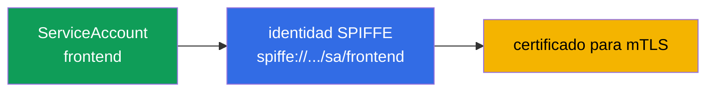
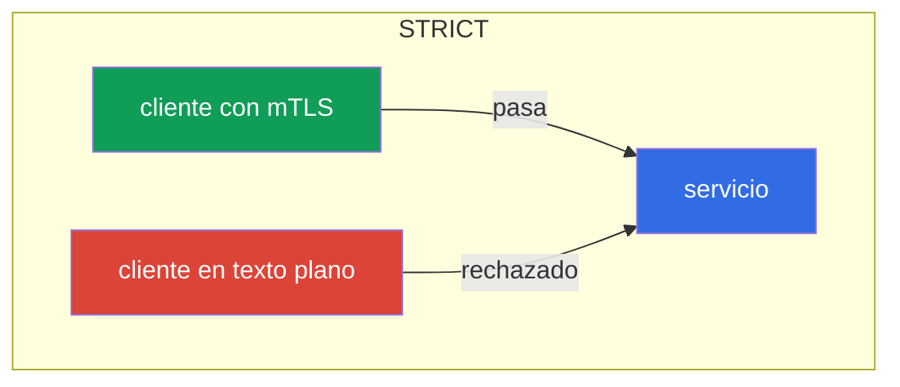
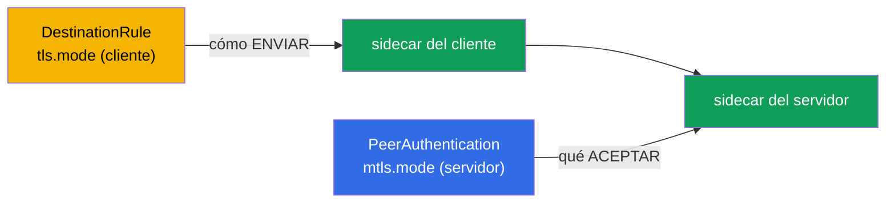
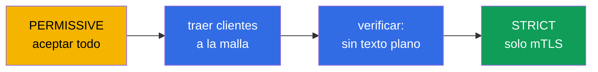
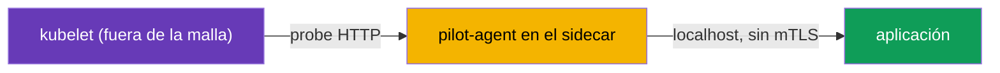

[RU version](ru.md) · [Eng version](en.md) · [Version française](fr.md) · [Deutsche Version](de.md)

# Capítulo 13. mTLS y PeerAuthentication: el modelo Zero Trust

> **Qué sigue.** Empieza el segundo gran dominio del examen: la seguridad. Por defecto, dentro
> del clúster cualquier pod puede alcanzar cualquier servicio, y el tráfico entre ellos viaja en
> texto plano. En este capítulo construimos la base de seguridad: TLS mutuo (mTLS) entre
> servicios y su gestión mediante PeerAuthentication. Esta es la base del modelo Zero Trust.

## 13.1. El problema: una red plana de confianza

En un clúster corriente la red es "plana": si el pod A conoce la dirección del pod B, puede
alcanzarlo, y el tráfico va sin cifrar. Nadie comprueba quién está llamando realmente. Para un
atacante que ha entrado, esto es un regalo: puede moverse libremente entre servicios y espiar el
tráfico.

El modelo **Zero Trust** ("no confíes en nadie") le da la vuelta a esto: por defecto no
confiamos en ninguna conexión hasta que haya demostrado que se puede confiar en ella. En Istio
el primer paso hacia esto es el TLS mutuo entre todos los servicios.

## 13.2. Identidad y SPIFFE

Para cifrar y verificar el tráfico, cada servicio necesita una **identidad**. En Istio se
construye sobre el ServiceAccount de Kubernetes y se expresa según el estándar **SPIFFE**.

**SPIFFE** (Secure Production Identity Framework For Everyone) es un estándar abierto (un
proyecto de la CNCF) que describe cómo emitir a los servicios una identidad verificable sin
atarla a la red (la IP, el puerto, el nombre de host son poco fiables y cambian). Una identidad
en SPIFFE es un identificador de texto (SPIFFE ID) en forma de URI, y se "empaqueta" en un
certificado de un formato especial (SVID) con el que el servicio demuestra quién es. El estándar
es neutral respecto al proveedor, así que tal identidad es comprensible también más allá de
Istio. En Istio un SPIFFE ID tiene este aspecto:

```
spiffe://cluster.local/ns/<namespace>/sa/<serviceaccount>
```

Se lee de forma simple: un servicio del namespace `<namespace>` con el ServiceAccount
`<serviceaccount>` en el dominio de confianza `cluster.local`.



Es decir, el mismo ServiceAccount que usaste en el CKA para el acceso a la API de Kubernetes
aquí se convierte en la identidad criptográfica del servicio en la malla. Es por esta identidad
por la que Istio cifra el tráfico y más adelante (en el capítulo 14) decide quién puede hacer
qué.

**¿Y si el ServiceAccount no está fijado?** En Kubernetes un pod **siempre** tiene un
ServiceAccount: si no lo fijaste explícitamente, el pod obtiene el SA `default` de su namespace.
"Sin identidad" no ocurre; lo que ocurre es la identidad `default`. De ahí una consecuencia
importante: si una docena de servicios distintos se ejecutan sin su propio SA, todos obtienen la
**misma** identidad SPIFFE (`spiffe://.../sa/default`). Para el cifrado mTLS esto no es crítico,
pero para la autorización (capítulo 14) es un problema: no pueden distinguirse, y una regla
"permitir solo a `frontend`" no puede separarse de los demás. Así que la buena práctica es **un
ServiceAccount dedicado por servicio** (o al menos por grupo con los mismos derechos).

**¿Y si el pod no tiene sidecar (fuera de la malla)?** En Istio es el sidecar quien proporciona
la identidad: recibe un certificado de istiod y lo presenta. Un pod sin sidecar (no inyectado, o
en un namespace sin `istio-injection`) **no tiene identidad SPIFFE ni certificado** y envía texto
plano. El comportamiento depende del modo del servidor receptor (13.4):

- un servidor en **`PERMISSIVE`** aceptará tal conexión (en texto plano); esto es lo que permite
  adoptar una malla de forma gradual;
- un servidor en **`STRICT`** la **rechazará**: sin mTLS, no hay conexión.

Y desde el punto de vista de la autorización, el tráfico de tal pod **no tiene identidad
verificada** (`source.principal` está vacío), así que no pueden aplicársele reglas basadas en
principal, a lo sumo por IP, lo cual es poco fiable. Conclusión: para que un servicio tenga una
identidad real, debe estar en la malla (con un sidecar); de lo contrario, para Zero Trust es
"anónimo".

## 13.3. mTLS automático

La principal comodidad de Istio: mTLS funciona **automáticamente**, no necesitas trastear con
certificados. istiod actúa como autoridad certificadora (CA):

- emite a cada sidecar un certificado con su identidad SPIFFE;
- rota automáticamente estos certificados (por defecto cada día);
- los entrega a Envoy por SDS (recuerda del capítulo 4: Secret Discovery Service).

Cuando un sidecar se conecta a otro, realizan un handshake TLS **mutuo**: ambos lados presentan
certificados y se verifican mutuamente. En el TLS corriente (como en el capítulo 9) el servidor
demuestra al cliente quién es. En el TLS mutuo **ambos** lados demuestran su identidad. Como
resultado el tráfico queda a la vez cifrado y autenticado, todo ello sin una sola línea en el
código de la aplicación.

## 13.4. PeerAuthentication: modos de mTLS

Lo que gobierna cómo los servicios aceptan las conexiones entrantes es el recurso
`PeerAuthentication`. Tiene tres modos:

| Modo | Qué acepta el servidor | Cuándo usarlo |
|------|-------------------------|-------------|
| `PERMISSIVE` | tanto mTLS como texto plano | por defecto, periodo de transición |
| `STRICT` | solo mTLS | el objetivo para Zero Trust |
| `DISABLE` | solo texto plano | desactivar mTLS (raro, para depuración) |

Por defecto Istio se ejecuta en `PERMISSIVE`: un servicio acepta tanto tráfico cifrado como en
texto plano. Esto se hace para que una malla pueda adoptarse gradualmente sin romper a los que
aún no están en la malla.

Habilita mTLS estricto para todo un namespace:

```yaml
apiVersion: security.istio.io/v1
kind: PeerAuthentication
metadata:
  name: default         # el nombre default + sin selector = para todo el namespace
  namespace: app
spec:
  mtls:
    mode: STRICT
```



En modo `STRICT` el servicio rechaza cualquier tráfico sin cifrar. Un cliente sin sidecar (que
envía texto plano) simplemente no puede establecer una conexión.

## 13.5. Alcance de la política

`PeerAuthentication` puede aplicarse a tres niveles, y es importante entender esto:

- **Toda la malla**: una política en el namespace raíz (`istio-system`) con el nombre `default`.
- **Un namespace**: una política con el nombre `default` y sin `selector` en el namespace
  necesario (como en el ejemplo de arriba).
- **Pods concretos**: una política con `selector.matchLabels`, que aplica solo a los pods
  seleccionados.

```yaml
spec:
  selector:
    matchLabels:
      app: payments     # solo los pods de payments
  mtls:
    mode: STRICT
```

Una política más estrecha anula una más amplia. Por ejemplo, puedes habilitar `STRICT` para toda
la malla pero dejar `PERMISSIVE` para un único servicio legacy mediante una política con un
selector.

Hay un nivel aún más fino: **un puerto individual**. Vía `portLevelMtls` puedes fijar un modo
para puertos concretos, distinto del general. El ejemplo clásico: todo el servicio en `STRICT`,
pero el puerto de métricas/probe al que algo fuera de la malla llama, dejado en `PERMISSIVE`:

```yaml
spec:
  selector:
    matchLabels:
      app: payments
  mtls:
    mode: STRICT          # el valor por defecto para todos los puertos del pod
  portLevelMtls:
    9090:
      mode: PERMISSIVE    # pero en el puerto 9090 (métricas) también permitimos texto plano
```

## 13.6. Cliente y servidor: PeerAuthentication vs DestinationRule

Es importante entender la división de roles, de lo contrario es fácil toparse con `503`
misteriosos.

- **`PeerAuthentication` gobierna solo el lado del servidor (inbound)**: qué acepta el servicio
  **recibir** (mTLS, texto plano o ambos).
- **El lado del cliente (outbound)** —cómo el sidecar emisor establece la conexión— lo determina
  **auto-mTLS**: Istio mismo ve que el receptor tiene un sidecar y envía mTLS. El modo del
  cliente se fija explícitamente en un `DestinationRule` vía `trafficPolicy.tls.mode:
  ISTIO_MUTUAL`.

Normalmente no necesitas pensar en esto: auto-mTLS concilia los lados por sí mismo. El problema
surge cuando alguien fija manualmente un `DestinationRule` con un `tls.mode` que entra en
conflicto con `PeerAuthentication`:

- El servidor en `STRICT`, y el `DestinationRule` del cliente con `mode: DISABLE` (o `SIMPLE`) →
  el cliente envía texto plano, el servidor requiere mTLS → **la conexión se rompe, `503`**.
- La situación inversa (el `DestinationRule` requiere `ISTIO_MUTUAL`, mientras que el servidor
  está en `DISABLE`) también es un error.



La regla: el modo del cliente (`DestinationRule`) y el modo del servidor (`PeerAuthentication`)
deben ser consistentes. Si no tocas `tls` en el DestinationRule, auto-mTLS lo concilia todo por
sí mismo, y esa es la vía recomendada.

## 13.7. Migrar de PERMISSIVE a STRICT sin caída de servicio

Habilitar `STRICT` de golpe en un clúster vivo es peligroso: todos los clientes que aún envían
texto plano (no en la malla, aplicaciones legacy) se caen al instante. La vía correcta es una
migración gradual, y `PERMISSIVE` se creó precisamente para ello.

El orden es el siguiente:

1. **Empieza en PERMISSIVE** (esto es lo por defecto). El servicio acepta tanto mTLS como texto
   plano, nada se rompe.
2. **Trae a los clientes a la malla.** Añade gradualmente sidecars a todos los que alcanzan el
   servicio. En cuanto un cliente tiene un sidecar, automáticamente empieza a ir por mTLS (el
   servicio en PERMISSIVE lo acepta).
3. **Verifica que ya no hay texto plano.** Las métricas y los logs ayudan a confirmarlo:
   comprueba si quedan conexiones sin cifrar hacia el servicio.
4. **Cambia a STRICT.** Cuando todo el tráfico ya va por mTLS, habilita `STRICT`. Ahora el texto
   plano está prohibido, pero como de todas formas no quedaba ninguno, nadie se ve afectado.



La idea clave: `PERMISSIVE` no es "inseguro para siempre", sino un puente seguro del texto plano
al mTLS estricto.

## 13.8. Probes de Kubernetes y mTLS STRICT

Un escollo práctico con el que la gente suele tropezar al habilitar mTLS STRICT. Los health
checks del pod (liveness/readiness/startup) los envía el **kubelet**, directamente al pod, y el
kubelet está **fuera de la malla**: no tiene sidecar ni identidad mTLS. Si se requiere mTLS
STRICT en el puerto de la aplicación, el sidecar espera una conexión cifrada mientras el kubelet
envía HTTP plano; la probe falla, el pod se considera "no sano" y entra en un bucle de reinicios.

Istio lo resuelve automáticamente: en la inyección **reescribe las probes HTTP** (el parámetro
`rewriteAppHTTPProbers`, activado por defecto). La probe del kubelet se redirige al pilot-agent
dentro del sidecar, que se la pasa a la aplicación por localhost, esquivando mTLS.



Qué es importante recordar:

- Para probes HTTP y gRPC esto funciona **de fábrica**; el comportamiento se controla con la
  anotación `sidecar.istio.io/rewriteAppHTTPProbers`.
- Si la reescritura está **desactivada** bajo mTLS STRICT, las probes HTTP empezarán a fallar y
  los pods reiniciarán en bucle (CrashLoop). Esta es una causa común de problemas **justo tras
  habilitar la malla**: si los pods se quedan "atascados" en reinicios tras la inyección,
  comprueba las probes.
- **Las probes TCP** normalmente no sufren: solo comprueban que el puerto está abierto. **Las
  probes exec** se ejecutan dentro del contenedor y no tocan la malla.

## 13.9. Verificar mTLS

Habilitar mTLS no basta: hay que asegurarse de que el tráfico está realmente cifrado. Varias
formas.

**`istioctl` describe** mostrará, por pod, si mTLS está en efecto y qué política aplica:

```bash
istioctl x describe pod <pod> -n app
# en la salida: "Effective PeerAuthentication mode: STRICT" y demás
```

**La configuración de Envoy**: puedes ver qué modo se negocia para los listeners inbound:

```bash
istioctl proxy-config listeners <pod> -n app -o json | grep -i tlsMode
```

**Las métricas de Envoy**: cada conexión tiene un marcador de seguridad. Si el tráfico va por
mTLS, las métricas muestran `connection_security_policy="mutual_tls"`:

```bash
kubectl exec <pod> -c istio-proxy -n app -- \
  pilot-agent request GET stats/prometheus | grep connection_security_policy
```

Es aún más cómodo mirar esto de forma visual: **Kiali** (capítulo 16) dibuja un "candado" en las
aristas del grafo donde el tráfico está protegido por mTLS. Si esperabas `STRICT` pero no hay
candado, o las métricas muestran `connection_security_policy="none"`, el tráfico sigue siendo
texto plano: busca la causa (un cliente sin sidecar o un conflicto de `DestinationRule`, ver
13.6).

## 13.10. mTLS todavía no es autorización

Es importante no sobrevalorar mTLS. Responde a la pregunta **"¿se puede confiar en esta conexión
y quién está al otro extremo?"**: es decir, cifra el canal y confirma la identidad del par. Pero
**no** limita qué exactamente se le permite hacer a ese par.

Ejemplo: habilitaste mTLS `STRICT`. Ahora un cliente sin sidecar no puede alcanzar el servicio
`payments`. Pero cualquier servicio de la malla con su propio certificado mTLS válido todavía
puede alcanzar `payments`. Para decir "a payments solo se puede llegar desde frontend y solo con
GET" necesitas un mecanismo distinto: `AuthorizationPolicy`, y ese es el tema del siguiente
capítulo 14. mTLS y la autorización trabajan juntos: la autorización se apoya en la identidad
que proporciona mTLS.

## 13.11. Modelo de amenazas: de qué protege mTLS y de qué no

Para aplicar mTLS correctamente, debes entender sus límites: cierra ataques bastante concretos,
pero no es una "bala de plata".

**De qué protege:**

- **Sniffing de tráfico.** Dentro de la malla todo está cifrado; un atacante que lee el tráfico
  de red (interceptación en otro pod, mirroring, un componente de red comprometido) solo ve
  texto cifrado.
- **Suplantación de identidad por la red.** No puedes hacerte pasar por un servicio solo con
  conocer su IP o nombre: sin un certificado válido con el SPIFFE ID correcto, un servidor en
  `STRICT` no aceptará la conexión.
- **Movimiento lateral desde un pod "ajeno".** Un pod sin sidecar (o fuera de la malla) no puede
  alcanzar servicios en `STRICT`.
- **MITM dentro del clúster.** La verificación mutua de certificados impide colarse en el medio.

**De qué NO protege:**

- **Compromiso del nodo.** Este es el punto clave. Las claves privadas y los certificados de las
  cargas de trabajo viven en la memoria de los sidecars (Envoy) y se entregan por SDS a través de
  un socket en el nodo. Si un atacante escapó del contenedor y consiguió **root en el nodo**:
  - lee las claves/certificados de **todos los pods que se ejecutan en ese nodo** y puede
    hacerse pasar por sus identidades SPIFFE; para la malla esto será tráfico legítimo;
  - se apodera de los **tokens de ServiceAccount** montados de esos pods y actúa en su nombre
    tanto hacia la API de Kubernetes como hacia los servicios de la malla.

  Las claves de los pods en **otros** nodos no las obtendrá así (no están ahí), así que el radio
  de impacto son las identidades de los co-inquilinos del nodo. Pero dentro del nodo mTLS ya no
  es una barrera.
- **Una aplicación comprometida.** Si el propio servicio se ve vulnerado, tiene una identidad
  válida: mTLS la confirmará honestamente. Limitar qué puede hacer ese servicio es tarea de
  `AuthorizationPolicy` (capítulo 14), no de mTLS.
- **Vulnerabilidades a nivel de aplicación** (inyecciones, errores de lógica): mTLS trata del
  transporte, no de la lógica.

**Conclusión y defensa en profundidad.** mTLS eleva el listón de los ataques de red, pero
apoderarse de un nodo = apoderarse de las identidades de sus pods. Así que mTLS se complementa
con:

- protección contra el escape de contenedor (prohibir privileged, descartar capabilities,
  `runAsNonRoot`, un rootfs de solo lectura, seccomp, AppArmor/SELinux, Pod Security Standards +
  admission control, runtimes de sandbox como gVisor/Kata): este es el dominio del CKS;
- aislar cargas de trabajo valiosas en nodos dedicados (taints/`nodeSelector`) para que no
  coexistan con otras no confiables;
- devaluar las credenciales robadas: tokens vinculados de corta duración,
  `automountServiceAccountToken: false`, RBAC de mínimo privilegio, un TTL de certificado corto;
- autorización con `AuthorizationPolicy` (mínimo privilegio en la malla) y detección en runtime
  (Falco, auditoría), para que el uso anómalo de una identidad sea visible.

## 13.12. Buenas prácticas

- **El objetivo es `STRICT` para toda la malla**, pero alcánzalo a través de `PERMISSIVE` y la
  verificación del tráfico (13.7), no de golpe.
- **No toques `tls` en un `DestinationRule` sin necesidad.** Auto-mTLS concilia los lados por sí
  mismo; un `mode` manual es una causa común de `503` por conflicto con `PeerAuthentication`
  (13.6).
- **Haz las excepciones de forma quirúrgica.** Legacy fuera de la malla: vía `PERMISSIVE` con un
  `selector` o `portLevelMtls` en un puerto concreto, no revirtiendo toda la malla.
- **No desactives `rewriteAppHTTPProbers`.** De lo contrario mTLS STRICT romperá las probes HTTP
  y meterá los pods en CrashLoop (13.8).
- **Verifica que mTLS realmente funciona** (13.9): la métrica `connection_security_policy`,
  `istioctl x describe`, el candado en Kiali; no te fíes de "lo habilité y ya".
- **Basa la identidad en ServiceAccounts con significado.** No ejecutes todo bajo el SA
  `default`: la identidad SPIFFE = namespace + ServiceAccount, y la autorización se apoyará en la
  misma (capítulo 14).
- **mTLS no reemplaza a la autorización.** STRICT cifra y confirma la identidad, pero el acceso
  lo limita `AuthorizationPolicy` (capítulo 14).

## 13.13. Resumen del capítulo

- La red plana de un clúster es insegura; el modelo Zero Trust requiere cifrar y autenticar el
  tráfico entre servicios.
- La identidad de un servicio se construye a partir del ServiceAccount y se expresa vía SPIFFE
  (`spiffe://.../ns/.../sa/...`).
- Un pod siempre tiene un SA (por defecto `default`); sin su propio SA los servicios comparten
  una identidad y no pueden distinguirse en la autorización: dale a cada servicio su propio
  ServiceAccount. Un pod sin sidecar no tiene identidad: envía texto plano (aceptado por
  `PERMISSIVE`, rechazado por `STRICT`) y para la autorización queda "anónimo".
- mTLS en Istio es automático: istiod emite y rota certificados, entrega por SDS.
- **PeerAuthentication** fija el modo: `PERMISSIVE` (tanto mTLS como texto plano), `STRICT` (solo
  mTLS), `DISABLE`.
- La política puede aplicarse a nivel de malla, namespace o pods concretos; una más estrecha
  anula una más amplia.
- La migración a `STRICT` se hace a través de `PERMISSIVE`: trae a todos a la malla, verifica,
  luego cambia; sin caída de servicio.
- mTLS se encarga de "en quién confiar y el cifrado", pero no de "qué está permitido": eso es
  tarea de AuthorizationPolicy (capítulo 14).
- Las probes de Kubernetes vienen del kubelet (fuera de la malla); bajo mTLS STRICT Istio por
  defecto reescribe las probes HTTP (`rewriteAppHTTPProbers`) para que no fallen. Desactivar la
  reescritura lleva a CrashLoop tras habilitar la malla.
- `PeerAuthentication` gobierna el lado del **servidor** (inbound); el lado del cliente es
  auto-mTLS/`DestinationRule`. Un conflicto de `tls.mode` en un DestinationRule con la política
  del servidor es una causa común de `503`.
- El modo también puede fijarse para un **puerto individual** vía `portLevelMtls`.
- mTLS debe verificarse de hecho: la métrica `connection_security_policy=mutual_tls`, `istioctl x
  describe`/`proxy-config`, el candado en Kiali.
- Modelo de amenazas: mTLS protege contra sniffing, suplantación y movimiento lateral por la red,
  pero **no** contra el compromiso del nodo (root en un nodo lee las claves y los tokens de SA de
  sus pods) ni contra una aplicación vulnerada. Se necesita defensa en profundidad: protección
  contra el escape de contenedor (CKS), aislamiento de cargas de trabajo valiosas, mínimo
  privilegio, `AuthorizationPolicy`, detección en runtime.

## 13.14. Preguntas de autoevaluación

1. ¿Qué es el modelo Zero Trust y por qué la red plana de un clúster lo contradice?
2. ¿Cómo se construye la identidad de un servicio en Istio y qué tiene que ver el ServiceAccount
   con ello? ¿Qué le pasa a la identidad si no fijas tu propio SA?
3. ¿Qué identidad tiene un pod sin sidecar, y cómo hablará con los servicios en `PERMISSIVE` y en
   `STRICT`?
4. ¿En qué se diferencia el TLS mutuo del TLS corriente?
5. ¿Cuál es la diferencia entre los modos PERMISSIVE y STRICT?
6. ¿Por qué no puedes habilitar STRICT de inmediato en un clúster vivo, y cómo migras
   correctamente?
7. ¿Qué NO resuelve mTLS y qué mecanismo se necesita para el control de acceso?
8. ¿Por qué pueden romperse las probes de Kubernetes bajo mTLS STRICT y cómo lo resuelve Istio
   por defecto?
9. ¿En qué se diferencia `PeerAuthentication` (servidor) de `DestinationRule` (cliente)? ¿Cómo
   lleva su desajuste a `503`?
10. ¿Cómo fijas el modo de mTLS para un puerto individual?
11. En la práctica, ¿cómo te aseguras de que el tráfico realmente va por mTLS?
12. ¿De qué ataques protege mTLS y de cuáles no? ¿Qué pasa si un atacante consigue root en un
    nodo del clúster?
13. ¿Por qué debe complementarse mTLS con defensa en profundidad, y con qué medidas exactamente?

## Práctica

Practica mTLS STRICT vía PeerAuthentication (y observa cómo se rechaza un cliente en texto
plano):

🧪 Laboratorio 04: [tasks/ica/labs/04](../../labs/04/README_ES.MD)

Practica una migración segura de PERMISSIVE a STRICT:

🧪 Laboratorio 20: [tasks/ica/labs/20](../../labs/20/README_ES.MD)

---
[Índice](../README_ES.md) · [Capítulo 12](../12/es.md) · [Capítulo 14](../14/es.md)
