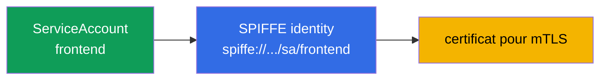
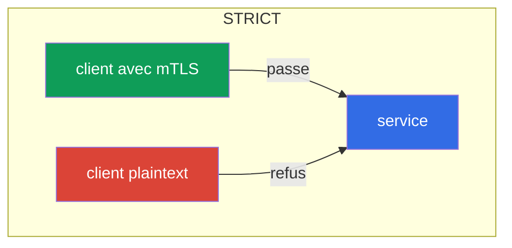
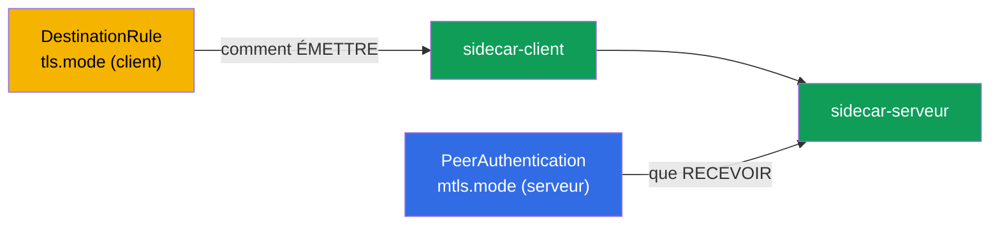

[RU version](ru.md) · [Eng version](en.md) · [Versión en español](es.md) · [Deutsche Version](de.md)

# Chapitre 13. mTLS et PeerAuthentication : le modèle Zero Trust

> **La suite.** Commence le deuxième grand domaine de l'examen - la sécurité. Par
> défaut, à l'intérieur du cluster, n'importe quel pod peut atteindre n'importe quel
> service, et le trafic entre eux circule en clair. Dans ce chapitre, nous poserons les
> fondations de la sécurité : le TLS mutuel (mTLS) entre les services et sa gestion via
> PeerAuthentication. C'est la base du modèle Zero Trust.

## 13.1. Le problème : un réseau de confiance plat

Dans un cluster ordinaire, le réseau est « plat » : si le pod A connaît l'adresse du
pod B, il peut s'adresser à lui, et le trafic circulera en clair. Personne ne vérifie
qui frappe réellement à la porte. Pour un attaquant qui a pénétré à l'intérieur, c'est
un cadeau : il peut circuler librement entre les services et écouter le trafic.

Le modèle **Zero Trust** (« ne fais confiance à personne ») renverse cela : par défaut,
on ne fait confiance à aucune connexion tant qu'elle n'a pas prouvé qu'on peut lui faire
confiance. Dans Istio, le premier pas dans cette direction est le TLS mutuel entre tous
les services.

## 13.2. Identity et SPIFFE

Pour chiffrer et vérifier le trafic, chaque service a besoin d'une **identité**
(identity). Dans Istio, elle est construite à partir du ServiceAccount Kubernetes et
formalisée selon le standard **SPIFFE**.

**SPIFFE** (Secure Production Identity Framework For Everyone) est un standard ouvert
(projet CNCF) qui décrit comment attribuer aux services une identité vérifiable, sans se
lier au réseau (IP, port, nom d'hôte sont peu fiables et changent). Une identité dans
SPIFFE est une chaîne-identifiant (SPIFFE ID) sous forme d'URI, et elle est
« empaquetée » dans un certificat d'un format spécifique (SVID) par lequel le service
prouve qui il est. Le standard est neutre vis-à-vis des fournisseurs, donc une telle
identité reste compréhensible en dehors d'Istio. Dans Istio, un SPIFFE ID ressemble à
ceci :

```
spiffe://cluster.local/ns/<namespace>/sa/<serviceaccount>
```

Cela se lit simplement : le service du namespace `<namespace>` avec le ServiceAccount
`<serviceaccount>` dans le domaine de confiance `cluster.local`.



Autrement dit, ce même ServiceAccount que vous utilisiez dans CKA pour accéder à l'API
Kubernetes devient ici l'identité cryptographique du service dans le maillage. C'est
précisément par cette identité qu'Istio chiffre le trafic et décide ensuite (au
chapitre 14) qui a le droit de faire quoi.

**Et si aucun ServiceAccount n'est défini ?** Dans Kubernetes, un pod a **toujours** un
ServiceAccount : si vous ne l'avez pas indiqué explicitement, le pod reçoit le SA
`default` de son namespace. « Pas d'identité » n'existe pas - il y a une **identité
`default`**. D'où une conséquence importante : si une dizaine de services différents sont
lancés sans leur propre SA, ils reçoivent tous **la même** identité SPIFFE
(`spiffe://.../sa/default`). Pour le chiffrement mTLS, ce n'est pas critique, mais pour
l'autorisation (chapitre 14) - c'est un problème : il devient impossible de les
distinguer, et la règle « ne laisser passer que `frontend` » ne peut être séparée des
autres. C'est pourquoi la best practice est **un ServiceAccount par service** (ou au
moins par groupe ayant les mêmes droits).

**Et si un pod est sans sidecar (hors du maillage) ?** L'identité dans Istio est donnée
justement par le sidecar : il reçoit un certificat d'istiod et le présente. Un pod sans
sidecar (non injecté, ou dans un namespace sans `istio-injection`) **n'a aucune identité
SPIFFE ni certificat** et envoie du plaintext ordinaire. Le comportement dépend du mode
du serveur destinataire (13.4) :

- serveur en **`PERMISSIVE`** - il acceptera une telle connexion (en clair), c'est ce qui
  permet d'adopter le maillage progressivement ;
- serveur en **`STRICT`** - il **rejettera** : pas de mTLS, pas de connexion.

Et du point de vue de l'autorisation, le trafic d'un tel pod **n'a aucune identité
vérifiée** (`source.principal` est vide), donc les règles par principals ne peuvent pas
lui être appliquées - tout au plus par IP, ce qui est peu fiable. Conclusion : pour qu'un
service ait une vraie identity, il doit être dans le maillage (avec un sidecar), sinon,
pour le Zero Trust, il est « anonyme ».

## 13.3. mTLS automatique

Le principal avantage d'Istio : le mTLS fonctionne **automatiquement**, vous n'avez pas à
vous occuper des certificats. istiod fait office d'autorité de certification (CA) :

- il délivre à chaque sidecar un certificat avec son identité SPIFFE ;
- il fait tourner (rotation) ces certificats automatiquement (par défaut chaque jour) ;
- il les livre à Envoy via SDS (rappelez-vous du chapitre 4 - Secret Discovery Service).

Quand un sidecar se connecte à un autre, ils réalisent un handshake TLS **mutuel** : les
deux parties présentent leurs certificats et se vérifient mutuellement. Dans le TLS
ordinaire (comme au chapitre 9), le serveur prouve au client qui il est. Dans le mutual
TLS, **les deux** parties prouvent leur identité. Résultat : le trafic est à la fois
chiffré et authentifié - et tout cela sans une seule ligne dans le code de l'application.

## 13.4. PeerAuthentication : les modes mTLS

La ressource `PeerAuthentication` gère la façon dont les services acceptent les connexions
entrantes. Elle a trois modes :

| Mode | Ce que le serveur accepte | Quand l'utiliser |
|-------|----------------------|--------------------|
| `PERMISSIVE` | mTLS et plaintext | valeur par défaut, période de transition |
| `STRICT` | uniquement mTLS | objectif pour le Zero Trust |
| `DISABLE` | uniquement plaintext | désactiver mTLS (rarement, pour le débogage) |

Par défaut, Istio fonctionne en `PERMISSIVE` : le service accepte à la fois le trafic
chiffré et le trafic en clair. C'est fait pour pouvoir adopter le maillage
progressivement, sans casser ceux qui ne sont pas encore dans le maillage.

Activer le mTLS strict sur tout le namespace :

```yaml
apiVersion: security.istio.io/v1
kind: PeerAuthentication
metadata:
  name: default         # nom default + sans selector = sur tout le namespace
  namespace: app
spec:
  mtls:
    mode: STRICT
```



En mode `STRICT`, le service rejette tout trafic non chiffré. Un client sans sidecar
(qui envoie du plaintext) ne pourra tout simplement pas établir de connexion.

## 13.5. Portée de la politique

`PeerAuthentication` peut s'appliquer à trois niveaux, et il est important de le
comprendre :

- **Tout le maillage** - une politique dans le namespace racine (`istio-system`) avec le
  nom `default`.
- **Namespace** - une politique avec le nom `default` et sans `selector` dans le namespace
  voulu (comme dans l'exemple ci-dessus).
- **Pods spécifiques** - une politique avec `selector.matchLabels`, qui n'agit que sur les
  pods sélectionnés.

```yaml
spec:
  selector:
    matchLabels:
      app: payments     # uniquement les pods payments
  mtls:
    mode: STRICT
```

Une politique plus étroite redéfinit une politique plus large. Par exemple, on peut
activer `STRICT` sur tout le maillage, mais laisser `PERMISSIVE` pour un service legacy via
une politique avec selector.

Il existe un niveau encore plus fin - le **port individuel**. Via `portLevelMtls`, on peut
définir pour des ports spécifiques un mode différent du mode général. Exemple classique :
tout le service en `STRICT`, mais le port des métriques/vérifications, auquel accède
quelque chose hors du maillage, reste en `PERMISSIVE` :

```yaml
spec:
  selector:
    matchLabels:
      app: payments
  mtls:
    mode: STRICT          # par défaut pour tous les ports du pod
  portLevelMtls:
    9090:
      mode: PERMISSIVE    # mais sur le port 9090 (métriques) on laisse passer aussi le plaintext
```

## 13.6. Client et serveur : PeerAuthentication vs DestinationRule

Il est important de comprendre la répartition des rôles, sinon on obtient facilement de
mystérieux `503`.

- **`PeerAuthentication` ne gère que le côté serveur (entrant)** - ce que le service
  accepte de **recevoir** (mTLS, plaintext ou les deux).
- **Le côté client (sortant)** - la façon dont le sidecar émetteur établit la connexion -
  est déterminé par l'**auto-mTLS** : Istio voit lui-même que le destinataire a un sidecar
  et envoie du mTLS. Le mode client explicite se définit dans une `DestinationRule` via
  `trafficPolicy.tls.mode: ISTIO_MUTUAL`.

Normalement, il n'y a pas à y penser - l'auto-mTLS accorde les parties tout seul. Le
problème apparaît quand quelqu'un place manuellement une `DestinationRule` avec un
`tls.mode` en conflit avec `PeerAuthentication` :

- Serveur en `STRICT`, mais `DestinationRule` du client avec `mode: DISABLE` (ou `SIMPLE`)
  → le client envoie du plaintext, le serveur exige du mTLS → **la connexion se rompt,
  `503`**.
- Situation inverse (`DestinationRule` exige `ISTIO_MUTUAL`, mais serveur en `DISABLE`) -
  c'est aussi une erreur.



Règle : les modes du client (`DestinationRule`) et du serveur (`PeerAuthentication`)
doivent être accordés. Si vous ne touchez pas à `tls` dans la DestinationRule, l'auto-mTLS
accorde tout lui-même - c'est justement la voie recommandée.

## 13.7. Migration de PERMISSIVE vers STRICT sans downtime

Activer `STRICT` « frontalement » sur un cluster en production est dangereux : tous les
clients qui envoient encore du plaintext (hors du maillage, applications legacy) tombent
instantanément. La bonne voie est une migration progressive, et `PERMISSIVE` a été conçu
justement pour cela.

L'ordre est le suivant :

1. **Démarrer en PERMISSIVE** (c'est la valeur par défaut). Le service accepte mTLS et
   plaintext, rien ne casse.
2. **Faire entrer les clients dans le maillage.** Ajoutez progressivement un sidecar à
   tous ceux qui s'adressent au service. Dès qu'un client a un sidecar, il commence
   automatiquement à passer en mTLS (le service en PERMISSIVE l'accepte).
3. **Vérifier qu'il n'y a plus de plaintext.** Les métriques et les logs aident à s'en
   assurer : on regarde s'il reste des connexions non chiffrées vers le service.
4. **Basculer en STRICT.** Quand tout le trafic passe déjà en mTLS, on active `STRICT`.
   Le plaintext est désormais interdit, mais comme il n'en restait déjà plus, personne
   n'est affecté.


Idée clé : `PERMISSIVE` n'est pas « à jamais non sécurisé », mais un pont sûr du plaintext
vers le mTLS strict.

## 13.8. Les probes Kubernetes et le STRICT mTLS

Un écueil pratique sur lequel on trébuche souvent en activant le STRICT mTLS. Les
vérifications de santé du pod (liveness/readiness/startup) sont envoyées par le
**kubelet** - directement vers le pod, et le kubelet se trouve **hors du maillage** : il
n'a ni sidecar ni identité mTLS. Si le port de l'application exige du STRICT mTLS, le
sidecar attend une connexion chiffrée alors que le kubelet envoie du HTTP ordinaire - la
probe échoue, le pod est considéré comme « en mauvaise santé » et part en boucle de
redémarrages.

Istio résout cela automatiquement : lors de l'injection, il **réécrit les probes HTTP**
(paramètre `rewriteAppHTTPProbers`, activé par défaut). La probe du kubelet est redirigée
vers le pilot-agent à l'intérieur du sidecar, qui la relaie ensuite à l'application via
localhost, en contournant le mTLS.


Ce qu'il est important de retenir :

- Pour les probes HTTP et gRPC, cela fonctionne **d'emblée** ; le comportement est géré par
  l'annotation `sidecar.istio.io/rewriteAppHTTPProbers`.
- Si l'on **désactive** la réécriture avec le STRICT mTLS, les probes HTTP commencent à
  échouer et les pods redémarrent en boucle (CrashLoop). C'est une cause fréquente de
  problèmes **juste après l'activation du maillage** - si des pods « restent bloqués » en
  redémarrages après l'injection, vérifiez les probes.
- Les **probes TCP** ne souffrent en général pas - elles vérifient seulement que le port
  est ouvert. Les **probes exec** s'exécutent à l'intérieur du conteneur et ne touchent pas
  au maillage.

## 13.9. Vérification du mTLS

Activer le mTLS ne suffit pas - il faut s'assurer que le trafic est réellement chiffré.
Plusieurs méthodes.

**`istioctl` describe** montre pour un pod si le mTLS s'applique à lui et quelle politique
est en vigueur :

```bash
istioctl x describe pod <pod> -n app
# dans la sortie : "Effective PeerAuthentication mode: STRICT" etc.
```

**La configuration Envoy** - on y voit quel mode est accordé pour les listeners entrants :

```bash
istioctl proxy-config listeners <pod> -n app -o json | grep -i tlsMode
```

**Les métriques Envoy** - chaque connexion a un indicateur de sécurité. Si le trafic passe
en mTLS, les métriques affichent `connection_security_policy="mutual_tls"` :

```bash
kubectl exec <pod> -c istio-proxy -n app -- \
  pilot-agent request GET stats/prometheus | grep connection_security_policy
```

Il est encore plus pratique de le voir visuellement : **Kiali** (chapitre 16) dessine un
« cadenas » sur les arêtes du graphe où le trafic est protégé par mTLS. Si vous attendiez
`STRICT` mais qu'il n'y a pas de cadenas, ou que les métriques affichent
`connection_security_policy="none"` - le trafic est encore en plaintext, cherchez la cause
(client sans sidecar ou conflit de `DestinationRule`, voir 13.6).

## 13.10. Le mTLS n'est pas encore de l'autorisation

Il est important de ne pas surestimer le mTLS. Il répond à la question **« peut-on faire
confiance à cette connexion et qui est à l'autre bout ? »** - c'est-à-dire qu'il chiffre
le canal et confirme l'identité de l'interlocuteur. Mais il **ne** limite **pas** ce que
cet interlocuteur est autorisé à faire.

Exemple : on a activé le `STRICT` mTLS. Désormais, un client sans sidecar ne peut plus
atteindre le service `payments`. Mais n'importe quel service du maillage avec son
certificat mTLS valide peut toujours s'adresser à `payments`. Pour dire « on ne peut
accéder à payments que depuis frontend et uniquement via la méthode GET », il faut déjà un
autre mécanisme - `AuthorizationPolicy`, qui est le sujet du chapitre 14 suivant. Le mTLS
et l'autorisation fonctionnent en tandem : l'autorisation s'appuie sur l'identité que
fournit le mTLS.

## 13.11. Modèle de menaces : contre quoi le mTLS protège, et contre quoi non

Pour appliquer correctement le mTLS, il faut comprendre ses limites : il ferme des attaques
bien précises, mais n'est pas une « balle en argent ».

**Contre quoi il protège :**

- **L'écoute du trafic (sniffing).** À l'intérieur du maillage, tout est chiffré - un
  attaquant qui lit le trafic réseau (interception sur un autre pod, mirroring, composant
  réseau compromis) ne voit que du texte chiffré.
- **L'usurpation d'identité par le réseau (spoofing).** On ne peut pas se faire passer pour
  un service simplement en connaissant son IP ou son nom : sans certificat valide portant
  le bon SPIFFE ID, un serveur en `STRICT` n'acceptera pas la connexion.
- **Le lateral movement depuis un pod « étranger ».** Un pod sans sidecar (ou hors du
  maillage) ne pourra pas atteindre les services en `STRICT`.
- **Le MITM à l'intérieur du cluster.** La vérification mutuelle des certificats empêche de
  s'intercaler au milieu.

**Contre quoi il NE protège PAS :**

- **La compromission d'un nœud.** C'est le point clé. Les clés privées et les certificats
  des workloads vivent dans la mémoire des sidecars (Envoy) et sont livrés via SDS par un
  socket sur le nœud. Si un attaquant s'est échappé d'un conteneur et a obtenu **le root sur
  le nœud**, il :
  - lit les clés/certificats de **tous les pods lancés sur ce nœud** et peut se faire passer
    pour leurs identités SPIFFE - pour le maillage, ce sera du trafic légitime ;
  - récupère les **tokens ServiceAccount** montés de ces pods et agit en leur nom, aussi
    bien vers l'API Kubernetes que vers les services du maillage.

  Il n'obtiendra pas ainsi les clés des pods des **autres** nœuds (elles n'y sont pas),
  donc le rayon d'impact se limite aux identités des voisins du nœud. Mais dans les limites
  du nœud, le mTLS n'est plus une barrière.
- **Une application compromise.** Si le service lui-même est piraté, il possède une identité
  valide - le mTLS la confirmera honnêtement. Limiter ce que ce service peut faire est le
  rôle d'`AuthorizationPolicy` (chapitre 14), pas du mTLS.
- **Les vulnérabilités au niveau applicatif** (injections, bugs logiques) - le mTLS
  concerne le transport, pas la logique.

**Conclusion et defense-in-depth.** Le mTLS relève la barre pour les attaques réseau, mais
la prise d'un nœud = la prise des identités de ses pods. C'est pourquoi le mTLS se complète
avec :

- une protection contre l'évasion de conteneur (interdire privileged, drop capabilities,
  `runAsNonRoot`, rootfs en read-only, seccomp, AppArmor/SELinux, Pod Security Standards +
  contrôle d'admission, runtimes sandbox comme gVisor/Kata) - c'est le domaine de CKS ;
- l'isolation des workloads sensibles sur des nœuds dédiés (taints/`nodeSelector`), pour
  qu'ils ne côtoient pas des workloads non fiables ;
- la dévalorisation des credentials volés : tokens bound à courte durée de vie,
  `automountServiceAccountToken: false`, RBAC least-privilege, TTL court des certificats ;
- l'autorisation via `AuthorizationPolicy` (least-privilege dans le maillage) et la
  détection runtime (Falco, audit), pour qu'un usage anormal de l'identité soit visible.

## 13.12. Best practices

- **Objectif - `STRICT` sur tout le maillage**, mais y arriver via `PERMISSIVE` et la
  vérification du trafic (13.7), pas « frontalement ».
- **Ne touchez pas à `tls` dans `DestinationRule` sans nécessité.** L'auto-mTLS accorde les
  parties tout seul ; un `mode` manuel est une cause fréquente de `503` en cas de conflit
  avec `PeerAuthentication` (13.6).
- **Faites les exceptions de façon ciblée.** Le legacy hors du maillage - via `PERMISSIVE`
  avec `selector` ou `portLevelMtls` sur un port précis, pas en revenant en arrière sur tout
  le maillage.
- **Ne désactivez pas `rewriteAppHTTPProbers`.** Sinon le STRICT mTLS cassera les probes
  HTTP et fera tomber les pods en CrashLoop (13.8).
- **Vérifiez que le mTLS fonctionne réellement** (13.9) : métriques
  `connection_security_policy`, `istioctl x describe`, cadenas dans Kiali - ne vous fiez pas
  à « on l'a activé et c'est bon ».
- **Appuyez l'identity sur des ServiceAccount pertinents.** Ne lancez pas tout sous le SA
  `default` : l'identité SPIFFE = namespace + ServiceAccount, et c'est aussi sur elle que
  s'appuiera l'autorisation (chapitre 14).
- **Le mTLS n'est pas un substitut à l'autorisation.** STRICT chiffre et confirme
  l'identité, mais c'est `AuthorizationPolicy` qui restreint l'accès (chapitre 14).

## 13.13. Résumé du chapitre

- Le réseau plat du cluster n'est pas sûr ; le modèle Zero Trust exige de chiffrer et
  d'authentifier le trafic entre les services.
- L'identité d'un service est construite à partir du ServiceAccount et formalisée selon
  SPIFFE (`spiffe://.../ns/.../sa/...`).
- Un pod a toujours un SA (par défaut `default`) ; sans son propre SA, les services
  partagent une même identité et deviennent indistinguables en autorisation - donnez à
  chaque service son ServiceAccount. Un pod sans sidecar n'a pas d'identité : il envoie du
  plaintext (accepté en `PERMISSIVE`, rejeté en `STRICT`) et reste « anonyme » pour
  l'autorisation.
- Le mTLS dans Istio est automatique : istiod délivre et fait tourner les certificats,
  livraison par SDS.
- **PeerAuthentication** définit le mode : `PERMISSIVE` (mTLS et plaintext), `STRICT`
  (uniquement mTLS), `DISABLE`.
- La politique peut s'appliquer au niveau du maillage, du namespace ou de pods spécifiques ;
  la plus étroite redéfinit la plus large.
- La migration vers `STRICT` se fait via `PERMISSIVE` : faire entrer tout le monde dans le
  maillage, vérifier, puis basculer - sans downtime.
- Le mTLS répond à « à qui faire confiance et chiffrement », mais pas à « ce qui est
  autorisé » - c'est le rôle d'AuthorizationPolicy (chapitre 14).
- Les probes Kubernetes viennent du kubelet (hors du maillage) ; en STRICT mTLS, Istio
  réécrit par défaut les probes HTTP (`rewriteAppHTTPProbers`) pour qu'elles n'échouent pas.
  Désactiver la réécriture mène au CrashLoop après l'activation du maillage.
- `PeerAuthentication` gère le côté **serveur** (entrant) ; le côté client est
  l'auto-mTLS/`DestinationRule`. Un conflit de `tls.mode` dans la DestinationRule avec la
  politique du serveur est une cause fréquente de `503`.
- Le mode peut aussi se définir sur un **port individuel** via `portLevelMtls`.
- Le mTLS doit être vérifié de fait : métriques `connection_security_policy=mutual_tls`,
  `istioctl x describe`/`proxy-config`, cadenas dans Kiali.
- Modèle de menaces : le mTLS protège contre l'écoute, le spoofing et le lateral movement
  par le réseau, mais **pas** contre la compromission d'un nœud (le root sur le nœud lit les
  clés et les tokens SA de ses pods) ni contre une application piratée. Il faut de la
  defense-in-depth : protection contre l'évasion de conteneur (CKS), isolation des workloads
  sensibles, least-privilege, `AuthorizationPolicy`, détection runtime.

## 13.14. Questions d'auto-évaluation

1. Qu'est-ce que le modèle Zero Trust et pourquoi le réseau plat du cluster le contredit-il ?
2. Comment se construit l'identity d'un service dans Istio et quel est le rôle du
   ServiceAccount ? Qu'advient-il de l'identité si l'on ne définit pas son propre SA ?
3. Quelle identité a un pod sans sidecar et comment communiquera-t-il avec les services en
   `PERMISSIVE` et en `STRICT` ?
4. En quoi le mutual TLS diffère-t-il du TLS ordinaire ?
5. Quelle est la différence entre les modes PERMISSIVE et STRICT ?
6. Pourquoi ne peut-on pas activer STRICT d'emblée sur un cluster en production et comment
   migrer correctement ?
7. Que ne résout PAS le mTLS et quel mécanisme est nécessaire pour le contrôle d'accès ?
8. Pourquoi les probes Kubernetes peuvent-elles casser avec le STRICT mTLS et comment Istio
   le résout-il par défaut ?
9. En quoi `PeerAuthentication` (serveur) diffère-t-elle de `DestinationRule` (client) ?
   Comment leur désaccord mène-t-il à un `503` ?
10. Comment définir le mode mTLS pour un port individuel ?
11. Comment s'assurer en pratique que le trafic passe réellement en mTLS ?
12. Contre quelles attaques le mTLS protège-t-il, et contre lesquelles non ? Que se
    passe-t-il si un attaquant obtient le root sur un nœud du cluster ?
13. Pourquoi le mTLS doit-il être complété par de la defense-in-depth et par quelles mesures
    précisément ?

## Pratique

Entraînez-vous au STRICT mTLS via PeerAuthentication (et voyez le refus d'un client
plaintext) :

🧪 Lab 04 : [tasks/ica/labs/04](../../labs/04/README_FR.MD)

Entraînez-vous à la migration sûre de PERMISSIVE vers STRICT :

🧪 Lab 20 : [tasks/ica/labs/20](../../labs/20/README_FR.MD)

---
[Table des matières](../README_FR.md) · [Chapitre 12](../12/fr.md) · [Chapitre 14](../14/fr.md)
